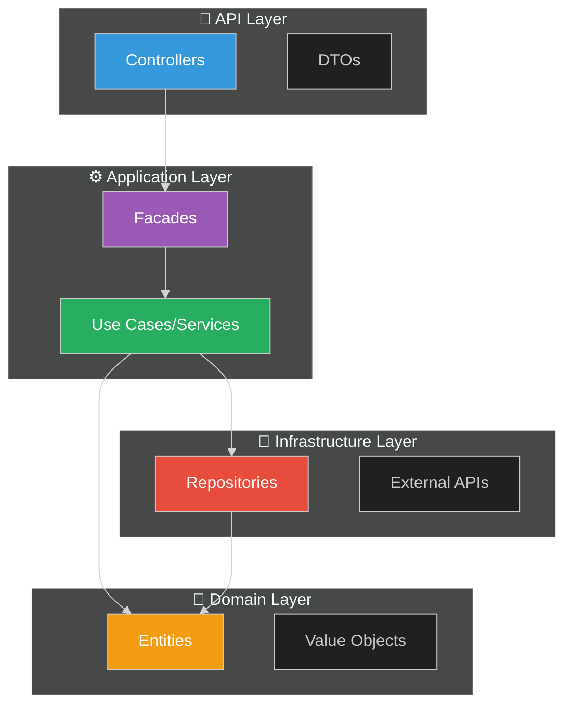
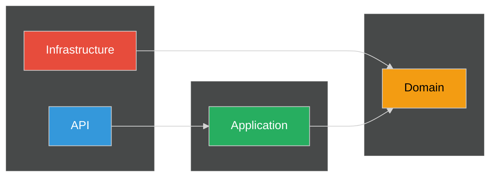
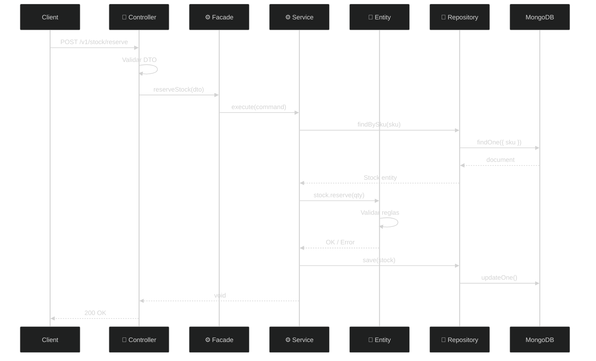
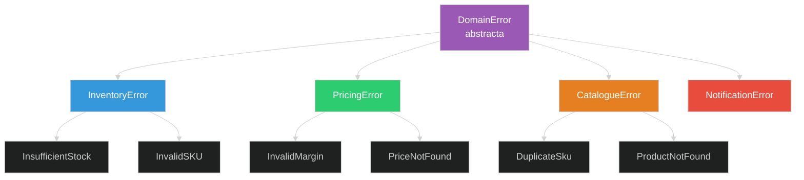

# Clean Architecture

### Las 5 capas del Monolito Modular

Note:
Esta presentacion explica como esta organizado el codigo.
Entender estas capas es clave para leer y modificar cualquier modulo.

---

## Agenda

1. **Por que Clean Architecture** - El problema que resuelve
2. **Las 5 Capas** - Domain, Application, Infrastructure, API, Config
3. **Regla de Dependencia** - Quien depende de quien
4. **Ejemplo Practico** - Seguir un request completo
5. **Error Handling** - Sistema de errores estandarizado
6. **Errores Comunes** - Lo que NO debes hacer

---

## Por que Clean Architecture?

> Separar el "que hace" del "como lo hace"

----

<!-- .slide: data-background="#1c1c1c" data-background-transition="fade" -->

### El Problema del Codigo Acoplado

```typescript
// ❌ MALO: Todo junto y mezclado
class ProductController {
  async createProduct(req: Request) {
    // Validacion en el controller
    if (!req.body.name) throw new Error('Name required');

    // Logica de negocio en el controller
    const price = req.body.price * 1.19; // IVA hardcodeado

    // Acceso a DB directo
    const result = await mongoose.model('Product').create({
      name: req.body.name,
      price: price,
    });

    // Envio de email aqui mismo
    await sendgrid.send({ to: 'admin@company.com', ... });

    return result;
  }
}
```

**Problemas:**
- Imposible testear sin DB y Sendgrid reales
- Cambiar de MongoDB a Firestore = reescribir todo
- Logica de negocio esparcida en todos lados

----

<!-- .slide: data-background="#181818" data-background-transition="fade" -->

### La Solucion: Capas Separadas



**Beneficios:**
- Cada capa tiene una responsabilidad clara
- Puedes testear cada capa por separado
- Cambiar la DB no afecta la logica de negocio

---

## Las 5 Capas

> Estructura de un modulo en el proyecto

----

<!-- .slide: data-background="#1c1c1c" data-background-transition="fade" -->

### Vista General

```
libs/inventory/
├── domain/           # 💎 Reglas de negocio puras
├── application/      # ⚙️ Casos de uso y facades
├── infrastructure/   # 🔧 Implementaciones tecnicas
├── api/              # 🎯 Controladores y DTOs
└── config/           # ⚡ Configuracion del modulo
```

Cada capa tiene un proposito especifico y **depende solo de capas inferiores**.

----

<!-- .slide: data-background="#181818" data-background-transition="fade" -->

### 1. Domain Layer (💎)

> El corazon del negocio - **NO depende de nada**

```
domain/
├── entities/           # Objetos con identidad
│   ├── stock.entity.ts
│   └── warehouse.entity.ts
├── value-objects/      # Objetos inmutables sin identidad
│   ├── sku.vo.ts
│   └── quantity.vo.ts
├── events/             # Eventos de dominio
│   └── stock-updated.event.ts
└── interfaces/         # Contratos (ports)
    └── stock.repository.interface.ts
```

**Caracteristicas:**
- TypeScript puro (sin NestJS, sin decoradores)
- Sin imports de librerias externas
- 100% testeable con tests unitarios simples

----

<!-- .slide: data-background="#1c1c1c" data-background-transition="fade" -->

### Entity vs Value Object

```typescript
// Entity - tiene identidad unica (id)
export class Stock {
  constructor(
    public readonly id: string,        // Identificador unico
    public readonly sku: SKU,          // Value Object
    public quantity: Quantity,         // Value Object
    public readonly warehouseId: string
  ) {}

  reserve(amount: Quantity): void {
    if (this.quantity.isLessThan(amount)) {
      throw new InsufficientStockError(this.sku);
    }
    this.quantity = this.quantity.subtract(amount);
  }
}

// Value Object - se identifica por su valor
export class SKU {
  private constructor(private readonly value: string) {
    if (!/^[A-Z0-9-]{3,20}$/.test(value)) {
      throw new InvalidSKUError(value);
    }
  }

  static create(value: string): SKU {
    return new SKU(value.toUpperCase());
  }

  equals(other: SKU): boolean {
    return this.value === other.value;  // Igualdad por valor
  }
}
```

----

<!-- .slide: data-background="#181818" data-background-transition="fade" -->

### 2. Application Layer (⚙️)

> Casos de uso - **Depende solo de Domain**

```
application/
├── services/           # Logica de aplicacion
│   ├── reserve-stock.service.ts
│   └── get-stock.service.ts
├── facades/            # Punto de entrada simplificado
│   └── stock.facade.ts
├── commands/           # Acciones que modifican estado
│   └── reserve-stock.command.ts
└── queries/            # Consultas de solo lectura
    └── get-stock-by-sku.query.ts
```

**Responsabilidades:**
- Orquestar llamadas al dominio
- Coordinar transacciones
- Emitir eventos de aplicacion

----

<!-- .slide: data-background="#1c1c1c" data-background-transition="fade" -->

### Application Service

```typescript
// reserve-stock.service.ts
@Injectable()
export class ReserveStockService {
  constructor(
    private readonly stockRepository: StockRepositoryPort, // Interface!
    private readonly eventPublisher: EventPublisher,
  ) {}

  async execute(command: ReserveStockCommand): Promise<void> {
    // 1. Obtener entidad del dominio
    const stock = await this.stockRepository.findBySku(command.sku);

    if (!stock) {
      throw new StockNotFoundError(command.sku);
    }

    // 2. Ejecutar logica de dominio
    stock.reserve(Quantity.create(command.quantity));

    // 3. Persistir cambios
    await this.stockRepository.save(stock);

    // 4. Publicar evento
    await this.eventPublisher.publish(
      new StockReservedEvent(stock.sku, command.quantity)
    );
  }
}
```

Note:
El servicio NO sabe como se persiste el stock.
Solo conoce la interface StockRepositoryPort.

----

<!-- .slide: data-background="#181818" data-background-transition="fade" -->

### Facade Pattern

```typescript
// stock.facade.ts - Punto de entrada para la API
@Injectable()
export class StockFacade {
  constructor(
    private readonly reserveStock: ReserveStockService,
    private readonly getStock: GetStockService,
    private readonly adjustStock: AdjustStockService,
  ) {}

  // Agrupa operaciones relacionadas
  async reserveStock(dto: ReserveStockDto): Promise<void> {
    await this.reserveStock.execute(
      new ReserveStockCommand(dto.sku, dto.quantity)
    );
  }

  async getStock(sku: string): Promise<StockDto> {
    return this.getStock.execute(new GetStockQuery(sku));
  }
}
```

**Por que Facade?**
- El controller solo inyecta UN servicio (el facade)
- Simplifica la API publica del modulo
- Oculta complejidad interna

----

<!-- .slide: data-background="#1c1c1c" data-background-transition="fade" -->

### 3. Infrastructure Layer (🔧)

> Implementaciones tecnicas - **Depende de Domain**

```
infrastructure/
├── repositories/       # Implementaciones de persistencia
│   ├── stock.repository.ts
│   └── stock.schema.ts
├── external/           # Clientes de APIs externas
│   └── erp.client.ts
├── messaging/          # Pub/Sub, eventos
│   └── stock-event.publisher.ts
└── cache/              # Implementaciones de cache
    └── stock.cache.ts
```

**Aqui van:**
- MongoDB/Firestore schemas y queries
- Clientes HTTP para VTEX, Salesforce, etc.
- Publishers de Pub/Sub
- Redis cache

----

<!-- .slide: data-background="#181818" data-background-transition="fade" -->

### Repository Implementation

```typescript
// stock.repository.ts
@Injectable()
export class StockRepository implements StockRepositoryPort {
  constructor(
    @InjectModel(StockDocument.name)
    private readonly model: Model<StockDocument>,
  ) {}

  async findBySku(sku: SKU): Promise<Stock | null> {
    const doc = await this.model.findOne({ sku: sku.value });

    if (!doc) return null;

    // Mapear documento DB a entidad de dominio
    return new Stock(
      doc._id.toString(),
      SKU.create(doc.sku),
      Quantity.create(doc.quantity),
      doc.warehouseId
    );
  }

  async save(stock: Stock): Promise<void> {
    // Mapear entidad a documento DB
    await this.model.updateOne(
      { _id: stock.id },
      {
        sku: stock.sku.value,
        quantity: stock.quantity.value,
        warehouseId: stock.warehouseId
      },
      { upsert: true }
    );
  }
}
```

Note:
El repository convierte entre documentos de DB y entidades de dominio.
La capa de dominio nunca ve documentos de MongoDB.

----

<!-- .slide: data-background="#1c1c1c" data-background-transition="fade" -->

### 4. API Layer (🎯)

> Controladores HTTP - **Depende de Application**

```
api/
├── controllers/        # Endpoints HTTP
│   └── stock.controller.ts
├── dtos/               # Data Transfer Objects
│   ├── reserve-stock.dto.ts
│   └── stock-response.dto.ts
└── decorators/         # Decoradores custom
    └── api-pagination.decorator.ts
```

**Responsabilidades:**
- Validar requests (class-validator)
- Documentar con Swagger
- Transformar DTOs
- Manejar errores HTTP

----

<!-- .slide: data-background="#181818" data-background-transition="fade" -->

### Controller

```typescript
// stock.controller.ts
@Controller('v1/stock')
@ApiTags('Stock')
export class StockController {
  constructor(private readonly stockFacade: StockFacade) {}

  @Post('reserve')
  @ApiOperation({ summary: 'Reservar stock para una orden' })
  @ApiResponse({ status: 200, description: 'Stock reservado' })
  @ApiResponse({ status: 404, description: 'SKU no encontrado' })
  async reserveStock(@Body() dto: ReserveStockDto): Promise<void> {
    await this.stockFacade.reserveStock(dto);
  }

  @Get(':sku')
  @ApiOperation({ summary: 'Obtener stock por SKU' })
  async getStock(@Param('sku') sku: string): Promise<StockResponseDto> {
    return this.stockFacade.getStock(sku);
  }
}
```

**El controller es delgado:**
- Recibe el request
- Llama al facade
- Retorna la respuesta

----

<!-- .slide: data-background="#1c1c1c" data-background-transition="fade" -->

### 5. Config Layer (⚡)

> Configuracion del modulo NestJS

```
config/
└── inventory.module.ts    # Wiring de dependencias
```

```typescript
// inventory.module.ts
@Module({
  imports: [
    MongooseModule.forFeature([
      { name: StockDocument.name, schema: StockSchema }
    ]),
  ],
  controllers: [StockController],
  providers: [
    // Facades
    StockFacade,

    // Services
    ReserveStockService,
    GetStockService,

    // Infrastructure - Implementaciones
    {
      provide: StockRepositoryPort,      // Interface
      useClass: StockRepository,         // Implementacion
    },
  ],
  exports: [StockFacade],  // Lo que otros modulos pueden usar
})
export class InventoryModule {}
```

---

## Regla de Dependencia

> Las dependencias siempre van hacia adentro

----

<!-- .slide: data-background="#1c1c1c" data-background-transition="fade" -->

### Direccion de Dependencias



| Capa | Puede importar | NO puede importar |
|------|----------------|-------------------|
| Domain | Nada | Todo lo demas |
| Application | Domain | API, Infrastructure |
| Infrastructure | Domain | Application, API |
| API | Application | Infrastructure* |

*Los controllers no deben importar repositories directamente

----

<!-- .slide: data-background="#181818" data-background-transition="fade" -->

### Inversion de Dependencias

```typescript
// Domain define la interface (Puerto)
// domain/interfaces/stock.repository.interface.ts
export interface StockRepositoryPort {
  findBySku(sku: SKU): Promise<Stock | null>;
  save(stock: Stock): Promise<void>;
}

// Infrastructure implementa la interface (Adaptador)
// infrastructure/repositories/stock.repository.ts
@Injectable()
export class StockRepository implements StockRepositoryPort {
  // Implementacion con MongoDB
}

// Application usa la interface, no la implementacion
// application/services/reserve-stock.service.ts
@Injectable()
export class ReserveStockService {
  constructor(
    private readonly stockRepo: StockRepositoryPort  // Interface!
  ) {}
}
```

**Beneficio:** Puedes cambiar MongoDB por Firestore sin tocar Application ni Domain.

---

## Ejemplo Practico

> Seguir un request de reserva de stock

----

<!-- .slide: data-background="#1c1c1c" data-background-transition="fade" -->

### Flujo Completo



----

<!-- .slide: data-background="#181818" data-background-transition="fade" -->

### Donde Vive Cada Logica

| Logica | Capa | Ejemplo |
|--------|------|---------|
| Validar formato SKU | Domain (Value Object) | `SKU.create("ABC-123")` |
| Validar cantidad > 0 | Domain (Value Object) | `Quantity.create(5)` |
| Verificar stock suficiente | Domain (Entity) | `stock.reserve(qty)` |
| Cargar stock de DB | Infrastructure | `repo.findBySku(sku)` |
| Guardar cambios | Infrastructure | `repo.save(stock)` |
| Validar request HTTP | API (DTO) | `@IsNotEmpty()` |
| Documentar endpoint | API (Swagger) | `@ApiOperation()` |

---

## Error Handling

> Sistema de errores estandarizado (RFC-0009)

----

<!-- .slide: data-background="#1c1c1c" data-background-transition="fade" -->

### Jerarquia de Errores



Cada modulo tiene sus propios errores tipados que heredan de `DomainError`.

----

<!-- .slide: data-background="#181818" data-background-transition="fade" -->

### Categorias de Error

| Categoria | HTTP | Cuando usar |
|-----------|------|-------------|
| `VALIDATION` | 400 | Datos de entrada invalidos |
| `BUSINESS_RULE` | 400 | Regla de negocio violada |
| `NOT_FOUND` | 404 | Recurso no existe |
| `CONFLICT` | 409 | Conflicto con estado actual |
| `EXTERNAL` | 502 | Error en servicio externo |
| `TECHNICAL` | 500 | Error de infraestructura |

La categoria determina automaticamente el HTTP status.

----

<!-- .slide: data-background="#1c1c1c" data-background-transition="fade" -->

### Como Crear un Error Custom

```typescript
// 1. Definir el error en domain/errors/
import { DomainError, ErrorCategory } from '@core/domain';

export class InsufficientStockError extends DomainError {
  constructor(sku: string, requested: number, available: number) {
    super({
      code: 'INVENTORY.INSUFFICIENT_STOCK',      // Codigo unico
      message: `Stock insuficiente para ${sku}`, // Mensaje legible
      category: ErrorCategory.BUSINESS_RULE,     // Determina HTTP 400
      details: { sku, requested, available },    // Contexto para debug
    });
  }
}

// 2. Usar en el servicio
async reserveStock(sku: string, quantity: number): Promise<void> {
  const stock = await this.repository.findBySku(sku);

  if (stock.available < quantity) {
    throw new InsufficientStockError(sku, quantity, stock.available);
  }

  await this.repository.reserve(sku, quantity);
}
```

----

<!-- .slide: data-background="#181818" data-background-transition="fade" -->

### Respuesta Automatica

El `GlobalExceptionFilter` convierte DomainError a respuesta HTTP:

```json
{
  "success": false,
  "error": {
    "code": "INVENTORY.INSUFFICIENT_STOCK",
    "message": "Stock insuficiente para SKU-001",
    "category": "BUSINESS_RULE",
    "timestamp": "2025-01-05T10:30:00Z",
    "details": {
      "sku": "SKU-001",
      "requested": 100,
      "available": 50
    }
  }
}
```

**Beneficios:**
- Codigo unico para manejar programaticamente
- Mensaje claro para mostrar al usuario
- Detalles para debugging

----

<!-- .slide: data-background="#1c1c1c" data-background-transition="fade" -->

### Errores: Antes vs Despues

**Antes (generico):**

```json
{
  "statusCode": 400,
  "message": "Bad Request"
}
```

Que fallo exactamente? Como lo arreglo?

**Despues (estructurado):**

```json
{
  "error": {
    "code": "INVENTORY.INSUFFICIENT_STOCK",
    "details": { "sku": "SKU-001", "available": 50 }
  }
}
```

El frontend puede mostrar: "Solo hay 50 unidades disponibles". Logs buscables por codigo de error.

---

## Errores Comunes

> Lo que NO debes hacer

----

<!-- .slide: data-background="#1c1c1c" data-background-transition="fade" -->

### Error 1: Logica de Negocio en Controller

```typescript
// ❌ MALO
@Controller('stock')
export class StockController {
  @Post('reserve')
  async reserve(@Body() dto: ReserveDto) {
    // Logica de negocio en el controller!
    const stock = await this.model.findOne({ sku: dto.sku });
    if (stock.quantity < dto.quantity) {
      throw new BadRequestException('Insufficient stock');
    }
    stock.quantity -= dto.quantity;
    await stock.save();
  }
}

// ✅ BUENO
@Controller('stock')
export class StockController {
  constructor(private readonly facade: StockFacade) {}

  @Post('reserve')
  async reserve(@Body() dto: ReserveDto) {
    await this.facade.reserveStock(dto);  // Delegar
  }
}
```

----

<!-- .slide: data-background="#181818" data-background-transition="fade" -->

### Error 2: Entity con Dependencias

```typescript
// ❌ MALO - Entity que usa repository
export class Stock {
  constructor(
    private readonly repo: StockRepository  // NO!
  ) {}

  async reserve(qty: number) {
    await this.repo.save(this);  // Entity no debe saber de persistencia
  }
}

// ✅ BUENO - Entity pura
export class Stock {
  reserve(qty: Quantity): void {
    if (this.quantity.isLessThan(qty)) {
      throw new InsufficientStockError(this.sku);
    }
    this.quantity = this.quantity.subtract(qty);
  }
}

// El Service maneja la persistencia
await stock.reserve(qty);
await this.repo.save(stock);
```

----

<!-- .slide: data-background="#1c1c1c" data-background-transition="fade" -->

### Error 3: Importar Infrastructure en Application

```typescript
// ❌ MALO - Service importa implementacion
import { StockRepository } from '../infrastructure/repositories/stock.repository';

@Injectable()
export class ReserveStockService {
  constructor(private readonly repo: StockRepository) {}  // Clase concreta
}

// ✅ BUENO - Service usa interface
import { StockRepositoryPort } from '../domain/interfaces/stock.repository.interface';

@Injectable()
export class ReserveStockService {
  constructor(private readonly repo: StockRepositoryPort) {}  // Interface
}
```

**Por que importa?** Con la interface, puedes:
- Usar un mock en tests
- Cambiar de MongoDB a Firestore sin tocar el service

----

<!-- .slide: data-background="#181818" data-background-transition="fade" -->

### Error 4: Retornar Entidades desde API

```typescript
// ❌ MALO - Exponer entidad de dominio
@Get(':sku')
async getStock(@Param('sku') sku: string): Promise<Stock> {
  return this.facade.getStock(sku);  // Retorna entidad!
}

// ✅ BUENO - Usar DTO de respuesta
@Get(':sku')
async getStock(@Param('sku') sku: string): Promise<StockResponseDto> {
  const stock = await this.facade.getStock(sku);
  return {
    sku: stock.sku.value,
    quantity: stock.quantity.value,
    warehouse: stock.warehouseId,
  };
}
```

**Por que?**
- El DTO controla exactamente que se expone
- Puedes cambiar la entidad sin romper la API
- Evitas exponer datos sensibles por accidente

---

## Resumen

----

<!-- .slide: data-background="#1c1c1c" data-background-transition="fade" -->

### Las 5 Capas

| Capa | Responsabilidad | Depende de |
|------|-----------------|------------|
| 💎 Domain | Reglas de negocio | Nada |
| ⚙️ Application | Casos de uso | Domain |
| 🔧 Infrastructure | DB, APIs externas | Domain |
| 🎯 API | HTTP, validacion | Application |
| ⚡ Config | Wiring NestJS | Todas |

----

<!-- .slide: data-background="#181818" data-background-transition="fade" -->

### Checklist Rapido

Antes de escribir codigo, preguntate:

```text
[ ] ¿Es regla de negocio? → Domain
[ ] ¿Orquesta llamadas? → Application
[ ] ¿Habla con DB/API externa? → Infrastructure
[ ] ¿Maneja HTTP request? → API
[ ] ¿Configura el modulo? → Config
```

---

# 🙏 Gracias

Note:
Si te pierdes, abre inventory/ y sigue la estructura.
Cada modulo sigue exactamente este patron.

