# Integration Platform

### Arquitectura Enterprise Multi-País

<br>

<div style="font-size: 0.6em; color: #7f8c8d;">
Implementos · Presentación para Asesores de Arquitectura
</div>

Note:
Bienvenidos. Esta presentación cubre la Integration Platform de Implementos.
Es una plataforma enterprise multi-país que centraliza toda la lógica de integración.
Vamos a recorrer desde la visión de negocio hasta los detalles técnicos de infraestructura.
Presiona S para ver estas notas durante la presentación.

---

## 📋 Agenda

<div style="font-size: 0.8em;">

1. **Visión de Negocio** — Qué problema resolvemos
2. **Arquitectura de Alto Nivel** — La plataforma completa
3. **Capa de Servicios** — Integración de aplicaciones corporativas
4. **Multi-País & Multi-ERP** — Adaptadores por país
5. **Monolito Modular** — Diseño del Integration API
6. **Módulos de Negocio** — Bounded Contexts
7. **Integraciones Externas** — VTEX, Salesforce, Payment Gateways
8. **Workers & Procesamiento Asíncrono**
9. **Clean Architecture** — Capas y reglas de dependencia
10. **Seguridad** — Defense in Depth
11. **Infraestructura & Despliegue** — GCP Cloud Run
12. **Escalamiento & Alta Disponibilidad**
13. **CI/CD Pipeline** — Delivery automatizado
14. **Resiliencia & Observabilidad**
15. **Roadmap**

</div>

Note:
La presentación tiene 15 secciones. Arrancamos con por qué existe la plataforma (el problema de negocio),
después bajamos a cómo está construida técnicamente, y cerramos con infra, CI/CD y roadmap.
Duración estimada: 45-60 minutos. Preguntas al final o durante, como prefieran.

---

## 1. Visión de Negocio

> Una plataforma unificada que conecta todas las aplicaciones corporativas bajo un modelo enterprise multi-país

⬇️ _Navega hacia abajo para ver detalles_

Note:
El objetivo es centralizar toda la lógica de integración en una sola plataforma que pueda ser consumida por cualquier aplicación corporativa, independiente del país.

----

### El Problema

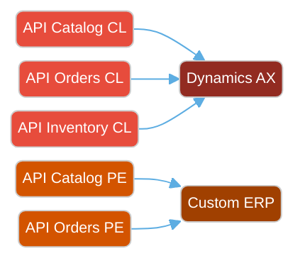

<div style="font-size: 0.75em;">

- N microservicios x M países = **NxM deployments**
- Lógica duplicada entre microservicios
- Sin estándar de seguridad ni observabilidad unificada

</div>

Note:
Cada país tenía sus propios microservicios con su propia lógica, su propia autenticación, sus propios logs.
Mantener esto era exponencialmente costoso a medida que se agregaban países.

----

### La Solución

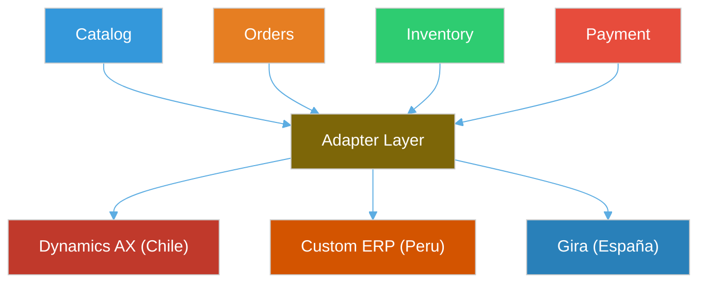

<div style="font-size: 0.75em;">

- **1 plataforma x N países** — lógica centralizada, adaptadores específicos
- Seguridad y observabilidad unificada

</div>

Note:
Una sola plataforma con adaptadores por país. La lógica de negocio es la misma, solo cambian los conectores al ERP de cada país.

----

### Aplicaciones que Consumen la Plataforma

<div style="text-align: center;">
<svg width="800" height="380" viewBox="0 0 800 380" xmlns="http://www.w3.org/2000/svg">
  <!-- Apps row -->
  <rect x="30" y="20" width="100" height="55" rx="8" fill="#3498db"/>
  <text x="80" y="42" text-anchor="middle" fill="white" font-size="11" font-weight="bold">Caja POS</text>
  <text x="80" y="58" text-anchor="middle" fill="#d5e8f7" font-size="9">Punto de Venta</text>

  <rect x="155" y="20" width="100" height="55" rx="8" fill="#9b59b6"/>
  <text x="205" y="42" text-anchor="middle" fill="white" font-size="11" font-weight="bold">Omnichannel</text>
  <text x="205" y="58" text-anchor="middle" fill="#e8d5f5" font-size="9">OMS Unificado</text>

  <rect x="280" y="20" width="100" height="55" rx="8" fill="#2ecc71"/>
  <text x="330" y="42" text-anchor="middle" fill="white" font-size="11" font-weight="bold">VTEX IO</text>
  <text x="330" y="58" text-anchor="middle" fill="#d5f5e3" font-size="9">E-Commerce</text>

  <rect x="405" y="20" width="100" height="55" rx="8" fill="#e67e22"/>
  <text x="455" y="42" text-anchor="middle" fill="white" font-size="11" font-weight="bold">PIM</text>
  <text x="455" y="58" text-anchor="middle" fill="#fdebd0" font-size="9">Product Info</text>

  <rect x="530" y="20" width="100" height="55" rx="8" fill="#e74c3c"/>
  <text x="580" y="42" text-anchor="middle" fill="white" font-size="11" font-weight="bold">ERP</text>
  <text x="580" y="58" text-anchor="middle" fill="#fadbd8" font-size="9">Dynamics/Custom/Gira</text>

  <rect x="655" y="20" width="110" height="55" rx="8" fill="#1abc9c"/>
  <text x="710" y="42" text-anchor="middle" fill="white" font-size="11" font-weight="bold">Marketplace</text>
  <text x="710" y="58" text-anchor="middle" fill="#d1f2eb" font-size="9">VTEX Seller Protocol</text>

  <!-- Arrows down -->
  <line x1="80" y1="75" x2="80" y2="120" stroke="#3498db" stroke-width="2" marker-end="url(#arrowBlue)"/>
  <line x1="205" y1="75" x2="205" y2="120" stroke="#9b59b6" stroke-width="2" marker-end="url(#arrowBlue)"/>
  <line x1="330" y1="75" x2="330" y2="120" stroke="#2ecc71" stroke-width="2" marker-end="url(#arrowBlue)"/>
  <line x1="455" y1="75" x2="455" y2="120" stroke="#e67e22" stroke-width="2" marker-end="url(#arrowBlue)"/>
  <line x1="580" y1="75" x2="580" y2="120" stroke="#e74c3c" stroke-width="2" marker-end="url(#arrowBlue)"/>
  <line x1="710" y1="75" x2="710" y2="120" stroke="#1abc9c" stroke-width="2" marker-end="url(#arrowBlue)"/>

  <!-- Integration Platform box -->
  <rect x="20" y="120" width="760" height="130" rx="10" fill="#1a252f" stroke="#f1c40f" stroke-width="3"/>
  <text x="400" y="148" text-anchor="middle" fill="#f1c40f" font-size="16" font-weight="bold">Integration Platform (Integration API)</text>

  <!-- Internal modules -->
  <rect x="40" y="160" width="80" height="35" rx="5" fill="#2c3e50" stroke="#3498db" stroke-width="1"/>
  <text x="80" y="182" text-anchor="middle" fill="#3498db" font-size="9">Catalog</text>

  <rect x="130" y="160" width="80" height="35" rx="5" fill="#2c3e50" stroke="#2ecc71" stroke-width="1"/>
  <text x="170" y="182" text-anchor="middle" fill="#2ecc71" font-size="9">Inventory</text>

  <rect x="220" y="160" width="80" height="35" rx="5" fill="#2c3e50" stroke="#e67e22" stroke-width="1"/>
  <text x="260" y="182" text-anchor="middle" fill="#e67e22" font-size="9">Orders</text>

  <rect x="310" y="160" width="80" height="35" rx="5" fill="#2c3e50" stroke="#e74c3c" stroke-width="1"/>
  <text x="350" y="182" text-anchor="middle" fill="#e74c3c" font-size="9">Payment</text>

  <rect x="400" y="160" width="80" height="35" rx="5" fill="#2c3e50" stroke="#9b59b6" stroke-width="1"/>
  <text x="440" y="182" text-anchor="middle" fill="#9b59b6" font-size="9">Customer</text>

  <rect x="490" y="160" width="80" height="35" rx="5" fill="#2c3e50" stroke="#1abc9c" stroke-width="1"/>
  <text x="530" y="182" text-anchor="middle" fill="#1abc9c" font-size="9">Logistics</text>

  <rect x="580" y="160" width="80" height="35" rx="5" fill="#2c3e50" stroke="#f39c12" stroke-width="1"/>
  <text x="620" y="182" text-anchor="middle" fill="#f39c12" font-size="9">Notification</text>

  <rect x="670" y="160" width="90" height="35" rx="5" fill="#2c3e50" stroke="#ecf0f1" stroke-width="1"/>
  <text x="715" y="182" text-anchor="middle" fill="#ecf0f1" font-size="9">Shopping Cart</text>

  <!-- Adapter layer -->
  <rect x="40" y="205" width="720" height="30" rx="4" fill="#2c3e50" stroke="#f1c40f" stroke-width="1" stroke-dasharray="4"/>
  <text x="400" y="225" text-anchor="middle" fill="#f1c40f" font-size="10">Adapter Layer — Conectores específicos por país y ERP</text>

  <!-- Country arrows -->
  <line x1="150" y1="250" x2="150" y2="290" stroke="#e74c3c" stroke-width="2" marker-end="url(#arrowBlue)"/>
  <line x1="400" y1="250" x2="400" y2="290" stroke="#f39c12" stroke-width="2" marker-end="url(#arrowBlue)"/>
  <line x1="650" y1="250" x2="650" y2="290" stroke="#3498db" stroke-width="2" marker-end="url(#arrowBlue)"/>

  <!-- ERPs -->
  <rect x="80" y="290" width="140" height="50" rx="8" fill="#c0392b"/>
  <text x="150" y="312" text-anchor="middle" fill="white" font-size="11" font-weight="bold">Dynamics AX</text>
  <text x="150" y="328" text-anchor="middle" fill="#fadbd8" font-size="9">Chile</text>

  <rect x="330" y="290" width="140" height="50" rx="8" fill="#d35400"/>
  <text x="400" y="312" text-anchor="middle" fill="white" font-size="11" font-weight="bold">Custom ERP</text>
  <text x="400" y="328" text-anchor="middle" fill="#fdebd0" font-size="9">Peru</text>

  <rect x="580" y="290" width="140" height="50" rx="8" fill="#2980b9"/>
  <text x="650" y="312" text-anchor="middle" fill="white" font-size="11" font-weight="bold">Gira</text>
  <text x="650" y="328" text-anchor="middle" fill="#d6eaf8" font-size="9">España</text>

  <defs>
    <marker id="arrowBlue" markerWidth="8" markerHeight="8" refX="7" refY="3" orient="auto">
      <path d="M0,0 L0,6 L8,3 z" fill="#888"/>
    </marker>
  </defs>
</svg>
</div>

Note:
Todas las aplicaciones corporativas consumen la misma plataforma.
La Caja, Omnichannel, VTEX IO (e-commerce), PIM, el ERP y los Marketplaces se integran vía APIs REST estándar.
La capa de adaptadores abstrae las diferencias entre ERPs por país.

---

## 2. Arquitectura de Alto Nivel

> 4 capas horizontales: Consumidores, Plataforma, Mensajería, Backends

⬇️ _Navega hacia abajo para ver detalles_


Note:
Esta es la vista de pajaro de toda la plataforma. Arriba los consumidores,
en el medio la plataforma con sus modulos, y abajo los backends.
Todo pasa por la capa de seguridad antes de llegar a la plataforma.

----

<!-- .slide: data-background="#0d1117" -->

### Vista C4 — Contexto del Sistema

<div style="text-align: center;">
<svg width="820" height="500" viewBox="0 0 820 500" xmlns="http://www.w3.org/2000/svg" style="max-height: 550px;">

  <!-- Layer 1: Consumers -->
  <rect x="10" y="10" width="800" height="85" rx="8" fill="none" stroke="#3498db" stroke-width="1" stroke-dasharray="6"/>
  <text x="20" y="30" fill="#3498db" font-size="11" font-weight="bold">CONSUMIDORES</text>

  <rect x="20" y="38" width="85" height="45" rx="5" fill="#3498db"/>
  <text x="62" y="58" text-anchor="middle" fill="white" font-size="9" font-weight="bold">Caja POS</text>
  <text x="62" y="72" text-anchor="middle" fill="#d5e8f7" font-size="8">App Móvil</text>

  <rect x="115" y="38" width="85" height="45" rx="5" fill="#3498db"/>
  <text x="157" y="58" text-anchor="middle" fill="white" font-size="9" font-weight="bold">VTEX IO</text>
  <text x="157" y="72" text-anchor="middle" fill="#d5e8f7" font-size="8">E-Commerce</text>

  <rect x="210" y="38" width="85" height="45" rx="5" fill="#3498db"/>
  <text x="252" y="58" text-anchor="middle" fill="white" font-size="9" font-weight="bold">Omnichannel</text>
  <text x="252" y="72" text-anchor="middle" fill="#d5e8f7" font-size="8">OMS Interno</text>

  <rect x="305" y="38" width="85" height="45" rx="5" fill="#3498db"/>
  <text x="347" y="58" text-anchor="middle" fill="white" font-size="9" font-weight="bold">PIM</text>
  <text x="347" y="72" text-anchor="middle" fill="#d5e8f7" font-size="8">Producto</text>

  <rect x="400" y="38" width="85" height="45" rx="5" fill="#9b59b6"/>
  <text x="442" y="58" text-anchor="middle" fill="white" font-size="9" font-weight="bold">VTEX Mktpl</text>
  <text x="442" y="72" text-anchor="middle" fill="#e8d5f5" font-size="8">External Seller</text>

  <rect x="495" y="38" width="85" height="45" rx="5" fill="#9b59b6"/>
  <text x="537" y="58" text-anchor="middle" fill="white" font-size="9" font-weight="bold">ERP</text>
  <text x="537" y="72" text-anchor="middle" fill="#e8d5f5" font-size="8">M2M API Key</text>

  <rect x="590" y="38" width="85" height="45" rx="5" fill="#9b59b6"/>
  <text x="632" y="58" text-anchor="middle" fill="white" font-size="9" font-weight="bold">Webhooks</text>
  <text x="632" y="72" text-anchor="middle" fill="#e8d5f5" font-size="8">Inbound</text>

  <rect x="685" y="38" width="110" height="45" rx="5" fill="#9b59b6"/>
  <text x="740" y="58" text-anchor="middle" fill="white" font-size="9" font-weight="bold">Partners 3rd</text>
  <text x="740" y="72" text-anchor="middle" fill="#e8d5f5" font-size="8">M2M Scoped</text>

  <!-- Arrow zone -->
  <line x1="410" y1="83" x2="410" y2="115" stroke="#7f8c8d" stroke-width="1"/>
  <text x="420" y="105" fill="#7f8c8d" font-size="8">REST / HTTPS</text>

  <!-- Layer 2: Security + LB -->
  <rect x="10" y="115" width="800" height="55" rx="8" fill="none" stroke="#e74c3c" stroke-width="1" stroke-dasharray="6"/>
  <text x="20" y="133" fill="#e74c3c" font-size="11" font-weight="bold">SEGURIDAD & NETWORKING</text>

  <rect x="20" y="140" width="130" height="24" rx="4" fill="#c0392b"/>
  <text x="85" y="156" text-anchor="middle" fill="white" font-size="9">Cloud Run TLS + DDoS</text>

  <rect x="160" y="140" width="120" height="24" rx="4" fill="#e74c3c"/>
  <text x="220" y="156" text-anchor="middle" fill="white" font-size="9">Rate Limiting (Redis)</text>

  <rect x="290" y="140" width="120" height="24" rx="4" fill="#e74c3c"/>
  <text x="350" y="156" text-anchor="middle" fill="white" font-size="9">JWT + API Key Auth</text>

  <rect x="420" y="140" width="120" height="24" rx="4" fill="#e74c3c"/>
  <text x="480" y="156" text-anchor="middle" fill="white" font-size="9">RBAC + Scopes</text>

  <rect x="550" y="140" width="120" height="24" rx="4" fill="#c0392b"/>
  <text x="610" y="156" text-anchor="middle" fill="white" font-size="9">Input Validation</text>

  <rect x="680" y="140" width="120" height="24" rx="4" fill="#c0392b"/>
  <text x="740" y="156" text-anchor="middle" fill="white" font-size="9">VPC + Private Egress</text>

  <!-- Arrow zone -->
  <line x1="410" y1="170" x2="410" y2="195" stroke="#7f8c8d" stroke-width="1"/>

  <!-- Layer 3: Integration API -->
  <rect x="10" y="195" width="800" height="130" rx="8" fill="#1a252f" stroke="#f1c40f" stroke-width="2"/>
  <text x="20" y="215" fill="#f1c40f" font-size="12" font-weight="bold">INTEGRATION PLATFORM — CORE API (NestJS + Fastify)</text>

  <!-- Modules row 1 -->
  <rect x="25" y="225" width="90" height="30" rx="4" fill="#2c3e50" stroke="#3498db" stroke-width="1"/>
  <text x="70" y="244" text-anchor="middle" fill="#3498db" font-size="9">Catalog</text>

  <rect x="125" y="225" width="90" height="30" rx="4" fill="#2c3e50" stroke="#2ecc71" stroke-width="1"/>
  <text x="170" y="244" text-anchor="middle" fill="#2ecc71" font-size="9">Inventory</text>

  <rect x="225" y="225" width="90" height="30" rx="4" fill="#2c3e50" stroke="#e67e22" stroke-width="1"/>
  <text x="270" y="244" text-anchor="middle" fill="#e67e22" font-size="9">OMS</text>

  <rect x="325" y="225" width="90" height="30" rx="4" fill="#2c3e50" stroke="#e74c3c" stroke-width="1"/>
  <text x="370" y="244" text-anchor="middle" fill="#e74c3c" font-size="9">Payment</text>

  <rect x="425" y="225" width="90" height="30" rx="4" fill="#2c3e50" stroke="#9b59b6" stroke-width="1"/>
  <text x="470" y="244" text-anchor="middle" fill="#9b59b6" font-size="9">Customer</text>

  <rect x="525" y="225" width="90" height="30" rx="4" fill="#2c3e50" stroke="#1abc9c" stroke-width="1"/>
  <text x="570" y="244" text-anchor="middle" fill="#1abc9c" font-size="9">Logistics</text>

  <rect x="625" y="225" width="90" height="30" rx="4" fill="#2c3e50" stroke="#f39c12" stroke-width="1"/>
  <text x="670" y="244" text-anchor="middle" fill="#f39c12" font-size="9">Shopping Cart</text>

  <!-- Modules row 2 -->
  <rect x="25" y="265" width="90" height="30" rx="4" fill="#2c3e50" stroke="#ecf0f1" stroke-width="1"/>
  <text x="70" y="284" text-anchor="middle" fill="#ecf0f1" font-size="9">Notification</text>

  <rect x="125" y="265" width="90" height="30" rx="4" fill="#2c3e50" stroke="#ecf0f1" stroke-width="1"/>
  <text x="170" y="284" text-anchor="middle" fill="#ecf0f1" font-size="9">CMS</text>

  <rect x="225" y="265" width="90" height="30" rx="4" fill="#2c3e50" stroke="#ecf0f1" stroke-width="1"/>
  <text x="270" y="284" text-anchor="middle" fill="#ecf0f1" font-size="9">Documents</text>

  <rect x="325" y="265" width="90" height="30" rx="4" fill="#2c3e50" stroke="#ecf0f1" stroke-width="1"/>
  <text x="370" y="284" text-anchor="middle" fill="#ecf0f1" font-size="9">Storage</text>

  <rect x="425" y="265" width="90" height="30" rx="4" fill="#2c3e50" stroke="#ecf0f1" stroke-width="1"/>
  <text x="470" y="284" text-anchor="middle" fill="#ecf0f1" font-size="9">Articles</text>

  <rect x="525" y="265" width="90" height="30" rx="4" fill="#2c3e50" stroke="#ecf0f1" stroke-width="1"/>
  <text x="570" y="284" text-anchor="middle" fill="#ecf0f1" font-size="9">VTEX Seller</text>

  <!-- Shared layer -->
  <rect x="625" y="265" width="170" height="30" rx="4" fill="#2c3e50" stroke="#f1c40f" stroke-width="1"/>
  <text x="710" y="284" text-anchor="middle" fill="#f1c40f" font-size="9">Shared (Auth, Cache, Logger)</text>

  <!-- Arrow zone -->
  <line x1="200" y1="325" x2="200" y2="355" stroke="#7f8c8d" stroke-width="1"/>
  <line x1="410" y1="325" x2="410" y2="355" stroke="#7f8c8d" stroke-width="1"/>
  <line x1="620" y1="325" x2="620" y2="355" stroke="#7f8c8d" stroke-width="1"/>

  <!-- Layer 4: Messaging + Workers -->
  <rect x="10" y="355" width="395" height="75" rx="8" fill="none" stroke="#2ecc71" stroke-width="1" stroke-dasharray="6"/>
  <text x="20" y="373" fill="#2ecc71" font-size="10" font-weight="bold">WORKERS (Cloud Run Jobs & Services)</text>

  <rect x="20" y="380" width="90" height="24" rx="4" fill="#27ae60"/>
  <text x="65" y="396" text-anchor="middle" fill="white" font-size="8">Pub/Sub</text>

  <rect x="115" y="380" width="85" height="24" rx="4" fill="#27ae60"/>
  <text x="157" y="396" text-anchor="middle" fill="white" font-size="7">Sync Worker</text>

  <rect x="205" y="380" width="85" height="24" rx="4" fill="#27ae60"/>
  <text x="247" y="396" text-anchor="middle" fill="white" font-size="7">Notif Worker</text>

  <rect x="295" y="380" width="105" height="24" rx="4" fill="#27ae60"/>
  <text x="347" y="396" text-anchor="middle" fill="white" font-size="7">Notif Retry Worker</text>

  <rect x="20" y="407" width="95" height="20" rx="4" fill="#1e8449"/>
  <text x="67" y="420" text-anchor="middle" fill="white" font-size="7">Report Worker</text>

  <rect x="120" y="407" width="115" height="20" rx="4" fill="#1e8449"/>
  <text x="177" y="420" text-anchor="middle" fill="white" font-size="7">Pickup Reminder Worker</text>

  <rect x="240" y="407" width="100" height="20" rx="4" fill="#1e8449"/>
  <text x="290" y="420" text-anchor="middle" fill="white" font-size="7">Cloud Scheduler</text>

  <!-- Layer 4b: Data -->
  <rect x="415" y="355" width="395" height="75" rx="8" fill="none" stroke="#f39c12" stroke-width="1" stroke-dasharray="6"/>
  <text x="425" y="373" fill="#f39c12" font-size="10" font-weight="bold">DATOS & CACHE</text>

  <rect x="425" y="380" width="105" height="24" rx="4" fill="#d35400"/>
  <text x="477" y="396" text-anchor="middle" fill="white" font-size="9">Firestore (Mongo)</text>

  <rect x="540" y="380" width="85" height="24" rx="4" fill="#d35400"/>
  <text x="582" y="396" text-anchor="middle" fill="white" font-size="9">SQL Server</text>

  <rect x="635" y="380" width="75" height="24" rx="4" fill="#d35400"/>
  <text x="672" y="396" text-anchor="middle" fill="white" font-size="9">PostgreSQL</text>

  <rect x="720" y="380" width="80" height="24" rx="4" fill="#d35400"/>
  <text x="760" y="396" text-anchor="middle" fill="white" font-size="9">Redis Cache</text>

  <rect x="425" y="407" width="180" height="20" rx="4" fill="#a04000"/>
  <text x="515" y="420" text-anchor="middle" fill="white" font-size="7">Salesforce Marketing Cloud</text>

  <rect x="615" y="407" width="90" height="20" rx="4" fill="#a04000"/>
  <text x="660" y="420" text-anchor="middle" fill="white" font-size="7">Twilio / WSP</text>

  <!-- Layer 5: Observability -->
  <rect x="10" y="440" width="800" height="45" rx="8" fill="none" stroke="#95a5a6" stroke-width="1" stroke-dasharray="6"/>
  <text x="20" y="460" fill="#95a5a6" font-size="10" font-weight="bold">OBSERVABILIDAD</text>

  <rect x="130" y="453" width="110" height="24" rx="4" fill="#7f8c8d"/>
  <text x="185" y="469" text-anchor="middle" fill="white" font-size="9">Pino Structured Logs</text>

  <rect x="250" y="453" width="110" height="24" rx="4" fill="#7f8c8d"/>
  <text x="305" y="469" text-anchor="middle" fill="white" font-size="9">OpenTelemetry</text>

  <rect x="370" y="453" width="130" height="24" rx="4" fill="#FF6F00"/>
  <text x="435" y="469" text-anchor="middle" fill="white" font-size="9">Grafana Cloud (OTLP)</text>

  <rect x="510" y="453" width="110" height="24" rx="4" fill="#362D59"/>
  <text x="565" y="469" text-anchor="middle" fill="white" font-size="9">Sentry</text>

  <rect x="630" y="453" width="110" height="24" rx="4" fill="#7f8c8d"/>
  <text x="685" y="469" text-anchor="middle" fill="white" font-size="9">Cloud Logging</text>

</svg>
</div>

Note:
Vista completa de la plataforma desde arriba hacia abajo.
Los consumidores se conectan vía HTTPS, pasan por la capa de seguridad (WAF, LB, Auth),
llegan al Integration API que contiene los módulos de negocio, y estos se conectan a los backends de datos y mensajería.

---

## 3. Capa de Servicios

> La plataforma como hub de integración para todas las aplicaciones corporativas

⬇️ _Navega hacia abajo para ver detalles_


Note:
Aqui explicamos como cada app se conecta a la plataforma.
JWT para humanos (frontend, caja), API Keys para maquinas (ERP, VTEX).
Si preguntan por GraphQL: no usamos, solo REST por simplicidad operacional.

----

### Modelo de Integración Corporativa

<div style="font-size: 0.55em;">

| Aplicación | Protocolo | Autenticación | Casos de Uso |
|------------|-----------|---------------|--------------|
| **Caja POS** | REST | JWT (usuario) | Stock, precios, clientes |
| **VTEX IO** | REST | API Key + VTEX Seller | Catálogo, carrito, checkout |
| **Omnichannel** | REST | JWT (operador) | Órdenes cross-canal |
| **PIM** | REST | JWT (admin) | Productos y atributos |
| **ERP** | REST | API Key (M2M) | Sync stock, precios, órdenes |
| **VTEX Marketplace** | REST | API Key + HMAC | Simulación, placement |
| **Webhooks** | Push | Signature | Eventos a terceros |
| **Partners** | REST | API Key (scoped) | Acceso granular |

</div>

Note:
Cada aplicación se conecta con el protocolo y mecanismo de autenticación apropiado.
Las aplicaciones internas usan JWT, las máquinas usan API Keys con scopes granulares.

----

### Beneficio: Desacoplamiento del ERP

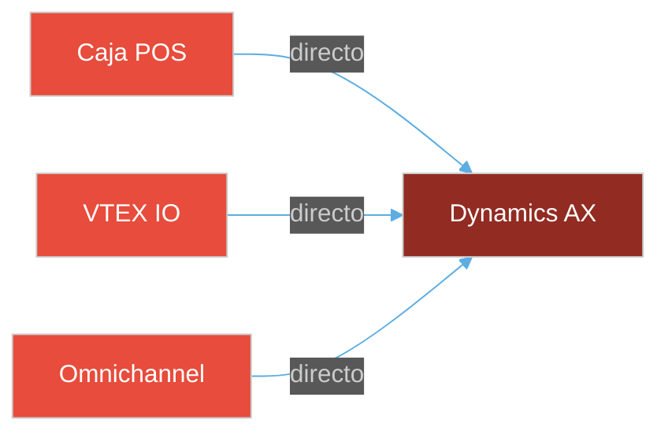

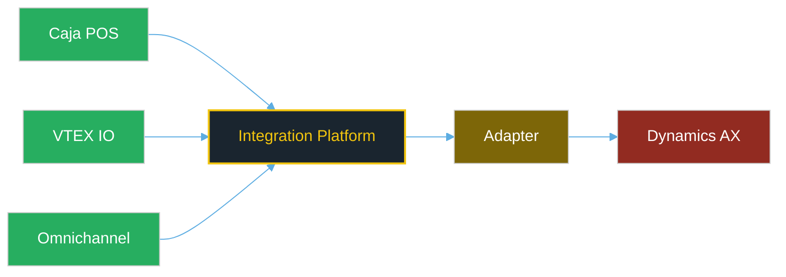

Note:
La plataforma actúa como capa de abstracción entre las aplicaciones y los ERPs.
Esto permite cambiar de ERP sin afectar a las aplicaciones consumidoras.

---

## 4. Multi-País & Multi-ERP

> Adapter Pattern: misma lógica de negocio, conectores específicos por país

⬇️ _Navega hacia abajo para ver detalles_


Note:
Seccion clave para los asesores. La logica de negocio es identica para todos los paises.
Lo que cambia es el adaptador. Chile usa Dynamics AX (SQL directo), Peru uno custom, Espana Gira.
Agregar un nuevo pais es crear un nuevo adaptador sin tocar la logica existente.

----

### Estrategia de Adaptadores

<div style="text-align: center;">
<svg width="750" height="350" viewBox="0 0 750 350" xmlns="http://www.w3.org/2000/svg">

  <!-- Business Logic -->
  <rect x="200" y="20" width="350" height="70" rx="10" fill="#1a252f" stroke="#f1c40f" stroke-width="2"/>
  <text x="375" y="48" text-anchor="middle" fill="#f1c40f" font-size="14" font-weight="bold">Lógica de Negocio Compartida</text>
  <text x="375" y="72" text-anchor="middle" fill="#bdc3c7" font-size="10">Inventory, Orders, Pricing, Customer — Idéntica para todos los países</text>

  <!-- Adapter Interface -->
  <rect x="250" y="120" width="250" height="40" rx="5" fill="#2c3e50" stroke="#ecf0f1" stroke-width="1"/>
  <text x="375" y="145" text-anchor="middle" fill="#ecf0f1" font-size="11">Port: ErpAdapter (interfaz)</text>

  <!-- Arrows from logic to interface -->
  <line x1="375" y1="90" x2="375" y2="120" stroke="#f1c40f" stroke-width="2" marker-end="url(#arrowY)"/>

  <!-- Arrows from interface to adapters -->
  <line x1="300" y1="160" x2="125" y2="200" stroke="#e74c3c" stroke-width="2" marker-end="url(#arrowY)"/>
  <line x1="375" y1="160" x2="375" y2="200" stroke="#f39c12" stroke-width="2" marker-end="url(#arrowY)"/>
  <line x1="450" y1="160" x2="625" y2="200" stroke="#3498db" stroke-width="2" marker-end="url(#arrowY)"/>

  <!-- Adapter: Chile -->
  <rect x="40" y="200" width="170" height="60" rx="8" fill="#c0392b"/>
  <text x="125" y="225" text-anchor="middle" fill="white" font-size="12" font-weight="bold">DynamicsAxAdapter</text>
  <text x="125" y="245" text-anchor="middle" fill="#fadbd8" font-size="9">SQL Server directo (réplica)</text>

  <!-- Adapter: Peru -->
  <rect x="290" y="200" width="170" height="60" rx="8" fill="#d35400"/>
  <text x="375" y="225" text-anchor="middle" fill="white" font-size="12" font-weight="bold">CustomErpAdapter</text>
  <text x="375" y="245" text-anchor="middle" fill="#fdebd0" font-size="9">Custom REST API</text>

  <!-- Adapter: Spain -->
  <rect x="540" y="200" width="170" height="60" rx="8" fill="#2980b9"/>
  <text x="625" y="225" text-anchor="middle" fill="white" font-size="12" font-weight="bold">GiraAdapter</text>
  <text x="625" y="245" text-anchor="middle" fill="#d6eaf8" font-size="9">Gira API</text>

  <!-- Arrows to ERPs -->
  <line x1="125" y1="260" x2="125" y2="295" stroke="#e74c3c" stroke-width="2" marker-end="url(#arrowY)"/>
  <line x1="375" y1="260" x2="375" y2="295" stroke="#f39c12" stroke-width="2" marker-end="url(#arrowY)"/>
  <line x1="625" y1="260" x2="625" y2="295" stroke="#3498db" stroke-width="2" marker-end="url(#arrowY)"/>

  <!-- ERPs -->
  <rect x="65" y="295" width="120" height="40" rx="5" fill="#922b21"/>
  <text x="125" y="320" text-anchor="middle" fill="white" font-size="10">Dynamics AX</text>

  <rect x="315" y="295" width="120" height="40" rx="5" fill="#a04000"/>
  <text x="375" y="320" text-anchor="middle" fill="white" font-size="10">Custom ERP</text>

  <rect x="565" y="295" width="120" height="40" rx="5" fill="#1a5276"/>
  <text x="625" y="320" text-anchor="middle" fill="white" font-size="10">Gira</text>

  <defs>
    <marker id="arrowY" markerWidth="8" markerHeight="8" refX="7" refY="3" orient="auto">
      <path d="M0,0 L0,6 L8,3 z" fill="#888"/>
    </marker>
  </defs>
</svg>
</div>

Note:
La lógica de negocio define un Puerto (interfaz). Cada país implementa su adaptador específico.
Chile usa Dynamics AX, Peru un ERP custom, y España usa Gira.
Agregar un nuevo país no requiere modificar la lógica existente — solo se agrega un nuevo adaptador.

----

### Resolución Dinámica por País

```typescript
// Port definido en la capa de Application
export interface ErpSyncPort {
  syncStock(branchCode: string): Promise<StockItem[]>;
  syncPrices(branchCode: string): Promise<PriceItem[]>;
  pushOrder(order: OrderDto): Promise<ErpOrderConfirmation>;
}

// Resolución dinámica en runtime
@Injectable()
export class ErpSyncFactory {
  constructor(
    @Inject('DYNAMICS_AX_ADAPTER') private readonly dynamicsAx: ErpSyncPort,
    @Inject('CUSTOM_ERP_ADAPTER') private readonly customErp: ErpSyncPort,
    @Inject('GIRA_ADAPTER') private readonly gira: ErpSyncPort,
  ) {}

  resolve(countryCode: string): ErpSyncPort {
    const adapters: Record<string, ErpSyncPort> = {
      CL: this.dynamicsAx,  // Chile → Dynamics AX
      PE: this.customErp,   // Peru → Custom ERP
      ES: this.gira,        // España → Gira
    };
    return adapters[countryCode]
      ?? throw new BadRequestException(`Unsupported country: ${countryCode}`);
  }
}
```

Note:
El factory resuelve en runtime qué adaptador usar según el país.
Agregar un nuevo país es agregar una entrada al mapa y un nuevo adaptador.

----

### Deployment Multi-País

<div style="font-size: 0.55em;">

| Aspecto | Implementación |
|---------|---------------|
| **Proyecto GCP** | 1 proyecto por país-entorno (`impl-chile-prod`, `impl-peru-qa`) |
| **Service Account** | Aislado por país (blast radius limitado) |
| **Secrets** | Secret Manager independiente por proyecto |
| **Cloud Run** | Instancia dedicada por país |
| **Base de datos** | Conexión dedicada por país |
| **CI/CD** | Matrix deployment: `[cl, pe, es]` en paralelo |
| **Monitoreo** | Dashboards y alertas por país |
| **Timezone** | Configurado en Docker (Santiago, Lima, Madrid) |
| **Compliance** | Datos residentes en región del país |

</div>

> Cada país es un **blast radius independiente**: un problema en Chile NO afecta a Peru

Note:
El aislamiento por país es crítico. Cada país tiene su propio proyecto GCP, sus propias credenciales,
su propia base de datos y su propia instancia de Cloud Run. Un fallo en un país no impacta a los otros.

---

## 5. Monolito Modular

> Boundaries tan estrictos como microservicios, pero sin el overhead operacional

⬇️ _Navega hacia abajo para ver detalles_


Note:
Pregunta frecuente: por que no microservicios?
Respuesta: equipo de 4-6 devs no puede mantener N microservicios x M paises.
Dato: Shopify maneja billones de dolares con un monolito modular. GitHub tambien.

----

### ¿Por Qué Monolito Modular?

<table style="font-size: 0.65em; margin: 0 auto;">
  <thead>
    <tr>
      <th></th>
      <th>Microservicios</th>
      <th style="background: #1a3a2a;">Monolito Modular</th>
    </tr>
  </thead>
  <tbody>
    <tr>
      <td>Complejidad operacional</td>
      <td>Alta (N deploys, N logs)</td>
      <td style="background: #1a3a2a;">Baja (1 deploy, logs unificados)</td>
    </tr>
    <tr>
      <td>Latencia inter-módulos</td>
      <td>Red (5-50 ms)</td>
      <td style="background: #1a3a2a;">In-process (< 0.1 ms)</td>
    </tr>
    <tr>
      <td>Consistencia de datos</td>
      <td>Eventual</td>
      <td style="background: #1a3a2a;">Fuerte cuando se necesita</td>
    </tr>
    <tr>
      <td>Costo infraestructura</td>
      <td>Alto (N instancias)</td>
      <td style="background: #1a3a2a;">Bajo (1 instancia escala)</td>
    </tr>
    <tr>
      <td>Team size requerido</td>
      <td>Grande (DevOps dedicado)</td>
      <td style="background: #1a3a2a;">Pequeño (4-6 devs)</td>
    </tr>
    <tr>
      <td>Extractable a microservicio</td>
      <td>Ya son microservicios</td>
      <td style="background: #1a3a2a;">Si, boundaries preparados</td>
    </tr>
  </tbody>
</table>

> **Referencia**: Shopify (billones USD), GitHub, Basecamp — usan monolitos modulares

Note:
El monolito modular nos da lo mejor de ambos mundos: boundaries estrictos entre módulos (como microservicios)
pero sin la complejidad operacional de N deployments, N logs, N pipelines.
Shopify maneja billones de dólares con un monolito modular. GitHub también.

----

### Regla Fundamental: No Shared State

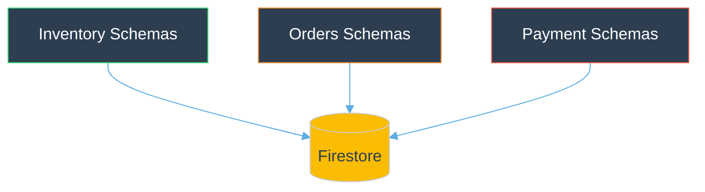

- **1 Firestore**, pero cada módulo es dueño de sus **colecciones**
- **NUNCA** se importa el schema/repositorio de otro módulo
- Comunicación inter-módulo: **Facade** (sync) o **Evento** (async)

Note:
Esta es la regla más importante del monolito modular.
Cada módulo es dueño de sus datos. No se comparten repositorios ni schemas entre módulos.
La comunicación es siempre a través de interfaces públicas (Facades) o eventos.

---

## 6. Módulos de Negocio

> 14 bounded contexts con responsabilidades claras

⬇️ _Navega hacia abajo para ver detalles_


Note:
14 modulos clasificados por complejidad.
Core Domain (rojo): full DDD con event sourcing - OMS, Payment, Shopping Cart, Inventory.
Supporting (naranja): logica moderada - Catalog, Customer, Logistics, Notification.
Generic (azul): CRUD simple - CMS, Articles, Documents, Storage.

----

### Mapa de Bounded Contexts

<div style="text-align: center;">
<svg width="800" height="340" viewBox="0 0 800 340" xmlns="http://www.w3.org/2000/svg">

  <!-- Core Domain -->
  <rect x="10" y="10" width="520" height="160" rx="8" fill="none" stroke="#e74c3c" stroke-width="2"/>
  <text x="20" y="30" fill="#e74c3c" font-size="11" font-weight="bold">CORE DOMAIN (Dominio Rico — Full DDD)</text>

  <rect x="20" y="42" width="120" height="55" rx="6" fill="#2c3e50" stroke="#e74c3c" stroke-width="2"/>
  <text x="80" y="64" text-anchor="middle" fill="#e74c3c" font-size="11" font-weight="bold">OMS</text>
  <text x="80" y="80" text-anchor="middle" fill="#bdc3c7" font-size="8">Órdenes, Fulfillment</text>
  <text x="80" y="90" text-anchor="middle" fill="#7f8c8d" font-size="7">Event Sourcing</text>

  <rect x="150" y="42" width="120" height="55" rx="6" fill="#2c3e50" stroke="#e74c3c" stroke-width="2"/>
  <text x="210" y="64" text-anchor="middle" fill="#e74c3c" font-size="11" font-weight="bold">Payment</text>
  <text x="210" y="80" text-anchor="middle" fill="#bdc3c7" font-size="8">Pagos, Transacciones</text>
  <text x="210" y="90" text-anchor="middle" fill="#7f8c8d" font-size="7">Saga Pattern</text>

  <rect x="280" y="42" width="120" height="55" rx="6" fill="#2c3e50" stroke="#e74c3c" stroke-width="2"/>
  <text x="340" y="64" text-anchor="middle" fill="#e74c3c" font-size="11" font-weight="bold">Shopping Cart</text>
  <text x="340" y="80" text-anchor="middle" fill="#bdc3c7" font-size="8">Carrito, Checkout</text>
  <text x="340" y="90" text-anchor="middle" fill="#7f8c8d" font-size="7">Aggregate Root</text>

  <rect x="410" y="42" width="110" height="55" rx="6" fill="#2c3e50" stroke="#e74c3c" stroke-width="2"/>
  <text x="465" y="64" text-anchor="middle" fill="#e74c3c" font-size="11" font-weight="bold">Inventory</text>
  <text x="465" y="80" text-anchor="middle" fill="#bdc3c7" font-size="8">Stock, Reservas</text>
  <text x="465" y="90" text-anchor="middle" fill="#7f8c8d" font-size="7">Domain Events</text>

  <!-- VTEX Seller -->
  <rect x="20" y="105" width="250" height="55" rx="6" fill="#2c3e50" stroke="#9b59b6" stroke-width="2"/>
  <text x="145" y="127" text-anchor="middle" fill="#9b59b6" font-size="11" font-weight="bold">VTEX External Seller Protocol</text>
  <text x="145" y="147" text-anchor="middle" fill="#bdc3c7" font-size="8">Simulación, Placement, Fulfillment — Marketplace Integration</text>

  <!-- Supporting Domain -->
  <rect x="540" y="10" width="250" height="160" rx="8" fill="none" stroke="#f39c12" stroke-width="2"/>
  <text x="550" y="30" fill="#f39c12" font-size="11" font-weight="bold">SUPPORTING (Lógica Moderada)</text>

  <rect x="555" y="42" width="105" height="50" rx="6" fill="#2c3e50" stroke="#f39c12" stroke-width="1"/>
  <text x="607" y="62" text-anchor="middle" fill="#f39c12" font-size="10">Catalog</text>
  <text x="607" y="78" text-anchor="middle" fill="#bdc3c7" font-size="8">Productos, SKUs</text>

  <rect x="670" y="42" width="105" height="50" rx="6" fill="#2c3e50" stroke="#f39c12" stroke-width="1"/>
  <text x="722" y="62" text-anchor="middle" fill="#f39c12" font-size="10">Customer</text>
  <text x="722" y="78" text-anchor="middle" fill="#bdc3c7" font-size="8">Clientes, Crédito</text>

  <rect x="555" y="100" width="105" height="50" rx="6" fill="#2c3e50" stroke="#f39c12" stroke-width="1"/>
  <text x="607" y="120" text-anchor="middle" fill="#f39c12" font-size="10">Logistics</text>
  <text x="607" y="136" text-anchor="middle" fill="#bdc3c7" font-size="8">Envío, Promesa</text>

  <rect x="670" y="100" width="105" height="50" rx="6" fill="#2c3e50" stroke="#f39c12" stroke-width="1"/>
  <text x="722" y="117" text-anchor="middle" fill="#f39c12" font-size="10">Notification</text>
  <text x="722" y="131" text-anchor="middle" fill="#bdc3c7" font-size="8">Salesforce MC</text>
  <text x="722" y="143" text-anchor="middle" fill="#7f8c8d" font-size="7">Email, SMS, WSP, Push</text>

  <!-- Generic Domain -->
  <rect x="10" y="185" width="780" height="70" rx="8" fill="none" stroke="#3498db" stroke-width="1" stroke-dasharray="4"/>
  <text x="20" y="203" fill="#3498db" font-size="11" font-weight="bold">GENERIC (CRUD — Sin Dominio Rico)</text>

  <rect x="30" y="212" width="95" height="35" rx="5" fill="#2c3e50" stroke="#3498db" stroke-width="1"/>
  <text x="77" y="234" text-anchor="middle" fill="#3498db" font-size="9">CMS</text>

  <rect x="135" y="212" width="95" height="35" rx="5" fill="#2c3e50" stroke="#3498db" stroke-width="1"/>
  <text x="182" y="234" text-anchor="middle" fill="#3498db" font-size="9">Articles</text>

  <rect x="240" y="212" width="95" height="35" rx="5" fill="#2c3e50" stroke="#3498db" stroke-width="1"/>
  <text x="287" y="234" text-anchor="middle" fill="#3498db" font-size="9">Documents</text>

  <rect x="345" y="212" width="95" height="35" rx="5" fill="#2c3e50" stroke="#3498db" stroke-width="1"/>
  <text x="392" y="234" text-anchor="middle" fill="#3498db" font-size="9">Storage</text>

  <rect x="450" y="212" width="115" height="35" rx="5" fill="#2c3e50" stroke="#3498db" stroke-width="1"/>
  <text x="507" y="234" text-anchor="middle" fill="#3498db" font-size="9">Customer Sale</text>

  <!-- Shared Kernel -->
  <rect x="10" y="270" width="780" height="55" rx="8" fill="none" stroke="#f1c40f" stroke-width="2"/>
  <text x="20" y="290" fill="#f1c40f" font-size="11" font-weight="bold">SHARED KERNEL (Cross-Cutting)</text>

  <rect x="30" y="295" width="100" height="24" rx="4" fill="#7d6608"/>
  <text x="80" y="311" text-anchor="middle" fill="white" font-size="9">Unified Auth</text>

  <rect x="140" y="295" width="100" height="24" rx="4" fill="#7d6608"/>
  <text x="190" y="311" text-anchor="middle" fill="white" font-size="9">Cache (Redis)</text>

  <rect x="250" y="295" width="100" height="24" rx="4" fill="#7d6608"/>
  <text x="300" y="311" text-anchor="middle" fill="white" font-size="9">Logger (Pino)</text>

  <rect x="360" y="295" width="100" height="24" rx="4" fill="#7d6608"/>
  <text x="410" y="311" text-anchor="middle" fill="white" font-size="9">Telemetry</text>

  <rect x="470" y="295" width="100" height="24" rx="4" fill="#7d6608"/>
  <text x="520" y="311" text-anchor="middle" fill="white" font-size="9">Database</text>

  <rect x="580" y="295" width="100" height="24" rx="4" fill="#7d6608"/>
  <text x="630" y="311" text-anchor="middle" fill="white" font-size="9">Config Validation</text>

  <rect x="690" y="295" width="90" height="24" rx="4" fill="#7d6608"/>
  <text x="735" y="311" text-anchor="middle" fill="white" font-size="9">Health Checks</text>

</svg>
</div>

Note:
Clasificamos los módulos según complejidad (RFC-0062 Pragmatic Architecture):
Core Domain: full DDD con entities, value objects, domain events, aggregates.
Supporting: lógica moderada, entities pero sin event sourcing.
Generic: CRUD simple, 3 capas sin capa de dominio.
Esta clasificación evita sobre-ingeniería en módulos simples.

----

### Comunicación Entre Módulos

<div style="font-size: 0.7em;">

| Tipo | Mecanismo | Ejemplo |
|------|-----------|---------|
| **Sync Query** | Facade | `CatalogFacade.getProduct(sku)` |
| **Sync Command** | Facade | `InventoryFacade.reserveStock(items)` |
| **Async Event** | Pub/Sub | `OrderConfirmedEvent → ReserveStock` |
| **Scheduled** | Cloud Scheduler | Sync stock cada hora |

</div>

Note:
4 formas de comunicacion entre modulos.
Facade para llamadas sincronas (queries y commands).
Pub/Sub para eventos asincrono (fire-and-forget).
Cloud Scheduler para tareas periodicas.

----

### Facade Pattern — Ejemplo

```typescript
// Facade — API pública del módulo (única forma de comunicación cross-module)
@Injectable()
export class EcommerceInventoryFacade {
  /** Consulta de stock — puede ser llamado por OMS, Cart, Catalog */
  async getStockBySku(sku: string, branchCode: string): Promise<StockDto> {
    return this.stockService.findBySku(sku, branchCode);
  }

  /** Reserva de stock — llamado cuando se confirma una orden */
  async reserveStock(items: ReserveStockDto[]): Promise<ReservationResult> {
    return this.stockService.reserve(items);
  }
}
```

> **Regla**: NUNCA importar directamente el repositorio de otro módulo — siempre vía Facade

Note:
La Facade es la unica forma de comunicacion cross-module.
Si OMS necesita stock, llama a InventoryFacade, no importa el repositorio de Inventory.
Esto mantiene los boundaries estrictos y permite extraer un modulo como microservicio en el futuro.

---

## 7. Integraciones Externas

> La plataforma orquesta múltiples servicios externos con patrones de resiliencia

⬇️ _Navega hacia abajo para ver detalles_


Note:
La plataforma orquesta multiples servicios externos.
Payment gateways varian por pais, notificaciones via Salesforce Marketing Cloud,
ERPs conectados via adapters, y Algolia como motor de busqueda.
Cada integracion tiene su propio circuit breaker.

----

### Ecosistema de Integraciones

<div style="text-align: center;">
<svg width="800" height="420" viewBox="0 0 800 420" xmlns="http://www.w3.org/2000/svg">

  <!-- Integration API center -->
  <rect x="270" y="160" width="260" height="80" rx="10" fill="#1a252f" stroke="#f1c40f" stroke-width="3"/>
  <text x="400" y="195" text-anchor="middle" fill="#f1c40f" font-size="14" font-weight="bold">Integration Platform</text>
  <text x="400" y="215" text-anchor="middle" fill="#bdc3c7" font-size="9">Integration API + Workers</text>

  <!-- Marketplace (top) -->
  <rect x="50" y="20" width="150" height="55" rx="8" fill="#9b59b6"/>
  <text x="125" y="42" text-anchor="middle" fill="white" font-size="10" font-weight="bold">VTEX Marketplace</text>
  <text x="125" y="58" text-anchor="middle" fill="#e8d5f5" font-size="8">External Seller Protocol</text>
  <line x1="170" y1="75" x2="310" y2="160" stroke="#9b59b6" stroke-width="2"/>

  <!-- Algolia (top center) -->
  <rect x="310" y="20" width="130" height="55" rx="8" fill="#5468FF"/>
  <text x="375" y="42" text-anchor="middle" fill="white" font-size="10" font-weight="bold">Algolia</text>
  <text x="375" y="58" text-anchor="middle" fill="#c7cfff" font-size="8">Search Engine</text>
  <line x1="375" y1="75" x2="400" y2="160" stroke="#5468FF" stroke-width="2"/>

  <!-- Salesforce (top right) -->
  <rect x="520" y="20" width="160" height="55" rx="8" fill="#00a1e0"/>
  <text x="600" y="42" text-anchor="middle" fill="white" font-size="10" font-weight="bold">Salesforce Marketing</text>
  <text x="600" y="58" text-anchor="middle" fill="#cceeff" font-size="8">Cloud Journey Builder</text>
  <line x1="550" y1="75" x2="470" y2="160" stroke="#00a1e0" stroke-width="2"/>

  <!-- Payment Gateways (left) -->
  <rect x="10" y="110" width="130" height="30" rx="5" fill="#e74c3c"/>
  <text x="75" y="130" text-anchor="middle" fill="white" font-size="9">Webpay / Transbank</text>
  <rect x="10" y="145" width="130" height="30" rx="5" fill="#e74c3c"/>
  <text x="75" y="165" text-anchor="middle" fill="white" font-size="9">Khipu</text>
  <rect x="10" y="180" width="130" height="30" rx="5" fill="#e74c3c"/>
  <text x="75" y="200" text-anchor="middle" fill="white" font-size="9">MercadoPago</text>
  <rect x="10" y="215" width="130" height="30" rx="5" fill="#e74c3c"/>
  <text x="75" y="235" text-anchor="middle" fill="white" font-size="9">Niubiz</text>
  <text x="75" y="262" text-anchor="middle" fill="#e74c3c" font-size="9" font-weight="bold">Payment Gateways</text>
  <line x1="140" y1="175" x2="270" y2="195" stroke="#e74c3c" stroke-width="2"/>

  <!-- ERP (right) -->
  <rect x="660" y="130" width="130" height="30" rx="5" fill="#d35400"/>
  <text x="725" y="150" text-anchor="middle" fill="white" font-size="9">Dynamics AX (CL)</text>
  <rect x="660" y="165" width="130" height="30" rx="5" fill="#d35400"/>
  <text x="725" y="185" text-anchor="middle" fill="white" font-size="9">Custom ERP (PE)</text>
  <rect x="660" y="200" width="130" height="30" rx="5" fill="#d35400"/>
  <text x="725" y="220" text-anchor="middle" fill="white" font-size="9">Gira (ES)</text>
  <text x="725" y="247" text-anchor="middle" fill="#d35400" font-size="9" font-weight="bold">ERPs por País</text>
  <line x1="530" y1="195" x2="660" y2="185" stroke="#d35400" stroke-width="2"/>

  <!-- Messaging (bottom left) -->
  <rect x="80" y="310" width="150" height="55" rx="8" fill="#27ae60"/>
  <text x="155" y="332" text-anchor="middle" fill="white" font-size="10" font-weight="bold">Cloud Pub/Sub</text>
  <text x="155" y="348" text-anchor="middle" fill="#d5f5e3" font-size="8">Event-Driven Messaging</text>
  <line x1="200" y1="310" x2="340" y2="240" stroke="#27ae60" stroke-width="2"/>

  <!-- Databases (bottom center) -->
  <rect x="310" y="300" width="180" height="55" rx="8" fill="#f39c12"/>
  <text x="400" y="322" text-anchor="middle" fill="#2c3e50" font-size="10" font-weight="bold">Databases</text>
  <text x="400" y="340" text-anchor="middle" fill="#2c3e50" font-size="8">Firestore + SQL Server + PostgreSQL + Redis</text>
  <line x1="400" y1="300" x2="400" y2="240" stroke="#f39c12" stroke-width="2"/>

  <!-- Twilio / WhatsApp (bottom right) -->
  <rect x="560" y="300" width="120" height="28" rx="5" fill="#1abc9c"/>
  <text x="620" y="319" text-anchor="middle" fill="white" font-size="9">Twilio (SMS)</text>
  <rect x="560" y="335" width="120" height="28" rx="5" fill="#1abc9c"/>
  <text x="620" y="354" text-anchor="middle" fill="white" font-size="9">WhatsApp Business</text>
  <rect x="560" y="370" width="120" height="28" rx="5" fill="#1abc9c"/>
  <text x="620" y="389" text-anchor="middle" fill="white" font-size="9">SMTP (Email)</text>
  <text x="620" y="415" text-anchor="middle" fill="#1abc9c" font-size="9" font-weight="bold">Canales Legacy</text>
  <line x1="570" y1="310" x2="470" y2="240" stroke="#1abc9c" stroke-width="2"/>

</svg>
</div>

Note:
La plataforma no vive aislada — orquesta múltiples servicios externos.
Los payment gateways varían por país, las notificaciones van por Salesforce Marketing Cloud,
y los ERPs se conectan vía adapters específicos. Todo con circuit breaker y retry.

----

### Salesforce Marketing Cloud — Flujo

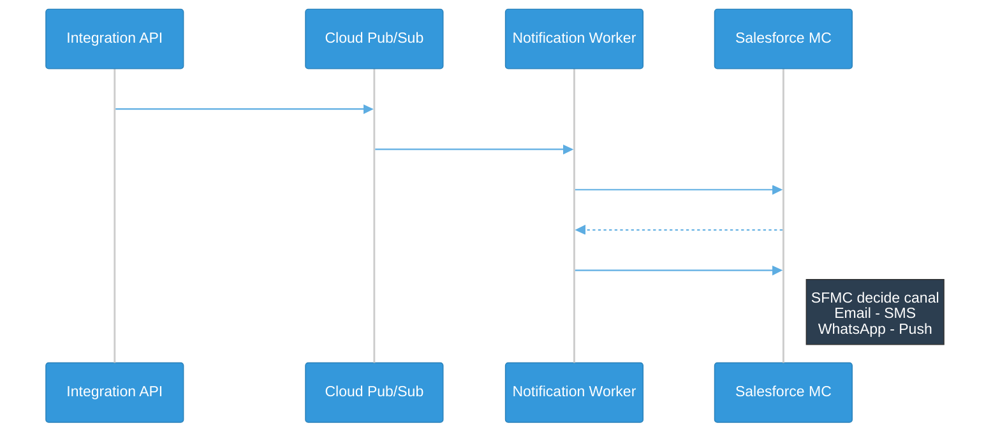

Note:
Salesforce Marketing Cloud es el motor de notificaciones transaccionales.
El Integration API publica eventos, el notification-worker los procesa y dispara Journeys en SFMC.
SFMC decide el canal (email, SMS, WhatsApp, push) segun la configuracion del Journey.
Esto permite al equipo de marketing configurar canales y templates sin tocar codigo.

----

### Salesforce Marketing Cloud — Journeys

<div style="font-size: 0.6em;">

| Notificación | Journey SFMC | Trigger |
|-------------|-------------|---------|
| Orden confirmada (pickup) | `ORDER_CONFIRMED_PICKUP` | Orden pagada, retiro en tienda |
| Orden confirmada (despacho) | `ORDER_CONFIRMED_DELIVERY` | Orden pagada, envío a domicilio |
| Orden despachada | `ORDER_SHIPPED` | Carrier confirma despacho |
| Listo para retiro | `READY_FOR_PICKUP` | Stock preparado en tienda |
| Orden entregada | `ORDER_DELIVERED` | Confirmación de entrega |
| Orden retirada | `ORDER_PICKED_UP` | Cliente retiró en tienda |
| Recordatorio retiro | `PICKUP_REMINDER` | 24h después de ready-for-pickup |
| Problema con orden | `ORDER_PROBLEM` | Incidencia detectada |
| Descarga factura | `DOWNLOAD_INVOICE` | Factura disponible |
| Agradecimiento | `PURCHASE_THANK_YOU` | Post-compra |

</div>

Note:
10 tipos de notificacion transaccional, cada uno mapeado a un Journey en SFMC.
El equipo de marketing configura los canales y templates en SFMC sin tocar codigo.
El notification-worker solo dispara el evento con el payload — SFMC decide el canal.

----

### Payment Gateways por País

<div style="font-size: 0.6em;">

| País | Gateway | Tipo | Uso |
|------|---------|------|-----|
| **Chile** | **Webpay (Transbank)** | Tarjeta crédito/débito | Web y presencial |
| **Chile** | **Khipu** | Transferencia bancaria | Sin tarjeta |
| **Chile** | **MercadoPago** | Wallet + tarjeta | Móviles |
| **Peru** | **Niubiz** | Tarjeta crédito/débito | Web |
| **Peru** | **MercadoPago** | Wallet + tarjeta | Móviles |
| **Regional** | **Orden de Compra** | B2B con OTP | Corporativo |

</div>

> Cada gateway tiene **circuit breaker independiente** — si Niubiz cae, Webpay sigue

Note:
Chile: Webpay (tarjetas), Khipu (transferencias), MercadoPago (wallets).
Peru: Niubiz (tarjetas), MercadoPago (wallets).
Todos soportan Orden de Compra B2B con OTP.
Seleccion dinamica via PaymentGatewayFactory (mismo patron adapter que ERPs).

----

### Payment Gateway Factory

```typescript
// Selección dinámica de gateway según país y método de pago
@Injectable()
export class PaymentGatewayFactory {
  resolve(countryCode: string, method: PaymentMethod): PaymentGateway {
    // Chile: Webpay para tarjetas, Khipu para transferencias
    // Peru: Niubiz para tarjetas, MercadoPago para wallets
    // Todos: Orden de Compra B2B con validación OTP
  }
}
```

> Mismo patrón que `ErpSyncFactory` — **Adapter Pattern** aplicado a pagos

Note:
Mismo patron de adapter que usamos para los ERPs.
El factory resuelve en runtime que gateway usar segun pais y metodo de pago.
Agregar un nuevo gateway es agregar una entrada sin tocar logica existente.

----

### VTEX External Seller Protocol (RFC-0045)

<div style="text-align: center;">
<svg width="750" height="280" viewBox="0 0 750 280" xmlns="http://www.w3.org/2000/svg">

  <!-- VTEX -->
  <rect x="20" y="110" width="120" height="60" rx="8" fill="#9b59b6"/>
  <text x="80" y="135" text-anchor="middle" fill="white" font-size="11" font-weight="bold">VTEX</text>
  <text x="80" y="152" text-anchor="middle" fill="#e8d5f5" font-size="8">Marketplace</text>

  <!-- Arrow 1: Simulation -->
  <line x1="140" y1="125" x2="250" y2="50" stroke="#3498db" stroke-width="2" marker-end="url(#arrowP)"/>
  <text x="180" y="78" fill="#3498db" font-size="8">1. Simulation</text>

  <!-- Arrow 2: Placement -->
  <line x1="140" y1="140" x2="250" y2="140" stroke="#2ecc71" stroke-width="2" marker-end="url(#arrowP)"/>
  <text x="195" y="133" fill="#2ecc71" font-size="8">2. Placement</text>

  <!-- Arrow 3: Authorize -->
  <line x1="140" y1="155" x2="250" y2="230" stroke="#e67e22" stroke-width="2" marker-end="url(#arrowP)"/>
  <text x="175" y="205" fill="#e67e22" font-size="8">3. Authorize</text>

  <!-- Simulation box -->
  <rect x="250" y="20" width="480" height="60" rx="8" fill="#2c3e50" stroke="#3498db" stroke-width="2"/>
  <text x="490" y="40" text-anchor="middle" fill="#3498db" font-size="11" font-weight="bold">Fulfillment Simulation</text>
  <text x="490" y="58" text-anchor="middle" fill="#bdc3c7" font-size="8">Stock + Precio real por sucursal + SLAs de envío (paralelo, &lt;2.5s)</text>
  <text x="490" y="72" text-anchor="middle" fill="#7f8c8d" font-size="7">3 modos: Catálogo (100ms) | Browse (200ms) | Checkout (1-2s)</text>

  <!-- Placement box -->
  <rect x="250" y="110" width="480" height="60" rx="8" fill="#2c3e50" stroke="#2ecc71" stroke-width="2"/>
  <text x="490" y="130" text-anchor="middle" fill="#2ecc71" font-size="11" font-weight="bold">Order Placement</text>
  <text x="490" y="148" text-anchor="middle" fill="#bdc3c7" font-size="8">Idempotente por marketplaceOrderId — Validación + Reserva de stock</text>
  <text x="490" y="162" text-anchor="middle" fill="#7f8c8d" font-size="7">PII masking en logs, métricas de duración y éxito/fallo</text>

  <!-- Authorize box -->
  <rect x="250" y="200" width="480" height="60" rx="8" fill="#2c3e50" stroke="#e67e22" stroke-width="2"/>
  <text x="490" y="220" text-anchor="middle" fill="#e67e22" font-size="11" font-weight="bold">Authorize Fulfillment</text>
  <text x="490" y="238" text-anchor="middle" fill="#bdc3c7" font-size="8">Confirmación de pago → inicia fulfillment → dispara notificaciones</text>
  <text x="490" y="252" text-anchor="middle" fill="#7f8c8d" font-size="7">Orquesta: OMS + Inventory + Payment + Notification vía eventos</text>

  <defs>
    <marker id="arrowP" markerWidth="8" markerHeight="8" refX="7" refY="3" orient="auto">
      <path d="M0,0 L0,6 L8,3 z" fill="#888"/>
    </marker>
  </defs>
</svg>
</div>

Note:
El protocolo VTEX External Seller tiene 3 operaciones principales.
Simulation: VTEX consulta disponibilidad, precio y SLAs. Corre en paralelo (stock + pricing + logistics).
Placement: VTEX envía la orden. Idempotente para evitar duplicados.
Authorize: VTEX confirma el pago. Dispara todo el flujo de fulfillment.

---

## 8. Workers & Procesamiento Asíncrono

> 5 workers independientes en Cloud Run para procesamiento asíncrono y scheduled jobs

⬇️ _Navega hacia abajo para ver detalles_


Note:
5 workers independientes en Cloud Run.
El notification-worker es el unico Service (push de Pub/Sub en tiempo real).
Los demas son Jobs ejecutados por Cloud Scheduler.
Si preguntan por BullMQ: no usamos, preferimos Pub/Sub por ser serverless.

----

### Arquitectura de Workers

<div style="font-size: 0.65em;">

| Worker | Tipo Cloud Run | Trigger | Responsabilidad |
|--------|---------------|---------|-----------------|
| **notification-worker** | Service (push) | Pub/Sub push inmediato | Procesa notificaciones transaccionales vía Salesforce MC |
| **notification-retry-worker** | Job (scheduled) | Cloud Scheduler cada 5 min | Recupera notificaciones PENDING, PROCESSING y RETRY_SCHEDULED |
| **sync-worker** | Job (scheduled) | Cloud Scheduler (4 tasks) | Sincronización ERP: stock, precios, órdenes, reconciliación |
| **report-worker** | Job (scheduled) | Cloud Scheduler (4 reports) | Genera reportes: inventario, ventas, pricing, consolidado |
| **pickup-reminder-worker** | Job (scheduled) | Cloud Scheduler cada hora | Envía recordatorio 24h después de "listo para retiro" |

</div>


Note:
5 workers. notification-worker es Service (push Pub/Sub en tiempo real).
Los otros 4 son Jobs por Cloud Scheduler.
notification-retry-worker tiene 23mil+ ejecuciones (cada 5 min).
sync-worker se conecta a Dynamics AX via SQL directo.

----

### Sync Worker — Tareas Programadas

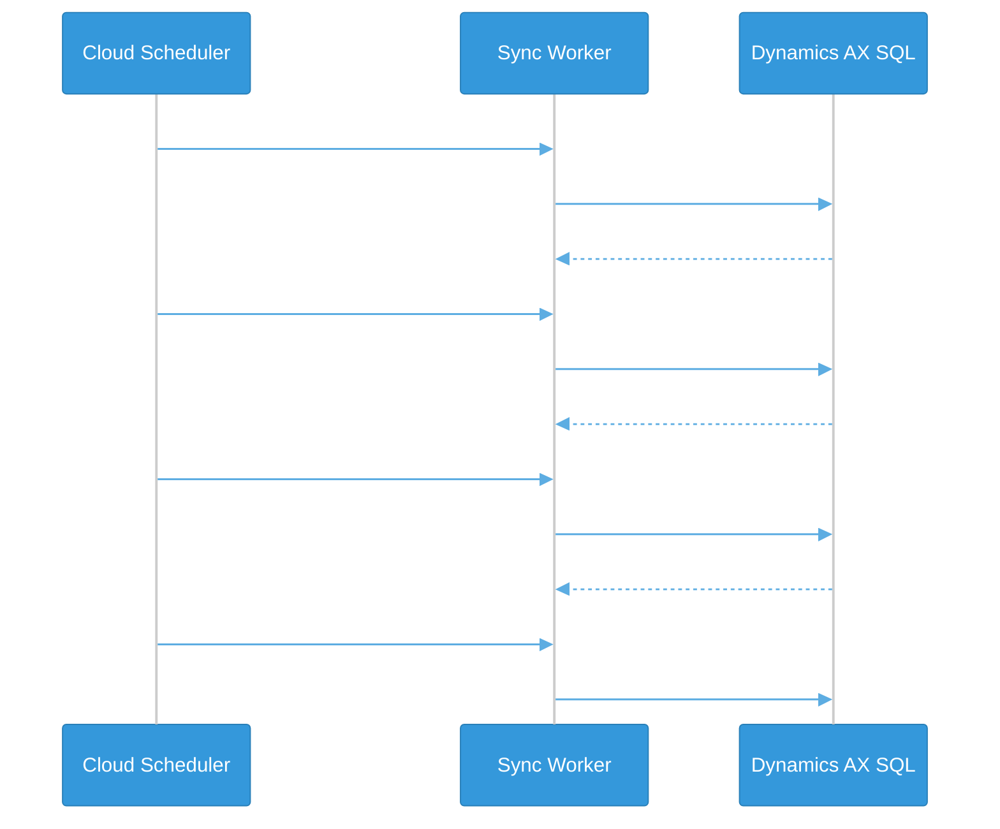


Note:
4 tipos de sync con Dynamics AX:
Stock: cada hora 8AM-8PM lun-sab (horario tiendas).
ERP: delta cada 4 horas. Full: diario 2AM. Reconcile: domingos 3AM.

----

### Notification Worker — Flujo Completo

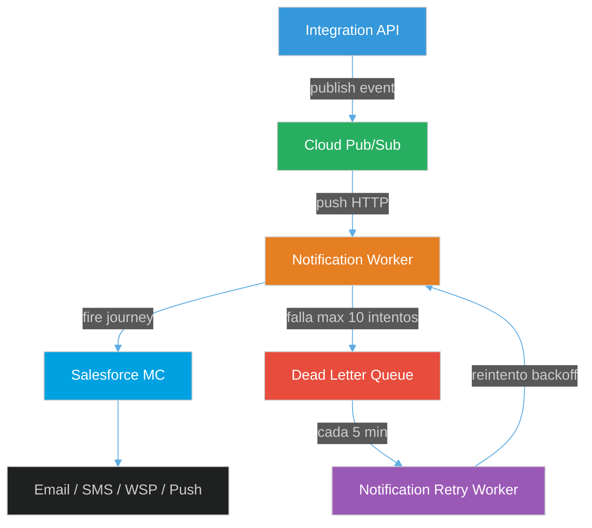

Note:
Flujo: Integration API publica en Pub/Sub, worker recibe via push HTTP,
se autentica con SFMC via OAuth2, y dispara un Journey.
Si falla, Pub/Sub reintenta 10 veces. Despues va a DLQ.
Retry worker cada 5 min con backoff exponencial.

----

### Notification Worker — Resiliencia

- **Circuit breaker** separado para auth SFMC y delivery
- **Token refresh** proactivo con mutex (evita thundering herd)
- **Clasificación de errores**: retryable vs non-retryable
- **Máximo 5 reintentos** por notificación con backoff: 5→10→20→30→30 min
- **Dead Letter Queue** captura mensajes que agotan reintentos

Note:
Cada componente tiene su propio circuit breaker.
Si SFMC auth cae, el delivery circuit breaker sigue independiente.
Token refresh usa mutex para evitar que N workers pidan token al mismo tiempo.

---

## 9. Clean Architecture

> 5 capas con regla de dependencia estricta: las dependencias siempre apuntan hacia adentro

⬇️ _Navega hacia abajo para ver detalles_


Note:
5 capas con regla de dependencia estricta: las externas dependen de las internas.
La capa de Domain es TypeScript puro, sin dependencias de frameworks.
Modulos CRUD-ish NO tienen capa de dominio (RFC-0062 arquitectura pragmatica).

----

<!-- .slide: data-background="#0d1117" -->

### Las 5 Capas

<div style="text-align: center;">
<svg width="600" height="350" viewBox="0 0 600 350" xmlns="http://www.w3.org/2000/svg">
  <rect x="20" y="10" width="560" height="330" rx="15" fill="none" stroke="#95a5a6" stroke-width="2"/>
  <text x="300" y="35" text-anchor="middle" fill="#95a5a6" font-size="12" font-weight="bold">Config — Bootstrap del módulo</text>

  <rect x="50" y="45" width="500" height="270" rx="12" fill="none" stroke="#3498db" stroke-width="2"/>
  <text x="300" y="65" text-anchor="middle" fill="#3498db" font-size="12" font-weight="bold">API — Controllers, DTOs, Swagger</text>

  <rect x="80" y="80" width="440" height="210" rx="10" fill="none" stroke="#e67e22" stroke-width="2"/>
  <text x="300" y="100" text-anchor="middle" fill="#e67e22" font-size="12" font-weight="bold">Infrastructure — Repos, Adapters, Schemas</text>

  <rect x="120" y="115" width="360" height="150" rx="8" fill="none" stroke="#2ecc71" stroke-width="2"/>
  <text x="300" y="135" text-anchor="middle" fill="#2ecc71" font-size="12" font-weight="bold">Application — Facades, Services, Ports</text>

  <rect x="170" y="155" width="260" height="80" rx="8" fill="#1a252f" stroke="#e74c3c" stroke-width="3"/>
  <text x="300" y="185" text-anchor="middle" fill="#e74c3c" font-size="14" font-weight="bold">Domain</text>
  <text x="300" y="210" text-anchor="middle" fill="#bdc3c7" font-size="10">Entities, Value Objects, Events</text>
  <text x="300" y="225" text-anchor="middle" fill="#7f8c8d" font-size="9">CERO dependencias externas</text>

  <text x="540" y="180" fill="#7f8c8d" font-size="9" transform="rotate(-90, 540, 180)">Dependencias →</text>
</svg>
</div>

Note:
La capa de Domain no tiene dependencias externas — es TypeScript puro.
Application define los puertos (interfaces) y la logica de orquestacion.
Infrastructure implementa los puertos con tecnologias concretas.
API expone los endpoints HTTP. Config solo hace wiring de dependencias.

----

### Regla de Dependencia

<div style="font-size: 0.7em;">

| Capa | Responsabilidad | Puede Importar |
|------|----------------|----------------|
| **Domain** | Reglas de negocio puras | Nada externo |
| **Application** | Orquestación, casos de uso | Domain |
| **Infrastructure** | Implementaciones (DB, HTTP) | Application, Domain |
| **API** | Controllers, DTOs, Swagger | Application |
| **Config** | Bootstrap, wiring | Todo (solo DI) |

</div>

> Las dependencias siempre apuntan **hacia adentro** — Domain no sabe que existe NestJS, Mongoose ni HTTP

Note:
Regla fundamental: las capas externas dependen de las internas, nunca al reves.
Domain es TypeScript puro. Application define puertos (interfaces).
Infrastructure implementa esos puertos con Mongoose, HTTP, etc.
Esto permite testear la logica de negocio sin DB ni framework.

----

### Estructura de un Módulo

```
libs/ecommerce-inventory/
├── domain/               # Reglas de negocio puras
│   ├── entities/         # Stock, Warehouse, Reservation
│   ├── value-objects/    # SKU, BranchCode, Quantity
│   ├── events/           # StockReservedEvent, StockUpdatedEvent
│   ├── errors/           # InsufficientStockException
│   └── repositories/     # Interfaces (no implementaciones)
│
├── application/          # Casos de uso
│   ├── facades/          # API pública: InventoryFacade
│   ├── services/         # StockService, ReservationService
│   └── ports/            # Interfaces para adapters externos
│
├── infrastructure/       # Implementaciones concretas
│   ├── persistence/
│   │   ├── schemas/      # Mongoose schemas
│   │   ├── repositories/ # MongoStockRepository implements StockRepository
│   │   └── mappers/      # Domain ↔ Persistence mappers
│   └── adapters/         # ErpStockSyncAdapter, etc.
│
└── api/                  # Presentación HTTP
    ├── controllers/      # StockController, WarehouseController
    └── dto/              # Request/Response DTOs con validación
```

Note:
Cada módulo tiene exactamente esta estructura. Los módulos CRUD-ish pueden omitir la capa de dominio.
La clave es que las dependencias siempre van de afuera hacia adentro.

---

## 10. Seguridad — Defense in Depth

> 8 capas de seguridad: si una falla, las demás siguen protegiendo

⬇️ _Navega hacia abajo para ver detalles_


Note:
8 capas de seguridad. Si una falla, las demas siguen protegiendo.
Cloud Run provee TLS y proteccion DDoS nativa.
El auth es fail-closed: si Redis cae, se rechazan todos los requests.

----

### Las Capas de Seguridad

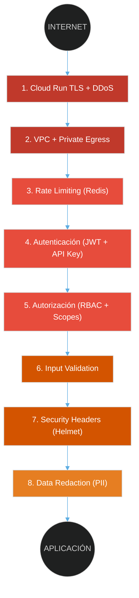

Note:
Defense in Depth — cada capa protege contra amenazas específicas.
Cloud Run provee TLS y protección DDoS nativa. La VPC aísla los recursos internos.
Si una capa falla, las demás siguen protegiendo.

----

### Autenticación Unificada (RFC-0051)

<div style="font-size: 0.65em;">

```typescript
// UnifiedAuthGuard — Global APP_GUARD, evaluado en CADA request
// 1. @Public → Best-effort (no falla si no hay token)
// 2. X-API-Key → Valida SHA-256 en Redis → ClientContext { scopes }
// 3. Bearer JWT → Valida firma + blacklist (fail-closed) → ClientContext { roles }
// 4. Ambos headers → 400 Bad Request (ambigüedad)
// 5. Ninguno → 401 Unauthorized
```

</div>

<div style="font-size: 0.6em;">

| Tipo | Header | Método | Uso |
|------|--------|--------|-----|
| **Humanos** | `Authorization: Bearer` | JWT firmado | Frontend, Admin, Caja |
| **Máquinas** | `X-API-Key: vtx_live_...` | API Key SHA-256 | ERP, VTEX, Partners |
| **Gateway** | `x-consumer-id` | Pre-validado | API Gateway corporativo |

</div>

Note:
UnifiedAuthGuard evalua CADA request. JWT para humanos, API Key para maquinas.
Si llegan ambos headers: 400 Bad Request (ambiguedad).
Blacklist en Redis es fail-closed: si Redis cae, se rechazan todos.

----

### Rate Limiting Multi-Nivel

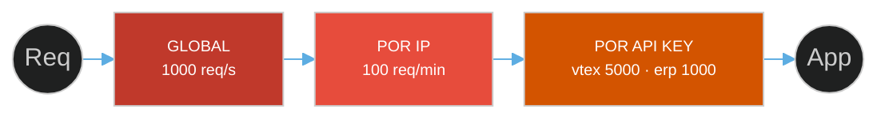

> **Storage**: Redis distribuido — consistente en todas las instancias

Note:
3 niveles: Global (1000 req/s), por IP (100 req/min), por API Key (configurable).
Storage en Redis distribuido, consistente en todas las instancias.

---

## 11. Infraestructura & Despliegue

> GCP Cloud Run: serverless, auto-scaling, zero-ops

⬇️ _Navega hacia abajo para ver detalles_


Note:
Todo en GCP managed services. Cloud Run, Firestore, Pub/Sub.
Docker usa Google Distroless: sin shell, sin package manager, 90% menos CVEs.
Si preguntan por Kubernetes: no lo necesitamos, Cloud Run escala automaticamente.

----

### Stack de Infraestructura

<div style="text-align: center;">
<svg width="750" height="400" viewBox="0 0 750 400" xmlns="http://www.w3.org/2000/svg">

  <!-- GCP Cloud -->
  <rect x="10" y="10" width="730" height="380" rx="12" fill="none" stroke="#4285f4" stroke-width="2"/>
  <text x="375" y="35" text-anchor="middle" fill="#4285f4" font-size="14" font-weight="bold">Google Cloud Platform</text>

  <!-- Row 1: Networking -->
  <rect x="30" y="50" width="690" height="55" rx="6" fill="#1a252f"/>
  <text x="50" y="70" fill="#ea4335" font-size="10" font-weight="bold">NETWORKING</text>

  <rect x="160" y="58" width="150" height="35" rx="4" fill="#ea4335"/>
  <text x="235" y="80" text-anchor="middle" fill="white" font-size="9">Cloud Run TLS + DDoS</text>

  <rect x="320" y="58" width="130" height="35" rx="4" fill="#ea4335"/>
  <text x="385" y="80" text-anchor="middle" fill="white" font-size="9">VPC + Direct Egress</text>

  <rect x="460" y="58" width="130" height="35" rx="4" fill="#ea4335"/>
  <text x="525" y="80" text-anchor="middle" fill="white" font-size="9">VPC Peering (Omni)</text>

  <rect x="600" y="58" width="100" height="35" rx="4" fill="#ea4335"/>
  <text x="650" y="80" text-anchor="middle" fill="white" font-size="9">IAM + SA</text>

  <!-- Row 2: Compute -->
  <rect x="30" y="115" width="690" height="70" rx="6" fill="#1a252f"/>
  <text x="50" y="135" fill="#4285f4" font-size="10" font-weight="bold">COMPUTE</text>

  <rect x="160" y="125" width="130" height="50" rx="4" fill="#4285f4"/>
  <text x="225" y="147" text-anchor="middle" fill="white" font-size="10" font-weight="bold">Cloud Run</text>
  <text x="225" y="163" text-anchor="middle" fill="#d5e8f7" font-size="8">Integration API + Workers</text>

  <rect x="300" y="125" width="130" height="50" rx="4" fill="#4285f4"/>
  <text x="365" y="147" text-anchor="middle" fill="white" font-size="10" font-weight="bold">Cloud Scheduler</text>
  <text x="365" y="163" text-anchor="middle" fill="#d5e8f7" font-size="8">Cron Jobs</text>

  <rect x="440" y="125" width="130" height="50" rx="4" fill="#4285f4"/>
  <text x="505" y="147" text-anchor="middle" fill="white" font-size="10" font-weight="bold">Cloud Tasks</text>
  <text x="505" y="163" text-anchor="middle" fill="#d5e8f7" font-size="8">Async Processing</text>

  <rect x="580" y="125" width="130" height="50" rx="4" fill="#4285f4"/>
  <text x="645" y="147" text-anchor="middle" fill="white" font-size="10" font-weight="bold">Artifact Registry</text>
  <text x="645" y="163" text-anchor="middle" fill="#d5e8f7" font-size="8">Docker Images</text>

  <!-- Row 3: Data -->
  <rect x="30" y="195" width="690" height="65" rx="6" fill="#1a252f"/>
  <text x="50" y="215" fill="#fbbc04" font-size="10" font-weight="bold">DATA</text>

  <rect x="160" y="205" width="120" height="45" rx="4" fill="#fbbc04"/>
  <text x="220" y="224" text-anchor="middle" fill="#2c3e50" font-size="9" font-weight="bold">Firestore</text>
  <text x="220" y="240" text-anchor="middle" fill="#2c3e50" font-size="8">MongoDB API</text>

  <rect x="290" y="205" width="120" height="45" rx="4" fill="#fbbc04"/>
  <text x="350" y="224" text-anchor="middle" fill="#2c3e50" font-size="9" font-weight="bold">Memorystore</text>
  <text x="350" y="240" text-anchor="middle" fill="#2c3e50" font-size="8">Redis Cache</text>

  <rect x="420" y="205" width="120" height="45" rx="4" fill="#fbbc04"/>
  <text x="480" y="224" text-anchor="middle" fill="#2c3e50" font-size="9" font-weight="bold">Secret Manager</text>
  <text x="480" y="240" text-anchor="middle" fill="#2c3e50" font-size="8">Credenciales</text>

  <rect x="550" y="205" width="120" height="45" rx="4" fill="#fbbc04"/>
  <text x="610" y="224" text-anchor="middle" fill="#2c3e50" font-size="9" font-weight="bold">Cloud Storage</text>
  <text x="610" y="240" text-anchor="middle" fill="#2c3e50" font-size="8">Archivos</text>

  <!-- Row 4: Messaging -->
  <rect x="30" y="270" width="340" height="55" rx="6" fill="#1a252f"/>
  <text x="50" y="290" fill="#34a853" font-size="10" font-weight="bold">MESSAGING</text>

  <rect x="160" y="280" width="90" height="35" rx="4" fill="#34a853"/>
  <text x="205" y="302" text-anchor="middle" fill="white" font-size="9">Cloud Pub/Sub</text>

  <rect x="260" y="280" width="100" height="35" rx="4" fill="#34a853"/>
  <text x="310" y="302" text-anchor="middle" fill="white" font-size="9">Dead Letter Queue</text>

  <!-- Row 4b: Observability -->
  <rect x="380" y="270" width="340" height="55" rx="6" fill="#1a252f"/>
  <text x="400" y="290" fill="#95a5a6" font-size="10" font-weight="bold">OBSERVABILITY</text>

  <rect x="510" y="280" width="100" height="35" rx="4" fill="#FF6F00"/>
  <text x="560" y="302" text-anchor="middle" fill="white" font-size="9">Grafana Cloud</text>

  <rect x="620" y="280" width="90" height="35" rx="4" fill="#7f8c8d"/>
  <text x="665" y="302" text-anchor="middle" fill="white" font-size="9">Cloud Logging</text>

  <!-- Row 5: Security -->
  <rect x="30" y="335" width="690" height="45" rx="6" fill="#1a252f"/>
  <text x="50" y="355" fill="#c0392b" font-size="10" font-weight="bold">SECURITY</text>

  <rect x="160" y="343" width="130" height="28" rx="4" fill="#922b21"/>
  <text x="225" y="361" text-anchor="middle" fill="white" font-size="9">Workload Identity (OIDC)</text>

  <rect x="300" y="343" width="130" height="28" rx="4" fill="#922b21"/>
  <text x="365" y="361" text-anchor="middle" fill="white" font-size="9">IAM + Service Accounts</text>

  <rect x="440" y="343" width="130" height="28" rx="4" fill="#922b21"/>
  <text x="505" y="361" text-anchor="middle" fill="white" font-size="9">VPC Peering</text>

  <rect x="580" y="343" width="130" height="28" rx="4" fill="#922b21"/>
  <text x="645" y="361" text-anchor="middle" fill="white" font-size="9">KMS Encryption</text>

</svg>
</div>

Note:
Todo managed en GCP. Cloud Run para compute, Firestore para datos, Pub/Sub para mensajería.
La filosofía es: preferir managed cuando sea posible, self-hosted solo cuando sea necesario.

----

### Docker: Build Multi-Stage Optimizado

```dockerfile
# Stage 1: BUILDER — Compila con Nx
FROM base-nodejs:22 AS builder
COPY . .
RUN pnpm nx build integration-api --configuration=production

# Stage 2: DEPS — Solo producción
FROM base-nodejs:22-deps AS deps
COPY package.json pnpm-lock.yaml .
RUN pnpm install --prod --frozen-lockfile

# Stage 3: RUNTIME — Google Distroless
FROM gcr.io/distroless/nodejs22-debian12
USER 65532                       # Non-root
COPY --from=deps /app/node_modules ./node_modules
COPY --from=builder /app/dist ./dist
CMD ["dist/apps/integration-api/main.js"]
```

Note:
3 stages: Builder compila con Nx, Deps instala solo produccion, Runtime usa Distroless.
Distroless no tiene shell ni package manager — si alguien entra al container, no puede hacer nada.

----

### Docker: Decisiones de Seguridad

<div style="font-size: 0.7em;">

| Aspecto | Decisión |
|---------|----------|
| **Base image** | Google Distroless (~90% menos CVEs) |
| **Usuario** | Non-root (UID 65532) |
| **Shell** | No tiene (attack surface mínimo) |
| **Timezones** | Santiago, Lima, Madrid, UTC |
| **Secrets** | BuildKit secrets (no build args) |
| **Scanning** | Trivy CVE en cada build CI |

</div>

> Si alguien logra entrar al contenedor, **no hay shell** — attack surface mínimo

Note:
Google Distroless tiene 90% menos CVEs que Alpine.
Non-root UID 65532 por defecto. Sin shell, sin package manager.
Trivy escanea vulnerabilidades en cada build del CI.

----

### Inventario GCP — Compute & Messaging

<div style="font-size: 0.6em;">

| Servicio | Recurso | Detalle |
|----------|---------|---------|
| **Cloud Run Services** | `integration-api` | API principal (2 vCPU, 1Gi, min=1, max=10) |
| | `notification-worker` | Push subscriber SFMC (2 vCPU, 1Gi) |
| **Cloud Run Jobs** | `sync-worker` | Sync ERP Dynamics AX |
| | `notification-retry-worker` | Recovery notificaciones fallidas |
| | `report-worker` | Reportes inventory/sales/pricing |
| | `pickup-reminder-worker` | Recordatorio 24h retiro |
| **Cloud Pub/Sub** | `notification-worker` | Topic + push subscription |
| | `notification-worker-dlq` | Dead Letter Queue |
| **Cloud Scheduler** | `notification-retry-scheduler` | Cada 5 min |
| | `pickup-reminder-hourly` | Cada hora |

</div>

Note:
2 Cloud Run Services (integration-api y notification-worker).
4 Cloud Run Jobs (sync, retry, report, pickup-reminder).
Pub/Sub con DLQ para notificaciones. Cloud Scheduler para tareas periodicas.

----

### Inventario GCP — Data, Security & CI

<div style="font-size: 0.6em;">

| Servicio | Recurso | Detalle |
|----------|---------|---------|
| **Memorystore Redis** | `integration-cache` | Redis 7.2, 1GB (workers) |
| | `shared-cache` | Redis 7.2, 1GB (integration-api) |
| **Firestore** | `integration` | Native mode, southamerica-east1 |
| **Secret Manager** | 33 secrets | Credenciales, tokens, API keys |
| **Artifact Registry** | `integration` | 10 imágenes Docker (~8GB) |
| **VPC** | `integration` | Peered con Omnichannel + Direct Egress |
| **GCS** | `integration-nx-cache` | Nx remote cache para CI |
| **Workload Identity** | `github-actions-pool` | OIDC → SA (zero secrets) |

</div>

> **3 proyectos GCP**: `integration-management` (CI/CD), `integration-prod-cl` (PROD), `integration-dev` (QA)

Note:
2 Redis Memorystore de 1GB. 1 Firestore native mode. 33 secrets en Secret Manager.
3 proyectos GCP separados para aislamiento por entorno.

----

### Workload Identity Federation (Zero Secrets)

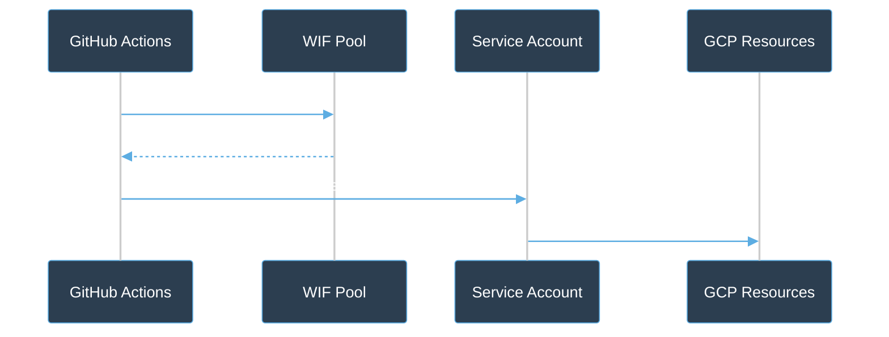

**Zero secrets en GitHub** — OIDC efímero, sin JSON keys, rotación automática


Note:
Zero secrets en GitHub. OIDC tokens efimeros en vez de JSON keys.
GitHub genera token OIDC, GCP lo valida, otorga token temporal.
No hay keys que rotar ni secrets que filtrar.

---

## 12. Escalamiento & Alta Disponibilidad

> Auto-scaling serverless con health checks multi-nivel

⬇️ _Navega hacia abajo para ver detalles_


Note:
Cloud Run escala de 1 a 10 instancias automaticamente segun la carga.
En QA: scale-to-zero (5-15 USD/mes). En prod: min=1 siempre caliente.
Cada instancia maneja 100 req concurrentes. Si se supera, Cloud Run crea otra.

----

### Cloud Run Auto-Scaling

<div style="font-size: 0.75em;">

| Config | QA | Producción |
|--------|----|----|
| **Min instancias** | 0 (scale-to-zero) | 1 (always warm) |
| **Max instancias** | 1 | 10 |
| **vCPU** | 1 | 2 |
| **Memoria** | 512 Mi | 1 Gi |
| **Concurrencia** | 80 req/container | 100 req/container |
| **Timeout** | 300s | 60s |
| **CPU Boost** | No | Si (cold starts) |
| **Costo mensual** | ~$5-15 | ~$50-100 |

</div>

Note:
QA: scale-to-zero (5-15 USD/mes). Prod: min=1 siempre caliente, max=10.
Cada instancia 2 vCPU, 1Gi, 100 req concurrentes. CPU Boost para cold starts.

----

### Cloud Run — Auto-Scaling en Acción

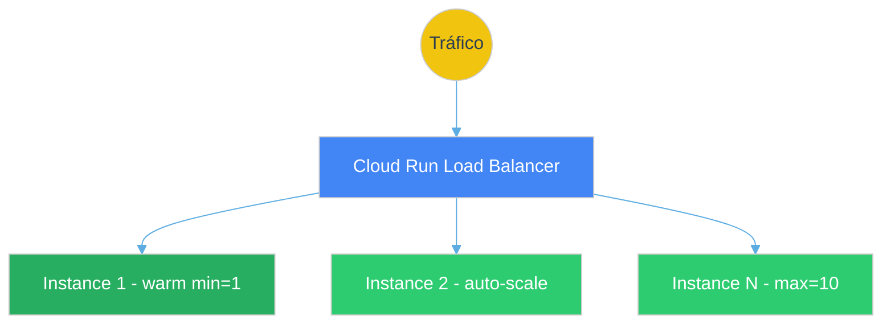

> Cada instancia maneja **100 req concurrentes** — si se supera, Cloud Run crea otra automáticamente

Note:
Cloud Run escala automaticamente de 1 a 10 instancias segun la carga.
Siempre hay al menos 1 instancia caliente en produccion.
Si una instancia llega a 100 req concurrentes, se crea otra.

----

### Health Checks Multi-Nivel

```typescript
// 3 endpoints de salud, cada uno con propósito diferente

GET /health/startup   // ¿Arrancó el contenedor?
// → Cloud Run: startup probe (35s tolerancia para cold start)
// → Responde: { status: 'ok', uptime: 12.3 }

GET /health/live      // ¿Está vivo el proceso?
// → Cloud Run: liveness probe (cada 10s)
// → Si falla 3 veces → reinicia el contenedor
// → Responde: { status: 'ok', memory: '45%', cpu: '12%' }

GET /health/ready     // ¿Puede recibir tráfico?
// → Cloud Run: readiness probe (cada 5s)
// → Verifica: DB connected, Redis connected, Config loaded
// → Si falla → deja de recibir tráfico (no mata el pod)
// → Responde: { status: 'ok', db: 'connected', redis: 'connected' }
```

> **Graceful Shutdown**: al recibir SIGTERM, deja de aceptar requests nuevos, termina los en progreso, cierra conexiones


Note:
3 endpoints: Startup (arranco?), Liveness (esta vivo?), Readiness (puede recibir trafico?).
Startup tolera 35s para cold starts. Liveness reinicia si falla 3 veces.
Graceful Shutdown termina requests en progreso antes de morir.

---

## 13. CI/CD Pipeline

> Pipeline automatizado con Nx affected, security scanning y deployment multi-país

⬇️ _Navega hacia abajo para ver detalles_


Note:
Nx affected solo ejecuta tests en lo que cambio, no en todo el monorepo.
Quality gates en paralelo (lint, test, typecheck, format, SAST).
Deploy en paralelo a todos los paises. CI tarda 3-5 minutos.

----

### Pipeline Completo

<div style="text-align: center;">
<svg width="780" height="420" viewBox="0 0 780 420" xmlns="http://www.w3.org/2000/svg">

  <!-- Stage 1: Detect -->
  <rect x="300" y="10" width="180" height="45" rx="8" fill="#3498db"/>
  <text x="390" y="30" text-anchor="middle" fill="white" font-size="11" font-weight="bold">1. Detect Changes</text>
  <text x="390" y="44" text-anchor="middle" fill="#d5e8f7" font-size="8">Nx affected (solo lo que cambió)</text>

  <line x1="390" y1="55" x2="390" y2="75" stroke="#7f8c8d" stroke-width="2" marker-end="url(#arrowG)"/>

  <!-- Stage 2: Quality Gates (parallel) -->
  <rect x="10" y="75" width="760" height="55" rx="8" fill="none" stroke="#2ecc71" stroke-width="1" stroke-dasharray="4"/>
  <text x="30" y="93" fill="#2ecc71" font-size="10" font-weight="bold">2. Quality Gates (paralelo)</text>

  <rect x="40" y="98" width="130" height="25" rx="4" fill="#27ae60"/>
  <text x="105" y="115" text-anchor="middle" fill="white" font-size="9">Lint (ESLint)</text>

  <rect x="190" y="98" width="130" height="25" rx="4" fill="#27ae60"/>
  <text x="255" y="115" text-anchor="middle" fill="white" font-size="9">Tests (Vitest)</text>

  <rect x="340" y="98" width="130" height="25" rx="4" fill="#27ae60"/>
  <text x="405" y="115" text-anchor="middle" fill="white" font-size="9">Typecheck (tsc)</text>

  <rect x="490" y="98" width="130" height="25" rx="4" fill="#27ae60"/>
  <text x="555" y="115" text-anchor="middle" fill="white" font-size="9">Format (Prettier)</text>

  <rect x="640" y="98" width="120" height="25" rx="4" fill="#27ae60"/>
  <text x="700" y="115" text-anchor="middle" fill="white" font-size="9">SAST (Semgrep)</text>

  <line x1="390" y1="130" x2="390" y2="150" stroke="#7f8c8d" stroke-width="2" marker-end="url(#arrowG)"/>

  <!-- Stage 3: Build -->
  <rect x="230" y="150" width="320" height="45" rx="8" fill="#9b59b6"/>
  <text x="390" y="170" text-anchor="middle" fill="white" font-size="11" font-weight="bold">3. Build Docker Image</text>
  <text x="390" y="184" text-anchor="middle" fill="#e8d5f5" font-size="8">Multi-stage + Push to Artifact Registry</text>

  <line x1="390" y1="195" x2="390" y2="215" stroke="#7f8c8d" stroke-width="2" marker-end="url(#arrowG)"/>

  <!-- Stage 4: Security -->
  <rect x="230" y="215" width="320" height="45" rx="8" fill="#e74c3c"/>
  <text x="390" y="235" text-anchor="middle" fill="white" font-size="11" font-weight="bold">4. Security Scan</text>
  <text x="390" y="249" text-anchor="middle" fill="#fadbd8" font-size="8">Trivy (CVE) + Supply Chain (SHA pinning)</text>

  <line x1="390" y1="260" x2="390" y2="280" stroke="#7f8c8d" stroke-width="2" marker-end="url(#arrowG)"/>

  <!-- Stage 5: Deploy -->
  <rect x="10" y="280" width="760" height="65" rx="8" fill="none" stroke="#f1c40f" stroke-width="2"/>
  <text x="30" y="298" fill="#f1c40f" font-size="10" font-weight="bold">5. Deploy Multi-País (matrix paralelo)</text>

  <rect x="100" y="308" width="180" height="30" rx="5" fill="#d35400"/>
  <text x="190" y="327" text-anchor="middle" fill="white" font-size="10">Chile (CL)</text>

  <rect x="300" y="308" width="180" height="30" rx="5" fill="#d35400"/>
  <text x="390" y="327" text-anchor="middle" fill="white" font-size="10">Peru (PE)</text>

  <rect x="500" y="308" width="180" height="30" rx="5" fill="#d35400"/>
  <text x="590" y="327" text-anchor="middle" fill="white" font-size="10">España (ES)</text>

  <line x1="390" y1="345" x2="390" y2="365" stroke="#7f8c8d" stroke-width="2" marker-end="url(#arrowG)"/>

  <!-- Stage 6: Smoke Tests -->
  <rect x="230" y="365" width="320" height="45" rx="8" fill="#1abc9c"/>
  <text x="390" y="385" text-anchor="middle" fill="white" font-size="11" font-weight="bold">6. Smoke Tests + Notification</text>
  <text x="390" y="399" text-anchor="middle" fill="#d1f2eb" font-size="8">/health, /docs, response-time SLA → Teams</text>

  <defs>
    <marker id="arrowG" markerWidth="8" markerHeight="8" refX="7" refY="3" orient="auto">
      <path d="M0,0 L0,6 L8,3 z" fill="#7f8c8d"/>
    </marker>
  </defs>
</svg>
</div>

Note:
El pipeline usa Nx affected para solo ejecutar lo que cambió. Los quality gates corren en paralelo.
Después de build y security scan, se deploya en paralelo a todos los países.
Los smoke tests verifican que el deploy fue exitoso antes de enviar notificación.

----

### Canary Deployment

```mermaid
%%{init: {'theme': 'dark', 'themeVariables': {'lineColor': '#5dade2'}}}%%
graph LR
    A1["1. v12: 100%"] --> A2["1. v13: 0%"]
    A2 --> B1["2. Smoke tests"]
    B1 --> B2["2. QA manual"]
    B2 --> C1["3. v12: 50%"]
    C1 --> C2["3. v13: 50%"]
    C2 --> D1["4. v13: 100%"]

    style A1 fill:#27ae60,color:#fff
    style A2 fill:#95a5a6,color:#fff
    style B1 fill:#3498db,color:#fff
    style B2 fill:#3498db,color:#fff
    style C1 fill:#f39c12,color:#fff
    style C2 fill:#f39c12,color:#fff
    style D1 fill:#27ae60,color:#fff
```


Note:
4 pasos: deploy con 0% trafico, validacion, split 50/50, full rollout.
La nueva revision se despliega pero no recibe trafico hasta validar.
Si falla, rollback automatico.

---

## 14. Resiliencia & Observabilidad

> Patrones enterprise para alta disponibilidad y visibilidad operacional

⬇️ _Navega hacia abajo para ver detalles_


Note:
Circuit Breaker evita cascada cuando un servicio externo cae.
Cache Stampede evita que 1000 requests golpeen la DB cuando el cache expira.
Grafana Cloud es nuestra plataforma de observabilidad - logs, metricas y traces.

----

### Patrones de Resiliencia

<div style="font-size: 0.55em;">

| Patrón | Implementación | Qué Protege |
|--------|---------------|-------------|
| **Circuit Breaker** | Cockatiel | Cascada de fallos a externos |
| **Retry + Backoff** | Exponential 5→10→20→30s | Fallos transitorios |
| **Timeout** | 60s por request (prod) | Requests colgados |
| **Bulkhead** | Concurrency limit | Aísla fallos entre módulos |
| **Cache Stampede** | Singleflight + Probabilistic | Thundering herd en cache miss |
| **Dead Letter Queue** | Pub/Sub DLQ | Mensajes fallidos no se pierden |
| **Transactional Outbox** | DB + Event atómico | Consistencia evento + persistencia |
| **Graceful Degradation** | Conditional module loading | Si DB falla, otros módulos siguen |

</div>

Note:
Cada patrón protege contra un tipo específico de fallo.
El Circuit Breaker evita que una API externa caída derribe todo el sistema.
El Cache Stampede protege contra N requests simultáneos a un mismo recurso.

----

### Circuit Breaker — Estados

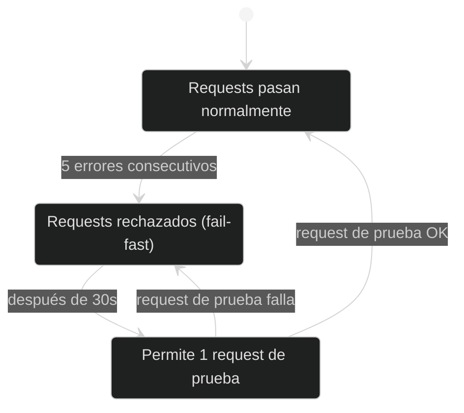

Note:
3 estados: Closed (normal), Open (fail-fast), Half-Open (probando).
5 errores consecutivos lo abren. Despues de 30s deja pasar 1 request de prueba.

----

### Circuit Breaker — Implementación

```typescript
const circuitBreaker = new CircuitBreakerPolicy({
  halfOpenAfter: 30_000,      // 30s antes de probar de nuevo
  breaker: new ConsecutiveBreaker(5),  // 5 errores → OPEN
});

// Uso: wrappea la llamada al servicio externo
const result = await circuitBreaker.execute(() =>
  this.httpService.get('https://erp.example.com/stock')
);
```

> Librería: **Cockatiel** — lightweight, TypeScript nativo

Note:
Usamos Cockatiel, libreria TypeScript nativa y lightweight.
Cada integracion externa tiene su propio circuit breaker independiente.

----

### Observabilidad: Los 3 Pilares

<div style="text-align: center;">
<svg width="750" height="220" viewBox="0 0 750 220" xmlns="http://www.w3.org/2000/svg">
  <!-- Logging -->
  <rect x="20" y="20" width="220" height="180" rx="10" fill="#1a252f" stroke="#3498db" stroke-width="2"/>
  <text x="130" y="50" text-anchor="middle" fill="#3498db" font-size="14" font-weight="bold">Logging</text>
  <text x="130" y="75" text-anchor="middle" fill="#bdc3c7" font-size="10">Pino (structured JSON)</text>
  <text x="130" y="100" text-anchor="middle" fill="#7f8c8d" font-size="9">Correlation ID por request</text>
  <text x="130" y="120" text-anchor="middle" fill="#7f8c8d" font-size="9">Data Redaction automática</text>
  <text x="130" y="140" text-anchor="middle" fill="#7f8c8d" font-size="9">Niveles: log, warn, error</text>
  <text x="130" y="165" text-anchor="middle" fill="#3498db" font-size="9">→ Cloud Logging</text>
  <text x="130" y="185" text-anchor="middle" fill="#3498db" font-size="9">→ Sentry (errors)</text>

  <!-- Metrics -->
  <rect x="265" y="20" width="220" height="180" rx="10" fill="#1a252f" stroke="#2ecc71" stroke-width="2"/>
  <text x="375" y="50" text-anchor="middle" fill="#2ecc71" font-size="14" font-weight="bold">Metrics</text>
  <text x="375" y="75" text-anchor="middle" fill="#bdc3c7" font-size="10">OpenTelemetry SDK</text>
  <text x="375" y="100" text-anchor="middle" fill="#7f8c8d" font-size="9">HTTP request duration</text>
  <text x="375" y="120" text-anchor="middle" fill="#7f8c8d" font-size="9">Error rates por módulo</text>
  <text x="375" y="140" text-anchor="middle" fill="#7f8c8d" font-size="9">Cache hit/miss ratios</text>
  <text x="375" y="165" text-anchor="middle" fill="#FF6F00" font-size="9">→ Grafana Cloud (OTLP)</text>
  <text x="375" y="185" text-anchor="middle" fill="#FF6F00" font-size="9">→ Grafana dashboards</text>

  <!-- Traces -->
  <rect x="510" y="20" width="220" height="180" rx="10" fill="#1a252f" stroke="#e67e22" stroke-width="2"/>
  <text x="620" y="50" text-anchor="middle" fill="#e67e22" font-size="14" font-weight="bold">Traces</text>
  <text x="620" y="75" text-anchor="middle" fill="#bdc3c7" font-size="10">OpenTelemetry → Grafana Tempo</text>
  <text x="620" y="100" text-anchor="middle" fill="#7f8c8d" font-size="9">Distributed tracing</text>
  <text x="620" y="120" text-anchor="middle" fill="#7f8c8d" font-size="9">Span por operación</text>
  <text x="620" y="140" text-anchor="middle" fill="#7f8c8d" font-size="9">Latency breakdown</text>
  <text x="620" y="165" text-anchor="middle" fill="#FF6F00" font-size="9">→ Grafana Cloud</text>
  <text x="620" y="185" text-anchor="middle" fill="#e67e22" font-size="9">→ Error Budget (SLOs)</text>

</svg>
</div>

**SRE Practices**: Error budgets, SLOs (99.9% uptime), alertas basadas en burn rate


Note:
Logging: Pino JSON estructurado + correlation ID. Va a Cloud Logging y Sentry.
Metricas: OpenTelemetry exporta a Grafana Cloud via OTLP.
Traces: distributed tracing en Grafana Tempo.
Nunca console.log, siempre this.logger.

---

## 15. Roadmap

> Evolución planificada de la plataforma

⬇️ _Navega hacia abajo para ver detalles_


Note:
Fases 1-3 completadas. Estamos en fase 4 (multi-pais).
La fase 6 (extraer microservicios) solo se hara si es necesario por escala.
El monolito tiene boundaries preparados para extraer cualquier modulo.

----

### Fases de Evolución

<div style="font-size: 0.65em;">

| Fase | Foco | Estado |
|------|------|--------|
| **Fase 1** — Foundation | Migración de microservicios al monolito modular, auth unificada, CI/CD | Completado |
| **Fase 2** — Enterprise Patterns | Resiliencia (circuit breaker, retry), observabilidad (OTel, Sentry), caching (Redis) | Completado |
| **Fase 3** — Marketplace | Protocolo VTEX External Seller, simulación, fulfillment | Completado |
| **Fase 4** — Multi-País | Terraform multi-proyecto, adapter layer por ERP, matrix deploy | En progreso |
| **Fase 5** — Advanced | Feature flags, chaos engineering, load shedding, CQRS optimizado | Planificado |
| **Fase 6** — Scale | Extracción selectiva a microservicios (si es necesario), multi-region | Futuro |

</div>


Note:
Fases 1-3 completadas. Fase 4 en progreso (multi-pais).
Fases 5-6 planificadas. Fase 6 solo si necesario por escala.
Boundaries preparados para extraer cualquier modulo como microservicio.

----

### Decisiones Arquitectónicas Documentadas

<div style="font-size: 0.55em;">

> 50+ ADRs y 20+ RFCs documentan cada decisión

| # | Decisión | Por qué |
|---|----------|---------|
| ADR-0001 | Flat Module Structure | Simplicidad sobre jerarquía |
| ADR-0002 | Facade Pattern | Boundaries explícitos |
| ADR-0003 | Pub/Sub over BullMQ | Zero-ops, GCP nativo |
| ADR-0007 | Fastify over Express | 2x más rápido |
| ADR-0021 | Terraform IaC | Reproducibilidad multi-país |
| RFC-0001 | Monolito Modular | Reduce complejidad operacional |
| RFC-0051 | Auth Convergence | Un solo modelo de seguridad |
| RFC-0045 | VTEX External Seller | Integración marketplace |
| RFC-0062 | Pragmatic Architecture | Complejidad proporcional |

Cada decisión tiene: contexto, opciones evaluadas, decisión, consecuencias.

</div>


Note:
50+ ADRs y 20+ RFCs. Cada decision tiene contexto, opciones, decision y consecuencias.
Destacados: Fastify 2x mas rapido que Express, Pub/Sub sobre BullMQ,
RFC-0062 arquitectura pragmatica (no sobre-ingenierar CRUD).

---

## Resumen Ejecutivo — Plataforma

<div style="font-size: 0.6em;">

| Dimensión | Implementación |
|-----------|---------------|
| **Patrón** | Monolito Modular (extractable a microservicios) |
| **Stack** | NestJS 11 + Fastify + TypeScript strict |
| **Multi-País** | Adapter Pattern + GCP aislado por país |
| **Integraciones** | VTEX Seller, Salesforce MC, Webpay, Niubiz, MercadoPago, Khipu |
| **Workers** | 5 Cloud Run: notif, retry, sync, report, pickup-reminder |
| **Seguridad** | 8 capas (TLS → Auth → RBAC → Validation → Redaction) |
| **Auth** | JWT (humanos) + API Key (M2M) |

</div>

Note:
Primera parte del resumen ejecutivo — arquitectura y negocio.
Monolito modular con boundaries estrictos. Multi-pais con adapter pattern.

----

### Resumen Ejecutivo — Infraestructura

<div style="font-size: 0.6em;">

| Dimensión | Implementación |
|-----------|---------------|
| **Deploy** | GCP Cloud Run, auto-scaling, zero-ops |
| **CI/CD** | GitHub Actions + Nx affected + matrix multi-país |
| **Resiliencia** | Circuit Breaker, Retry, Timeout, DLQ, Outbox |
| **Observabilidad** | Pino + OpenTelemetry + Grafana Cloud + Sentry |
| **IaC** | Terraform 5-phase bootstrap |
| **Containers** | Distroless, non-root, Trivy scanning |
| **Decisiones** | 50+ ADRs + 20+ RFCs documentados |

</div>

> **Filosofía**: Enterprise-grade con pragmatismo — complejidad proporcional al problema

Note:
Segunda parte — infraestructura y operaciones.
Todo GCP managed, zero-ops, Terraform IaC. 50+ ADRs documentan cada decision.
4. Todo GCP managed, zero-ops, Terraform IaC.

---

<!-- .slide: data-background="#1a1a2e" -->

# Preguntas

<br>

<div style="font-size: 0.8em; color: #7f8c8d;">

**Documentación técnica**: `docs/architecture/`

**ADRs**: `docs/architecture/adrs/`

**RFCs**: `docs/architecture/rfcs/`

</div>


Note:
Preguntas frecuentes de asesores:
- Por que no microservicios? Equipo pequeno, costo operacional, Shopify/GitHub usan monolito.
- Como escalan? Cloud Run auto-scaling, 1-10 instancias.
- Vendor lock-in? Dominio es framework-agnostic. Infra es IaC con Terraform.
- Testing? Vitest unit + Playwright e2e, 300+ tests, CI en 3-5 min.
