# Integration Platform

### Arquitectura Enterprise Multi-País

<br>

<div style="font-size: 0.6em; color: #7f8c8d;">
Implementos
</div>

Note:
Bienvenidos. Platform multi-pais, 9 secciones + resumen ejecutivo. S para speaker notes.

---

## 📋 Agenda

<div style="font-size: 0.55em;">

| # | Sección | Foco |
|---|---------|------|
| 1 | **Visión de Negocio** | Problema, solución, arquitectura MACH |
| 2 | **La Plataforma** | Aplicaciones, monorepo, vista C4 |
| 3 | **ACL & Multi-ERP** ⭐ | Adaptadores por país, migración cloud, código |
| 4 | **Infraestructura GCP** | Organización, deployment, Cloud Run, workers |
| 5 | **Patrones Técnicos** | Módulos, facades, integraciones externas |
| 6 | **Clean Architecture** | 5 capas, estructura módulos, error handling |
| 7 | **Seguridad** | Defense in Depth, auth unificada, rate limiting |
| 8 | **Developer Workflow** | Commits, branches, PRs, code review |
| 9 | **CI/CD & Validación** | Pre-commit, pipeline, canary deploy |
| 10 | **Resiliencia & Observabilidad** | Circuit breaker, Grafana, SRE practices |
| 11 | **Resumen Ejecutivo** | Vista consolidada, documentación interna |

</div>

Note:
11 secciones, ~75 min. Seccion 3 (ACL) es la clave para los asesores.

---

## 1. Visión de Negocio

> Operaciones en 3 países con sistemas distintos — necesitamos una plataforma composable, escalable y segura

⬇️ _Navega hacia abajo para ver detalles_

Note:
3 paises, sistemas distintos. Plataforma composable.

----

### El Problema

<div style="font-size: 0.7em;">

- Operamos en **3 países con aplicaciones y sistemas distintos** — necesitamos unificarlos
- Cada país tiene su propio ERP, WMS, CRM → **no podemos intercambiar componentes** de software fácilmente
- Integraciones punto a punto → **frágil, costoso, no escalable**
- No existe una arquitectura que se haga cargo de **conectar correctamente los servicios** de cada aplicación
- Necesitamos una plataforma **composable**: escalable, segura, que permita **poner y sacar piezas de software** de manera rápida y dinámica

</div>

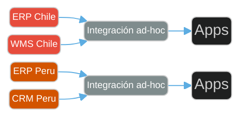
```mermaid
%%{init: {'theme': 'dark', 'themeVariables': {'lineColor': '#5dade2'}, 'flowchart': {'nodeSpacing': 8, 'rankSpacing': 25, 'useMaxWidth': true, 'padding': 3}}}%%
flowchart LR
    CL1(ERP Chile) --> INT1(Integración ad-hoc)
    CL2(WMS Chile) --> INT1
    PE1(ERP Peru) --> INT2(Integración ad-hoc)
    PE2(CRM Peru) --> INT2
    INT1 --> APP1(Apps)
    INT2 --> APP2(Apps)
    style CL1 fill:#e74c3c,color:#fff,font-size:10px
    style CL2 fill:#e74c3c,color:#fff,font-size:10px
    style PE1 fill:#d35400,color:#fff,font-size:10px
    style PE2 fill:#d35400,color:#fff,font-size:10px
    style INT1 fill:#7f8c8d,color:#fff,font-size:10px
    style INT2 fill:#7f8c8d,color:#fff,font-size:10px
```

Note:
Integraciones ad-hoc, no escalable, no intercambiable.

----

### Capacidades de Negocio

<div style="text-align: center;">
<svg width="960" height="550" viewBox="0 0 1100 630" xmlns="http://www.w3.org/2000/svg">

  <!-- ═══ ROW 1: Core Systems (headers + post-its) ═══ -->

  <!-- ERP -->
  <rect x="7" y="7" width="164" height="240" rx="7" fill="none" stroke="#5dade2" stroke-width="1"/>
  <text x="89" y="27" text-anchor="middle" fill="#5dade2" font-size="11" font-weight="bold">ERP</text>
  <text x="89" y="41" text-anchor="middle" fill="#5dade2" font-size="11">Planif. Recursos Empresariales</text>
  <rect x="14" y="49" width="71" height="30" rx="4" fill="#d6eaf8"/><text x="49" y="68" text-anchor="middle" fill="#2c3e50" font-size="11">Cobranzas</text>
  <rect x="90" y="49" width="71" height="30" rx="4" fill="#d6eaf8"/><text x="126" y="68" text-anchor="middle" fill="#2c3e50" font-size="11">Finanzas</text>
  <rect x="14" y="85" width="71" height="30" rx="4" fill="#d6eaf8"/><text x="49" y="104" text-anchor="middle" fill="#2c3e50" font-size="11">Pago proveed.</text>
  <rect x="90" y="85" width="71" height="30" rx="4" fill="#d6eaf8"/><text x="126" y="104" text-anchor="middle" fill="#2c3e50" font-size="11">Desarrollo</text>
  <rect x="14" y="121" width="71" height="30" rx="4" fill="#d6eaf8"/><text x="49" y="140" text-anchor="middle" fill="#2c3e50" font-size="11">Contabilidad</text>
  <rect x="90" y="121" width="71" height="30" rx="4" fill="#d6eaf8"/><text x="126" y="140" text-anchor="middle" fill="#2c3e50" font-size="11">Proveedores</text>
  <rect x="14" y="156" width="71" height="30" rx="4" fill="#d6eaf8"/><text x="49" y="175" text-anchor="middle" fill="#2c3e50" font-size="11">Tesorería</text>
  <rect x="90" y="156" width="71" height="30" rx="4" fill="#d6eaf8"/><text x="126" y="175" text-anchor="middle" fill="#2c3e50" font-size="11">Gst. compra</text>
  <rect x="14" y="192" width="71" height="30" rx="4" fill="#d6eaf8"/><text x="49" y="211" text-anchor="middle" fill="#2c3e50" font-size="11">Inventarios</text>

  <!-- SCM -->
  <rect x="178" y="7" width="144" height="240" rx="7" fill="none" stroke="#5dade2" stroke-width="1"/>
  <text x="249" y="27" text-anchor="middle" fill="#5dade2" font-size="11" font-weight="bold">SCM</text>
  <text x="249" y="41" text-anchor="middle" fill="#5dade2" font-size="11">Cadena Suministro</text>
  <rect x="185" y="49" width="127" height="30" rx="4" fill="#b3e6cc"/><text x="248" y="68" text-anchor="middle" fill="#2c3e50" font-size="11">Planif. demanda</text>
  <rect x="185" y="85" width="127" height="30" rx="4" fill="#b3e6cc"/><text x="248" y="104" text-anchor="middle" fill="#2c3e50" font-size="11">Planif. compras</text>
  <rect x="185" y="121" width="127" height="30" rx="4" fill="#b3e6cc"/><text x="248" y="140" text-anchor="middle" fill="#2c3e50" font-size="11">Planif. reposición</text>

  <!-- SALES -->
  <rect x="329" y="7" width="171" height="240" rx="7" fill="none" stroke="#1abc9c" stroke-width="1"/>
  <text x="414" y="27" text-anchor="middle" fill="#1abc9c" font-size="11" font-weight="bold">SALES</text>
  <text x="414" y="41" text-anchor="middle" fill="#1abc9c" font-size="11">Sistemas de Venta</text>
  <rect x="336" y="49" width="75" height="41" rx="4" fill="#a3e4d7"/><text x="373" y="68" text-anchor="middle" fill="#2c3e50" font-size="11">POS &amp;</text><text x="373" y="79" text-anchor="middle" fill="#2c3e50" font-size="11">Caja</text>
  <rect x="416" y="49" width="75" height="41" rx="4" fill="#a3e4d7"/><text x="453" y="68" text-anchor="middle" fill="#2c3e50" font-size="11">Pedidos &amp;</text><text x="453" y="79" text-anchor="middle" fill="#2c3e50" font-size="11">Devoluc.</text>
  <rect x="336" y="99" width="75" height="36" rx="4" fill="#2ecc71"/><text x="373" y="121" text-anchor="middle" fill="white" font-size="11">Gst. Venver</text>
  <rect x="416" y="99" width="75" height="36" rx="4" fill="#2ecc71"/><text x="453" y="121" text-anchor="middle" fill="white" font-size="11">Pedidos B2B</text>

  <!-- CRM -->
  <rect x="507" y="7" width="164" height="240" rx="7" fill="none" stroke="#1abc9c" stroke-width="1"/>
  <text x="589" y="27" text-anchor="middle" fill="#1abc9c" font-size="11" font-weight="bold">CRM</text>
  <text x="589" y="41" text-anchor="middle" fill="#1abc9c" font-size="11">Gestión Relación Clientes</text>
  <rect x="514" y="49" width="71" height="36" rx="4" fill="#a3e4d7"/><text x="549" y="68" text-anchor="middle" fill="#2c3e50" font-size="11">Clientes &amp;</text><text x="549" y="78" text-anchor="middle" fill="#2c3e50" font-size="6">fidelización</text>
  <rect x="590" y="49" width="71" height="36" rx="4" fill="#a3e4d7"/><text x="626" y="68" text-anchor="middle" fill="#2c3e50" font-size="11">Campañas</text><text x="626" y="78" text-anchor="middle" fill="#2c3e50" font-size="6">multicanal</text>
  <rect x="514" y="93" width="71" height="36" rx="4" fill="#2ecc71"/><text x="549" y="112" text-anchor="middle" fill="white" font-size="11">Atención</text><text x="549" y="122" text-anchor="middle" fill="white" font-size="6">cliente</text>
  <rect x="590" y="93" width="71" height="36" rx="4" fill="#a3e4d7"/><text x="626" y="112" text-anchor="middle" fill="#2c3e50" font-size="11">Televenta</text><text x="626" y="122" text-anchor="middle" fill="#2c3e50" font-size="6">call center</text>

  <!-- ECOMMERCE -->
  <rect x="678" y="7" width="151" height="240" rx="7" fill="none" stroke="#a569bd" stroke-width="1"/>
  <text x="754" y="27" text-anchor="middle" fill="#a569bd" font-size="13" font-weight="bold">ECOMMERCE</text>
  <text x="754" y="41" text-anchor="middle" fill="#a569bd" font-size="11">Comercio Electrónico</text>
  <rect x="685" y="49" width="134" height="36" rx="4" fill="#82e0aa"/><text x="752" y="71" text-anchor="middle" fill="#2c3e50" font-size="11">Gst. ecommerce B2C</text>
  <rect x="685" y="93" width="134" height="36" rx="4" fill="#82e0aa"/><text x="752" y="115" text-anchor="middle" fill="#2c3e50" font-size="11">Gst. precios y promos</text>

  <!-- MARKETPLACES -->
  <rect x="836" y="7" width="253" height="240" rx="7" fill="none" stroke="#a569bd" stroke-width="1"/>
  <text x="962" y="27" text-anchor="middle" fill="#a569bd" font-size="13" font-weight="bold">MARKETPLACES</text>
  <text x="962" y="41" text-anchor="middle" fill="#a569bd" font-size="11">Mercados en Línea</text>
  <rect x="843" y="49" width="123" height="36" rx="4" fill="#82e0aa"/><text x="904" y="71" text-anchor="middle" fill="#2c3e50" font-size="11">Gst. precios y promos</text>

  <!-- ═══ ROW 2: Operational Systems ═══ -->

  <!-- WMS -->
  <rect x="7" y="260" width="164" height="151" rx="7" fill="none" stroke="#5dade2" stroke-width="1"/>
  <text x="89" y="281" text-anchor="middle" fill="#5dade2" font-size="13" font-weight="bold">WMS</text>
  <text x="89" y="292" text-anchor="middle" fill="#5dade2" font-size="11">Gestión Almacenes</text>
  <rect x="14" y="301" width="71" height="36" rx="4" fill="#b3e6cc"/><text x="49" y="321" text-anchor="middle" fill="#2c3e50" font-size="11">Planif.</text><text x="49" y="330" text-anchor="middle" fill="#2c3e50" font-size="6">demanda</text>
  <rect x="90" y="301" width="71" height="36" rx="4" fill="#b3e6cc"/><text x="126" y="321" text-anchor="middle" fill="#2c3e50" font-size="11">Recepción</text><text x="126" y="330" text-anchor="middle" fill="#2c3e50" font-size="6">almac.</text>
  <rect x="14" y="342" width="71" height="36" rx="4" fill="#b3e6cc"/><text x="49" y="364" text-anchor="middle" fill="#2c3e50" font-size="11">Devoluciones</text>
  <rect x="90" y="342" width="71" height="36" rx="4" fill="#b3e6cc"/><text x="126" y="364" text-anchor="middle" fill="#2c3e50" font-size="11">Picking</text><text x="126" y="374" text-anchor="middle" fill="#2c3e50" font-size="6">packing</text>

  <!-- OMS -->
  <rect x="178" y="260" width="171" height="151" rx="7" fill="none" stroke="#2ecc71" stroke-width="1"/>
  <text x="263" y="281" text-anchor="middle" fill="#2ecc71" font-size="13" font-weight="bold">OMS</text>
  <text x="263" y="292" text-anchor="middle" fill="#2ecc71" font-size="11">Órdenes Omnicanal</text>
  <rect x="185" y="301" width="75" height="36" rx="4" fill="#2ecc71"/><text x="222" y="321" text-anchor="middle" fill="white" font-size="11">Promesa</text><text x="222" y="330" text-anchor="middle" fill="white" font-size="6">al cliente</text>
  <rect x="266" y="301" width="75" height="36" rx="4" fill="#a3e4d7"/><text x="303" y="321" text-anchor="middle" fill="#2c3e50" font-size="11">Track &amp;</text><text x="303" y="330" text-anchor="middle" fill="#2c3e50" font-size="6">trace</text>
  <rect x="185" y="342" width="75" height="36" rx="4" fill="#2ecc71"/><text x="222" y="364" text-anchor="middle" fill="white" font-size="11">Gst. omni-</text><text x="222" y="374" text-anchor="middle" fill="white" font-size="6">canalidad</text>

  <!-- PIM -->
  <rect x="356" y="260" width="171" height="151" rx="7" fill="none" stroke="#2ecc71" stroke-width="1"/>
  <text x="441" y="281" text-anchor="middle" fill="#2ecc71" font-size="13" font-weight="bold">PIM</text>
  <text x="441" y="292" text-anchor="middle" fill="#2ecc71" font-size="11">Información Productos</text>
  <rect x="363" y="301" width="75" height="36" rx="4" fill="#2ecc71"/><text x="400" y="321" text-anchor="middle" fill="white" font-size="11">Catálogo</text><text x="400" y="330" text-anchor="middle" fill="white" font-size="6">productos</text>
  <rect x="444" y="301" width="75" height="36" rx="4" fill="#82e0aa"/><text x="481" y="323" text-anchor="middle" fill="#2c3e50" font-size="11">Golden Gate</text>
  <rect x="363" y="342" width="75" height="36" rx="4" fill="#2ecc71"/><text x="400" y="362" text-anchor="middle" fill="white" font-size="11">Planif.</text><text x="400" y="371" text-anchor="middle" fill="white" font-size="6">surtido</text>

  <!-- PRECIOS/PROMOS -->
  <rect x="534" y="260" width="130" height="96" rx="7" fill="none" stroke="#a569bd" stroke-width="1"/>
  <text x="599" y="281" text-anchor="middle" fill="#a569bd" font-size="13" font-weight="bold">PRECIOS</text>
  <rect x="541" y="295" width="116" height="36" rx="4" fill="#82e0aa"/><text x="599" y="316" text-anchor="middle" fill="#2c3e50" font-size="11">Gst. precios y promos</text>

  <!-- COBRANZAS -->
  <rect x="671" y="260" width="130" height="96" rx="7" fill="none" stroke="#5dade2" stroke-width="1"/>
  <text x="736" y="281" text-anchor="middle" fill="#5dade2" font-size="13" font-weight="bold">COBRANZAS</text>
  <rect x="678" y="295" width="116" height="36" rx="4" fill="#82e0aa"/><text x="736" y="316" text-anchor="middle" fill="#2c3e50" font-size="11">Portal cobranzas</text>

  <!-- INCENTIVOS -->
  <rect x="808" y="260" width="130" height="96" rx="7" fill="none" stroke="#a569bd" stroke-width="1"/>
  <text x="873" y="281" text-anchor="middle" fill="#a569bd" font-size="13" font-weight="bold">INCENTIVOS</text>
  <rect x="815" y="295" width="116" height="36" rx="4" fill="#82e0aa"/><text x="873" y="316" text-anchor="middle" fill="#2c3e50" font-size="11">Incentivos &amp; comis.</text>

  <!-- ═══ ROW 3: Logistics & Support ═══ -->

  <!-- Apoyo Tienda -->
  <rect x="7" y="425" width="164" height="82" rx="7" fill="none" stroke="#5dade2" stroke-width="1"/>
  <text x="89" y="445" text-anchor="middle" fill="#5dade2" font-size="13" font-weight="bold">APOYO TIENDA</text>
  <rect x="14" y="455" width="71" height="33" rx="4" fill="#a3e4d7"/><text x="49" y="475" text-anchor="middle" fill="#2c3e50" font-size="11">Gst. tienda</text>
  <rect x="90" y="455" width="71" height="33" rx="4" fill="#a3e4d7"/><text x="126" y="475" text-anchor="middle" fill="#2c3e50" font-size="11">Layout flejes</text>

  <!-- TMS / LMD -->
  <rect x="178" y="425" width="267" height="82" rx="7" fill="none" stroke="#2ecc71" stroke-width="1"/>
  <text x="311" y="445" text-anchor="middle" fill="#2ecc71" font-size="13" font-weight="bold">TMS / ÚLTIMA MILLA</text>
  <rect x="185" y="455" width="79" height="33" rx="4" fill="#a3e4d7"/><text x="225" y="471" text-anchor="middle" fill="#2c3e50" font-size="6">Planif. rutas</text><text x="225" y="482" text-anchor="middle" fill="#2c3e50" font-size="6">y horarios</text>
  <rect x="270" y="455" width="79" height="33" rx="4" fill="#a3e4d7"/><text x="310" y="471" text-anchor="middle" fill="#2c3e50" font-size="6">Consolidac.</text><text x="310" y="482" text-anchor="middle" fill="#2c3e50" font-size="6">envíos</text>
  <rect x="355" y="455" width="79" height="33" rx="4" fill="#a3e4d7"/><text x="395" y="471" text-anchor="middle" fill="#2c3e50" font-size="6">Control</text><text x="395" y="482" text-anchor="middle" fill="#2c3e50" font-size="6">proveedores</text>

  <!-- ═══ BARS ═══ -->

  <!-- IA/RPA -->
  <rect x="7" y="527" width="1082" height="34" rx="7" fill="#1a252f" stroke="#f1c40f" stroke-width="3"/>
  <text x="548" y="551" text-anchor="middle" fill="#f1c40f" font-size="12" font-weight="bold">IA ARTIFICIAL / RPA (Robotic Process Automation)</text>

  <!-- Integration Platform -->
  <rect x="7" y="575" width="1082" height="41" rx="7" fill="#1a252f" stroke="#e74c3c" stroke-width="3"/>
  <text x="548" y="603" text-anchor="middle" fill="#e74c3c" font-size="13" font-weight="bold">INTEGRATION PLATFORM — Conecta todos estos componentes</text>

</svg>
</div>

Note:
40+ subsistemas. La barra roja los conecta.

----

### La Solución: Plataforma Composable y Modular

<div style="text-align: center;">
<svg width="750" height="300" viewBox="0 0 750 300" xmlns="http://www.w3.org/2000/svg">

  <!-- ERP (left, source of data) -->
  <rect x="10" y="30" width="150" height="120" rx="8" fill="#1a5276"/>
  <text x="85" y="60" text-anchor="middle" fill="white" font-size="13" font-weight="bold">ERP</text>
  <text x="85" y="82" text-anchor="middle" fill="#bdc3c7" font-size="8">Back office</text>
  <text x="85" y="96" text-anchor="middle" fill="#bdc3c7" font-size="8">transaccional</text>
  <text x="85" y="130" text-anchor="middle" fill="#7f8c8d" font-size="7">Dynamics AX / Custom / Gira</text>

  <!-- ACL arrow ERP → Platform (API real-time) -->
  <line x1="160" y1="65" x2="225" y2="65" stroke="#2ecc71" stroke-width="2" marker-end="url(#arrowSol)"/>
  <text x="193" y="57" text-anchor="middle" fill="#2ecc71" font-size="7" font-weight="bold">ACL (API)</text>
  <text x="193" y="78" text-anchor="middle" fill="#2ecc71" font-size="6">real-time</text>
  <!-- Sync Worker arrow ERP → Platform (SQL batch) -->
  <line x1="160" y1="115" x2="225" y2="115" stroke="#e67e22" stroke-width="2" stroke-dasharray="4" marker-end="url(#arrowSol3)"/>
  <text x="193" y="107" text-anchor="middle" fill="#e67e22" font-size="7" font-weight="bold">Sync Worker</text>
  <text x="193" y="130" text-anchor="middle" fill="#e67e22" font-size="6">SQL batch</text>

  <!-- Integration Platform (center) -->
  <rect x="225" y="15" width="280" height="150" rx="10" fill="#1a252f" stroke="#f1c40f" stroke-width="3"/>
  <text x="365" y="45" text-anchor="middle" fill="#f1c40f" font-size="14" font-weight="bold">Integration Platform</text>
  <text x="365" y="68" text-anchor="middle" fill="#bdc3c7" font-size="9">Conectividad · Escalabilidad</text>
  <text x="365" y="83" text-anchor="middle" fill="#bdc3c7" font-size="9">Diferenciación</text>
  <text x="365" y="110" text-anchor="middle" fill="#7f8c8d" font-size="8">Composable: poner y sacar</text>
  <text x="365" y="124" text-anchor="middle" fill="#7f8c8d" font-size="8">piezas de software dinámicamente</text>
  <text x="365" y="150" text-anchor="middle" fill="#2ecc71" font-size="8" font-weight="bold">= Desarrollo Propio</text>

  <!-- Soluciones de Mercado (right) -->
  <rect x="555" y="15" width="180" height="150" rx="8" fill="#1a5276"/>
  <text x="645" y="42" text-anchor="middle" fill="white" font-size="12" font-weight="bold">Soluciones de</text>
  <text x="645" y="58" text-anchor="middle" fill="white" font-size="12" font-weight="bold">Mercado</text>
  <text x="645" y="82" text-anchor="middle" fill="#bdc3c7" font-size="8">VTEX · Salesforce MC</text>
  <text x="645" y="96" text-anchor="middle" fill="#bdc3c7" font-size="8">Webpay · Niubiz</text>
  <text x="645" y="110" text-anchor="middle" fill="#bdc3c7" font-size="8">MercadoPago · Khipu</text>
  <text x="645" y="130" text-anchor="middle" fill="#bdc3c7" font-size="8">Algolia · WMS · CRM</text>
  <text x="645" y="150" text-anchor="middle" fill="#7f8c8d" font-size="7">Herramientas de nicho</text>

  <!-- Bidirectional arrows Platform ↔ Market -->
  <line x1="505" y1="70" x2="555" y2="70" stroke="#5dade2" stroke-width="2" marker-end="url(#arrowSol2)"/>
  <line x1="555" y1="110" x2="505" y2="110" stroke="#5dade2" stroke-width="2" marker-end="url(#arrowSol2)"/>
  <text x="530" y="95" text-anchor="middle" fill="#5dade2" font-size="7">REST/</text>
  <text x="530" y="104" text-anchor="middle" fill="#5dade2" font-size="7">Webhooks</text>

  <!-- Bottom: countries -->
  <rect x="230" y="190" width="80" height="30" rx="5" fill="#c0392b"/>
  <text x="270" y="210" text-anchor="middle" fill="white" font-size="10">Chile</text>
  <rect x="325" y="190" width="80" height="30" rx="5" fill="#d35400"/>
  <text x="365" y="210" text-anchor="middle" fill="white" font-size="10">Peru</text>
  <rect x="420" y="190" width="80" height="30" rx="5" fill="#2980b9"/>
  <text x="460" y="210" text-anchor="middle" fill="white" font-size="10">España</text>

  <line x1="365" y1="165" x2="270" y2="190" stroke="#f1c40f" stroke-width="1" marker-end="url(#arrowSol)"/>
  <line x1="365" y1="165" x2="365" y2="190" stroke="#f1c40f" stroke-width="1" marker-end="url(#arrowSol)"/>
  <line x1="365" y1="165" x2="460" y2="190" stroke="#f1c40f" stroke-width="1" marker-end="url(#arrowSol)"/>

  <!-- Label -->
  <text x="365" y="245" text-anchor="middle" fill="#7f8c8d" font-size="9">El ERP alimenta la plataforma vía ACL — la plataforma no depende del ERP</text>

  <defs>
    <marker id="arrowSol" markerWidth="8" markerHeight="8" refX="7" refY="3" orient="auto">
      <path d="M0,0 L0,6 L8,3 z" fill="#f1c40f"/>
    </marker>
    <marker id="arrowSol2" markerWidth="8" markerHeight="8" refX="7" refY="3" orient="auto">
      <path d="M0,0 L0,6 L8,3 z" fill="#5dade2"/>
    </marker>
    <marker id="arrowSol3" markerWidth="8" markerHeight="8" refX="7" refY="3" orient="auto">
      <path d="M0,0 L0,6 L8,3 z" fill="#e67e22"/>
    </marker>
  </defs>
</svg>
</div>

Note:
Dos canales independientes: ACL (API real-time, on-premise) y Sync Worker (SQL batch, Cloud Run Job).
ACL expone API REST del ERP. Sync Worker conecta directo al SQL para sincronizacion batch.
Soluciones de mercado se integran bidireccionalmente via REST/Webhooks.

----

### Pilares Estratégicos

<div style="font-size: 0.75em;">

| Pilar | Objetivo |
|-------|----------|
| **Modularidad & Integración** | Sistemas modulares comunes para una propuesta de valor coherente (ERP, WMS, CRM) |
| **Nube & Resiliencia** | Disponibilidad y escalabilidad para asegurar estabilidad y crecimiento |
| **Datos & Decisión** | Información única para decisiones ágiles. Integridad de clientes, operaciones, inventario |
| **Seguridad Integral** | Protección proactiva y monitoreo continuo |

</div>

> **Infraestructura de integración resiliente y estandarizada, basada en nube híbrida**

Note:
Modularidad, nube, datos, seguridad.

----

### Lineamientos

<div style="font-size: 0.75em;">

- Profundizar el trabajo de **arquitectura que permita escalar y replicar** soluciones entre países
- Avanzar hacia mayor **estandarización, trazabilidad y gobernanza** tecnológica
- Solucionar problemáticas de Peru y España que hoy **limitan el crecimiento** y control del negocio

</div>

Note:
Escalar entre paises, estandarizar, resolver Peru/Espana.

----

### Arquitectura MACH

<div style="font-size: 0.8em; line-height: 1.8; margin-top: 10px;">

**M** — Microservices (Monolito Modular, boundaries extractables)

**A** — API-first (REST, OpenAPI, Swagger)

**C** — Cloud-native (GCP Cloud Run, serverless, auto-scaling)

**H** — Headless (API como producto, frontends desacoplados: VTEX IO + Dashboard Angular)

</div>

> Adoptado por VTEX, Commercetools, Contentful — estándar enterprise e-commerce

Note:
MACH: Microservices, API-first, Cloud-native, Headless.

---

## 2. La Plataforma

> 4 capas horizontales: Consumidores, Plataforma, Mensajería, Backends

⬇️ _Navega hacia abajo para ver detalles_

Note:
Vista de pajaro. Consumidores arriba, infra abajo.

----

### Aplicaciones que Consumen la Plataforma

<div style="text-align: center;">
<svg width="800" height="380" viewBox="0 0 800 380" xmlns="http://www.w3.org/2000/svg">
  <!-- Apps row -->
  <rect x="30" y="20" width="100" height="55" rx="8" fill="#3498db"/>
  <text x="80" y="42" text-anchor="middle" fill="white" font-size="11" font-weight="bold">Caja POS</text>
  <text x="80" y="58" text-anchor="middle" fill="#d5e8f7" font-size="9">Punto de Venta</text>

  <rect x="155" y="20" width="100" height="55" rx="8" fill="#9b59b6"/>
  <text x="205" y="42" text-anchor="middle" fill="white" font-size="11" font-weight="bold">Omnichannel</text>
  <text x="205" y="58" text-anchor="middle" fill="#e8d5f5" font-size="9">OMS Unificado</text>

  <rect x="280" y="20" width="100" height="55" rx="8" fill="#2ecc71"/>
  <text x="330" y="42" text-anchor="middle" fill="white" font-size="11" font-weight="bold">VTEX IO</text>
  <text x="330" y="58" text-anchor="middle" fill="#d5f5e3" font-size="9">E-Commerce</text>

  <rect x="405" y="20" width="100" height="55" rx="8" fill="#e67e22"/>
  <text x="455" y="42" text-anchor="middle" fill="white" font-size="11" font-weight="bold">PIM</text>
  <text x="455" y="58" text-anchor="middle" fill="#fdebd0" font-size="9">Product Info</text>

  <rect x="530" y="20" width="110" height="55" rx="8" fill="#00a1e0"/>
  <text x="585" y="42" text-anchor="middle" fill="white" font-size="11" font-weight="bold">Salesforce</text>
  <text x="585" y="58" text-anchor="middle" fill="#cceeff" font-size="9">Marketing Cloud</text>

  <!-- Arrows down -->
  <line x1="80" y1="75" x2="80" y2="120" stroke="#3498db" stroke-width="2" marker-end="url(#arrowBlue)"/>
  <line x1="205" y1="75" x2="205" y2="120" stroke="#9b59b6" stroke-width="2" marker-end="url(#arrowBlue)"/>
  <line x1="330" y1="75" x2="330" y2="120" stroke="#2ecc71" stroke-width="2" marker-end="url(#arrowBlue)"/>
  <line x1="455" y1="75" x2="455" y2="120" stroke="#e67e22" stroke-width="2" marker-end="url(#arrowBlue)"/>
  <line x1="585" y1="75" x2="585" y2="120" stroke="#00a1e0" stroke-width="2" marker-end="url(#arrowBlue)"/>

  <!-- Integration Platform box -->
  <rect x="20" y="120" width="760" height="130" rx="10" fill="#1a252f" stroke="#f1c40f" stroke-width="3"/>
  <text x="400" y="148" text-anchor="middle" fill="#f1c40f" font-size="16" font-weight="bold">Integration Platform (Integration API)</text>

  <!-- Internal modules -->
  <rect x="40" y="160" width="80" height="35" rx="5" fill="#2c3e50" stroke="#3498db" stroke-width="1"/>
  <text x="80" y="182" text-anchor="middle" fill="#3498db" font-size="9">Catalog</text>

  <rect x="130" y="160" width="80" height="35" rx="5" fill="#2c3e50" stroke="#2ecc71" stroke-width="1"/>
  <text x="170" y="182" text-anchor="middle" fill="#2ecc71" font-size="9">Inventory</text>

  <rect x="220" y="160" width="80" height="35" rx="5" fill="#2c3e50" stroke="#e67e22" stroke-width="1"/>
  <text x="260" y="182" text-anchor="middle" fill="#e67e22" font-size="9">Orders</text>

  <rect x="310" y="160" width="80" height="35" rx="5" fill="#2c3e50" stroke="#e74c3c" stroke-width="1"/>
  <text x="350" y="182" text-anchor="middle" fill="#e74c3c" font-size="9">Payment</text>

  <rect x="400" y="160" width="80" height="35" rx="5" fill="#2c3e50" stroke="#9b59b6" stroke-width="1"/>
  <text x="440" y="182" text-anchor="middle" fill="#9b59b6" font-size="9">Customer</text>

  <rect x="490" y="160" width="80" height="35" rx="5" fill="#2c3e50" stroke="#1abc9c" stroke-width="1"/>
  <text x="530" y="182" text-anchor="middle" fill="#1abc9c" font-size="9">Logistics</text>

  <rect x="580" y="160" width="80" height="35" rx="5" fill="#2c3e50" stroke="#f39c12" stroke-width="1"/>
  <text x="620" y="182" text-anchor="middle" fill="#f39c12" font-size="9">Notification</text>

  <rect x="670" y="160" width="90" height="35" rx="5" fill="#2c3e50" stroke="#ecf0f1" stroke-width="1"/>
  <text x="715" y="182" text-anchor="middle" fill="#ecf0f1" font-size="9">Shopping Cart</text>

  <!-- Adapter layer -->
  <rect x="40" y="205" width="720" height="30" rx="4" fill="#2c3e50" stroke="#f1c40f" stroke-width="1" stroke-dasharray="4"/>
  <text x="400" y="225" text-anchor="middle" fill="#f1c40f" font-size="10">Adapter Layer — Conectores específicos por país y ERP</text>

  <!-- Country arrows -->
  <line x1="150" y1="250" x2="150" y2="290" stroke="#e74c3c" stroke-width="2" marker-end="url(#arrowBlue)"/>
  <line x1="400" y1="250" x2="400" y2="290" stroke="#f39c12" stroke-width="2" marker-end="url(#arrowBlue)"/>
  <line x1="650" y1="250" x2="650" y2="290" stroke="#3498db" stroke-width="2" marker-end="url(#arrowBlue)"/>

  <!-- ERPs -->
  <rect x="80" y="290" width="140" height="50" rx="8" fill="#c0392b"/>
  <text x="150" y="312" text-anchor="middle" fill="white" font-size="11" font-weight="bold">Dynamics AX</text>
  <text x="150" y="328" text-anchor="middle" fill="#fadbd8" font-size="9">Chile</text>

  <rect x="330" y="290" width="140" height="50" rx="8" fill="#d35400"/>
  <text x="400" y="312" text-anchor="middle" fill="white" font-size="11" font-weight="bold">Custom ERP</text>
  <text x="400" y="328" text-anchor="middle" fill="#fdebd0" font-size="9">Peru</text>

  <rect x="580" y="290" width="140" height="50" rx="8" fill="#2980b9"/>
  <text x="650" y="312" text-anchor="middle" fill="white" font-size="11" font-weight="bold">Gira</text>
  <text x="650" y="328" text-anchor="middle" fill="#d6eaf8" font-size="9">España</text>

  <defs>
    <marker id="arrowBlue" markerWidth="8" markerHeight="8" refX="7" refY="3" orient="auto">
      <path d="M0,0 L0,6 L8,3 z" fill="#888"/>
    </marker>
  </defs>
</svg>
</div>

Note:
Caja, Omnichannel, VTEX IO, PIM, Salesforce consumen la API.

----

### Estructura del Monorepo

``` [2-9|10-15|16-29|31|32]
core/
├── apps/
│   ├── admin/             # Panel administrativo
│   ├── admin-e2e/           # Tests E2E con Playwright
│   ├── integration-api/     # API principal
│   ├── notification-worker/ # Procesador async
│   ├── report-worker/       # Generador de reportes
│   └── sync-worker/         # Sincronización con ERP
│
├── libs/
│   ├── inventory/         # Bounded Context: Stock
│   ├── pricing/           # Bounded Context: Precios
│   ├── catalogue/         # Bounded Context: Productos
│   ├── notifications/     # Bounded Context: Alertas
│   └── shared/            # Infraestructura compartida
│       ├── backend/
│       │   ├── alerting/      # Teams Adaptive Cards
│       │   ├── api-dtos/      # Shared API DTOs
│       │   ├── authorization/ # JWT + Passport
│       │   ├── cache/         # Redis + In-Memory + StampedeGuard
│       │   ├── config/        # Environment config + validation
│       │   ├── database/      # MongoDB + Mongoose + Migrations
│       │   ├── kill-switch/   # Feature flags
│       │   ├── observability/ # Logging, Tracing, Metrics
│       │   ├── pubsub/        # Google Cloud Pub/Sub
│       │   ├── resilience/    # Circuit Breaker, Retry, Bulkhead
│       │   ├── security/      # Encryption, Data Redaction
│       │   └── sre/           # Error Budget, SLOs
│       └── testing/           # TestModuleBuilder, Mocks, Factories
│
├── infra/        # Terraform (GCP) - 4 fases
└── docs/         # 31+ documentos (RFCs, ADRs, Guides)
```

Note:
Estructura real del proyecto. apps/ son los deployables, libs/ los bounded contexts.
shared/ tiene toda la infraestructura reutilizable: cache, database, observability, security.

----

<!-- .slide: data-background="#0d1117" -->

### Vista C4 — Contexto del Sistema

<div style="text-align: center;">
<svg width="820" height="500" viewBox="0 0 820 500" xmlns="http://www.w3.org/2000/svg" style="max-height: 550px;">

  <!-- Layer 1: Consumers -->
  <rect x="10" y="10" width="800" height="85" rx="8" fill="none" stroke="#3498db" stroke-width="1" stroke-dasharray="6"/>
  <text x="20" y="30" fill="#3498db" font-size="11" font-weight="bold">CONSUMIDORES</text>

  <rect x="20" y="38" width="85" height="45" rx="5" fill="#3498db"/>
  <text x="62" y="58" text-anchor="middle" fill="white" font-size="9" font-weight="bold">Caja POS</text>
  <text x="62" y="72" text-anchor="middle" fill="#d5e8f7" font-size="8">App Móvil</text>

  <rect x="115" y="38" width="85" height="45" rx="5" fill="#3498db"/>
  <text x="157" y="58" text-anchor="middle" fill="white" font-size="9" font-weight="bold">VTEX IO</text>
  <text x="157" y="72" text-anchor="middle" fill="#d5e8f7" font-size="8">E-Commerce</text>

  <rect x="210" y="38" width="85" height="45" rx="5" fill="#3498db"/>
  <text x="252" y="58" text-anchor="middle" fill="white" font-size="9" font-weight="bold">Omnichannel</text>
  <text x="252" y="72" text-anchor="middle" fill="#d5e8f7" font-size="8">OMS Interno</text>

  <rect x="305" y="38" width="85" height="45" rx="5" fill="#3498db"/>
  <text x="347" y="58" text-anchor="middle" fill="white" font-size="9" font-weight="bold">PIM</text>
  <text x="347" y="72" text-anchor="middle" fill="#d5e8f7" font-size="8">Producto</text>

  <rect x="400" y="38" width="85" height="45" rx="5" fill="#9b59b6"/>
  <text x="442" y="58" text-anchor="middle" fill="white" font-size="9" font-weight="bold">Webhooks</text>
  <text x="442" y="72" text-anchor="middle" fill="#e8d5f5" font-size="8">Inbound</text>

  <rect x="495" y="38" width="110" height="45" rx="5" fill="#9b59b6"/>
  <text x="550" y="58" text-anchor="middle" fill="white" font-size="9" font-weight="bold">Partners 3rd</text>
  <text x="550" y="72" text-anchor="middle" fill="#e8d5f5" font-size="8">M2M Scoped</text>

  <!-- Arrow zone -->
  <line x1="410" y1="83" x2="410" y2="115" stroke="#7f8c8d" stroke-width="1"/>
  <text x="420" y="105" fill="#7f8c8d" font-size="8">REST / HTTPS</text>

  <!-- Layer 2: Security + LB -->
  <rect x="10" y="115" width="800" height="55" rx="8" fill="none" stroke="#e74c3c" stroke-width="1" stroke-dasharray="6"/>
  <text x="20" y="133" fill="#e74c3c" font-size="11" font-weight="bold">SEGURIDAD & NETWORKING</text>

  <rect x="20" y="140" width="130" height="24" rx="4" fill="#c0392b"/>
  <text x="85" y="156" text-anchor="middle" fill="white" font-size="9">Cloud Run TLS + DDoS</text>

  <rect x="160" y="140" width="120" height="24" rx="4" fill="#e74c3c"/>
  <text x="220" y="156" text-anchor="middle" fill="white" font-size="9">Rate Limiting (Redis)</text>

  <rect x="290" y="140" width="120" height="24" rx="4" fill="#e74c3c"/>
  <text x="350" y="156" text-anchor="middle" fill="white" font-size="9">JWT + API Key Auth</text>

  <rect x="420" y="140" width="120" height="24" rx="4" fill="#e74c3c"/>
  <text x="480" y="156" text-anchor="middle" fill="white" font-size="9">RBAC + Scopes</text>

  <rect x="550" y="140" width="120" height="24" rx="4" fill="#c0392b"/>
  <text x="610" y="156" text-anchor="middle" fill="white" font-size="9">Input Validation</text>

  <rect x="680" y="140" width="120" height="24" rx="4" fill="#c0392b"/>
  <text x="740" y="156" text-anchor="middle" fill="white" font-size="9">VPC + Private Egress</text>

  <!-- Arrow zone -->
  <line x1="410" y1="170" x2="410" y2="195" stroke="#7f8c8d" stroke-width="1"/>

  <!-- Layer 3: Integration API -->
  <rect x="10" y="195" width="800" height="130" rx="8" fill="#1a252f" stroke="#f1c40f" stroke-width="2"/>
  <text x="20" y="215" fill="#f1c40f" font-size="12" font-weight="bold">INTEGRATION PLATFORM — INTEGRATION API (NestJS + Fastify)</text>

  <!-- Modules row 1 -->
  <rect x="25" y="225" width="90" height="30" rx="4" fill="#2c3e50" stroke="#3498db" stroke-width="1"/>
  <text x="70" y="244" text-anchor="middle" fill="#3498db" font-size="9">Catalog</text>

  <rect x="125" y="225" width="90" height="30" rx="4" fill="#2c3e50" stroke="#2ecc71" stroke-width="1"/>
  <text x="170" y="244" text-anchor="middle" fill="#2ecc71" font-size="9">Inventory</text>

  <rect x="225" y="225" width="90" height="30" rx="4" fill="#2c3e50" stroke="#e67e22" stroke-width="1"/>
  <text x="270" y="244" text-anchor="middle" fill="#e67e22" font-size="9">OMS</text>

  <rect x="325" y="225" width="90" height="30" rx="4" fill="#2c3e50" stroke="#e74c3c" stroke-width="1"/>
  <text x="370" y="244" text-anchor="middle" fill="#e74c3c" font-size="9">Payment</text>

  <rect x="425" y="225" width="90" height="30" rx="4" fill="#2c3e50" stroke="#9b59b6" stroke-width="1"/>
  <text x="470" y="244" text-anchor="middle" fill="#9b59b6" font-size="9">Customer</text>

  <rect x="525" y="225" width="90" height="30" rx="4" fill="#2c3e50" stroke="#1abc9c" stroke-width="1"/>
  <text x="570" y="244" text-anchor="middle" fill="#1abc9c" font-size="9">Logistics</text>

  <rect x="625" y="225" width="90" height="30" rx="4" fill="#2c3e50" stroke="#f39c12" stroke-width="1"/>
  <text x="670" y="244" text-anchor="middle" fill="#f39c12" font-size="9">Shopping Cart</text>

  <!-- Modules row 2 -->
  <rect x="25" y="265" width="90" height="30" rx="4" fill="#2c3e50" stroke="#ecf0f1" stroke-width="1"/>
  <text x="70" y="284" text-anchor="middle" fill="#ecf0f1" font-size="9">Notification</text>

  <rect x="125" y="265" width="90" height="30" rx="4" fill="#2c3e50" stroke="#ecf0f1" stroke-width="1"/>
  <text x="170" y="284" text-anchor="middle" fill="#ecf0f1" font-size="9">CMS</text>

  <rect x="225" y="265" width="90" height="30" rx="4" fill="#2c3e50" stroke="#ecf0f1" stroke-width="1"/>
  <text x="270" y="284" text-anchor="middle" fill="#ecf0f1" font-size="9">Documents</text>

  <rect x="325" y="265" width="90" height="30" rx="4" fill="#2c3e50" stroke="#ecf0f1" stroke-width="1"/>
  <text x="370" y="284" text-anchor="middle" fill="#ecf0f1" font-size="9">Storage</text>

  <rect x="425" y="265" width="90" height="30" rx="4" fill="#2c3e50" stroke="#ecf0f1" stroke-width="1"/>
  <text x="470" y="284" text-anchor="middle" fill="#ecf0f1" font-size="9">Articles</text>

  <rect x="525" y="265" width="90" height="30" rx="4" fill="#2c3e50" stroke="#ecf0f1" stroke-width="1"/>
  <text x="570" y="284" text-anchor="middle" fill="#ecf0f1" font-size="9">VTEX Seller</text>

  <!-- Shared layer -->
  <rect x="625" y="265" width="170" height="30" rx="4" fill="#2c3e50" stroke="#f1c40f" stroke-width="1"/>
  <text x="710" y="284" text-anchor="middle" fill="#f1c40f" font-size="9">Shared (Auth, Cache, Logger)</text>

  <!-- Arrow zone -->
  <line x1="200" y1="325" x2="200" y2="355" stroke="#7f8c8d" stroke-width="1"/>
  <line x1="410" y1="325" x2="410" y2="355" stroke="#7f8c8d" stroke-width="1"/>
  <line x1="620" y1="325" x2="620" y2="355" stroke="#7f8c8d" stroke-width="1"/>

  <!-- Layer 4: Messaging + Workers -->
  <rect x="10" y="355" width="395" height="75" rx="8" fill="none" stroke="#2ecc71" stroke-width="1" stroke-dasharray="6"/>
  <text x="20" y="373" fill="#2ecc71" font-size="10" font-weight="bold">WORKERS (Cloud Run Jobs & Services)</text>

  <rect x="20" y="380" width="90" height="24" rx="4" fill="#27ae60"/>
  <text x="65" y="396" text-anchor="middle" fill="white" font-size="8">Pub/Sub</text>

  <rect x="115" y="380" width="85" height="24" rx="4" fill="#27ae60"/>
  <text x="157" y="396" text-anchor="middle" fill="white" font-size="7">Sync Worker</text>

  <rect x="205" y="380" width="85" height="24" rx="4" fill="#27ae60"/>
  <text x="247" y="396" text-anchor="middle" fill="white" font-size="7">Notif Worker</text>

  <rect x="295" y="380" width="105" height="24" rx="4" fill="#27ae60"/>
  <text x="347" y="396" text-anchor="middle" fill="white" font-size="7">Notif Retry Worker</text>

  <rect x="20" y="407" width="95" height="20" rx="4" fill="#1e8449"/>
  <text x="67" y="420" text-anchor="middle" fill="white" font-size="7">Report Worker</text>

  <rect x="120" y="407" width="115" height="20" rx="4" fill="#1e8449"/>
  <text x="177" y="420" text-anchor="middle" fill="white" font-size="7">Pickup Reminder Worker</text>

  <rect x="240" y="407" width="100" height="20" rx="4" fill="#1e8449"/>
  <text x="290" y="420" text-anchor="middle" fill="white" font-size="7">Cloud Scheduler</text>

  <!-- Layer 4b: Data -->
  <rect x="415" y="355" width="395" height="75" rx="8" fill="none" stroke="#f39c12" stroke-width="1" stroke-dasharray="6"/>
  <text x="425" y="373" fill="#f39c12" font-size="10" font-weight="bold">DATOS & CACHE</text>

  <rect x="425" y="380" width="105" height="24" rx="4" fill="#d35400"/>
  <text x="477" y="396" text-anchor="middle" fill="white" font-size="9">Firestore (Mongo)</text>

  <rect x="540" y="380" width="100" height="24" rx="4" fill="#d35400"/>
  <text x="590" y="396" text-anchor="middle" fill="white" font-size="9">Redis Cache</text>

  <rect x="425" y="407" width="180" height="20" rx="4" fill="#a04000"/>
  <text x="515" y="420" text-anchor="middle" fill="white" font-size="7">Salesforce Marketing Cloud</text>

  <rect x="615" y="407" width="90" height="20" rx="4" fill="#a04000"/>
  <text x="660" y="420" text-anchor="middle" fill="white" font-size="7">Twilio / WSP</text>

  <!-- Layer 5: Observability -->
  <rect x="10" y="440" width="800" height="45" rx="8" fill="none" stroke="#95a5a6" stroke-width="1" stroke-dasharray="6"/>
  <text x="20" y="460" fill="#95a5a6" font-size="10" font-weight="bold">OBSERVABILIDAD</text>

  <rect x="130" y="453" width="110" height="24" rx="4" fill="#7f8c8d"/>
  <text x="185" y="469" text-anchor="middle" fill="white" font-size="9">Pino Structured Logs</text>

  <rect x="250" y="453" width="110" height="24" rx="4" fill="#7f8c8d"/>
  <text x="305" y="469" text-anchor="middle" fill="white" font-size="9">OpenTelemetry</text>

  <rect x="370" y="453" width="130" height="24" rx="4" fill="#FF6F00"/>
  <text x="435" y="469" text-anchor="middle" fill="white" font-size="9">Grafana Cloud (OTLP)</text>

  <rect x="510" y="453" width="110" height="24" rx="4" fill="#362D59"/>
  <text x="565" y="469" text-anchor="middle" fill="white" font-size="9">Sentry</text>

  <rect x="630" y="453" width="110" height="24" rx="4" fill="#7f8c8d"/>
  <text x="685" y="469" text-anchor="middle" fill="white" font-size="9">Cloud Logging</text>

</svg>
</div>

Note:
De arriba a abajo: consumidores, seguridad, API, workers, datos.

----

### Beneficio: Desacoplamiento del ERP

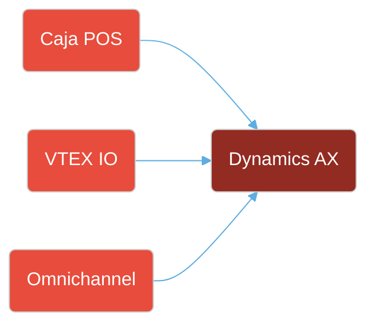
```mermaid
%%{init: {'theme': 'dark', 'themeVariables': {'lineColor': '#5dade2'}}}%%
flowchart LR
    A1(Caja POS) --> AX1(Dynamics AX)
    A2(VTEX IO) --> AX1
    A3(Omnichannel) --> AX1
    style A1 fill:#e74c3c,color:#fff
    style A2 fill:#e74c3c,color:#fff
    style A3 fill:#e74c3c,color:#fff
    style AX1 fill:#922b21,color:#fff
```

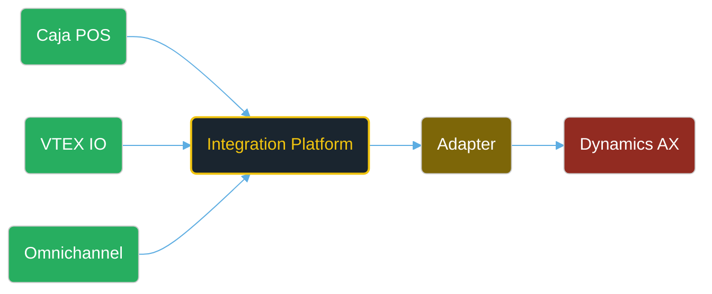
```mermaid
%%{init: {'theme': 'dark', 'themeVariables': {'lineColor': '#5dade2'}}}%%
flowchart LR
    B1(Caja POS) --> IP(Integration Platform)
    B2(VTEX IO) --> IP
    B3(Omnichannel) --> IP
    IP --> AD(Adapter)
    AD --> AX2(Dynamics AX)
    style IP fill:#1a252f,stroke:#f1c40f,color:#f1c40f,stroke-width:2px
    style AD fill:#7d6608,color:#fff
    style B1 fill:#27ae60,color:#fff
    style B2 fill:#27ae60,color:#fff
    style B3 fill:#27ae60,color:#fff
    style AX2 fill:#922b21,color:#fff
```

Note:
La plataforma actúa como capa de abstracción entre las aplicaciones y los ERPs.

---

## 3. ACL & Multi-ERP

> Adapter Pattern: misma lógica de negocio, conectores específicos por país

⬇️ _Navega hacia abajo para ver detalles_


Note:
SECCION CLAVE. Como cambiamos de ERP sin tocar la plataforma.

----

### ACL — Estado Actual (On-Premise)

<div style="text-align: center;">
<svg width="800" height="420" viewBox="0 0 800 420" xmlns="http://www.w3.org/2000/svg">

  <!-- CLOUD zone -->
  <rect x="10" y="10" width="340" height="230" rx="10" fill="none" stroke="#4285f4" stroke-width="2" stroke-dasharray="8"/>
  <text x="20" y="30" fill="#4285f4" font-size="12" font-weight="bold">CLOUD (GCP)</text>

  <!-- Integration API -->
  <rect x="25" y="45" width="180" height="55" rx="8" fill="#1a252f" stroke="#f1c40f" stroke-width="2"/>
  <text x="115" y="68" text-anchor="middle" fill="#f1c40f" font-size="11" font-weight="bold">Integration API</text>
  <text x="115" y="85" text-anchor="middle" fill="#7f8c8d" font-size="8">Lógica de negocio</text>

  <!-- Sync Worker -->
  <rect x="25" y="120" width="180" height="50" rx="8" fill="#1a252f" stroke="#27ae60" stroke-width="2"/>
  <text x="115" y="143" text-anchor="middle" fill="#27ae60" font-size="10" font-weight="bold">Sync Worker</text>
  <text x="115" y="158" text-anchor="middle" fill="#7f8c8d" font-size="8">Cloud Run Job</text>

  <!-- Firestore -->
  <rect x="25" y="190" width="180" height="40" rx="5" fill="#fbbc04"/>
  <text x="115" y="215" text-anchor="middle" fill="#2c3e50" font-size="10" font-weight="bold">Firestore</text>

  <!-- Internal arrows -->
  <line x1="115" y1="100" x2="115" y2="120" stroke="#7f8c8d" stroke-width="1"/>
  <line x1="115" y1="170" x2="115" y2="190" stroke="#fbbc04" stroke-width="1"/>

  <!-- ON-PREMISE zone -->
  <rect x="410" y="10" width="380" height="400" rx="10" fill="none" stroke="#e74c3c" stroke-width="2" stroke-dasharray="8"/>
  <text x="420" y="30" fill="#e74c3c" font-size="12" font-weight="bold">ON-PREMISE (por país)</text>

  <!-- Chile ACL -->
  <rect x="430" y="45" width="170" height="100" rx="8" fill="#1a252f" stroke="#e74c3c" stroke-width="2"/>
  <text x="515" y="63" text-anchor="middle" fill="#e74c3c" font-size="10" font-weight="bold">ACL Chile</text>
  <rect x="440" y="70" width="150" height="30" rx="4" fill="#c0392b"/>
  <text x="515" y="90" text-anchor="middle" fill="white" font-size="9">DynamicsAxAdapter</text>
  <rect x="440" y="108" width="150" height="28" rx="4" fill="#922b21"/>
  <text x="515" y="126" text-anchor="middle" fill="white" font-size="9">Dynamics AX (AIF/SQL)</text>

  <!-- Peru ACL -->
  <rect x="430" y="160" width="170" height="100" rx="8" fill="#1a252f" stroke="#d35400" stroke-width="2"/>
  <text x="515" y="178" text-anchor="middle" fill="#d35400" font-size="10" font-weight="bold">ACL Peru</text>
  <rect x="440" y="185" width="150" height="30" rx="4" fill="#d35400"/>
  <text x="515" y="205" text-anchor="middle" fill="white" font-size="9">CustomErpAdapter</text>
  <rect x="440" y="223" width="150" height="28" rx="4" fill="#a04000"/>
  <text x="515" y="241" text-anchor="middle" fill="white" font-size="9">Custom ERP (REST)</text>

  <!-- Spain ACL -->
  <rect x="430" y="275" width="170" height="100" rx="8" fill="#1a252f" stroke="#2980b9" stroke-width="2"/>
  <text x="515" y="293" text-anchor="middle" fill="#2980b9" font-size="10" font-weight="bold">ACL España</text>
  <rect x="440" y="300" width="150" height="30" rx="4" fill="#2980b9"/>
  <text x="515" y="320" text-anchor="middle" fill="white" font-size="9">GiraAdapter</text>
  <rect x="440" y="338" width="150" height="28" rx="4" fill="#1a5276"/>
  <text x="515" y="356" text-anchor="middle" fill="white" font-size="9">Gira (API)</text>

  <!-- Arrow Cloud → On-Prem (API → ACL Chile) -->
  <line x1="205" y1="70" x2="430" y2="90" stroke="#5dade2" stroke-width="2" marker-end="url(#arrowACL2)"/>
  <rect x="265" y="55" width="85" height="18" rx="3" fill="#1a1a2e"/>
  <text x="307" y="68" text-anchor="middle" fill="#5dade2" font-size="9" font-weight="bold">REST / gRPC</text>

  <!-- Arrow Cloud → On-Prem (Sync → ACL Chile) -->
  <line x1="205" y1="145" x2="430" y2="115" stroke="#27ae60" stroke-width="2" stroke-dasharray="5" marker-end="url(#arrowACL2)"/>
  <rect x="265" y="118" width="80" height="18" rx="3" fill="#1a1a2e"/>
  <text x="305" y="131" text-anchor="middle" fill="#27ae60" font-size="9" font-weight="bold">sync via ACL</text>

  <!-- Bracket: same codebase -->
  <line x1="620" y1="55" x2="640" y2="55" stroke="#2ecc71" stroke-width="2"/>
  <line x1="640" y1="55" x2="640" y2="365" stroke="#2ecc71" stroke-width="2"/>
  <line x1="620" y1="365" x2="640" y2="365" stroke="#2ecc71" stroke-width="2"/>
  <text x="660" y="200" fill="#2ecc71" font-size="10" font-weight="bold">Misma</text>
  <text x="660" y="215" fill="#2ecc71" font-size="10" font-weight="bold">app ACL</text>
  <text x="660" y="235" fill="#7f8c8d" font-size="9">COUNTRY_CODE</text>
  <text x="660" y="248" fill="#7f8c8d" font-size="9">activa adapter</text>

  <defs>
    <marker id="arrowACL2" markerWidth="8" markerHeight="8" refX="7" refY="3" orient="auto">
      <path d="M0,0 L0,6 L8,3 z" fill="#888"/>
    </marker>
  </defs>
</svg>
</div>

Note:
ACL on-premise junto al ERP. Mismo codigo, COUNTRY_CODE activa adapter.

----

### ACL — Migración al ERP Cloud

<div style="text-align: center;">
<svg width="800" height="400" viewBox="0 0 800 400" xmlns="http://www.w3.org/2000/svg">

  <!-- CLOUD zone (expanded) -->
  <rect x="10" y="10" width="780" height="380" rx="10" fill="none" stroke="#4285f4" stroke-width="2" stroke-dasharray="8"/>
  <text x="20" y="30" fill="#4285f4" font-size="11" font-weight="bold">TODO EN CLOUD (GCP)</text>

  <!-- Integration API -->
  <rect x="25" y="50" width="200" height="65" rx="8" fill="#1a252f" stroke="#f1c40f" stroke-width="2"/>
  <text x="125" y="77" text-anchor="middle" fill="#f1c40f" font-size="11" font-weight="bold">Integration API</text>
  <text x="125" y="95" text-anchor="middle" fill="#7f8c8d" font-size="8">0% cambios</text>

  <!-- Sync Worker -->
  <rect x="25" y="140" width="200" height="50" rx="8" fill="#1a252f" stroke="#27ae60" stroke-width="2"/>
  <text x="125" y="168" text-anchor="middle" fill="#27ae60" font-size="10" font-weight="bold">Sync Worker (0% cambios)</text>

  <!-- Firestore -->
  <rect x="25" y="220" width="200" height="45" rx="5" fill="#fbbc04"/>
  <text x="125" y="248" text-anchor="middle" fill="#2c3e50" font-size="10" font-weight="bold">Firestore (0% cambios)</text>

  <!-- ACL (Cloud Run now) -->
  <rect x="300" y="50" width="200" height="110" rx="8" fill="#1a252f" stroke="#2ecc71" stroke-width="3"/>
  <text x="400" y="72" text-anchor="middle" fill="#2ecc71" font-size="12" font-weight="bold">ACL (Cloud Run)</text>
  <rect x="315" y="85" width="170" height="35" rx="4" fill="#27ae60"/>
  <text x="400" y="106" text-anchor="middle" fill="white" font-size="10" font-weight="bold">NewErpCloudAdapter</text>
  <text x="400" y="147" text-anchor="middle" fill="#7f8c8d" font-size="8">1 adapter, 3 configs</text>

  <!-- ERP Cloud Instances -->
  <rect x="570" y="40" width="195" height="80" rx="8" fill="#1e8449"/>
  <text x="667" y="65" text-anchor="middle" fill="white" font-size="10" font-weight="bold">ERP Cloud (Chile)</text>
  <text x="667" y="82" text-anchor="middle" fill="#d5f5e3" font-size="8">config: CL</text>

  <rect x="570" y="135" width="195" height="80" rx="8" fill="#1e8449"/>
  <text x="667" y="160" text-anchor="middle" fill="white" font-size="10" font-weight="bold">ERP Cloud (Peru)</text>
  <text x="667" y="177" text-anchor="middle" fill="#d5f5e3" font-size="8">config: PE</text>

  <rect x="570" y="230" width="195" height="80" rx="8" fill="#1e8449"/>
  <text x="667" y="255" text-anchor="middle" fill="white" font-size="10" font-weight="bold">ERP Cloud (España)</text>
  <text x="667" y="272" text-anchor="middle" fill="#d5f5e3" font-size="8">config: ES</text>

  <!-- Arrows -->
  <line x1="225" y1="82" x2="300" y2="100" stroke="#5dade2" stroke-width="2" marker-end="url(#arrowACL3)"/>
  <line x1="225" y1="165" x2="300" y2="110" stroke="#27ae60" stroke-width="2" marker-end="url(#arrowACL3)"/>
  <line x1="500" y1="90" x2="570" y2="75" stroke="#2ecc71" stroke-width="2" marker-end="url(#arrowACL3)"/>
  <line x1="500" y1="105" x2="570" y2="170" stroke="#2ecc71" stroke-width="2" marker-end="url(#arrowACL3)"/>
  <line x1="500" y1="115" x2="570" y2="265" stroke="#2ecc71" stroke-width="2" marker-end="url(#arrowACL3)"/>

  <!-- Migration summary -->
  <rect x="300" y="200" width="200" height="80" rx="6" fill="none" stroke="#f1c40f" stroke-width="2"/>
  <text x="400" y="222" text-anchor="middle" fill="#f1c40f" font-size="10" font-weight="bold">Cambios requeridos:</text>
  <text x="400" y="240" text-anchor="middle" fill="#2ecc71" font-size="9">✓ 1 nuevo adapter</text>
  <text x="400" y="255" text-anchor="middle" fill="#2ecc71" font-size="9">✓ ACL se mueve a Cloud Run</text>
  <text x="400" y="270" text-anchor="middle" fill="#e74c3c" font-size="9">✗ Integration API: 0 cambios</text>

  <!-- Bottom label -->
  <text x="400" y="370" text-anchor="middle" fill="#2ecc71" font-size="12" font-weight="bold">El ACL migra de on-premise a Cloud Run — la plataforma no cambia</text>

  <defs>
    <marker id="arrowACL3" markerWidth="8" markerHeight="8" refX="7" refY="3" orient="auto">
      <path d="M0,0 L0,6 L8,3 z" fill="#888"/>
    </marker>
  </defs>
</svg>
</div>

Note:
ACL migra a Cloud Run. 1 nuevo adapter. Integration API: 0 cambios.

----

### ACL — Código: Adapter por País

```typescript
// acl/src/adapters/dynamics-ax.adapter.ts (Chile)
@Injectable()
export class DynamicsAxAdapter implements ErpPort {
  async syncOrder(order: OrderDto): Promise<ErpResult> {
    // AIF/SQL directo al Dynamics AX on-premise
    return this.aifClient.submitSalesOrder(order);
  }
}

// acl/src/adapters/custom-erp.adapter.ts (Peru)
@Injectable()
export class CustomErpAdapter implements ErpPort {
  async syncOrder(order: OrderDto): Promise<ErpResult> {
    // REST API al ERP custom
    return this.httpClient.post('/api/orders', order);
  }
}

// acl/src/adapters/gira.adapter.ts (España)
@Injectable()
export class GiraAdapter implements ErpPort {
  async syncOrder(order: OrderDto): Promise<ErpResult> {
    // API Gira
    return this.giraClient.createOrder(order);
  }
}
```

Note:
Cada adapter implementa el mismo port. El ERP no importa, el contrato es el mismo.

----

### ACL — Código: Dynamic Module

```typescript
// acl/src/erp.module.ts
@Module({})
export class ErpModule {
  static register(): DynamicModule {
    const country = process.env.COUNTRY_CODE; // CL | PE | ES

    const adapterMap: Record<string, Type<ErpPort>> = {
      CL: DynamicsAxAdapter,
      PE: CustomErpAdapter,
      ES: GiraAdapter,
    };

    return {
      module: ErpModule,
      providers: [
        { provide: ERP_PORT, useClass: adapterMap[country] },
      ],
      exports: [ERP_PORT],
    };
  }
}
```

> *`COUNTRY_CODE` en runtime decide qué adapter se inyecta*

Note:
NestJS Dynamic Module. COUNTRY_CODE selecciona el adapter en tiempo de arranque.

----

### ACL — Código: Consumidor

```typescript
// acl/src/services/order-sync.service.ts
@Injectable()
export class OrderSyncService {
  constructor(
    @Inject(ERP_PORT) private readonly erp: ErpPort,
  ) {}

  async sync(order: OrderDto): Promise<void> {
    await this.erp.syncOrder(order);
    // No sabe si es AX, Custom o Gira
  }
}
```

<p style="text-align: center; color: #2ecc71; font-size: 0.9em; margin-top: 30px;">
<strong>1 codebase → 3 países → COUNTRY_CODE decide el adapter</strong>
</p>

Note:
El servicio no sabe que ERP hay detras. Mismo deploy, misma imagen Docker.

---

## 4. Infraestructura GCP

> GCP Cloud Run: serverless, auto-scaling, zero-ops

⬇️ _Navega hacia abajo para ver detalles_


Note:
Todo managed. Cloud Run, Firestore, Pub/Sub. No Kubernetes.

----

### Estructura Organizacional GCP

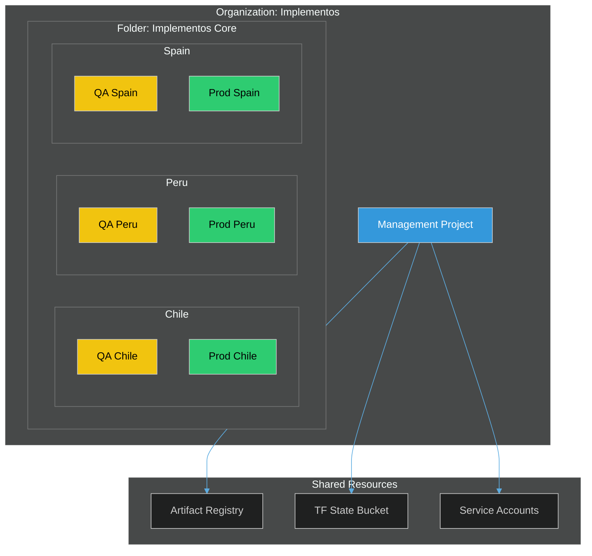
```mermaid
%%{init: {'theme': 'dark', 'themeVariables': {'lineColor': '#5dade2', 'primaryColor': '#2c3e50'}}}%%
graph TB
    subgraph ORG["Organization: Implementos"]
        direction TB
        subgraph FOLDER["Folder: Implementos Core"]
            direction LR
            subgraph CL["Chile"]
                CL_QA[QA Chile]
                CL_PROD[Prod Chile]
            end
            subgraph PE["Peru"]
                PE_QA[QA Peru]
                PE_PROD[Prod Peru]
            end
            subgraph ES["Spain"]
                ES_QA[QA Spain]
                ES_PROD[Prod Spain]
            end
        end
        MGT[Management Project]
    end
    subgraph SHARED["Shared Resources"]
        AR["Artifact Registry"]
        TF["TF State Bucket"]
        SA["Service Accounts"]
    end
    MGT --> AR
    MGT --> TF
    MGT --> SA
    style CL_QA fill:#f1c40f,color:#000
    style CL_PROD fill:#2ecc71,color:#000
    style PE_QA fill:#f1c40f,color:#000
    style PE_PROD fill:#2ecc71,color:#000
    style ES_QA fill:#f1c40f,color:#000
    style ES_PROD fill:#2ecc71,color:#000
    style MGT fill:#3498db,color:#fff
```

Note:
Organization > Folder > Proyectos por pais. Amarillo=QA, Verde=Prod.

----

### Deployment Multi-País

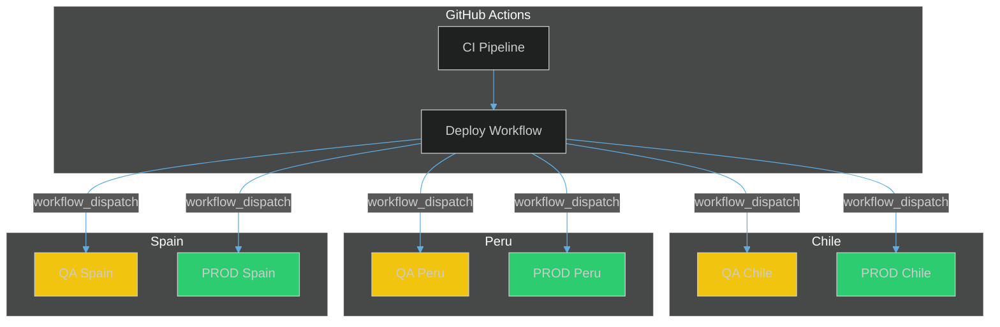
```mermaid
%%{init: {'theme': 'dark', 'themeVariables': {'lineColor': '#5dade2'}}}%%
graph TB
    subgraph "GitHub Actions"
        CI[CI Pipeline]
        DEPLOY[Deploy Workflow]
    end
    subgraph "Chile"
        QA_CL[QA Chile]
        PROD_CL[PROD Chile]
    end
    subgraph "Peru"
        QA_PE[QA Peru]
        PROD_PE[PROD Peru]
    end
    subgraph "Spain"
        QA_ES[QA Spain]
        PROD_ES[PROD Spain]
    end
    CI --> DEPLOY
    DEPLOY -->|workflow_dispatch| QA_CL
    DEPLOY -->|workflow_dispatch| PROD_CL
    DEPLOY -->|workflow_dispatch| QA_PE
    DEPLOY -->|workflow_dispatch| PROD_PE
    DEPLOY -->|workflow_dispatch| QA_ES
    DEPLOY -->|workflow_dispatch| PROD_ES
    style QA_CL fill:#f1c40f
    style PROD_CL fill:#2ecc71
    style QA_PE fill:#f1c40f
    style PROD_PE fill:#2ecc71
    style QA_ES fill:#f1c40f
    style PROD_ES fill:#2ecc71
```

Note:
workflow_dispatch. Mismo codigo, diferente config por pais.

----

### Deployment Multi-País — Aislamiento

<div style="font-size: 0.55em;">

| Aspecto | Implementación |
|---------|---------------|
| **Proyecto GCP** | 1 proyecto por país-entorno (`impl-chile-prod`, `impl-peru-qa`) |
| **Service Account** | Aislado por país (blast radius limitado) |
| **Secrets** | Secret Manager independiente por proyecto |
| **Cloud Run** | Instancia dedicada por país |
| **Base de datos** | Conexión dedicada por país |
| **CI/CD** | Matrix deployment: `[cl, pe, es]` en paralelo |
| **Monitoreo** | Dashboards y alertas por país |
| **Timezone** | Configurado en Docker (Santiago, Lima, Madrid) |
| **Compliance** | Datos residentes en región del país |

</div>

> Cada país es un **blast radius independiente**: un problema en Chile NO afecta a Peru

Note:
El aislamiento por país es crítico. Cada país tiene su propio proyecto GCP, sus propias credenciales,
su propia base de datos y su propia instancia de Cloud Run. Un fallo en un país no impacta a los otros.

----

### Arquitectura Cloud Run

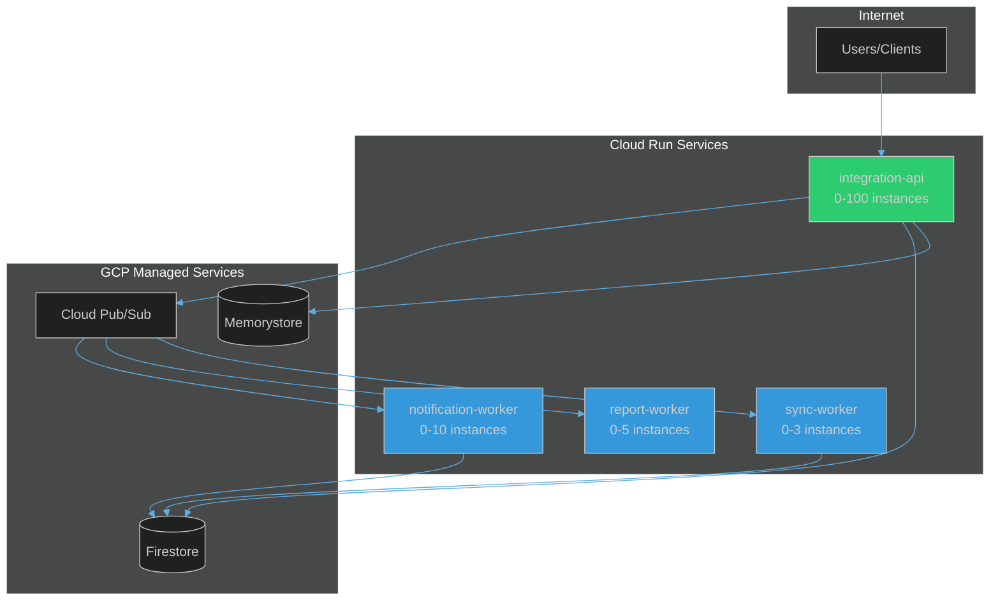
```mermaid
%%{init: {'theme': 'dark', 'themeVariables': {'lineColor': '#5dade2'}}}%%
graph TB
    subgraph "Internet"
        U[Users/Clients]
    end
    subgraph "Cloud Run Services"
        API[integration-api<br/>0-100 instances]
        NW[notification-worker<br/>0-10 instances]
        RW[report-worker<br/>0-5 instances]
        SW[sync-worker<br/>0-3 instances]
    end
    subgraph "GCP Managed Services"
        PS[Cloud Pub/Sub]
        FS[(Firestore)]
        MS[(Memorystore)]
    end
    U --> API
    API --> PS
    PS --> NW
    PS --> RW
    PS --> SW
    API --> FS
    API --> MS
    NW --> FS
    SW --> FS
    style API fill:#2ecc71
    style NW fill:#3498db
    style RW fill:#3498db
    style SW fill:#3498db
```

> **Escala automática**: De 0 a 100+ instancias según load

Note:
integration-api 0-100 inst. Workers por Pub/Sub. Todo auto-scale.

----

### Arquitectura Pub/Sub

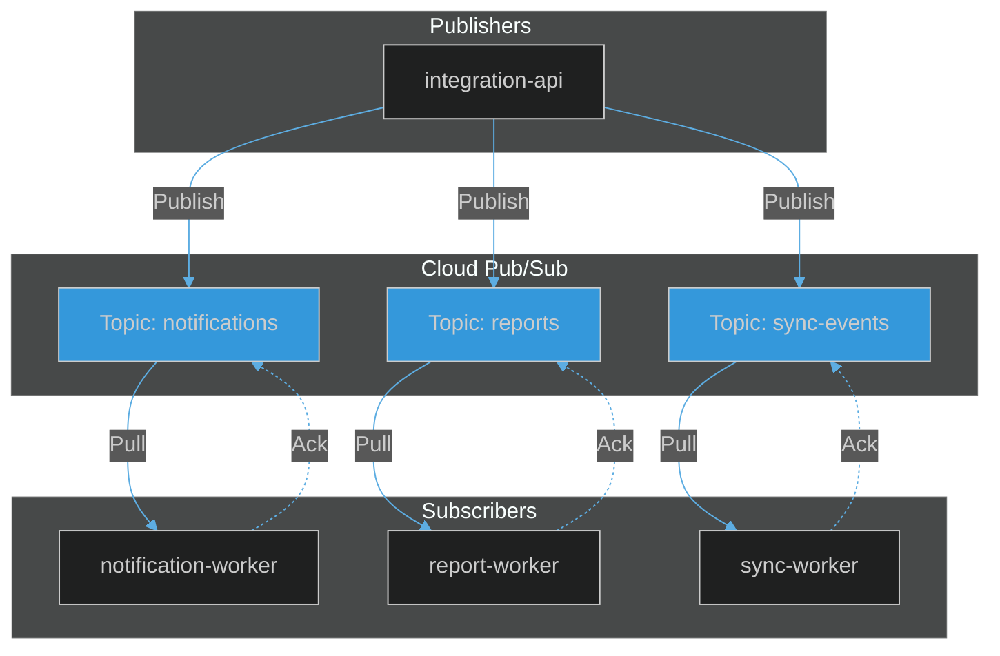
```mermaid
%%{init: {'theme': 'dark', 'themeVariables': {'lineColor': '#5dade2'}}}%%
graph TB
    subgraph "Publishers"
        A[integration-api]
    end

    subgraph "Cloud Pub/Sub"
        T1[Topic: notifications]
        T2[Topic: reports]
        T3[Topic: sync-events]
    end

    subgraph "Subscribers"
        S1[notification-worker]
        S2[report-worker]
        S3[sync-worker]
    end

    A -->|Publish| T1
    A -->|Publish| T2
    A -->|Publish| T3

    T1 -->|Pull| S1
    T2 -->|Pull| S2
    T3 -->|Pull| S3

    S1 -.->|Ack| T1
    S2 -.->|Ack| T2
    S3 -.->|Ack| T3

    style T1 fill:#3498db
    style T2 fill:#3498db
    style T3 fill:#3498db
```

Note:
integration-api publica eventos a topics. Workers son subscribers que procesan eventos.
Si un worker falla, Pub/Sub hace retry automatico. Si esta saturado, backoff automatico.

----

### Arquitectura de Workers

<div style="font-size: 0.65em;">

| **Worker** | **Tipo Cloud Run** | **Trigger** | **Responsabilidad** |
|---|---|---|---|
| **notification-worker** | Service (push) | Pub/Sub push inmediato | Notificaciones transaccionales vía Salesforce MC |
| **notification-retry-worker** | Job (scheduled) | Cloud Scheduler cada 5 min | Recupera PENDING, PROCESSING y RETRY_SCHEDULED |
| **sync-worker** | Job (scheduled) | Cloud Scheduler (4 tasks) | Sync ERP: stock, precios, órdenes, reconciliación |
| **report-worker** | Job (scheduled) | Cloud Scheduler (4 reports) | Reportes: inventario, ventas, pricing, consolidado |
| **pickup-reminder-worker** | Job (scheduled) | Cloud Scheduler cada hora | Recordatorio 24h después de "listo para retiro" |

</div>

Note:
5 workers. notification-worker es Service (push Pub/Sub en tiempo real).
Los otros 4 son Jobs por Cloud Scheduler.
notification-retry-worker tiene 23mil+ ejecuciones (cada 5 min).
sync-worker se conecta a Dynamics AX via SQL directo.

----

### Sync Worker — Tareas Programadas

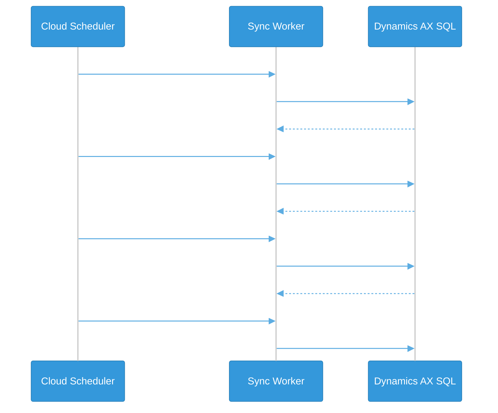
```mermaid
%%{init: {'theme': 'dark', 'themeVariables': {'lineColor': '#5dade2', 'actorTextColor': '#fff', 'signalTextColor': '#fff', 'actorBkg': '#3498db', 'actorBorder': '#2980b9', 'signalColor': '#5dade2'}}}%%
sequenceDiagram
    participant CS as Cloud Scheduler
    participant SW as Sync Worker
    participant AX as Dynamics AX SQL

    CS->>SW: stock (cada hora, 8AM-8PM Lun-Sab)
    SW->>AX: SELECT stock delta
    AX-->>SW: rows

    CS->>SW: erp (cada 4 horas)
    SW->>AX: SELECT data delta
    AX-->>SW: rows

    CS->>SW: full (diario 2AM)
    SW->>AX: SELECT * (full sync)
    AX-->>SW: all data

    CS->>SW: reconcile (domingos 3AM)
    SW->>AX: Reconciliación semanal
```


Note:
4 tipos de sync con Dynamics AX:
Stock: cada hora 8AM-8PM lun-sab (horario tiendas).
ERP: delta cada 4 horas. Full: diario 2AM. Reconcile: domingos 3AM.

----

### Notification Worker — Flujo Completo

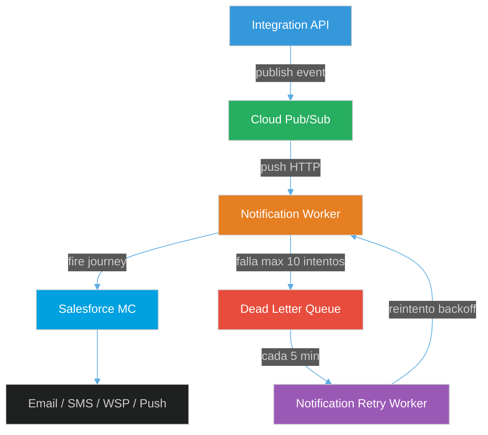
```mermaid
%%{init: {'theme': 'dark', 'themeVariables': {'lineColor': '#5dade2'}}}%%
graph TD
    A[Integration API] -->|publish event| B[Cloud Pub/Sub]
    B -->|push HTTP| C[Notification Worker]
    C -->|fire journey| D[Salesforce MC]
    D --> E[Email / SMS / WSP / Push]
    C -->|falla max 10 intentos| F[Dead Letter Queue]
    F -->|cada 5 min| G[Notification Retry Worker]
    G -->|reintento backoff| C

    style A fill:#3498db,color:#fff
    style B fill:#27ae60,color:#fff
    style C fill:#e67e22,color:#fff
    style D fill:#00a1e0,color:#fff
    style F fill:#e74c3c,color:#fff
    style G fill:#9b59b6,color:#fff
```

Note:
Flujo: Integration API publica en Pub/Sub, worker recibe via push HTTP,
se autentica con SFMC via OAuth2, y dispara un Journey.
Si falla, Pub/Sub reintenta 10 veces. Despues va a DLQ.
Retry worker cada 5 min con backoff exponencial.

----

### Notification Worker — Resiliencia

- **Circuit breaker** separado para auth SFMC y delivery
- **Token refresh** proactivo con mutex (evita thundering herd)
- **Clasificación de errores**: retryable vs non-retryable
- **Máximo 5 reintentos** por notificación con backoff: 5→10→20→30→30 min
- **Dead Letter Queue** captura mensajes que agotan reintentos

Note:
Cada componente tiene su propio circuit breaker.
Si SFMC auth cae, el delivery circuit breaker sigue independiente.
Token refresh usa mutex para evitar que N workers pidan token al mismo tiempo.

----

### Stack de Infraestructura

<div style="text-align: center;">
<svg width="750" height="400" viewBox="0 0 750 400" xmlns="http://www.w3.org/2000/svg">

  <!-- GCP Cloud -->
  <rect x="10" y="10" width="730" height="380" rx="12" fill="none" stroke="#4285f4" stroke-width="2"/>
  <text x="375" y="35" text-anchor="middle" fill="#4285f4" font-size="14" font-weight="bold">Google Cloud Platform</text>

  <!-- Row 1: Networking -->
  <rect x="30" y="50" width="690" height="55" rx="6" fill="#1a252f"/>
  <text x="50" y="70" fill="#ea4335" font-size="10" font-weight="bold">NETWORKING</text>

  <rect x="160" y="58" width="150" height="35" rx="4" fill="#ea4335"/>
  <text x="235" y="80" text-anchor="middle" fill="white" font-size="9">Cloud Run TLS + DDoS</text>

  <rect x="320" y="58" width="130" height="35" rx="4" fill="#ea4335"/>
  <text x="385" y="80" text-anchor="middle" fill="white" font-size="9">VPC + Direct Egress</text>

  <rect x="460" y="58" width="130" height="35" rx="4" fill="#ea4335"/>
  <text x="525" y="80" text-anchor="middle" fill="white" font-size="9">VPC Peering (Omni)</text>

  <rect x="600" y="58" width="100" height="35" rx="4" fill="#ea4335"/>
  <text x="650" y="80" text-anchor="middle" fill="white" font-size="9">IAM + SA</text>

  <!-- Row 2: Compute -->
  <rect x="30" y="115" width="690" height="70" rx="6" fill="#1a252f"/>
  <text x="50" y="135" fill="#4285f4" font-size="10" font-weight="bold">COMPUTE</text>

  <rect x="160" y="125" width="130" height="50" rx="4" fill="#4285f4"/>
  <text x="225" y="147" text-anchor="middle" fill="white" font-size="10" font-weight="bold">Cloud Run</text>
  <text x="225" y="163" text-anchor="middle" fill="#d5e8f7" font-size="8">Integration API + Workers</text>

  <rect x="300" y="125" width="130" height="50" rx="4" fill="#4285f4"/>
  <text x="365" y="147" text-anchor="middle" fill="white" font-size="10" font-weight="bold">Cloud Scheduler</text>
  <text x="365" y="163" text-anchor="middle" fill="#d5e8f7" font-size="8">Cron Jobs</text>

  <rect x="440" y="125" width="130" height="50" rx="4" fill="#4285f4"/>
  <text x="505" y="147" text-anchor="middle" fill="white" font-size="10" font-weight="bold">Cloud Tasks</text>
  <text x="505" y="163" text-anchor="middle" fill="#d5e8f7" font-size="8">Async Processing</text>

  <rect x="580" y="125" width="130" height="50" rx="4" fill="#4285f4"/>
  <text x="645" y="147" text-anchor="middle" fill="white" font-size="10" font-weight="bold">Artifact Registry</text>
  <text x="645" y="163" text-anchor="middle" fill="#d5e8f7" font-size="8">Docker Images</text>

  <!-- Row 3: Data -->
  <rect x="30" y="195" width="690" height="65" rx="6" fill="#1a252f"/>
  <text x="50" y="215" fill="#fbbc04" font-size="10" font-weight="bold">DATA</text>

  <rect x="160" y="205" width="120" height="45" rx="4" fill="#fbbc04"/>
  <text x="220" y="224" text-anchor="middle" fill="#2c3e50" font-size="9" font-weight="bold">Firestore</text>
  <text x="220" y="240" text-anchor="middle" fill="#2c3e50" font-size="8">MongoDB API</text>

  <rect x="290" y="205" width="120" height="45" rx="4" fill="#fbbc04"/>
  <text x="350" y="224" text-anchor="middle" fill="#2c3e50" font-size="9" font-weight="bold">Memorystore</text>
  <text x="350" y="240" text-anchor="middle" fill="#2c3e50" font-size="8">Redis Cache</text>

  <rect x="420" y="205" width="120" height="45" rx="4" fill="#fbbc04"/>
  <text x="480" y="224" text-anchor="middle" fill="#2c3e50" font-size="9" font-weight="bold">Secret Manager</text>
  <text x="480" y="240" text-anchor="middle" fill="#2c3e50" font-size="8">Credenciales</text>

  <rect x="550" y="205" width="120" height="45" rx="4" fill="#fbbc04"/>
  <text x="610" y="224" text-anchor="middle" fill="#2c3e50" font-size="9" font-weight="bold">Cloud Storage</text>
  <text x="610" y="240" text-anchor="middle" fill="#2c3e50" font-size="8">Archivos</text>

  <!-- Row 4: Messaging -->
  <rect x="30" y="270" width="340" height="55" rx="6" fill="#1a252f"/>
  <text x="50" y="290" fill="#34a853" font-size="10" font-weight="bold">MESSAGING</text>

  <rect x="160" y="280" width="90" height="35" rx="4" fill="#34a853"/>
  <text x="205" y="302" text-anchor="middle" fill="white" font-size="9">Cloud Pub/Sub</text>

  <rect x="260" y="280" width="100" height="35" rx="4" fill="#34a853"/>
  <text x="310" y="302" text-anchor="middle" fill="white" font-size="9">Dead Letter Queue</text>

  <!-- Row 4b: Observability -->
  <rect x="380" y="270" width="340" height="55" rx="6" fill="#1a252f"/>
  <text x="400" y="290" fill="#95a5a6" font-size="10" font-weight="bold">OBSERVABILITY</text>

  <rect x="510" y="280" width="100" height="35" rx="4" fill="#FF6F00"/>
  <text x="560" y="302" text-anchor="middle" fill="white" font-size="9">Grafana Cloud</text>

  <rect x="620" y="280" width="90" height="35" rx="4" fill="#7f8c8d"/>
  <text x="665" y="302" text-anchor="middle" fill="white" font-size="9">Cloud Logging</text>

  <!-- Row 5: Security -->
  <rect x="30" y="335" width="690" height="45" rx="6" fill="#1a252f"/>
  <text x="50" y="355" fill="#c0392b" font-size="10" font-weight="bold">SECURITY</text>

  <rect x="160" y="343" width="130" height="28" rx="4" fill="#922b21"/>
  <text x="225" y="361" text-anchor="middle" fill="white" font-size="9">Workload Identity (OIDC)</text>

  <rect x="300" y="343" width="130" height="28" rx="4" fill="#922b21"/>
  <text x="365" y="361" text-anchor="middle" fill="white" font-size="9">IAM + Service Accounts</text>

  <rect x="440" y="343" width="130" height="28" rx="4" fill="#922b21"/>
  <text x="505" y="361" text-anchor="middle" fill="white" font-size="9">VPC Peering</text>

  <rect x="580" y="343" width="130" height="28" rx="4" fill="#922b21"/>
  <text x="645" y="361" text-anchor="middle" fill="white" font-size="9">KMS Encryption</text>

</svg>
</div>

Note:
Managed services. Preferir managed, self-hosted solo si necesario.

----

### Arquitectura Redis (Memorystore)

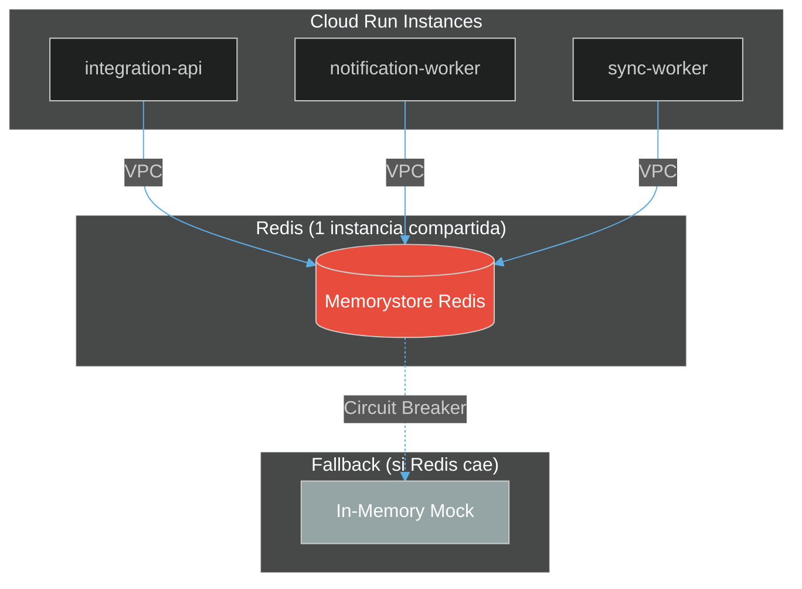
```mermaid
%%{init: {'theme': 'dark', 'themeVariables': {'lineColor': '#5dade2'}}}%%
graph TB
    subgraph "Cloud Run Instances"
        API[integration-api]
        NW[notification-worker]
        SW[sync-worker]
    end

    subgraph "Redis (1 instancia compartida)"
        R[(Memorystore Redis)]
    end

    subgraph "Fallback (si Redis cae)"
        M[In-Memory Mock]
    end

    API -->|VPC| R
    NW -->|VPC| R
    SW -->|VPC| R
    R -.->|Circuit Breaker| M

    style R fill:#e74c3c,color:#fff
    style M fill:#95a5a6,color:#fff
```

<div style="font-size: 0.6em;">

| Uso | Key Prefix | Fail Strategy |
|-----|-----------|---------------|
| **Auth Blacklist** | `logout_token_*` | Fail-closed (deniega acceso) |
| **Rate Limiting** | `throttle:*` | Fail-closed (429 Too Many Requests) |
| **Cache General** | `cache:*` | StampedeGuard + Singleflight |
| **Distributed Locks** | `lock:*` | Redlock pattern |
| **Pub/Sub Dedup** | `idempotency:*` | Message deduplication |

</div>

Note:
1 Redis compartido, namespacing por key prefix. Fail-closed en auth y rate limiting.
StampedeGuard previene thundering herd. Si Redis cae, in-memory mock para dev.

----

### Memorystore — Configuración Actual vs HA

<div style="font-size: 0.7em;">

| Característica | **Actual (BASIC)** | **Futuro (STANDARD)** |
|---|---|---|
| **Réplicas** | 1 instancia, sin réplica | 1 primary + 1 replica (cross-zone) |
| **Failover** | In-memory mock (dev) / fail-closed (prod) | Automático en <30 segundos |
| **Backups** | No | Diarios automáticos |
| **SLA** | Best-effort | 99.9% disponibilidad |
| **Memoria** | 1 GB | 1-5 GB configurable |
| **Costo** | ~$25/mes | ~$50/mes (M1 5GB) |
| **Cambio requerido** | — | 1 línea en Terraform (`tier = "STANDARD_HA"`) |

</div>

> **Escalar a HA**: cambiar 1 línea en Terraform — **0 cambios en la aplicación**

Note:
Hoy usamos BASIC por costo. La app ya esta preparada para HA con circuit breakers y fallbacks.
Cuando el costo de downtime supere $50/mes, subir a STANDARD_HA. Zero code changes.

----

### Inventario GCP — Compute & Messaging

<div style="font-size: 0.6em;">

| Servicio | Recurso | Detalle |
|----------|---------|---------|
| **Cloud Run Services** | `integration-api` | API principal (2 vCPU, 1Gi, min=1, max=10) |
| | `notification-worker` | Push subscriber SFMC (2 vCPU, 1Gi) |
| **Cloud Run Jobs** | `sync-worker` | Sync ERP Dynamics AX |
| | `notification-retry-worker` | Recovery notificaciones fallidas |
| | `report-worker` | Reportes inventory/sales/pricing |
| | `pickup-reminder-worker` | Recordatorio 24h retiro |
| **Cloud Pub/Sub** | `notification-worker` | Topic + push subscription |
| | `notification-worker-dlq` | Dead Letter Queue |
| **Cloud Scheduler** | `notification-retry-scheduler` | Cada 5 min |
| | `pickup-reminder-hourly` | Cada hora |

</div>

Note:
2 Cloud Run Services (integration-api y notification-worker).
4 Cloud Run Jobs (sync, retry, report, pickup-reminder).
Pub/Sub con DLQ para notificaciones. Cloud Scheduler para tareas periodicas.

----

### Cloud Run Auto-Scaling

<div style="font-size: 0.75em;">

| Config | QA | Producción |
|--------|----|----|
| **Min instancias** | 0 (scale-to-zero) | 1 (always warm) |
| **Max instancias** | 1 | 10 |
| **vCPU** | 1 | 2 |
| **Memoria** | 512 Mi | 1 Gi |
| **Concurrencia** | 80 req/container | 100 req/container |
| **Timeout** | 300s | 60s |
| **CPU Boost** | No | Si (cold starts) |
| **Costo mensual** | ~$5-15 | ~$50-100 |

</div>

Note:
QA: scale-to-zero (5-15 USD/mes). Prod: min=1 siempre caliente, max=10.
Cada instancia 2 vCPU, 1Gi, 100 req concurrentes. CPU Boost para cold starts.

----

### Cloud Run — Auto-Scaling en Acción

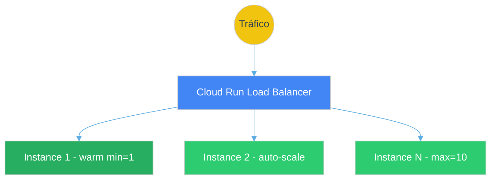
```mermaid
%%{init: {'theme': 'dark', 'themeVariables': {'lineColor': '#5dade2'}}}%%
graph TD
    T((Tráfico)) --> LB[Cloud Run Load Balancer]
    LB --> I1["Instance 1 - warm min=1"]
    LB --> I2["Instance 2 - auto-scale"]
    LB --> I3["Instance N - max=10"]

    style T fill:#f1c40f,color:#2c3e50
    style LB fill:#4285f4,color:#fff
    style I1 fill:#27ae60,color:#fff
    style I2 fill:#2ecc71,color:#fff
    style I3 fill:#2ecc71,color:#fff
```

> Cada instancia maneja **100 req concurrentes** — si se supera, Cloud Run crea otra automáticamente

Note:
Cloud Run escala automaticamente de 1 a 10 instancias segun la carga.
Siempre hay al menos 1 instancia caliente en produccion.
Si una instancia llega a 100 req concurrentes, se crea otra.

----

### Cloud Run — Estrategia de Mitigación

<div style="font-size: 0.7em;">

| Config | Valor | Efecto |
|--------|-------|--------|
| **minScale** | 1 | Elimina cold starts |
| **maxScale** | 10 | Limita escalado y costos |
| **CPU Boost** | Si (prod) | Acelera startup instancias nuevas |
| **Concurrencia** | 100 req/container | Threshold para nueva instancia |
| **Timeout** | 60s prod / 300s QA | Protege contra requests colgados |
| **Costo** | ~$50-100/mes | 1 instancia warm 24/7 |

</div>

> *Resultado: Zero cold starts, respuestas <100ms*

Note:
minScale=1 elimina cold starts a cambio de ~$50/mes. CPU Boost acelera las instancias nuevas.
El timeout de 60s en prod protege contra requests colgados sin afectar operaciones normales.

----

### Resumen de Decisiones GCP

| Servicio | Decisión | Razón Principal |
|----------|----------|-----------------|
| **Database** | Firestore | MongoDB API, zero ops, auto-scaling |
| **Cache** | Memorystore | Redis managed, fallback in-memory |
| **Messaging** | Cloud Pub/Sub | Zero config, infinite scale |
| **Compute** | Cloud Run | Serverless, auto-scale, zero idle cost |
| **Secrets** | Secret Manager | Seguridad crítica, audit logs |
| **CI/CD** | GitHub Actions | Nx affected, matrix multi-país |
| **IaC** | Terraform | Reproducibilidad, multi-proyecto |

**Filosofía:** Preferir managed para enfocarnos en funcionalidades, no en infraestructura.

**Exit strategy:** Firestore usa MongoDB wire protocol → podemos migrar a MongoDB Atlas/self-hosted sin cambiar código.

Note:
Todo GCP managed. La filosofia es: si GCP lo opera mejor que nosotros, dejarlo a GCP.
Exit strategy: Firestore compatible con MongoDB wire protocol — migracion sin cambios de codigo.

---

## 5. Patrones Técnicos

> Ya vimos cómo se despliega — ahora veamos cómo se organiza el código internamente

⬇️ _Navega hacia abajo para ver detalles_


Note:
Boundaries tan estrictos como microservicios, sin el overhead operacional. Shopify y GitHub usan el mismo patron.

----

### Regla Fundamental: No Shared State

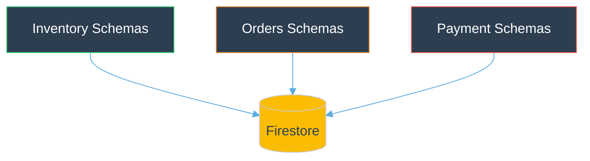
```mermaid
%%{init: {'theme': 'dark', 'themeVariables': {'lineColor': '#5dade2'}}}%%
graph TD
    INV[Inventory Schemas] --> DB[(Firestore)]
    ORD[Orders Schemas] --> DB
    PAY[Payment Schemas] --> DB
    style INV fill:#2c3e50,stroke:#2ecc71,color:#fff
    style ORD fill:#2c3e50,stroke:#e67e22,color:#fff
    style PAY fill:#2c3e50,stroke:#e74c3c,color:#fff
    style DB fill:#fbbc04,color:#2c3e50
```

- **1 Firestore**, pero cada módulo es dueño de sus **colecciones**
- **NUNCA** se importa el schema/repositorio de otro módulo
- Comunicación inter-módulo: **Facade** (sync) o **Evento** (async)

Note:
1 Firestore, cada modulo dueno de sus colecciones. Comunicacion via Facade.

----

### Comunicación Entre Módulos

<div style="font-size: 0.7em;">

| Tipo | Mecanismo | Ejemplo |
|------|-----------|---------|
| **Sync Query** | Facade | `CatalogFacade.getProduct(sku)` |
| **Sync Command** | Facade | `InventoryFacade.reserveStock(items)` |
| **Async Event** | Pub/Sub | `OrderConfirmedEvent → ReserveStock` |
| **Scheduled** | Cloud Scheduler | Sync stock cada hora |

</div>

Note:
4 formas de comunicacion entre modulos.
Facade para llamadas sincronas (queries y commands).
Pub/Sub para eventos asincrono (fire-and-forget).
Cloud Scheduler para tareas periodicas.

----

### Facade Pattern — Ejemplo

```typescript
// Facade — API pública del módulo (única forma de comunicación cross-module)
@Injectable()
export class EcommerceInventoryFacade {
  /** Consulta de stock — puede ser llamado por OMS, Cart, Catalog */
  async getStockBySku(sku: string, branchCode: string): Promise<StockDto> {
    return this.stockService.findBySku(sku, branchCode);
  }

  /** Reserva de stock — llamado cuando se confirma una orden */
  async reserveStock(items: ReserveStockDto[]): Promise<ReservationResult> {
    return this.stockService.reserve(items);
  }
}
```

> **Regla**: NUNCA importar directamente el repositorio de otro módulo — siempre vía Facade

Note:
La Facade es la unica forma de comunicacion cross-module.
Si OMS necesita stock, llama a InventoryFacade, no importa el repositorio de Inventory.
Esto mantiene los boundaries estrictos y permite extraer un modulo como microservicio en el futuro.

----

### Ecosistema de Integraciones

<div style="text-align: center;">
<svg width="800" height="420" viewBox="0 0 800 420" xmlns="http://www.w3.org/2000/svg">

  <!-- Integration API center -->
  <rect x="270" y="160" width="260" height="80" rx="10" fill="#1a252f" stroke="#f1c40f" stroke-width="3"/>
  <text x="400" y="195" text-anchor="middle" fill="#f1c40f" font-size="14" font-weight="bold">Integration Platform</text>
  <text x="400" y="215" text-anchor="middle" fill="#bdc3c7" font-size="9">Integration API + Workers</text>

  <!-- Marketplace (top) -->
  <rect x="50" y="20" width="150" height="55" rx="8" fill="#9b59b6"/>
  <text x="125" y="42" text-anchor="middle" fill="white" font-size="10" font-weight="bold">VTEX Marketplace</text>
  <text x="125" y="58" text-anchor="middle" fill="#e8d5f5" font-size="8">External Seller Protocol</text>
  <line x1="170" y1="75" x2="310" y2="160" stroke="#9b59b6" stroke-width="2"/>

  <!-- Algolia (top center) -->
  <rect x="310" y="20" width="130" height="55" rx="8" fill="#5468FF"/>
  <text x="375" y="42" text-anchor="middle" fill="white" font-size="10" font-weight="bold">Algolia</text>
  <text x="375" y="58" text-anchor="middle" fill="#c7cfff" font-size="8">Search Engine</text>
  <line x1="375" y1="75" x2="400" y2="160" stroke="#5468FF" stroke-width="2"/>

  <!-- Salesforce (top right) -->
  <rect x="520" y="20" width="160" height="55" rx="8" fill="#00a1e0"/>
  <text x="600" y="42" text-anchor="middle" fill="white" font-size="10" font-weight="bold">Salesforce Marketing</text>
  <text x="600" y="58" text-anchor="middle" fill="#cceeff" font-size="8">Cloud Journey Builder</text>
  <line x1="550" y1="75" x2="470" y2="160" stroke="#00a1e0" stroke-width="2"/>

  <!-- Payment Gateways (left) -->
  <rect x="10" y="110" width="130" height="30" rx="5" fill="#e74c3c"/>
  <text x="75" y="130" text-anchor="middle" fill="white" font-size="9">Webpay / Transbank</text>
  <rect x="10" y="145" width="130" height="30" rx="5" fill="#e74c3c"/>
  <text x="75" y="165" text-anchor="middle" fill="white" font-size="9">Khipu</text>
  <rect x="10" y="180" width="130" height="30" rx="5" fill="#e74c3c"/>
  <text x="75" y="200" text-anchor="middle" fill="white" font-size="9">MercadoPago</text>
  <rect x="10" y="215" width="130" height="30" rx="5" fill="#e74c3c"/>
  <text x="75" y="235" text-anchor="middle" fill="white" font-size="9">Niubiz</text>
  <text x="75" y="262" text-anchor="middle" fill="#e74c3c" font-size="9" font-weight="bold">Payment Gateways</text>
  <line x1="140" y1="175" x2="270" y2="195" stroke="#e74c3c" stroke-width="2"/>

  <!-- ERP (right) -->
  <rect x="660" y="130" width="130" height="30" rx="5" fill="#d35400"/>
  <text x="725" y="150" text-anchor="middle" fill="white" font-size="9">Dynamics AX (CL)</text>
  <rect x="660" y="165" width="130" height="30" rx="5" fill="#d35400"/>
  <text x="725" y="185" text-anchor="middle" fill="white" font-size="9">Custom ERP (PE)</text>
  <rect x="660" y="200" width="130" height="30" rx="5" fill="#d35400"/>
  <text x="725" y="220" text-anchor="middle" fill="white" font-size="9">Gira (ES)</text>
  <text x="725" y="247" text-anchor="middle" fill="#d35400" font-size="9" font-weight="bold">ERPs por País</text>
  <line x1="530" y1="195" x2="660" y2="185" stroke="#d35400" stroke-width="2"/>

  <!-- Messaging (bottom left) -->
  <rect x="80" y="310" width="150" height="55" rx="8" fill="#27ae60"/>
  <text x="155" y="332" text-anchor="middle" fill="white" font-size="10" font-weight="bold">Cloud Pub/Sub</text>
  <text x="155" y="348" text-anchor="middle" fill="#d5f5e3" font-size="8">Event-Driven Messaging</text>
  <line x1="200" y1="310" x2="340" y2="240" stroke="#27ae60" stroke-width="2"/>

  <!-- Databases (bottom center) -->
  <rect x="310" y="300" width="180" height="55" rx="8" fill="#f39c12"/>
  <text x="400" y="322" text-anchor="middle" fill="#2c3e50" font-size="10" font-weight="bold">Databases</text>
  <text x="400" y="340" text-anchor="middle" fill="#2c3e50" font-size="8">Firestore + Redis</text>
  <line x1="400" y1="300" x2="400" y2="240" stroke="#f39c12" stroke-width="2"/>

  <!-- Twilio / WhatsApp (bottom right) -->
  <rect x="560" y="300" width="120" height="28" rx="5" fill="#1abc9c"/>
  <text x="620" y="319" text-anchor="middle" fill="white" font-size="9">Twilio (SMS)</text>
  <rect x="560" y="335" width="120" height="28" rx="5" fill="#1abc9c"/>
  <text x="620" y="354" text-anchor="middle" fill="white" font-size="9">WhatsApp Business</text>
  <rect x="560" y="370" width="120" height="28" rx="5" fill="#1abc9c"/>
  <text x="620" y="389" text-anchor="middle" fill="white" font-size="9">SMTP (Email)</text>
  <text x="620" y="415" text-anchor="middle" fill="#1abc9c" font-size="9" font-weight="bold">Canales Legacy</text>
  <line x1="570" y1="310" x2="470" y2="240" stroke="#1abc9c" stroke-width="2"/>

</svg>
</div>

Note:
VTEX, Salesforce, Algolia, 4 gateways pago, 3 ERPs, Pub/Sub.

----

### Salesforce Marketing Cloud — Flujo

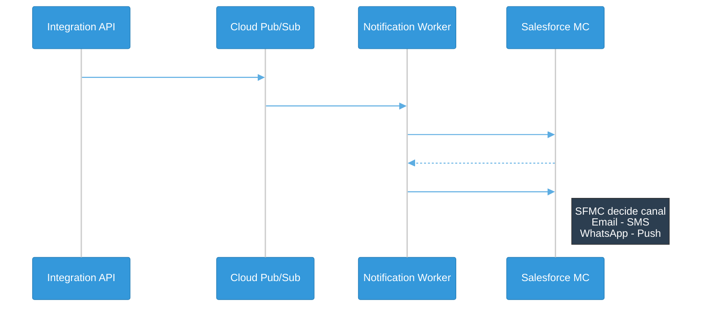
```mermaid
%%{init: {'theme': 'dark', 'themeVariables': {'lineColor': '#5dade2', 'actorTextColor': '#fff', 'signalTextColor': '#fff', 'noteBkgColor': '#2c3e50', 'noteTextColor': '#fff', 'actorBkg': '#3498db', 'actorBorder': '#2980b9', 'signalColor': '#5dade2'}}}%%
sequenceDiagram
    participant API as Integration API
    participant PS as Cloud Pub/Sub
    participant NW as Notification Worker
    participant SF as Salesforce MC

    API->>PS: 1. Publish OrderConfirmedEvent
    PS->>NW: 2. Push delivery HTTP
    NW->>SF: 3. OAuth2 token request
    SF-->>NW: access_token
    NW->>SF: 4. Fire Journey
    Note right of SF: SFMC decide canal<br/>Email - SMS<br/>WhatsApp - Push
```

Note:
Salesforce Marketing Cloud es el motor de notificaciones transaccionales.
El Integration API publica eventos, el notification-worker los procesa y dispara Journeys en SFMC.
SFMC decide el canal (email, SMS, WhatsApp, push) segun la configuracion del Journey.
Esto permite al equipo de marketing configurar canales y templates sin tocar codigo.

----

### Payment Gateway Factory

```typescript
// Selección dinámica de gateway según país y método de pago
@Injectable()
export class PaymentGatewayFactory {
  resolve(countryCode: string, method: PaymentMethod): PaymentGateway {
    // Chile: Webpay para tarjetas, Khipu para transferencias
    // Peru: Niubiz para tarjetas, MercadoPago para wallets
    // Todos: Orden de Compra B2B con validación OTP
  }
}
```

> Mismo patrón que `ErpSyncFactory` — **Adapter Pattern** aplicado a pagos

Note:
Mismo patron de adapter que usamos para los ERPs.
El factory resuelve en runtime que gateway usar segun pais y metodo de pago.
Agregar un nuevo gateway es agregar una entrada sin tocar logica existente.

---

## 6. Clean Architecture — Capas y Dependencias

> 5 capas con regla de dependencia estricta: las dependencias siempre apuntan hacia adentro

⬇️ _Navega hacia abajo para ver detalles_


Note:
5 capas con regla de dependencia estricta: las externas dependen de las internas.
La capa de Domain es TypeScript puro, sin dependencias de frameworks.
Modulos CRUD-ish NO tienen capa de dominio (RFC-0062 arquitectura pragmatica).

----

<!-- .slide: data-background="#0d1117" -->

### Las 5 Capas

<div style="text-align: center;">
<svg width="600" height="350" viewBox="0 0 600 350" xmlns="http://www.w3.org/2000/svg">
  <rect x="20" y="10" width="560" height="330" rx="15" fill="none" stroke="#95a5a6" stroke-width="2"/>
  <text x="300" y="35" text-anchor="middle" fill="#95a5a6" font-size="12" font-weight="bold">Config — Bootstrap del módulo</text>

  <rect x="50" y="45" width="500" height="270" rx="12" fill="none" stroke="#3498db" stroke-width="2"/>
  <text x="300" y="65" text-anchor="middle" fill="#3498db" font-size="12" font-weight="bold">API — Controllers, DTOs, Swagger</text>

  <rect x="80" y="80" width="440" height="210" rx="10" fill="none" stroke="#e67e22" stroke-width="2"/>
  <text x="300" y="100" text-anchor="middle" fill="#e67e22" font-size="12" font-weight="bold">Infrastructure — Repos, Adapters, Schemas</text>

  <rect x="120" y="115" width="360" height="150" rx="8" fill="none" stroke="#2ecc71" stroke-width="2"/>
  <text x="300" y="135" text-anchor="middle" fill="#2ecc71" font-size="12" font-weight="bold">Application — Facades, Services, Ports</text>

  <rect x="170" y="155" width="260" height="80" rx="8" fill="#1a252f" stroke="#e74c3c" stroke-width="3"/>
  <text x="300" y="185" text-anchor="middle" fill="#e74c3c" font-size="14" font-weight="bold">Domain</text>
  <text x="300" y="210" text-anchor="middle" fill="#bdc3c7" font-size="10">Entities, Value Objects, Events</text>
  <text x="300" y="225" text-anchor="middle" fill="#7f8c8d" font-size="9">CERO dependencias externas</text>

  <text x="540" y="180" fill="#7f8c8d" font-size="9" transform="rotate(-90, 540, 180)">Dependencias →</text>
</svg>
</div>

Note:
La capa de Domain no tiene dependencias externas — es TypeScript puro.
Application define los puertos (interfaces) y la logica de orquestacion.
Infrastructure implementa los puertos con tecnologias concretas.
API expone los endpoints HTTP. Config solo hace wiring de dependencias.

----

### Capas del Sistema — Relaciones

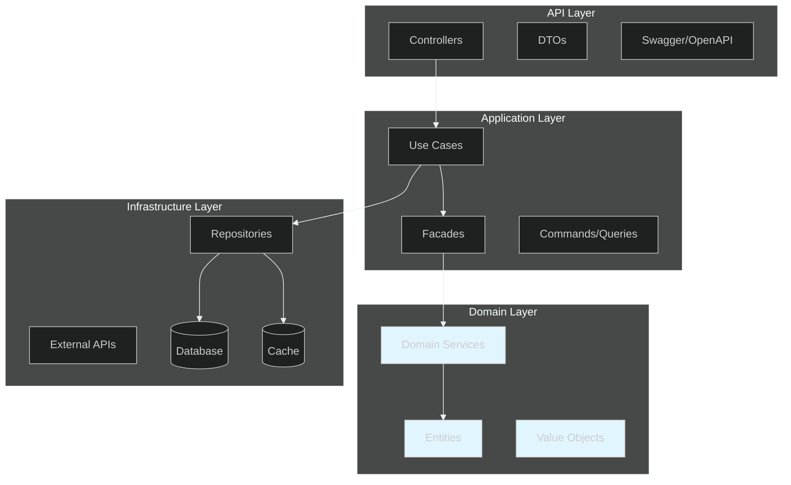
```mermaid
%%{init: {'theme': 'dark', 'themeVariables': { 'primaryColor': '#3498db', 'primaryTextColor': '#fff', 'primaryBorderColor': '#2980b9', 'lineColor': '#ecf0f1', 'secondaryColor': '#2c3e50', 'tertiaryColor': '#34495e', 'fontSize': '16px' }}}%%
graph TB
    subgraph "API Layer"
        CTRL[Controllers]
        DTO[DTOs]
        SWAGGER[Swagger/OpenAPI]
    end

    subgraph "Application Layer"
        UC[Use Cases]
        FAC[Facades]
        CMD[Commands/Queries]
    end

    subgraph "Domain Layer"
        DS[Domain Services]
        ENT[Entities]
        VO[Value Objects]
    end

    subgraph "Infrastructure Layer"
        REPO[Repositories]
        EXT[External APIs]
        DB[(Database)]
        CACHE[(Cache)]
    end

    CTRL --> UC
    UC --> FAC
    FAC --> DS
    DS --> ENT
    UC --> REPO
    REPO --> DB
    REPO --> CACHE

    style ENT fill:#e1f5fe
    style VO fill:#e1f5fe
    style DS fill:#e1f5fe
```

> **Regla de Dependencia**: Las capas internas NO conocen las externas

Note:
Diagrama de flujo entre componentes. Controllers llaman Use Cases, Use Cases usan Facades y Repositories.
Domain Services operan sobre Entities y Value Objects. Infrastructure implementa los puertos.

----

### Estructura de un Módulo

```
libs/ecommerce-inventory/
├── domain/               # 💎 Reglas de negocio puras
│   ├── entities/         # Stock, Warehouse, Reservation
│   ├── value-objects/    # SKU, BranchCode, Quantity
│   ├── events/           # StockReservedEvent, StockUpdatedEvent
│   ├── errors/           # InsufficientStockException
│   └── repositories/     # Interfaces (no implementaciones)
│
├── application/          # ⚙️ Casos de uso
│   ├── facades/          # API pública: InventoryFacade
│   ├── services/         # StockService, ReservationService
│   └── ports/            # Interfaces para adapters externos
│
├── infrastructure/       # 🔧 Implementaciones concretas
│   ├── persistence/
│   │   ├── schemas/      # Mongoose schemas
│   │   ├── repositories/ # MongoStockRepository implements StockRepository
│   │   └── mappers/      # Domain ↔ Persistence mappers
│   └── adapters/         # ErpStockSyncAdapter, etc.
│
├── api/                  # 🎯 Presentación HTTP
│   ├── controllers/      # StockController, WarehouseController
│   └── dto/              # Request/Response DTOs con validación
│
└── config/               # ⚡ Bootstrap del módulo
```

> Las dependencias siempre apuntan **hacia adentro** — Domain no sabe que existe NestJS ni Mongoose

Note:
Cada módulo tiene exactamente esta estructura. Los módulos CRUD-ish pueden omitir la capa de dominio.
La clave es que las dependencias siempre van de afuera hacia adentro.

----

### Flujo Completo — Request a través de las Capas

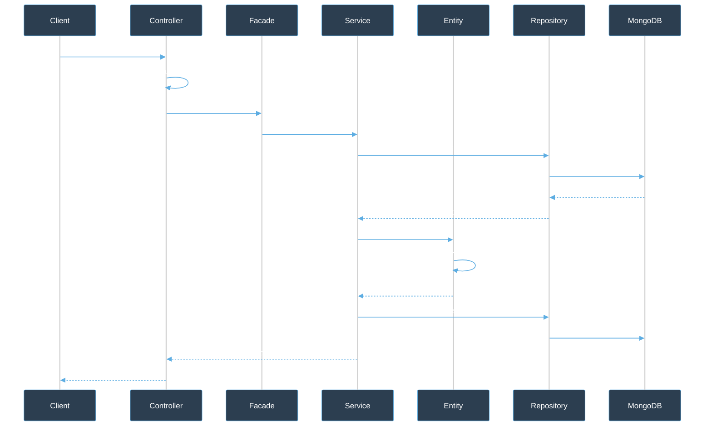
```mermaid
%%{init: {'theme': 'dark', 'themeVariables': {'lineColor': '#5dade2', 'actorTextColor': '#fff', 'signalTextColor': '#fff', 'actorBkg': '#2c3e50', 'actorBorder': '#5dade2', 'signalColor': '#5dade2'}}}%%
sequenceDiagram
    participant Client
    participant Controller as Controller
    participant Facade as Facade
    participant Service as Service
    participant Entity as Entity
    participant Repo as Repository
    participant DB as MongoDB

    Client->>Controller: POST /v1/stock/reserve
    Controller->>Controller: Validar DTO
    Controller->>Facade: reserveStock(dto)
    Facade->>Service: execute(command)
    Service->>Repo: findBySku(sku)
    Repo->>DB: findOne({ sku })
    DB-->>Repo: document
    Repo-->>Service: Stock entity
    Service->>Entity: stock.reserve(qty)
    Entity->>Entity: Validar reglas
    Entity-->>Service: OK / Error
    Service->>Repo: save(stock)
    Repo->>DB: updateOne()
    Service-->>Controller: void
    Controller-->>Client: 200 OK
```

Note:
Sigue las flechas: el request baja por las capas, la respuesta sube.
Nota que Entity valida las reglas - no el Controller ni el Repository.

----

### Donde Vive Cada Logica

<div style="font-size: 0.65em;">

| Logica | Capa | Ejemplo |
|--------|------|---------|
| Validar formato SKU | Domain (Value Object) | `SKU.create("ABC-123")` |
| Validar cantidad > 0 | Domain (Value Object) | `Quantity.create(5)` |
| Verificar stock suficiente | Domain (Entity) | `stock.reserve(qty)` |
| Cargar stock de DB | Infrastructure | `repo.findBySku(sku)` |
| Guardar cambios | Infrastructure | `repo.save(stock)` |
| Validar request HTTP | API (DTO) | `@IsNotEmpty()` |
| Documentar endpoint | API (Swagger) | `@ApiOperation()` |

</div>

Note:
Esta tabla es tu guia cuando no sepas donde poner algo.
Si la logica es de negocio, va en Domain. Si es tecnica, va en Infrastructure.

----

### Error Handling Estandarizado

> Errores estandarizados con DomainError

```typescript
// Definir error custom
export class InsufficientStockError extends DomainError {
  constructor(sku: string, requested: number, available: number) {
    super({
      code: 'INVENTORY.INSUFFICIENT_STOCK',
      message: 'Stock insuficiente para ' + sku,
      category: ErrorCategory.BUSINESS_RULE,
      details: { sku, requested, available },
    });
  }
}

// Usar en el servicio
async reserveStock(sku: string, quantity: number): Promise<void> {
  const stock = await this.repository.findBySku(sku);

  if (stock.available < quantity) {
    throw new InsufficientStockError(sku, quantity, stock.available);
  }

  await this.repository.reserve(sku, quantity);
}
```

Note:
El manejo de errores está estandarizado.
Definimos errores custom que extienden DomainError.
El código de error incluye contexto útil para debugging.

----

### Jerarquia de Errores

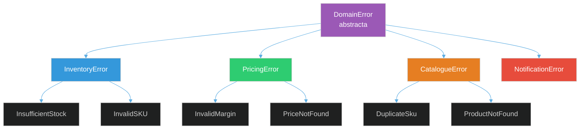
```mermaid
%%{init: {'theme': 'dark', 'themeVariables': {'lineColor': '#5dade2'}}}%%
graph TB
    DE[DomainError<br/>abstracta]

    DE --> IE[InventoryError]
    DE --> PE[PricingError]
    DE --> CE[CatalogueError]
    DE --> NE[NotificationError]

    IE --> ISE[InsufficientStock]
    IE --> ISK[InvalidSKU]
    PE --> IM[InvalidMargin]
    PE --> PNF[PriceNotFound]
    CE --> DS[DuplicateSku]
    CE --> PNF2[ProductNotFound]

    style DE fill:#9b59b6,color:#fff
    style IE fill:#3498db,color:#fff
    style PE fill:#2ecc71,color:#fff
    style CE fill:#e67e22,color:#fff
    style NE fill:#e74c3c,color:#fff
```

Cada modulo tiene sus propios errores tipados que heredan de `DomainError`.

Note:
La jerarquia de errores permite atrapar errores especificos o genericos.
Puedes atrapar InsufficientStock o cualquier InventoryError.

----

### Categorias de Error

<div style="font-size: 0.7em;">

| Categoria | HTTP | Cuando usar |
|-----------|------|-------------|
| `VALIDATION` | 400 | Datos de entrada invalidos |
| `BUSINESS_RULE` | 400 | Regla de negocio violada |
| `NOT_FOUND` | 404 | Recurso no existe |
| `CONFLICT` | 409 | Conflicto con estado actual |
| `EXTERNAL` | 502 | Error en servicio externo |
| `TECHNICAL` | 500 | Error de infraestructura |

</div>

La categoria determina automaticamente el HTTP status.

Note:
Elegir la categoria correcta es importante: BUSINESS_RULE vs VALIDATION.
BUSINESS_RULE es para reglas de negocio, VALIDATION es para datos invalidos.

----

### Respuesta Automatica en HTTP

El `GlobalExceptionFilter` convierte DomainError a respuesta HTTP:

```json
{
  "success": false,
  "error": {
    "code": "INVENTORY.INSUFFICIENT_STOCK",
    "message": "Stock insuficiente para SKU-001",
    "category": "BUSINESS_RULE",
    "timestamp": "2025-01-05T10:30:00Z",
    "details": {
      "sku": "SKU-001",
      "requested": 100,
      "available": 50
    }
  }
}
```

**Beneficios:**
- Codigo unico para manejar programaticamente
- Mensaje claro para mostrar al usuario
- Detalles para debugging

Note:
El GlobalExceptionFilter convierte DomainError a JSON automaticamente.
No tienes que hacer try/catch en cada controller.

----

### Errores: Antes vs Despues

**Antes (generico):**

```json
{
  "statusCode": 400,
  "message": "Bad Request"
}
```

Que fallo exactamente? Como lo arreglo?

**Despues (estructurado):**

```json
{
  "error": {
    "code": "INVENTORY.INSUFFICIENT_STOCK",
    "details": { "sku": "SKU-001", "available": 50 }
  }
}
```

El frontend puede mostrar: "Solo hay 50 unidades disponibles". Logs buscables por codigo de error.

Note:
Este es el valor de errores estructurados: el frontend sabe exactamente que paso.
Puede mostrar un mensaje util al usuario en vez de "Error 400".

---

## 7. Seguridad — Defense in Depth

> 8 capas de seguridad: si una falla, las demás siguen protegiendo

⬇️ _Navega hacia abajo para ver detalles_


Note:
8 capas de seguridad. Si una falla, las demas siguen protegiendo.
Cloud Run provee TLS y proteccion DDoS nativa.
El auth es fail-closed: si Redis cae, se rechazan todos los requests.

----

### Las Capas de Seguridad

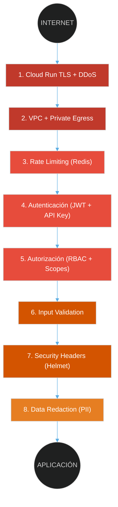
```mermaid
%%{init: {'theme': 'dark', 'themeVariables': {'lineColor': '#5dade2'}}}%%
graph TD
    INT((INTERNET)) --> L1
    L1["1. Cloud Run TLS + DDoS"] --> L2
    L2["2. VPC + Private Egress"] --> L3
    L3["3. Rate Limiting (Redis)"] --> L4
    L4["4. Autenticación (JWT + API Key)"] --> L5
    L5["5. Autorización (RBAC + Scopes)"] --> L6
    L6["6. Input Validation"] --> L7
    L7["7. Security Headers (Helmet)"] --> L8
    L8["8. Data Redaction (PII)"] --> APP

    APP((APLICACIÓN))

    style L1 fill:#c0392b,color:#fff
    style L2 fill:#c0392b,color:#fff
    style L3 fill:#e74c3c,color:#fff
    style L4 fill:#e74c3c,color:#fff
    style L5 fill:#e74c3c,color:#fff
    style L6 fill:#d35400,color:#fff
    style L7 fill:#d35400,color:#fff
    style L8 fill:#e67e22,color:#fff
```

Note:
Defense in Depth — cada capa protege contra amenazas específicas.
Cloud Run provee TLS y protección DDoS nativa. La VPC aísla los recursos internos.
Si una capa falla, las demás siguen protegiendo.

----

### Autenticación Unificada

<div style="font-size: 0.65em;">

```typescript
// UnifiedAuthGuard — Global APP_GUARD, evaluado en CADA request
// 1. @Public → Best-effort (no falla si no hay token)
// 2. X-API-Key → Valida SHA-256 en Redis → ClientContext { scopes }
// 3. Bearer JWT → Valida firma + blacklist (fail-closed) → ClientContext { roles }
// 4. Ambos headers → 400 Bad Request (ambigüedad)
// 5. Ninguno → 401 Unauthorized
```

</div>

<div style="font-size: 0.6em;">

| Tipo | Header | Método | Uso |
|------|--------|--------|-----|
| **Humanos** | `Authorization: Bearer` | JWT firmado | Frontend, Admin, Caja |
| **Máquinas** | `X-API-Key: vtx_live_...` | API Key SHA-256 | ERP, VTEX, Partners |

</div>

Note:
UnifiedAuthGuard evalua CADA request. JWT para humanos, API Key para maquinas.
Si llegan ambos headers: 400 Bad Request (ambiguedad).
Blacklist en Redis es fail-closed: si Redis cae, se rechazan todos.

----

### Rate Limiting Multi-Nivel

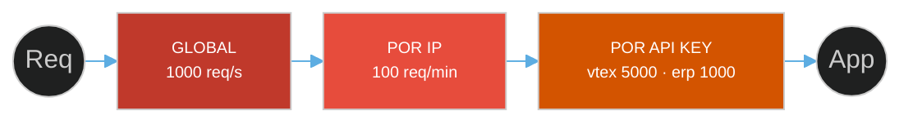
```mermaid
%%{init: {'theme': 'dark', 'themeVariables': {'lineColor': '#5dade2'}, 'flowchart': {'nodeSpacing': 5, 'rankSpacing': 20}}}%%
flowchart LR
    R((Req)) --> G["GLOBAL<br/>1000 req/s"]
    G --> IP["POR IP<br/>100 req/min"]
    IP --> AK["POR API KEY<br/>vtex 5000 · erp 1000"]
    AK --> APP((App))

    style G fill:#c0392b,color:#fff,font-size:10px
    style IP fill:#e74c3c,color:#fff,font-size:10px
    style AK fill:#d35400,color:#fff,font-size:10px
```

> **Storage**: Redis distribuido — consistente en todas las instancias

Note:
3 niveles: Global (1000 req/s), por IP (100 req/min), por API Key (configurable).
Storage en Redis distribuido, consistente en todas las instancias.

----

### Secret Manager

| Ventaja | Descripción |
|---------|-------------|
| **No API keys en código** | El código no contiene credenciales |
| **Workload Identity** | Cloud Run usa su service account |
| **Audit logs** | Cada acceso queda registrado |
| **Versionado** | Rollback fácil si algo falla |
| **33 secrets** | Credenciales, tokens, API keys |

> *Costo: ~$5/mes para 50 secrets con 1M accesos*

Note:
Zero secrets en el repositorio. Cloud Run accede via Workload Identity, sin JSON keys.
Cada secret tiene versionado automatico — rollback es cambiar 1 revision.

---

## 8. Developer Workflow

> Del código al merge: convenciones, branches, PRs y code review

⬇️ _Navega hacia abajo para ver detalles_


Note:
Ciclo de desarrollo estandarizado. Conventional commits, Git Flow, CI con Nx affected.
Quality gates en paralelo. Deploy multi-pais. CI tarda 3-5 minutos.

----

### Ciclo de Desarrollo

```text
CODE → BRANCH → COMMIT → PUSH → PR → REVIEW → MERGE
```

| Paso | Herramienta | Regla |
|------|-------------|-------|
| Code | VS Code | Format on save |
| Branch | Git | Desde `develop`: feature/#taskId |
| Commit | Git | Conventional commits |
| Push | Git | A tu branch, nunca a main |
| PR | GitHub | Template obligatorio |
| Review | GitHub | CODEOWNERS approval |
| Merge | GitHub | Squash merge |

Note:
Este ciclo se repite cientos de veces al dia en el equipo.
Format on save con Prettier, conventional commits obligatorios, squash merge.

----

### Conventional Commits — Tipos

<div style="font-size: 0.75em;">

| Tipo | Cuando usar | Version |
|------|-------------|---------|
| `feat` | Nueva funcionalidad | Minor ↑ |
| `fix` | Corregir un bug | Patch ↑ |
| `docs` | Solo documentacion | - |
| `refactor` | Cambiar sin agregar feature | - |
| `test` | Agregar o modificar tests | - |
| `chore` | Tareas de mantenimiento | - |
| `perf` | Mejoras de rendimiento | Patch ↑ |

</div>

```bash
# Formato: <type>(<scope>): <descripción en español>
feat(inventory): agregar endpoint de importación masiva
fix(pricing): corregir precisión decimal en cálculo de impuestos
```

> Changelog generado automáticamente por **Google release-please**

Note:
type y scope en inglés, descripción en español. release-please genera changelogs automáticos.
feat y fix afectan el versionado automatico (SemVer). Scope indica el modulo afectado.

----

### Branch Naming & Git Flow

```bash
# Convención: <type>/<descripcion-corta>
feature/agregar-importacion-masiva
fix/corregir-decimal-pricing
refactor/extraer-validacion-shared
```

<div style="display: flex; justify-content: center; transform: scale(1.1); margin: 20px 0;">

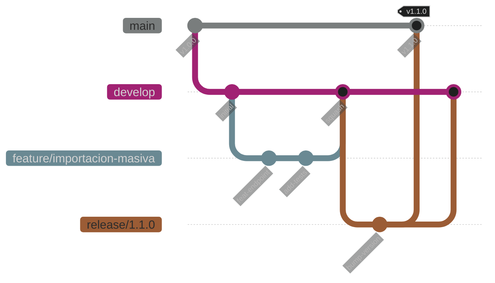
```mermaid
%%{init: {'theme': 'dark', 'gitGraph': {'mainBranchName': 'main'}}}%%
gitGraph
   commit id: "v1.0.0"
   branch develop
   commit id: "initial"
   branch feature/importacion-masiva
   commit id: "feat-endpoint"
   commit id: "add-tests"
   checkout develop
   merge feature/importacion-masiva id: "squash"
   branch release/1.1.0
   commit id: "bump-version"
   checkout main
   merge release/1.1.0 id: "v1.1.0" tag: "v1.1.0"
   checkout develop
   merge release/1.1.0
```

</div>

Note:
Git Flow: features van a develop, releases a main. Squash merge para historial limpio.
Branches con nombres descriptivos en español. release-please genera tags y changelog automatico.

----

### Breaking Changes

Si tu cambio rompe compatibilidad:

```bash
# Opcion 1: Agregar "!"
feat!: remove deprecated v1 API endpoints

# Opcion 2: En el body
feat(auth): change token format

BREAKING CHANGE: tokens now use JWT instead of opaque.
```

**Breaking change = version mayor (1.0 → 2.0)**

Note:
Los breaking changes son serios — rompen compatibilidad para otros.
Antes de agregar un "!" SIEMPRE consulta con el equipo.

----

### AI-Assisted Commits

GitLens y GitHub Copilot estan configurados para generar commits en español:

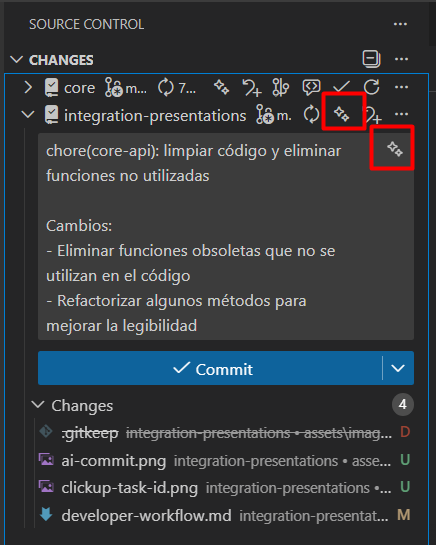

**Ya configurado** en `.vscode/settings.json` - solo usa el boton ✨

Note:
La AI genera un borrador - SIEMPRE revisalo antes de aceptar.
A veces el scope esta mal o el mensaje es demasiado generico.

----

### Vincular PR con ClickUp

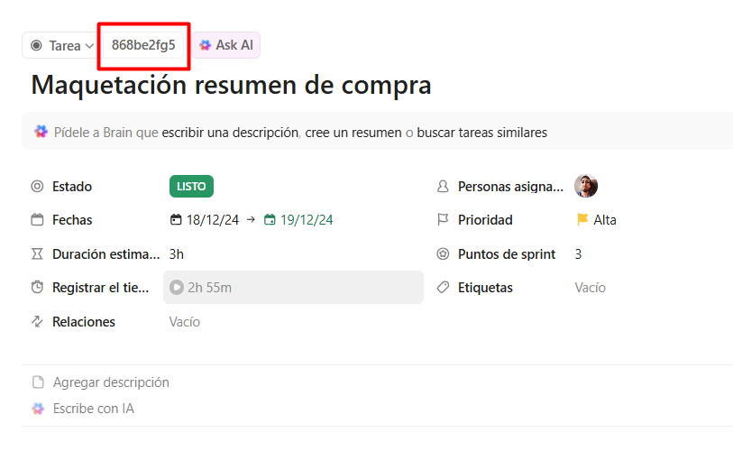

**Tip**: Agrega `#taskId` en el body del PR para vincular automáticamente con ClickUp

Note:
El task ID esta en la URL del task o con el boton "Copy ID".
Al incluir #taskId en el PR, ClickUp lo vincula automaticamente.

----

### Mantener tu Branch Actualizada

```bash
# Opcion 1: Rebase (preferido)
git fetch origin
git rebase origin/develop

# Opcion 2: Merge
git fetch origin
git merge origin/develop

# Despues de resolver conflictos
git push --force-with-lease
```

Note:
Rebase mantiene el historial mas limpio. force-with-lease es mas seguro que force.

----

### Crear un PR

```bash
# Desde terminal
gh pr create --title "feat(inventory): agregar importación masiva"

# O desde GitHub UI
# 1. Push tu branch
# 2. Click "Compare & pull request"
# 3. Llenar template
```

Note:
gh CLI es mas rapido que la UI web para crear PRs.
Pero si prefieres usar la UI web o VS Code, esta perfectamente bien.

----

### Crear PR desde VS Code

La extension **GitHub Pull Requests** permite crear PRs sin salir del editor:

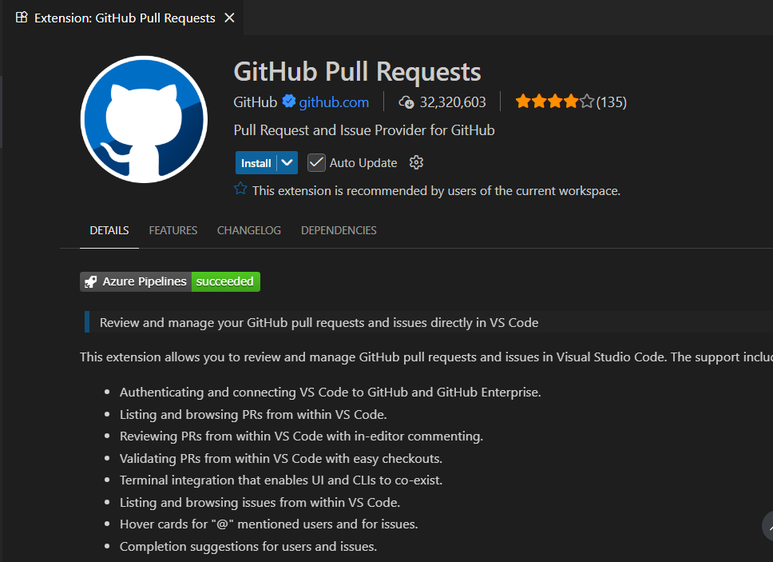

Note:
Esta es la forma mas comoda de crear PRs sin salir de VS Code.
La extension ya esta en las recomendadas del workspace - solo instalala.

----

### Crear PR — Formulario

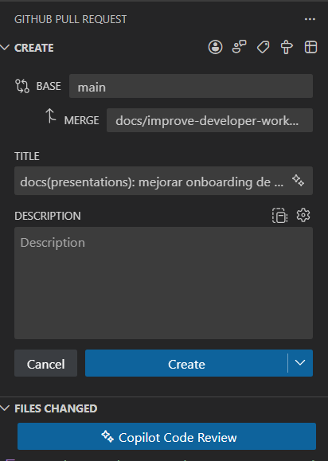

**Tip**: El titulo debe seguir conventional commits: `type(scope): descripcion`

Note:
El titulo es IMPORTANTE porque al hacer squash merge, se convierte en el commit final en main.

----

### Template de PR

```markdown
## Descripcion
Breve descripcion del cambio.

## Tipo de cambio
- [ ] Bug fix
- [ ] Nueva feature
- [ ] Refactor

## ClickUp Task
#868h4tr17

## Checklist
- [ ] Tests agregados/actualizados
- [ ] Lint pasa sin errores
```

**Importante**: El `#taskID` en el PR linkea automaticamente con ClickUp

Note:
El # antes del task ID hace que ClickUp vincule el PR automaticamente.

----

### PR Aprobado — Listo para Merge

Cuando tu PR tiene todas las aprobaciones y checks verdes:

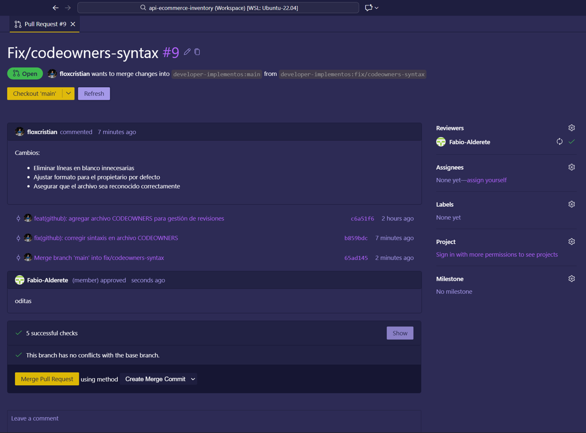

**El boton "Squash and merge"** combina todos tus commits en uno solo con un mensaje limpio.

Note:
Squash merge junta todos tus commits en uno - asi el historial de main queda limpio.
Status checks obligatorios: lint, test, build, sonar, review CODEOWNERS.

----

### Code Review — Etiquetas

| Etiqueta | Significado | Bloquea? |
|----------|-------------|----------|
| `blocking:` | Debe corregirse | ✅ Si |
| `suggestion:` | Mejora opcional | ❌ No |
| `question:` | Necesito entender | ⚠️ Depende |
| `nit:` | Nitpicking menor | ❌ No |
| `praise:` | Buen trabajo! | ❌ No |

```markdown
blocking: Este query puede causar N+1, usar eager loading
suggestion: Podrias extraer esto a un helper
praise: Excelente manejo del edge case!
```

Note:
Usa las etiquetas para que el autor sepa si es bloqueante o no.
No olvides el "praise:" - reconocer buen trabajo motiva al equipo.

----

### CODEOWNERS

```bash
# .github/CODEOWNERS

*                          @integration-developers  # Default: todo el repo
/.github/workflows/        @integration-developers  # CI/CD crítico
/.github/actions/          @integration-developers  # Custom actions
/commitlint.config.js      @integration-developers  # Linters
/docs/                     @integration-developers  # RFCs y arquitectura
/release-please-config.json @integration-developers # Versionado
```

Tu PR necesita approval del CODEOWNER del codigo que modificaste.

Note:
Un solo team owner para todo el repo. A medida que el equipo crezca, se pueden agregar owners por modulo.
CODEOWNERS protege que ningun PR se mergee sin al menos un approval del equipo.

---

## 9. CI/CD & Validación

> Pre-commit hooks rápidos + CI completo + deploy multi-país automatizado

⬇️ _Navega hacia abajo para ver detalles_


Note:
Enfoque hibrido: pre-commit hooks rapidos (lint-staged ~2s) + CI completo (~3min).
Pipeline con Nx affected, security scanning y deploy multi-pais en paralelo.

----

### Flujo de Validación — Enfoque Híbrido

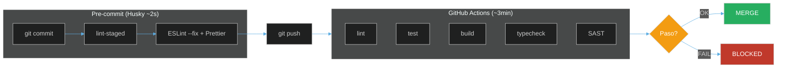
```mermaid
%%{init: {'theme': 'dark', 'themeVariables': {'lineColor': '#5dade2'}}}%%
flowchart LR
    subgraph LOCAL["Pre-commit (Husky ~2s)"]
        A["git commit"] --> B["lint-staged"]
        B --> C["ESLint --fix + Prettier"]
    end

    C --> D["git push"]

    subgraph CI["GitHub Actions (~3min)"]
        E["lint"] & F["test"] & G["build"] & H["typecheck"] & I["SAST"]
    end

    D --> CI
    CI --> J{"Paso?"}
    J -->|"OK"| K["MERGE"]
    J -->|"FAIL"| L["BLOCKED"]

    style K fill:#27ae60,color:#fff
    style L fill:#c0392b,color:#fff
    style J fill:#f39c12,color:#fff
```

**Pre-commit**: lint + format (rápido, solo staged files) · **CI**: tests, build, security (pesado)

Note:
Enfoque hibrido: pre-commit hooks rapidos (lint-staged ~2s) + CI completo (~3min).
Pre-commit solo ejecuta ESLint fix y Prettier en archivos staged — no corre tests.
CI ejecuta todo: lint, test, build, typecheck, SAST. Si falla, el merge queda bloqueado.

----

### VS Code te Ayuda

```json
// .vscode/settings.json (ya configurado)
{
  "editor.formatOnSave": true,
  "editor.defaultFormatter": "esbenp.prettier-vscode",
  "editor.codeActionsOnSave": {
    "source.fixAll.eslint": true
  }
}
```

Al guardar: Prettier formatea + ESLint corrige = menos errores en CI

Note:
Format on save es tu mejor amigo - el codigo se formatea automaticamente.

----

### Reglas de ESLint Importantes

> Errores que CI atrapa automaticamente

```typescript
// ❌ @typescript-eslint/no-floating-promises
async function bad() {
  fetchData();  // Promise no awaited - BUG!
}

// ✅ Correcto
async function good() {
  await fetchData();
}

// ❌ forEach con async — promises se pierden
arr.forEach(async (n) => await process(n)); // BUG!

// ✅ Correcto
await Promise.all(arr.map((n) => process(n)));
```

Note:
Estas son las reglas mas importantes que atrapan bugs reales.
Si ven errores de floating promises, SIEMPRE agregar await.
forEach con async es un error MUY comun - usa Promise.all en su lugar.

----

### Pipeline Completo

<div style="text-align: center;">
<svg width="780" height="420" viewBox="0 0 780 420" xmlns="http://www.w3.org/2000/svg">

  <!-- Stage 1: Detect -->
  <rect x="300" y="10" width="180" height="45" rx="8" fill="#3498db"/>
  <text x="390" y="30" text-anchor="middle" fill="white" font-size="11" font-weight="bold">1. Detect Changes</text>
  <text x="390" y="44" text-anchor="middle" fill="#d5e8f7" font-size="8">Nx affected (solo lo que cambió)</text>

  <line x1="390" y1="55" x2="390" y2="75" stroke="#7f8c8d" stroke-width="2" marker-end="url(#arrowG)"/>

  <!-- Stage 2: Quality Gates (parallel) -->
  <rect x="10" y="75" width="760" height="55" rx="8" fill="none" stroke="#2ecc71" stroke-width="1" stroke-dasharray="4"/>
  <text x="30" y="93" fill="#2ecc71" font-size="10" font-weight="bold">2. Quality Gates (paralelo)</text>

  <rect x="40" y="98" width="130" height="25" rx="4" fill="#27ae60"/>
  <text x="105" y="115" text-anchor="middle" fill="white" font-size="9">Lint (ESLint)</text>

  <rect x="190" y="98" width="130" height="25" rx="4" fill="#27ae60"/>
  <text x="255" y="115" text-anchor="middle" fill="white" font-size="9">Tests (Vitest)</text>

  <rect x="340" y="98" width="130" height="25" rx="4" fill="#27ae60"/>
  <text x="405" y="115" text-anchor="middle" fill="white" font-size="9">Typecheck (tsc)</text>

  <rect x="490" y="98" width="130" height="25" rx="4" fill="#27ae60"/>
  <text x="555" y="115" text-anchor="middle" fill="white" font-size="9">Format (Prettier)</text>

  <rect x="640" y="98" width="120" height="25" rx="4" fill="#27ae60"/>
  <text x="700" y="115" text-anchor="middle" fill="white" font-size="9">SAST (Semgrep)</text>

  <line x1="390" y1="130" x2="390" y2="150" stroke="#7f8c8d" stroke-width="2" marker-end="url(#arrowG)"/>

  <!-- Stage 3: Build -->
  <rect x="230" y="150" width="320" height="45" rx="8" fill="#9b59b6"/>
  <text x="390" y="170" text-anchor="middle" fill="white" font-size="11" font-weight="bold">3. Build Docker Image</text>
  <text x="390" y="184" text-anchor="middle" fill="#e8d5f5" font-size="8">Multi-stage + Push to Artifact Registry</text>

  <line x1="390" y1="195" x2="390" y2="215" stroke="#7f8c8d" stroke-width="2" marker-end="url(#arrowG)"/>

  <!-- Stage 4: Security -->
  <rect x="230" y="215" width="320" height="45" rx="8" fill="#e74c3c"/>
  <text x="390" y="235" text-anchor="middle" fill="white" font-size="11" font-weight="bold">4. Security Scan</text>
  <text x="390" y="249" text-anchor="middle" fill="#fadbd8" font-size="8">Trivy (CVE) + Supply Chain (SHA pinning)</text>

  <line x1="390" y1="260" x2="390" y2="280" stroke="#7f8c8d" stroke-width="2" marker-end="url(#arrowG)"/>

  <!-- Stage 5: Deploy -->
  <rect x="10" y="280" width="760" height="65" rx="8" fill="none" stroke="#f1c40f" stroke-width="2"/>
  <text x="30" y="298" fill="#f1c40f" font-size="10" font-weight="bold">5. Deploy Multi-País (matrix paralelo)</text>

  <rect x="100" y="308" width="180" height="30" rx="5" fill="#d35400"/>
  <text x="190" y="327" text-anchor="middle" fill="white" font-size="10">Chile (CL)</text>

  <rect x="300" y="308" width="180" height="30" rx="5" fill="#d35400"/>
  <text x="390" y="327" text-anchor="middle" fill="white" font-size="10">Peru (PE)</text>

  <rect x="500" y="308" width="180" height="30" rx="5" fill="#d35400"/>
  <text x="590" y="327" text-anchor="middle" fill="white" font-size="10">España (ES)</text>

  <line x1="390" y1="345" x2="390" y2="365" stroke="#7f8c8d" stroke-width="2" marker-end="url(#arrowG)"/>

  <!-- Stage 6: Smoke Tests -->
  <rect x="230" y="365" width="320" height="45" rx="8" fill="#1abc9c"/>
  <text x="390" y="385" text-anchor="middle" fill="white" font-size="11" font-weight="bold">6. Smoke Tests + Notification</text>
  <text x="390" y="399" text-anchor="middle" fill="#d1f2eb" font-size="8">/health, /docs, response-time SLA → Teams</text>

  <defs>
    <marker id="arrowG" markerWidth="8" markerHeight="8" refX="7" refY="3" orient="auto">
      <path d="M0,0 L0,6 L8,3 z" fill="#7f8c8d"/>
    </marker>
  </defs>
</svg>
</div>

Note:
El pipeline usa Nx affected para solo ejecutar lo que cambió. Los quality gates corren en paralelo.
Después de build y security scan, se deploya en paralelo a todos los países.
Los smoke tests verifican que el deploy fue exitoso antes de enviar notificación.

----

### Canary Deployment

```mermaid
%%{init: {'theme': 'dark', 'themeVariables': {'lineColor': '#5dade2'}}}%%
graph LR
    A1["1. v12: 100%"] --> A2["1. v13: 0%"]
    A2 --> B1["2. Smoke tests"]
    B1 --> B2["2. QA manual"]
    B2 --> C1["3. v12: 50%"]
    C1 --> C2["3. v13: 50%"]
    C2 --> D1["4. v13: 100%"]

    style A1 fill:#27ae60,color:#fff
    style A2 fill:#95a5a6,color:#fff
    style B1 fill:#3498db,color:#fff
    style B2 fill:#3498db,color:#fff
    style C1 fill:#f39c12,color:#fff
    style C2 fill:#f39c12,color:#fff
    style D1 fill:#27ae60,color:#fff
```


Note:
4 pasos: deploy con 0% trafico, validacion, split 50/50, full rollout.
La nueva revision se despliega pero no recibe trafico hasta validar.
Si falla, rollback automatico.

---

## 10. Resiliencia & Observabilidad

> A medida que escalamos, los fallos son inevitables — lo importante es detectarlos y sobrevivir

⬇️ _Navega hacia abajo para ver detalles_


Note:
Circuit Breaker evita cascada cuando un servicio externo cae.
Cache Stampede evita que 1000 requests golpeen la DB cuando el cache expira.
Grafana Cloud es nuestra plataforma de observabilidad - logs, metricas y traces.

----

### Patrones de Resiliencia

<div style="font-size: 0.55em;">

| Patrón | Implementación | Qué Protege |
|--------|---------------|-------------|
| **Circuit Breaker** | Cockatiel | Cascada de fallos a externos |
| **Retry + Backoff** | Exponential 5→10→20→30s | Fallos transitorios |
| **Timeout** | 60s por request (prod) | Requests colgados |
| **Bulkhead** | Concurrency limit | Aísla fallos entre módulos |
| **Cache Stampede** | Singleflight + Probabilistic | Thundering herd en cache miss |
| **Dead Letter Queue** | Pub/Sub DLQ | Mensajes fallidos no se pierden |
| **Transactional Outbox** | DB + Event atómico | Consistencia evento + persistencia |
| **Graceful Degradation** | Conditional module loading | Si DB falla, otros módulos siguen |

</div>

Note:
Cada patrón protege contra un tipo específico de fallo.
El Circuit Breaker evita que una API externa caída derribe todo el sistema.
El Cache Stampede protege contra N requests simultáneos a un mismo recurso.

----

### Circuit Breaker — Estados

```mermaid
%%{init: {'theme': 'dark', 'themeVariables': {'lineColor': '#5dade2'}}}%%
stateDiagram-v2
    [*] --> CLOSED
    CLOSED --> OPEN: 5 errores consecutivos
    OPEN --> HALF_OPEN: después de 30s
    HALF_OPEN --> CLOSED: request de prueba OK
    HALF_OPEN --> OPEN: request de prueba falla

    CLOSED: Requests pasan normalmente
    OPEN: Requests rechazados (fail-fast)
    HALF_OPEN: Permite 1 request de prueba
```

Note:
3 estados: Closed (normal), Open (fail-fast), Half-Open (probando).
5 errores consecutivos lo abren. Despues de 30s deja pasar 1 request de prueba.

----

### Circuit Breaker — Implementación

```typescript
const circuitBreaker = new CircuitBreakerPolicy({
  halfOpenAfter: 30_000,      // 30s antes de probar de nuevo
  breaker: new ConsecutiveBreaker(5),  // 5 errores → OPEN
});

// Uso: wrappea la llamada al servicio externo
const result = await circuitBreaker.execute(() =>
  this.httpService.get('https://erp.example.com/stock')
);
```

> Librería: **Cockatiel** — lightweight, TypeScript nativo

Note:
Usamos Cockatiel, libreria TypeScript nativa y lightweight.
Cada integracion externa tiene su propio circuit breaker independiente.

----

### Observabilidad: Los 3 Pilares

<div style="text-align: center;">
<svg width="750" height="220" viewBox="0 0 750 220" xmlns="http://www.w3.org/2000/svg">
  <!-- Logging -->
  <rect x="20" y="20" width="220" height="180" rx="10" fill="#1a252f" stroke="#3498db" stroke-width="2"/>
  <text x="130" y="50" text-anchor="middle" fill="#3498db" font-size="14" font-weight="bold">Logging</text>
  <text x="130" y="75" text-anchor="middle" fill="#bdc3c7" font-size="10">Pino (structured JSON)</text>
  <text x="130" y="100" text-anchor="middle" fill="#7f8c8d" font-size="9">Correlation ID por request</text>
  <text x="130" y="120" text-anchor="middle" fill="#7f8c8d" font-size="9">Data Redaction automática</text>
  <text x="130" y="140" text-anchor="middle" fill="#7f8c8d" font-size="9">Niveles: log, warn, error</text>
  <text x="130" y="165" text-anchor="middle" fill="#3498db" font-size="9">→ Cloud Logging</text>
  <text x="130" y="185" text-anchor="middle" fill="#3498db" font-size="9">→ Sentry (errors)</text>

  <!-- Metrics -->
  <rect x="265" y="20" width="220" height="180" rx="10" fill="#1a252f" stroke="#2ecc71" stroke-width="2"/>
  <text x="375" y="50" text-anchor="middle" fill="#2ecc71" font-size="14" font-weight="bold">Metrics</text>
  <text x="375" y="75" text-anchor="middle" fill="#bdc3c7" font-size="10">OpenTelemetry SDK</text>
  <text x="375" y="100" text-anchor="middle" fill="#7f8c8d" font-size="9">HTTP request duration</text>
  <text x="375" y="120" text-anchor="middle" fill="#7f8c8d" font-size="9">Error rates por módulo</text>
  <text x="375" y="140" text-anchor="middle" fill="#7f8c8d" font-size="9">Cache hit/miss ratios</text>
  <text x="375" y="165" text-anchor="middle" fill="#FF6F00" font-size="9">→ Grafana Cloud (OTLP)</text>
  <text x="375" y="185" text-anchor="middle" fill="#FF6F00" font-size="9">→ Grafana dashboards</text>

  <!-- Traces -->
  <rect x="510" y="20" width="220" height="180" rx="10" fill="#1a252f" stroke="#e67e22" stroke-width="2"/>
  <text x="620" y="50" text-anchor="middle" fill="#e67e22" font-size="14" font-weight="bold">Traces</text>
  <text x="620" y="75" text-anchor="middle" fill="#bdc3c7" font-size="10">OpenTelemetry → Grafana Tempo</text>
  <text x="620" y="100" text-anchor="middle" fill="#7f8c8d" font-size="9">Distributed tracing</text>
  <text x="620" y="120" text-anchor="middle" fill="#7f8c8d" font-size="9">Span por operación</text>
  <text x="620" y="140" text-anchor="middle" fill="#7f8c8d" font-size="9">Latency breakdown</text>
  <text x="620" y="165" text-anchor="middle" fill="#FF6F00" font-size="9">→ Grafana Cloud</text>
  <text x="620" y="185" text-anchor="middle" fill="#e67e22" font-size="9">→ Error Budget (SLOs)</text>

</svg>
</div>

**SRE Practices**: Error budgets, SLOs (99.9% uptime), alertas basadas en burn rate


Note:
Logging: Pino JSON estructurado + correlation ID. Va a Cloud Logging y Sentry.
Metricas: OpenTelemetry exporta a Grafana Cloud via OTLP.
Traces: distributed tracing en Grafana Tempo.
Nunca console.log, siempre this.logger.

---

## 11. Resumen Ejecutivo

> Vista consolidada de toda la plataforma

⬇️ _Navega hacia abajo para ver detalles_


Note:
Resumen ejecutivo en 2 slides: plataforma e infraestructura.

----

### Resumen — Plataforma

<div style="font-size: 0.6em;">

| Dimensión | Implementación |
|-----------|---------------|
| **Patrón** | Monolito Modular (extractable a microservicios) |
| **Stack** | NestJS 11 + Fastify + TypeScript strict |
| **Multi-País** | Adapter Pattern + GCP aislado por país |
| **Integraciones** | VTEX Seller, Salesforce MC, Webpay, Niubiz, MercadoPago, Khipu |
| **Workers** | 5 Cloud Run: notif, retry, sync, report, pickup-reminder |
| **Seguridad** | 8 capas (TLS → Auth → RBAC → Validation → Redaction) |
| **Auth** | JWT (humanos) + API Key (M2M) |

</div>

Note:
Primera parte del resumen ejecutivo — arquitectura y negocio.
Monolito modular con boundaries estrictos. Multi-pais con adapter pattern.

----

### Resumen — Infraestructura

<div style="font-size: 0.6em;">

| Dimensión | Implementación |
|-----------|---------------|
| **Deploy** | GCP Cloud Run, auto-scaling, zero-ops |
| **CI/CD** | GitHub Actions + Nx affected + matrix multi-país |
| **Resiliencia** | Circuit Breaker, Retry, Timeout, DLQ, Outbox |
| **Observabilidad** | Pino + OpenTelemetry + Grafana Cloud + Sentry |
| **IaC** | Terraform 5-phase bootstrap |
| **Containers** | Distroless, non-root, Trivy scanning |
| **Decisiones** | 50+ ADRs + 20+ RFCs documentados |

</div>

> **Filosofía**: Enterprise-grade con pragmatismo — complejidad proporcional al problema

Note:
Segunda parte — infraestructura y operaciones.
Todo GCP managed, zero-ops, Terraform IaC. 50+ ADRs documentan cada decision.

----

### Documentación Interna

- 📁 `docs/architecture/rfcs/` — Request for Comments (35)
- 📁 `docs/architecture/adrs/` — Architecture Decision Records (67)
- 📁 `docs/guides/` — Guías de desarrollo
- 📁 `docs/operations/` — Runbooks operacionales

Note:
Los RFCs explican propuestas y el "por que" de decisiones.
Los ADRs documentan decisiones tomadas y sus trade-offs.
No necesitas leerlos todos - consultalos cuando trabajes en un area especifica.

---

<!-- .slide: data-background="#1a1a2e" -->

# Preguntas

<br>

<div style="font-size: 0.8em; color: #7f8c8d;">

**Documentación técnica**: `docs/architecture/`

**ADRs**: `docs/architecture/adrs/`

**RFCs**: `docs/architecture/rfcs/`

</div>


Note:
Preguntas frecuentes de asesores:
- Por que no microservicios? Equipo pequeno, costo operacional, Shopify/GitHub usan monolito.
- Como escalan? Cloud Run auto-scaling, 1-10 instancias.
- Vendor lock-in? Dominio es framework-agnostic. Infra es IaC con Terraform.
- Testing? Vitest unit + Playwright e2e, 300+ tests, CI en 3-5 min.
