<style>
  :root { --r-background-color: #F5F0E8 !important; }
  .reveal { background: #F5F0E8 !important; color: #1a1a2e !important; }
  .reveal h1, .reveal h2, .reveal h3 { color: #1a1a2e !important; font-family: 'Virgil', 'Segoe UI', sans-serif !important; }
  .reveal p, .reveal li, .reveal td, .reveal th { color: #333 !important; }
  .reveal blockquote { background: rgba(0,0,0,0.05) !important; color: #555 !important; border-left-color: #E74C3C !important; }
  .reveal a { color: #3498DB !important; }
  .reveal code { background: rgba(0,0,0,0.08) !important; color: #1a1a2e !important; }
  .reveal pre { background: #2c3e50 !important; }
  .reveal pre code { color: #ecf0f1 !important; background: transparent !important; }
  .reveal table th { color: #1a1a2e !important; border-bottom-color: #ccc !important; }
  .reveal table td { border-bottom-color: #ddd !important; }
  .reveal .slide-number { color: #888 !important; }
  section[data-background] h2, section[data-background] h3 { color: #fff !important; }
</style>

# Integration Platform

### Arquitectura Enterprise Multi-País

<br>

<div style="font-size: 0.6em; color: #7f8c8d;">
Implementos
</div>

Note:
Bienvenidos. Platform multi-pais, 9 secciones + resumen ejecutivo. S para speaker notes.

---

## 📋 Agenda

<div style="font-size: 0.55em;">

| # | Sección | Foco |
|---|---------|------|
| 1 | **Visión de Negocio** | Problema, solución, arquitectura MACH |
| 2 | **La Plataforma** | Aplicaciones, monorepo, vista C4 |
| 3 | **ACL & Multi-ERP** ⭐ | Adaptadores por país, migración cloud, código |
| 4 | **Infraestructura GCP** | Organización, deployment, Cloud Run, workers |
| 5 | **Patrones Técnicos** | Módulos, facades, integraciones externas |
| 6 | **Clean Architecture** | 5 capas, estructura módulos, error handling |
| 7 | **Seguridad** | Defense in Depth, auth unificada, rate limiting |
| 8 | **Developer Workflow** | Commits, branches, PRs, code review |
| 9 | **CI/CD & Validación** | Pre-commit, pipeline, canary deploy |
| 10 | **Resiliencia & Observabilidad** | Circuit breaker, Grafana, SRE practices |
| 11 | **Resumen Ejecutivo** | Vista consolidada, documentación interna |

</div>

Note:
11 secciones, ~75 min. Seccion 3 (ACL) es la clave para los asesores.

---

## 1. Visión de Negocio

> Operaciones en 3 países con sistemas distintos — necesitamos una plataforma composable, escalable y segura

⬇️ _Navega hacia abajo para ver detalles_

Note:
3 paises, sistemas distintos. Plataforma composable.

----

### El Problema

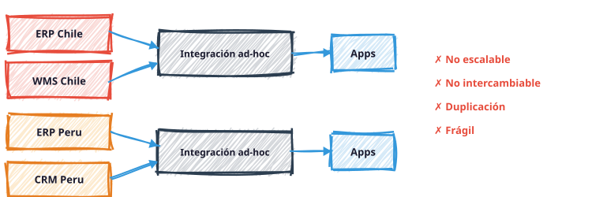

Note:
3 paises, sistemas distintos, integraciones ad-hoc. Fragil, costoso, no escalable.
La solucion: plataforma composable que permita poner y sacar piezas de software.

----

### Capacidades de Negocio

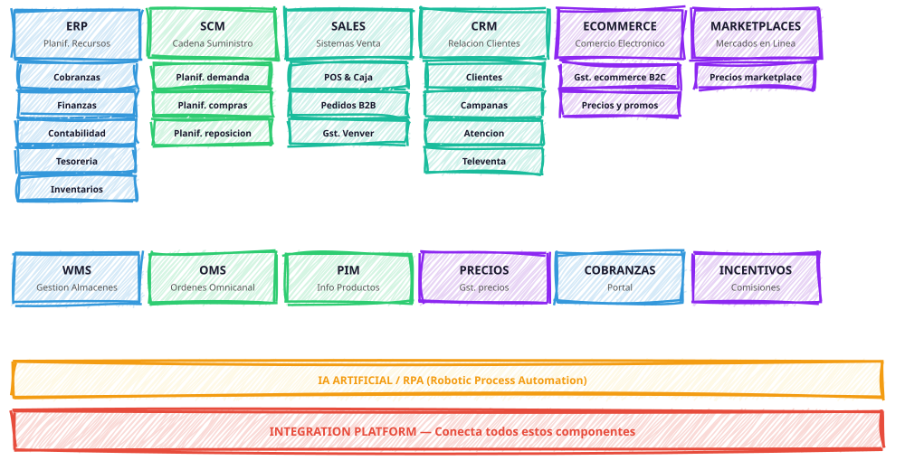

Note:
40+ subsistemas. La barra roja los conecta.

----

### La Solución

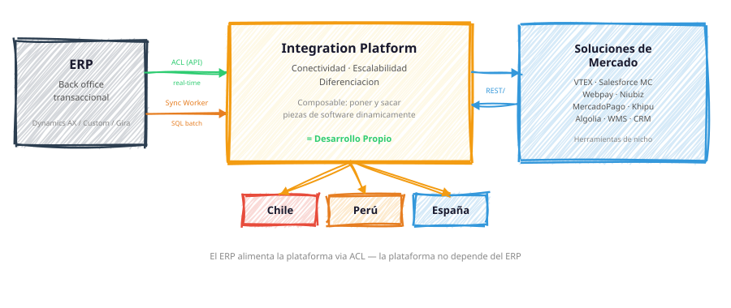

Note:
Dos canales independientes: ACL (API real-time, on-premise) y Sync Worker (SQL batch, Cloud Run Job).
ACL expone API REST del ERP. Sync Worker conecta directo al SQL para sincronizacion batch.
Soluciones de mercado se integran bidireccionalmente via REST/Webhooks.

----

### Pilares Estratégicos

<div style="font-size: 0.75em;">

| Pilar | Objetivo |
|-------|----------|
| **Modularidad & Integración** | Sistemas modulares comunes para una propuesta de valor coherente (ERP, WMS, CRM) |
| **Nube & Resiliencia** | Disponibilidad y escalabilidad para asegurar estabilidad y crecimiento |
| **Datos & Decisión** | Información única para decisiones ágiles. Integridad de clientes, operaciones, inventario |
| **Seguridad Integral** | Protección proactiva y monitoreo continuo |

</div>

> **Infraestructura de integración resiliente y estandarizada, basada en nube híbrida**

Note:
Modularidad, nube, datos, seguridad.

----

### Lineamientos

<div style="font-size: 0.75em;">

- Profundizar el trabajo de **arquitectura que permita escalar y replicar** soluciones entre países
- Avanzar hacia mayor **estandarización, trazabilidad y gobernanza** tecnológica
- Solucionar problemáticas de Peru y España que hoy **limitan el crecimiento** y control del negocio

</div>

Note:
Escalar entre paises, estandarizar, resolver Peru/Espana.

----

### Arquitectura MACH

<div style="font-size: 0.8em; line-height: 1.8; margin-top: 10px;">

**M** — Microservices (Monolito Modular, boundaries extractables)

**A** — API-first (REST, OpenAPI, Swagger)

**C** — Cloud-native (GCP Cloud Run, serverless, auto-scaling)

**H** — Headless (API como producto, frontends desacoplados: VTEX IO + Dashboard Angular)

</div>

> Adoptado por VTEX, Commercetools, Contentful — estándar enterprise e-commerce

Note:
MACH: Microservices, API-first, Cloud-native, Headless.

---

## 2. La Plataforma

> 4 capas horizontales: Consumidores, Plataforma, Mensajería, Backends

⬇️ _Navega hacia abajo para ver detalles_

Note:
Vista de pajaro. Consumidores arriba, infra abajo.

----

### Aplicaciones que Consumen la Plataforma

<div style="text-align: center;">
<svg width="800" height="380" viewBox="0 0 800 380" xmlns="http://www.w3.org/2000/svg">
  <!-- Apps row -->
  <rect x="30" y="20" width="100" height="55" rx="8" fill="#3498db"/>
  <text x="80" y="42" text-anchor="middle" fill="white" font-size="11" font-weight="bold">Caja POS</text>
  <text x="80" y="58" text-anchor="middle" fill="#d5e8f7" font-size="9">Punto de Venta</text>

  <rect x="155" y="20" width="100" height="55" rx="8" fill="#9b59b6"/>
  <text x="205" y="42" text-anchor="middle" fill="white" font-size="11" font-weight="bold">Omnichannel</text>
  <text x="205" y="58" text-anchor="middle" fill="#e8d5f5" font-size="9">OMS Unificado</text>

  <rect x="280" y="20" width="100" height="55" rx="8" fill="#2ecc71"/>
  <text x="330" y="42" text-anchor="middle" fill="white" font-size="11" font-weight="bold">VTEX IO</text>
  <text x="330" y="58" text-anchor="middle" fill="#d5f5e3" font-size="9">E-Commerce</text>

  <rect x="405" y="20" width="100" height="55" rx="8" fill="#e67e22"/>
  <text x="455" y="42" text-anchor="middle" fill="white" font-size="11" font-weight="bold">PIM</text>
  <text x="455" y="58" text-anchor="middle" fill="#fdebd0" font-size="9">Product Info</text>

  <rect x="530" y="20" width="110" height="55" rx="8" fill="#00a1e0"/>
  <text x="585" y="42" text-anchor="middle" fill="white" font-size="11" font-weight="bold">Salesforce</text>
  <text x="585" y="58" text-anchor="middle" fill="#cceeff" font-size="9">Marketing Cloud</text>

  <!-- Arrows down -->
  <line x1="80" y1="75" x2="80" y2="120" stroke="#3498db" stroke-width="2" marker-end="url(#arrowBlue)"/>
  <line x1="205" y1="75" x2="205" y2="120" stroke="#9b59b6" stroke-width="2" marker-end="url(#arrowBlue)"/>
  <line x1="330" y1="75" x2="330" y2="120" stroke="#2ecc71" stroke-width="2" marker-end="url(#arrowBlue)"/>
  <line x1="455" y1="75" x2="455" y2="120" stroke="#e67e22" stroke-width="2" marker-end="url(#arrowBlue)"/>
  <line x1="585" y1="75" x2="585" y2="120" stroke="#00a1e0" stroke-width="2" marker-end="url(#arrowBlue)"/>

  <!-- Integration Platform box -->
  <rect x="20" y="120" width="760" height="130" rx="10" fill="#1a252f" stroke="#f1c40f" stroke-width="3"/>
  <text x="400" y="148" text-anchor="middle" fill="#f1c40f" font-size="16" font-weight="bold">Integration Platform (Integration API)</text>

  <!-- Internal modules -->
  <rect x="40" y="160" width="80" height="35" rx="5" fill="#2c3e50" stroke="#3498db" stroke-width="1"/>
  <text x="80" y="182" text-anchor="middle" fill="#3498db" font-size="9">Catalog</text>

  <rect x="130" y="160" width="80" height="35" rx="5" fill="#2c3e50" stroke="#2ecc71" stroke-width="1"/>
  <text x="170" y="182" text-anchor="middle" fill="#2ecc71" font-size="9">Inventory</text>

  <rect x="220" y="160" width="80" height="35" rx="5" fill="#2c3e50" stroke="#e67e22" stroke-width="1"/>
  <text x="260" y="182" text-anchor="middle" fill="#e67e22" font-size="9">Orders</text>

  <rect x="310" y="160" width="80" height="35" rx="5" fill="#2c3e50" stroke="#e74c3c" stroke-width="1"/>
  <text x="350" y="182" text-anchor="middle" fill="#e74c3c" font-size="9">Payment</text>

  <rect x="400" y="160" width="80" height="35" rx="5" fill="#2c3e50" stroke="#9b59b6" stroke-width="1"/>
  <text x="440" y="182" text-anchor="middle" fill="#9b59b6" font-size="9">Customer</text>

  <rect x="490" y="160" width="80" height="35" rx="5" fill="#2c3e50" stroke="#1abc9c" stroke-width="1"/>
  <text x="530" y="182" text-anchor="middle" fill="#1abc9c" font-size="9">Logistics</text>

  <rect x="580" y="160" width="80" height="35" rx="5" fill="#2c3e50" stroke="#f39c12" stroke-width="1"/>
  <text x="620" y="182" text-anchor="middle" fill="#f39c12" font-size="9">Notification</text>

  <rect x="670" y="160" width="90" height="35" rx="5" fill="#2c3e50" stroke="#ecf0f1" stroke-width="1"/>
  <text x="715" y="182" text-anchor="middle" fill="#ecf0f1" font-size="9">Shopping Cart</text>

  <!-- Adapter layer -->
  <rect x="40" y="205" width="720" height="30" rx="4" fill="#2c3e50" stroke="#f1c40f" stroke-width="1" stroke-dasharray="4"/>
  <text x="400" y="225" text-anchor="middle" fill="#f1c40f" font-size="10">Adapter Layer — Conectores específicos por país y ERP</text>

  <!-- Country arrows -->
  <line x1="150" y1="250" x2="150" y2="290" stroke="#e74c3c" stroke-width="2" marker-end="url(#arrowBlue)"/>
  <line x1="400" y1="250" x2="400" y2="290" stroke="#f39c12" stroke-width="2" marker-end="url(#arrowBlue)"/>
  <line x1="650" y1="250" x2="650" y2="290" stroke="#3498db" stroke-width="2" marker-end="url(#arrowBlue)"/>

  <!-- ERPs -->
  <rect x="80" y="290" width="140" height="50" rx="8" fill="#c0392b"/>
  <text x="150" y="312" text-anchor="middle" fill="white" font-size="11" font-weight="bold">Dynamics AX</text>
  <text x="150" y="328" text-anchor="middle" fill="#fadbd8" font-size="9">Chile</text>

  <rect x="330" y="290" width="140" height="50" rx="8" fill="#d35400"/>
  <text x="400" y="312" text-anchor="middle" fill="white" font-size="11" font-weight="bold">Custom ERP</text>
  <text x="400" y="328" text-anchor="middle" fill="#fdebd0" font-size="9">Peru</text>

  <rect x="580" y="290" width="140" height="50" rx="8" fill="#2980b9"/>
  <text x="650" y="312" text-anchor="middle" fill="white" font-size="11" font-weight="bold">Gira</text>
  <text x="650" y="328" text-anchor="middle" fill="#d6eaf8" font-size="9">España</text>

  <defs>
    <marker id="arrowBlue" markerWidth="8" markerHeight="8" refX="7" refY="3" orient="auto">
      <path d="M0,0 L0,6 L8,3 z" fill="#888"/>
    </marker>
  </defs>
</svg>
</div>

Note:
Caja, Omnichannel, VTEX IO, PIM, Salesforce consumen la API.

----

### Estructura del Monorepo

``` [2-9|10-15|16-29|31|32]
core/
├── apps/
│   ├── admin/             # Panel administrativo
│   ├── admin-e2e/           # Tests E2E con Playwright
│   ├── integration-api/     # API principal
│   ├── notification-worker/ # Procesador async
│   ├── report-worker/       # Generador de reportes
│   └── sync-worker/         # Sincronización con ERP
│
├── libs/
│   ├── inventory/         # Bounded Context: Stock
│   ├── pricing/           # Bounded Context: Precios
│   ├── catalogue/         # Bounded Context: Productos
│   ├── notifications/     # Bounded Context: Alertas
│   └── shared/            # Infraestructura compartida
│       ├── backend/
│       │   ├── alerting/      # Teams Adaptive Cards
│       │   ├── api-dtos/      # Shared API DTOs
│       │   ├── authorization/ # JWT + Passport
│       │   ├── cache/         # Redis + In-Memory + StampedeGuard
│       │   ├── config/        # Environment config + validation
│       │   ├── database/      # MongoDB + Mongoose + Migrations
│       │   ├── kill-switch/   # Feature flags
│       │   ├── observability/ # Logging, Tracing, Metrics
│       │   ├── pubsub/        # Google Cloud Pub/Sub
│       │   ├── resilience/    # Circuit Breaker, Retry, Bulkhead
│       │   ├── security/      # Encryption, Data Redaction
│       │   └── sre/           # Error Budget, SLOs
│       └── testing/           # TestModuleBuilder, Mocks, Factories
│
├── infra/        # Terraform (GCP) - 4 fases
└── docs/         # 31+ documentos (RFCs, ADRs, Guides)
```

Note:
Estructura real del proyecto. apps/ son los deployables, libs/ los bounded contexts.
shared/ tiene toda la infraestructura reutilizable: cache, database, observability, security.

----

### Vista C4 — Contexto del Sistema

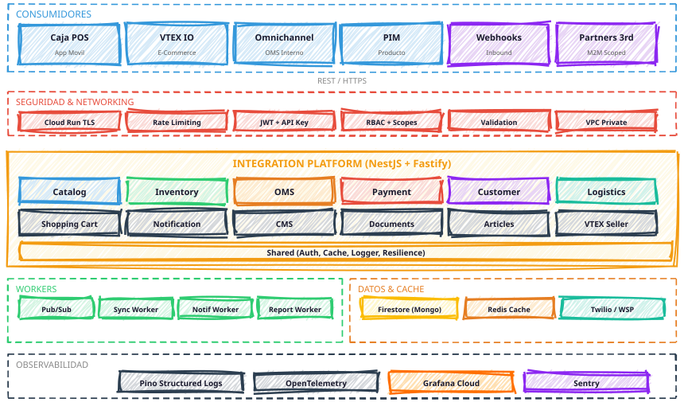

Note:
De arriba a abajo: consumidores, seguridad, API, workers, datos.

----

### Beneficio: Desacoplamiento del ERP

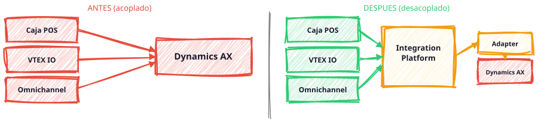

Note:
La plataforma actúa como capa de abstracción entre las aplicaciones y los ERPs.

---

## 3. ACL & Multi-ERP

> Adapter Pattern: misma lógica de negocio, conectores específicos por país

⬇️ _Navega hacia abajo para ver detalles_


Note:
SECCION CLAVE. Como cambiamos de ERP sin tocar la plataforma.

----

### ACL — Estado Actual (On-Premise)

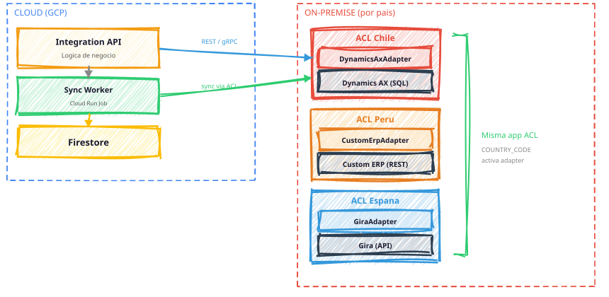

Note:
ACL on-premise junto al ERP. Mismo codigo, COUNTRY_CODE activa adapter.

----

### ACL — Migración al ERP Cloud

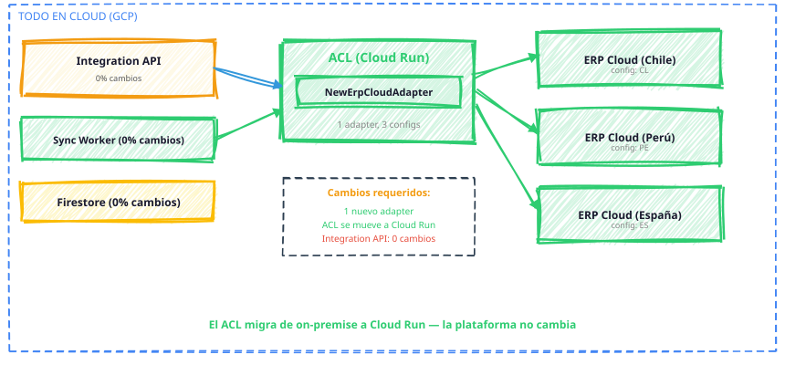

Note:
ACL migra a Cloud Run. 1 nuevo adapter. Integration API: 0 cambios.

----

### ACL — Código: Adapter por País

```typescript
// acl/src/adapters/dynamics-ax.adapter.ts (Chile)
@Injectable()
export class DynamicsAxAdapter implements ErpPort {
  async syncOrder(order: OrderDto): Promise<ErpResult> {
    // AIF/SQL directo al Dynamics AX on-premise
    return this.aifClient.submitSalesOrder(order);
  }
}

// acl/src/adapters/custom-erp.adapter.ts (Peru)
@Injectable()
export class CustomErpAdapter implements ErpPort {
  async syncOrder(order: OrderDto): Promise<ErpResult> {
    // REST API al ERP custom
    return this.httpClient.post('/api/orders', order);
  }
}

// acl/src/adapters/gira.adapter.ts (España)
@Injectable()
export class GiraAdapter implements ErpPort {
  async syncOrder(order: OrderDto): Promise<ErpResult> {
    // API Gira
    return this.giraClient.createOrder(order);
  }
}
```

Note:
Cada adapter implementa el mismo port. El ERP no importa, el contrato es el mismo.

----

### ACL — Código: Dynamic Module

```typescript
// acl/src/erp.module.ts
@Module({})
export class ErpModule {
  static register(): DynamicModule {
    const country = process.env.COUNTRY_CODE; // CL | PE | ES

    const adapterMap: Record<string, Type<ErpPort>> = {
      CL: DynamicsAxAdapter,
      PE: CustomErpAdapter,
      ES: GiraAdapter,
    };

    return {
      module: ErpModule,
      providers: [
        { provide: ERP_PORT, useClass: adapterMap[country] },
      ],
      exports: [ERP_PORT],
    };
  }
}
```

> *`COUNTRY_CODE` en runtime decide qué adapter se inyecta*

Note:
NestJS Dynamic Module. COUNTRY_CODE selecciona el adapter en tiempo de arranque.

----

### ACL — Código: Consumidor

```typescript
// acl/src/services/order-sync.service.ts
@Injectable()
export class OrderSyncService {
  constructor(
    @Inject(ERP_PORT) private readonly erp: ErpPort,
  ) {}

  async sync(order: OrderDto): Promise<void> {
    await this.erp.syncOrder(order);
    // No sabe si es AX, Custom o Gira
  }
}
```

<p style="text-align: center; color: #2ecc71; font-size: 0.9em; margin-top: 30px;">
<strong>1 codebase → 3 países → COUNTRY_CODE decide el adapter</strong>
</p>

Note:
El servicio no sabe que ERP hay detras. Mismo deploy, misma imagen Docker.

---

## 4. Infraestructura GCP

> GCP Cloud Run: serverless, auto-scaling, zero-ops

⬇️ _Navega hacia abajo para ver detalles_


Note:
Todo managed. Cloud Run, Firestore, Pub/Sub. No Kubernetes.

----

### Estructura Organizacional GCP

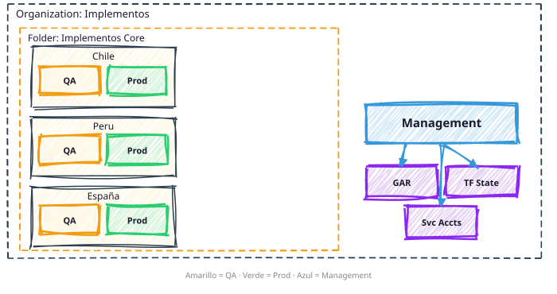

Note:
Organization > Folder > Proyectos por pais. Amarillo=QA, Verde=Prod.

----

### Deployment Multi-País

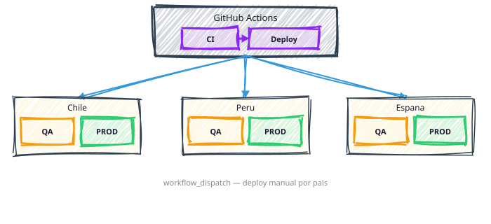

Note:
workflow_dispatch. Mismo codigo, diferente config por pais.

----

### Deployment Multi-País — Aislamiento

<div style="font-size: 0.55em;">

| Aspecto | Implementación |
|---------|---------------|
| **Proyecto GCP** | 1 proyecto por país-entorno (`impl-chile-prod`, `impl-peru-qa`) |
| **Service Account** | Aislado por país (blast radius limitado) |
| **Secrets** | Secret Manager independiente por proyecto |
| **Cloud Run** | Instancia dedicada por país |
| **Base de datos** | Conexión dedicada por país |
| **CI/CD** | Matrix deployment: `[cl, pe, es]` en paralelo |
| **Monitoreo** | Dashboards y alertas por país |
| **Timezone** | Configurado en Docker (Santiago, Lima, Madrid) |
| **Compliance** | Datos residentes en región del país |

</div>

> Cada país es un **blast radius independiente**: un problema en Chile NO afecta a Peru

Note:
El aislamiento por país es crítico. Cada país tiene su propio proyecto GCP, sus propias credenciales,
su propia base de datos y su propia instancia de Cloud Run. Un fallo en un país no impacta a los otros.

----

### Arquitectura Cloud Run

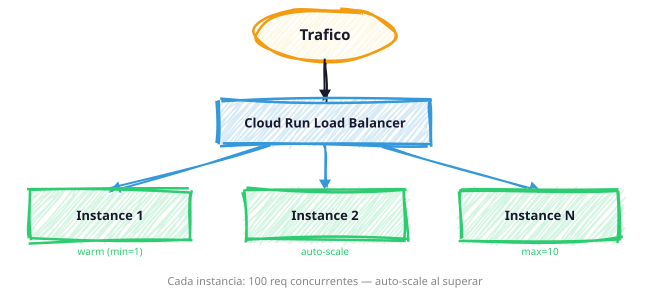

> **Escala automática**: De 0 a 100+ instancias según load

Note:
integration-api 0-100 inst. Workers por Pub/Sub. Todo auto-scale.

----

### Arquitectura Pub/Sub

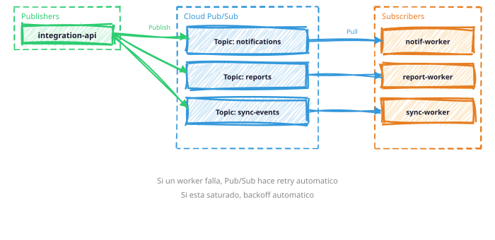

Note:
integration-api publica eventos a topics. Workers son subscribers que procesan eventos.
Si un worker falla, Pub/Sub hace retry automatico. Si esta saturado, backoff automatico.

----

### Arquitectura de Workers

<div style="font-size: 0.65em;">

| **Worker** | **Tipo Cloud Run** | **Trigger** | **Responsabilidad** |
|---|---|---|---|
| **notification-worker** | Service (push) | Pub/Sub push inmediato | Notificaciones transaccionales vía Salesforce MC |
| **notification-retry-worker** | Job (scheduled) | Cloud Scheduler cada 5 min | Recupera PENDING, PROCESSING y RETRY_SCHEDULED |
| **sync-worker** | Job (scheduled) | Cloud Scheduler (4 tasks) | Sync ERP: stock, precios, órdenes, reconciliación |
| **report-worker** | Job (scheduled) | Cloud Scheduler (4 reports) | Reportes: inventario, ventas, pricing, consolidado |
| **pickup-reminder-worker** | Job (scheduled) | Cloud Scheduler cada hora | Recordatorio 24h después de "listo para retiro" |

</div>

Note:
5 workers. notification-worker es Service (push Pub/Sub en tiempo real).
Los otros 4 son Jobs por Cloud Scheduler.
notification-retry-worker tiene 23mil+ ejecuciones (cada 5 min).
sync-worker se conecta a Dynamics AX via SQL directo.

----

### Sync Worker — Ejemplo: Sincronización de Stock

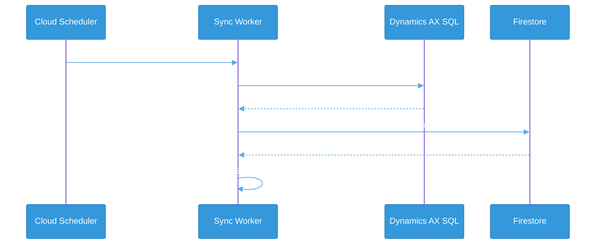
```mermaid
%%{init: {'theme': 'default', 'themeVariables': {'lineColor': '#5dade2', 'actorTextColor': '#fff', 'signalTextColor': '#fff', 'actorBkg': '#3498db', 'actorBorder': '#2980b9', 'signalColor': '#5dade2'}}}%%
sequenceDiagram
    participant CS as Cloud Scheduler
    participant SW as Sync Worker
    participant AX as Dynamics AX SQL
    participant FS as Firestore

    CS->>SW: trigger (cada hora, 8AM-8PM Lun-Sab)
    SW->>AX: SELECT stock WHERE updated > lastSync
    AX-->>SW: rows (delta)
    SW->>FS: upsert stock por sucursal
    FS-->>SW: OK
    SW->>SW: actualizar lastSync timestamp
```

> Horario de tiendas: solo sincroniza cuando hay movimiento real de stock

Note:
Sync Worker se conecta directo al SQL de Dynamics AX (no usa ACL).
Solo trae deltas (registros modificados desde última sync). Upsert en Firestore por sucursal.
Horario 8AM-8PM Lun-Sab = horario de tiendas, cuando hay movimiento real de stock.

----

### Sync Worker — Estrategia de Sincronización

<div style="font-size: 0.7em;">

| Modo | Frecuencia | Qué hace | Por qué |
|------|-----------|----------|---------|
| **Delta** | Cada hora (8AM-8PM) | `WHERE updated > lastSync` | Rápido, solo cambios |
| **Full** | Diario 2AM | `SELECT *` → replace completo | Safety net: corrige deltas perdidos |
| **Reconciliación** | Domingos 3AM | Compara Firestore vs ERP | Detecta discrepancias silenciosas |

</div>

```text
Delta (rápido, frecuente)     ← 99% del tiempo
Full (completo, nocturno)     ← corrige drift acumulado
Reconciliación (verificación) ← alerta si hay diferencias
```

> *Si delta falla, full lo corrige. Si full falla, reconciliación lo detecta.*

Note:
3 capas de proteccion: delta para velocidad, full para correccion, reconciliacion para deteccion.
Es el patron que usan Stripe y Shopify para sync de datos criticos.
Si reconciliacion detecta discrepancias, genera alerta en Teams.

----

### Notification Worker — Flujo Completo

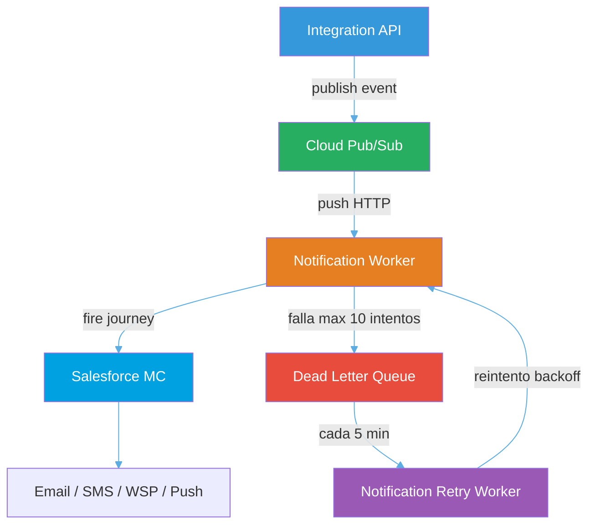
```mermaid
%%{init: {'theme': 'default', 'themeVariables': {'lineColor': '#5dade2'}}}%%
graph TD
    A[Integration API] -->|publish event| B[Cloud Pub/Sub]
    B -->|push HTTP| C[Notification Worker]
    C -->|fire journey| D[Salesforce MC]
    D --> E[Email / SMS / WSP / Push]
    C -->|falla max 10 intentos| F[Dead Letter Queue]
    F -->|cada 5 min| G[Notification Retry Worker]
    G -->|reintento backoff| C

    style A fill:#3498db,color:#fff
    style B fill:#27ae60,color:#fff
    style C fill:#e67e22,color:#fff
    style D fill:#00a1e0,color:#fff
    style F fill:#e74c3c,color:#fff
    style G fill:#9b59b6,color:#fff
```

Note:
Flujo: Integration API publica en Pub/Sub, worker recibe via push HTTP,
se autentica con SFMC via OAuth2, y dispara un Journey.
Si falla, Pub/Sub reintenta 10 veces. Despues va a DLQ.
Retry worker cada 5 min con backoff exponencial.

----

### Notification Worker — Resiliencia

- **Circuit breaker** separado para auth SFMC y delivery
- **Token refresh** proactivo con mutex (evita thundering herd)
- **Clasificación de errores**: retryable vs non-retryable
- **Máximo 5 reintentos** por notificación con backoff: 5→10→20→30→30 min
- **Dead Letter Queue** captura mensajes que agotan reintentos

Note:
Cada componente tiene su propio circuit breaker.
Si SFMC auth cae, el delivery circuit breaker sigue independiente.
Token refresh usa mutex para evitar que N workers pidan token al mismo tiempo.

----

### Stack de Infraestructura

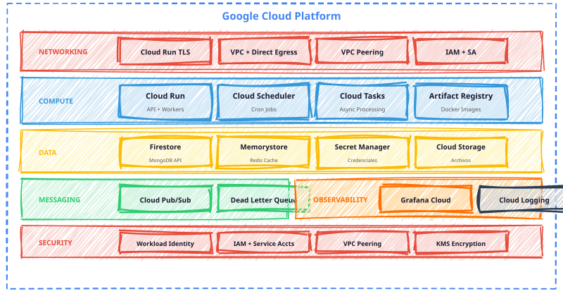

Note:
Managed services. Preferir managed, self-hosted solo si necesario.

----

### Arquitectura Redis (Memorystore)

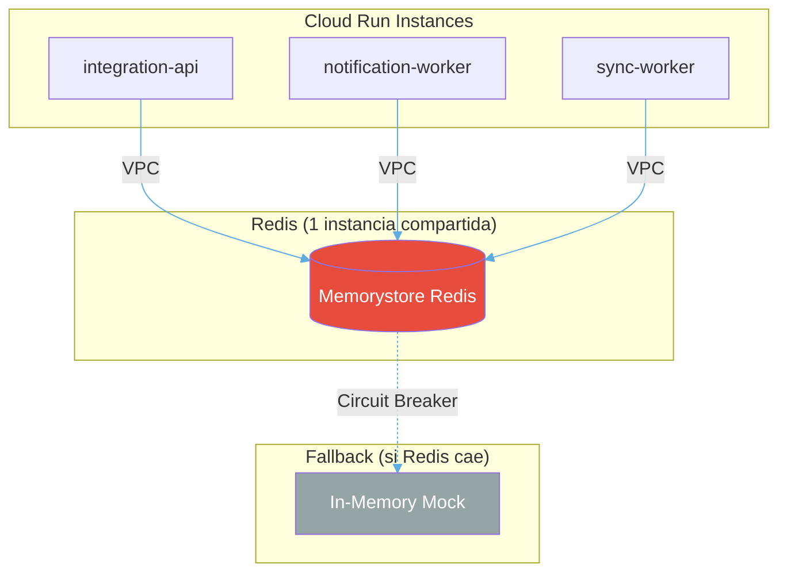
```mermaid
%%{init: {'theme': 'default', 'themeVariables': {'lineColor': '#5dade2'}}}%%
graph TB
    subgraph "Cloud Run Instances"
        API[integration-api]
        NW[notification-worker]
        SW[sync-worker]
    end

    subgraph "Redis (1 instancia compartida)"
        R[(Memorystore Redis)]
    end

    subgraph "Fallback (si Redis cae)"
        M[In-Memory Mock]
    end

    API -->|VPC| R
    NW -->|VPC| R
    SW -->|VPC| R
    R -.->|Circuit Breaker| M

    style R fill:#e74c3c,color:#fff
    style M fill:#95a5a6,color:#fff
```

<div style="font-size: 0.6em;">

| Uso | Key Prefix | Fail Strategy |
|-----|-----------|---------------|
| **Auth Blacklist** | `logout_token_*` | Fail-closed (deniega acceso) |
| **Rate Limiting** | `throttle:*` | Fail-closed (429 Too Many Requests) |
| **Cache General** | `cache:*` | StampedeGuard + Singleflight |
| **Distributed Locks** | `lock:*` | Redlock pattern |
| **Pub/Sub Dedup** | `idempotency:*` | Message deduplication |

</div>

Note:
1 Redis compartido, namespacing por key prefix. Fail-closed en auth y rate limiting.
StampedeGuard previene thundering herd. Si Redis cae, in-memory mock para dev.

----

### Memorystore — Configuración Actual vs HA

<div style="font-size: 0.7em;">

| Característica | **Actual (BASIC)** | **Futuro (STANDARD)** |
|---|---|---|
| **Réplicas** | 1 instancia, sin réplica | 1 primary + 1 replica (cross-zone) |
| **Failover** | In-memory mock (dev) / fail-closed (prod) | Automático en <30 segundos |
| **Backups** | No | Diarios automáticos |
| **SLA** | Best-effort | 99.9% disponibilidad |
| **Memoria** | 1 GB | 1-5 GB configurable |
| **Costo** | ~$25/mes | ~$50/mes (M1 5GB) |
| **Cambio requerido** | — | 1 línea en Terraform (`tier = "STANDARD_HA"`) |

</div>

> **Escalar a HA**: cambiar 1 línea en Terraform — **0 cambios en la aplicación**

Note:
Hoy usamos BASIC por costo. La app ya esta preparada para HA con circuit breakers y fallbacks.
Cuando el costo de downtime supere $50/mes, subir a STANDARD_HA. Zero code changes.

----

### Inventario GCP — Compute & Messaging

<div style="font-size: 0.6em;">

| Servicio | Recurso | Detalle |
|----------|---------|---------|
| **Cloud Run Services** | `integration-api` | API principal (2 vCPU, 1Gi, min=1, max=10) |
| | `notification-worker` | Push subscriber SFMC (2 vCPU, 1Gi) |
| **Cloud Run Jobs** | `sync-worker` | Sync ERP Dynamics AX |
| | `notification-retry-worker` | Recovery notificaciones fallidas |
| | `report-worker` | Reportes inventory/sales/pricing |
| | `pickup-reminder-worker` | Recordatorio 24h retiro |
| **Cloud Pub/Sub** | `notification-worker` | Topic + push subscription |
| | `notification-worker-dlq` | Dead Letter Queue |
| **Cloud Scheduler** | `notification-retry-scheduler` | Cada 5 min |
| | `pickup-reminder-hourly` | Cada hora |

</div>

Note:
2 Cloud Run Services (integration-api y notification-worker).
4 Cloud Run Jobs (sync, retry, report, pickup-reminder).
Pub/Sub con DLQ para notificaciones. Cloud Scheduler para tareas periodicas.

----

### Cloud Run Auto-Scaling

<div style="font-size: 0.75em;">

| Config | QA | Producción |
|--------|----|----|
| **Min instancias** | 0 (scale-to-zero) | 1 (always warm) |
| **Max instancias** | 1 | 10 |
| **vCPU** | 1 | 2 |
| **Memoria** | 512 Mi | 1 Gi |
| **Concurrencia** | 80 req/container | 100 req/container |
| **Timeout** | 300s | 60s |
| **CPU Boost** | No | Si (cold starts) |
| **Costo mensual** | ~$5-15 | ~$50-100 |

</div>

Note:
QA: scale-to-zero (5-15 USD/mes). Prod: min=1 siempre caliente, max=10.
Cada instancia 2 vCPU, 1Gi, 100 req concurrentes. CPU Boost para cold starts.

----

### Cloud Run — Auto-Scaling en Acción


> Cada instancia maneja **100 req concurrentes** — si se supera, Cloud Run crea otra automáticamente

Note:
Cloud Run escala automaticamente de 1 a 10 instancias segun la carga.
Siempre hay al menos 1 instancia caliente en produccion.
Si una instancia llega a 100 req concurrentes, se crea otra.

----

### Cloud Run — Estrategia de Mitigación

<div style="font-size: 0.7em;">

| Config | Valor | Efecto |
|--------|-------|--------|
| **minScale** | 1 | Elimina cold starts |
| **maxScale** | 10 | Limita escalado y costos |
| **CPU Boost** | Si (prod) | Acelera startup instancias nuevas |
| **Concurrencia** | 100 req/container | Threshold para nueva instancia |
| **Timeout** | 60s prod / 300s QA | Protege contra requests colgados |
| **Costo** | ~$50-100/mes | 1 instancia warm 24/7 |

</div>

> *Resultado: Zero cold starts, respuestas <100ms*

Note:
minScale=1 elimina cold starts a cambio de ~$50/mes. CPU Boost acelera las instancias nuevas.
El timeout de 60s en prod protege contra requests colgados sin afectar operaciones normales.

----

### Resumen de Decisiones GCP

| Servicio | Decisión | Razón Principal |
|----------|----------|-----------------|
| **Database** | Firestore | MongoDB API, zero ops, auto-scaling |
| **Cache** | Memorystore | Redis managed, fallback in-memory |
| **Messaging** | Cloud Pub/Sub | Zero config, infinite scale |
| **Compute** | Cloud Run | Serverless, auto-scale, zero idle cost |
| **Secrets** | Secret Manager | Seguridad crítica, audit logs |
| **CI/CD** | GitHub Actions | Nx affected, matrix multi-país |
| **IaC** | Terraform | Reproducibilidad, multi-proyecto |

**Filosofía:** Preferir managed para enfocarnos en funcionalidades, no en infraestructura.

**Exit strategy:** Firestore usa MongoDB wire protocol → podemos migrar a MongoDB Atlas/self-hosted sin cambiar código.

Note:
Todo GCP managed. La filosofia es: si GCP lo opera mejor que nosotros, dejarlo a GCP.
Exit strategy: Firestore compatible con MongoDB wire protocol — migracion sin cambios de codigo.

---

## 5. Patrones Técnicos

> Ya vimos cómo se despliega — ahora veamos cómo se organiza el código internamente

⬇️ _Navega hacia abajo para ver detalles_


Note:
Boundaries tan estrictos como microservicios, sin el overhead operacional. Shopify y GitHub usan el mismo patron.

----

### Regla Fundamental: No Shared State

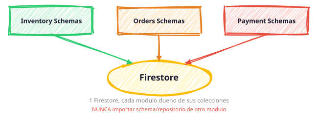

<div style="font-size: 0.7em;">

- **1 Firestore**, pero cada módulo es dueño de sus **colecciones**
- **NUNCA** se importa el schema/repositorio de otro módulo
- Comunicación inter-módulo: **Facade** (sync) o **Evento** (async)

</div>

Note:
1 Firestore, cada modulo dueno de sus colecciones. Comunicacion via Facade.

----

### Comunicación Entre Módulos

<div style="font-size: 0.7em;">

| Tipo | Mecanismo | Ejemplo |
|------|-----------|---------|
| **Sync Query** | Facade | `CatalogFacade.getProduct(sku)` |
| **Sync Command** | Facade | `InventoryFacade.reserveStock(items)` |
| **Async Event** | Pub/Sub | `OrderConfirmedEvent → ReserveStock` |
| **Scheduled** | Cloud Scheduler | Sync stock cada hora |

</div>

Note:
4 formas de comunicacion entre modulos.
Facade para llamadas sincronas (queries y commands).
Pub/Sub para eventos asincrono (fire-and-forget).
Cloud Scheduler para tareas periodicas.

----

### Facade Pattern — Ejemplo

```typescript
// Facade — API pública del módulo (única forma de comunicación cross-module)
@Injectable()
export class EcommerceInventoryFacade {
  /** Consulta de stock — puede ser llamado por OMS, Cart, Catalog */
  async getStockBySku(sku: string, branchCode: string): Promise<StockDto> {
    return this.stockService.findBySku(sku, branchCode);
  }

  /** Reserva de stock — llamado cuando se confirma una orden */
  async reserveStock(items: ReserveStockDto[]): Promise<ReservationResult> {
    return this.stockService.reserve(items);
  }
}
```

> **Regla**: NUNCA importar directamente el repositorio de otro módulo — siempre vía Facade

Note:
La Facade es la unica forma de comunicacion cross-module.
Si OMS necesita stock, llama a InventoryFacade, no importa el repositorio de Inventory.
Esto mantiene los boundaries estrictos y permite extraer un modulo como microservicio en el futuro.

----

### Ecosistema de Integraciones

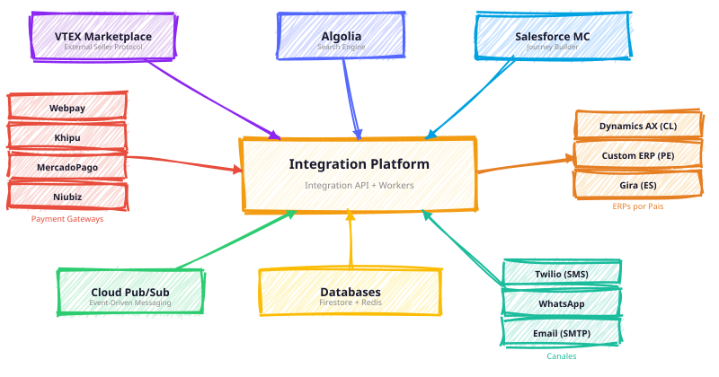

Note:
VTEX, Salesforce, Algolia, 4 gateways pago, 3 ERPs, Pub/Sub.

----

### Salesforce Marketing Cloud — Flujo

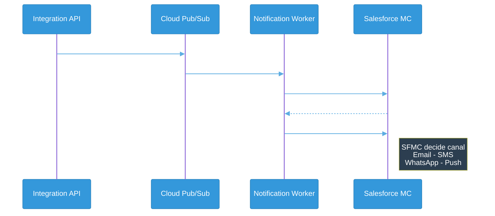
```mermaid
%%{init: {'theme': 'default', 'themeVariables': {'lineColor': '#5dade2', 'actorTextColor': '#fff', 'signalTextColor': '#fff', 'noteBkgColor': '#2c3e50', 'noteTextColor': '#fff', 'actorBkg': '#3498db', 'actorBorder': '#2980b9', 'signalColor': '#5dade2'}}}%%
sequenceDiagram
    participant API as Integration API
    participant PS as Cloud Pub/Sub
    participant NW as Notification Worker
    participant SF as Salesforce MC

    API->>PS: 1. Publish OrderConfirmedEvent
    PS->>NW: 2. Push delivery HTTP
    NW->>SF: 3. OAuth2 token request
    SF-->>NW: access_token
    NW->>SF: 4. Fire Journey
    Note right of SF: SFMC decide canal<br/>Email - SMS<br/>WhatsApp - Push
```

Note:
Salesforce Marketing Cloud es el motor de notificaciones transaccionales.
El Integration API publica eventos, el notification-worker los procesa y dispara Journeys en SFMC.
SFMC decide el canal (email, SMS, WhatsApp, push) segun la configuracion del Journey.
Esto permite al equipo de marketing configurar canales y templates sin tocar codigo.

----

### Payment Gateway Factory

```typescript
// Selección dinámica de gateway según país y método de pago
@Injectable()
export class PaymentGatewayFactory {
  resolve(countryCode: string, method: PaymentMethod): PaymentGateway {
    // Chile: Webpay para tarjetas, Khipu para transferencias
    // Peru: Niubiz para tarjetas, MercadoPago para wallets
    // Todos: Orden de Compra B2B con validación OTP
  }
}
```

> Mismo patrón que `ErpSyncFactory` — **Adapter Pattern** aplicado a pagos

Note:
Mismo patron de adapter que usamos para los ERPs.
El factory resuelve en runtime que gateway usar segun pais y metodo de pago.
Agregar un nuevo gateway es agregar una entrada sin tocar logica existente.

---

## 6. Clean Architecture — Capas y Dependencias

> 5 capas con regla de dependencia estricta: las dependencias siempre apuntan hacia adentro

⬇️ _Navega hacia abajo para ver detalles_


Note:
5 capas con regla de dependencia estricta: las externas dependen de las internas.
La capa de Domain es TypeScript puro, sin dependencias de frameworks.
Modulos CRUD-ish NO tienen capa de dominio (RFC-0062 arquitectura pragmatica).

----

### Las 5 Capas

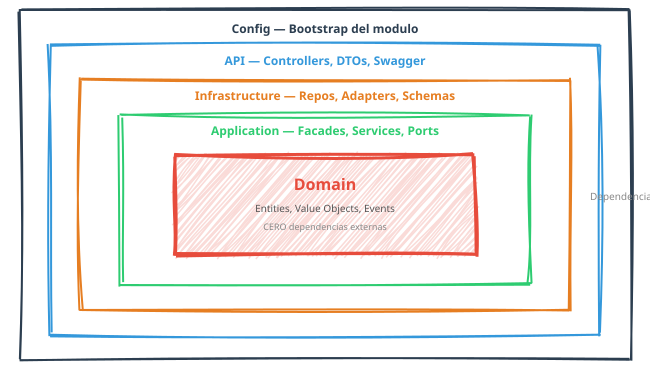

Note:
La capa de Domain no tiene dependencias externas — es TypeScript puro.
Application define los puertos (interfaces) y la logica de orquestacion.
Infrastructure implementa los puertos con tecnologias concretas.
API expone los endpoints HTTP. Config solo hace wiring de dependencias.

----

### Capas del Sistema — Relaciones

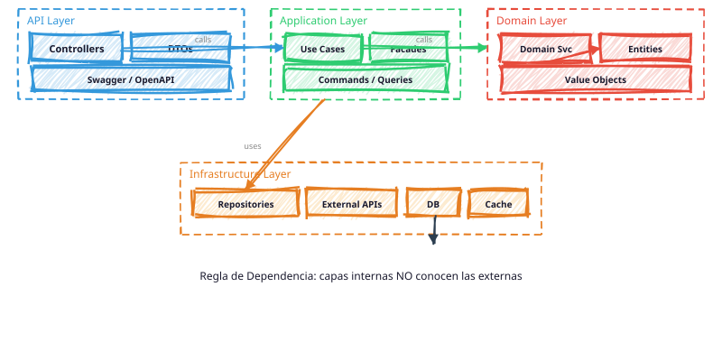

> **Regla de Dependencia**: Las capas internas NO conocen las externas

Note:
Diagrama de flujo entre componentes. Controllers llaman Use Cases, Use Cases usan Facades y Repositories.
Domain Services operan sobre Entities y Value Objects. Infrastructure implementa los puertos.

----

### Estructura de un Módulo

```
libs/ecommerce-inventory/
├── domain/               # 💎 Reglas de negocio puras
│   ├── entities/         # Stock, Warehouse, Reservation
│   ├── value-objects/    # SKU, BranchCode, Quantity
│   ├── events/           # StockReservedEvent, StockUpdatedEvent
│   ├── errors/           # InsufficientStockException
│   └── repositories/     # Interfaces (no implementaciones)
│
├── application/          # ⚙️ Casos de uso
│   ├── facades/          # API pública: InventoryFacade
│   ├── services/         # StockService, ReservationService
│   └── ports/            # Interfaces para adapters externos
│
├── infrastructure/       # 🔧 Implementaciones concretas
│   ├── persistence/
│   │   ├── schemas/      # Mongoose schemas
│   │   ├── repositories/ # MongoStockRepository implements StockRepository
│   │   └── mappers/      # Domain ↔ Persistence mappers
│   └── adapters/         # ErpStockSyncAdapter, etc.
│
├── api/                  # 🎯 Presentación HTTP
│   ├── controllers/      # StockController, WarehouseController
│   └── dto/              # Request/Response DTOs con validación
│
└── config/               # ⚡ Bootstrap del módulo
```

> Las dependencias siempre apuntan **hacia adentro** — Domain no sabe que existe NestJS ni Mongoose

Note:
Cada módulo tiene exactamente esta estructura. Los módulos CRUD-ish pueden omitir la capa de dominio.
La clave es que las dependencias siempre van de afuera hacia adentro.

----

### Flujo Completo — Request a través de las Capas

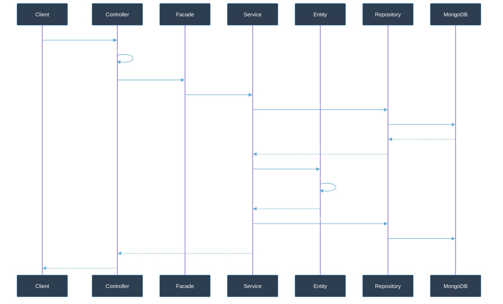
```mermaid
%%{init: {'theme': 'default', 'themeVariables': {'lineColor': '#5dade2', 'actorTextColor': '#fff', 'signalTextColor': '#fff', 'actorBkg': '#2c3e50', 'actorBorder': '#5dade2', 'signalColor': '#5dade2'}}}%%
sequenceDiagram
    participant Client
    participant Controller as Controller
    participant Facade as Facade
    participant Service as Service
    participant Entity as Entity
    participant Repo as Repository
    participant DB as MongoDB

    Client->>Controller: POST /v1/stock/reserve
    Controller->>Controller: Validar DTO
    Controller->>Facade: reserveStock(dto)
    Facade->>Service: execute(command)
    Service->>Repo: findBySku(sku)
    Repo->>DB: findOne({ sku })
    DB-->>Repo: document
    Repo-->>Service: Stock entity
    Service->>Entity: stock.reserve(qty)
    Entity->>Entity: Validar reglas
    Entity-->>Service: OK / Error
    Service->>Repo: save(stock)
    Repo->>DB: updateOne()
    Service-->>Controller: void
    Controller-->>Client: 200 OK
```

Note:
Sigue las flechas: el request baja por las capas, la respuesta sube.
Nota que Entity valida las reglas - no el Controller ni el Repository.

----

### Donde Vive Cada Logica

<div style="font-size: 0.65em;">

| Logica | Capa | Ejemplo |
|--------|------|---------|
| Validar formato SKU | Domain (Value Object) | `SKU.create("ABC-123")` |
| Validar cantidad > 0 | Domain (Value Object) | `Quantity.create(5)` |
| Verificar stock suficiente | Domain (Entity) | `stock.reserve(qty)` |
| Cargar stock de DB | Infrastructure | `repo.findBySku(sku)` |
| Guardar cambios | Infrastructure | `repo.save(stock)` |
| Validar request HTTP | API (DTO) | `@IsNotEmpty()` |
| Documentar endpoint | API (Swagger) | `@ApiOperation()` |

</div>

Note:
Esta tabla es tu guia cuando no sepas donde poner algo.
Si la logica es de negocio, va en Domain. Si es tecnica, va en Infrastructure.

----

### Error Handling Estandarizado

> Errores estandarizados con DomainError

```typescript
// Definir error custom
export class InsufficientStockError extends DomainError {
  constructor(sku: string, requested: number, available: number) {
    super({
      code: 'INVENTORY.INSUFFICIENT_STOCK',
      message: 'Stock insuficiente para ' + sku,
      category: ErrorCategory.BUSINESS_RULE,
      details: { sku, requested, available },
    });
  }
}

// Usar en el servicio
async reserveStock(sku: string, quantity: number): Promise<void> {
  const stock = await this.repository.findBySku(sku);

  if (stock.available < quantity) {
    throw new InsufficientStockError(sku, quantity, stock.available);
  }

  await this.repository.reserve(sku, quantity);
}
```

Note:
El manejo de errores está estandarizado.
Definimos errores custom que extienden DomainError.
El código de error incluye contexto útil para debugging.

----

### Jerarquia de Errores

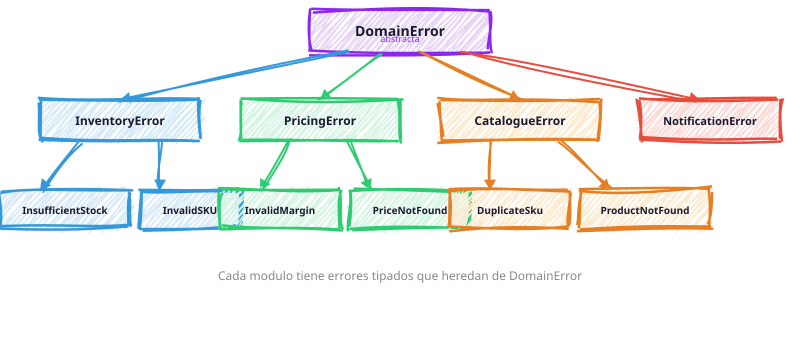

Cada modulo tiene sus propios errores tipados que heredan de `DomainError`.

Note:
La jerarquia de errores permite atrapar errores especificos o genericos.
Puedes atrapar InsufficientStock o cualquier InventoryError.

----

### Categorias de Error

<div style="font-size: 0.7em;">

| Categoria | HTTP | Cuando usar |
|-----------|------|-------------|
| `VALIDATION` | 400 | Datos de entrada invalidos |
| `BUSINESS_RULE` | 400 | Regla de negocio violada |
| `NOT_FOUND` | 404 | Recurso no existe |
| `CONFLICT` | 409 | Conflicto con estado actual |
| `EXTERNAL` | 502 | Error en servicio externo |
| `TECHNICAL` | 500 | Error de infraestructura |

</div>

La categoria determina automaticamente el HTTP status.

Note:
Elegir la categoria correcta es importante: BUSINESS_RULE vs VALIDATION.
BUSINESS_RULE es para reglas de negocio, VALIDATION es para datos invalidos.

----

### Respuesta Automatica en HTTP

El `GlobalExceptionFilter` convierte DomainError a respuesta HTTP:

```json
{
  "success": false,
  "error": {
    "code": "INVENTORY.INSUFFICIENT_STOCK",
    "message": "Stock insuficiente para SKU-001",
    "category": "BUSINESS_RULE",
    "timestamp": "2025-01-05T10:30:00Z",
    "details": {
      "sku": "SKU-001",
      "requested": 100,
      "available": 50
    }
  }
}
```

**Beneficios:**
- Codigo unico para manejar programaticamente
- Mensaje claro para mostrar al usuario
- Detalles para debugging

Note:
El GlobalExceptionFilter convierte DomainError a JSON automaticamente.
No tienes que hacer try/catch en cada controller.

----

### Errores: Antes vs Despues

**Antes (generico):**

```json
{
  "statusCode": 400,
  "message": "Bad Request"
}
```

Que fallo exactamente? Como lo arreglo?

**Despues (estructurado):**

```json
{
  "error": {
    "code": "INVENTORY.INSUFFICIENT_STOCK",
    "details": { "sku": "SKU-001", "available": 50 }
  }
}
```

El frontend puede mostrar: "Solo hay 50 unidades disponibles". Logs buscables por codigo de error.

Note:
Este es el valor de errores estructurados: el frontend sabe exactamente que paso.
Puede mostrar un mensaje util al usuario en vez de "Error 400".

---

## 7. Seguridad — Defense in Depth

> 8 capas de seguridad: si una falla, las demás siguen protegiendo

⬇️ _Navega hacia abajo para ver detalles_


Note:
8 capas de seguridad. Si una falla, las demas siguen protegiendo.
Cloud Run provee TLS y proteccion DDoS nativa.
El auth es fail-closed: si Redis cae, se rechazan todos los requests.

----

### Las Capas de Seguridad

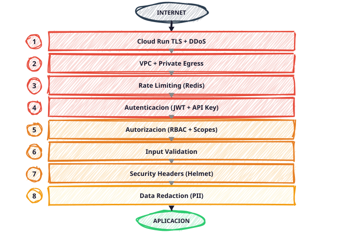

Note:
Defense in Depth — cada capa protege contra amenazas específicas.
Cloud Run provee TLS y protección DDoS nativa. La VPC aísla los recursos internos.
Si una capa falla, las demás siguen protegiendo.

----

### Autenticación Unificada

<div style="font-size: 0.65em;">

```typescript
// UnifiedAuthGuard — Global APP_GUARD, evaluado en CADA request
// 1. @Public → Best-effort (no falla si no hay token)
// 2. X-API-Key → Valida SHA-256 en Redis → ClientContext { scopes }
// 3. Bearer JWT → Valida firma + blacklist (fail-closed) → ClientContext { roles }
// 4. Ambos headers → 400 Bad Request (ambigüedad)
// 5. Ninguno → 401 Unauthorized
```

</div>

<div style="font-size: 0.6em;">

| Tipo | Header | Método | Uso |
|------|--------|--------|-----|
| **Humanos** | `Authorization: Bearer` | JWT firmado | Frontend, Admin, Caja |
| **Máquinas** | `X-API-Key: vtx_live_...` | API Key SHA-256 | ERP, VTEX, Partners |

</div>

Note:
UnifiedAuthGuard evalua CADA request. JWT para humanos, API Key para maquinas.
Si llegan ambos headers: 400 Bad Request (ambiguedad).
Blacklist en Redis es fail-closed: si Redis cae, se rechazan todos.

----

### Rate Limiting Multi-Nivel

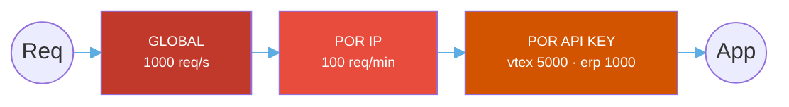
```mermaid
%%{init: {'theme': 'default', 'themeVariables': {'lineColor': '#5dade2'}, 'flowchart': {'nodeSpacing': 5, 'rankSpacing': 20}}}%%
flowchart LR
    R((Req)) --> G["GLOBAL<br/>1000 req/s"]
    G --> IP["POR IP<br/>100 req/min"]
    IP --> AK["POR API KEY<br/>vtex 5000 · erp 1000"]
    AK --> APP((App))

    style G fill:#c0392b,color:#fff,font-size:10px
    style IP fill:#e74c3c,color:#fff,font-size:10px
    style AK fill:#d35400,color:#fff,font-size:10px
```

> **Storage**: Redis distribuido — consistente en todas las instancias

Note:
3 niveles: Global (1000 req/s), por IP (100 req/min), por API Key (configurable).
Storage en Redis distribuido, consistente en todas las instancias.

----

### Secret Manager

| Ventaja | Descripción |
|---------|-------------|
| **No API keys en código** | El código no contiene credenciales |
| **Workload Identity** | Cloud Run usa su service account |
| **Audit logs** | Cada acceso queda registrado |
| **Versionado** | Rollback fácil si algo falla |
| **33 secrets** | Credenciales, tokens, API keys |

> *Costo: ~$5/mes para 50 secrets con 1M accesos*

Note:
Zero secrets en el repositorio. Cloud Run accede via Workload Identity, sin JSON keys.
Cada secret tiene versionado automatico — rollback es cambiar 1 revision.

---

## 8. Developer Workflow

> Del código al merge: convenciones, branches, PRs y code review

⬇️ _Navega hacia abajo para ver detalles_


Note:
Ciclo de desarrollo estandarizado. Conventional commits, Git Flow, CI con Nx affected.
Quality gates en paralelo. Deploy multi-pais. CI tarda 3-5 minutos.

----

### Ciclo de Desarrollo

```text
CODE → BRANCH → COMMIT → PUSH → PR → REVIEW → MERGE
```

| Paso | Herramienta | Regla |
|------|-------------|-------|
| Code | VS Code | Format on save |
| Branch | Git | Desde `develop`: feature/#taskId |
| Commit | Git | Conventional commits |
| Push | Git | A tu branch, nunca a main |
| PR | GitHub | Template obligatorio |
| Review | GitHub | CODEOWNERS approval |
| Merge | GitHub | Squash merge |

Note:
Este ciclo se repite cientos de veces al dia en el equipo.
Format on save con Prettier, conventional commits obligatorios, squash merge.

----

### Conventional Commits — Tipos

<div style="font-size: 0.75em;">

| Tipo | Cuando usar | Version |
|------|-------------|---------|
| `feat` | Nueva funcionalidad | Minor ↑ |
| `fix` | Corregir un bug | Patch ↑ |
| `docs` | Solo documentacion | - |
| `refactor` | Cambiar sin agregar feature | - |
| `test` | Agregar o modificar tests | - |
| `chore` | Tareas de mantenimiento | - |
| `perf` | Mejoras de rendimiento | Patch ↑ |

</div>

```bash
# Formato: <type>(<scope>): <descripción en español>
feat(inventory): agregar endpoint de importación masiva
fix(pricing): corregir precisión decimal en cálculo de impuestos
```

> Changelog generado automáticamente por **Google release-please**

Note:
type y scope en inglés, descripción en español. release-please genera changelogs automáticos.
feat y fix afectan el versionado automatico (SemVer). Scope indica el modulo afectado.

----

### Branch Naming & Git Flow

```bash
# Convención: <type>/<descripcion-corta>
feature/agregar-importacion-masiva
fix/corregir-decimal-pricing
refactor/extraer-validacion-shared
```

<div style="display: flex; justify-content: center; transform: scale(1.1); margin: 20px 0;">

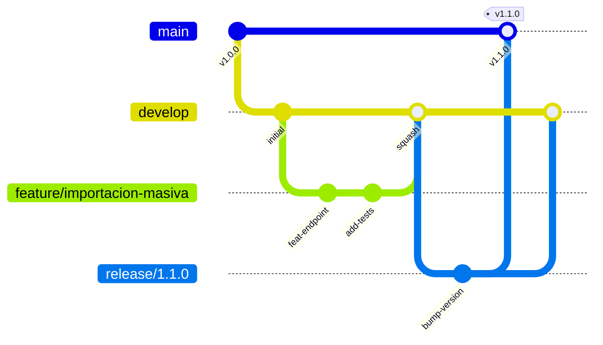
```mermaid
%%{init: {'theme': 'default', 'gitGraph': {'mainBranchName': 'main'}}}%%
gitGraph
   commit id: "v1.0.0"
   branch develop
   commit id: "initial"
   branch feature/importacion-masiva
   commit id: "feat-endpoint"
   commit id: "add-tests"
   checkout develop
   merge feature/importacion-masiva id: "squash"
   branch release/1.1.0
   commit id: "bump-version"
   checkout main
   merge release/1.1.0 id: "v1.1.0" tag: "v1.1.0"
   checkout develop
   merge release/1.1.0
```

</div>

Note:
Git Flow: features van a develop, releases a main. Squash merge para historial limpio.
Branches con nombres descriptivos en español. release-please genera tags y changelog automatico.

----

### Breaking Changes

Si tu cambio rompe compatibilidad:

```bash
# Opcion 1: Agregar "!"
feat!: remove deprecated v1 API endpoints

# Opcion 2: En el body
feat(auth): change token format

BREAKING CHANGE: tokens now use JWT instead of opaque.
```

**Breaking change = version mayor (1.0 → 2.0)**

Note:
Los breaking changes son serios — rompen compatibilidad para otros.
Antes de agregar un "!" SIEMPRE consulta con el equipo.

----

### AI-Assisted Commits

GitLens y GitHub Copilot estan configurados para generar commits en español:


**Ya configurado** en `.vscode/settings.json` - solo usa el boton ✨

Note:
La AI genera un borrador - SIEMPRE revisalo antes de aceptar.
A veces el scope esta mal o el mensaje es demasiado generico.

----

### Vincular PR con ClickUp


**Tip**: Agrega `#taskId` en el body del PR para vincular automáticamente con ClickUp

Note:
El task ID esta en la URL del task o con el boton "Copy ID".
Al incluir #taskId en el PR, ClickUp lo vincula automaticamente.

----

### Mantener tu Branch Actualizada

```bash
# Opcion 1: Rebase (preferido)
git fetch origin
git rebase origin/develop

# Opcion 2: Merge
git fetch origin
git merge origin/develop

# Despues de resolver conflictos
git push --force-with-lease
```

Note:
Rebase mantiene el historial mas limpio. force-with-lease es mas seguro que force.

----

### Crear un PR

```bash
# Desde terminal
gh pr create --title "feat(inventory): agregar importación masiva"

# O desde GitHub UI
# 1. Push tu branch
# 2. Click "Compare & pull request"
# 3. Llenar template
```

Note:
gh CLI es mas rapido que la UI web para crear PRs.
Pero si prefieres usar la UI web o VS Code, esta perfectamente bien.

----

### Crear PR desde VS Code

La extension **GitHub Pull Requests** permite crear PRs sin salir del editor:


Note:
Esta es la forma mas comoda de crear PRs sin salir de VS Code.
La extension ya esta en las recomendadas del workspace - solo instalala.

----

### Crear PR — Formulario


**Tip**: El titulo debe seguir conventional commits: `type(scope): descripcion`

Note:
El titulo es IMPORTANTE porque al hacer squash merge, se convierte en el commit final en main.

----

### Template de PR

```markdown
## Descripcion
Breve descripcion del cambio.

## Tipo de cambio
- [ ] Bug fix
- [ ] Nueva feature
- [ ] Refactor

## ClickUp Task
#868h4tr17

## Checklist
- [ ] Tests agregados/actualizados
- [ ] Lint pasa sin errores
```

**Importante**: El `#taskID` en el PR linkea automaticamente con ClickUp

Note:
El # antes del task ID hace que ClickUp vincule el PR automaticamente.

----

### PR Aprobado — Listo para Merge

Cuando tu PR tiene todas las aprobaciones y checks verdes:


**El boton "Squash and merge"** combina todos tus commits en uno solo con un mensaje limpio.

Note:
Squash merge junta todos tus commits en uno - asi el historial de main queda limpio.
Status checks obligatorios: lint, test, build, sonar, review CODEOWNERS.

----

### Code Review — Etiquetas

| Etiqueta | Significado | Bloquea? |
|----------|-------------|----------|
| `blocking:` | Debe corregirse | ✅ Si |
| `suggestion:` | Mejora opcional | ❌ No |
| `question:` | Necesito entender | ⚠️ Depende |
| `nit:` | Nitpicking menor | ❌ No |
| `praise:` | Buen trabajo! | ❌ No |

```markdown
blocking: Este query puede causar N+1, usar eager loading
suggestion: Podrias extraer esto a un helper
praise: Excelente manejo del edge case!
```

Note:
Usa las etiquetas para que el autor sepa si es bloqueante o no.
No olvides el "praise:" - reconocer buen trabajo motiva al equipo.

----

### CODEOWNERS

```bash
# .github/CODEOWNERS

*                          @integration-developers  # Default: todo el repo
/.github/workflows/        @integration-developers  # CI/CD crítico
/.github/actions/          @integration-developers  # Custom actions
/commitlint.config.js      @integration-developers  # Linters
/docs/                     @integration-developers  # RFCs y arquitectura
/release-please-config.json @integration-developers # Versionado
```

Tu PR necesita approval del CODEOWNER del codigo que modificaste.

Note:
Un solo team owner para todo el repo. A medida que el equipo crezca, se pueden agregar owners por modulo.
CODEOWNERS protege que ningun PR se mergee sin al menos un approval del equipo.

---

## 9. CI/CD & Validación

> Pre-commit hooks rápidos + CI completo + deploy multi-país automatizado

⬇️ _Navega hacia abajo para ver detalles_


Note:
Enfoque hibrido: pre-commit hooks rapidos (lint-staged ~2s) + CI completo (~3min).
Pipeline con Nx affected, security scanning y deploy multi-pais en paralelo.

----

### Flujo de Validación — Enfoque Híbrido

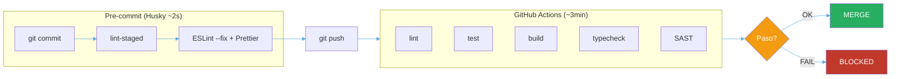
```mermaid
%%{init: {'theme': 'default', 'themeVariables': {'lineColor': '#5dade2'}}}%%
flowchart LR
    subgraph LOCAL["Pre-commit (Husky ~2s)"]
        A["git commit"] --> B["lint-staged"]
        B --> C["ESLint --fix + Prettier"]
    end

    C --> D["git push"]

    subgraph CI["GitHub Actions (~3min)"]
        E["lint"] & F["test"] & G["build"] & H["typecheck"] & I["SAST"]
    end

    D --> CI
    CI --> J{"Paso?"}
    J -->|"OK"| K["MERGE"]
    J -->|"FAIL"| L["BLOCKED"]

    style K fill:#27ae60,color:#fff
    style L fill:#c0392b,color:#fff
    style J fill:#f39c12,color:#fff
```

**Pre-commit**: lint + format (rápido, solo staged files) · **CI**: tests, build, security (pesado)

Note:
Enfoque hibrido: pre-commit hooks rapidos (lint-staged ~2s) + CI completo (~3min).
Pre-commit solo ejecuta ESLint fix y Prettier en archivos staged — no corre tests.
CI ejecuta todo: lint, test, build, typecheck, SAST. Si falla, el merge queda bloqueado.

----

### VS Code te Ayuda

```json
// .vscode/settings.json (ya configurado)
{
  "editor.formatOnSave": true,
  "editor.defaultFormatter": "esbenp.prettier-vscode",
  "editor.codeActionsOnSave": {
    "source.fixAll.eslint": true
  }
}
```

Al guardar: Prettier formatea + ESLint corrige = menos errores en CI

Note:
Format on save es tu mejor amigo - el codigo se formatea automaticamente.

----

### Reglas de ESLint Importantes

> Errores que CI atrapa automaticamente

```typescript
// ❌ @typescript-eslint/no-floating-promises
async function bad() {
  fetchData();  // Promise no awaited - BUG!
}

// ✅ Correcto
async function good() {
  await fetchData();
}

// ❌ forEach con async — promises se pierden
arr.forEach(async (n) => await process(n)); // BUG!

// ✅ Correcto
await Promise.all(arr.map((n) => process(n)));
```

Note:
Estas son las reglas mas importantes que atrapan bugs reales.
Si ven errores de floating promises, SIEMPRE agregar await.
forEach con async es un error MUY comun - usa Promise.all en su lugar.

----

### Pipeline Completo

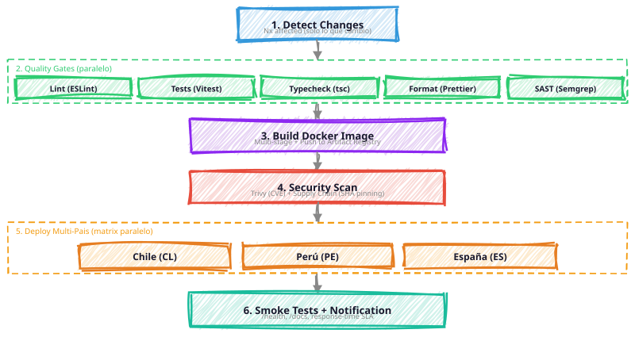

Note:
El pipeline usa Nx affected para solo ejecutar lo que cambió. Los quality gates corren en paralelo.
Después de build y security scan, se deploya en paralelo a todos los países.
Los smoke tests verifican que el deploy fue exitoso antes de enviar notificación.

----

### Canary Deployment


```mermaid
%%{init: {'theme': 'default', 'themeVariables': {'lineColor': '#5dade2'}}}%%
graph LR
    A1["1. v12: 100%"] --> A2["1. v13: 0%"]
    A2 --> B1["2. Smoke tests"]
    B1 --> B2["2. QA manual"]
    B2 --> C1["3. v12: 50%"]
    C1 --> C2["3. v13: 50%"]
    C2 --> D1["4. v13: 100%"]

    style A1 fill:#27ae60,color:#fff
    style A2 fill:#95a5a6,color:#fff
    style B1 fill:#3498db,color:#fff
    style B2 fill:#3498db,color:#fff
    style C1 fill:#f39c12,color:#fff
    style C2 fill:#f39c12,color:#fff
    style D1 fill:#27ae60,color:#fff
```


Note:
4 pasos: deploy con 0% trafico, validacion, split 50/50, full rollout.
La nueva revision se despliega pero no recibe trafico hasta validar.
Si falla, rollback automatico.

---

## 10. Resiliencia & Observabilidad

> A medida que escalamos, los fallos son inevitables — lo importante es detectarlos y sobrevivir

⬇️ _Navega hacia abajo para ver detalles_


Note:
Circuit Breaker evita cascada cuando un servicio externo cae.
Cache Stampede evita que 1000 requests golpeen la DB cuando el cache expira.
Grafana Cloud es nuestra plataforma de observabilidad - logs, metricas y traces.

----

### Patrones de Resiliencia

<div style="font-size: 0.55em;">

| Patrón | Implementación | Qué Protege |
|--------|---------------|-------------|
| **Circuit Breaker** | Cockatiel | Cascada de fallos a externos |
| **Retry + Backoff** | Exponential 5→10→20→30s | Fallos transitorios |
| **Timeout** | 60s por request (prod) | Requests colgados |
| **Bulkhead** | Concurrency limit | Aísla fallos entre módulos |
| **Cache Stampede** | Singleflight + Probabilistic | Thundering herd en cache miss |
| **Dead Letter Queue** | Pub/Sub DLQ | Mensajes fallidos no se pierden |
| **Transactional Outbox** | DB + Event atómico | Consistencia evento + persistencia |
| **Graceful Degradation** | Conditional module loading | Si DB falla, otros módulos siguen |

</div>

Note:
Cada patrón protege contra un tipo específico de fallo.
El Circuit Breaker evita que una API externa caída derribe todo el sistema.
El Cache Stampede protege contra N requests simultáneos a un mismo recurso.

----

### Circuit Breaker — Estados

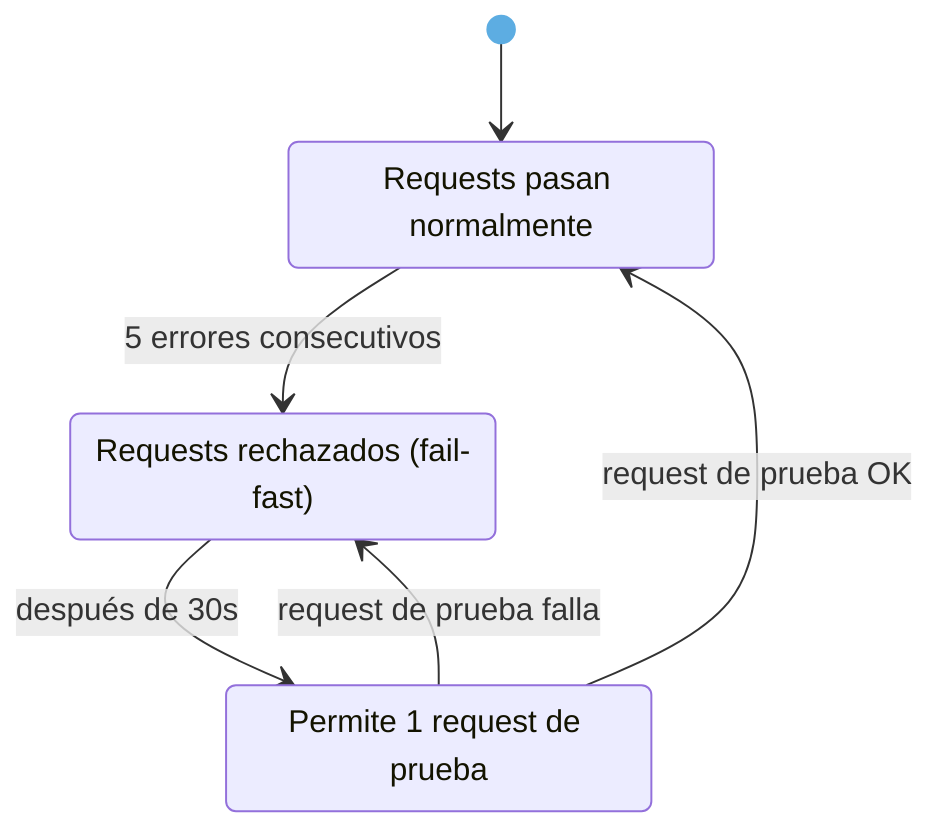
```mermaid
%%{init: {'theme': 'default', 'themeVariables': {'lineColor': '#5dade2'}}}%%
stateDiagram-v2
    [*] --> CLOSED
    CLOSED --> OPEN: 5 errores consecutivos
    OPEN --> HALF_OPEN: después de 30s
    HALF_OPEN --> CLOSED: request de prueba OK
    HALF_OPEN --> OPEN: request de prueba falla

    CLOSED: Requests pasan normalmente
    OPEN: Requests rechazados (fail-fast)
    HALF_OPEN: Permite 1 request de prueba
```

Note:
3 estados: Closed (normal), Open (fail-fast), Half-Open (probando).
5 errores consecutivos lo abren. Despues de 30s deja pasar 1 request de prueba.

----

### Circuit Breaker — Implementación

```typescript
const circuitBreaker = new CircuitBreakerPolicy({
  halfOpenAfter: 30_000,      // 30s antes de probar de nuevo
  breaker: new ConsecutiveBreaker(5),  // 5 errores → OPEN
});

// Uso: wrappea la llamada al servicio externo
const result = await circuitBreaker.execute(() =>
  this.httpService.get('https://erp.example.com/stock')
);
```

> Librería: **Cockatiel** — lightweight, TypeScript nativo

Note:
Usamos Cockatiel, libreria TypeScript nativa y lightweight.
Cada integracion externa tiene su propio circuit breaker independiente.

----

### Observabilidad: Los 3 Pilares

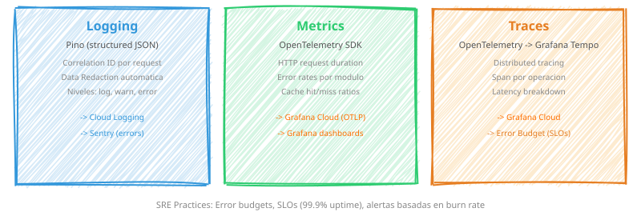

**SRE Practices**: Error budgets, SLOs (99.9% uptime), alertas basadas en burn rate


Note:
Logging: Pino JSON estructurado + correlation ID. Va a Cloud Logging y Sentry.
Metricas: OpenTelemetry exporta a Grafana Cloud via OTLP.
Traces: distributed tracing en Grafana Tempo.
Nunca console.log, siempre this.logger.

---

## 11. Resumen Ejecutivo

> Vista consolidada de toda la plataforma

⬇️ _Navega hacia abajo para ver detalles_


Note:
Resumen ejecutivo en 2 slides: plataforma e infraestructura.

----

### Resumen — Plataforma

<div style="font-size: 0.6em;">

| Dimensión | Implementación |
|-----------|---------------|
| **Patrón** | Monolito Modular (extractable a microservicios) |
| **Stack** | NestJS 11 + Fastify + TypeScript strict |
| **Multi-País** | Adapter Pattern + GCP aislado por país |
| **Integraciones** | VTEX Seller, Salesforce MC, Webpay, Niubiz, MercadoPago, Khipu |
| **Workers** | 5 Cloud Run: notif, retry, sync, report, pickup-reminder |
| **Seguridad** | 8 capas (TLS → Auth → RBAC → Validation → Redaction) |
| **Auth** | JWT (humanos) + API Key (M2M) |

</div>

Note:
Primera parte del resumen ejecutivo — arquitectura y negocio.
Monolito modular con boundaries estrictos. Multi-pais con adapter pattern.

----

### Resumen — Infraestructura

<div style="font-size: 0.6em;">

| Dimensión | Implementación |
|-----------|---------------|
| **Deploy** | GCP Cloud Run, auto-scaling, zero-ops |
| **CI/CD** | GitHub Actions + Nx affected + matrix multi-país |
| **Resiliencia** | Circuit Breaker, Retry, Timeout, DLQ, Outbox |
| **Observabilidad** | Pino + OpenTelemetry + Grafana Cloud + Sentry |
| **IaC** | Terraform 5-phase bootstrap |
| **Containers** | Distroless, non-root, Trivy scanning |
| **Decisiones** | 50+ ADRs + 20+ RFCs documentados |

</div>

> **Filosofía**: Enterprise-grade con pragmatismo — complejidad proporcional al problema

Note:
Segunda parte — infraestructura y operaciones.
Todo GCP managed, zero-ops, Terraform IaC. 50+ ADRs documentan cada decision.

----

### Documentación Interna

- 📁 `docs/architecture/rfcs/` — Request for Comments (35)
- 📁 `docs/architecture/adrs/` — Architecture Decision Records (67)
- 📁 `docs/guides/` — Guías de desarrollo
- 📁 `docs/operations/` — Runbooks operacionales

Note:
Los RFCs explican propuestas y el "por que" de decisiones.
Los ADRs documentan decisiones tomadas y sus trade-offs.
No necesitas leerlos todos - consultalos cuando trabajes en un area especifica.

---

<!-- .slide: data-background="#1a1a2e" -->

# Preguntas

<br>

<div style="font-size: 0.8em; color: #7f8c8d;">

**Documentación técnica**: `docs/architecture/`

**ADRs**: `docs/architecture/adrs/`

**RFCs**: `docs/architecture/rfcs/`

</div>


Note:
Preguntas frecuentes de asesores:
- Por que no microservicios? Equipo pequeno, costo operacional, Shopify/GitHub usan monolito.
- Como escalan? Cloud Run auto-scaling, 1-10 instancias.
- Vendor lock-in? Dominio es framework-agnostic. Infra es IaC con Terraform.
- Testing? Vitest unit + Playwright e2e, 300+ tests, CI en 3-5 min.
