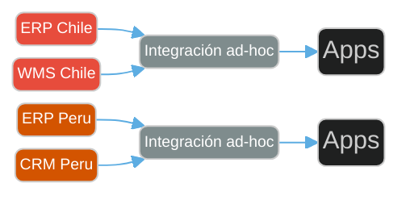
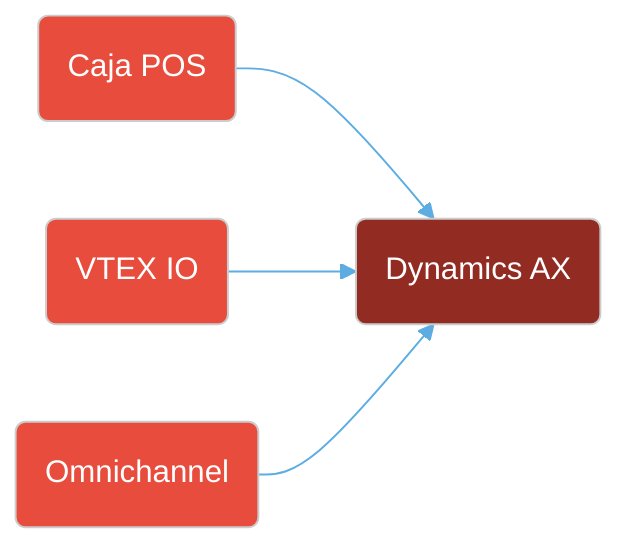
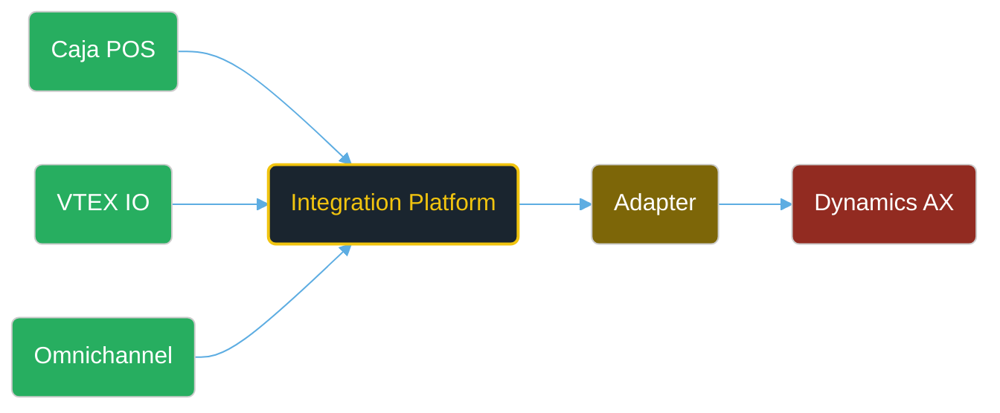
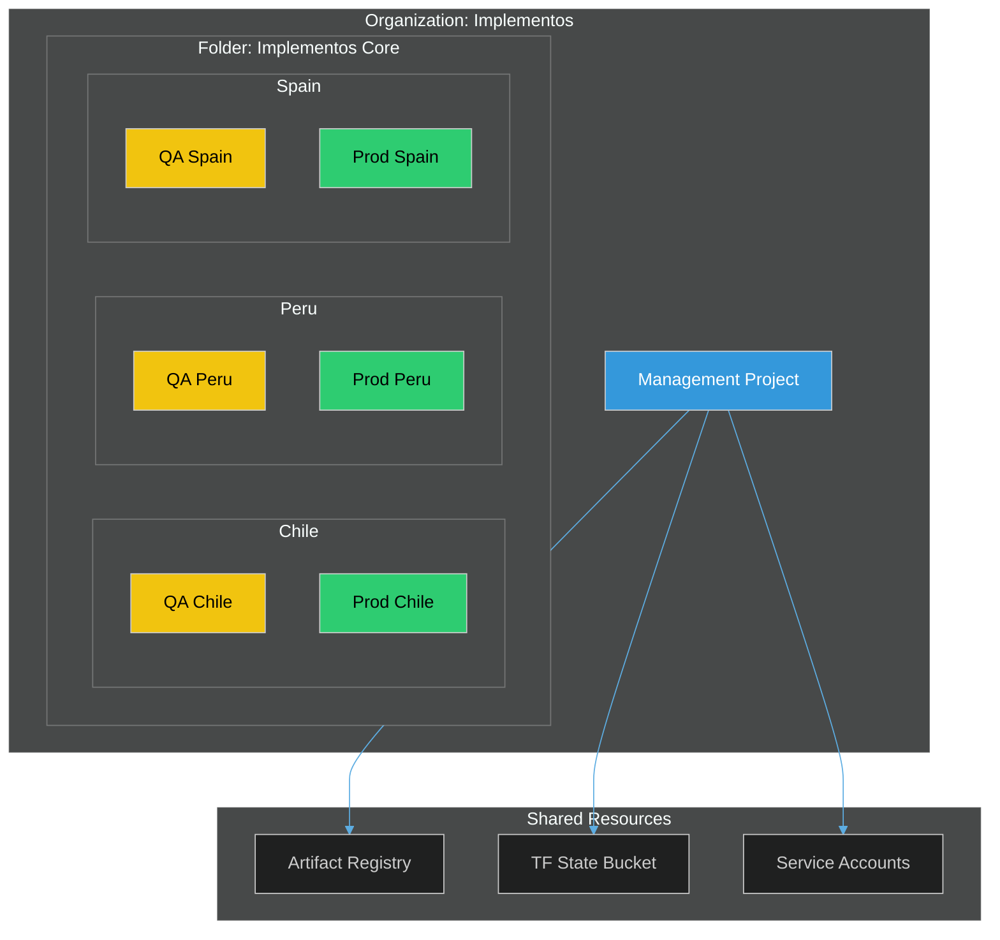
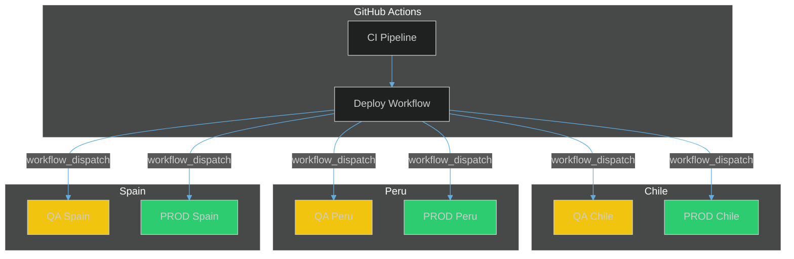
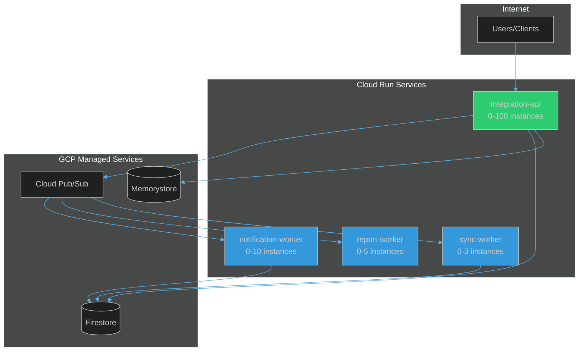
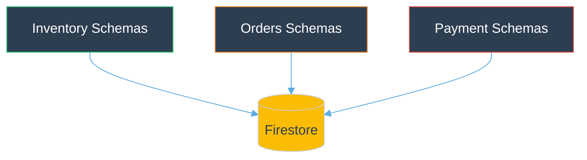

# Integration Platform

### Arquitectura Enterprise Multi-País

 

Implementos

Note:
Bienvenidos. Platform multi-pais. S para speaker notes.

---

## 📋 Agenda

1. **Visión de Negocio** — Problema, solución y arquitectura MACH
2. **La Plataforma** — Aplicaciones, vista C4 y desacoplamiento del ERP
3. **ACL & Multi-ERP** — Adaptadores por país, migración cloud
4. **Infraestructura GCP** — Organización, deployment, Cloud Run, Stack
5. **Patrones Técnicos** — Monolito modular, integraciones externas

Note:
5 secciones, 25 min. Seccion 3 (ACL) es la clave.

---

## 1. Visión de Negocio

> Operaciones en 3 países con sistemas distintos — necesitamos una plataforma composable, escalable y segura

⬇️ _Navega hacia abajo para ver detalles_

Note:
3 paises, sistemas distintos. Plataforma composable.

----

### El Problema

- Operamos en **3 países con aplicaciones y sistemas distintos** — necesitamos unificarlos
- Cada país tiene su propio ERP, WMS, CRM → **no podemos intercambiar componentes** de software fácilmente
- Integraciones punto a punto → **frágil, costoso, no escalable**
- No existe una arquitectura que se haga cargo de **conectar correctamente los servicios** de cada aplicación
- Necesitamos una plataforma **composable**: escalable, segura, que permita **poner y sacar piezas de software** de manera rápida y dinámica

Note:
Integraciones ad-hoc, no escalable, no intercambiable.

----

### Capacidades de Negocio

<svg width="1507" height="863" viewBox="0 0 1100 630" xmlns="http://www.w3.org/2000/svg">

  <!-- ═══ ROW 1: Core Systems (headers + post-its) ═══ -->

  <!-- ERP -->
  <rect x="7" y="7" width="164" height="240" rx="7" fill="none" stroke="#5dade2" stroke-width="1"/>
  <text x="89" y="27" text-anchor="middle" fill="#5dade2" font-size="11" font-weight="bold">ERP</text>
  <text x="89" y="41" text-anchor="middle" fill="#5dade2" font-size="11">Planif. Recursos Empresariales</text>
  <rect x="14" y="49" width="71" height="30" rx="4" fill="#d6eaf8"/><text x="49" y="68" text-anchor="middle" fill="#2c3e50" font-size="11">Cobranzas</text>
  <rect x="90" y="49" width="71" height="30" rx="4" fill="#d6eaf8"/><text x="126" y="68" text-anchor="middle" fill="#2c3e50" font-size="11">Finanzas</text>
  <rect x="14" y="85" width="71" height="30" rx="4" fill="#d6eaf8"/><text x="49" y="104" text-anchor="middle" fill="#2c3e50" font-size="11">Pago proveed.</text>
  <rect x="90" y="85" width="71" height="30" rx="4" fill="#d6eaf8"/><text x="126" y="104" text-anchor="middle" fill="#2c3e50" font-size="11">Desarrollo</text>
  <rect x="14" y="121" width="71" height="30" rx="4" fill="#d6eaf8"/><text x="49" y="140" text-anchor="middle" fill="#2c3e50" font-size="11">Contabilidad</text>
  <rect x="90" y="121" width="71" height="30" rx="4" fill="#d6eaf8"/><text x="126" y="140" text-anchor="middle" fill="#2c3e50" font-size="11">Proveedores</text>
  <rect x="14" y="156" width="71" height="30" rx="4" fill="#d6eaf8"/><text x="49" y="175" text-anchor="middle" fill="#2c3e50" font-size="11">Tesorería</text>
  <rect x="90" y="156" width="71" height="30" rx="4" fill="#d6eaf8"/><text x="126" y="175" text-anchor="middle" fill="#2c3e50" font-size="11">Gst. compra</text>
  <rect x="14" y="192" width="71" height="30" rx="4" fill="#d6eaf8"/><text x="49" y="211" text-anchor="middle" fill="#2c3e50" font-size="11">Inventarios</text>

  <!-- SCM -->
  <rect x="178" y="7" width="144" height="240" rx="7" fill="none" stroke="#5dade2" stroke-width="1"/>
  <text x="249" y="27" text-anchor="middle" fill="#5dade2" font-size="11" font-weight="bold">SCM</text>
  <text x="249" y="41" text-anchor="middle" fill="#5dade2" font-size="11">Cadena Suministro</text>
  <rect x="185" y="49" width="127" height="30" rx="4" fill="#b3e6cc"/><text x="248" y="68" text-anchor="middle" fill="#2c3e50" font-size="11">Planif. demanda</text>
  <rect x="185" y="85" width="127" height="30" rx="4" fill="#b3e6cc"/><text x="248" y="104" text-anchor="middle" fill="#2c3e50" font-size="11">Planif. compras</text>
  <rect x="185" y="121" width="127" height="30" rx="4" fill="#b3e6cc"/><text x="248" y="140" text-anchor="middle" fill="#2c3e50" font-size="11">Planif. reposición</text>

  <!-- SALES -->
  <rect x="329" y="7" width="171" height="240" rx="7" fill="none" stroke="#1abc9c" stroke-width="1"/>
  <text x="414" y="27" text-anchor="middle" fill="#1abc9c" font-size="11" font-weight="bold">SALES</text>
  <text x="414" y="41" text-anchor="middle" fill="#1abc9c" font-size="11">Sistemas de Venta</text>
  <rect x="336" y="49" width="75" height="41" rx="4" fill="#a3e4d7"/><text x="373" y="68" text-anchor="middle" fill="#2c3e50" font-size="11">POS &amp;</text><text x="373" y="79" text-anchor="middle" fill="#2c3e50" font-size="11">Caja</text>
  <rect x="416" y="49" width="75" height="41" rx="4" fill="#a3e4d7"/><text x="453" y="68" text-anchor="middle" fill="#2c3e50" font-size="11">Pedidos &amp;</text><text x="453" y="79" text-anchor="middle" fill="#2c3e50" font-size="11">Devoluc.</text>
  <rect x="336" y="99" width="75" height="36" rx="4" fill="#2ecc71"/><text x="373" y="121" text-anchor="middle" fill="white" font-size="11">Gst. Venver</text>
  <rect x="416" y="99" width="75" height="36" rx="4" fill="#2ecc71"/><text x="453" y="121" text-anchor="middle" fill="white" font-size="11">Pedidos B2B</text>

  <!-- CRM -->
  <rect x="507" y="7" width="164" height="240" rx="7" fill="none" stroke="#1abc9c" stroke-width="1"/>
  <text x="589" y="27" text-anchor="middle" fill="#1abc9c" font-size="11" font-weight="bold">CRM</text>
  <text x="589" y="41" text-anchor="middle" fill="#1abc9c" font-size="11">Gestión Relación Clientes</text>
  <rect x="514" y="49" width="71" height="36" rx="4" fill="#a3e4d7"/><text x="549" y="68" text-anchor="middle" fill="#2c3e50" font-size="11">Clientes &amp;</text><text x="549" y="78" text-anchor="middle" fill="#2c3e50" font-size="6">fidelización</text>
  <rect x="590" y="49" width="71" height="36" rx="4" fill="#a3e4d7"/><text x="626" y="68" text-anchor="middle" fill="#2c3e50" font-size="11">Campañas</text><text x="626" y="78" text-anchor="middle" fill="#2c3e50" font-size="6">multicanal</text>
  <rect x="514" y="93" width="71" height="36" rx="4" fill="#2ecc71"/><text x="549" y="112" text-anchor="middle" fill="white" font-size="11">Atención</text><text x="549" y="122" text-anchor="middle" fill="white" font-size="6">cliente</text>
  <rect x="590" y="93" width="71" height="36" rx="4" fill="#a3e4d7"/><text x="626" y="112" text-anchor="middle" fill="#2c3e50" font-size="11">Televenta</text><text x="626" y="122" text-anchor="middle" fill="#2c3e50" font-size="6">call center</text>

  <!-- ECOMMERCE -->
  <rect x="678" y="7" width="151" height="240" rx="7" fill="none" stroke="#a569bd" stroke-width="1"/>
  <text x="754" y="27" text-anchor="middle" fill="#a569bd" font-size="13" font-weight="bold">ECOMMERCE</text>
  <text x="754" y="41" text-anchor="middle" fill="#a569bd" font-size="11">Comercio Electrónico</text>
  <rect x="685" y="49" width="134" height="36" rx="4" fill="#82e0aa"/><text x="752" y="71" text-anchor="middle" fill="#2c3e50" font-size="11">Gst. ecommerce B2C</text>
  <rect x="685" y="93" width="134" height="36" rx="4" fill="#82e0aa"/><text x="752" y="115" text-anchor="middle" fill="#2c3e50" font-size="11">Gst. precios y promos</text>

  <!-- MARKETPLACES -->
  <rect x="836" y="7" width="253" height="240" rx="7" fill="none" stroke="#a569bd" stroke-width="1"/>
  <text x="962" y="27" text-anchor="middle" fill="#a569bd" font-size="13" font-weight="bold">MARKETPLACES</text>
  <text x="962" y="41" text-anchor="middle" fill="#a569bd" font-size="11">Mercados en Línea</text>
  <rect x="843" y="49" width="123" height="36" rx="4" fill="#82e0aa"/><text x="904" y="71" text-anchor="middle" fill="#2c3e50" font-size="11">Gst. precios y promos</text>

  <!-- ═══ ROW 2: Operational Systems ═══ -->

  <!-- WMS -->
  <rect x="7" y="260" width="164" height="151" rx="7" fill="none" stroke="#5dade2" stroke-width="1"/>
  <text x="89" y="281" text-anchor="middle" fill="#5dade2" font-size="13" font-weight="bold">WMS</text>
  <text x="89" y="292" text-anchor="middle" fill="#5dade2" font-size="11">Gestión Almacenes</text>
  <rect x="14" y="301" width="71" height="36" rx="4" fill="#b3e6cc"/><text x="49" y="321" text-anchor="middle" fill="#2c3e50" font-size="11">Planif.</text><text x="49" y="330" text-anchor="middle" fill="#2c3e50" font-size="6">demanda</text>
  <rect x="90" y="301" width="71" height="36" rx="4" fill="#b3e6cc"/><text x="126" y="321" text-anchor="middle" fill="#2c3e50" font-size="11">Recepción</text><text x="126" y="330" text-anchor="middle" fill="#2c3e50" font-size="6">almac.</text>
  <rect x="14" y="342" width="71" height="36" rx="4" fill="#b3e6cc"/><text x="49" y="364" text-anchor="middle" fill="#2c3e50" font-size="11">Devoluciones</text>
  <rect x="90" y="342" width="71" height="36" rx="4" fill="#b3e6cc"/><text x="126" y="364" text-anchor="middle" fill="#2c3e50" font-size="11">Picking</text><text x="126" y="374" text-anchor="middle" fill="#2c3e50" font-size="6">packing</text>

  <!-- OMS -->
  <rect x="178" y="260" width="171" height="151" rx="7" fill="none" stroke="#2ecc71" stroke-width="1"/>
  <text x="263" y="281" text-anchor="middle" fill="#2ecc71" font-size="13" font-weight="bold">OMS</text>
  <text x="263" y="292" text-anchor="middle" fill="#2ecc71" font-size="11">Órdenes Omnicanal</text>
  <rect x="185" y="301" width="75" height="36" rx="4" fill="#2ecc71"/><text x="222" y="321" text-anchor="middle" fill="white" font-size="11">Promesa</text><text x="222" y="330" text-anchor="middle" fill="white" font-size="6">al cliente</text>
  <rect x="266" y="301" width="75" height="36" rx="4" fill="#a3e4d7"/><text x="303" y="321" text-anchor="middle" fill="#2c3e50" font-size="11">Track &amp;</text><text x="303" y="330" text-anchor="middle" fill="#2c3e50" font-size="6">trace</text>
  <rect x="185" y="342" width="75" height="36" rx="4" fill="#2ecc71"/><text x="222" y="364" text-anchor="middle" fill="white" font-size="11">Gst. omni-</text><text x="222" y="374" text-anchor="middle" fill="white" font-size="6">canalidad</text>

  <!-- PIM -->
  <rect x="356" y="260" width="171" height="151" rx="7" fill="none" stroke="#2ecc71" stroke-width="1"/>
  <text x="441" y="281" text-anchor="middle" fill="#2ecc71" font-size="13" font-weight="bold">PIM</text>
  <text x="441" y="292" text-anchor="middle" fill="#2ecc71" font-size="11">Información Productos</text>
  <rect x="363" y="301" width="75" height="36" rx="4" fill="#2ecc71"/><text x="400" y="321" text-anchor="middle" fill="white" font-size="11">Catálogo</text><text x="400" y="330" text-anchor="middle" fill="white" font-size="6">productos</text>
  <rect x="444" y="301" width="75" height="36" rx="4" fill="#82e0aa"/><text x="481" y="323" text-anchor="middle" fill="#2c3e50" font-size="11">Golden Gate</text>
  <rect x="363" y="342" width="75" height="36" rx="4" fill="#2ecc71"/><text x="400" y="362" text-anchor="middle" fill="white" font-size="11">Planif.</text><text x="400" y="371" text-anchor="middle" fill="white" font-size="6">surtido</text>

  <!-- PRECIOS/PROMOS -->
  <rect x="534" y="260" width="130" height="96" rx="7" fill="none" stroke="#a569bd" stroke-width="1"/>
  <text x="599" y="281" text-anchor="middle" fill="#a569bd" font-size="13" font-weight="bold">PRECIOS</text>
  <rect x="541" y="295" width="116" height="36" rx="4" fill="#82e0aa"/><text x="599" y="316" text-anchor="middle" fill="#2c3e50" font-size="11">Gst. precios y promos</text>

  <!-- COBRANZAS -->
  <rect x="671" y="260" width="130" height="96" rx="7" fill="none" stroke="#5dade2" stroke-width="1"/>
  <text x="736" y="281" text-anchor="middle" fill="#5dade2" font-size="13" font-weight="bold">COBRANZAS</text>
  <rect x="678" y="295" width="116" height="36" rx="4" fill="#82e0aa"/><text x="736" y="316" text-anchor="middle" fill="#2c3e50" font-size="11">Portal cobranzas</text>

  <!-- INCENTIVOS -->
  <rect x="808" y="260" width="130" height="96" rx="7" fill="none" stroke="#a569bd" stroke-width="1"/>
  <text x="873" y="281" text-anchor="middle" fill="#a569bd" font-size="13" font-weight="bold">INCENTIVOS</text>
  <rect x="815" y="295" width="116" height="36" rx="4" fill="#82e0aa"/><text x="873" y="316" text-anchor="middle" fill="#2c3e50" font-size="11">Incentivos &amp; comis.</text>

  <!-- ═══ ROW 3: Logistics & Support ═══ -->

  <!-- Apoyo Tienda -->
  <rect x="7" y="425" width="164" height="82" rx="7" fill="none" stroke="#5dade2" stroke-width="1"/>
  <text x="89" y="445" text-anchor="middle" fill="#5dade2" font-size="13" font-weight="bold">APOYO TIENDA</text>
  <rect x="14" y="455" width="71" height="33" rx="4" fill="#a3e4d7"/><text x="49" y="475" text-anchor="middle" fill="#2c3e50" font-size="11">Gst. tienda</text>
  <rect x="90" y="455" width="71" height="33" rx="4" fill="#a3e4d7"/><text x="126" y="475" text-anchor="middle" fill="#2c3e50" font-size="11">Layout flejes</text>

  <!-- TMS / LMD -->
  <rect x="178" y="425" width="267" height="82" rx="7" fill="none" stroke="#2ecc71" stroke-width="1"/>
  <text x="311" y="445" text-anchor="middle" fill="#2ecc71" font-size="13" font-weight="bold">TMS / ÚLTIMA MILLA</text>
  <rect x="185" y="455" width="79" height="33" rx="4" fill="#a3e4d7"/><text x="225" y="471" text-anchor="middle" fill="#2c3e50" font-size="6">Planif. rutas</text><text x="225" y="482" text-anchor="middle" fill="#2c3e50" font-size="6">y horarios</text>
  <rect x="270" y="455" width="79" height="33" rx="4" fill="#a3e4d7"/><text x="310" y="471" text-anchor="middle" fill="#2c3e50" font-size="6">Consolidac.</text><text x="310" y="482" text-anchor="middle" fill="#2c3e50" font-size="6">envíos</text>
  <rect x="355" y="455" width="79" height="33" rx="4" fill="#a3e4d7"/><text x="395" y="471" text-anchor="middle" fill="#2c3e50" font-size="6">Control</text><text x="395" y="482" text-anchor="middle" fill="#2c3e50" font-size="6">proveedores</text>

  <!-- ═══ BARS ═══ -->

  <!-- IA/RPA -->
  <rect x="7" y="527" width="1082" height="34" rx="7" fill="#1a252f" stroke="#f1c40f" stroke-width="3"/>
  <text x="548" y="551" text-anchor="middle" fill="#f1c40f" font-size="12" font-weight="bold">IA ARTIFICIAL / RPA (Robotic Process Automation)</text>

  <!-- Integration Platform -->
  <rect x="7" y="575" width="1082" height="41" rx="7" fill="#1a252f" stroke="#e74c3c" stroke-width="3"/>
  <text x="548" y="603" text-anchor="middle" fill="#e74c3c" font-size="13" font-weight="bold">INTEGRATION PLATFORM — Conecta todos estos componentes</text>

</svg>

Note:
40+ subsistemas. La barra roja los conecta.

----

### La Solución: Plataforma Composable y Modular

<svg width="750" height="280" viewBox="0 0 750 280" xmlns="http://www.w3.org/2000/svg">

  <!-- 3 pillars -->
  <rect x="20" y="20" width="220" height="120" rx="8" fill="#1a5276"/>
  <text x="130" y="55" text-anchor="middle" fill="white" font-size="14" font-weight="bold">ERP</text>
  <text x="130" y="78" text-anchor="middle" fill="#bdc3c7" font-size="9">Sistemas transaccionales</text>
  <text x="130" y="95" text-anchor="middle" fill="#bdc3c7" font-size="9">y de soporte (back office)</text>
  <text x="130" y="118" text-anchor="middle" fill="#7f8c8d" font-size="8">Procesos estándar, cumplimiento</text>

  <rect x="265" y="20" width="220" height="120" rx="8" fill="#1a5276"/>
  <text x="375" y="48" text-anchor="middle" fill="white" font-size="13" font-weight="bold">Soluciones de</text>
  <text x="375" y="66" text-anchor="middle" fill="white" font-size="13" font-weight="bold">Mercado</text>
  <text x="375" y="90" text-anchor="middle" fill="#bdc3c7" font-size="9">Donde el ERP no cubre:</text>
  <text x="375" y="106" text-anchor="middle" fill="#bdc3c7" font-size="9">WMS, CRM, VTEX, Salesforce</text>
  <text x="375" y="125" text-anchor="middle" fill="#7f8c8d" font-size="8">Herramientas de nicho</text>

  <rect x="510" y="20" width="220" height="120" rx="8" fill="#1a5276"/>
  <text x="620" y="48" text-anchor="middle" fill="white" font-size="13" font-weight="bold">Desarrollos</text>
  <text x="620" y="66" text-anchor="middle" fill="white" font-size="13" font-weight="bold">Propios</text>
  <text x="620" y="90" text-anchor="middle" fill="#bdc3c7" font-size="9">Sistemas que nos diferencian</text>
  <text x="620" y="106" text-anchor="middle" fill="#bdc3c7" font-size="9">de la competencia</text>
  <text x="620" y="125" text-anchor="middle" fill="#7f8c8d" font-size="8">Diferenciación, adaptación rápida</text>

  <!-- Integration Platform bar -->
  <rect x="20" y="160" width="710" height="50" rx="8" fill="#1a252f" stroke="#f1c40f" stroke-width="3"/>
  <text x="375" y="185" text-anchor="middle" fill="#f1c40f" font-size="14" font-weight="bold">Integration Platform — Conectividad, Escalabilidad, Diferenciación</text>
  <text x="375" y="202" text-anchor="middle" fill="#7f8c8d" font-size="9">Arquitectura composable: poner y sacar piezas de software de manera dinámica</text>

  <!-- Arrows down -->
  <line x1="130" y1="140" x2="130" y2="160" stroke="#f1c40f" stroke-width="2" marker-end="url(#arrowSol)"/>
  <line x1="375" y1="140" x2="375" y2="160" stroke="#f1c40f" stroke-width="2" marker-end="url(#arrowSol)"/>
  <line x1="620" y1="140" x2="620" y2="160" stroke="#f1c40f" stroke-width="2" marker-end="url(#arrowSol)"/>

  <!-- Bottom: countries -->
  <rect x="100" y="230" width="150" height="35" rx="5" fill="#c0392b"/>
  <text x="175" y="252" text-anchor="middle" fill="white" font-size="10">Chile</text>
  <rect x="300" y="230" width="150" height="35" rx="5" fill="#d35400"/>
  <text x="375" y="252" text-anchor="middle" fill="white" font-size="10">Peru</text>
  <rect x="500" y="230" width="150" height="35" rx="5" fill="#2980b9"/>
  <text x="575" y="252" text-anchor="middle" fill="white" font-size="10">España</text>

  <line x1="375" y1="210" x2="175" y2="230" stroke="#f1c40f" stroke-width="1" marker-end="url(#arrowSol)"/>
  <line x1="375" y1="210" x2="375" y2="230" stroke="#f1c40f" stroke-width="1" marker-end="url(#arrowSol)"/>
  <line x1="375" y1="210" x2="575" y2="230" stroke="#f1c40f" stroke-width="1" marker-end="url(#arrowSol)"/>

  <defs>
    <marker id="arrowSol" markerWidth="8" markerHeight="8" refX="7" refY="3" orient="auto">
      <path d="M0,0 L0,6 L8,3 z" fill="#f1c40f"/>
    </marker>
  </defs>
</svg>

Note:
ERP + Soluciones mercado + Desarrollos propios. Composable.

----

### Pilares Estratégicos

| Pilar | Objetivo |
|-------|----------|
| **Modularidad & Integración** | Sistemas modulares comunes para una propuesta de valor coherente (ERP, WMS, CRM) |
| **Nube & Resiliencia** | Disponibilidad y escalabilidad para asegurar estabilidad y crecimiento |
| **Datos & Decisión** | Información única para decisiones ágiles. Integridad de clientes, operaciones, inventario |
| **Seguridad Integral** | Protección proactiva y monitoreo continuo |

> **Infraestructura de integración resiliente y estandarizada, basada en nube híbrida**

Note:
Modularidad, nube, datos, seguridad.

----

### Lineamientos

- Profundizar el trabajo de **arquitectura que permita escalar y replicar** soluciones entre países
- Avanzar hacia mayor **estandarización, trazabilidad y gobernanza** tecnológica
- Solucionar problemáticas de Peru y España que hoy **limitan el crecimiento** y control del negocio

Note:
Escalar entre paises, estandarizar, resolver Peru/Espana.

----

### Arquitectura MACH

**M** — Microservices (Monolito Modular, boundaries extractables)

**A** — API-first (REST, OpenAPI, Swagger)

**C** — Cloud-native (GCP Cloud Run, serverless, auto-scaling)

**H** — Headless (API como producto, frontends desacoplados: VTEX IO + Dashboard Angular)

> Adoptado por VTEX, Commercetools, Contentful — estándar enterprise e-commerce

Note:
MACH: Microservices, API-first, Cloud-native, Headless.

---

## 2. La Plataforma

> 4 capas horizontales: Consumidores, Plataforma, Mensajería, Backends

⬇️ _Navega hacia abajo para ver detalles_

Note:
Vista de pajaro. Consumidores arriba, infra abajo.

----

### Aplicaciones que Consumen la Plataforma

<svg width="800" height="380" viewBox="0 0 800 380" xmlns="http://www.w3.org/2000/svg">
  <!-- Apps row -->
  <rect x="30" y="20" width="100" height="55" rx="8" fill="#3498db"/>
  <text x="80" y="42" text-anchor="middle" fill="white" font-size="11" font-weight="bold">Caja POS</text>
  <text x="80" y="58" text-anchor="middle" fill="#d5e8f7" font-size="9">Punto de Venta</text>

  <rect x="155" y="20" width="100" height="55" rx="8" fill="#9b59b6"/>
  <text x="205" y="42" text-anchor="middle" fill="white" font-size="11" font-weight="bold">Omnichannel</text>
  <text x="205" y="58" text-anchor="middle" fill="#e8d5f5" font-size="9">OMS Unificado</text>

  <rect x="280" y="20" width="100" height="55" rx="8" fill="#2ecc71"/>
  <text x="330" y="42" text-anchor="middle" fill="white" font-size="11" font-weight="bold">VTEX IO</text>
  <text x="330" y="58" text-anchor="middle" fill="#d5f5e3" font-size="9">E-Commerce</text>

  <rect x="405" y="20" width="100" height="55" rx="8" fill="#e67e22"/>
  <text x="455" y="42" text-anchor="middle" fill="white" font-size="11" font-weight="bold">PIM</text>
  <text x="455" y="58" text-anchor="middle" fill="#fdebd0" font-size="9">Product Info</text>

  <rect x="530" y="20" width="110" height="55" rx="8" fill="#00a1e0"/>
  <text x="585" y="42" text-anchor="middle" fill="white" font-size="11" font-weight="bold">Salesforce</text>
  <text x="585" y="58" text-anchor="middle" fill="#cceeff" font-size="9">Marketing Cloud</text>

  <!-- Arrows down -->
  <line x1="80" y1="75" x2="80" y2="120" stroke="#3498db" stroke-width="2" marker-end="url(#arrowBlue)"/>
  <line x1="205" y1="75" x2="205" y2="120" stroke="#9b59b6" stroke-width="2" marker-end="url(#arrowBlue)"/>
  <line x1="330" y1="75" x2="330" y2="120" stroke="#2ecc71" stroke-width="2" marker-end="url(#arrowBlue)"/>
  <line x1="455" y1="75" x2="455" y2="120" stroke="#e67e22" stroke-width="2" marker-end="url(#arrowBlue)"/>
  <line x1="585" y1="75" x2="585" y2="120" stroke="#00a1e0" stroke-width="2" marker-end="url(#arrowBlue)"/>

  <!-- Integration Platform box -->
  <rect x="20" y="120" width="760" height="130" rx="10" fill="#1a252f" stroke="#f1c40f" stroke-width="3"/>
  <text x="400" y="148" text-anchor="middle" fill="#f1c40f" font-size="16" font-weight="bold">Integration Platform (Integration API)</text>

  <!-- Internal modules -->
  <rect x="40" y="160" width="80" height="35" rx="5" fill="#2c3e50" stroke="#3498db" stroke-width="1"/>
  <text x="80" y="182" text-anchor="middle" fill="#3498db" font-size="9">Catalog</text>

  <rect x="130" y="160" width="80" height="35" rx="5" fill="#2c3e50" stroke="#2ecc71" stroke-width="1"/>
  <text x="170" y="182" text-anchor="middle" fill="#2ecc71" font-size="9">Inventory</text>

  <rect x="220" y="160" width="80" height="35" rx="5" fill="#2c3e50" stroke="#e67e22" stroke-width="1"/>
  <text x="260" y="182" text-anchor="middle" fill="#e67e22" font-size="9">Orders</text>

  <rect x="310" y="160" width="80" height="35" rx="5" fill="#2c3e50" stroke="#e74c3c" stroke-width="1"/>
  <text x="350" y="182" text-anchor="middle" fill="#e74c3c" font-size="9">Payment</text>

  <rect x="400" y="160" width="80" height="35" rx="5" fill="#2c3e50" stroke="#9b59b6" stroke-width="1"/>
  <text x="440" y="182" text-anchor="middle" fill="#9b59b6" font-size="9">Customer</text>

  <rect x="490" y="160" width="80" height="35" rx="5" fill="#2c3e50" stroke="#1abc9c" stroke-width="1"/>
  <text x="530" y="182" text-anchor="middle" fill="#1abc9c" font-size="9">Logistics</text>

  <rect x="580" y="160" width="80" height="35" rx="5" fill="#2c3e50" stroke="#f39c12" stroke-width="1"/>
  <text x="620" y="182" text-anchor="middle" fill="#f39c12" font-size="9">Notification</text>

  <rect x="670" y="160" width="90" height="35" rx="5" fill="#2c3e50" stroke="#ecf0f1" stroke-width="1"/>
  <text x="715" y="182" text-anchor="middle" fill="#ecf0f1" font-size="9">Shopping Cart</text>

  <!-- Adapter layer -->
  <rect x="40" y="205" width="720" height="30" rx="4" fill="#2c3e50" stroke="#f1c40f" stroke-width="1" stroke-dasharray="4"/>
  <text x="400" y="225" text-anchor="middle" fill="#f1c40f" font-size="10">Adapter Layer — Conectores específicos por país y ERP</text>

  <!-- Country arrows -->
  <line x1="150" y1="250" x2="150" y2="290" stroke="#e74c3c" stroke-width="2" marker-end="url(#arrowBlue)"/>
  <line x1="400" y1="250" x2="400" y2="290" stroke="#f39c12" stroke-width="2" marker-end="url(#arrowBlue)"/>
  <line x1="650" y1="250" x2="650" y2="290" stroke="#3498db" stroke-width="2" marker-end="url(#arrowBlue)"/>

  <!-- ERPs -->
  <rect x="80" y="290" width="140" height="50" rx="8" fill="#c0392b"/>
  <text x="150" y="312" text-anchor="middle" fill="white" font-size="11" font-weight="bold">Dynamics AX</text>
  <text x="150" y="328" text-anchor="middle" fill="#fadbd8" font-size="9">Chile</text>

  <rect x="330" y="290" width="140" height="50" rx="8" fill="#d35400"/>
  <text x="400" y="312" text-anchor="middle" fill="white" font-size="11" font-weight="bold">Custom ERP</text>
  <text x="400" y="328" text-anchor="middle" fill="#fdebd0" font-size="9">Peru</text>

  <rect x="580" y="290" width="140" height="50" rx="8" fill="#2980b9"/>
  <text x="650" y="312" text-anchor="middle" fill="white" font-size="11" font-weight="bold">Gira</text>
  <text x="650" y="328" text-anchor="middle" fill="#d6eaf8" font-size="9">España</text>

  <defs>
    <marker id="arrowBlue" markerWidth="8" markerHeight="8" refX="7" refY="3" orient="auto">
      <path d="M0,0 L0,6 L8,3 z" fill="#888"/>
    </marker>
  </defs>
</svg>

Note:
Caja, Omnichannel, VTEX IO, PIM, Salesforce consumen la API.

----

<!-- .slide: data-background="#0d1117" -->

### Vista C4 — Contexto del Sistema

<svg width="820" height="500" viewBox="0 0 820 500" xmlns="http://www.w3.org/2000/svg" style="max-height: 550px;">

  <!-- Layer 1: Consumers -->
  <rect x="10" y="10" width="800" height="85" rx="8" fill="none" stroke="#3498db" stroke-width="1" stroke-dasharray="6"/>
  <text x="20" y="30" fill="#3498db" font-size="11" font-weight="bold">CONSUMIDORES</text>

  <rect x="20" y="38" width="85" height="45" rx="5" fill="#3498db"/>
  <text x="62" y="58" text-anchor="middle" fill="white" font-size="9" font-weight="bold">Caja POS</text>
  <text x="62" y="72" text-anchor="middle" fill="#d5e8f7" font-size="8">App Móvil</text>

  <rect x="115" y="38" width="85" height="45" rx="5" fill="#3498db"/>
  <text x="157" y="58" text-anchor="middle" fill="white" font-size="9" font-weight="bold">VTEX IO</text>
  <text x="157" y="72" text-anchor="middle" fill="#d5e8f7" font-size="8">E-Commerce</text>

  <rect x="210" y="38" width="85" height="45" rx="5" fill="#3498db"/>
  <text x="252" y="58" text-anchor="middle" fill="white" font-size="9" font-weight="bold">Omnichannel</text>
  <text x="252" y="72" text-anchor="middle" fill="#d5e8f7" font-size="8">OMS Interno</text>

  <rect x="305" y="38" width="85" height="45" rx="5" fill="#3498db"/>
  <text x="347" y="58" text-anchor="middle" fill="white" font-size="9" font-weight="bold">PIM</text>
  <text x="347" y="72" text-anchor="middle" fill="#d5e8f7" font-size="8">Producto</text>

  <rect x="400" y="38" width="85" height="45" rx="5" fill="#9b59b6"/>
  <text x="442" y="58" text-anchor="middle" fill="white" font-size="9" font-weight="bold">Webhooks</text>
  <text x="442" y="72" text-anchor="middle" fill="#e8d5f5" font-size="8">Inbound</text>

  <rect x="495" y="38" width="110" height="45" rx="5" fill="#9b59b6"/>
  <text x="550" y="58" text-anchor="middle" fill="white" font-size="9" font-weight="bold">Partners 3rd</text>
  <text x="550" y="72" text-anchor="middle" fill="#e8d5f5" font-size="8">M2M Scoped</text>

  <!-- Arrow zone -->
  <line x1="410" y1="83" x2="410" y2="115" stroke="#7f8c8d" stroke-width="1"/>
  <text x="420" y="105" fill="#7f8c8d" font-size="8">REST / HTTPS</text>

  <!-- Layer 2: Security + LB -->
  <rect x="10" y="115" width="800" height="55" rx="8" fill="none" stroke="#e74c3c" stroke-width="1" stroke-dasharray="6"/>
  <text x="20" y="133" fill="#e74c3c" font-size="11" font-weight="bold">SEGURIDAD & NETWORKING</text>

  <rect x="20" y="140" width="130" height="24" rx="4" fill="#c0392b"/>
  <text x="85" y="156" text-anchor="middle" fill="white" font-size="9">Cloud Run TLS + DDoS</text>

  <rect x="160" y="140" width="120" height="24" rx="4" fill="#e74c3c"/>
  <text x="220" y="156" text-anchor="middle" fill="white" font-size="9">Rate Limiting (Redis)</text>

  <rect x="290" y="140" width="120" height="24" rx="4" fill="#e74c3c"/>
  <text x="350" y="156" text-anchor="middle" fill="white" font-size="9">JWT + API Key Auth</text>

  <rect x="420" y="140" width="120" height="24" rx="4" fill="#e74c3c"/>
  <text x="480" y="156" text-anchor="middle" fill="white" font-size="9">RBAC + Scopes</text>

  <rect x="550" y="140" width="120" height="24" rx="4" fill="#c0392b"/>
  <text x="610" y="156" text-anchor="middle" fill="white" font-size="9">Input Validation</text>

  <rect x="680" y="140" width="120" height="24" rx="4" fill="#c0392b"/>
  <text x="740" y="156" text-anchor="middle" fill="white" font-size="9">VPC + Private Egress</text>

  <!-- Arrow zone -->
  <line x1="410" y1="170" x2="410" y2="195" stroke="#7f8c8d" stroke-width="1"/>

  <!-- Layer 3: Integration API -->
  <rect x="10" y="195" width="800" height="130" rx="8" fill="#1a252f" stroke="#f1c40f" stroke-width="2"/>
  <text x="20" y="215" fill="#f1c40f" font-size="12" font-weight="bold">INTEGRATION PLATFORM — INTEGRATION API (NestJS + Fastify)</text>

  <!-- Modules row 1 -->
  <rect x="25" y="225" width="90" height="30" rx="4" fill="#2c3e50" stroke="#3498db" stroke-width="1"/>
  <text x="70" y="244" text-anchor="middle" fill="#3498db" font-size="9">Catalog</text>

  <rect x="125" y="225" width="90" height="30" rx="4" fill="#2c3e50" stroke="#2ecc71" stroke-width="1"/>
  <text x="170" y="244" text-anchor="middle" fill="#2ecc71" font-size="9">Inventory</text>

  <rect x="225" y="225" width="90" height="30" rx="4" fill="#2c3e50" stroke="#e67e22" stroke-width="1"/>
  <text x="270" y="244" text-anchor="middle" fill="#e67e22" font-size="9">OMS</text>

  <rect x="325" y="225" width="90" height="30" rx="4" fill="#2c3e50" stroke="#e74c3c" stroke-width="1"/>
  <text x="370" y="244" text-anchor="middle" fill="#e74c3c" font-size="9">Payment</text>

  <rect x="425" y="225" width="90" height="30" rx="4" fill="#2c3e50" stroke="#9b59b6" stroke-width="1"/>
  <text x="470" y="244" text-anchor="middle" fill="#9b59b6" font-size="9">Customer</text>

  <rect x="525" y="225" width="90" height="30" rx="4" fill="#2c3e50" stroke="#1abc9c" stroke-width="1"/>
  <text x="570" y="244" text-anchor="middle" fill="#1abc9c" font-size="9">Logistics</text>

  <rect x="625" y="225" width="90" height="30" rx="4" fill="#2c3e50" stroke="#f39c12" stroke-width="1"/>
  <text x="670" y="244" text-anchor="middle" fill="#f39c12" font-size="9">Shopping Cart</text>

  <!-- Modules row 2 -->
  <rect x="25" y="265" width="90" height="30" rx="4" fill="#2c3e50" stroke="#ecf0f1" stroke-width="1"/>
  <text x="70" y="284" text-anchor="middle" fill="#ecf0f1" font-size="9">Notification</text>

  <rect x="125" y="265" width="90" height="30" rx="4" fill="#2c3e50" stroke="#ecf0f1" stroke-width="1"/>
  <text x="170" y="284" text-anchor="middle" fill="#ecf0f1" font-size="9">CMS</text>

  <rect x="225" y="265" width="90" height="30" rx="4" fill="#2c3e50" stroke="#ecf0f1" stroke-width="1"/>
  <text x="270" y="284" text-anchor="middle" fill="#ecf0f1" font-size="9">Documents</text>

  <rect x="325" y="265" width="90" height="30" rx="4" fill="#2c3e50" stroke="#ecf0f1" stroke-width="1"/>
  <text x="370" y="284" text-anchor="middle" fill="#ecf0f1" font-size="9">Storage</text>

  <rect x="425" y="265" width="90" height="30" rx="4" fill="#2c3e50" stroke="#ecf0f1" stroke-width="1"/>
  <text x="470" y="284" text-anchor="middle" fill="#ecf0f1" font-size="9">Articles</text>

  <rect x="525" y="265" width="90" height="30" rx="4" fill="#2c3e50" stroke="#ecf0f1" stroke-width="1"/>
  <text x="570" y="284" text-anchor="middle" fill="#ecf0f1" font-size="9">VTEX Seller</text>

  <!-- Shared layer -->
  <rect x="625" y="265" width="170" height="30" rx="4" fill="#2c3e50" stroke="#f1c40f" stroke-width="1"/>
  <text x="710" y="284" text-anchor="middle" fill="#f1c40f" font-size="9">Shared (Auth, Cache, Logger)</text>

  <!-- Arrow zone -->
  <line x1="200" y1="325" x2="200" y2="355" stroke="#7f8c8d" stroke-width="1"/>
  <line x1="410" y1="325" x2="410" y2="355" stroke="#7f8c8d" stroke-width="1"/>
  <line x1="620" y1="325" x2="620" y2="355" stroke="#7f8c8d" stroke-width="1"/>

  <!-- Layer 4: Messaging + Workers -->
  <rect x="10" y="355" width="395" height="75" rx="8" fill="none" stroke="#2ecc71" stroke-width="1" stroke-dasharray="6"/>
  <text x="20" y="373" fill="#2ecc71" font-size="10" font-weight="bold">WORKERS (Cloud Run Jobs & Services)</text>

  <rect x="20" y="380" width="90" height="24" rx="4" fill="#27ae60"/>
  <text x="65" y="396" text-anchor="middle" fill="white" font-size="8">Pub/Sub</text>

  <rect x="115" y="380" width="85" height="24" rx="4" fill="#27ae60"/>
  <text x="157" y="396" text-anchor="middle" fill="white" font-size="7">Sync Worker</text>

  <rect x="205" y="380" width="85" height="24" rx="4" fill="#27ae60"/>
  <text x="247" y="396" text-anchor="middle" fill="white" font-size="7">Notif Worker</text>

  <rect x="295" y="380" width="105" height="24" rx="4" fill="#27ae60"/>
  <text x="347" y="396" text-anchor="middle" fill="white" font-size="7">Notif Retry Worker</text>

  <rect x="20" y="407" width="95" height="20" rx="4" fill="#1e8449"/>
  <text x="67" y="420" text-anchor="middle" fill="white" font-size="7">Report Worker</text>

  <rect x="120" y="407" width="115" height="20" rx="4" fill="#1e8449"/>
  <text x="177" y="420" text-anchor="middle" fill="white" font-size="7">Pickup Reminder Worker</text>

  <rect x="240" y="407" width="100" height="20" rx="4" fill="#1e8449"/>
  <text x="290" y="420" text-anchor="middle" fill="white" font-size="7">Cloud Scheduler</text>

  <!-- Layer 4b: Data -->
  <rect x="415" y="355" width="395" height="75" rx="8" fill="none" stroke="#f39c12" stroke-width="1" stroke-dasharray="6"/>
  <text x="425" y="373" fill="#f39c12" font-size="10" font-weight="bold">DATOS & CACHE</text>

  <rect x="425" y="380" width="105" height="24" rx="4" fill="#d35400"/>
  <text x="477" y="396" text-anchor="middle" fill="white" font-size="9">Firestore (Mongo)</text>

  <rect x="540" y="380" width="100" height="24" rx="4" fill="#d35400"/>
  <text x="590" y="396" text-anchor="middle" fill="white" font-size="9">Redis Cache</text>

  <rect x="425" y="407" width="180" height="20" rx="4" fill="#a04000"/>
  <text x="515" y="420" text-anchor="middle" fill="white" font-size="7">Salesforce Marketing Cloud</text>

  <rect x="615" y="407" width="90" height="20" rx="4" fill="#a04000"/>
  <text x="660" y="420" text-anchor="middle" fill="white" font-size="7">Twilio / WSP</text>

  <!-- Layer 5: Observability -->
  <rect x="10" y="440" width="800" height="45" rx="8" fill="none" stroke="#95a5a6" stroke-width="1" stroke-dasharray="6"/>
  <text x="20" y="460" fill="#95a5a6" font-size="10" font-weight="bold">OBSERVABILIDAD</text>

  <rect x="130" y="453" width="110" height="24" rx="4" fill="#7f8c8d"/>
  <text x="185" y="469" text-anchor="middle" fill="white" font-size="9">Pino Structured Logs</text>

  <rect x="250" y="453" width="110" height="24" rx="4" fill="#7f8c8d"/>
  <text x="305" y="469" text-anchor="middle" fill="white" font-size="9">OpenTelemetry</text>

  <rect x="370" y="453" width="130" height="24" rx="4" fill="#FF6F00"/>
  <text x="435" y="469" text-anchor="middle" fill="white" font-size="9">Grafana Cloud (OTLP)</text>

  <rect x="510" y="453" width="110" height="24" rx="4" fill="#362D59"/>
  <text x="565" y="469" text-anchor="middle" fill="white" font-size="9">Sentry</text>

  <rect x="630" y="453" width="110" height="24" rx="4" fill="#7f8c8d"/>
  <text x="685" y="469" text-anchor="middle" fill="white" font-size="9">Cloud Logging</text>

</svg>

Note:
De arriba a abajo: consumidores, seguridad, API, workers, datos.

----

### Beneficio: Desacoplamiento del ERP

Note:
La plataforma actúa como capa de abstracción entre las aplicaciones y los ERPs.

---

## 3. ACL & Multi-ERP

> Adapter Pattern: misma lógica de negocio, conectores específicos por país

⬇️ _Navega hacia abajo para ver detalles_

Note:
SECCION CLAVE. Como cambiamos de ERP sin tocar la plataforma.

----

### ACL — Estado Actual (On-Premise)

<svg width="800" height="420" viewBox="0 0 800 420" xmlns="http://www.w3.org/2000/svg">

  <!-- CLOUD zone -->
  <rect x="10" y="10" width="340" height="230" rx="10" fill="none" stroke="#4285f4" stroke-width="2" stroke-dasharray="8"/>
  <text x="20" y="30" fill="#4285f4" font-size="12" font-weight="bold">CLOUD (GCP)</text>

  <!-- Integration API -->
  <rect x="25" y="45" width="180" height="55" rx="8" fill="#1a252f" stroke="#f1c40f" stroke-width="2"/>
  <text x="115" y="68" text-anchor="middle" fill="#f1c40f" font-size="11" font-weight="bold">Integration API</text>
  <text x="115" y="85" text-anchor="middle" fill="#7f8c8d" font-size="8">Lógica de negocio</text>

  <!-- Sync Worker -->
  <rect x="25" y="120" width="180" height="50" rx="8" fill="#1a252f" stroke="#27ae60" stroke-width="2"/>
  <text x="115" y="143" text-anchor="middle" fill="#27ae60" font-size="10" font-weight="bold">Sync Worker</text>
  <text x="115" y="158" text-anchor="middle" fill="#7f8c8d" font-size="8">Cloud Run Job</text>

  <!-- Firestore -->
  <rect x="25" y="190" width="180" height="40" rx="5" fill="#fbbc04"/>
  <text x="115" y="215" text-anchor="middle" fill="#2c3e50" font-size="10" font-weight="bold">Firestore</text>

  <!-- Internal arrows -->
  <line x1="115" y1="100" x2="115" y2="120" stroke="#7f8c8d" stroke-width="1"/>
  <line x1="115" y1="170" x2="115" y2="190" stroke="#fbbc04" stroke-width="1"/>

  <!-- ON-PREMISE zone -->
  <rect x="410" y="10" width="380" height="400" rx="10" fill="none" stroke="#e74c3c" stroke-width="2" stroke-dasharray="8"/>
  <text x="420" y="30" fill="#e74c3c" font-size="12" font-weight="bold">ON-PREMISE (por país)</text>

  <!-- Chile ACL -->
  <rect x="430" y="45" width="170" height="100" rx="8" fill="#1a252f" stroke="#e74c3c" stroke-width="2"/>
  <text x="515" y="63" text-anchor="middle" fill="#e74c3c" font-size="10" font-weight="bold">ACL Chile</text>
  <rect x="440" y="70" width="150" height="30" rx="4" fill="#c0392b"/>
  <text x="515" y="90" text-anchor="middle" fill="white" font-size="9">DynamicsAxAdapter</text>
  <rect x="440" y="108" width="150" height="28" rx="4" fill="#922b21"/>
  <text x="515" y="126" text-anchor="middle" fill="white" font-size="9">Dynamics AX (AIF/SQL)</text>

  <!-- Peru ACL -->
  <rect x="430" y="160" width="170" height="100" rx="8" fill="#1a252f" stroke="#d35400" stroke-width="2"/>
  <text x="515" y="178" text-anchor="middle" fill="#d35400" font-size="10" font-weight="bold">ACL Peru</text>
  <rect x="440" y="185" width="150" height="30" rx="4" fill="#d35400"/>
  <text x="515" y="205" text-anchor="middle" fill="white" font-size="9">CustomErpAdapter</text>
  <rect x="440" y="223" width="150" height="28" rx="4" fill="#a04000"/>
  <text x="515" y="241" text-anchor="middle" fill="white" font-size="9">Custom ERP (REST)</text>

  <!-- Spain ACL -->
  <rect x="430" y="275" width="170" height="100" rx="8" fill="#1a252f" stroke="#2980b9" stroke-width="2"/>
  <text x="515" y="293" text-anchor="middle" fill="#2980b9" font-size="10" font-weight="bold">ACL España</text>
  <rect x="440" y="300" width="150" height="30" rx="4" fill="#2980b9"/>
  <text x="515" y="320" text-anchor="middle" fill="white" font-size="9">GiraAdapter</text>
  <rect x="440" y="338" width="150" height="28" rx="4" fill="#1a5276"/>
  <text x="515" y="356" text-anchor="middle" fill="white" font-size="9">Gira (API)</text>

  <!-- Arrow Cloud → On-Prem (API → ACL Chile) -->
  <line x1="205" y1="70" x2="430" y2="90" stroke="#5dade2" stroke-width="2" marker-end="url(#arrowACL2)"/>
  <rect x="265" y="55" width="85" height="18" rx="3" fill="#1a1a2e"/>
  <text x="307" y="68" text-anchor="middle" fill="#5dade2" font-size="9" font-weight="bold">REST / gRPC</text>

  <!-- Arrow Cloud → On-Prem (Sync → ACL Chile) -->
  <line x1="205" y1="145" x2="430" y2="115" stroke="#27ae60" stroke-width="2" stroke-dasharray="5" marker-end="url(#arrowACL2)"/>
  <rect x="265" y="118" width="80" height="18" rx="3" fill="#1a1a2e"/>
  <text x="305" y="131" text-anchor="middle" fill="#27ae60" font-size="9" font-weight="bold">sync via ACL</text>

  <!-- Bracket: same codebase -->
  <line x1="620" y1="55" x2="640" y2="55" stroke="#2ecc71" stroke-width="2"/>
  <line x1="640" y1="55" x2="640" y2="365" stroke="#2ecc71" stroke-width="2"/>
  <line x1="620" y1="365" x2="640" y2="365" stroke="#2ecc71" stroke-width="2"/>
  <text x="660" y="200" fill="#2ecc71" font-size="10" font-weight="bold">Misma</text>
  <text x="660" y="215" fill="#2ecc71" font-size="10" font-weight="bold">app ACL</text>
  <text x="660" y="235" fill="#7f8c8d" font-size="9">COUNTRY_CODE</text>
  <text x="660" y="248" fill="#7f8c8d" font-size="9">activa adapter</text>

  <defs>
    <marker id="arrowACL2" markerWidth="8" markerHeight="8" refX="7" refY="3" orient="auto">
      <path d="M0,0 L0,6 L8,3 z" fill="#888"/>
    </marker>
  </defs>
</svg>

Note:
ACL on-premise junto al ERP. Mismo codigo, COUNTRY_CODE activa adapter.

----

### ACL — Migración al ERP Cloud

<svg width="800" height="400" viewBox="0 0 800 400" xmlns="http://www.w3.org/2000/svg">

  <!-- CLOUD zone (expanded) -->
  <rect x="10" y="10" width="780" height="380" rx="10" fill="none" stroke="#4285f4" stroke-width="2" stroke-dasharray="8"/>
  <text x="20" y="30" fill="#4285f4" font-size="11" font-weight="bold">TODO EN CLOUD (GCP)</text>

  <!-- Integration API -->
  <rect x="25" y="50" width="200" height="65" rx="8" fill="#1a252f" stroke="#f1c40f" stroke-width="2"/>
  <text x="125" y="77" text-anchor="middle" fill="#f1c40f" font-size="11" font-weight="bold">Integration API</text>
  <text x="125" y="95" text-anchor="middle" fill="#7f8c8d" font-size="8">0% cambios</text>

  <!-- Sync Worker -->
  <rect x="25" y="140" width="200" height="50" rx="8" fill="#1a252f" stroke="#27ae60" stroke-width="2"/>
  <text x="125" y="168" text-anchor="middle" fill="#27ae60" font-size="10" font-weight="bold">Sync Worker (0% cambios)</text>

  <!-- Firestore -->
  <rect x="25" y="220" width="200" height="45" rx="5" fill="#fbbc04"/>
  <text x="125" y="248" text-anchor="middle" fill="#2c3e50" font-size="10" font-weight="bold">Firestore (0% cambios)</text>

  <!-- ACL (Cloud Run now) -->
  <rect x="300" y="50" width="200" height="110" rx="8" fill="#1a252f" stroke="#2ecc71" stroke-width="3"/>
  <text x="400" y="72" text-anchor="middle" fill="#2ecc71" font-size="12" font-weight="bold">ACL (Cloud Run)</text>
  <rect x="315" y="85" width="170" height="35" rx="4" fill="#27ae60"/>
  <text x="400" y="106" text-anchor="middle" fill="white" font-size="10" font-weight="bold">NewErpCloudAdapter</text>
  <text x="400" y="147" text-anchor="middle" fill="#7f8c8d" font-size="8">1 adapter, 3 configs</text>

  <!-- ERP Cloud Instances -->
  <rect x="570" y="40" width="195" height="80" rx="8" fill="#1e8449"/>
  <text x="667" y="65" text-anchor="middle" fill="white" font-size="10" font-weight="bold">ERP Cloud (Chile)</text>
  <text x="667" y="82" text-anchor="middle" fill="#d5f5e3" font-size="8">config: CL</text>

  <rect x="570" y="135" width="195" height="80" rx="8" fill="#1e8449"/>
  <text x="667" y="160" text-anchor="middle" fill="white" font-size="10" font-weight="bold">ERP Cloud (Peru)</text>
  <text x="667" y="177" text-anchor="middle" fill="#d5f5e3" font-size="8">config: PE</text>

  <rect x="570" y="230" width="195" height="80" rx="8" fill="#1e8449"/>
  <text x="667" y="255" text-anchor="middle" fill="white" font-size="10" font-weight="bold">ERP Cloud (España)</text>
  <text x="667" y="272" text-anchor="middle" fill="#d5f5e3" font-size="8">config: ES</text>

  <!-- Arrows -->
  <line x1="225" y1="82" x2="300" y2="100" stroke="#5dade2" stroke-width="2" marker-end="url(#arrowACL3)"/>
  <line x1="225" y1="165" x2="300" y2="110" stroke="#27ae60" stroke-width="2" marker-end="url(#arrowACL3)"/>
  <line x1="500" y1="90" x2="570" y2="75" stroke="#2ecc71" stroke-width="2" marker-end="url(#arrowACL3)"/>
  <line x1="500" y1="105" x2="570" y2="170" stroke="#2ecc71" stroke-width="2" marker-end="url(#arrowACL3)"/>
  <line x1="500" y1="115" x2="570" y2="265" stroke="#2ecc71" stroke-width="2" marker-end="url(#arrowACL3)"/>

  <!-- Migration summary -->
  <rect x="300" y="200" width="200" height="80" rx="6" fill="none" stroke="#f1c40f" stroke-width="2"/>
  <text x="400" y="222" text-anchor="middle" fill="#f1c40f" font-size="10" font-weight="bold">Cambios requeridos:</text>
  <text x="400" y="240" text-anchor="middle" fill="#2ecc71" font-size="9">✓ 1 nuevo adapter</text>
  <text x="400" y="255" text-anchor="middle" fill="#2ecc71" font-size="9">✓ ACL se mueve a Cloud Run</text>
  <text x="400" y="270" text-anchor="middle" fill="#e74c3c" font-size="9">✗ Integration API: 0 cambios</text>

  <!-- Bottom label -->
  <text x="400" y="370" text-anchor="middle" fill="#2ecc71" font-size="12" font-weight="bold">El ACL migra de on-premise a Cloud Run — la plataforma no cambia</text>

  <defs>
    <marker id="arrowACL3" markerWidth="8" markerHeight="8" refX="7" refY="3" orient="auto">
      <path d="M0,0 L0,6 L8,3 z" fill="#888"/>
    </marker>
  </defs>
</svg>

Note:
ACL migra a Cloud Run. 1 nuevo adapter. Integration API: 0 cambios.

---

## 4. Infraestructura GCP

> GCP Cloud Run: serverless, auto-scaling, zero-ops

⬇️ _Navega hacia abajo para ver detalles_

Note:
Todo managed. Cloud Run, Firestore, Pub/Sub. No Kubernetes.

----

### Estructura Organizacional GCP

Note:
Organization > Folder > Proyectos por pais. Amarillo=QA, Verde=Prod.

----

### Deployment Multi-País

Note:
workflow_dispatch. Mismo codigo, diferente config por pais.

----

### Arquitectura Cloud Run

> **Escala automática**: De 0 a 100+ instancias según load

Note:
integration-api 0-100 inst. Workers por Pub/Sub. Todo auto-scale.

----

### Stack de Infraestructura

<svg width="750" height="400" viewBox="0 0 750 400" xmlns="http://www.w3.org/2000/svg">

  <!-- GCP Cloud -->
  <rect x="10" y="10" width="730" height="380" rx="12" fill="none" stroke="#4285f4" stroke-width="2"/>
  <text x="375" y="35" text-anchor="middle" fill="#4285f4" font-size="14" font-weight="bold">Google Cloud Platform</text>

  <!-- Row 1: Networking -->
  <rect x="30" y="50" width="690" height="55" rx="6" fill="#1a252f"/>
  <text x="50" y="70" fill="#ea4335" font-size="10" font-weight="bold">NETWORKING</text>

  <rect x="160" y="58" width="150" height="35" rx="4" fill="#ea4335"/>
  <text x="235" y="80" text-anchor="middle" fill="white" font-size="9">Cloud Run TLS + DDoS</text>

  <rect x="320" y="58" width="130" height="35" rx="4" fill="#ea4335"/>
  <text x="385" y="80" text-anchor="middle" fill="white" font-size="9">VPC + Direct Egress</text>

  <rect x="460" y="58" width="130" height="35" rx="4" fill="#ea4335"/>
  <text x="525" y="80" text-anchor="middle" fill="white" font-size="9">VPC Peering (Omni)</text>

  <rect x="600" y="58" width="100" height="35" rx="4" fill="#ea4335"/>
  <text x="650" y="80" text-anchor="middle" fill="white" font-size="9">IAM + SA</text>

  <!-- Row 2: Compute -->
  <rect x="30" y="115" width="690" height="70" rx="6" fill="#1a252f"/>
  <text x="50" y="135" fill="#4285f4" font-size="10" font-weight="bold">COMPUTE</text>

  <rect x="160" y="125" width="130" height="50" rx="4" fill="#4285f4"/>
  <text x="225" y="147" text-anchor="middle" fill="white" font-size="10" font-weight="bold">Cloud Run</text>
  <text x="225" y="163" text-anchor="middle" fill="#d5e8f7" font-size="8">Integration API + Workers</text>

  <rect x="300" y="125" width="130" height="50" rx="4" fill="#4285f4"/>
  <text x="365" y="147" text-anchor="middle" fill="white" font-size="10" font-weight="bold">Cloud Scheduler</text>
  <text x="365" y="163" text-anchor="middle" fill="#d5e8f7" font-size="8">Cron Jobs</text>

  <rect x="440" y="125" width="130" height="50" rx="4" fill="#4285f4"/>
  <text x="505" y="147" text-anchor="middle" fill="white" font-size="10" font-weight="bold">Cloud Tasks</text>
  <text x="505" y="163" text-anchor="middle" fill="#d5e8f7" font-size="8">Async Processing</text>

  <rect x="580" y="125" width="130" height="50" rx="4" fill="#4285f4"/>
  <text x="645" y="147" text-anchor="middle" fill="white" font-size="10" font-weight="bold">Artifact Registry</text>
  <text x="645" y="163" text-anchor="middle" fill="#d5e8f7" font-size="8">Docker Images</text>

  <!-- Row 3: Data -->
  <rect x="30" y="195" width="690" height="65" rx="6" fill="#1a252f"/>
  <text x="50" y="215" fill="#fbbc04" font-size="10" font-weight="bold">DATA</text>

  <rect x="160" y="205" width="120" height="45" rx="4" fill="#fbbc04"/>
  <text x="220" y="224" text-anchor="middle" fill="#2c3e50" font-size="9" font-weight="bold">Firestore</text>
  <text x="220" y="240" text-anchor="middle" fill="#2c3e50" font-size="8">MongoDB API</text>

  <rect x="290" y="205" width="120" height="45" rx="4" fill="#fbbc04"/>
  <text x="350" y="224" text-anchor="middle" fill="#2c3e50" font-size="9" font-weight="bold">Memorystore</text>
  <text x="350" y="240" text-anchor="middle" fill="#2c3e50" font-size="8">Redis Cache</text>

  <rect x="420" y="205" width="120" height="45" rx="4" fill="#fbbc04"/>
  <text x="480" y="224" text-anchor="middle" fill="#2c3e50" font-size="9" font-weight="bold">Secret Manager</text>
  <text x="480" y="240" text-anchor="middle" fill="#2c3e50" font-size="8">Credenciales</text>

  <rect x="550" y="205" width="120" height="45" rx="4" fill="#fbbc04"/>
  <text x="610" y="224" text-anchor="middle" fill="#2c3e50" font-size="9" font-weight="bold">Cloud Storage</text>
  <text x="610" y="240" text-anchor="middle" fill="#2c3e50" font-size="8">Archivos</text>

  <!-- Row 4: Messaging -->
  <rect x="30" y="270" width="340" height="55" rx="6" fill="#1a252f"/>
  <text x="50" y="290" fill="#34a853" font-size="10" font-weight="bold">MESSAGING</text>

  <rect x="160" y="280" width="90" height="35" rx="4" fill="#34a853"/>
  <text x="205" y="302" text-anchor="middle" fill="white" font-size="9">Cloud Pub/Sub</text>

  <rect x="260" y="280" width="100" height="35" rx="4" fill="#34a853"/>
  <text x="310" y="302" text-anchor="middle" fill="white" font-size="9">Dead Letter Queue</text>

  <!-- Row 4b: Observability -->
  <rect x="380" y="270" width="340" height="55" rx="6" fill="#1a252f"/>
  <text x="400" y="290" fill="#95a5a6" font-size="10" font-weight="bold">OBSERVABILITY</text>

  <rect x="510" y="280" width="100" height="35" rx="4" fill="#FF6F00"/>
  <text x="560" y="302" text-anchor="middle" fill="white" font-size="9">Grafana Cloud</text>

  <rect x="620" y="280" width="90" height="35" rx="4" fill="#7f8c8d"/>
  <text x="665" y="302" text-anchor="middle" fill="white" font-size="9">Cloud Logging</text>

  <!-- Row 5: Security -->
  <rect x="30" y="335" width="690" height="45" rx="6" fill="#1a252f"/>
  <text x="50" y="355" fill="#c0392b" font-size="10" font-weight="bold">SECURITY</text>

  <rect x="160" y="343" width="130" height="28" rx="4" fill="#922b21"/>
  <text x="225" y="361" text-anchor="middle" fill="white" font-size="9">Workload Identity (OIDC)</text>

  <rect x="300" y="343" width="130" height="28" rx="4" fill="#922b21"/>
  <text x="365" y="361" text-anchor="middle" fill="white" font-size="9">IAM + Service Accounts</text>

  <rect x="440" y="343" width="130" height="28" rx="4" fill="#922b21"/>
  <text x="505" y="361" text-anchor="middle" fill="white" font-size="9">VPC Peering</text>

  <rect x="580" y="343" width="130" height="28" rx="4" fill="#922b21"/>
  <text x="645" y="361" text-anchor="middle" fill="white" font-size="9">KMS Encryption</text>

</svg>

Note:
Managed services. Preferir managed, self-hosted solo si necesario.

---

## 5. Patrones Técnicos

> Boundaries tan estrictos como microservicios, pero sin el overhead operacional

⬇️ _Navega hacia abajo para ver detalles_

Note:
Monolito modular. Shopify y GitHub tambien. Boundaries extractables.

----

### Regla Fundamental: No Shared State

- **1 Firestore**, pero cada módulo es dueño de sus **colecciones**
- **NUNCA** se importa el schema/repositorio de otro módulo
- Comunicación inter-módulo: **Facade** (sync) o **Evento** (async)

Note:
1 Firestore, cada modulo dueno de sus colecciones. Comunicacion via Facade.

----

### Ecosistema de Integraciones

<svg width="800" height="420" viewBox="0 0 800 420" xmlns="http://www.w3.org/2000/svg">

  <!-- Integration API center -->
  <rect x="270" y="160" width="260" height="80" rx="10" fill="#1a252f" stroke="#f1c40f" stroke-width="3"/>
  <text x="400" y="195" text-anchor="middle" fill="#f1c40f" font-size="14" font-weight="bold">Integration Platform</text>
  <text x="400" y="215" text-anchor="middle" fill="#bdc3c7" font-size="9">Integration API + Workers</text>

  <!-- Marketplace (top) -->
  <rect x="50" y="20" width="150" height="55" rx="8" fill="#9b59b6"/>
  <text x="125" y="42" text-anchor="middle" fill="white" font-size="10" font-weight="bold">VTEX Marketplace</text>
  <text x="125" y="58" text-anchor="middle" fill="#e8d5f5" font-size="8">External Seller Protocol</text>
  <line x1="170" y1="75" x2="310" y2="160" stroke="#9b59b6" stroke-width="2"/>

  <!-- Algolia (top center) -->
  <rect x="310" y="20" width="130" height="55" rx="8" fill="#5468FF"/>
  <text x="375" y="42" text-anchor="middle" fill="white" font-size="10" font-weight="bold">Algolia</text>
  <text x="375" y="58" text-anchor="middle" fill="#c7cfff" font-size="8">Search Engine</text>
  <line x1="375" y1="75" x2="400" y2="160" stroke="#5468FF" stroke-width="2"/>

  <!-- Salesforce (top right) -->
  <rect x="520" y="20" width="160" height="55" rx="8" fill="#00a1e0"/>
  <text x="600" y="42" text-anchor="middle" fill="white" font-size="10" font-weight="bold">Salesforce Marketing</text>
  <text x="600" y="58" text-anchor="middle" fill="#cceeff" font-size="8">Cloud Journey Builder</text>
  <line x1="550" y1="75" x2="470" y2="160" stroke="#00a1e0" stroke-width="2"/>

  <!-- Payment Gateways (left) -->
  <rect x="10" y="110" width="130" height="30" rx="5" fill="#e74c3c"/>
  <text x="75" y="130" text-anchor="middle" fill="white" font-size="9">Webpay / Transbank</text>
  <rect x="10" y="145" width="130" height="30" rx="5" fill="#e74c3c"/>
  <text x="75" y="165" text-anchor="middle" fill="white" font-size="9">Khipu</text>
  <rect x="10" y="180" width="130" height="30" rx="5" fill="#e74c3c"/>
  <text x="75" y="200" text-anchor="middle" fill="white" font-size="9">MercadoPago</text>
  <rect x="10" y="215" width="130" height="30" rx="5" fill="#e74c3c"/>
  <text x="75" y="235" text-anchor="middle" fill="white" font-size="9">Niubiz</text>
  <text x="75" y="262" text-anchor="middle" fill="#e74c3c" font-size="9" font-weight="bold">Payment Gateways</text>
  <line x1="140" y1="175" x2="270" y2="195" stroke="#e74c3c" stroke-width="2"/>

  <!-- ERP (right) -->
  <rect x="660" y="130" width="130" height="30" rx="5" fill="#d35400"/>
  <text x="725" y="150" text-anchor="middle" fill="white" font-size="9">Dynamics AX (CL)</text>
  <rect x="660" y="165" width="130" height="30" rx="5" fill="#d35400"/>
  <text x="725" y="185" text-anchor="middle" fill="white" font-size="9">Custom ERP (PE)</text>
  <rect x="660" y="200" width="130" height="30" rx="5" fill="#d35400"/>
  <text x="725" y="220" text-anchor="middle" fill="white" font-size="9">Gira (ES)</text>
  <text x="725" y="247" text-anchor="middle" fill="#d35400" font-size="9" font-weight="bold">ERPs por País</text>
  <line x1="530" y1="195" x2="660" y2="185" stroke="#d35400" stroke-width="2"/>

  <!-- Messaging (bottom left) -->
  <rect x="80" y="310" width="150" height="55" rx="8" fill="#27ae60"/>
  <text x="155" y="332" text-anchor="middle" fill="white" font-size="10" font-weight="bold">Cloud Pub/Sub</text>
  <text x="155" y="348" text-anchor="middle" fill="#d5f5e3" font-size="8">Event-Driven Messaging</text>
  <line x1="200" y1="310" x2="340" y2="240" stroke="#27ae60" stroke-width="2"/>

  <!-- Databases (bottom center) -->
  <rect x="310" y="300" width="180" height="55" rx="8" fill="#f39c12"/>
  <text x="400" y="322" text-anchor="middle" fill="#2c3e50" font-size="10" font-weight="bold">Databases</text>
  <text x="400" y="340" text-anchor="middle" fill="#2c3e50" font-size="8">Firestore + Redis</text>
  <line x1="400" y1="300" x2="400" y2="240" stroke="#f39c12" stroke-width="2"/>

  <!-- Twilio / WhatsApp (bottom right) -->
  <rect x="560" y="300" width="120" height="28" rx="5" fill="#1abc9c"/>
  <text x="620" y="319" text-anchor="middle" fill="white" font-size="9">Twilio (SMS)</text>
  <rect x="560" y="335" width="120" height="28" rx="5" fill="#1abc9c"/>
  <text x="620" y="354" text-anchor="middle" fill="white" font-size="9">WhatsApp Business</text>
  <rect x="560" y="370" width="120" height="28" rx="5" fill="#1abc9c"/>
  <text x="620" y="389" text-anchor="middle" fill="white" font-size="9">SMTP (Email)</text>
  <text x="620" y="415" text-anchor="middle" fill="#1abc9c" font-size="9" font-weight="bold">Canales Legacy</text>
  <line x1="570" y1="310" x2="470" y2="240" stroke="#1abc9c" stroke-width="2"/>

</svg>

Note:
VTEX, Salesforce, Algolia, 4 gateways pago, 3 ERPs, Pub/Sub.

---

<!-- .slide: data-background="#1a1a2e" -->

# Preguntas

Note:
Por que no microservicios? Equipo pequeno + Shopify/GitHub tambien.
