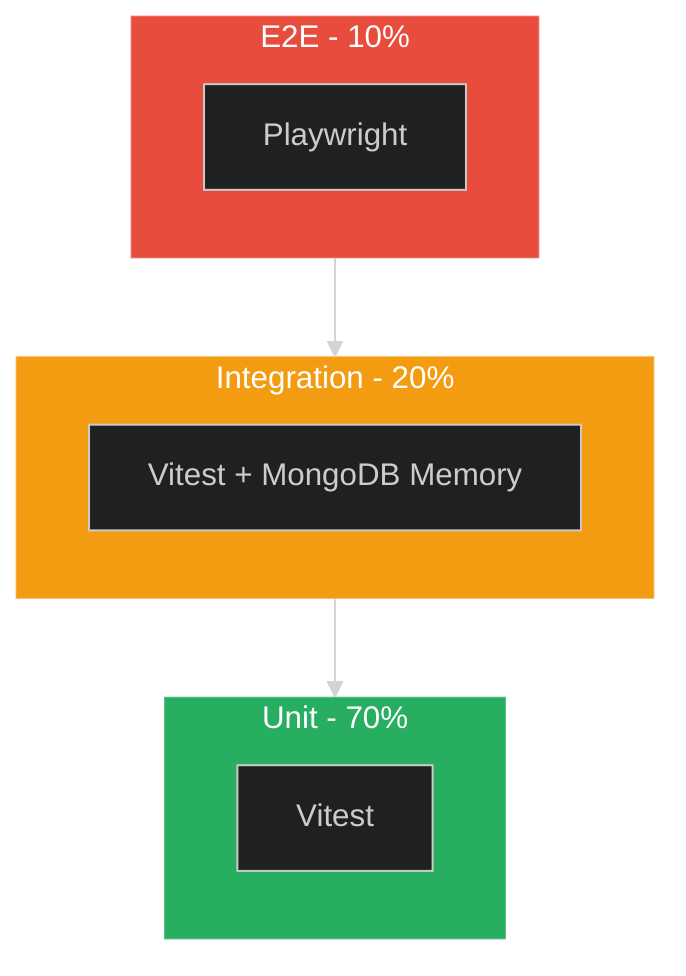
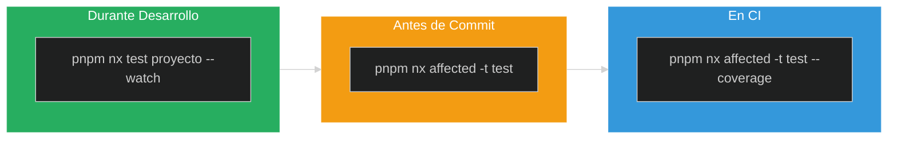

# Testing Patterns

### Tests que dan confianza, no dolor de cabeza

Note:
Testing es una habilidad fundamental.
Sin tests: cada cambio es una ruleta rusa.
Con tests: cambias codigo con confianza.

---

## Agenda

1. **Por Que Testeamos** - Filosofia y beneficios
2. **Piramide de Testing** - Unit, Integration, E2E
3. **Unit Tests** - Vitest, mocks, AAA pattern
4. **Integration Tests** - NestJS, MongoDB Memory
5. **E2E Tests** - Playwright
6. **Best Practices** - Patrones y anti-patrones
7. **Comandos** - Referencia rapida

---

## Por Que Testeamos

> "El codigo sin tests es legacy code" - Michael Feathers

Note:
Tests no son opcionales en sistemas enterprise.
Las big techs tienen 80%+ de coverage obligatorio.

----

<!-- .slide: data-background="#1c1c1c" data-background-transition="fade" -->

### Beneficios de Testing

| Sin Tests | Con Tests |
|-----------|-----------|
| Miedo a cambiar codigo | Refactor con confianza |
| Bugs en produccion | Bugs atrapados en CI |
| "Funciona en mi maquina" | Comportamiento verificable |
| Regresiones constantes | Proteccion contra regresiones |
| Debug manual tedioso | Feedback inmediato |

----

<!-- .slide: data-background="#181818" data-background-transition="fade" -->

### Coverage Objetivo

```
┌─────────────────────────────────────────────────────┐
│  Capa              │  Coverage Minimo  │  Prioridad │
├─────────────────────────────────────────────────────┤
│  Domain            │       90%         │    Alta    │
│  Application       │       80%         │    Alta    │
│  Infrastructure    │       70%         │   Media    │
│  API (Controllers) │       60%         │   Media    │
└─────────────────────────────────────────────────────┘
```

**Regla**: Domain y Application son criticos - ahi esta la logica de negocio

---

## Piramide de Testing

> Muchos unit tests, pocos E2E

----

<!-- .slide: data-background="#1c1c1c" data-background-transition="fade" -->

### La Piramide



----

<!-- .slide: data-background="#181818" data-background-transition="fade" -->

### Caracteristicas por Tipo

| Tipo | Cantidad | Velocidad | Que testea |
|------|----------|-----------|------------|
| **Unit** | 70% | ms | Funciones aisladas, Value Objects |
| **Integration** | 20% | s | Modulos interactuando, DB real |
| **E2E** | 10% | min | Flujos completos de usuario |

**Regla**: Si puedes testearlo con unit test, NO uses integration

---

## Unit Tests

> Testea UNA cosa a la vez

----

<!-- .slide: data-background="#1c1c1c" data-background-transition="fade" -->

### Anatomia de un Test

```typescript
// libs/inventory/domain/src/lib/__tests__/stock.service.spec.ts

import { describe, it, expect, vi, beforeEach } from 'vitest';
import { StockService } from '../services/stock.service';

describe('StockService', () => {
  let service: StockService;
  let mockRepository: MockRepository;

  beforeEach(() => {
    // Arrange: Preparar mocks y servicio
    mockRepository = {
      findBySku: vi.fn(),
      save: vi.fn(),
    };
    service = new StockService(mockRepository);
  });

  describe('reserveStock', () => {
    it('should reserve stock when available', async () => {
      // Arrange
      mockRepository.findBySku.mockResolvedValue({
        sku: 'ABC', quantity: 100
      });

      // Act
      const result = await service.reserveStock('ABC', 10);

      // Assert
      expect(result.reserved).toBe(10);
      expect(mockRepository.save).toHaveBeenCalledWith(
        expect.objectContaining({ quantity: 90 })
      );
    });
  });
});
```

Note:
Estructura: imports, describe principal, beforeEach para setup, describes anidados por metodo.

----

<!-- .slide: data-background="#181818" data-background-transition="fade" -->

### Patron AAA: Arrange, Act, Assert

```typescript
it('should calculate discount correctly', () => {
  // ============================================
  // ARRANGE - Preparar datos y mocks
  // ============================================
  const product = createProduct({ price: 100 });
  const discount = createDiscount({ percentage: 20 });

  // ============================================
  // ACT - Ejecutar la accion (UNA sola cosa)
  // ============================================
  const finalPrice = calculatePrice(product, discount);

  // ============================================
  // ASSERT - Verificar resultado
  // ============================================
  expect(finalPrice).toBe(80);
});
```

**Reglas:**
- Cada seccion claramente separada
- Un solo `expect` principal por test
- Nombre: `should [accion] when [condicion]`

----

<!-- .slide: data-background="#1c1c1c" data-background-transition="fade" -->

### Mocking con Vitest

```typescript
import { vi } from 'vitest';

// 1. Mock de funcion
const mockFn = vi.fn();
mockFn.mockReturnValue(42);
mockFn.mockResolvedValue({ data: 'async' });
mockFn.mockRejectedValue(new Error('fail'));

// 2. Mock de modulo completo
vi.mock('./external-service', () => ({
  ExternalService: vi.fn().mockImplementation(() => ({
    fetch: vi.fn().mockResolvedValue({ status: 'ok' }),
  })),
}));

// 3. Verificar llamadas
expect(mockFn).toHaveBeenCalled();
expect(mockFn).toHaveBeenCalledWith('arg1', 'arg2');
expect(mockFn).toHaveBeenCalledTimes(2);

// 4. Reset entre tests (automatico con clearMocks: true)
vi.clearAllMocks();
```

----

<!-- .slide: data-background="#181818" data-background-transition="fade" -->

### Testeando Value Objects (DDD)

```typescript
// libs/inventory/domain/src/lib/__tests__/sku.vo.spec.ts

describe('SKU Value Object', () => {
  it('should create valid SKU', () => {
    const sku = SKU.create('PROD-ABC-123');
    expect(sku.value).toBe('PROD-ABC-123');
  });

  it('should reject invalid SKU format', () => {
    expect(() => SKU.create('invalid'))
      .toThrow('SKU must match pattern XXXX-XXX-XXX');
  });

  it('should be equal when values match', () => {
    const sku1 = SKU.create('PROD-ABC-123');
    const sku2 = SKU.create('PROD-ABC-123');

    expect(sku1.equals(sku2)).toBe(true);
  });

  it('should be immutable', () => {
    const sku = SKU.create('PROD-ABC-123');
    // @ts-expect-error - Intentional: testing immutability
    expect(() => { sku.value = 'NEW'; }).toThrow();
  });
});
```

Note:
Value Objects son perfectos para unit tests: sin dependencias externas.

----

<!-- .slide: data-background="#1c1c1c" data-background-transition="fade" -->

### Testing Excepciones

```typescript
// Testing throw sincrono
it('should throw when SKU is invalid', () => {
  expect(() => SKU.create('bad')).toThrow('Invalid SKU');
  expect(() => SKU.create('bad')).toThrow(InvalidSkuError);
});

// Testing reject asincrono
it('should reject when stock insufficient', async () => {
  mockRepo.findBySku.mockResolvedValue({ quantity: 5 });

  await expect(service.reserve('SKU', 10))
    .rejects.toThrow('Insufficient stock');

  await expect(service.reserve('SKU', 10))
    .rejects.toBeInstanceOf(InsufficientStockError);
});

// Testing error properties
it('should include context in error', async () => {
  mockRepo.findBySku.mockResolvedValue({ quantity: 5 });

  try {
    await service.reserve('SKU-001', 10);
    fail('Should have thrown');
  } catch (error) {
    expect(error).toBeInstanceOf(InsufficientStockError);
    expect(error.sku).toBe('SKU-001');
    expect(error.requested).toBe(10);
    expect(error.available).toBe(5);
  }
});
```

---

## Integration Tests

> Testea modulos trabajando juntos

----

<!-- .slide: data-background="#1c1c1c" data-background-transition="fade" -->

### Cuando Usar Integration Tests

| Usa Integration cuando... | Usa Unit cuando... |
|--------------------------|-------------------|
| Involucra base de datos | Logica pura |
| Multiples servicios interactuan | Una funcion aislada |
| APIs externas (mockeadas) | Calculos, transformaciones |
| Transacciones complejas | Value Objects |
| Queries complejas | Validaciones simples |

----

<!-- .slide: data-background="#181818" data-background-transition="fade" -->

### Testing con MongoDB Memory Server

```typescript
// libs/inventory/infrastructure/src/lib/__tests__/stock.repository.spec.ts

import { MongoMemoryServer } from 'mongodb-memory-server';
import { MongoClient } from 'mongodb';

describe('StockRepository (Integration)', () => {
  let mongoServer: MongoMemoryServer;
  let client: MongoClient;
  let repository: StockRepository;

  beforeAll(async () => {
    // Levanta MongoDB en memoria (~2s primera vez, ~200ms despues)
    mongoServer = await MongoMemoryServer.create();
    client = await MongoClient.connect(mongoServer.getUri());
    repository = new StockRepository(client.db('test'));
  });

  afterAll(async () => {
    await client.close();
    await mongoServer.stop();
  });

  afterEach(async () => {
    // Limpiar entre tests
    await client.db('test').dropDatabase();
  });

  it('should save and retrieve stock', async () => {
    const stock = { sku: 'TEST-001', quantity: 100 };

    await repository.save(stock);
    const retrieved = await repository.findBySku('TEST-001');

    expect(retrieved).toMatchObject(stock);
  });
});
```

----

<!-- .slide: data-background="#1c1c1c" data-background-transition="fade" -->

### Testing con TestModuleBuilder

```typescript
// Usamos @implementos/testing para NestJS

import { TestModuleBuilder } from '@implementos/testing';

describe('StockService (Integration)', () => {
  let service: StockService;
  let repository: StockRepository;

  beforeEach(async () => {
    const module = await TestModuleBuilder.create()
      .withProvider(StockService)
      .withProvider(StockRepository)
      .withMock(DatabaseConnection, mockConnection)
      .withMock(Logger, mockLogger)
      .build();

    service = module.get(StockService);
    repository = module.get(StockRepository);
  });

  it('should reserve stock transactionally', async () => {
    // Arrange
    await repository.save({ sku: 'SKU-001', quantity: 100 });

    // Act
    await service.reserve('SKU-001', 30);

    // Assert
    const stock = await repository.findBySku('SKU-001');
    expect(stock.quantity).toBe(70);
  });
});
```

Note:
TestModuleBuilder simplifica el boilerplate de NestJS testing.

----

<!-- .slide: data-background="#181818" data-background-transition="fade" -->

### Testing HTTP Endpoints

```typescript
// apps/integration-api/src/modules/inventory/inventory.controller.spec.ts

import { Test } from '@nestjs/testing';
import * as request from 'supertest';

describe('InventoryController (Integration)', () => {
  let app: INestApplication;

  beforeAll(async () => {
    const moduleRef = await Test.createTestingModule({
      imports: [AppModule],
    })
      .overrideProvider(ExternalService)
      .useValue(mockExternalService)
      .compile();

    app = moduleRef.createNestApplication();
    await app.init();
  });

  afterAll(async () => {
    await app.close();
  });

  it('GET /inventory/:sku should return stock', async () => {
    const response = await request(app.getHttpServer())
      .get('/inventory/TEST-001')
      .set('Authorization', 'Bearer valid-token')
      .expect(200);

    expect(response.body).toMatchObject({
      sku: 'TEST-001',
      available: expect.any(Number),
    });
  });

  it('POST /inventory/reserve should require auth', async () => {
    await request(app.getHttpServer())
      .post('/inventory/reserve')
      .send({ sku: 'TEST-001', quantity: 10 })
      .expect(401);
  });
});
```

---

## E2E Tests

> Testea flujos completos como un usuario real

----

<!-- .slide: data-background="#1c1c1c" data-background-transition="fade" -->

### Playwright Basico

```typescript
// apps/admin-e2e/src/inventory.spec.ts

import { test, expect } from '@playwright/test';

test.describe('Inventory Management', () => {
  test.beforeEach(async ({ page }) => {
    // Login antes de cada test
    await page.goto('/login');
    await page.fill('[data-testid="email"]', 'admin@test.com');
    await page.fill('[data-testid="password"]', 'password123');
    await page.click('[data-testid="submit"]');
    await page.waitForURL('/dashboard');
  });

  test('should display stock list', async ({ page }) => {
    await page.goto('/inventory');

    await expect(page.locator('table')).toBeVisible();
    await expect(page.locator('tbody tr')).toHaveCount(10);
  });

  test('should update stock quantity', async ({ page }) => {
    await page.goto('/inventory');

    await page.click('[data-testid="edit-stock-0"]');
    await page.fill('[data-testid="quantity-input"]', '150');
    await page.click('[data-testid="save-button"]');

    await expect(page.locator('[data-testid="stock-0-quantity"]'))
      .toHaveText('150');
  });
});
```

----

<!-- .slide: data-background="#181818" data-background-transition="fade" -->

### Page Object Pattern

```typescript
// apps/admin-e2e/src/pages/inventory.page.ts

import { Page, Locator } from '@playwright/test';

export class InventoryPage {
  readonly page: Page;
  readonly table: Locator;
  readonly addButton: Locator;

  constructor(page: Page) {
    this.page = page;
    this.table = page.locator('[data-testid="inventory-table"]');
    this.addButton = page.locator('[data-testid="add-stock"]');
  }

  async goto() {
    await this.page.goto('/inventory');
    await this.table.waitFor();
  }

  async getStockCount(): Promise<number> {
    return this.page.locator('tbody tr').count();
  }

  async editStock(index: number, quantity: number) {
    await this.page.click(`[data-testid="edit-stock-${index}"]`);
    await this.page.fill('[data-testid="quantity-input"]', String(quantity));
    await this.page.click('[data-testid="save-button"]');
  }

  async getStockQuantity(index: number): Promise<string> {
    return this.page
      .locator(`[data-testid="stock-${index}-quantity"]`)
      .textContent() ?? '';
  }
}
```

----

<!-- .slide: data-background="#1c1c1c" data-background-transition="fade" -->

### Usando Page Objects

```typescript
// apps/admin-e2e/src/inventory.spec.ts

import { test, expect } from '@playwright/test';
import { InventoryPage } from './pages/inventory.page';
import { LoginPage } from './pages/login.page';

test.describe('Inventory Management', () => {
  let inventoryPage: InventoryPage;

  test.beforeEach(async ({ page }) => {
    const loginPage = new LoginPage(page);
    await loginPage.login('admin@test.com', 'password123');

    inventoryPage = new InventoryPage(page);
    await inventoryPage.goto();
  });

  test('should update stock', async () => {
    await inventoryPage.editStock(0, 150);

    const quantity = await inventoryPage.getStockQuantity(0);
    expect(quantity).toBe('150');
  });

  test('should show correct count', async () => {
    const count = await inventoryPage.getStockCount();
    expect(count).toBeGreaterThan(0);
  });
});
```

**Beneficios del Page Object Pattern:**
- Reutilizacion de selectores
- Mantenimiento centralizado
- Tests mas legibles

---

## Best Practices

> Patrones que evitan dolores de cabeza

----

<!-- .slide: data-background="#1c1c1c" data-background-transition="fade" -->

### Nombres Descriptivos

```typescript
// MAL - Nombre vago
it('test stock', () => { ... });
it('works', () => { ... });

// BIEN - Describe comportamiento esperado
it('should throw InsufficientStockError when requested quantity exceeds available', () => { ... });

// PATRON: should [resultado] when [condicion]
it('should return cached value when cache hit', () => { ... });
it('should call database when cache miss', () => { ... });
it('should retry 3 times when external service fails', () => { ... });
```

----

<!-- .slide: data-background="#181818" data-background-transition="fade" -->

### Evita Tests Fragiles

```typescript
// MAL - Dependencia de datos exactos
expect(result.createdAt).toBe('2024-01-15T10:30:00Z');

// BIEN - Verificar estructura y tipo
expect(result.createdAt).toBeInstanceOf(Date);
expect(result.createdAt.getTime()).toBeLessThan(Date.now());

// MAL - Verificar orden especifico
expect(users[0].name).toBe('Alice');

// BIEN - Verificar contenido sin orden
expect(users).toContainEqual(
  expect.objectContaining({ name: 'Alice' })
);

// MAL - Verificar string exacto
expect(error.message).toBe('Error processing order #123 for user admin@test.com');

// BIEN - Verificar partes relevantes
expect(error.message).toContain('Error processing order');
expect(error.message).toMatch(/order #\d+/);
```

----

<!-- .slide: data-background="#1c1c1c" data-background-transition="fade" -->

### Un Test = Una Cosa

```typescript
// MAL - Test que prueba muchas cosas
it('should handle stock operations', async () => {
  // Crea stock
  await service.create({ sku: 'A', qty: 100 });
  expect(await repo.findBySku('A')).toBeDefined();

  // Reserva stock
  await service.reserve('A', 10);
  expect((await repo.findBySku('A')).qty).toBe(90);

  // Libera stock
  await service.release('A', 5);
  expect((await repo.findBySku('A')).qty).toBe(95);
});

// BIEN - Tests separados y enfocados
it('should create stock with initial quantity', async () => {
  await service.create({ sku: 'A', qty: 100 });
  const stock = await repo.findBySku('A');
  expect(stock.qty).toBe(100);
});

it('should decrease quantity when reserving', async () => {
  await repo.save({ sku: 'A', qty: 100 });
  await service.reserve('A', 10);
  expect((await repo.findBySku('A')).qty).toBe(90);
});

it('should increase quantity when releasing', async () => {
  await repo.save({ sku: 'A', qty: 90 });
  await service.release('A', 5);
  expect((await repo.findBySku('A')).qty).toBe(95);
});
```

----

<!-- .slide: data-background="#181818" data-background-transition="fade" -->

### Factories para Test Data

```typescript
// libs/inventory/domain/src/lib/__tests__/factories/stock.factory.ts

import { Stock } from '../entities/stock.entity';

export function createStock(overrides: Partial<Stock> = {}): Stock {
  return {
    id: 'stock-123',
    sku: 'TEST-SKU-001',
    quantity: 100,
    warehouseId: 'warehouse-1',
    createdAt: new Date(),
    updatedAt: new Date(),
    ...overrides,
  };
}

// Uso en tests
it('should reserve when sufficient stock', async () => {
  const stock = createStock({ quantity: 100 });
  mockRepo.findBySku.mockResolvedValue(stock);

  await service.reserve(stock.sku, 50);

  expect(mockRepo.save).toHaveBeenCalledWith(
    expect.objectContaining({ quantity: 50 })
  );
});

it('should reject when insufficient stock', async () => {
  const stock = createStock({ quantity: 10 }); // Override solo lo necesario
  mockRepo.findBySku.mockResolvedValue(stock);

  await expect(service.reserve(stock.sku, 50))
    .rejects.toThrow('Insufficient');
});
```

---

## Comandos

> Referencia rapida para el dia a dia

----

<!-- .slide: data-background="#1c1c1c" data-background-transition="fade" -->

### Comandos Basicos

```bash
# Test de un proyecto especifico
pnpm nx test inventory-domain

# Tests afectados por tus cambios (lo mas usado)
pnpm nx affected -t test

# Watch mode (mientras desarrollas)
pnpm nx test inventory-domain --watch

# Un solo archivo
pnpm nx test inventory-domain --testFile=stock.service.spec.ts

# Con coverage
pnpm nx test inventory-domain --coverage

# E2E
pnpm nx e2e admin-e2e
```

----

<!-- .slide: data-background="#181818" data-background-transition="fade" -->

### Comandos Avanzados

```bash
# Solo tests que matchean un patron
pnpm nx test inventory-domain --testNamePattern="reserve"

# Tests en modo verbose
pnpm nx test inventory-domain --reporter=verbose

# Tests en paralelo (default)
pnpm nx test inventory-domain --pool=threads

# Tests secuenciales (para debug)
pnpm nx test inventory-domain --pool=forks --poolOptions.forks.singleFork

# Actualizar snapshots
pnpm nx test inventory-domain --update

# CI mode (no watch, fail fast)
pnpm nx test inventory-domain --run

# E2E con UI de Playwright
pnpm nx e2e admin-e2e --ui

# E2E solo Chrome
pnpm nx e2e admin-e2e --project=chromium
```

----

<!-- .slide: data-background="#1c1c1c" data-background-transition="fade" -->

### Workflow Recomendado



**Tips:**
- `--watch` es tu mejor amigo durante desarrollo
- `affected` solo corre tests de lo que cambio
- Si un test falla en CI pero pasa local: `pnpm nx reset`

---

## Estructura de Archivos

----

<!-- .slide: data-background="#1c1c1c" data-background-transition="fade" -->

### Donde Van los Tests

```
libs/inventory/domain/src/lib/
├── entities/
│   └── stock.entity.ts
├── services/
│   └── stock.service.ts
├── value-objects/
│   └── sku.vo.ts
└── __tests__/                    # Tests van aqui
    ├── factories/                # Factories para test data
    │   └── stock.factory.ts
    ├── stock.service.spec.ts     # Unit tests
    ├── sku.vo.spec.ts
    └── stock.repository.integration.spec.ts

apps/admin-e2e/src/
├── pages/                        # Page Objects
│   ├── login.page.ts
│   └── inventory.page.ts
├── fixtures/                     # Test fixtures
│   └── test-data.json
└── inventory.spec.ts             # E2E tests
```

**Convencion:** Mismo nombre que archivo + `.spec.ts`

---

## Resumen

----

<!-- .slide: data-background="#181818" data-background-transition="fade" -->

### Checklist de Testing

| Tipo | Herramienta | Ubicacion | Coverage |
|------|-------------|-----------|----------|
| Unit | Vitest | `__tests__/*.spec.ts` | 80%+ |
| Integration | Vitest + MongoDB Memory | `*.integration.spec.ts` | Criticos |
| E2E | Playwright | `apps/*-e2e/src/` | Flujos principales |

**Reglas de oro:**
- Un bug = un test (nunca fixear sin test)
- Coverage > 80% en Domain/Application
- Tests rapidos primero (unit > integration > e2e)

----

<!-- .slide: data-background="#1c1c1c" data-background-transition="fade" -->

### Quick Reference

```bash
# Tu workflow diario
pnpm nx test proyecto --watch     # Mientras desarrollas
pnpm nx affected -t test          # Antes de commit
pnpm nx test proyecto --coverage  # Verificar coverage
```

**Patrones clave:**
- **AAA**: Arrange, Act, Assert
- **Naming**: `should [resultado] when [condicion]`
- **Factories**: Para crear test data consistente
- **Page Objects**: Para E2E mantenibles

---

## Preguntas?

**Recursos:**
- [Vitest Documentation](https://vitest.dev/)
- [Playwright Documentation](https://playwright.dev/)
- [NestJS Testing](https://docs.nestjs.com/fundamentals/testing)

Note:
Si tienen dudas sobre testing, pregunten en Slack #dev-help.
