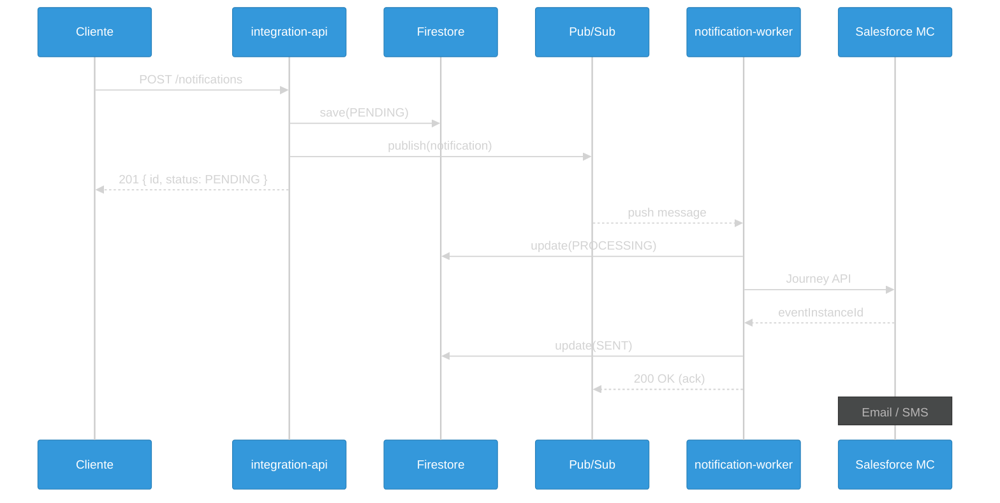
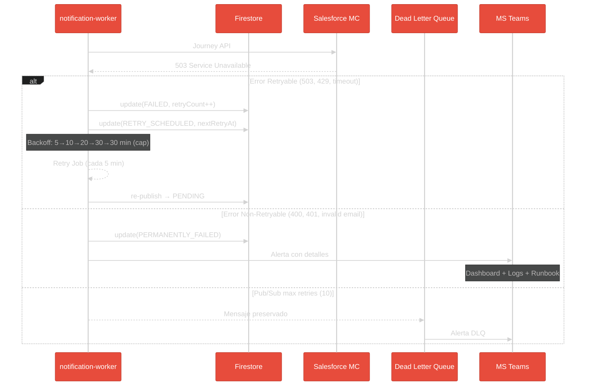

# Caso de Estudio

## Sistema de Notificaciones

> Aplicando patrones enterprise en un sistema real

---

## Por Que Este Caso de Estudio

> Todos los patrones que vieron, aplicados en produccion

Note:
Esta seccion es un caso de estudio completo.
Vamos a ver como se aplican todos los patrones en un sistema real: Transactional Outbox, Retry, DLQ, etc.
No se preocupen si es mucha informacion - pueden volver a esta seccion cuando trabajen con notificaciones.

----

### Patrones Aplicados

| Patron | Donde se usa |
|--------|--------------|
| Transactional Outbox | Garantiza consistencia DB-Evento |
| Circuit Breaker | Llamadas a Salesforce |
| Retry con Backoff | Reintentos automaticos |
| Dead Letter Queue | Mensajes que fallan 10 veces |
| Idempotencia | Evita emails duplicados |
| Optimistic Locking | Previene race conditions |

---

## Overview del Sistema

> Sistema de notificaciones asincronas multi-canal

Note:
Esta seccion profundiza en como funciona el sistema de notificaciones.
Es un caso de estudio de como manejar operaciones asincronas en produccion.
Vamos a ver el flujo completo: desde que llega la solicitud hasta que el email/SMS se envia.
Tambien veremos que pasa cuando las cosas fallan - porque en sistemas distribuidos, SIEMPRE fallan.

----

### Arquitectura General



**Latencia tipica**: ~5 segundos end-to-end

Note:
Este diagrama muestra el "happy path" del sistema.

1. **integration-api** recibe la solicitud (RFC-0041: Single Writer Principle):
   - Guarda en Firestore con status PENDING
   - Publica a Pub/Sub (fire-and-forget)
   - Retorna inmediatamente con status PENDING

2. **Pub/Sub Push** envia el mensaje al worker (no polling)

3. **notification-worker** procesa y envia a Salesforce Marketing Cloud

----

### Estados de una Notificacion

```
                    ┌──────────────┐
                    │   PENDING    │
                    └──────┬───────┘
                           │
                    ┌──────▼───────┐
                    │  PROCESSING  │
                    └──────┬───────┘
                           │
           ┌───────────────┼───────────────┐
           │               │               │
    ┌──────▼───────┐ ┌─────▼──────┐ ┌─────▼──────────────┐
    │     SENT     │ │   FAILED   │ │ PERMANENTLY_FAILED │
    └──────────────┘ └─────┬──────┘ └────────────────────┘
                           │
                    ┌──────▼───────┐
                    │RETRY_SCHEDULED│
                    └──────┬───────┘
                           │
                    ┌──────▼───────┐
                    │   PENDING    │  (vuelve al ciclo)
                    └──────────────┘
```

---

## Flujo de Errores y Retry

> Que pasa cuando Salesforce falla

----

### Diagrama de Errores



Note:
**Flujo de Errores y Retry - Dos niveles de proteccion**

**Nivel 1 - Application Retry (nuestro codigo):**

- 5 reintentos con exponential backoff: 5→10→20→30→30 min
- Tiempo total maximo: ~95 minutos
- Errores retryables: 503, 429, timeouts
- Errores NO retryables: 400, 401, email invalido → PERMANENTLY_FAILED inmediato

**Nivel 2 - Pub/Sub Retry (infraestructura GCP):**

- 10 intentos de entrega al worker
- Si worker no hace ACK → Pub/Sub reintenta
- Despues de 10 fallos → mensaje va a DLQ

----

### Errores Retryables vs Non-Retryables

| Tipo | Codigos | Accion | Por que |
|------|---------|--------|---------|
| **Retryable** | 503, 429, timeout | Reintentar con backoff | Error temporal de infraestructura |
| **Non-Retryable** | 400, 401, 422 | PERMANENTLY_FAILED | Error de datos/config, no se arregla solo |

```typescript
// Como decidimos si reintentar
function isRetryable(error: SalesforceError): boolean {
  // Errores de servidor o rate limit = reintentar
  if (error.statusCode >= 500) return true;
  if (error.statusCode === 429) return true;
  if (error.code === 'TIMEOUT') return true;

  // Errores de cliente = no reintentar
  return false;
}
```

---

## DLQ vs PERMANENTLY_FAILED

> La confusion mas comun para juniors

----

### Dos Lugares para Mensajes Fallidos

```
┌─────────────────────────────────────────────────────────────────┐
│                                                                 │
│     DLQ (Pub/Sub)                 PERMANENTLY_FAILED            │
│                                                                 │
│  ┌─────────────┐               ┌─────────────────────┐         │
│  │  Pub/Sub    │               │     Firestore       │         │
│  │  Topic DLQ  │               │  status field       │         │
│  └─────────────┘               └─────────────────────┘         │
│                                                                 │
│  Quien: Google Cloud           Quien: Nuestro codigo           │
│  Cuando: Worker no responde    Cuando: App decide no reintentar│
│  Causa: OOM, crash, deploy     Causa: Email invalido, 401      │
│                                                                 │
└─────────────────────────────────────────────────────────────────┘
```

----

### Comparacion Detallada

| Aspecto | DLQ Pub/Sub | PERMANENTLY_FAILED |
|---------|-------------|-------------------|
| **Quien lo maneja** | Google Cloud | Nuestro codigo |
| **Donde esta el dato** | Topic `notification-worker-dlq` | Firestore (status field) |
| **Por que fallo** | Worker no respondio | App determino error terminal |
| **Reintentos previos** | 10 (Pub/Sub automatico) | 5 (nuestro codigo) |
| **Como investigar** | Cloud Logging GCP | Firestore + logs app |
| **Como resolver** | Republish desde DLQ | PATCH /notifications/:id/reprocess |

**Analogia para juniors:**

- DLQ Pub/Sub = El cartero no pudo entregar (casa no existe, buzon roto)
- PERMANENTLY_FAILED = El destinatario rechazo el paquete (datos incorrectos)

---

## Uso del Modulo

> Como usar notificaciones desde otros modulos

----

### Uso via Facade (modulos internos)

```typescript
// Orders Module → NotificationFacade
const result = await notificationFacade.sendOrderConfirmedPickup({
  orderNumber: 'OV-123456',
  contactEmail: 'juan.perez@gmail.com',
  contactName: 'Juan Perez',
  purchaseDate: '15 de diciembre 2025',
  promisedDate: '18 de diciembre 2025',
  products: [
    {
      name: 'Filtro de Aceite',
      quantity: 2,
      price: 15990
    }
  ],
});

// Respuesta
// { id: 'notif-abc123', status: 'PENDING' }
```

Note:
El Facade Pattern esconde toda la complejidad. El modulo de Orders solo llama a una funcion.
No necesita saber sobre Pub/Sub, Firestore, Salesforce... Solo pasa los datos y listo.

----

### Uso via HTTP API (clientes externos)

```bash
POST /v1/notifications/order-confirmed-pickup
```

```json
{
  "orderNumber": "OV-123456",
  "contactEmail": "juan.perez@gmail.com",
  "contactName": "Juan Perez",
  "contactId": "CON-0000527030",
  "customerDocumentId": "18800804-6",
  "purchaseDate": "15 de diciembre 2025",
  "promisedDate": "18 de diciembre 2025",
  "products": [
    {
      "name": "Filtro de Aceite",
      "quantity": 2
    }
  ]
}
```

**Respuesta (201 Created):**

```json
{
  "id": "notif-abc123",
  "status": "PENDING",
  "message": "Notification published to Pub/Sub successfully"
}
```

---

## Stuck Recovery

> Que pasa cuando el worker crashea mid-operation

----

### El Problema: Notificaciones Huerfanas

```
┌─────────────────────────────────────────────────────────────────┐
│  ESCENARIO: Fallo al publicar                                   │
├─────────────────────────────────────────────────────────────────┤
│                                                                 │
│  T1: Notificacion creada (PENDING)                             │
│  T2: Guardada en Firestore OK                                  │
│  T3: Pub/Sub publish() FALLA (red caida)                       │
│                                                                 │
│  Resultado: Notificacion "huerfana" en PENDING para siempre    │
│                                                                 │
└─────────────────────────────────────────────────────────────────┘
```

----

### La Solucion: Retry Job Automatico

```typescript
// NotificationRetryService.executeRetryJob()
// Corre cada 5 minutos via Cloud Scheduler

async processStuckPending(): Promise<RetryJobResult> {
  // 1. Buscar notificaciones stuck
  const stuck = await this.repository.findStuckInPending({
    threshold: 5 * 60 * 1000,  // > 5 minutos
    limit: 50,
  });

  // 2. Re-publicar cada una
  for (const notification of stuck) {
    try {
      await this.publisher.publish(notification);
      await this.repository.recordPublished(notification.id);
    } catch (error) {
      // Se reintentara en el proximo ciclo
      this.logger.warn('Failed to republish', { id: notification.id });
    }
  }

  return { published: stuck.length };
}
```

Note:
El retry job corre cada 5 minutos y busca notificaciones stuck.
5 minutos es el threshold: suficiente para que Salesforce responda, pero no tanto para perder tiempo.

---

## Manual Recovery

> Intervencion humana para PERMANENTLY_FAILED

----

### Flujo de Intervencion

```
┌─────────────┐     ┌─────────────┐     ┌─────────────┐
│ PERMANENTLY │     │   Alerta    │     │    SRE      │
│   _FAILED   │────▶│  MS Teams   │────▶│  Investiga  │
└─────────────┘     └─────────────┘     └──────┬──────┘
                                               │
                    ┌──────────────────────────┴──────┐
                    │                                 │
                    ▼                                 ▼
             ┌──────────────┐                ┌──────────────┐
             │  Causa NO    │                │  Causa SI    │
             │  resuelta    │                │  resuelta    │
             └──────────────┘                └──────┬───────┘
                    │                               │
                    ▼                               ▼
             Investigar mas              PATCH /notifications/{id}
                                         /reset-for-retry
                                               │
                                               ▼
                                        ┌──────────────┐
                                        │   PENDING    │
                                        │ (reinicia)   │
                                        └──────────────┘
```

----

### Admin API para Reset

```bash
PATCH /notifications/{id}/reset-for-retry
```

**Que hace `resetForManualRetry()`:**

- Cambia status de PERMANENTLY_FAILED a PENDING
- Resetea retryCount a 0
- Limpia lastError
- Actualiza timestamp

**Checklist antes de resetear:**

- [ ] Causa raiz identificada y corregida
- [ ] Credenciales/config actualizadas si aplica
- [ ] Verificado que el reset no causara el mismo error

---

## Runbook: Notification Failures

> Guia de emergencias para las 3am

----

### 4 Escenarios Comunes

| Escenario | Sintoma | Solucion |
|-----------|---------|----------|
| **Stuck PROCESSING** | Notificaciones en PROCESSING > 5 min | Auto-recovery via retry job |
| **Alto PERM_FAILED** | Muchas terminan en PERMANENTLY_FAILED | Investigar error patterns |
| **Salesforce Outage** | Todos los envios fallan con 5xx | Esperar + Kill-Switch |
| **Pub/Sub Backlog** | Mensajes sin procesar acumulandose | Escalar workers |

----

### Comandos de Investigacion

```bash
# Ver logs del worker (ultimos errores)
gcloud logging read 'resource.labels.service_name="notification-worker" severity>=ERROR' --limit=20

# Contar notificaciones por status
db.notifications.aggregate([
  { $group: { _id: "$status", count: { $sum: 1 } } }
])

# Ver notificaciones stuck
db.notifications.find({
  status: 'PROCESSING',
  updatedAt: { $lt: new Date(Date.now() - 5*60*1000) }
})
```

**Runbook completo**: `docs/runbooks/notification-failures.md`

---

## Troubleshooting para Juniors

> El proceso mental cuando algo falla

----

### Las 6 Preguntas

```
1. QUE ERROR?     → Lee el mensaje COMPLETO
        ↓
2. DONDE?         → Identifica archivo y linea
        ↓
3. CUANDO?        → Siempre? Solo en CI? Solo con ciertos datos?
        ↓
4. REPRODUCE      → Si no puedes replicar, no puedes arreglar
        ↓
5. BUSCA          → Alguien mas probablemente tuvo el mismo error
        ↓
6. ESCALA         → Pide ayuda si > 30 min
```

**Regla de los 30 minutos:** Si no resuelves en 30 min, pide ayuda. No es debilidad - es eficiencia.

----

### Antes de Pedir Ayuda, Ten Listo

1. Mensaje de error exacto
2. Pasos para reproducir
3. Lo que ya intentaste
4. Tu hipotesis de que podria ser

---

## Documentacion de Referencia

> Donde encontrar mas informacion

| Documento | Path | Descripcion |
|-----------|------|-------------|
| **RFC-0030** | `docs/architecture/rfcs/implemented/RFC-0030-notification-module.md` | Arquitectura completa |
| **RFC-0035** | `docs/architecture/rfcs/implemented/RFC-0035-notification-alerting-strategy.md` | Fail-Fast Pattern |
| **RFC-0040** | `docs/architecture/rfcs/proposed/RFC-0040-notification-resilience-improvements.md` | Mejoras de resiliencia |

---

## Resumen

| Componente | Funcion |
|------------|---------|
| **integration-api** | Recibe solicitud, guarda, publica |
| **Pub/Sub** | Cola de mensajes (push) |
| **notification-worker** | Procesa y envia a Salesforce |
| **Firestore** | Estado persistente |
| **Retry Job** | Recupera notificaciones stuck |
| **DLQ** | Mensajes que fallan 10 veces |

**Garantias:**

- At-least-once delivery (Pub/Sub)
- Exactly-once processing (Idempotencia)
- Consistencia DB-Evento (Outbox)
- Auto-recovery (Retry Job)

---

# 🙏 Gracias
