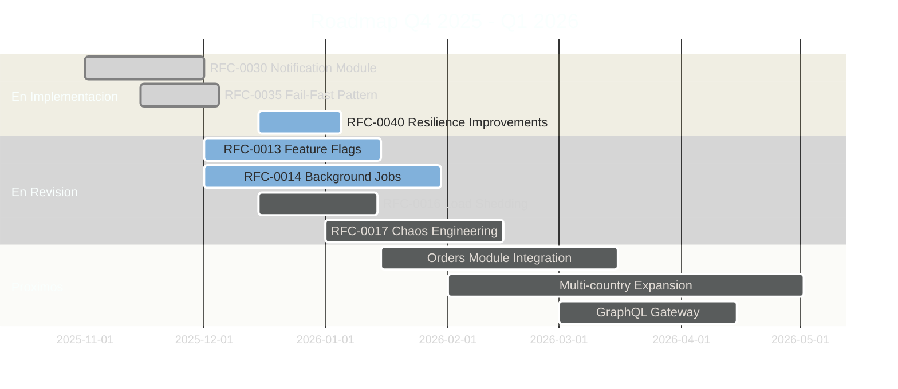

# Metricas y Roadmap

## Estado actual y planes futuros

> Numeros que importan y hacia donde vamos

---

## Performance Actual

> Como estamos hoy

----

### Metricas Clave

| Metrica | Actual | Target |
|---------|--------|--------|
| Latencia P50 | ~15ms | <50ms |
| Latencia P99 | ~80ms | <200ms |
| Uptime | 99.9% | 99.9% |
| Build Time | ~2 min | <3 min |
| Test Time | ~45s | <60s |

Note:
P50 es la latencia del percentil 50 - la mitad de las requests son mas rapidas que esto.
P99 es el percentil 99 - el 99% de las requests son mas rapidas que esto.
15ms P50 es MUY bueno - significa que tipicamente respondemos en 15 milisegundos.
80ms P99 significa que incluso las requests mas lentas responden en menos de 100ms.

----

### Que Significan los Percentiles

```
100 requests ordenadas por latencia:

Fastest                                              Slowest
|-----------------------------------------------------------|
|  P50 (mediana)     |           P95        |   P99  |
|     15ms           |          60ms        |  80ms  |
|____________________|_____________________|________|________|
       50%                  45%              4%        1%
```

**Por que P99 y no promedio?**

- Promedio: (1ms + 1ms + ... + 1000ms) / 100 = engañoso
- P99: El 99% de usuarios tiene experiencia < 80ms

---

## Cobertura de Tests

> Que tan probado esta el codigo

----

### Por Modulo

| Modulo | Cobertura | Estado |
|--------|-----------|--------|
| Pricing | ~80% | ✅ Target |
| Inventory | ~75% | 🟡 Cerca |
| Catalogue | ~70% | 🟡 Cerca |
| Shared | ~65% | 🔴 Mejorar |

**Target para codigo nuevo: 80%**

Note:
La cobertura de tests mide que porcentaje del codigo esta probado.
Nuestro target es 80% para codigo nuevo.
Pricing esta al 80% - el mas alto porque es critico para el negocio.
Shared esta al 65% - hay trabajo por hacer ahi.
Como juniors, pueden contribuir escribiendo tests para subir estos numeros.

----

### Como Ver Cobertura

```bash
# Generar reporte de cobertura
pnpm nx test inventory --coverage

# Ver reporte HTML
open coverage/inventory/index.html

# Cobertura de todo el proyecto
pnpm nx run-many --target=test --coverage
```

---

## Load Testing con k6

> RFC-0005: Verificar performance antes de produccion

----

### Que es k6?

Herramienta de load testing de Grafana Labs.
Escribimos tests en TypeScript que simulan usuarios.

**5 Tipos de Escenarios:**

| Tipo | Proposito | VUs |
|------|-----------|-----|
| Smoke | Verificar que funciona | 1 |
| Load | Carga normal | 50 |
| Stress | Encontrar limites | 200 |
| Spike | Picos repentinos | 0→200→0 |
| Soak | Estabilidad larga duracion | 50 × 1h |

Note:
VU = Virtual User (usuario simulado)
Smoke test es rapido, solo verifica que no hay errores obvios.
Load test simula trafico normal del dia a dia.
Stress test empuja el sistema al limite para encontrar donde se rompe.

----

### Ejemplo: Test de Stock API

```typescript
// k6/scenarios/stock-api.ts
import http from 'k6/http';
import { check } from 'k6';

export const options = {
  vus: 50,        // 50 usuarios virtuales
  duration: '2m', // durante 2 minutos
  thresholds: {
    http_req_duration: ['p95<200'], // p95 < 200ms
    http_req_failed: ['rate<0.01'], // <1% errores
  },
};

export default function () {
  const res = http.get(
    'https://api.example.com/v1/stock/SKU-001'
  );
  check(res, {
    'status 200': (r) => r.status === 200,
    'has stock': (r) => r.json('available') > 0,
  });
}
```

----

### Comandos de Load Testing

```bash
# Smoke test (rapido, verifica que funciona)
pnpm nx run integration-api:test:load:smoke

# Load test (carga normal)
pnpm nx run integration-api:test:load

# Stress test (encontrar limites)
pnpm nx run integration-api:test:load:stress
```

**Thresholds (umbrales):**

Los tests FALLAN si no cumplen los thresholds:
- `http_req_duration: ['p95<200']` - 95% de requests < 200ms
- `http_req_failed: ['rate<0.01']` - Menos de 1% errores

----

### Integracion con CI

```yaml
# .github/workflows/performance.yml

performance-gate:
  runs-on: ubuntu-latest
  steps:
    - name: Run smoke test
      run: pnpm nx run integration-api:test:load:smoke

    - name: Compare with baseline
      run: |
        if [ $P95_LATENCY -gt $BASELINE_PLUS_20_PERCENT ]; then
          echo "Performance regression detected!"
          exit 1
        fi
```

**Si latencia aumenta > 20%, el PR se bloquea**

---

## Estadisticas del Proyecto

> Numeros que muestran la escala

----

### Project Statistics

```
┌─────────────────────────────────────────────────────┐
│              PROJECT STATISTICS                     │
│                                                     │
│  📁 Archivos TypeScript:     853                   │
│  🧪 Archivos de Test:        305                   │
│  📚 Documentos RFC/ADR:      102 (67 ADRs + 35 RFCs)│
│  📦 Proyectos Nx:            17                    │
│                                                     │
│  🏗️ Apps:                    6                     │
│  📚 Libs:                    17+                   │
│                                                     │
│  ⚡ Build Time:              ~2 min                │
│  🧪 Test Time:               ~45s                  │
│  📊 Coverage Target:         ≥80%                  │
└─────────────────────────────────────────────────────┘
```

---

## Roadmap

> Donde estamos y hacia donde vamos

Note:
El roadmap muestra hacia donde va el proyecto.
Los RFCs son propuestas formales de cambios grandes - requieren revision antes de implementar.
Como juniors, pueden participar en RFCs - es excelente para aprender y proponer ideas.

----

### Completado en 2025

| RFC/Feature | Estado | Descripcion |
|-------------|--------|-------------|
| RFC-0001 | ✅ | Enterprise Logging (Pino) |
| RFC-0002 | ✅ | Resilience Patterns |
| RFC-0003 | ✅ | SRE & Error Budget |
| RFC-0010 | ✅ | Fastify Migration |
| RFC-0015 | ✅ | Advanced Caching |
| RFC-0018 | ✅ | RBAC Authorization |
| RFC-0019 | ✅ | Validated Configuration |
| RFC-0020 | ✅ | Data Redaction |
| RFC-0022 | ✅ | Jest → Vitest Migration |
| ADR-0003 | ✅ | Cloud Pub/Sub Messaging |

Note:
Esto es lo que ya esta hecho - el fundamento sobre el que trabajan.
Logging enterprise, patrones de resiliencia, caching, autorizacion...
Todo esto ya funciona. Su trabajo es usarlo y agregar features sobre esta base.

----

### En Desarrollo / Revision



----

### RFCs Proximos

| RFC | Descripcion | Impacto |
|-----|-------------|---------|
| RFC-0013 | Feature Flags | Control dinamico de features |
| RFC-0014 | Background Jobs | Procesamiento asincrono |
| RFC-0016 | Load Shedding | Proteccion contra sobrecarga |
| RFC-0017 | Chaos Engineering | Testing de resiliencia |

**Como contribuir:**

1. Lee el RFC en `docs/architecture/rfcs/`
2. Deja comentarios en el PR
3. Propone mejoras o alternativas

---

## RFC-0040: Notification Resilience

> Ejemplo de RFC reciente

----

### Los 3 Problemas que Resuelve

| Problema | Solucion | Por que importa |
|----------|----------|-----------------|
| Stuck PROCESSING | Retry job detecta y recupera | Sin esto, notificaciones se pierden |
| Mensajes duplicados | Idempotencia con Redis | Sin esto, clientes reciben emails duplicados |
| Race conditions | Optimistic Locking | Sin esto, datos se corrompen |

Note:
RFC-0040 es un excelente ejemplo de mejora enterprise.
Cada solucion sigue patrones de Google, Stripe y AWS.

----

### Capas de Proteccion

```
┌─────────────────────────────────────────────────────────────────┐
│                    CAPAS DE PROTECCION                          │
├─────────────────────────────────────────────────────────────────┤
│                                                                 │
│   ┌───────────────┐  ┌───────────────┐  ┌───────────────┐      │
│   │   STUCK       │  │  IDEMPOTENCIA │  │  OPTIMISTIC   │      │
│   │   RECOVERY    │  │  (Redis)      │  │  LOCKING      │      │
│   │               │  │               │  │               │      │
│   │  Detecta en   │  │  Previene     │  │  Previene     │      │
│   │  5 minutos    │  │  duplicados   │  │  lost updates │      │
│   │               │  │               │  │               │      │
│   │  🔄 Retry     │  │  🔑 Key+TTL   │  │  📊 Version   │      │
│   └───────────────┘  └───────────────┘  └───────────────┘      │
│          │                   │                   │              │
│          └───────────────────┴───────────────────┘              │
│                              │                                   │
│                              ▼                                   │
│                 ┌─────────────────────────┐                     │
│                 │  Notificacion Resiliente │                     │
│                 │  🛡️ Exactly-Once         │                     │
│                 └─────────────────────────┘                     │
│                                                                 │
└─────────────────────────────────────────────────────────────────┘
```

---

## Como Participar en RFCs

> Tu voz importa

----

### Proceso de RFC

```
1. DRAFT        → Autor escribe propuesta inicial
        ↓
2. REVIEW       → Equipo revisa y comenta
        ↓
3. APPROVED     → Tech Lead aprueba
        ↓
4. IMPLEMENTING → Se implementa
        ↓
5. IMPLEMENTED  → Completado y documentado
```

----

### Como Juniors Pueden Contribuir

1. **Leer RFCs abiertos** en `docs/architecture/rfcs/proposed/`
2. **Hacer preguntas** - "No entiendo X" es valido
3. **Proponer edge cases** - "Que pasa si...?"
4. **Implementar** - Muchos RFCs necesitan manos
5. **Escribir tests** - Siempre necesarios

**No necesitas ser senior para tener buenas ideas**

---

## Resumen

| Area | Estado |
|------|--------|
| Performance | P50: 15ms, P99: 80ms ✅ |
| Tests | 65-80% cobertura 🟡 |
| Load Testing | k6 integrado en CI ✅ |
| Documentacion | 102 RFCs/ADRs ✅ |

**Proximos pasos:**

- Feature Flags (RFC-0013)
- Background Jobs (RFC-0014)
- Multi-country Expansion

---

## Preguntas?
