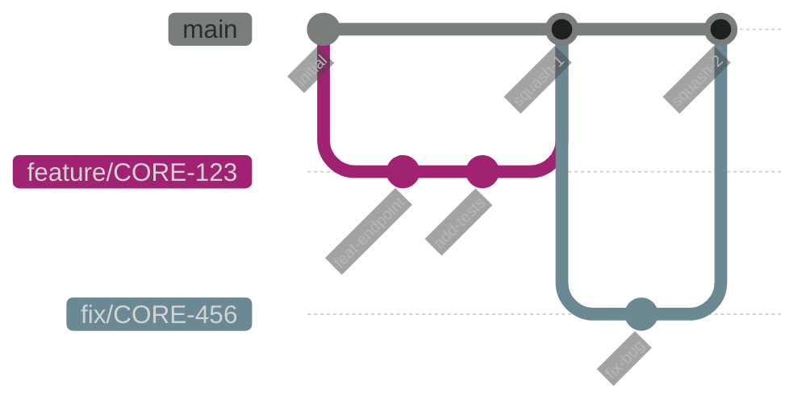
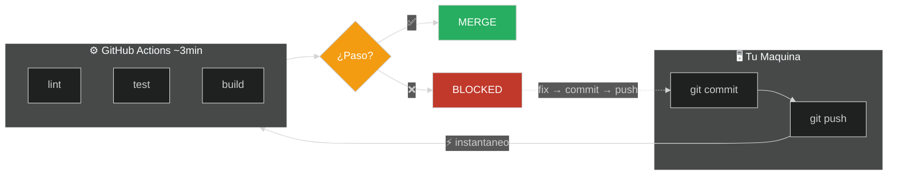

# Developer Workflow

### Tu dia a dia: del codigo al merge

Note:
Esta presentacion cubre el flujo de trabajo diario.
Es material esencial que usaran todos los dias.

---

## Agenda

1. **Conventional Commits** - Formato obligatorio
2. **Branches** - Nomenclatura y flujo
3. **Pull Requests** - Proceso completo
4. **Code Review** - Como revisar y ser revisado
5. **Validacion de Codigo** - CI valida automaticamente

---

## El Ciclo Diario

> Del codigo al deploy: el ciclo completo

⬇️ _Navega hacia abajo para ver detalles_

Note:
Este es el flujo que van a seguir todos los dias.
Cada paso tiene reglas especificas que vamos a ver.

----

<!-- .slide: data-background="#181818" data-background-transition="fade" -->

### Ciclo de Desarrollo

```text
CODE → COMMIT → PUSH → PR → REVIEW → MERGE
```

| Paso | Herramienta | Regla |
|------|-------------|-------|
| Code | VS Code | Format on save |
| Commit | Git | Conventional commits |
| Push | Git | Branch feature/* |
| PR | GitHub | Template obligatorio |
| Review | GitHub | CODEOWNERS |
| Merge | GitHub | Squash merge |

---

## Conventional Commits

> Formato obligatorio para mensajes de commit

⬇️ _Navega hacia abajo para ver detalles_

Note:
Los conventional commits son OBLIGATORIOS.
El CI rechaza commits que no siguen el formato.

----

<!-- .slide: data-background="#1c1c1c" data-background-transition="fade" -->

### Estructura del Commit

```bash
<type>(<scope>): <description>
```

**Ejemplos reales:**

```bash
feat(inventory): add bulk import endpoint
fix(pricing): correct decimal precision
docs(api): update pagination examples
refactor(core): extract validation to shared lib
test(catalogue): add unit tests for SKU
chore(deps): update nestjs to v11
```

Note:
type = que tipo de cambio es
scope = que modulo afecta
description = que hiciste (imperativo, minusculas)

----

<!-- .slide: data-background="#181818" data-background-transition="fade" -->

### Tipos de Commit

| Tipo | Cuando usar | Version |
|------|-------------|---------|
| `feat` | Nueva funcionalidad | Minor ↑ |
| `fix` | Corregir un bug | Patch ↑ |
| `docs` | Solo documentacion | - |
| `refactor` | Cambiar sin agregar feature | - |
| `test` | Agregar o modificar tests | - |
| `chore` | Tareas de mantenimiento | - |
| `perf` | Mejoras de rendimiento | Patch ↑ |

Note:
feat y fix afectan el versionado automatico.
Los otros tipos son importantes para el CHANGELOG pero no afectan version.

----

<!-- .slide: data-background="#1c1c1c" data-background-transition="fade" -->

### Scope

El scope indica el modulo afectado:

```bash
feat(inventory): ...     # Modulo de inventario
fix(pricing): ...        # Modulo de precios
test(catalogue): ...     # Modulo de catalogo
chore(deps): ...         # Dependencias
```

Si afecta varios modulos, omitir scope:

```bash
feat: add global search across modules
```

----

<!-- .slide: data-background="#181818" data-background-transition="fade" -->

### Breaking Changes

Si tu cambio rompe compatibilidad:

```bash
# Opcion 1: Agregar "!"
feat!: remove deprecated v1 API endpoints

# Opcion 2: En el body
feat(auth): change token format

BREAKING CHANGE: tokens now use JWT instead of opaque.
```

**Breaking change = version mayor (1.0 → 2.0)**

----

<!-- .slide: data-background="#1c1c1c" data-background-transition="fade" -->

### AI-Assisted Commits

GitLens y GitHub Copilot estan configurados para generar commits en español:

```text
┌─────────────────────────────────────────────────────────────┐
│  Source Control (Ctrl+Shift+G)                              │
│  ┌───────────────────────────────────────────────────────┐  │
│  │ Message: [________________] [✨ Generate]             │  │
│  └───────────────────────────────────────────────────────┘  │
│                            ↓                                │
│  ┌───────────────────────────────────────────────────────┐  │
│  │ feat(inventory): agregar endpoint de importacion      │  │
│  │                                                       │  │
│  │ Cambios:                                              │  │
│  │ - Crear BulkImportController con validacion          │  │
│  │ - Implementar BulkImportService con batch processing │  │
│  │ - Agregar tests unitarios para edge cases            │  │
│  └───────────────────────────────────────────────────────┘  │
└─────────────────────────────────────────────────────────────┘
```

**Ya configurado** en `.vscode/settings.json` - solo usa el boton ✨

---

## Branches

> Una branch por feature, siempre desde main

⬇️ _Navega hacia abajo para ver detalles_

----

<!-- .slide: data-background="#1c1c1c" data-background-transition="fade" -->

### Nomenclatura

```bash
# Patron: <type>/<ticket>-<descripcion-corta>

feature/CORE-123-add-bulk-import
fix/CORE-456-pricing-decimal
refactor/CORE-789-extract-validation
docs/CORE-101-api-examples
```

**NO hacer:**

```bash
my-branch        # Sin tipo ni ticket
feature/test     # Sin ticket
CORE-123         # Sin descripcion
```

----

<!-- .slide: data-background="#181818" data-background-transition="fade" -->

### Flujo de Branches

<div style="display: flex; justify-content: center; transform: scale(1.4); margin: 40px 0; margin-left: 80px;">



</div>

**Reglas:**
- Siempre crear desde `main` actualizado
- Una branch = un ticket/feature
- Merge via PR (nunca directo a main)

----

<!-- .slide: data-background="#1c1c1c" data-background-transition="fade" -->

### Mantener tu Branch Actualizada

```bash
# Opcion 1: Rebase (preferido)
git fetch origin
git rebase origin/main

# Opcion 2: Merge
git fetch origin
git merge origin/main

# Despues de resolver conflictos
git push --force-with-lease
```

Note:
Rebase mantiene el historial mas limpio.
force-with-lease es mas seguro que force.

---

## Pull Requests

> El PR es donde ocurre la magia del code review

⬇️ _Navega hacia abajo para ver detalles_

----

<!-- .slide: data-background="#181818" data-background-transition="fade" -->

### Crear un PR

```bash
# Desde terminal
gh pr create --title "feat(inventory): add bulk import"

# O desde GitHub UI
# 1. Push tu branch
# 2. Click "Compare & pull request"
# 3. Llenar template
```

----

<!-- .slide: data-background="#1c1c1c" data-background-transition="fade" -->

### Crear PR desde VS Code (Recomendado)

La extension **GitHub Pull Requests** permite crear PRs sin salir del editor:

```text
┌─────────────────────────────────────────────────────────────┐
│  Source Control (Ctrl+Shift+G)                              │
│  ┌───────────────────────────────────────────────────────┐  │
│  │  ☰ BRANCHES                                           │  │
│  │    ├─ main                                            │  │
│  │    └─ feature/CORE-123-bulk-import  ←  tu branch      │  │
│  │                                                       │  │
│  │  [Create Pull Request]  ← Click aqui                  │  │
│  └───────────────────────────────────────────────────────┘  │
│                            ↓                                │
│  ┌───────────────────────────────────────────────────────┐  │
│  │  Title: feat(inventory): add bulk import              │  │
│  │  Base: main  ←  Into: feature/CORE-123                │  │
│  │  Description: [___________________________]           │  │
│  │                                                       │  │
│  │  [Create]                                             │  │
│  └───────────────────────────────────────────────────────┘  │
└─────────────────────────────────────────────────────────────┘
```

<!-- INSERT_IMAGE: screenshot-create-pr-vscode.png -->

----

<!-- .slide: data-background="#181818" data-background-transition="fade" -->

### Review PRs desde VS Code

Revisar codigo directamente en el editor con syntax highlighting:

```text
┌─────────────────────────────────────────────────────────────┐
│  GitHub Pull Requests (Panel izquierdo)                     │
│  ┌───────────────────────────────────────────────────────┐  │
│  │  ☰ PULL REQUESTS                                      │  │
│  │    ├─ #123 feat(inventory): bulk import   ← Asignado  │  │
│  │    ├─ #124 fix(pricing): decimal error                │  │
│  │    └─ #125 docs: update README                        │  │
│  └───────────────────────────────────────────────────────┘  │
│                                                             │
│  Al hacer click en un PR:                                   │
│  ┌───────────────────────────────────────────────────────┐  │
│  │  - Ver diff con syntax highlighting                   │  │
│  │  - Agregar comentarios inline                         │  │
│  │  - Aprobar / Solicitar cambios                        │  │
│  │  - Merge desde VS Code                                │  │
│  └───────────────────────────────────────────────────────┘  │
└─────────────────────────────────────────────────────────────┘
```

<!-- INSERT_IMAGE: screenshot-review-pr-vscode.png -->

**Extension**: `GitHub Pull Requests and Issues` (ya en recomendadas)

----

<!-- .slide: data-background="#1c1c1c" data-background-transition="fade" -->

### Template de PR

```markdown
## Descripcion
Breve descripcion del cambio.

## Tipo de cambio
- [ ] Bug fix
- [ ] Nueva feature
- [ ] Refactor

## Ticket
CORE-123

## Checklist
- [ ] Tests agregados/actualizados
- [ ] Lint pasa sin errores
```

----

<!-- .slide: data-background="#181818" data-background-transition="fade" -->

### Status Checks

Antes de merge, tu PR debe pasar:

| Check | Que verifica | Obligatorio |
|-------|--------------|-------------|
| `lint` | ESLint sin errores | ✅ |
| `test` | Tests unitarios | ✅ |
| `build` | Compila sin errores | ✅ |
| `sonar` | Quality gate | ✅ |
| `review` | Aprobacion CODEOWNERS | ✅ |

---

## Code Review

> Aprender y mejorar juntos

⬇️ _Navega hacia abajo para ver detalles_

Note:
No solo busques errores - busca oportunidades de mejora.
Tambien reconoce el buen trabajo con "praise:".

----

<!-- .slide: data-background="#1c1c1c" data-background-transition="fade" -->

### Como Reviewer

**Cosas a revisar:**

1. **LOGICA** - El codigo hace lo que dice?
2. **TESTS** - Hay tests para el cambio?
3. **SEGURIDAD** - Input validation? No secrets?
4. **ESTILO** - Sigue los patrones del proyecto?

----

<!-- .slide: data-background="#181818" data-background-transition="fade" -->

### Etiquetas de Comentarios

| Etiqueta | Significado | Bloquea? |
|----------|-------------|----------|
| `blocking:` | Debe corregirse | ✅ Si |
| `suggestion:` | Mejora opcional | ❌ No |
| `question:` | Necesito entender | ⚠️ Depende |
| `nit:` | Nitpicking menor | ❌ No |
| `praise:` | Buen trabajo! | ❌ No |

----

<!-- .slide: data-background="#1c1c1c" data-background-transition="fade" -->

### Ejemplos de Comentarios

```markdown
blocking: Este query puede causar N+1, usar eager loading

suggestion: Podrias extraer esto a un helper

nit: Prefiero `const` sobre `let` aqui

praise: Excelente manejo del edge case!
```

----

<!-- .slide: data-background="#181818" data-background-transition="fade" -->

### CODEOWNERS

```bash
# .github/CODEOWNERS

/libs/core/           @team-leads
/libs/inventory/      @inventory-team
/libs/pricing/        @pricing-team
/.github/workflows/   @devops-team
```

Tu PR necesita approval del CODEOWNER del codigo que modificaste.

---

## Validacion de Codigo

> CI valida todo - sin hooks locales (enfoque BigTech)

----

<!-- .slide: data-background="#1c1c1c" data-background-transition="fade" -->

### Flujo de Validacion



**No hay pre-commit hooks** - commits inmediatos, CI valida despues

----

<!-- .slide: data-background="#181818" data-background-transition="fade" -->

### VS Code te Ayuda

```json
// .vscode/settings.json (ya configurado)
{
  "editor.formatOnSave": true,
  "editor.defaultFormatter": "esbenp.prettier-vscode",
  "editor.codeActionsOnSave": {
    "source.fixAll.eslint": true
  }
}
```

Al guardar: Prettier formatea + ESLint corrige = menos errores en CI

----

<!-- .slide: data-background="#181818" data-background-transition="fade" -->

### Reglas de ESLint Importantes

> Errores que CI atrapa automaticamente

```typescript
// ❌ @typescript-eslint/no-floating-promises
async function bad() {
  fetchData();  // Promise no awaited - BUG!
}

// ✅ Correcto
async function good() {
  await fetchData();
}

// ❌ @typescript-eslint/no-misused-promises
arr.forEach(async (n) => await process(n)); // BUG!

// ✅ Correcto
await Promise.all(arr.map((n) => process(n)));
```

Note:
Estas son las reglas mas importantes.
Si ven errores de floating promises, SIEMPRE agregar await.
forEach con async es un error comun - usar Promise.all.

----

<!-- .slide: data-background="#1c1c1c" data-background-transition="fade" -->

### Mas Detalles

Para entender el pipeline completo de CI/CD:

📚 **Ver presentacion**: [CI/CD Pipeline](cicd-pipeline.md)

**Contenido**:

- GitHub Actions workflows
- Quality gates y SonarCloud
- Deploy automatico a Cloud Run
- Nx affected y cache distribuido

---

## Resumen

> Tu dia a dia en 4 pasos

⬇️ _Navega hacia abajo para ver detalles_

----

<!-- .slide: data-background="#181818" data-background-transition="fade" -->

### Tu Dia a Dia

```bash
# 1. Crear branch
git checkout main && git pull
git checkout -b feature/CORE-123-mi-feature

# 2. Commits
git commit -m "feat(modulo): descripcion"

# 3. Push y PR
git push -u origin feature/CORE-123-mi-feature
gh pr create

# 4. Responder review y merge
```

----

<!-- .slide: data-background="#1c1c1c" data-background-transition="fade" -->

### Comandos Utiles

```bash
git status              # Ver estado
git diff                # Ver diferencias
git log --oneline -10   # Ver historial
git commit --amend      # Enmendar ultimo commit
git rebase origin/main  # Actualizar branch
```

---

## Preguntas?

**Recursos:**
- [Conventional Commits](https://conventionalcommits.org)
- [GitHub Flow](https://docs.github.com/en/get-started/quickstart/github-flow)

Note:
Si tienen dudas sobre el workflow, pregunten en Slack #dev-help.
