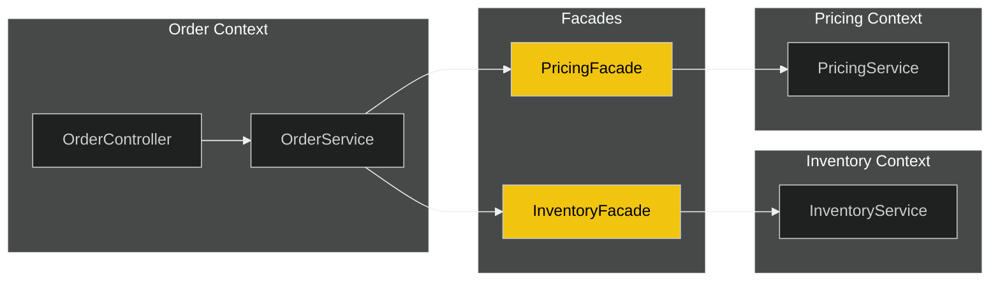
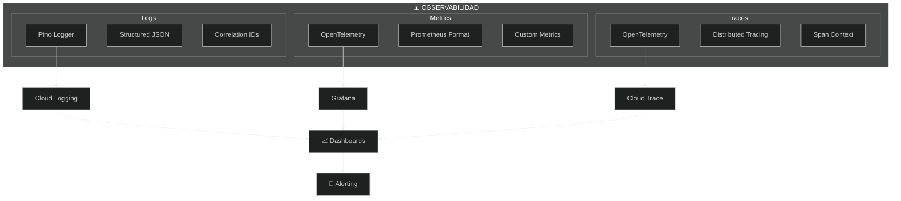
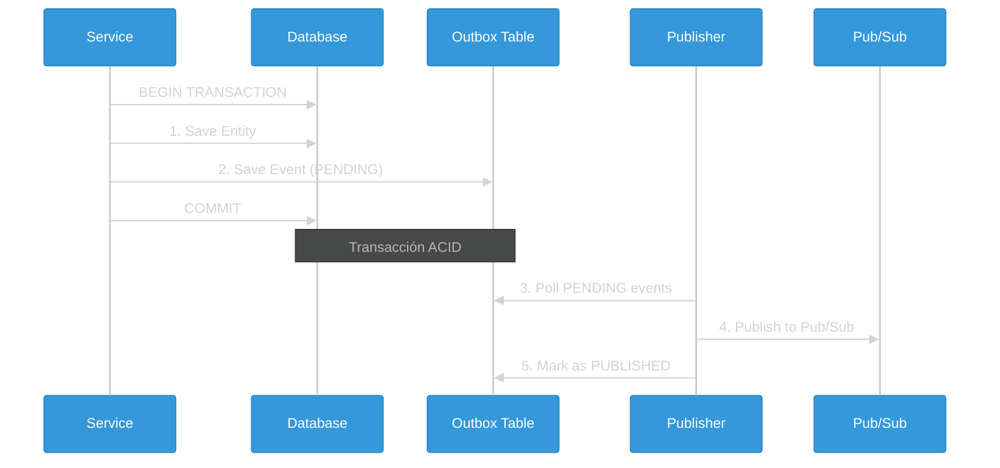
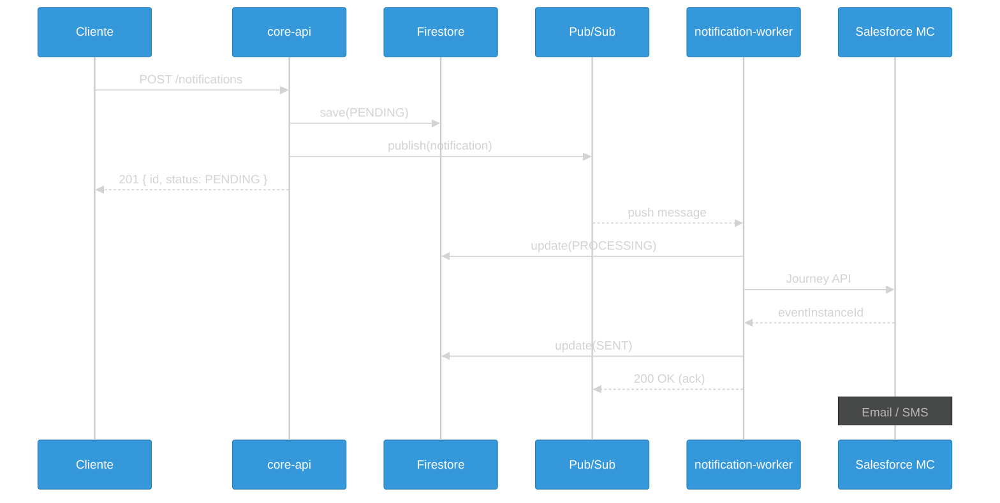
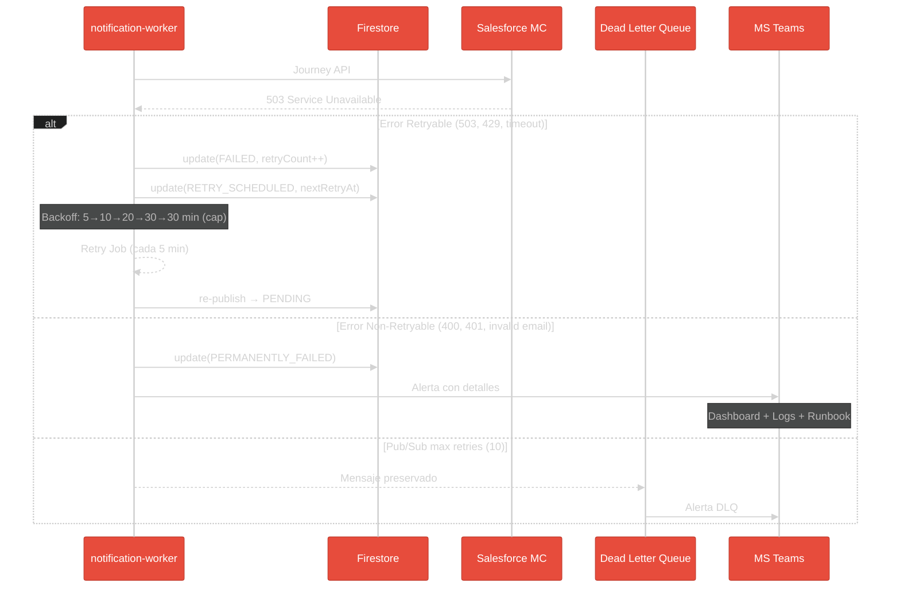
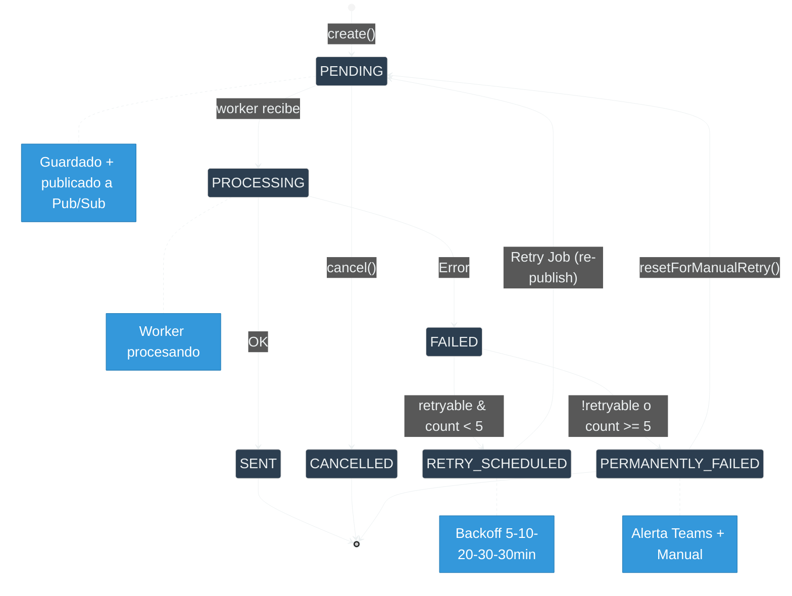
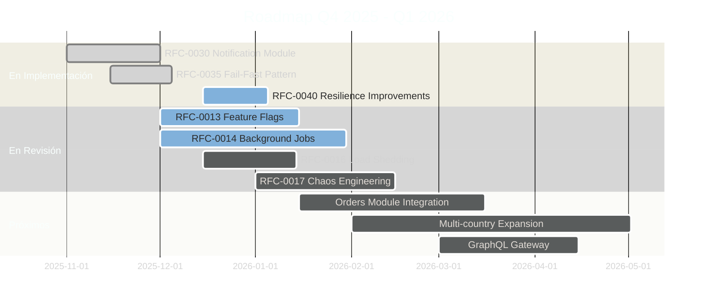

## 🛡️ Patrones Enterprise

> Patrones avanzados de arquitectura

⬇️ _Navega hacia abajo para ver detalles_

Note:
Estos son patrones avanzados que usamos en el proyecto.
No necesitan entenderlos todos ahora - es material de referencia.
Cuando trabajen en features específicas, van a ver estos patrones en acción.


----

### 🛡️ Patrones Enterprise

> Patrones de resiliencia y configuración para sistemas distribuidos

⬇️ _Navega hacia abajo para ver detalles_

Note:
Los patrones enterprise son soluciones probadas a problemas comunes en sistemas grandes.
No los inventamos nosotros - vienen de empresas como Netflix, Google, Amazon.
Vamos a ver los más importantes que usamos en nuestro sistema.

----

<!-- .slide: data-background="#181818" data-background-transition="fade" -->

### Facade Pattern (ADR-0002)



**Beneficios**:
- ✅ Desacoplamiento entre módulos
- ✅ Contratos explícitos
- ✅ Fácil de mockear en tests
- ✅ Preparado para microservicios

Note:
El Facade Pattern es cómo los módulos se comunican entre sí.
En vez de que Orders llame directamente a InventoryService, llama a InventoryFacade.
¿Por qué? Porque si mañana Inventory se convierte en microservicio, solo cambiamos el Facade.
El código de Orders no cambia. Esto es lo que llamamos "desacoplamiento".
También hace los tests más fáciles - podemos mockear el Facade fácilmente.

> Comunicación entre Bounded Contexts via Facades

----

<!-- .slide: data-background="#1c1c1c" data-background-transition="fade" -->

### Facade Pattern: Ejemplo Real

> Cómo Orders usa InventoryFacade en nuestro código

```typescript
// ❌ SIN Facade - Acoplamiento directo (NO hacer esto)
@Injectable()
export class OrderService {
  constructor(
    private inventoryService: InventoryService,  // Dependencia directa
    private pricingService: PricingService,      // Otro módulo
  ) {}

  async createOrder(dto: CreateOrderDto) {
    // Si InventoryService cambia su API, OrderService se rompe
    const stock = await this.inventoryService.checkStock(dto.sku);
  }
}

// ✅ CON Facade - Desacoplado (ASÍ lo hacemos)
@Injectable()
export class OrderService {
  constructor(
    private inventoryFacade: InventoryFacade,  // Solo conoce el Facade
  ) {}

  async createOrder(dto: CreateOrderDto) {
    // El Facade expone un contrato estable
    // Si la implementación interna cambia, OrderService no se entera
    const stock = await this.inventoryFacade.checkAvailability(dto.sku);
  }
}
```

Note:
Este es código REAL de nuestro proyecto.
Fíjense que OrderService solo conoce InventoryFacade.
Si mañana Inventory se convierte en microservicio, solo cambiamos el Facade.
El Facade es como un "contrato" entre módulos.

----

<!-- .slide: data-background="#181818" data-background-transition="fade" -->

### Facade Pattern: Estructura de Archivos

> Dónde encontrar los Facades en el código

```text
libs/
├── inventory/
│   ├── api/
│   │   └── src/lib/
│   │       └── facades/
│   │           └── inventory.facade.ts    ← Facade público
│   ├── application/
│   │   └── src/lib/services/
│   │       └── inventory.service.ts       ← Servicio interno
│   └── domain/
│       └── src/lib/                       ← Entidades y VOs
│
└── orders/
    └── application/
        └── src/lib/services/
            └── order.service.ts           ← Usa InventoryFacade
```

**Regla importante**:

- `application/` y `domain/` son **privados** del módulo
- `api/facades/` es **público** para otros módulos

Note:
Esta estructura es consistente en TODOS nuestros módulos.
Si buscan un Facade, siempre está en `libs/<módulo>/api/src/lib/facades/`.
Los servicios internos están en `application/` - nunca los importen directamente.

----

<!-- .slide: data-background="#1c1c1c" data-background-transition="fade" -->

### Circuit Breaker

<div style="text-align: center; background: #1e1e1e; padding: 20px; border-radius: 10px;">
<svg width="800" height="320" viewBox="0 0 800 320" xmlns="http://www.w3.org/2000/svg">
<!-- Dashboard -->
<rect x="250" y="20" width="300" height="40" fill="#2c3e50" rx="5" stroke="#34495e" />
<text x="400" y="47" text-anchor="middle" fill="#ecf0f1" font-family="monospace" font-size="18">Threshold: 2 | Failures:</text>
<!-- Counter Numbers -->
<g transform="translate(530, 47)">
<!-- 0: Visible 0-3.5s (0.25) AND 11.0s-14s (0.79) -->
<text text-anchor="middle" fill="#2ecc71" font-family="monospace" font-size="18" font-weight="bold">0
<animate attributeName="opacity" values="1;1;0;0;1;1" keyTimes="0;0.25;0.251;0.79;0.791;1" dur="14s" repeatCount="indefinite" />
</text>
<!-- 1: Visible 3.5s-5.5s (0.25-0.393) -->
<text text-anchor="middle" fill="#e67e22" font-family="monospace" font-size="18" font-weight="bold" opacity="0">1
<animate attributeName="opacity" values="0;0;1;1;0;0" keyTimes="0;0.25;0.251;0.393;0.394;1" dur="14s" repeatCount="indefinite" />
</text>
<!-- 2: Visible 5.5s-11.0s (0.393-0.79) -->
<text text-anchor="middle" fill="#e74c3c" font-family="monospace" font-size="18" font-weight="bold" opacity="0">2
<animate attributeName="opacity" values="0;0;1;1;0;0" keyTimes="0;0.393;0.394;0.79;0.791;1" dur="14s" repeatCount="indefinite" />
</text>
</g>
<!-- Client -->
<rect x="40" y="100" width="120" height="80" fill="#3498db" rx="5" />
<text x="100" y="145" text-anchor="middle" fill="white" font-size="20" font-weight="bold">Client</text>
<!-- Server -->
<rect x="640" y="100" width="120" height="80" fill="#2ecc71" rx="5" />
<text x="700" y="145" text-anchor="middle" fill="white" font-size="20" font-weight="bold">Server</text>
<!-- Circuit Breaker Gate -->
<g transform="translate(400, 140)">
<!-- Barrier -->
<rect x="-10" y="-60" width="20" height="120" fill="#e74c3c" rx="2" opacity="0">
<animate attributeName="opacity" values="0;0;1;1;0.4;0.4;0;0" keyTimes="0;0.393;0.394;0.679;0.68;0.79;0.791;1" dur="14s" repeatCount="indefinite" />
<animate attributeName="fill" values="#e74c3c;#e74c3c;#f1c40f;#f1c40f" keyTimes="0;0.679;0.68;1" dur="14s" repeatCount="indefinite" />
</rect>
<!-- Labels -->
<text x="0" y="85" text-anchor="middle" font-size="18" font-weight="bold" fill="#2ecc71">
CLOSED
<animate attributeName="opacity" values="1;1;0;0;1;1" keyTimes="0;0.393;0.394;0.79;0.791;1" dur="14s" repeatCount="indefinite" />
</text>
<text x="0" y="85" text-anchor="middle" font-size="18" font-weight="bold" fill="#e74c3c" opacity="0">
OPEN
<animate attributeName="opacity" values="0;0;1;1;0;0" keyTimes="0;0.394;0.395;0.679;0.68;1" dur="14s" repeatCount="indefinite" />
</text>
<text x="0" y="85" text-anchor="middle" font-size="18" font-weight="bold" fill="#f1c40f" opacity="0">
HALF-OPEN
<animate attributeName="opacity" values="0;0;1;1;0;0" keyTimes="0;0.68;0.681;0.79;0.791;1" dur="14s" repeatCount="indefinite" />
</text>
</g>
<!-- Cooldown Timer (Visible during OPEN: 5.5s-9.5s) -->
<g transform="translate(350, 270)">
<text x="50" y="-10" text-anchor="middle" fill="#e74c3c" font-size="14" font-family="monospace" opacity="0">
TIMEOUT COOLDOWN
<animate attributeName="opacity" values="0;0;1;1;0;0" keyTimes="0;0.394;0.395;0.679;0.68;1" dur="14s" repeatCount="indefinite" />
</text>
<rect x="0" y="0" width="100" height="6" fill="#333" rx="3" opacity="0">
<animate attributeName="opacity" values="0;0;1;1;0;0" keyTimes="0;0.394;0.395;0.679;0.68;1" dur="14s" repeatCount="indefinite" />
</rect>
<rect x="0" y="0" width="0" height="6" fill="#e74c3c" rx="3" opacity="0">
<animate attributeName="opacity" values="0;0;1;1;0;0" keyTimes="0;0.394;0.395;0.679;0.68;1" dur="14s" repeatCount="indefinite" />
<animate attributeName="width" values="0;0;100;100;0" keyTimes="0;0.395;0.679;0.68;1" dur="14s" repeatCount="indefinite" />
</rect>
</g>
<!-- Packet 1: Success (t=0.5s -> 1.5s) -->
<circle cx="160" cy="140" r="10" fill="#2ecc71" opacity="0">
<animate attributeName="cx" values="160;160;640;640" keyTimes="0;0.035;0.107;1" dur="14s" repeatCount="indefinite" />
<animate attributeName="opacity" values="0;1;1;0;0" keyTimes="0;0.035;0.10;0.107;1" dur="14s" repeatCount="indefinite" />
</circle>
<!-- Packet 2: Fail (t=2.5s -> 3.5s) -->
<circle cx="160" cy="140" r="10" fill="#2ecc71" opacity="0">
<animate attributeName="cx" values="160;160;640;640" keyTimes="0;0.178;0.25;1" dur="14s" repeatCount="indefinite" />
<animate attributeName="opacity" values="0;1;1;0;0" keyTimes="0;0.178;0.24;0.25;1" dur="14s" repeatCount="indefinite" />
<animate attributeName="fill" values="#2ecc71;#2ecc71;#e74c3c;#e74c3c" keyTimes="0;0.24;0.25;1" dur="14s" repeatCount="indefinite" />
</circle>
<text x="640" y="110" text-anchor="middle" font-size="30" opacity="0">💥
<animate attributeName="opacity" values="0;0;1;0;0" keyTimes="0;0.25;0.26;0.29;1" dur="14s" repeatCount="indefinite" />
</text>
<!-- Packet 3: Fail (t=4.5s -> 5.5s) -> Triggers Breaker -->
<circle cx="160" cy="140" r="10" fill="#2ecc71" opacity="0">
<animate attributeName="cx" values="160;160;640;640" keyTimes="0;0.321;0.392;1" dur="14s" repeatCount="indefinite" />
<animate attributeName="opacity" values="0;1;1;0;0" keyTimes="0;0.321;0.38;0.392;1" dur="14s" repeatCount="indefinite" />
<animate attributeName="fill" values="#2ecc71;#2ecc71;#e74c3c;#e74c3c" keyTimes="0;0.38;0.392;1" dur="14s" repeatCount="indefinite" />
</circle>
<text x="640" y="110" text-anchor="middle" font-size="30" opacity="0">💥
<animate attributeName="opacity" values="0;0;1;0;0" keyTimes="0;0.392;0.40;0.43;1" dur="14s" repeatCount="indefinite" />
</text>
<!-- Packet 4: Blocked (t=7.0s -> 7.5s) -->
<circle cx="160" cy="140" r="10" fill="#2ecc71" opacity="0">
<animate attributeName="cx" values="160;160;390;390" keyTimes="0;0.50;0.535;1" dur="14s" repeatCount="indefinite" />
<animate attributeName="opacity" values="0;1;1;0;0" keyTimes="0;0.50;0.53;0.535;1" dur="14s" repeatCount="indefinite" />
<animate attributeName="fill" values="#2ecc71;#2ecc71;#e74c3c;#e74c3c" keyTimes="0;0.53;0.535;1" dur="14s" repeatCount="indefinite" />
</circle>
<text x="390" y="110" text-anchor="middle" font-size="30" opacity="0">🚫
<animate attributeName="opacity" values="0;0;1;0;0" keyTimes="0;0.535;0.545;0.58;1" dur="14s" repeatCount="indefinite" />
</text>
<!-- Packet 5: Probe (t=10.0s -> 11.0s) - Half Open -->
<circle cx="160" cy="140" r="10" fill="#f1c40f" opacity="0">
<animate attributeName="cx" values="160;160;640;640" keyTimes="0;0.714;0.785;1" dur="14s" repeatCount="indefinite" />
<animate attributeName="opacity" values="0;1;1;0;0" keyTimes="0;0.714;0.78;0.785;1" dur="14s" repeatCount="indefinite" />
<animate attributeName="fill" values="#f1c40f;#f1c40f;#2ecc71;#2ecc71" keyTimes="0;0.78;0.785;1" dur="14s" repeatCount="indefinite" />
</circle>
<!-- Test Passed Message -->
<text x="640" y="80" text-anchor="middle" font-size="16" font-weight="bold" fill="#2ecc71" opacity="0">
TEST PASSED
<animate attributeName="opacity" values="0;0;1;1;0;0" keyTimes="0;0.785;0.79;0.85;0.86;1" dur="14s" repeatCount="indefinite" />
</text>
</svg>
</div>

Note:
El Circuit Breaker es un patrón de resiliencia MUY importante.
Imaginen un interruptor eléctrico: si hay muchas fallas, se "abre" y corta el circuito.
En software: si Salesforce está fallando, dejamos de llamarlo por un rato.
Esto evita que saturemos un servicio que ya está mal, y le damos tiempo de recuperarse.
Después de un "cooldown", probamos con UNA request (half-open). Si funciona, volvemos a normal.
Netflix popularizó este patrón con su librería Hystrix.

----

<!-- .slide: data-background="#181818" data-background-transition="fade" -->

### Circuit Breaker: Ejemplo Real

> Cómo lo usamos con Salesforce Marketing Cloud

```typescript
// libs/shared/backend/resilience/src/lib/salesforce-circuit-breaker.ts

import { CircuitBreaker, ConsecutiveBreaker } from 'cockatiel';

// Configuración del Circuit Breaker para Salesforce
export const salesforceCircuitBreaker = new CircuitBreaker({
  halfOpenAfter: 30_000,           // 30s en estado OPEN antes de probar
  breaker: new ConsecutiveBreaker(2), // 2 fallos consecutivos = OPEN
});

// Uso en el NotificationProcessor
async sendToSalesforce(notification: Notification): Promise<void> {
  try {
    // El Circuit Breaker envuelve la llamada a Salesforce
    await salesforceCircuitBreaker.execute(async () => {
      await this.salesforceClient.triggerJourney(notification);
    });
  } catch (error) {
    if (error instanceof BrokenCircuitError) {
      // Circuit está OPEN - no intentamos, fallamos rápido
      this.logger.warn('Circuit breaker OPEN, skipping Salesforce call');
      throw new RetryableError('Salesforce temporarily unavailable');
    }
    throw error;
  }
}
```

Note:
Este es código real de nuestro sistema.
Cockatiel es la librería que usamos - es de Microsoft.
ConsecutiveBreaker(2) significa: 2 fallos seguidos = abrir el circuito.
halfOpenAfter: 30s espera antes de probar si Salesforce se recuperó.
Cuando el circuito está OPEN, fallamos RÁPIDO - no perdemos tiempo.

----

<!-- .slide: data-background="#1c1c1c" data-background-transition="fade" -->

### Circuit Breaker: Estados y Escenarios

> ¿Cuándo se abre y cuándo se cierra?

| Estado | Descripción | Qué pasa con las requests |
|--------|-------------|---------------------------|
| **CLOSED** | Operación normal | Pasan a Salesforce |
| **OPEN** | Demasiados fallos | Fallan inmediatamente (no llaman a SF) |
| **HALF-OPEN** | Probando recuperación | 1 request de prueba pasa |

**Escenarios reales:**

```text
Escenario 1: Salesforce en mantenimiento
─────────────────────────────────────────
Request 1 → Timeout (30s) → Fallo #1
Request 2 → Timeout (30s) → Fallo #2 → CIRCUIT OPENS
Request 3-100 → BrokenCircuitError (inmediato, 0ms)
... 30 segundos después ...
Request 101 → HALF-OPEN → Prueba → OK → CIRCUIT CLOSES

Escenario 2: Error de credenciales
─────────────────────────────────────────
Request 1 → 401 Unauthorized → Non-retryable → PERMANENTLY_FAILED
(Circuit NO se abre - es error de config, no de Salesforce)
```

Note:
El Circuit Breaker SOLO se activa con errores de infraestructura.
Errores 4xx (cliente) NO abren el circuito - son errores de datos.
Errores 5xx y timeouts SÍ abren el circuito - son errores temporales.
Esto evita que tratemos problemas de config como problemas de SF.

----

<!-- .slide: data-background="#181818" data-background-transition="fade" -->

### Composición de Políticas

<div style="text-align: center; background: #1e1e1e; padding: 20px; border-radius: 10px;">
<svg width="800" height="350" viewBox="0 0 800 350" xmlns="http://www.w3.org/2000/svg">
<!-- Connecting Line -->
<line x1="50" y1="150" x2="750" y2="150" stroke="#555" stroke-width="4" stroke-dasharray="10,5" />
<!-- Zones -->
<!-- 1. Bulkhead -->
<g transform="translate(100, 100)">
<rect x="0" y="0" width="100" height="100" rx="10" fill="#1e1e1e" stroke="#9b59b6" stroke-width="3" opacity="0.5">
<animate attributeName="opacity" values="0.5;1;0.5" keyTimes="0;0.2;1" dur="10s" repeatCount="indefinite" />
<animate attributeName="stroke-width" values="3;6;3" keyTimes="0;0.2;1" dur="10s" repeatCount="indefinite" />
</rect>
<text x="50" y="55" text-anchor="middle" fill="#9b59b6" font-size="30">|||</text>
<text x="50" y="130" text-anchor="middle" fill="#9b59b6" font-size="16" font-weight="bold">Bulkhead</text>
</g>
<!-- 2. Timeout -->
<g transform="translate(250, 100)">
<rect x="0" y="0" width="100" height="100" rx="10" fill="#1e1e1e" stroke="#e67e22" stroke-width="3" opacity="0.5">
<animate attributeName="opacity" values="0.5;0.5;1;0.5" keyTimes="0;0.2;0.4;1" dur="10s" repeatCount="indefinite" />
</rect>
<text x="50" y="55" text-anchor="middle" fill="#e67e22" font-size="30">⏱️</text>
<text x="50" y="130" text-anchor="middle" fill="#e67e22" font-size="16" font-weight="bold">Timeout</text>
</g>
<!-- 3. Circuit Breaker -->
<g transform="translate(400, 100)">
<rect x="0" y="0" width="100" height="100" rx="10" fill="#1e1e1e" stroke="#e74c3c" stroke-width="3" opacity="0.5">
<animate attributeName="opacity" values="0.5;0.5;1;0.5" keyTimes="0;0.4;0.6;1" dur="10s" repeatCount="indefinite" />
</rect>
<text x="50" y="55" text-anchor="middle" fill="#e74c3c" font-size="30">⚡</text>
<text x="50" y="130" text-anchor="middle" fill="#e74c3c" font-size="16" font-weight="bold">Circuit Breaker</text>
</g>
<!-- 4. Retry -->
<g transform="translate(550, 100)">
<rect x="0" y="0" width="100" height="100" rx="10" fill="#1e1e1e" stroke="#3498db" stroke-width="3" opacity="0.5">
<animate attributeName="opacity" values="0.5;0.5;1;0.5" keyTimes="0;0.6;0.8;1" dur="10s" repeatCount="indefinite" />
</rect>
<text x="50" y="55" text-anchor="middle" fill="#3498db" font-size="30">🔄</text>
<text x="50" y="130" text-anchor="middle" fill="#3498db" font-size="16" font-weight="bold">Retry</text>
</g>
<!-- 5. Operation -->
<g transform="translate(700, 110)">
<rect x="0" y="0" width="80" height="80" rx="5" fill="#2ecc71" opacity="0.3">
<animate attributeName="opacity" values="0.3;0.3;1;0.3" keyTimes="0;0.8;0.9;1" dur="10s" repeatCount="indefinite" />
</rect>
<text x="40" y="45" text-anchor="middle" fill="#fff" font-size="14" font-weight="bold">Target</text>
</g>
<!-- Request Ball -->
<circle cx="50" cy="150" r="10" fill="#fff">
<animate attributeName="cx" values="50;150;300;450;600;740;740;50" keyTimes="0;0.2;0.4;0.6;0.8;0.9;0.95;1" dur="10s" repeatCount="indefinite" />
<animate attributeName="fill" values="#fff;#9b59b6;#e67e22;#e74c3c;#3498db;#2ecc71;#fff" keyTimes="0;0.2;0.4;0.6;0.8;0.9;1" dur="10s" repeatCount="indefinite" />
</circle>
<!-- Explanatory Text -->
<text x="400" y="280" text-anchor="middle" fill="#fff" font-size="20" font-family="monospace" opacity="0">
<animate attributeName="opacity" values="0;0;1;1;0;0" keyTimes="0;0.1;0.15;0.25;0.3;1" dur="10s" repeatCount="indefinite" />
1. Limit Concurrency
</text>
<text x="400" y="280" text-anchor="middle" fill="#fff" font-size="20" font-family="monospace" opacity="0">
<animate attributeName="opacity" values="0;0;1;1;0;0" keyTimes="0;0.3;0.35;0.45;0.5;1" dur="10s" repeatCount="indefinite" />
2. Start Timer
</text>
<text x="400" y="280" text-anchor="middle" fill="#fff" font-size="20" font-family="monospace" opacity="0">
<animate attributeName="opacity" values="0;0;1;1;0;0" keyTimes="0;0.5;0.55;0.65;0.7;1" dur="10s" repeatCount="indefinite" />
3. Check Health
</text>
<text x="400" y="280" text-anchor="middle" fill="#fff" font-size="20" font-family="monospace" opacity="0">
<animate attributeName="opacity" values="0;0;1;1;0;0" keyTimes="0;0.7;0.75;0.85;0.9;1" dur="10s" repeatCount="indefinite" />
4. Prepare Retry
</text>
<text x="400" y="280" text-anchor="middle" fill="#fff" font-size="20" font-family="monospace" opacity="0">
<animate attributeName="opacity" values="0;0;1;1;0;0" keyTimes="0;0.9;0.92;0.98;1;1" dur="10s" repeatCount="indefinite" />
5. Execute!
</text>
</svg>
</div>

Note:
Los patrones de resiliencia se componen como una cadena.
Bulkhead limita cuántas requests concurrentes puede haber.
Timeout cancela requests que tardan demasiado.
Circuit Breaker corta el circuito si hay muchos fallos.
Retry reintenta si algo falla.
Usamos Cockatiel, una librería de Microsoft, para implementar todo esto.
El orden importa: primero Bulkhead, luego Timeout, luego Circuit Breaker, finalmente Retry.

**Implementación**: Cockatiel (Microsoft)

----

<!-- .slide: data-background="#181818" data-background-transition="fade" -->

### Configuración de Resiliencia

```typescript [2-5|6-10|11-13|14-17]
{
  circuitBreaker: {
    threshold: 5,        // Fallos consecutivos para abrir
    resetTimeout: 30000  // Tiempo para probar recuperación
  },
  retry: {
    maxAttempts: 3,
    initialDelay: 100,   // Exponential backoff
    maxDelay: 10000
  },
  timeout: {
    default: 5000        // 5 segundos máximo
  },
  bulkhead: {
    maxConcurrent: 10,   // Máximo llamadas paralelas
    maxQueue: 100
  }
}
```

----

### 📊 Observabilidad

> Los tres pilares para operar sistemas en producción

⬇️ _Navega hacia abajo para ver detalles_

Note:
Observabilidad es la capacidad de entender qué pasa DENTRO del sistema mirando desde AFUERA.
Hay tres pilares: Logs (qué pasó), Métricas (cuánto pasó), y Traces (cómo pasó).
Sin observabilidad, operar en producción es como manejar con los ojos cerrados.

----

<!-- .slide: data-background="#1c1c1c" data-background-transition="fade" -->

### Tres Pilares



Note:
Logs nos dicen qué eventos ocurrieron - errores, warnings, info.
Métricas son números agregados - requests por segundo, latencia promedio, uso de CPU.
Traces muestran el camino de una request a través de todos los componentes.
Todo esto alimenta dashboards y sistemas de alertas.
Cuando algo falla a las 3am, estas herramientas nos dicen qué y dónde.

----

<!-- .slide: data-background="#181818" data-background-transition="fade" -->

### Logging Estructurado

```typescript
// Cada log incluye contexto automático
{
  "level": "info",
  "message": "Stock updated",
  "context": "InventoryService",
  "correlationId": "abc-123",      // Trazabilidad entre servicios
  "timestamp": "2024-12-04T10:30:00Z",
  "data": {
    "sku": "PROD-001",
    "previousStock": 100,
    "newStock": 95
  }
}
```

Note:
Los logs estructurados son JSON, no texto plano.
¿Por qué? Porque las máquinas pueden parsear JSON y hacer queries.
El correlationId es clave: si una request pasa por 5 servicios, todos los logs tienen el mismo ID.
Esto permite reconstruir todo el flujo de una request cuando hay problemas.
Usamos Pino porque es el logger más rápido para Node.js.

----

<!-- .slide: data-background="#1c1c1c" data-background-transition="fade" -->

### Health Checks

```
GET /health              # Kubernetes liveness
GET /health/ready        # Kubernetes readiness
GET /health/live         # Detalles de componentes
GET /health/error-budget # Estado del Error Budget
```

Note:
Los health checks son endpoints que responden "estoy vivo" o "estoy listo".
Kubernetes los usa para saber si debe reiniciar un pod o si puede enviarle tráfico.
/health es "¿estás vivo?" - si no responde, Kubernetes reinicia el pod.
/health/ready es "¿puedes recibir tráfico?" - tal vez está vivo pero aún conectándose a la DB.
El error-budget endpoint es más avanzado - muestra cuántos errores podemos tener antes de violar el SLO.

----

<!-- .slide: data-background="#181818" data-background-transition="fade" -->

### SRE: Error Budget (RFC-0012)

```
┌─────────────────────────────────────────────────────┐
│              ERROR BUDGET DASHBOARD                 │
│                                                     │
│  SLO Target:     99.9% availability                │
│  Current:        99.95% ✅                         │
│                                                     │
│  Budget (30d):   43.2 min downtime allowed         │
│  Used:           12.5 min (29%)                    │
│  Remaining:      30.7 min                          │
│                                                     │
│  ████████░░░░░░░░░░░░░░░░░░░░░░ 29%               │
│                                                     │
│  Status: 🟢 HEALTHY - Safe to deploy              │
└─────────────────────────────────────────────────────┘
```

**Acciones Automáticas**:
- 🟢 **>50% budget** → Deploys normales
- 🟡 **25-50%** → Requiere approval extra
- 🔴 **<25%** → Solo hotfixes críticos

Note:
Error Budget es un concepto de SRE (Site Reliability Engineering) de Google.
La idea: si prometemos 99.9% uptime, tenemos 0.1% de "presupuesto de errores".
Son ~43 minutos al mes que podemos estar caídos sin romper la promesa.
Cuando el budget se agota, paramos features y nos enfocamos en estabilidad.
Cuando hay budget disponible, podemos tomar más riesgos con deploys.
Es una forma de balancear velocidad de desarrollo con estabilidad.

> Gestión proactiva de la disponibilidad

----

### 🔐 Seguridad

> Capas de protección para APIs enterprise

⬇️ _Navega hacia abajo para ver detalles_

Note:
La seguridad no es opcional - es crítica en sistemas que manejan datos de clientes.
Tenemos múltiples capas de protección. Si una falla, las otras siguen protegiendo.
Esto se llama "defense in depth" - defensa en profundidad.

----

<!-- .slide: data-background="#181818" data-background-transition="fade" -->

### Capas de Protección

Note:
Cada capa protege contra diferentes amenazas.
Autenticación: ¿quién eres? (JWT o API Key)
Autorización: ¿qué puedes hacer? (roles y permisos)
Rate Limiting: evita que alguien abuse del sistema con muchas requests.
Input Validation: rechaza datos malformados o maliciosos.
Data Redaction: asegura que datos sensibles no aparezcan en logs.
Si escriben código inseguro, el CI lo detectará con Semgrep.

- 🔑 **Autenticación** → JWT + API Keys (Passport)
- 👥 **Autorización** → RBAC (Roles y Permisos)
- 🚦 **Rate Limiting** → 3 niveles (Global, IP, API Key)
- ✅ **Input Validation** → class-validator + class-transformer
- 🛡️ **Security Headers** → Helmet.js
- 🌐 **CORS** → Whitelist de orígenes
- 🔒 **Secrets** → GCP Secret Manager
- 🔐 **Data Redaction** → Sanitización automática de logs

----

<!-- .slide: data-background="#1c1c1c" data-background-transition="fade" -->

### Data Redaction (RFC-0020)

```typescript
// Campos sensibles redactados automáticamente
{
  "level": "info",
  "message": "User login",
  "data": {
    "email": "j***@example.com",    // Redactado
    "password": "[REDACTED]",        // Eliminado
    "creditCard": "****-****-1234",  // Enmascarado
    "apiKey": "[REDACTED]"           // Eliminado
  }
}
```

**Patrones Soportados**:
- 📧 Emails → Parcialmente ocultos
- 💳 Tarjetas → Últimos 4 dígitos
- 🔑 API Keys/Tokens → Completamente redactados
- 📱 Teléfonos → Parcialmente ocultos

Note:
Este es un feature de seguridad MUY importante.
Imaginen que loguean un objeto de usuario que tiene contraseña o tarjeta de crédito.
Sin redaction, esos datos aparecerían en los logs - ¡muy peligroso!
Con Data Redaction, automáticamente se enmascaran o eliminan.
Esto pasa de forma transparente - no tienen que hacer nada especial.

> Protección automática de datos sensibles en logs

----

<!-- .slide: data-background-transition="fade" -->


### Flujo de autenticación

<div style="text-align: center; background: #1e1e1e; padding: 20px; border-radius: 10px;">
<svg width="800" height="400" viewBox="0 0 800 400" xmlns="http://www.w3.org/2000/svg">
  <!-- Definitions -->
  <defs>
    <marker id="arrow" markerWidth="10" markerHeight="10" refX="9" refY="3" orient="auto" markerUnits="strokeWidth">
      <path d="M0,0 L0,6 L9,3 z" fill="#555" />
    </marker>
  </defs>

  <!-- Zones/Nodes -->
  
  <!-- External Client -->
  <g transform="translate(50, 50)">
    <rect x="0" y="0" width="120" height="70" rx="5" fill="#e74c3c" opacity="0.8" />
    <text x="60" y="30" text-anchor="middle" fill="white" font-size="14" font-weight="bold">External</text>
    <text x="60" y="50" text-anchor="middle" fill="white" font-size="10">(Partner/Public)</text>
  </g>

  <!-- Internal System -->
  <g transform="translate(50, 250)">
    <rect x="0" y="0" width="120" height="70" rx="5" fill="#3498db" opacity="0.8" />
    <text x="60" y="30" text-anchor="middle" fill="white" font-size="14" font-weight="bold">Internal</text>
    <text x="60" y="50" text-anchor="middle" fill="white" font-size="10">(Service/Admin)</text>
  </g>

  <!-- Cloud Run Auth -->
  <g transform="translate(300, 50)">
    <rect x="0" y="0" width="120" height="70" rx="5" fill="#f1c40f" opacity="0.8">
       <animate attributeName="stroke" values="none;#fff;none" keyTimes="0;0.125;1" dur="16s" repeatCount="indefinite" begin="2s" />
       <animate attributeName="stroke-width" values="0;4;0" keyTimes="0;0.125;1" dur="16s" repeatCount="indefinite" begin="2s" />
    </rect>
    <text x="60" y="30" text-anchor="middle" fill="#2c3e50" font-size="14" font-weight="bold">Cloud Run</text>
    <text x="60" y="50" text-anchor="middle" fill="#2c3e50" font-size="10">JWT + API Keys</text>
  </g>

  <!-- Integration API -->
  <g transform="translate(600, 150)">
    <rect x="0" y="0" width="140" height="80" rx="5" fill="#2ecc71" opacity="0.8">
       <animate attributeName="stroke" values="none;#fff;none" keyTimes="0;0.125;1" dur="16s" repeatCount="indefinite" begin="8s" />
       <animate attributeName="stroke-width" values="0;4;0" keyTimes="0;0.125;1" dur="16s" repeatCount="indefinite" begin="8s" />
    </rect>
    <text x="70" y="45" text-anchor="middle" fill="#2c3e50" font-size="16" font-weight="bold">integration-api</text>
    <text x="70" y="65" text-anchor="middle" fill="#2c3e50" font-size="12">JWT / RBAC</text>
  </g>

  <!-- Paths -->
  <!-- Ext -> Gateway -->
  <line x1="170" y1="85" x2="300" y2="85" stroke="#555" stroke-width="2" marker-end="url(#arrow)" />
  <!-- Gateway -> API -->
  <path d="M 420 85 C 500 85, 500 190, 600 190" fill="none" stroke="#555" stroke-width="2" marker-end="url(#arrow)" />
  <!-- Int -> API -->
  <path d="M 170 285 C 400 285, 400 190, 600 190" fill="none" stroke="#555" stroke-width="2" marker-end="url(#arrow)" />

  <!-- Animations (Total Cycle: 16s) -->
  
  <!-- 1. External Request (0s - 2s) -->
  <circle cx="170" cy="85" r="8" fill="#fff" opacity="0">
    <animate attributeName="cx" values="170;300;300" keyTimes="0;0.125;1" dur="16s" repeatCount="indefinite" />
    <animate attributeName="opacity" values="1;1;0;0" keyTimes="0;0.12;0.125;1" dur="16s" repeatCount="indefinite" />
  </circle>
  
  <!-- 2. Gateway Proxy (2s - 4s) -->
  <circle r="8" fill="#f1c40f" opacity="0">
    <animateMotion path="M 420 85 C 500 85, 500 190, 600 190" keyPoints="0;0;1;1" keyTimes="0;0.125;0.25;1" dur="16s" repeatCount="indefinite" />
    <animate attributeName="opacity" values="0;0;1;1;0;0" keyTimes="0;0.125;0.13;0.24;0.25;1" dur="16s" repeatCount="indefinite" />
  </circle>

  <!-- 3. External Response (API -> Gateway -> Ext) (4s - 8s) -->
  <!-- API -> Gateway (4s - 6s) -->
  <circle r="8" fill="#2ecc71" opacity="0">
    <animateMotion path="M 420 85 C 500 85, 500 190, 600 190" keyPoints="1;1;0;0" keyTimes="0;0.25;0.375;1" dur="16s" repeatCount="indefinite" />
    <animate attributeName="opacity" values="0;0;1;1;0;0" keyTimes="0;0.25;0.26;0.37;0.375;1" dur="16s" repeatCount="indefinite" />
  </circle>
  <!-- Gateway -> Ext (6s - 8s) -->
  <circle cx="300" cy="85" r="8" fill="#2ecc71" opacity="0">
    <animate attributeName="cx" values="300;300;170;170" keyTimes="0;0.375;0.5;1" dur="16s" repeatCount="indefinite" />
    <animate attributeName="opacity" values="0;0;1;1;0;0" keyTimes="0;0.375;0.38;0.49;0.5;1" dur="16s" repeatCount="indefinite" />
  </circle>

  <!-- 4. Internal Request (8s - 10s) -->
  <circle r="8" fill="#3498db" opacity="0">
    <animateMotion path="M 170 285 C 400 285, 400 190, 600 190" keyPoints="0;0;1;1" keyTimes="0;0.5;0.625;1" dur="16s" repeatCount="indefinite" />
    <animate attributeName="opacity" values="0;0;1;1;0;0" keyTimes="0;0.5;0.51;0.62;0.625;1" dur="16s" repeatCount="indefinite" />
  </circle>

  <!-- 5. Internal Response (10s - 12s) -->
  <circle r="8" fill="#2ecc71" opacity="0">
    <animateMotion path="M 170 285 C 400 285, 400 190, 600 190" keyPoints="1;1;0;0" keyTimes="0;0.625;0.75;1" dur="16s" repeatCount="indefinite" />
    <animate attributeName="opacity" values="0;0;1;1;0;0" keyTimes="0;0.625;0.63;0.74;0.75;1" dur="16s" repeatCount="indefinite" />
  </circle>

  <!-- Explanatory Text -->
  <text x="400" y="350" text-anchor="middle" fill="#fff" font-size="20" font-family="monospace">
    <!-- 1. External Request (0-2s) -->
    <animate attributeName="opacity" values="1;1;0;0;1" keyTimes="0;0.125;0.13;1;1" dur="16s" repeatCount="indefinite" />
    1. External Request (API Key)
  </text>
  <text x="400" y="350" text-anchor="middle" fill="#f1c40f" font-size="20" font-family="monospace" opacity="0">
    <!-- 2. Gateway Proxy (2s-4s) -->
    <animate attributeName="opacity" values="0;0;1;1;0;0" keyTimes="0;0.125;0.13;0.25;0.26;1" dur="16s" repeatCount="indefinite" />
    2. Gateway: Rate Limit & Proxy
  </text>
  <text x="400" y="350" text-anchor="middle" fill="#2ecc71" font-size="20" font-family="monospace" opacity="0">
    <!-- 3. External Response (4s-8s) -->
    <animate attributeName="opacity" values="0;0;1;1;0;0" keyTimes="0;0.25;0.26;0.5;0.51;1" dur="16s" repeatCount="indefinite" />
    3. External Response (200 OK)
  </text>
  <text x="400" y="350" text-anchor="middle" fill="#3498db" font-size="20" font-family="monospace" opacity="0">
    <!-- 4. Internal Request (8s-10s) -->
    <animate attributeName="opacity" values="0;0;1;1;0;0" keyTimes="0;0.5;0.51;0.625;0.63;1" dur="16s" repeatCount="indefinite" />
    4. Internal Request (Direct)
  </text>
  <text x="400" y="350" text-anchor="middle" fill="#2ecc71" font-size="20" font-family="monospace" opacity="0">
    <!-- 5. Internal Response (10s-12s) -->
    <animate attributeName="opacity" values="0;0;1;1;0" keyTimes="0;0.625;0.63;0.75;1" dur="16s" repeatCount="indefinite" />
    5. Internal Response (200 OK)
  </text>

</svg>
</div>

Note:
Este diagrama muestra cómo fluye la autenticación.
Los clientes externos (partners B2B) usan API Keys via header X-API-Key.
Los usuarios humanos (Web/Mobile) obtienen JWT via POST /auth/login y lo envían como Authorization: Bearer.
La Integration API corre en Cloud Run y valida credenciales con AuthGuard de NestJS.
Rate limiting y permisos RBAC se validan con PermissionsGuard antes de ejecutar cualquier operación.
La animación muestra el flujo de ambos tipos de clientes.

----


### 🔄 Transactional Outbox Pattern

> Garantía de entrega de eventos con consistencia

⬇️ _Navega hacia abajo para ver detalles_

Note:
Este patrón resuelve uno de los problemas más difíciles de sistemas distribuidos.
¿Cómo garantizas que cuando guardas algo en la DB, TAMBIÉN publicas un evento?
Si falla uno pero no el otro, tienes inconsistencia.
Este patrón es usado por Stripe, Shopify, y otros sistemas de pagos.

----

<!-- .slide: data-background="#1c1c1c" data-background-transition="fade" -->

### Problema: Dual Write

```
❌ SIN OUTBOX (Inconsistencia posible)

┌─────────┐    1. Save    ┌─────────┐
│ Service │ ────────────▶ │   DB    │  ✅ Success
└─────────┘               └─────────┘
     │
     │ 2. Publish
     ▼
┌─────────┐
│ Pub/Sub │  ❌ Fail (red issue)
└─────────┘

Resultado: DB actualizada, evento perdido
```

Note:
Miren el problema: el servicio guarda en la DB exitosamente, pero falla al publicar a Pub/Sub.
Resultado: la DB tiene el dato, pero nadie fue notificado del cambio.
Este tipo de inconsistencia es muy difícil de detectar y arreglar.
Es como enviar un paquete pero olvidar avisar al cliente - el paquete llegó pero nadie lo sabe.

----

<!-- .slide: data-background="#181818" data-background-transition="fade" -->

### Solución: Outbox Pattern



**Garantías**:
- ✅ Consistencia entre DB y eventos
- ✅ At-least-once delivery
- ✅ Idempotencia via eventId

Note:
La solución es elegante: en vez de publicar directamente, guardamos el evento en una tabla "outbox".
Todo en UNA transacción de DB - si falla, nada se guarda.
Un proceso separado lee la tabla outbox y publica a Pub/Sub.
Si falla al publicar, simplemente reintenta.
El evento eventualmente se publica - garantizado.

----

### 📡 Event-Driven (RFC-0011)

> Comunicación asíncrona entre módulos via Cloud Pub/Sub

⬇️ _Navega hacia abajo para ver detalles_

Note:
Event-Driven Architecture es cómo nuestros módulos se comunican de forma asíncrona.
En lugar de llamarse directamente (acoplamiento), publican eventos que otros pueden consumir.
Usamos Cloud Pub/Sub de GCP en lugar de Redis/BullMQ por escalabilidad y manejo nativo.

----

<!-- .slide: data-background="#181818" data-background-transition="fade" -->

### Arquitectura de Eventos

<div style="text-align: center;">
<svg width="850" height="380" viewBox="0 0 850 380" xmlns="http://www.w3.org/2000/svg">
  <defs>
    <marker id="evt-arr" markerWidth="6" markerHeight="6" refX="5" refY="3" orient="auto">
      <path d="M0,0 L6,3 L0,6 z" fill="#3498db"/>
    </marker>
    <marker id="evt-arr-green" markerWidth="6" markerHeight="6" refX="5" refY="3" orient="auto">
      <path d="M0,0 L6,3 L0,6 z" fill="#2ecc71"/>
    </marker>
  </defs>

  <!-- Título -->
  <text x="425" y="25" text-anchor="middle" fill="#ecf0f1" font-weight="bold" font-size="14">Pub/Sub: Productores → Topics → Consumidores</text>

  <!-- PRODUCTORES -->
  <rect x="30" y="50" width="200" height="120" rx="8" fill="#1a252f" stroke="#9b59b6" stroke-width="2"/>
  <text x="130" y="75" text-anchor="middle" fill="#9b59b6" font-weight="bold" font-size="12">PRODUCTORES</text>

  <rect x="50" y="90" width="70" height="30" rx="4" fill="#3498db"/>
  <text x="85" y="110" text-anchor="middle" fill="#fff" font-size="9">Inventory</text>

  <rect x="130" y="90" width="70" height="30" rx="4" fill="#2ecc71"/>
  <text x="165" y="110" text-anchor="middle" fill="#fff" font-size="9">Pricing</text>

  <rect x="90" y="130" width="70" height="30" rx="4" fill="#e67e22"/>
  <text x="125" y="150" text-anchor="middle" fill="#fff" font-size="9">Catalogue</text>

  <!-- Flecha a Outbox -->
  <path d="M 230 110 L 280 110" stroke="#3498db" stroke-width="2" marker-end="url(#evt-arr)"/>

  <!-- OUTBOX SERVICE -->
  <rect x="290" y="70" width="150" height="80" rx="8" fill="#2c3e50" stroke="#f39c12" stroke-width="2"/>
  <text x="365" y="95" text-anchor="middle" fill="#f39c12" font-weight="bold" font-size="11">OutboxService</text>
  <text x="365" y="115" text-anchor="middle" fill="#95a5a6" font-size="8">1. Guarda evento en DB</text>
  <text x="365" y="130" text-anchor="middle" fill="#95a5a6" font-size="8">2. Publica a Pub/Sub</text>
  <text x="365" y="145" text-anchor="middle" fill="#95a5a6" font-size="8">3. Marca como enviado</text>

  <!-- Flecha a Pub/Sub -->
  <path d="M 440 110 L 490 110" stroke="#f39c12" stroke-width="2" marker-end="url(#evt-arr)"/>

  <!-- CLOUD PUB/SUB -->
  <rect x="500" y="45" width="180" height="130" rx="8" fill="#1a252f" stroke="#4285f4" stroke-width="2"/>
  <text x="590" y="70" text-anchor="middle" fill="#4285f4" font-weight="bold" font-size="12">Cloud Pub/Sub</text>

  <rect x="515" y="85" width="70" height="25" rx="4" fill="#2c3e50"/>
  <text x="550" y="102" text-anchor="middle" fill="#3498db" font-size="8">stock-events</text>

  <rect x="595" y="85" width="70" height="25" rx="4" fill="#2c3e50"/>
  <text x="630" y="102" text-anchor="middle" fill="#2ecc71" font-size="8">price-events</text>

  <rect x="515" y="120" width="70" height="25" rx="4" fill="#2c3e50"/>
  <text x="550" y="137" text-anchor="middle" fill="#e67e22" font-size="8">product-events</text>

  <rect x="595" y="120" width="70" height="25" rx="4" fill="#2c3e50"/>
  <text x="630" y="137" text-anchor="middle" fill="#e74c3c" font-size="8">notif-events</text>

  <text x="590" y="165" text-anchor="middle" fill="#95a5a6" font-size="7">Push subscriptions</text>

  <!-- Flecha a Consumidores -->
  <path d="M 680 110 L 730 110" stroke="#2ecc71" stroke-width="2" marker-end="url(#evt-arr-green)"/>

  <!-- CONSUMIDORES -->
  <rect x="740" y="50" width="90" height="120" rx="8" fill="#1a252f" stroke="#2ecc71" stroke-width="2"/>
  <text x="785" y="75" text-anchor="middle" fill="#2ecc71" font-weight="bold" font-size="10">CONSUMERS</text>

  <rect x="750" y="90" width="70" height="25" rx="4" fill="#2c3e50"/>
  <text x="785" y="107" text-anchor="middle" fill="#ecf0f1" font-size="8">Workers</text>

  <rect x="750" y="125" width="70" height="25" rx="4" fill="#2c3e50"/>
  <text x="785" y="142" text-anchor="middle" fill="#ecf0f1" font-size="8">Functions</text>

  <!-- SERVICIOS CLAVE -->
  <rect x="30" y="200" width="800" height="160" rx="8" fill="#1a252f" stroke="#34495e" stroke-width="1"/>
  <text x="430" y="225" text-anchor="middle" fill="#ecf0f1" font-weight="bold" font-size="12">Servicios Implementados (libs/shared/backend/pubsub/)</text>

  <!-- PubSubService -->
  <rect x="50" y="245" width="170" height="50" rx="6" fill="#2c3e50" stroke="#3498db" stroke-width="1"/>
  <text x="135" y="268" text-anchor="middle" fill="#3498db" font-weight="bold" font-size="10">PubSubService</text>
  <text x="135" y="285" text-anchor="middle" fill="#95a5a6" font-size="8">Publica mensajes a topics</text>

  <!-- OutboxService -->
  <rect x="240" y="245" width="170" height="50" rx="6" fill="#2c3e50" stroke="#f39c12" stroke-width="1"/>
  <text x="325" y="268" text-anchor="middle" fill="#f39c12" font-weight="bold" font-size="10">OutboxService</text>
  <text x="325" y="285" text-anchor="middle" fill="#95a5a6" font-size="8">Transactional Outbox Pattern</text>

  <!-- IdempotentHandler -->
  <rect x="430" y="245" width="170" height="50" rx="6" fill="#2c3e50" stroke="#2ecc71" stroke-width="1"/>
  <text x="515" y="268" text-anchor="middle" fill="#2ecc71" font-weight="bold" font-size="10">IdempotentHandler</text>
  <text x="515" y="285" text-anchor="middle" fill="#95a5a6" font-size="8">Evita procesar duplicados</text>

  <!-- BasePubSubController -->
  <rect x="620" y="245" width="170" height="50" rx="6" fill="#2c3e50" stroke="#9b59b6" stroke-width="1"/>
  <text x="705" y="268" text-anchor="middle" fill="#9b59b6" font-weight="bold" font-size="10">BasePubSubController</text>
  <text x="705" y="285" text-anchor="middle" fill="#95a5a6" font-size="8">Handler base para push</text>

  <!-- Garantías -->
  <rect x="50" y="310" width="250" height="40" rx="4" fill="#2c3e50"/>
  <text x="175" y="335" text-anchor="middle" fill="#2ecc71" font-size="9">✅ At-least-once delivery</text>

  <rect x="310" y="310" width="250" height="40" rx="4" fill="#2c3e50"/>
  <text x="435" y="335" text-anchor="middle" fill="#2ecc71" font-size="9">✅ Idempotencia automática</text>

  <rect x="570" y="310" width="220" height="40" rx="4" fill="#2c3e50"/>
  <text x="680" y="335" text-anchor="middle" fill="#2ecc71" font-size="9">✅ DLQ para fallos</text>
</svg>
</div>

| Aspecto | BullMQ | Cloud Pub/Sub |
|---------|--------|---------------|
| Infraestructura | Redis (mantener) | ✅ Fully managed |
| Modelo | Pull-based | ✅ Push subscriptions |
| Integración GCP | Ninguna | ✅ Nativa |
| Escalado | Manual | ✅ Automático |

**Servicios clave:**

1. **PubSubService**: Wrapper para publicar mensajes
2. **OutboxService**: Garantiza consistencia DB + evento
3. **IdempotentHandler**: Verifica si mensaje ya fue procesado
4. **BasePubSubController**: Controller base para handlers push

**Flujo de un evento:**

1. Módulo llama `outboxService.saveAndPublish(event)`
2. OutboxService guarda evento en DB (misma transacción)
3. OutboxService publica a Pub/Sub topic
4. Si falla publish, OutboxProcessor reintenta periódicamente
5. Consumer recibe vía push subscription
6. IdempotentHandler verifica duplicados
7. Si nuevo, procesa; si duplicado, ignora

Note:
**Event-Driven Architecture - RFC-0011**

**¿Por qué Cloud Pub/Sub en lugar de BullMQ/Redis?**

----

<!-- .slide: data-background="#181818" data-background-transition="fade" -->

### Ejemplo: Publicar un Evento

```typescript [1-8|10-22|24-35]
// 1. Definir el evento (domain/events/)
// libs/inventory/domain/src/lib/events/stock-reserved.event.ts

export class StockReservedEvent {
  static readonly eventType = 'inventory.stock.reserved';

  constructor(
    public readonly sku: string,
    public readonly quantity: number,
    public readonly orderId: string,
  ) {}
}

// 2. Publicar el evento desde el servicio (application/)
// libs/inventory/application/src/lib/services/stock.service.ts

@Injectable()
export class StockService {
  constructor(private outboxService: OutboxService) {}

  async reserveStock(sku: string, qty: number, orderId: string) {
    // Lógica de reserva...
    const reservation = await this.repository.reserve(sku, qty);

    // Publicar evento (transaccional con la operación anterior)
    await this.outboxService.saveAndPublish({
      eventType: StockReservedEvent.eventType,
      payload: new StockReservedEvent(sku, qty, orderId),
      topic: 'stock-events',
    });

    return reservation;
  }
}

// 3. El evento llega a los consumers suscritos automáticamente
// notification-worker recibe el evento y envía confirmación al cliente
```

<p style="font-size: 0.5em; color: #95a5a6; margin-top: 5px;">OutboxService garantiza que si la reserva se guarda, el evento SIEMPRE se publicará</p>

```typescript
await this.outboxService.saveAndPublish({
  eventType: 'inventory.stock.reserved',
  payload: { sku, quantity, orderId },
  topic: 'stock-events',
});
```

**¿Por qué OutboxService y no PubSubService directo?**

Con `PubSubService.publish()` directo:
1. Guardas reserva en DB ✅
2. Publicas a Pub/Sub... falla 💥
3. DB tiene reserva pero nadie sabe

Con `OutboxService`:
1. Guarda reserva + evento en outbox (misma transacción)
2. Intenta publicar
3. Si falla, OutboxProcessor reintenta cada 30s
4. Garantía: Si la reserva existe, el evento LLEGARÁ

**Topics disponibles:**

- `stock-events` - Cambios de inventario
- `price-events` - Cambios de precios
- `product-events` - Cambios de catálogo
- `notification-events` - Solicitudes de notificación

Note:
**Publicar un Evento - Paso a Paso**

**Paso 1: Definir el evento en domain/events/**

- Nombre descriptivo: `StockReservedEvent`
- eventType único: `inventory.stock.reserved`
- Datos necesarios para los consumers

**Paso 2: Usar OutboxService**

----

### ⚡ Advanced Caching Patterns

> Más allá del Cache-Aside básico

⬇️ _Navega hacia abajo para ver detalles_

Note:
El cache es crucial para performance - puede reducir latencia de 100ms a 1ms.
Pero cachear correctamente es difícil. Hay problemas sutiles que pueden causar bugs o inconsistencias.
Vamos a ver 4 patrones avanzados que resuelven problemas comunes.

----

<!-- .slide: data-background="#1c1c1c" data-background-transition="fade" -->

### 4 Patrones Implementados

```
┌─────────────────────────────────────────────────────────────┐
│              CACHING PATTERNS (RFC-0015)                     │
│                                                              │
│  1. STAMPEDE PROTECTION                                     │
│     └─▶ Singleflight + Probabilistic Early Refresh          │
│         Evita thundering herd en cache miss                  │
│                                                              │
│  2. WRITE-THROUGH                                           │
│     └─▶ Escritura atómica DB + Cache                        │
│         Invalidación por tags                                │
│                                                              │
│  3. CACHE COHERENCE                                         │
│     └─▶ Sincronización cross-module via Redis Pub/Sub       │
│         Inventory invalida → Pricing se entera              │
│                                                              │
│  4. REFRESH-AHEAD                                           │
│     └─▶ Pre-carga automática de hot keys                    │
│         Renueva antes de expirar                            │
│                                                              │
└─────────────────────────────────────────────────────────────┘
```

Note:
Multi-tier: tenemos cache en memoria Y en Redis. El más rápido es memoria, Redis es fallback.
Stampede Protection: cuando el cache expira, evitamos que 1000 requests golpeen la DB simultáneamente.
TTL Refresh: refrescamos el cache ANTES de que expire, así nunca hay "miss".
Cache-Through: escribimos a cache y DB juntos, no hay inconsistencia.

----

<!-- .slide: data-background="#181818" data-background-transition="fade" -->

### Stampede Protection

```typescript
// Sin protección: 1000 requests = 1000 queries DB
// Con protección: 1000 requests = 1 query DB

@Cacheable({
  key: 'product:{sku}',
  ttl: 3600,
  stampedeProtection: {
    enabled: true,
    probabilisticRefresh: 0.1  // 10% refresh early
  }
})
async getProduct(sku: string): Promise<Product> {
  return this.repository.findBySku(sku);
}
```

**Resultado**:
- ❌ Sin protección: DB saturada en cache miss masivo
- ✅ Con protección: Una sola query, resto espera

Note:
Stampede (estampida) es cuando muchas requests llegan al mismo tiempo y el cache no tiene el dato.
Sin protección, TODAS van a la DB simultáneamente. Puede tumbar el sistema.
Con Stampede Protection, solo UNA request va a la DB, las demás esperan.
El probabilisticRefresh refresca ANTES de expirar - así nunca hay un "miss" real.
Es como renovar tu licencia ANTES de que expire, no el día que vence.

----

### 🎚️ Kill-Switch & Feature Flags

> Control dinámico de features sin redeploy

⬇️ _Navega hacia abajo para ver detalles_

Note:
Los Kill-Switches son como interruptores de emergencia.
Si algo está fallando en producción, podemos apagarlo SIN hacer un nuevo deploy.
Los Feature Flags permiten activar/desactivar features para ciertos usuarios o porcentajes.
Esto permite lanzar features gradualmente y revertir rápido si hay problemas.

----

<!-- .slide: data-background="#1c1c1c" data-background-transition="fade" -->

### Kill-Switch Pattern

```typescript
// Deshabilitar feature en runtime sin redeploy

@Injectable()
export class PricingService {
  constructor(private killSwitch: KillSwitchService) {}

  async calculatePrice(sku: string): Promise<Price> {
    // Kill-switch para promociones
    if (this.killSwitch.isKilled('promotions')) {
      return this.getBasePrice(sku);
    }

    // Feature flag para nuevo algoritmo
    if (this.killSwitch.isEnabled('new-pricing-v2')) {
      return this.calculatePriceV2(sku);
    }

    return this.calculatePriceV1(sku);
  }
}
```

Note:
Miren el código: antes de calcular promociones, verificamos si el kill-switch está activado.
Si las promociones están causando problemas, simplemente las "matamos" desde configuración.
El sistema sigue funcionando con precios base - degradación elegante.
También pueden ver el feature flag para el nuevo algoritmo de pricing v2.
Podemos activarlo para 10% de usuarios, ver que funciona, y luego ir subiendo.

----

<!-- .slide: data-background="#181818" data-background-transition="fade" -->

### Casos de Uso

| Escenario | Acción | Tiempo |
|-----------|--------|--------|
| Bug crítico en producción | Kill feature | Segundos |
| Promoción Black Friday | Enable/Disable | Inmediato |
| Rollout gradual | % de usuarios | Configurable |
| A/B Testing | Variantes | Por request |
| Mantenimiento DB | Degraded mode | Temporal |

**Sin redeploy, sin downtime**

---


---

## 📬 Caso de Estudio: Notificaciones

> Sistema completo que aplica todos los patrones

⬇️ _Navega hacia abajo para ver detalles_

Note:
Esta sección es un caso de estudio completo.
Vamos a ver cómo se aplican todos los patrones en un sistema real: Transactional Outbox, Retry, DLQ, etc.
No se preocupen si es mucha información - pueden volver a esta sección cuando trabajen con notificaciones.


----

### 📬 Notificaciones

> Sistema de notificaciones asíncronas multi-canal

⬇️ _Navega hacia abajo para ver arquitectura y flujos_

Note:
Esta sección profundiza en cómo funciona el sistema de notificaciones.
Es un caso de estudio de cómo manejar operaciones asíncronas en producción.
Vamos a ver el flujo completo: desde que llega la solicitud hasta que el email/SMS se envía.
También veremos qué pasa cuando las cosas fallan - porque en sistemas distribuidos, SIEMPRE fallan.

----

<!-- .slide: data-background="#181818" data-background-transition="fade" -->

### Overview del Sistema



<p style="font-size: 0.5em; color: #95a5a6; margin-top: 10px;">RFC-0030 (Notification Module) - Transactional Outbox Pattern</p>

1. **core-api** recibe la solicitud (RFC-0041: Single Writer Principle):
   - Guarda en Firestore con status PENDING
   - Publica a Pub/Sub (fire-and-forget)
   - Retorna inmediatamente con status PENDING

2. **Pub/Sub Push** envía el mensaje al worker (no polling)

3. **notification-worker** procesa y envía a Salesforce Marketing Cloud

**Latencia típica**: ~5 segundos end-to-end

**Patrón**: Transactional Outbox (usado por Stripe, Shopify) - garantiza at-least-once delivery.

Note:
**Overview del Sistema de Notificaciones**

Este diagrama muestra el "happy path" del sistema:

----

<!-- .slide: data-background="#181818" data-background-transition="fade" -->

### Flujo de Errores y Retry



<p style="font-size: 0.5em; color: #95a5a6; margin-top: 5px;">Máx 5 reintentos (~95 min) • DLQ retención 7 días • Alertas automáticas a Teams</p>

Note:
**Flujo de Errores y Retry - Dos niveles de protección**

**Nivel 1 - Application Retry (nuestro código):**

- 5 reintentos con exponential backoff: 5→10→20→30→30 min
- Tiempo total máximo: ~95 minutos
- Errores retryables: 503, 429, timeouts
- Errores NO retryables: 400, 401, email inválido → PERMANENTLY_FAILED inmediato

**Nivel 2 - Pub/Sub Retry (infraestructura GCP):**

- 10 intentos de entrega al worker
- Si worker no hace ACK → Pub/Sub reintenta
- Después de 10 fallos → mensaje va a DLQ

**Importante**: Son DOS sistemas de retry independientes:

- Pub/Sub maneja fallos de infraestructura (worker caído)
- Nuestro código maneja fallos de negocio (Salesforce caído)

**BigTech pattern**: Google, AWS y Stripe usan esta misma separación.

----

<!-- .slide: data-background="#181818" data-background-transition="fade" -->

### Uso: Facade (módulos internos)

```typescript
// Orders Module → NotificationFacade
const result = await notificationFacade.sendOrderConfirmedPickup({
  orderNumber: 'OV-123456',
  contactEmail: 'juan.perez@gmail.com',
  contactName: 'Juan Pérez',
  purchaseDate: '15 de diciembre 2025',
  promisedDate: '18 de diciembre 2025',
  products: [
    {
      name: 'Filtro de Aceite',
      quantity: 2,
      price: 15990
    }
  ],
  // ... more fields
});
```

Note:
Ahora veamos cómo se usa el módulo de notificaciones desde otros módulos.
El Facade Pattern esconde toda la complejidad. El módulo de Orders solo llama a una función.
No necesita saber sobre Pub/Sub, Firestore, Salesforce... Solo pasa los datos y listo.
Esto es encapsulación en acción.

----

<!-- .slide: data-background="#181818" data-background-transition="fade" -->

### Uso: Facade<br>Respuesta

```typescript
{
  id: 'notif-abc123',
  status: 'PENDING'  // RFC-0041: Fire-and-forget, siempre retorna PENDING
}
```

----

<!-- .slide: data-background="#181818" data-background-transition="fade" -->

### Uso: HTTP API<br>Solicitud (clientes externos)

```bash
POST /v1/notifications/order-confirmed-pickup
```

```json
{
  "orderNumber": "OV-123456",
  "contactEmail": "juan.perez@gmail.com",
  "contactName": "Juan Pérez",
  "contactId": "CON-0000527030",
  "customerDocumentId": "18800804-6",
  "purchaseDate": "15 de diciembre 2025",
  "promisedDate": "18 de diciembre 2025",
  "products": [
    {
      "name": "Filtro de Aceite",
      "quantity": 2
    }
  ]
}
```

----

<!-- .slide: data-background="#181818" data-background-transition="fade" -->

### Uso: HTTP API<br>Respuesta (201 Created)

```json
{
  "id": "notif-abc123",
  "status": "PENDING",
  "message": "Notification published to Pub/Sub successfully"
}
```

----

<!-- .slide: data-background="#181818" data-background-transition="fade" -->

### Flujo Unificado: Transactional Outbox

<div style="text-align: center;">
<svg width="920" height="480" viewBox="0 0 920 480" xmlns="http://www.w3.org/2000/svg">
  <defs>
    <marker id="fu-arr-blue" markerWidth="4" markerHeight="4" refX="0" refY="2" orient="auto" markerUnits="strokeWidth">
      <path d="M0,0 L4,2 L0,4 z" fill="#3498db"/>
    </marker>
    <marker id="fu-arr-green" markerWidth="4" markerHeight="4" refX="0" refY="2" orient="auto" markerUnits="strokeWidth">
      <path d="M0,0 L4,2 L0,4 z" fill="#2ecc71"/>
    </marker>
    <marker id="fu-arr-orange" markerWidth="4" markerHeight="4" refX="0" refY="2" orient="auto" markerUnits="strokeWidth">
      <path d="M0,0 L4,2 L0,4 z" fill="#f39c12"/>
    </marker>
    <marker id="fu-arr-purple" markerWidth="4" markerHeight="4" refX="0" refY="2" orient="auto" markerUnits="strokeWidth">
      <path d="M0,0 L4,2 L0,4 z" fill="#9b59b6"/>
    </marker>
    <marker id="fu-arr-red" markerWidth="4" markerHeight="4" refX="0" refY="2" orient="auto" markerUnits="strokeWidth">
      <path d="M0,0 L4,2 L0,4 z" fill="#e74c3c"/>
    </marker>
    <marker id="fu-arr-gray" markerWidth="4" markerHeight="4" refX="0" refY="2" orient="auto" markerUnits="strokeWidth">
      <path d="M0,0 L4,2 L0,4 z" fill="#95a5a6"/>
    </marker>
  </defs>

  <!-- ========== COMPONENTES ========== -->

  <!-- ORDERS MODULE (Enfoque 1) -->
  <rect x="30" y="5" width="150" height="50" rx="8" fill="#9b59b6"/>
  <text x="105" y="26" text-anchor="middle" fill="#fff" font-size="14" font-weight="bold">Orders Module</text>
  <text x="105" y="43" text-anchor="middle" fill="#fff" font-size="11">Internal Modules...</text>

  <!-- CLIENT (Enfoque 2) -->
  <rect x="30" y="60" width="150" height="50" rx="8" fill="#9b59b6"/>
  <text x="105" y="81" text-anchor="middle" fill="#fff" font-size="14" font-weight="bold">Client</text>
  <text x="105" y="98" text-anchor="middle" fill="#fff" font-size="11">External</text>

  <!-- CORE-API -->
  <rect x="260" y="5" width="180" height="90" rx="8" fill="#3498db"/>
  <text x="350" y="35" text-anchor="middle" fill="#fff" font-size="14" font-weight="bold">core-api</text>
  <text x="350" y="55" text-anchor="middle" fill="#fff" font-size="11">NotificationFacade</text>
  <text x="350" y="70" text-anchor="middle" fill="#fff" font-size="11">Transactional Outbox</text>

  <!-- FIRESTORE -->
  <rect x="40" y="230" width="160" height="70" rx="8" fill="#2ecc71"/>
  <text x="120" y="260" text-anchor="middle" fill="#fff" font-size="13" font-weight="bold">Firestore</text>
  <text x="120" y="278" text-anchor="middle" fill="#fff" font-size="11">Database</text>

  <!-- PUB/SUB -->
  <rect x="280" y="230" width="160" height="70" rx="8" fill="#f39c12"/>
  <text x="360" y="260" text-anchor="middle" fill="#fff" font-size="13" font-weight="bold">Pub/Sub</text>
  <text x="360" y="278" text-anchor="middle" fill="#fff" font-size="11">Topic</text>

  <!-- WORKER -->
  <rect x="520" y="230" width="150" height="70" rx="8" fill="#9b59b6"/>
  <text x="595" y="260" text-anchor="middle" fill="#fff" font-size="13" font-weight="bold">Worker</text>
  <text x="595" y="278" text-anchor="middle" fill="#fff" font-size="11">Cloud Run</text>

  <!-- SALESFORCE -->
  <rect x="750" y="230" width="130" height="70" rx="8" fill="#e74c3c"/>
  <text x="815" y="260" text-anchor="middle" fill="#fff" font-size="12" font-weight="bold">Salesforce</text>
  <text x="815" y="278" text-anchor="middle" fill="#fff" font-size="10">Email / SMS</text>

  <!-- CLOUD SCHEDULER (Retry Job) -->
  <rect x="40" y="380" width="160" height="55" rx="8" fill="#1abc9c"/>
  <text x="120" y="402" text-anchor="middle" fill="#fff" font-size="11" font-weight="bold">Cloud Scheduler</text>
  <text x="120" y="420" text-anchor="middle" fill="#fff" font-size="9">Retry Job (cada 5 min)</text>

  <!-- DLQ (arriba de Worker) -->
  <rect x="520" y="130" width="150" height="55" rx="8" fill="#7f8c8d"/>
  <text x="595" y="152" text-anchor="middle" fill="#fff" font-size="11" font-weight="bold">DLQ</text>
  <text x="595" y="170" text-anchor="middle" fill="#fff" font-size="9">notification-worker-dlq</text>

  <!-- FLECHA: Retry Job → Firestore (busca stuck) - sale por izquierda -->
  <path d="M 40 407 L 20 407 L 20 265 L 40 265" stroke="#1abc9c" stroke-width="2" stroke-dasharray="4,2" marker-end="url(#fu-arr-green)" fill="none"/>
  <text x="7" y="340" text-anchor="start" fill="#1abc9c" font-size="7" writing-mode="tb">findStuck()</text>

  <!-- FLECHA: Pub/Sub → DLQ (curva hacia arriba para evitar solapamiento) -->
  <path d="M 440 230 Q 480 155 510 155" stroke="#7f8c8d" stroke-width="2" stroke-dasharray="4,2" marker-end="url(#fu-arr-gray)" fill="none"/>
  <text x="485" y="180" text-anchor="start" fill="#7f8c8d" font-size="7">10 fails</text>

  <!-- ========== FLECHAS CON ANIMACIONES (8 pasos, ciclo 24s) ========== -->

  <!-- Flecha 1: Orders Module → core-api (call) -->
  <path d="M 180 30 L 250 35" stroke="#3498db" stroke-width="3" marker-end="url(#fu-arr-blue)" fill="none"/>
  <circle cx="215" cy="15" r="10" fill="#3498db">
    <animate attributeName="opacity" values="0.3;1;0.3;0.3" dur="24s" repeatCount="indefinite" keyTimes="0;0.015;0.03;1"/>
  </circle>
  <text x="215" y="19" text-anchor="middle" fill="#fff" font-size="9" font-weight="bold">1</text>
  <text x="230" y="19" text-anchor="start" fill="#3498db" font-size="7">call()</text>
  <circle r="4" fill="#3498db" opacity="0">
    <animate attributeName="opacity" values="0;1;1;0;0" keyTimes="0;0.005;0.025;0.03;1" dur="24s" repeatCount="indefinite"/>
    <animateMotion path="M 180 30 L 250 35" keyTimes="0;0.03;1" keyPoints="0;1;1" dur="24s" repeatCount="indefinite" calcMode="linear"/>
  </circle>

  <!-- Flecha 1b: Client → core-api (HTTP POST) - mismo timing -->
  <path d="M 180 85 L 250 70" stroke="#3498db" stroke-width="3" marker-end="url(#fu-arr-blue)" fill="none"/>
  <circle cx="215" cy="93" r="10" fill="#3498db">
    <animate attributeName="opacity" values="0.3;1;0.3;0.3" dur="24s" repeatCount="indefinite" keyTimes="0;0.015;0.03;1"/>
  </circle>
  <text x="215" y="97" text-anchor="middle" fill="#fff" font-size="9" font-weight="bold">1</text>
  <text x="215" y="117" text-anchor="middle" fill="#3498db" font-size="7">HTTP POST</text>
  <circle r="4" fill="#3498db" opacity="0">
    <animate attributeName="opacity" values="0;1;1;0;0" keyTimes="0;0.005;0.025;0.03;1" dur="24s" repeatCount="indefinite"/>
    <animateMotion path="M 180 85 L 250 70" keyTimes="0;0.03;1" keyPoints="0;1;1" dur="24s" repeatCount="indefinite" calcMode="linear"/>
  </circle>

  <!-- Flecha 2: core-api → Firestore save(PENDING) (3-27%) -->
  <path d="M 350 95 L 350 145 L 80 145 L 80 220" stroke="#2ecc71" stroke-width="2" marker-end="url(#fu-arr-green)" fill="none"/>
  <circle cx="80" cy="128" r="11" fill="#2ecc71">
    <animate attributeName="opacity" values="0.3;0.3;1;0.3;0.3" dur="24s" repeatCount="indefinite" keyTimes="0;0.03;0.15;0.27;1"/>
  </circle>
  <text x="80" y="132" text-anchor="middle" fill="#fff" font-size="10" font-weight="bold">2</text>
  <text x="97" y="132" text-anchor="start" fill="#2ecc71" font-size="7">save(PENDING)</text>
  <circle r="5" fill="#2ecc71" opacity="0">
    <animate attributeName="opacity" values="0;0;1;1;0;0" keyTimes="0;0.03;0.035;0.265;0.27;1" dur="24s" repeatCount="indefinite"/>
    <animateMotion path="M 350 95 L 350 145 L 80 145 L 80 220" keyTimes="0;0.03;0.27;1" keyPoints="0;0;1;1" dur="24s" repeatCount="indefinite" calcMode="linear"/>
  </circle>

  <!-- Flecha 3: core-api → Pub/Sub publish() (27-33%) -->
  <path d="M 350 95 L 350 220" stroke="#f39c12" stroke-width="2" marker-end="url(#fu-arr-orange)" fill="none"/>
  <circle cx="380" cy="165" r="11" fill="#f39c12">
    <animate attributeName="opacity" values="0.3;0.3;1;0.3;0.3" dur="24s" repeatCount="indefinite" keyTimes="0;0.27;0.30;0.33;1"/>
  </circle>
  <text x="380" y="169" text-anchor="middle" fill="#fff" font-size="10" font-weight="bold">3</text>
  <text x="397" y="169" text-anchor="start" fill="#f39c12" font-size="7">publish()</text>
  <circle r="5" fill="#f39c12" opacity="0">
    <animate attributeName="opacity" values="0;0;1;1;0;0" keyTimes="0;0.27;0.275;0.325;0.33;1" dur="24s" repeatCount="indefinite"/>
    <animateMotion path="M 350 95 L 350 220" keyTimes="0;0.27;0.33;1" keyPoints="0;0;1;1" dur="24s" repeatCount="indefinite" calcMode="linear"/>
  </circle>

  <!-- RFC-0041: Paso 4 eliminado - core-api retorna inmediatamente con PENDING -->
  <!-- Worker es el único que actualiza estados (Single Writer Principle) -->

  <!-- Flecha 4: Pub/Sub → Worker HTTP push() (33-35%) -->
  <path d="M 440 265 L 510 265" stroke="#9b59b6" stroke-width="3" marker-end="url(#fu-arr-purple)" fill="none"/>
  <circle cx="475" cy="240" r="11" fill="#9b59b6">
    <animate attributeName="opacity" values="0.3;0.3;1;0.3;0.3" dur="24s" repeatCount="indefinite" keyTimes="0;0.33;0.34;0.35;1"/>
  </circle>
  <text x="475" y="244" text-anchor="middle" fill="#fff" font-size="10" font-weight="bold">4</text>
  <text x="475" y="223" text-anchor="middle" fill="#9b59b6" font-size="7">HTTP push()</text>
  <circle r="5" fill="#9b59b6" opacity="0">
    <animate attributeName="opacity" values="0;0;1;1;0;0" keyTimes="0;0.44;0.445;0.455;0.46;1" dur="24s" repeatCount="indefinite"/>
    <animateMotion path="M 440 265 L 510 265" keyTimes="0;0.44;0.46;1" keyPoints="0;0;1;1" dur="24s" repeatCount="indefinite" calcMode="linear"/>
  </circle>

  <!-- Flecha 5: Worker → Firestore update(PROCESSING) (37-53%) -->
  <path d="M 560 300 L 560 330 L 80 330 L 80 310" stroke="#1abc9c" stroke-width="2" stroke-dasharray="4,2" marker-end="url(#fu-arr-green)" fill="none"/>
  <circle cx="320" cy="350" r="11" fill="#1abc9c">
    <animate attributeName="opacity" values="0.3;0.3;1;0.3;0.3" dur="24s" repeatCount="indefinite" keyTimes="0;0.37;0.45;0.53;1"/>
  </circle>
  <text x="320" y="354" text-anchor="middle" fill="#fff" font-size="10" font-weight="bold">5</text>
  <text x="337" y="354" text-anchor="start" fill="#1abc9c" font-size="7">update(PROCESSING)</text>
  <circle r="4" fill="#1abc9c" opacity="0">
    <animate attributeName="opacity" values="0;0;1;1;0;0" keyTimes="0;0.48;0.485;0.635;0.64;1" dur="24s" repeatCount="indefinite"/>
    <animateMotion path="M 560 300 L 560 330 L 80 330 L 80 310" keyTimes="0;0.48;0.64;1" keyPoints="0;0;1;1" dur="24s" repeatCount="indefinite" calcMode="linear"/>
  </circle>

  <!-- Flecha 6: Worker → Salesforce send() (55-57%) -->
  <path d="M 670 265 L 740 265" stroke="#e74c3c" stroke-width="3" marker-end="url(#fu-arr-red)" fill="none"/>
  <circle cx="705" cy="240" r="11" fill="#e74c3c">
    <animate attributeName="opacity" values="0.3;0.3;1;0.3;0.3" dur="24s" repeatCount="indefinite" keyTimes="0;0.55;0.56;0.57;1"/>
  </circle>
  <text x="705" y="244" text-anchor="middle" fill="#fff" font-size="10" font-weight="bold">6</text>
  <text x="705" y="223" text-anchor="middle" fill="#e74c3c" font-size="7">send()</text>
  <circle r="5" fill="#e74c3c" opacity="0">
    <animate attributeName="opacity" values="0;0;1;1;0;0" keyTimes="0;0.66;0.665;0.675;0.68;1" dur="24s" repeatCount="indefinite"/>
    <animateMotion path="M 670 265 L 740 265" keyTimes="0;0.66;0.68;1" keyPoints="0;0;1;1" dur="24s" repeatCount="indefinite" calcMode="linear"/>
  </circle>

  <!-- Flecha 7: Worker → Firestore update(SENT) (59-75%) -->
  <path d="M 595 300 L 595 370 L 160 370 L 160 310" stroke="#95a5a6" stroke-width="2" stroke-dasharray="5,3" marker-end="url(#fu-arr-gray)" fill="none"/>
  <circle cx="360" cy="385" r="11" fill="#95a5a6">
    <animate attributeName="opacity" values="0.3;0.3;1;0.3;0.3" dur="24s" repeatCount="indefinite" keyTimes="0;0.59;0.67;0.75;1"/>
  </circle>
  <text x="360" y="389" text-anchor="middle" fill="#fff" font-size="10" font-weight="bold">7</text>
  <text x="377" y="389" text-anchor="start" fill="#95a5a6" font-size="7">update(SENT)</text>
  <circle r="4" fill="#95a5a6" opacity="0">
    <animate attributeName="opacity" values="0;0;1;1;0;0" keyTimes="0;0.70;0.705;0.855;0.86;1" dur="24s" repeatCount="indefinite"/>
    <animateMotion path="M 595 300 L 595 370 L 160 370 L 160 310" keyTimes="0;0.70;0.86;1" keyPoints="0;0;1;1" dur="24s" repeatCount="indefinite" calcMode="linear"/>
  </circle>

  <!-- ========== LEYENDA DE ESTADOS ========== -->
  <g>
    <rect x="755" y="5" width="155" height="100" rx="6" fill="#2c3e50" stroke="#475869" stroke-width="1"/>
    <text x="832" y="22" text-anchor="middle" fill="#fff" font-size="10" font-weight="bold">Estados</text>
    <line x1="765" y1="30" x2="900" y2="30" stroke="#475869" stroke-width="1"/>
    <circle cx="773" cy="45" r="4" fill="#f39c12"/><text x="783" y="49" fill="#f39c12" font-size="8">PENDING</text>
    <circle cx="773" cy="62" r="4" fill="#3498db"/><text x="783" y="66" fill="#3498db" font-size="8">PROCESSING</text>
    <circle cx="773" cy="79" r="4" fill="#e74c3c"/><text x="783" y="83" fill="#e74c3c" font-size="8">FAILED</text>
    <circle cx="853" cy="45" r="4" fill="#2ecc71"/><text x="863" y="49" fill="#2ecc71" font-size="8">SENT</text>
    <circle cx="853" cy="62" r="4" fill="#1abc9c"/><text x="863" y="66" fill="#1abc9c" font-size="8">RETRY</text>
    <circle cx="853" cy="79" r="4" fill="#c0392b"/><text x="863" y="83" fill="#c0392b" font-size="8">PERM_FAIL</text>
  </g>

</svg>
</div>

<p style="font-size: 0.5em; color: #95a5a6; margin-top: 10px;">RFC-0030 (Notification Module) + ADR-0057 (Service vs Job)</p>

Note:
**Flujo Unificado - Transactional Outbox Animado**

Esta animación muestra el ciclo completo con 7 pasos (RFC-0041: Single Writer Principle):

1. **Orders Module → core-api**: Módulo interno llama al Facade
2. **Facade → Firestore**: Guarda con status PENDING
3. **Facade → Pub/Sub**: Publica mensaje al topic (fire-and-forget)
4. **Pub/Sub → Worker**: Push subscription entrega mensaje
5. **Worker → Firestore**: Actualiza a PROCESSING
6. **Worker → Salesforce**: Envía a Journey Builder API
7. **Worker → Firestore**: Actualiza a SENT (o FAILED)

**Flechas grises punteadas**: Operaciones de actualización de estado

**Flecha a DLQ**: Después de 10 fallos de Pub/Sub, mensaje va a Dead Letter Queue

**Arquitectura**: Cloud Run Service (no Job) para recibir push en tiempo real.

Note:
Este diagrama muestra el flujo completo paso a paso.
El patrón Transactional Outbox es clave: primero guardamos en DB, luego publicamos a Pub/Sub, luego actualizamos estado.
Si algo falla después de guardar, el Cloud Scheduler detecta las notificaciones "stuck" y las vuelve a publicar.
Este patrón garantiza "at-least-once delivery" - la notificación SIEMPRE se enviará, aunque puede enviarse más de una vez.
Por eso Salesforce debe ser idempotente (si recibe el mismo mensaje dos veces, solo envía un email).

----

<!-- .slide: data-background="#181818" data-background-transition="fade" -->

### Máquina de Estados



<p style="font-size: 0.5em; color: #95a5a6; margin-top: 10px;">notification.entity.ts - NotificationStatus.vo.ts</p>

Note:
**Máquina de Estados Completa - Flujo Visual**

**Transiciones principales (RFC-0041: Single Writer Principle):**

- `create()` → PENDING (estado inicial, publicado a Pub/Sub)
- `worker recibe` → PROCESSING (worker procesando)
- `OK` → SENT (éxito, estado terminal)
- `Error` → FAILED (evaluar retry)

**Decisión de retry:**

- Si error es retryable Y count < 5 → RETRY_SCHEDULED
- Si error NO retryable O count >= 5 → PERMANENTLY_FAILED

**Recuperación manual (excepcional):**

- `resetForManualRetry()`: PERMANENTLY_FAILED → PENDING
- Uso raro: solo para errores masivos de configuración o fallos de Salesforce en batch
- En la mayoría de casos, PERMANENTLY_FAILED es estado final (notificación ya no tiene valor)

Ver siguiente slide para configuración detallada y cheat sheet.

----

<!-- .slide: data-background="#181818" data-background-transition="fade" -->

### Estados y Configuración

<div style="display: flex; justify-content: center; gap: 15px; flex-wrap: wrap;">

<div style="background: #2c3e50; padding: 10px 15px; border-radius: 8px; width: 380px;">
<h4 style="color: #3498db; margin: 0 0 8px 0; font-size: 0.75em;">Estados Transitorios</h4>
<table style="font-size: 0.5em; width: 100%; border-collapse: collapse;">
<tr><td style="color: #f39c12; font-weight: bold; padding: 3px 15px 3px 0; border-bottom: 1px solid #34495e;">PENDING</td><td style="color: #95a5a6; padding: 3px 0; border-bottom: 1px solid #34495e;">Guardado + publicado a Pub/Sub</td></tr>
<tr><td style="color: #3498db; font-weight: bold; padding: 3px 15px 3px 0; border-bottom: 1px solid #34495e;">PROCESSING</td><td style="color: #95a5a6; padding: 3px 0; border-bottom: 1px solid #34495e;">Worker procesando envío</td></tr>
<tr><td style="color: #e74c3c; font-weight: bold; padding: 3px 15px 3px 0; border-bottom: 1px solid #34495e;">FAILED</td><td style="color: #95a5a6; padding: 3px 0; border-bottom: 1px solid #34495e;">Error, evaluando estrategia</td></tr>
<tr><td style="color: #1abc9c; font-weight: bold; padding: 3px 15px 3px 0;">RETRY_SCHEDULED</td><td style="color: #95a5a6; padding: 3px 0;">Esperando retry</td></tr>
</table>
</div>

<div style="background: #2c3e50; padding: 10px 15px; border-radius: 8px; width: 380px;">
<h4 style="color: #2ecc71; margin: 0 0 8px 0; font-size: 0.75em;">Estados Finales</h4>
<table style="font-size: 0.5em; width: 100%; border-collapse: collapse;">
<tr><td style="color: #2ecc71; font-weight: bold; padding: 3px 15px 3px 0; border-bottom: 1px solid #34495e;">SENT</td><td style="color: #95a5a6; padding: 3px 0; border-bottom: 1px solid #34495e;">Enviado a Salesforce OK</td></tr>
<tr><td style="color: #c0392b; font-weight: bold; padding: 3px 15px 3px 0; border-bottom: 1px solid #34495e;">PERMANENTLY_FAILED</td><td style="color: #95a5a6; padding: 3px 0; border-bottom: 1px solid #34495e;">Fallo permanente - intervención manual</td></tr>
<tr><td style="color: #7f8c8d; font-weight: bold; padding: 3px 15px 3px 0;">CANCELLED</td><td style="color: #95a5a6; padding: 3px 0;">Cancelado manualmente</td></tr>
</table>
</div>

</div>

<div style="background: #34495e; padding: 10px 15px; border-radius: 8px; margin-top: 10px; width: 775px; margin-left: auto; margin-right: auto;">
<h4 style="color: #f39c12; margin: 0 0 8px 0; font-size: 0.7em;">Configuración de Resiliencia</h4>
<table style="font-size: 0.5em; width: 100%; border-collapse: collapse;">
<tr>
<td style="color: #3498db; width: 20%; padding: 2px 15px 2px 0; border-bottom: 1px solid #2c3e50;">MAX_RETRIES</td>
<td style="color: #95a5a6; width: 30%; padding: 2px 20px 2px 0; border-bottom: 1px solid #2c3e50;">5 reintentos</td>
<td style="color: #3498db; width: 20%; padding: 2px 15px 2px 0; border-bottom: 1px solid #2c3e50;">BACKOFF</td>
<td style="color: #95a5a6; width: 30%; padding: 2px 0; border-bottom: 1px solid #2c3e50;">Exponential 5→30 min</td>
</tr>
<tr>
<td style="color: #3498db; padding: 2px 15px 2px 0; border-bottom: 1px solid #2c3e50;">STUCK_THRESHOLD</td>
<td style="color: #95a5a6; padding: 2px 20px 2px 0; border-bottom: 1px solid #2c3e50;">5 min = stuck</td>
<td style="color: #3498db; padding: 2px 15px 2px 0; border-bottom: 1px solid #2c3e50;">BATCH_SIZE</td>
<td style="color: #95a5a6; padding: 2px 0; border-bottom: 1px solid #2c3e50;">50 por job</td>
</tr>
<tr>
<td style="color: #3498db; padding: 2px 15px 2px 0;">SF_TIMEOUT</td>
<td style="color: #95a5a6; padding: 2px 20px 2px 0;">30 segundos</td>
<td style="color: #3498db; padding: 2px 15px 2px 0;">MAX_CONCURRENT</td>
<td style="color: #95a5a6; padding: 2px 0;">5 paralelos</td>
</tr>
</table>
</div>

<p style="font-size: 0.45em; color: #95a5a6; margin-top: 8px;">RFC-0030 + RFC-0035 + ADR-0057</p>

Note:
**Resumen de Estados y Configuración - Cheat Sheet**

**Estados Transitorios (en progreso) - RFC-0041:**

- PENDING: Guardada y publicada a Pub/Sub, esperando worker
- PROCESSING: Worker está enviando a Salesforce
- FAILED: Error detectado, evaluando qué hacer
- RETRY_SCHEDULED: Programada para reintento (nextRetryAt)

**Estados Finales (terminales):**

- SENT: Éxito - Salesforce confirmó recepción
- PERMANENTLY_FAILED: Fallo permanente - Requiere intervención manual (no confundir con DLQ de Pub/Sub)
- CANCELLED: Cancelada manualmente (raro)

**Configuración de resiliencia (valores actuales):**

- MAX_RETRIES: 5 reintentos de aplicación
- BACKOFF: Exponential 5→10→20→30→30 min (~95 min total)
- STUCK_THRESHOLD: 5 min para detectar stuck
- BATCH_SIZE: 50 notificaciones por job
- SF_TIMEOUT: 30 segundos timeout HTTP
- MAX_CONCURRENT: 5 envíos paralelos

**Documentación relacionada:**

- RFC-0030: Notification State Machine
- RFC-0035: Fail-Fast Pattern
- ADR-0057: Configuración de resiliencia

----

<!-- .slide: data-background="#1c1c1c" data-background-transition="fade" -->

### Escenarios Reales de Fallos

> ¿Qué pasa cuando algo falla? Ejemplos del día a día

<div style="background: #1e1e1e; padding: 15px; border-radius: 10px; font-size: 0.55em;">

| Escenario | Error | ¿Retryable? | Resultado Final | Acción Requerida |
|-----------|-------|-------------|-----------------|------------------|
| Salesforce en mantenimiento | `503 Service Unavailable` | ✅ Sí | SENT (tras retry) | Ninguna - sistema se recupera |
| Rate limit de Salesforce | `429 Too Many Requests` | ✅ Sí | SENT (tras backoff) | Ninguna - backoff automático |
| Network timeout | `ETIMEDOUT` | ✅ Sí | SENT (tras retry) | Ninguna - retry automático |
| Email inválido | `400 Bad Request` | ❌ No | PERMANENTLY_FAILED | Corregir datos en origen |
| Token expirado (1er intento) | `401 Unauthorized` | ⚠️ 1 vez | SENT (tras refresh) | Ninguna - auto-refresh |
| Credenciales incorrectas | `401 Unauthorized` (2do) | ❌ No | PERMANENTLY_FAILED | Actualizar secrets en GCP |
| Worker crashea mid-process | OOM / Deploy | ✅ Sí | SENT (tras recovery) | Ninguna - RFC-0040 lo recupera |

</div>

Note:
Esta tabla es su guía de referencia para troubleshooting.
Los errores 5xx y de red son temporales - el sistema reintenta.
Los errores 4xx (excepto 429) son permanentes - hay que corregir datos.
El 401 tiene manejo especial: refresca token UNA vez, si falla de nuevo es error de config.
Si ven muchos PERMANENTLY_FAILED con 401, revisen los secrets de Salesforce.

----

<!-- .slide: data-background="#181818" data-background-transition="fade" -->

### Escenario Detallado: Worker Crashea

> RFC-0040 en acción - Recuperación automática

```text
Timeline de un crash durante PROCESSING:
═══════════════════════════════════════════════════════════════════════

T=0:00  │ Pub/Sub entrega mensaje al worker
        │
T=0:01  │ Worker: PENDING → PROCESSING (guardado en Firestore) ✓
        │
T=0:02  │ Worker: Llamando a Salesforce MC...
        │
T=0:03  │ 💥 CRASH (OOM, deploy, timeout del contenedor)
        │     Worker muere sin actualizar estado
        │     Notificación STUCK en PROCESSING
        │
        │     ¿Qué pasaba ANTES de RFC-0040?
        │     ──────────────────────────────
        │     La notificación quedaba en PROCESSING PARA SIEMPRE
        │     Nunca se enviaba, nunca alertaba 🔴
        │
T=5:00  │ ¿Qué pasa AHORA con RFC-0040?
        │ ──────────────────────────────
        │ Retry Job detecta: "PROCESSING por > 5 min = STUCK"
        │ Transición: PROCESSING → FAILED (auto-recovery)
        │
T=5:01  │ Sistema evalúa: error retryable, count < 5
        │ Transición: FAILED → RETRY_SCHEDULED
        │
T=10:00 │ Retry Job: RETRY_SCHEDULED → PENDING (re-publish)
        │ Worker (nuevo pod): Procesa exitosamente
        │ Transición: PROCESSING → SENT ✅
        │
═══════════════════════════════════════════════════════════════════════
```

Note:
Este escenario era un BUG CRÍTICO antes de RFC-0040.
Ahora el sistema se auto-recupera sin intervención humana.
El threshold de 5 minutos es configurable pero 5 min es suficiente.
Salesforce timeout es 30s, así que 5 min da margen de sobra.

----

<!-- .slide: data-background="#1c1c1c" data-background-transition="fade" -->

### Flujo de Retry Automático

```mermaid
%%{init: {'theme': 'dark', 'themeVariables': { 'actorBkg': '#3498db', 'actorTextColor': '#fff', 'actorBorder': '#2980b9', 'actorLineColor': '#ecf0f1', 'signalColor': '#ecf0f1', 'signalTextColor': '#ecf0f1' }}}%%
sequenceDiagram
    participant W as Worker
    participant SF as Salesforce
    participant DB as Firestore
    participant RJ as Retry Job

    rect rgb(44, 62, 80)
    Note over W,SF: Intento 1
    W->>SF: send()
    SF--xW: 429 Rate Limit
    W->>DB: FAILED, retryCount=1
    W->>DB: RETRY_SCHEDULED
    end

    Note over RJ: +5 min
    RJ->>DB: findReadyForRetry()

    rect rgb(44, 62, 80)
    Note over W,SF: Intento 2
    RJ->>W: republish()
    W->>SF: send()
    SF--xW: 503 Server Error
    W->>DB: FAILED, retryCount=2
    W->>DB: RETRY_SCHEDULED
    end

    Note over RJ: +5 min

    rect rgb(44, 62, 80)
    Note over W,SF: Intento 3
    RJ->>W: republish()
    W->>SF: send()
    SF--xW: 500 Error
    W->>DB: FAILED, retryCount=5
    W->>DB: RETRY_SCHEDULED
    end

    Note over RJ: +5 min

    rect rgb(192, 57, 43)
    Note over W,SF: Intento 6 - MAX_RETRIES
    RJ->>W: republish()
    W->>SF: send()
    SF--xW: Error
    W->>DB: PERMANENTLY_FAILED
    W->>W: Alerta MS Teams
    end
```



<p style="font-size: 0.6em; color: #2ecc71; margin-top: 10px;">Happy Path: PENDING → PROCESSING → SENT (en cualquier intento)</p>
<p style="font-size: 0.5em; color: #95a5a6;">NotificationRetryService + NotificationProcessorService</p>

Note:
**Flujo de Retry Automático - Secuencia Real**

**Ejemplo del diagrama:**

- Intento 1: 429 Rate Limit → RETRY_SCHEDULED (+5 min)
- Intento 2: 503 Server Error → RETRY_SCHEDULED (+10 min)
- Intento 3: 500 Error → RETRY_SCHEDULED (+20 min)
- ...continúa hasta Intento 6...
- Intento 6: Error → PERMANENTLY_FAILED + Alerta Teams

**Exponential Backoff (RFC-0003):**

- Retry 1: 5 min
- Retry 2: 10 min
- Retry 3: 20 min
- Retry 4: 30 min (capped de 40)
- Retry 5: 30 min (capped de 80)

**Tiempo total**: ~95 minutos antes de PERMANENTLY_FAILED

**Happy Path**: Si en cualquier intento Salesforce responde OK, la notificación pasa a SENT inmediatamente.

**Importante - No confundir dos conceptos:**

- **Frecuencia del Retry Job**: cada 5 min (qué tan seguido el job revisa si hay notificaciones listas)
- **Backoff entre reintentos**: 5→10→20→30→30 min (cuánto espera una notificación antes de ser elegible)

**Ejemplo práctico:**
1. Notificación falla a las 10:00 → `nextRetryAt = 10:05` (primer backoff: 5 min)
2. Job de las 10:05 la encuentra (porque `nextRetryAt <= now`) y la procesa
3. Si falla otra vez → `nextRetryAt = 10:15` (segundo backoff: 10 min)
4. Jobs de 10:05 y 10:10 NO la encuentran (porque `nextRetryAt > now`)
5. Job de 10:15 la encuentra y la procesa

**Servicios involucrados:**

- `NotificationRetryService`: Ejecuta cada 5 min, busca `findReadyForRetry()` donde `nextRetryAt <= now`
- `NotificationProcessorService`: Procesa el envío a Salesforce

----

<!-- .slide: data-background="#181818" data-background-transition="fade" -->

### Clasificación de Errores (Fail-Fast)

<div style="text-align: center;">
<svg width="950" height="420" viewBox="0 0 950 420" xmlns="http://www.w3.org/2000/svg">
  <defs>
    <marker id="err-arr" markerWidth="6" markerHeight="6" refX="5" refY="3" orient="auto">
      <path d="M0,0 L6,3 L0,6 z" fill="#95a5a6"/>
    </marker>
    <marker id="err-arr-green" markerWidth="6" markerHeight="6" refX="5" refY="3" orient="auto">
      <path d="M0,0 L6,3 L0,6 z" fill="#2ecc71"/>
    </marker>
    <marker id="err-arr-red" markerWidth="6" markerHeight="6" refX="5" refY="3" orient="auto">
      <path d="M0,0 L6,3 L0,6 z" fill="#e74c3c"/>
    </marker>
    <!-- Paths de animación -->
    <path id="path-green-v2" d="M 145 147 L 205 147 L 375 130 L 420 85 L 630 85 L 700 85" fill="none" stroke="none"/>
    <path id="path-red-v2" d="M 145 147 L 205 147 L 375 165 L 420 250 L 630 250 L 700 250" fill="none" stroke="none"/>
  </defs>

  <!-- Flecha a clasificador -->
  <path d="M 145 147 L 195 147" stroke="#95a5a6" stroke-width="3" marker-end="url(#err-arr)" fill="none"/>

  <!-- Bifurcación - flechas desde clasificador -->
  <path d="M 375 130 L 420 85" stroke="#2ecc71" stroke-width="3" marker-end="url(#err-arr-green)" fill="none"/>
  <path d="M 375 165 L 420 250" stroke="#e74c3c" stroke-width="3" marker-end="url(#err-arr-red)" fill="none"/>

  <!-- Flechas a resultados -->
  <path d="M 630 85 L 690 85" stroke="#2ecc71" stroke-width="3" marker-end="url(#err-arr-green)" fill="none"/>
  <path d="M 630 250 L 690 250" stroke="#e74c3c" stroke-width="3" marker-end="url(#err-arr-red)" fill="none"/>

  <!-- BOLA VERDE -->
  <circle r="6" fill="#e74c3c">
    <animateMotion dur="10s" repeatCount="indefinite" calcMode="linear">
      <mpath href="#path-green-v2"/>
    </animateMotion>
    <animate attributeName="opacity" values="0;1;1;1;0" keyTimes="0;0.05;0.5;0.95;1" dur="10s" repeatCount="indefinite"/>
    <animate attributeName="fill" values="#e74c3c;#e74c3c;#2ecc71;#2ecc71" keyTimes="0;0.4;0.41;1" dur="10s" repeatCount="indefinite"/>
  </circle>

  <!-- BOLA ROJA (desfasada 2s) -->
  <circle r="6" fill="#e74c3c">
    <animateMotion dur="10s" repeatCount="indefinite" begin="2s" calcMode="linear">
      <mpath href="#path-red-v2"/>
    </animateMotion>
    <animate attributeName="opacity" values="0;1;1;1;0" keyTimes="0;0.05;0.5;0.95;1" dur="10s" repeatCount="indefinite" begin="2s"/>
  </circle>

  <!-- Error entrante -->
  <rect x="15" y="120" width="130" height="55" rx="8" fill="#e74c3c"/>
  <text x="80" y="145" text-anchor="middle" fill="#fff" font-weight="bold" font-size="12">Error de</text>
  <text x="80" y="163" text-anchor="middle" fill="#fff" font-weight="bold" font-size="12">Salesforce</text>

  <!-- Clasificador -->
  <rect x="205" y="105" width="170" height="75" rx="10" fill="#2c3e50" stroke="#3498db" stroke-width="2"/>
  <text x="290" y="135" text-anchor="middle" fill="#3498db" font-weight="bold" font-size="13">classifyHttpError()</text>
  <text x="290" y="155" text-anchor="middle" fill="#95a5a6" font-size="10">ErrorClassification</text>
  <text x="290" y="170" text-anchor="middle" fill="#95a5a6" font-size="10">error-classification.ts</text>

  <!-- Errores Retryable -->
  <rect x="430" y="15" width="200" height="140" rx="10" fill="#1a2e23" stroke="#2ecc71" stroke-width="2"/>
  <text x="530" y="40" text-anchor="middle" fill="#2ecc71" font-weight="bold" font-size="13">RETRYABLE</text>

  <rect x="445" y="52" width="170" height="28" rx="5" fill="#2c3e50"/>
  <text x="460" y="71" fill="#f39c12" font-size="11" font-weight="bold">429</text>
  <text x="505" y="71" fill="#95a5a6" font-size="10">RATE_LIMIT</text>

  <rect x="445" y="85" width="170" height="28" rx="5" fill="#2c3e50"/>
  <text x="460" y="104" fill="#f39c12" font-size="11" font-weight="bold">5xx</text>
  <text x="505" y="104" fill="#95a5a6" font-size="10">SERVER_ERROR</text>

  <rect x="445" y="118" width="170" height="28" rx="5" fill="#2c3e50"/>
  <text x="460" y="137" fill="#f39c12" font-size="11" font-weight="bold">NET</text>
  <text x="500" y="137" fill="#95a5a6" font-size="9">ECONNRESET, ETIMEDOUT</text>

  <!-- Errores Non-Retryable -->
  <rect x="430" y="170" width="200" height="160" rx="10" fill="#311d1b" stroke="#e74c3c" stroke-width="2"/>
  <text x="530" y="195" text-anchor="middle" fill="#e74c3c" font-weight="bold" font-size="13">NON-RETRYABLE</text>

  <rect x="445" y="210" width="170" height="50" rx="5" fill="#2c3e50"/>
  <text x="530" y="230" text-anchor="middle" fill="#e74c3c" font-size="12" font-weight="bold">401 / 403</text>
  <text x="530" y="250" text-anchor="middle" fill="#95a5a6" font-size="10">AUTH_ERROR</text>

  <rect x="445" y="270" width="170" height="50" rx="5" fill="#2c3e50"/>
  <text x="530" y="290" text-anchor="middle" fill="#f39c12" font-size="12" font-weight="bold">400 / 404 / 422</text>
  <text x="530" y="310" text-anchor="middle" fill="#95a5a6" font-size="10">CLIENT_ERROR</text>

  <!-- Flechas a resultados -->
  <!-- (Movidas al inicio para que las bolas pasen por encima) -->

  <!-- Retry Path -->
  <rect x="700" y="55" width="160" height="60" rx="8" fill="#27ae60"/>
  <text x="780" y="80" text-anchor="middle" fill="#fff" font-weight="bold" font-size="12">RETRY_SCHEDULED</text>
  <text x="780" y="98" text-anchor="middle" fill="#fff" font-size="9">Retry Job reintenta</text>

  <!-- Permanent Fail Path -->
  <rect x="700" y="220" width="160" height="60" rx="8" fill="#c0392b"/>
  <text x="780" y="245" text-anchor="middle" fill="#fff" font-weight="bold" font-size="12">PERMANENTLY_FAILED</text>
  <text x="780" y="263" text-anchor="middle" fill="#fff" font-size="9">Alerta MS Teams</text>

  <!-- Nota sobre 401 especial -->
  <rect x="225" y="345" width="500" height="70" rx="8" fill="#2c3e50" stroke="#f39c12" stroke-width="1"/>
  <text x="475" y="365" text-anchor="middle" fill="#f39c12" font-weight="bold" font-size="13">Manejo especial de 401 (Stripe Pattern)</text>
  <text x="245" y="385" fill="#95a5a6" font-size="10">• Primer 401: Invalida token, obtiene nuevo, reintenta UNA vez</text>
  <text x="245" y="402" fill="#95a5a6" font-size="10">• Segundo 401: Fail-fast → PERMANENTLY_FAILED</text>

</svg>
</div>

<p style="font-size: 0.5em; color: #95a5a6; margin-top: 5px;">RFC-0035 (Fail-Fast Pattern) + error-classification.ts</p>

Note:
**Clasificación de Errores - Fail-Fast Pattern**

**¿Por qué clasificar errores?**

Reintentar errores no recuperables desperdicia recursos y retrasa alertas. El patrón Fail-Fast detecta inmediatamente cuándo NO vale la pena reintentar.

**Errores RETRYABLE (vale la pena reintentar):**

- 429 Rate Limit: Salesforce nos pide que esperemos
- 5xx Server Error: Problema temporal de Salesforce
- Network errors (ECONNRESET, ETIMEDOUT): Red inestable

**Errores NON-RETRYABLE (fail fast):**

- 401/403: Credenciales inválidas → reintentar no ayuda
- 400/404/422: Datos incorrectos → reintentar no ayuda

**Manejo especial de 401 (Stripe Pattern):**

- Primer 401: Invalida token cached, obtiene nuevo, reintenta UNA vez
- Segundo 401: Credenciales realmente expiradas → PERMANENTLY_FAILED

**Implementación:** `classifyHttpError()` en `error-classification.ts`

----

<!-- .slide: data-background="#181818" data-background-transition="fade" -->

### Flujo DLQ y Alertas MS Teams

<div style="text-align: center;">
<svg width="960" height="520" viewBox="0 0 960 520" xmlns="http://www.w3.org/2000/svg">
  <defs>
    <marker id="dlq-arr" markerWidth="6" markerHeight="6" refX="5" refY="3" orient="auto">
      <path d="M0,0 L6,3 L0,6 z" fill="#95a5a6"/>
    </marker>
    <marker id="dlq-arr-purple" markerWidth="6" markerHeight="6" refX="5" refY="3" orient="auto">
      <path d="M0,0 L6,3 L0,6 z" fill="#9b59b6"/>
    </marker>
    <marker id="dlq-arr-orange" markerWidth="6" markerHeight="6" refX="5" refY="3" orient="auto">
      <path d="M0,0 L6,3 L0,6 z" fill="#f39c12"/>
    </marker>
    <!-- Animation Paths -->
    <path id="p-flow-1" d="M 220 110 L 280 110" fill="none"/>
    <path id="p-flow-2a" d="M 480 90 L 550 60" fill="none"/>
    <path id="p-flow-2b" d="M 480 130 L 550 170" fill="none"/>
    <path id="p-flow-3" d="M 690 170 L 750 170" fill="none"/>
  </defs>

  <!-- 1. Triggers de DLQ -->
  <rect x="20" y="50" width="200" height="130" rx="8" fill="#2c3e50" stroke="#e74c3c" stroke-width="2"/>
  <text x="120" y="75" text-anchor="middle" fill="#e74c3c" font-weight="bold" font-size="14">1. Triggers de DLQ</text>
  <line x1="30" y1="85" x2="210" y2="85" stroke="#34495e"/>
  <text x="35" y="105" fill="#f39c12" font-size="11">• retryCount >= 5</text>
  <text x="35" y="125" fill="#e74c3c" font-size="11">• Error non-retryable</text>
  <text x="35" y="145" fill="#9b59b6" font-size="11">• Manual Intervention</text>
  <text x="35" y="165" fill="#95a5a6" font-size="11">• Datos inválidos</text>

  <!-- Flecha 1 -->
  <path d="M 220 110 L 270 110" stroke="#e74c3c" stroke-width="3" marker-end="url(#dlq-arr)" fill="none"/>

  <!-- 2. NotificationProcessor -->
  <rect x="280" y="60" width="200" height="110" rx="8" fill="#34495e" stroke="#3498db" stroke-width="2"/>
  <text x="380" y="85" text-anchor="middle" fill="#3498db" font-weight="bold" font-size="13">2. NotificationProcessor</text>
  <text x="380" y="105" text-anchor="middle" fill="#95a5a6" font-size="11">handleError()</text>
  <rect x="295" y="115" width="170" height="40" rx="4" fill="#c0392b" opacity="0.3"/>
  <text x="380" y="132" text-anchor="middle" fill="#e74c3c" font-size="10">markAsPermanentlyFailed()</text>
  <text x="380" y="147" text-anchor="middle" fill="#e74c3c" font-size="10">emitPermanentFailureAlert()</text>

  <!-- Flechas Split -->
  <path d="M 480 90 L 540 60" stroke="#f39c12" stroke-width="3" marker-end="url(#dlq-arr-orange)" fill="none"/>
  <path d="M 480 130 L 540 170" stroke="#9b59b6" stroke-width="3" marker-end="url(#dlq-arr-purple)" fill="none"/>

  <!-- 3a. Firestore -->
  <ellipse cx="600" cy="40" rx="60" ry="10" fill="#f39c12"/>
  <rect x="540" y="40" width="120" height="40" fill="#f39c12"/>
  <ellipse cx="600" cy="80" rx="60" ry="10" fill="#e67e22"/>
  <text x="600" y="65" text-anchor="middle" fill="#fff" font-weight="bold" font-size="12">Firestore</text>
  <text x="600" y="100" text-anchor="middle" fill="#f39c12" font-size="10">PERMANENTLY_FAILED</text>

  <!-- 3b. AlertAggregator -->
  <rect x="550" y="140" width="160" height="70" rx="8" fill="#9b59b6"/>
  <text x="630" y="165" text-anchor="middle" fill="#fff" font-weight="bold" font-size="12">3. AlertAggregator</text>
  <text x="630" y="185" text-anchor="middle" fill="#fff" font-size="10">addAlert(event)</text>

  <!-- Flecha Teams -->
  <path d="M 710 175 L 750 175" stroke="#9b59b6" stroke-width="3" marker-end="url(#dlq-arr-purple)" fill="none"/>

  <!-- 4. MS Teams -->
  <rect x="760" y="140" width="140" height="70" rx="8" fill="#5b5fc7"/>
  <text x="830" y="170" text-anchor="middle" fill="#fff" font-weight="bold" font-size="12">4. MS Teams</text>
  <text x="830" y="190" text-anchor="middle" fill="#fff" font-size="10">Webhook</text>

  <!-- ANIMACIONES -->
  <!-- Bola Roja: Trigger -> Processor -->
  <circle r="6" fill="#e74c3c">
    <animateMotion dur="2s" begin="0s" fill="freeze" calcMode="linear">
      <mpath href="#p-flow-1"/>
    </animateMotion>
    <animate attributeName="opacity" values="1;0" begin="2s" dur="0.1s" fill="freeze"/>
  </circle>

  <!-- Bola Naranja: Processor -> Firestore -->
  <circle r="6" fill="#f39c12" opacity="0">
    <animateMotion dur="2s" begin="2s" fill="freeze" calcMode="linear">
      <mpath href="#p-flow-2a"/>
    </animateMotion>
    <animate attributeName="opacity" values="0;1;1;0" keyTimes="0;0.1;0.9;1" begin="2s" dur="2s" fill="freeze"/>
  </circle>

  <!-- Bola Morada: Processor -> Aggregator -->
  <circle r="6" fill="#9b59b6" opacity="0">
    <animateMotion dur="2s" begin="2s" fill="freeze" calcMode="linear">
      <mpath href="#p-flow-2b"/>
    </animateMotion>
    <animate attributeName="opacity" values="0;1" begin="2s" dur="0.1s" fill="freeze"/>
  </circle>

  <!-- Bola Morada 2: Aggregator -> Teams -->
  <circle r="6" fill="#9b59b6" opacity="0">
    <animateMotion dur="2s" begin="4s" fill="freeze" calcMode="linear">
      <mpath href="#p-flow-3"/>
    </animateMotion>
    <animate attributeName="opacity" values="0;1;1;0" keyTimes="0;0.1;0.9;1" begin="4s" dur="2s" fill="freeze"/>
  </circle>

  <!-- PermanentFailureAlertEvent -->
  <rect x="20" y="230" width="460" height="140" rx="8" fill="#2c3e50" stroke="#9b59b6" stroke-width="1"/>
  <text x="250" y="255" text-anchor="middle" fill="#9b59b6" font-weight="bold" font-size="13">PermanentFailureAlertEvent (Payload)</text>
  <line x1="30" y1="265" x2="470" y2="265" stroke="#34495e"/>
  <text x="40" y="290" fill="#3498db" font-size="11" font-weight="bold">notification:</text>
  <text x="130" y="290" fill="#95a5a6" font-size="11">id, type, orderNumber, recipientEmail</text>
  <text x="40" y="315" fill="#e74c3c" font-size="11" font-weight="bold">error:</text>
  <text x="130" y="315" fill="#95a5a6" font-size="11">message, code, category, httpStatusCode</text>
  <text x="40" y="340" fill="#f39c12" font-size="11" font-weight="bold">metadata:</text>
  <text x="130" y="340" fill="#95a5a6" font-size="11">attemptCount, correlationId</text>
  <text x="40" y="365" fill="#2ecc71" font-size="11" font-weight="bold">environment:</text>
  <text x="130" y="365" fill="#95a5a6" font-size="11">production / staging</text>

  <!-- Ejemplo mensaje Teams -->
  <rect x="500" y="230" width="400" height="140" rx="8" fill="#34495e" stroke="#5b5fc7" stroke-width="2"/>
  <text x="700" y="255" text-anchor="middle" fill="#5b5fc7" font-weight="bold" font-size="13">Mensaje en Teams (Card)</text>
  <line x1="510" y1="265" x2="890" y2="265" stroke="#5b5fc7" opacity="0.5"/>
  <text x="520" y="295" fill="#e74c3c" font-size="12" font-weight="bold">PERMANENTLY_FAILED</text>
  <text x="520" y="320" fill="#95a5a6" font-size="11">Order: OV-123456 | Type: ORDER_CONFIRMED</text>
  <text x="520" y="345" fill="#3498db" font-size="11">Links: Cloud Logging | Runbook | Dashboard</text>

</svg>
</div>

<p style="font-size: 0.5em; color: #95a5a6; margin-top: 5px;">AlertAggregatorService + PermanentFailureAlertEvent</p>

| Concepto | Dónde vive | Cuándo ocurre | Alerta |
|----------|------------|---------------|--------|
| **PERMANENTLY_FAILED** | Firestore (aplicación) | retryCount >= 5 o error non-retryable | Grafana → Teams |
| **DLQ Pub/Sub** | `notification-worker-dlq` topic (infraestructura) | Worker no hizo ACK después de 10 intentos | GCP Monitoring → Teams |

**Esta slide muestra PERMANENTLY_FAILED (aplicación), no el DLQ de Pub/Sub.**

**4 Triggers para PERMANENTLY_FAILED:**

1. retryCount >= 5 (agotó reintentos de aplicación)
2. Error non-retryable (401, 400, datos inválidos)
3. Manual intervention requerida
4. Datos corruptos o inválidos

**Flujo de alertas:**

1. NotificationProcessor detecta fallo permanente
2. Guarda en Firestore con status PERMANENTLY_FAILED
3. Emite PermanentFailureAlertEvent
4. AlertAggregator agrupa alertas (evita spam)
5. Envía a MS Teams via Webhook

**¿Cuándo ocurre el DLQ de Pub/Sub (infraestructura)?**

- Worker crashea, OOM, o no responde → Pub/Sub reintenta 10 veces
- Si sigue fallando → mensaje va a `notification-worker-dlq` topic
- GCP Cloud Monitoring alerta por `num_undelivered_messages > 0`

**Mensaje Teams:** Incluye links directos a Cloud Logging, Runbook y Dashboard.

Note:
**Flujo DLQ y Alertas MS Teams - Observabilidad de Errores**

**IMPORTANTE: Hay DOS "DLQs" conceptuales (no confundir):**

----

<!-- .slide: data-background="#181818" data-background-transition="fade" -->

### ⚠️ DLQ vs PERMANENTLY_FAILED

<div style="text-align: center;">
<svg width="900" height="380" viewBox="0 0 900 380" xmlns="http://www.w3.org/2000/svg">
  <defs>
    <marker id="dlq-vs-arr" markerWidth="5" markerHeight="5" refX="4" refY="2.5" orient="auto">
      <path d="M0,0 L5,2.5 L0,5 z" fill="#95a5a6"/>
    </marker>
  </defs>

  <!-- Título comparación -->
  <text x="450" y="25" text-anchor="middle" fill="#e74c3c" font-weight="bold" font-size="14">¡NO son lo mismo! Dos capas diferentes de manejo de errores</text>

  <!-- === LADO IZQUIERDO: DLQ Pub/Sub === -->
  <rect x="20" y="45" width="400" height="320" rx="10" fill="#1a252f" stroke="#3498db" stroke-width="2"/>
  <rect x="20" y="45" width="400" height="35" rx="10" fill="#3498db"/>
  <text x="220" y="68" text-anchor="middle" fill="#fff" font-weight="bold" font-size="13">DLQ Pub/Sub (Infraestructura)</text>

  <!-- Ícono GCP -->
  <rect x="40" y="95" width="80" height="40" rx="6" fill="#4285f4"/>
  <text x="80" y="120" text-anchor="middle" fill="#fff" font-weight="bold" font-size="10">GCP</text>

  <!-- Descripción -->
  <text x="135" y="105" fill="#ecf0f1" font-size="10">Capa: Google Cloud Pub/Sub</text>
  <text x="135" y="120" fill="#95a5a6" font-size="9">Topic: notification-worker-dlq</text>

  <!-- Cuándo ocurre -->
  <rect x="40" y="145" width="360" height="70" rx="6" fill="#2c3e50"/>
  <text x="50" y="165" fill="#f39c12" font-weight="bold" font-size="10">¿Cuándo ocurre?</text>
  <text x="50" y="182" fill="#95a5a6" font-size="9">• Worker no responde (crash, OOM, timeout)</text>
  <text x="50" y="196" fill="#95a5a6" font-size="9">• Pub/Sub reintenta 10 veces automáticamente</text>
  <text x="50" y="210" fill="#e74c3c" font-size="9">• Mensaje va a DLQ sin pasar por nuestra app</text>

  <!-- Diagrama mini -->
  <rect x="50" y="225" width="60" height="30" rx="4" fill="#9b59b6"/>
  <text x="80" y="244" text-anchor="middle" fill="#fff" font-size="8">Pub/Sub</text>

  <path d="M 110 240 L 150 240" stroke="#e74c3c" stroke-width="2" stroke-dasharray="4,2" marker-end="url(#dlq-vs-arr)"/>
  <text x="130" y="232" text-anchor="middle" fill="#e74c3c" font-size="7">10 fails</text>

  <rect x="155" y="225" width="60" height="30" rx="4" fill="#e74c3c"/>
  <text x="185" y="244" text-anchor="middle" fill="#fff" font-size="8">DLQ Topic</text>

  <!-- Alerta -->
  <rect x="40" y="270" width="360" height="40" rx="6" fill="#2c3e50" stroke="#e74c3c" stroke-width="1"/>
  <text x="50" y="290" fill="#e74c3c" font-weight="bold" font-size="9">🚨 Alerta: GCP Cloud Monitoring</text>
  <text x="50" y="305" fill="#95a5a6" font-size="8">num_undelivered_messages > 0 → Teams webhook</text>

  <!-- Acción -->
  <rect x="40" y="320" width="360" height="35" rx="6" fill="#1abc9c"/>
  <text x="220" y="342" text-anchor="middle" fill="#fff" font-size="9">Acción: Revisar logs GCP, republish manual</text>

  <!-- === LADO DERECHO: PERMANENTLY_FAILED === -->
  <rect x="480" y="45" width="400" height="320" rx="10" fill="#1a252f" stroke="#e74c3c" stroke-width="2"/>
  <rect x="480" y="45" width="400" height="35" rx="10" fill="#e74c3c"/>
  <text x="680" y="68" text-anchor="middle" fill="#fff" font-weight="bold" font-size="13">PERMANENTLY_FAILED (Aplicación)</text>

  <!-- Ícono App -->
  <rect x="500" y="95" width="80" height="40" rx="6" fill="#2ecc71"/>
  <text x="540" y="120" text-anchor="middle" fill="#fff" font-weight="bold" font-size="10">Worker</text>

  <!-- Descripción -->
  <text x="595" y="105" fill="#ecf0f1" font-size="10">Capa: Nuestra aplicación</text>
  <text x="595" y="120" fill="#95a5a6" font-size="9">Entity: Notification (Firestore)</text>

  <!-- Cuándo ocurre -->
  <rect x="500" y="145" width="360" height="70" rx="6" fill="#2c3e50"/>
  <text x="510" y="165" fill="#f39c12" font-weight="bold" font-size="10">¿Cuándo ocurre?</text>
  <text x="510" y="182" fill="#95a5a6" font-size="9">• retryCount >= 5 (agotó reintentos de app)</text>
  <text x="510" y="196" fill="#95a5a6" font-size="9">• Error non-retryable (401, 400, datos inválidos)</text>
  <text x="510" y="210" fill="#2ecc71" font-size="9">• Worker procesa y decide marcar como terminal</text>

  <!-- Diagrama mini -->
  <rect x="510" y="225" width="60" height="30" rx="4" fill="#2ecc71"/>
  <text x="540" y="244" text-anchor="middle" fill="#fff" font-size="8">Worker</text>

  <path d="M 570 240 L 610 240" stroke="#e74c3c" stroke-width="2" marker-end="url(#dlq-vs-arr)"/>
  <text x="590" y="232" text-anchor="middle" fill="#e74c3c" font-size="7">5 retries</text>

  <rect x="615" y="225" width="80" height="30" rx="4" fill="#e74c3c"/>
  <text x="655" y="244" text-anchor="middle" fill="#fff" font-size="7">PERM_FAILED</text>

  <path d="M 695 240 L 735 240" stroke="#95a5a6" stroke-width="1" marker-end="url(#dlq-vs-arr)"/>

  <rect x="740" y="225" width="60" height="30" rx="4" fill="#f39c12"/>
  <text x="770" y="244" text-anchor="middle" fill="#fff" font-size="8">Firestore</text>

  <!-- Alerta -->
  <rect x="500" y="270" width="360" height="40" rx="6" fill="#2c3e50" stroke="#f39c12" stroke-width="1"/>
  <text x="510" y="290" fill="#f39c12" font-weight="bold" font-size="9">🚨 Alerta: Grafana + AlertAggregator</text>
  <text x="510" y="305" fill="#95a5a6" font-size="8">PermanentFailureAlertEvent → Teams webhook</text>

  <!-- Acción -->
  <rect x="500" y="320" width="360" height="35" rx="6" fill="#9b59b6"/>
  <text x="680" y="342" text-anchor="middle" fill="#fff" font-size="9">Acción: Consultar Firestore, /reprocess manual</text>
</svg>
</div>

<p style="font-size: 0.5em; color: #95a5a6; margin-top: 5px;">Izquierda: Falla antes de llegar a nuestra app • Derecha: Nuestra app decide que no puede procesarlo</p>

| Aspecto | DLQ Pub/Sub | PERMANENTLY_FAILED |
|---------|-------------|-------------------|
| **Quién lo maneja** | Google Cloud | Nuestro código |
| **Dónde está el dato** | Topic `notification-worker-dlq` | Firestore (status field) |
| **Por qué falló** | Worker no respondió | App determinó error terminal |
| **Reintentos previos** | 10 (Pub/Sub automático) | 5 (nuestro código) |
| **Cómo investigar** | Cloud Logging GCP | Firestore + logs app |
| **Cómo resolver** | Republish desde DLQ | PATCH /notifications/:id/reprocess |

**Analogía para juniors:**

- DLQ Pub/Sub = El cartero no pudo entregar (casa no existe, buzón roto)
- PERMANENTLY_FAILED = El destinatario rechazó el paquete (datos incorrectos)

**Cuándo ver cada uno:**

1. **DLQ Pub/Sub**: Deploy malo, OOM, bug que crashea worker
2. **PERMANENTLY_FAILED**: Email inválido, cliente no existe, datos corruptos

Note:
**DLQ vs PERMANENTLY_FAILED - La Confusión Más Común para Juniors**

**Pregunta frecuente:** "¿Por qué hay dos lugares donde van los mensajes fallidos?"

**Respuesta simple:** Porque hay DOS capas de procesamiento:

----

<!-- .slide: data-background="#181818" data-background-transition="fade" -->

### Stuck Pending Recovery

<div style="text-align: center;">
<svg width="850" height="340" viewBox="0 0 850 340" xmlns="http://www.w3.org/2000/svg">
  <defs>
    <marker id="stuck-arr" markerWidth="5" markerHeight="5" refX="4" refY="2.5" orient="auto">
      <path d="M0,0 L5,2.5 L0,5 z" fill="#95a5a6"/>
    </marker>
    <marker id="stuck-arr-orange" markerWidth="5" markerHeight="5" refX="4" refY="2.5" orient="auto">
      <path d="M0,0 L5,2.5 L0,5 z" fill="#f39c12"/>
    </marker>
    <marker id="stuck-arr-green" markerWidth="5" markerHeight="5" refX="4" refY="2.5" orient="auto">
      <path d="M0,0 L5,2.5 L0,5 z" fill="#2ecc71"/>
    </marker>
  </defs>

  <!-- Escenario: Fallo al publicar -->
  <rect x="20" y="40" width="175" height="90" rx="8" fill="#2c3e50" stroke="#f39c12" stroke-width="2"/>
  <text x="107" y="62" text-anchor="middle" fill="#f39c12" font-weight="bold" font-size="10">Escenario de Fallo</text>
  <line x1="30" y1="72" x2="185" y2="72" stroke="#34495e"/>
  <text x="30" y="90" fill="#95a5a6" font-size="8">1. Notificación creada (PENDING)</text>
  <text x="30" y="105" fill="#95a5a6" font-size="8">2. Guardada en Firestore OK</text>
  <text x="30" y="120" fill="#e74c3c" font-size="8">3. Pub/Sub publish() FALLA</text>

  <!-- Flecha -->
  <path d="M 195 85 L 235 85" stroke="#f39c12" stroke-width="2" marker-end="url(#stuck-arr-orange)" fill="none"/>

  <!-- Estado Stuck -->
  <rect x="245" y="55" width="130" height="60" rx="8" fill="#f39c12"/>
  <text x="310" y="78" text-anchor="middle" fill="#fff" font-weight="bold" font-size="10">STUCK</text>
  <text x="310" y="95" text-anchor="middle" fill="#fff" font-size="8">status: PENDING</text>
  <text x="310" y="108" text-anchor="middle" fill="#fff" font-size="7">createdAt: hace > 5 min</text>

  <!-- Timeline separador -->
  <line x1="20" y1="150" x2="830" y2="150" stroke="#34495e" stroke-width="2" stroke-dasharray="5,5"/>
  <text x="425" y="165" text-anchor="middle" fill="#95a5a6" font-size="9">Retry Job (corre periódicamente)</text>

  <!-- Retry Job -->
  <rect x="20" y="180" width="160" height="85" rx="8" fill="#1abc9c"/>
  <text x="100" y="202" text-anchor="middle" fill="#fff" font-weight="bold" font-size="10">NotificationRetryService</text>
  <text x="100" y="220" text-anchor="middle" fill="#fff" font-size="8">executeRetryJob()</text>
  <rect x="35" y="230" width="130" height="28" rx="4" fill="#16a085"/>
  <text x="100" y="248" text-anchor="middle" fill="#fff" font-size="7">findStuckInPending()</text>
  <text x="100" y="258" text-anchor="middle" fill="#fff" font-size="6">threshold: 5 min | limit: 50</text>

  <!-- Flecha búsqueda -->
  <path d="M 180 222 L 220 222" stroke="#1abc9c" stroke-width="2" marker-end="url(#stuck-arr)" fill="none"/>

  <!-- Firestore Query -->
  <rect x="230" y="190" width="160" height="65" rx="6" fill="#2c3e50" stroke="#f39c12" stroke-width="1"/>
  <text x="310" y="212" text-anchor="middle" fill="#f39c12" font-weight="bold" font-size="9">Firestore Query</text>
  <text x="310" y="230" text-anchor="middle" fill="#95a5a6" font-size="7">status: 'PENDING'</text>
  <text x="310" y="244" text-anchor="middle" fill="#95a5a6" font-size="7">createdAt: { $lte: now - 5min }</text>

  <!-- Flecha resultado -->
  <path d="M 390 222 L 430 222" stroke="#f39c12" stroke-width="2" marker-end="url(#stuck-arr-orange)" fill="none"/>

  <!-- Proceso de recovery -->
  <rect x="440" y="180" width="180" height="100" rx="8" fill="#2c3e50" stroke="#2ecc71" stroke-width="2"/>
  <text x="530" y="202" text-anchor="middle" fill="#2ecc71" font-weight="bold" font-size="10">Recovery Process</text>
  <line x1="455" y1="212" x2="605" y2="212" stroke="#34495e"/>
  <text x="455" y="230" fill="#3498db" font-size="8">1. Para cada notificación stuck:</text>
  <text x="455" y="248" fill="#9b59b6" font-size="8">2. notificationPublisher.publish()</text>
  <text x="455" y="266" fill="#2ecc71" font-size="8">3. Si OK: recordPublished()</text>

  <!-- Flecha resultado final -->
  <path d="M 620 230 L 660 230" stroke="#2ecc71" stroke-width="2" marker-end="url(#stuck-arr-green)" fill="none"/>

  <!-- Resultado -->
  <rect x="670" y="195" width="110" height="70" rx="8" fill="#27ae60"/>
  <text x="725" y="222" text-anchor="middle" fill="#fff" font-weight="bold" font-size="10">PENDING</text>
  <text x="725" y="240" text-anchor="middle" fill="#fff" font-size="8">Re-publicado</text>
  <text x="725" y="255" text-anchor="middle" fill="#fff" font-size="7">Worker procesará</text>

  <!-- Resultado del job -->
  <rect x="230" y="295" width="400" height="35" rx="6" fill="#34495e"/>
  <text x="430" y="318" text-anchor="middle" fill="#95a5a6" font-size="9">RetryJobResult: { published: N, failed: N, permanentlyFailed: N }</text>
</svg>
</div>

<p style="font-size: 0.5em; color: #95a5a6; margin-top: 5px;">NotificationRetryService.processStuckPending()</p>

Note:
**Stuck Pending Recovery - Auto-healing de notificaciones**

**¿Qué es una notificación "stuck"?**

Escenario: La notificación se crea y guarda en Firestore (PENDING), pero Pub/Sub publish() falla. La notificación queda "huérfana" - nunca llega al worker.

**Detección automática:**

- NotificationRetryService corre periódicamente
- Query: status=PENDING AND createdAt < (now - 5 min)
- Si está PENDING por más de 5 minutos, algo falló

**Proceso de recovery (RFC-0041: Single Writer Principle):**

1. `findStuckInPending()` busca notificaciones stuck (limit: 50)
2. Para cada una: `notificationPublisher.publish()`
3. Si publish OK: `recordPublished()` (registra messageId, estado permanece PENDING)
4. Si publish falla: se reintentará en el próximo ciclo

**Configuración:**

- threshold: 5 minutos
- limit: 50 por ejecución (evita sobrecarga)
- Resultado: RetryJobResult con contadores

**Esto resuelve:** Network glitches, Pub/Sub outages temporales, y cualquier fallo entre save y publish.

----

<!-- .slide: data-background="#181818" data-background-transition="fade" -->

### Manual Recovery: permanently_failed

<div style="text-align: center;">
<svg width="850" height="340" viewBox="0 0 850 340" xmlns="http://www.w3.org/2000/svg">
  <defs>
    <marker id="manual-arr" markerWidth="5" markerHeight="5" refX="4" refY="2.5" orient="auto">
      <path d="M0,0 L5,2.5 L0,5 z" fill="#95a5a6"/>
    </marker>
    <marker id="manual-arr-green" markerWidth="5" markerHeight="5" refX="4" refY="2.5" orient="auto">
      <path d="M0,0 L5,2.5 L0,5 z" fill="#2ecc71"/>
    </marker>
    <marker id="manual-arr-orange" markerWidth="5" markerHeight="5" refX="4" refY="2.5" orient="auto">
      <path d="M0,0 L5,2.5 L0,5 z" fill="#f39c12"/>
    </marker>
  </defs>

  <!-- Estado inicial -->
  <rect x="20" y="45" width="140" height="70" rx="8" fill="#c0392b"/>
  <text x="90" y="68" text-anchor="middle" fill="#fff" font-weight="bold" font-size="10">PERMANENTLY</text>
  <text x="90" y="82" text-anchor="middle" fill="#fff" font-weight="bold" font-size="10">_FAILED</text>
  <text x="90" y="100" text-anchor="middle" fill="#fff" font-size="7">requiresManualIntervention</text>

  <!-- Alerta recibida -->
  <rect x="180" y="45" width="150" height="70" rx="8" fill="#5b5fc7"/>
  <text x="255" y="68" text-anchor="middle" fill="#fff" font-weight="bold" font-size="10">Alerta MS Teams</text>
  <text x="255" y="88" text-anchor="middle" fill="#fff" font-size="8">SRE investiga causa</text>
  <text x="255" y="105" text-anchor="middle" fill="#fff" font-size="7">Links: Logs | Runbook</text>

  <!-- Flecha -->
  <path d="M 330 80 L 365 80" stroke="#95a5a6" stroke-width="2" marker-end="url(#manual-arr)" fill="none"/>

  <!-- Decisión -->
  <polygon points="440,45 505,80 440,115 375,80" fill="#2c3e50" stroke="#f39c12" stroke-width="2"/>
  <text x="440" y="75" text-anchor="middle" fill="#f39c12" font-size="8">Causa</text>
  <text x="440" y="88" text-anchor="middle" fill="#f39c12" font-size="8">Resuelta?</text>

  <!-- Rama NO -->
  <path d="M 440 115 L 440 165" stroke="#e74c3c" stroke-width="2" marker-end="url(#manual-arr)" fill="none"/>
  <text x="455" y="140" fill="#e74c3c" font-size="8">NO</text>

  <rect x="370" y="175" width="140" height="50" rx="6" fill="#34495e"/>
  <text x="440" y="198" text-anchor="middle" fill="#e74c3c" font-size="9">Permanece en DLQ</text>
  <text x="440" y="215" text-anchor="middle" fill="#95a5a6" font-size="7">Investigar más</text>

  <!-- Rama SÍ -->
  <path d="M 505 80 L 555 80" stroke="#2ecc71" stroke-width="2" marker-end="url(#manual-arr-green)" fill="none"/>
  <text x="530" y="70" fill="#2ecc71" font-size="8">SÍ</text>

  <!-- Admin API -->
  <rect x="565" y="45" width="170" height="70" rx="8" fill="#2c3e50" stroke="#3498db" stroke-width="2"/>
  <text x="650" y="68" text-anchor="middle" fill="#3498db" font-weight="bold" font-size="9">Admin API</text>
  <text x="650" y="85" text-anchor="middle" fill="#95a5a6" font-size="8">PATCH /notifications/{id}</text>
  <text x="650" y="100" text-anchor="middle" fill="#95a5a6" font-size="8">/reset-for-retry</text>

  <!-- Flecha a método -->
  <path d="M 650 115 L 650 150" stroke="#f39c12" stroke-width="2" marker-end="url(#manual-arr-orange)" fill="none"/>

  <!-- Método -->
  <rect x="565" y="160" width="170" height="60" rx="6" fill="#f39c12"/>
  <text x="650" y="182" text-anchor="middle" fill="#fff" font-weight="bold" font-size="9">resetForManualRetry()</text>
  <text x="650" y="200" text-anchor="middle" fill="#fff" font-size="8">status: PENDING</text>
  <text x="650" y="215" text-anchor="middle" fill="#fff" font-size="7">retryCount: 0</text>

  <!-- Flecha al ciclo -->
  <path d="M 565 190 Q 350 240 160 190" stroke="#2ecc71" stroke-width="2" stroke-dasharray="5,3" marker-end="url(#manual-arr-green)" fill="none"/>
  <text x="350" y="250" text-anchor="middle" fill="#2ecc71" font-size="8">Vuelve al flujo normal</text>

  <!-- Resultado -->
  <rect x="20" y="150" width="140" height="70" rx="8" fill="#27ae60"/>
  <text x="90" y="175" text-anchor="middle" fill="#fff" font-weight="bold" font-size="10">PENDING</text>
  <text x="90" y="195" text-anchor="middle" fill="#fff" font-size="8">Retry Job lo recoge</text>
  <text x="90" y="210" text-anchor="middle" fill="#fff" font-size="7">Nueva oportunidad</text>

  <!-- Causas comunes -->
  <rect x="20" y="245" width="350" height="80" rx="8" fill="#2c3e50" stroke="#f39c12" stroke-width="1"/>
  <text x="195" y="267" text-anchor="middle" fill="#f39c12" font-weight="bold" font-size="9">Causas comunes que requieren intervención</text>
  <line x1="30" y1="277" x2="360" y2="277" stroke="#34495e"/>
  <text x="35" y="295" fill="#e74c3c" font-size="8">401/403: Credenciales expiradas → Renovar en GCP Secrets</text>
  <text x="35" y="312" fill="#f39c12" font-size="8">400/422: Datos inválidos → Corregir en BD o ignorar</text>

  <!-- Checklist -->
  <rect x="390" y="245" width="370" height="80" rx="8" fill="#2c3e50" stroke="#2ecc71" stroke-width="1"/>
  <text x="575" y="267" text-anchor="middle" fill="#2ecc71" font-weight="bold" font-size="9">Checklist antes de resetear</text>
  <line x1="400" y1="277" x2="750" y2="277" stroke="#34495e"/>
  <text x="405" y="295" fill="#2ecc71" font-size="8">✓ Causa raíz identificada y corregida</text>
  <text x="405" y="312" fill="#2ecc71" font-size="8">✓ Credenciales/config actualizadas si aplica</text>
</svg>
</div>

<p style="font-size: 0.5em; color: #95a5a6; margin-top: 5px;">Notification.resetForManualRetry() - notification.entity.ts</p>

Note:
**Manual Recovery - Intervención Humana para PERMANENTLY_FAILED**

**¿Cuándo se necesita intervención manual?**

Cuando los reintentos automáticos no pueden resolver el problema:

- 401/403: Credenciales expiradas en GCP Secrets
- 400/422: Datos inválidos que requieren corrección manual
- Problemas de configuración en Salesforce

**Flujo de intervención:**

1. SRE recibe alerta en MS Teams
2. Investiga causa usando links (Cloud Logging, Runbook)
3. Decide: ¿Causa resuelta? SI/NO
4. Si NO: Permanece en DLQ, investigar más
5. Si SÍ: Usa Admin API para resetear

**Admin API endpoint:**

`PATCH /notifications/{id}/reset-for-retry`

**resetForManualRetry() hace:**

- Cambia status de PERMANENTLY_FAILED a PENDING
- Resetea retryCount a 0
- Limpia lastError
- Actualiza timestamp

**Checklist antes de resetear:**

- Causa raíz identificada y corregida
- Credenciales/config actualizadas si aplica
- Verificado que el reset no causará el mismo error

**La notificación vuelve al flujo normal** y el Retry Job la recoge.

----

<!-- .slide: data-background="#1c1c1c" data-background-transition="fade" -->

### Documentación de Referencia: Notificaciones

> Dónde encontrar más información

| Documento | Path | Descripción |
|-----------|------|-------------|
| **RFC-0030** | `docs/architecture/rfcs/implemented/RFC-0030-notification-module.md` | Arquitectura completa del módulo |
| **RFC-0035** | `docs/architecture/rfcs/implemented/RFC-0035-notification-alerting-strategy.md` | Fail-Fast Pattern y alertas |
| **RFC-0040** | `docs/architecture/rfcs/proposed/RFC-0040-notification-resilience-improvements.md` | Mejoras de resiliencia (en implementación) |

**Para referencia rápida:**

```bash
# Ver estado de notificaciones en Firestore
# Buscar por orderId o notificationId

# Logs del worker
gcloud logging read "resource.type=cloud_run_revision AND resource.labels.service_name=notification-worker"

# Métricas en Grafana
# Dashboard: "Notifications"
```

Note:
Esta slide es su "cheat sheet" de referencia.
Cuando tengan dudas sobre notificaciones, empiecen por RFC-0030.
RFC-0035 explica por qué fallamos rápido en ciertos casos.
RFC-0040 es la más nueva - está en implementación ahora.

----

<!-- .slide: data-background="#181818" data-background-transition="fade" -->

### 📋 Runbook: Notification Failures

<div style="text-align: center;">
<svg width="850" height="360" viewBox="0 0 850 360" xmlns="http://www.w3.org/2000/svg">
  <!-- Título -->
  <text x="425" y="25" text-anchor="middle" fill="#e74c3c" font-weight="bold" font-size="14">docs/runbooks/notification-failures.md</text>

  <!-- 4 Escenarios -->
  <rect x="30" y="50" width="185" height="140" rx="8" fill="#1a252f" stroke="#e74c3c" stroke-width="2"/>
  <text x="122" y="75" text-anchor="middle" fill="#e74c3c" font-weight="bold" font-size="11">1. Stuck PROCESSING</text>
  <text x="40" y="100" fill="#95a5a6" font-size="8">Síntoma: Notificaciones en</text>
  <text x="40" y="115" fill="#95a5a6" font-size="8">PROCESSING > 5 min</text>
  <rect x="40" y="125" width="165" height="25" rx="4" fill="#2ecc71"/>
  <text x="122" y="142" text-anchor="middle" fill="#fff" font-size="8">Auto-recovery via RFC-0040</text>
  <text x="40" y="170" fill="#f39c12" font-size="7">Manual: MongoDB updateMany()</text>
  <text x="40" y="182" fill="#f39c12" font-size="7">si retry job está roto</text>

  <rect x="235" y="50" width="185" height="140" rx="8" fill="#1a252f" stroke="#f39c12" stroke-width="2"/>
  <text x="327" y="75" text-anchor="middle" fill="#f39c12" font-weight="bold" font-size="11">2. Alto PERM_FAILED</text>
  <text x="245" y="100" fill="#95a5a6" font-size="8">Síntoma: Muchas notificaciones</text>
  <text x="245" y="115" fill="#95a5a6" font-size="8">terminan en PERMANENTLY_FAILED</text>
  <rect x="245" y="125" width="165" height="25" rx="4" fill="#3498db"/>
  <text x="327" y="142" text-anchor="middle" fill="#fff" font-size="8">Investigar error patterns</text>
  <text x="245" y="170" fill="#95a5a6" font-size="7">Causas: datos inválidos,</text>
  <text x="245" y="182" fill="#95a5a6" font-size="7">config Salesforce, rate limits</text>

  <rect x="440" y="50" width="185" height="140" rx="8" fill="#1a252f" stroke="#9b59b6" stroke-width="2"/>
  <text x="532" y="75" text-anchor="middle" fill="#9b59b6" font-weight="bold" font-size="11">3. Salesforce Outage</text>
  <text x="450" y="100" fill="#95a5a6" font-size="8">Síntoma: Todos los envíos</text>
  <text x="450" y="115" fill="#95a5a6" font-size="8">fallan con 5xx errors</text>
  <rect x="450" y="125" width="165" height="25" rx="4" fill="#e74c3c"/>
  <text x="532" y="142" text-anchor="middle" fill="#fff" font-size="8">Esperar + Kill-Switch</text>
  <text x="450" y="170" fill="#95a5a6" font-size="7">Circuit breaker se activa</text>
  <text x="450" y="182" fill="#95a5a6" font-size="7">automáticamente</text>

  <rect x="645" y="50" width="185" height="140" rx="8" fill="#1a252f" stroke="#3498db" stroke-width="2"/>
  <text x="737" y="75" text-anchor="middle" fill="#3498db" font-weight="bold" font-size="11">4. Pub/Sub Backlog</text>
  <text x="655" y="100" fill="#95a5a6" font-size="8">Síntoma: Mensajes sin</text>
  <text x="655" y="115" fill="#95a5a6" font-size="8">procesar acumulándose</text>
  <rect x="655" y="125" width="165" height="25" rx="4" fill="#f39c12"/>
  <text x="737" y="142" text-anchor="middle" fill="#fff" font-size="8">Escalar workers</text>
  <text x="655" y="170" fill="#95a5a6" font-size="7">Cloud Run auto-scale o</text>
  <text x="655" y="182" fill="#95a5a6" font-size="7">ajustar max instances</text>

  <!-- Comandos de investigación -->
  <rect x="30" y="210" width="790" height="130" rx="8" fill="#2c3e50"/>
  <text x="425" y="235" text-anchor="middle" fill="#ecf0f1" font-weight="bold" font-size="12">Comandos de Investigación Rápida</text>

  <text x="50" y="260" fill="#1abc9c" font-family="monospace" font-size="9"># Ver logs del worker (últimos errores)</text>
  <text x="50" y="275" fill="#ecf0f1" font-family="monospace" font-size="9">gcloud logging read 'resource.labels.service_name="notification-worker" severity>=ERROR' --limit=20</text>

  <text x="50" y="300" fill="#1abc9c" font-family="monospace" font-size="9"># Contar notificaciones por status</text>
  <text x="50" y="315" fill="#ecf0f1" font-family="monospace" font-size="9">db.notifications.aggregate([{ $group: { _id: "$status", count: { $sum: 1 } } }])</text>

  <text x="50" y="335" fill="#f39c12" font-size="9">📍 Runbook completo: docs/runbooks/notification-failures.md</text>
</svg>
</div>

1. **Stuck PROCESSING**
   - Causa: Worker crasheó mid-operation
   - Solución: Auto-recovery (RFC-0040) o manual updateMany()

2. **Alto PERMANENTLY_FAILED**
   - Causa: Datos inválidos, config Salesforce
   - Solución: Investigar patterns, fix data, reprocess

3. **Salesforce Outage**
   - Causa: Salesforce está caído
   - Solución: Esperar, circuit breaker protege, kill-switch si es largo

4. **Pub/Sub Backlog**
   - Causa: Más mensajes que capacidad de proceso
   - Solución: Escalar workers, ajustar max instances

**Siempre:**

1. Verifica alertas en Teams/Grafana
2. Lee el runbook ANTES de actuar
3. Escala a senior si no estás seguro

Note:
**Runbook de Notificaciones - Guía de Emergencias**

**¿Qué es un runbook?**
Documento paso a paso para resolver problemas en producción.
Cuando algo falla a las 3am, no quieres pensar - quieres seguir instrucciones.

**Los 4 escenarios cubiertos:**

----

<!-- .slide: data-background="#181818" data-background-transition="fade" -->

### 🔍 Troubleshooting: Qué Hacer Cuando Algo Falla

<div style="text-align: center;">
<svg width="900" height="380" viewBox="0 0 900 380" xmlns="http://www.w3.org/2000/svg">
  <defs>
    <marker id="ts-arr" markerWidth="6" markerHeight="6" refX="5" refY="3" orient="auto">
      <path d="M0,0 L6,3 L0,6 z" fill="#3498db"/>
    </marker>
  </defs>

  <!-- Título -->
  <text x="450" y="25" text-anchor="middle" fill="#ecf0f1" font-weight="bold" font-size="14">Flujo de Troubleshooting para Juniors</text>

  <!-- Paso 1 -->
  <circle cx="80" cy="80" r="30" fill="#e74c3c"/>
  <text x="80" y="85" text-anchor="middle" fill="#fff" font-weight="bold" font-size="14">1</text>
  <text x="80" y="130" text-anchor="middle" fill="#ecf0f1" font-size="10">¿QUÉ ERROR?</text>
  <text x="80" y="145" text-anchor="middle" fill="#95a5a6" font-size="8">Lee el mensaje</text>
  <text x="80" y="158" text-anchor="middle" fill="#95a5a6" font-size="8">completo</text>

  <path d="M 110 80 L 170 80" stroke="#3498db" stroke-width="2" marker-end="url(#ts-arr)"/>

  <!-- Paso 2 -->
  <circle cx="220" cy="80" r="30" fill="#f39c12"/>
  <text x="220" y="85" text-anchor="middle" fill="#fff" font-weight="bold" font-size="14">2</text>
  <text x="220" y="130" text-anchor="middle" fill="#ecf0f1" font-size="10">¿DÓNDE?</text>
  <text x="220" y="145" text-anchor="middle" fill="#95a5a6" font-size="8">Identifica archivo</text>
  <text x="220" y="158" text-anchor="middle" fill="#95a5a6" font-size="8">y línea</text>

  <path d="M 250 80 L 310 80" stroke="#3498db" stroke-width="2" marker-end="url(#ts-arr)"/>

  <!-- Paso 3 -->
  <circle cx="360" cy="80" r="30" fill="#9b59b6"/>
  <text x="360" y="85" text-anchor="middle" fill="#fff" font-weight="bold" font-size="14">3</text>
  <text x="360" y="130" text-anchor="middle" fill="#ecf0f1" font-size="10">¿CUÁNDO?</text>
  <text x="360" y="145" text-anchor="middle" fill="#95a5a6" font-size="8">¿Siempre falla o</text>
  <text x="360" y="158" text-anchor="middle" fill="#95a5a6" font-size="8">solo a veces?</text>

  <path d="M 390 80 L 450 80" stroke="#3498db" stroke-width="2" marker-end="url(#ts-arr)"/>

  <!-- Paso 4 -->
  <circle cx="500" cy="80" r="30" fill="#3498db"/>
  <text x="500" y="85" text-anchor="middle" fill="#fff" font-weight="bold" font-size="14">4</text>
  <text x="500" y="130" text-anchor="middle" fill="#ecf0f1" font-size="10">REPRODUCE</text>
  <text x="500" y="145" text-anchor="middle" fill="#95a5a6" font-size="8">Intenta replicar</text>
  <text x="500" y="158" text-anchor="middle" fill="#95a5a6" font-size="8">localmente</text>

  <path d="M 530 80 L 590 80" stroke="#3498db" stroke-width="2" marker-end="url(#ts-arr)"/>

  <!-- Paso 5 -->
  <circle cx="640" cy="80" r="30" fill="#1abc9c"/>
  <text x="640" y="85" text-anchor="middle" fill="#fff" font-weight="bold" font-size="14">5</text>
  <text x="640" y="130" text-anchor="middle" fill="#ecf0f1" font-size="10">BUSCA</text>
  <text x="640" y="145" text-anchor="middle" fill="#95a5a6" font-size="8">Error en logs,</text>
  <text x="640" y="158" text-anchor="middle" fill="#95a5a6" font-size="8">docs, Slack</text>

  <path d="M 670 80 L 730 80" stroke="#3498db" stroke-width="2" marker-end="url(#ts-arr)"/>

  <!-- Paso 6 -->
  <circle cx="780" cy="80" r="30" fill="#2ecc71"/>
  <text x="780" y="85" text-anchor="middle" fill="#fff" font-weight="bold" font-size="14">6</text>
  <text x="780" y="130" text-anchor="middle" fill="#ecf0f1" font-size="10">ESCALA</text>
  <text x="780" y="145" text-anchor="middle" fill="#95a5a6" font-size="8">Pide ayuda si</text>
  <text x="780" y="158" text-anchor="middle" fill="#95a5a6" font-size="8">> 30 min</text>

  <!-- Herramientas por tipo de error -->
  <rect x="30" y="185" width="260" height="180" rx="8" fill="#1a252f" stroke="#e74c3c" stroke-width="2"/>
  <text x="160" y="210" text-anchor="middle" fill="#e74c3c" font-weight="bold" font-size="11">Error en API/Backend</text>
  <text x="45" y="235" fill="#1abc9c" font-size="9">1. Lee el stack trace completo</text>
  <text x="45" y="255" fill="#1abc9c" font-size="9">2. Busca en Cloud Logging:</text>
  <text x="55" y="275" fill="#95a5a6" font-family="monospace" font-size="8">gcloud logging read "severity>=ERROR"</text>
  <text x="45" y="295" fill="#1abc9c" font-size="9">3. Verifica Sentry (errores recientes)</text>
  <text x="45" y="315" fill="#1abc9c" font-size="9">4. Revisa cambios recientes en git</text>
  <text x="45" y="340" fill="#f39c12" font-size="8">💡 El error code te dice el módulo</text>

  <rect x="320" y="185" width="260" height="180" rx="8" fill="#1a252f" stroke="#3498db" stroke-width="2"/>
  <text x="450" y="210" text-anchor="middle" fill="#3498db" font-weight="bold" font-size="11">Tests Fallando</text>
  <text x="335" y="235" fill="#1abc9c" font-size="9">1. Lee el ASSERTION que falla</text>
  <text x="335" y="255" fill="#1abc9c" font-size="9">2. Corre solo ese test:</text>
  <text x="345" y="275" fill="#95a5a6" font-family="monospace" font-size="8">pnpm nx test <proj> --testFile=x.spec.ts</text>
  <text x="335" y="295" fill="#1abc9c" font-size="9">3. Agrega console.log temporales</text>
  <text x="335" y="315" fill="#1abc9c" font-size="9">4. Verifica mocks correctos</text>
  <text x="335" y="340" fill="#f39c12" font-size="8">💡 --watch para iteración rápida</text>

  <rect x="610" y="185" width="260" height="180" rx="8" fill="#1a252f" stroke="#2ecc71" stroke-width="2"/>
  <text x="740" y="210" text-anchor="middle" fill="#2ecc71" font-weight="bold" font-size="11">Build/Lint Fallando</text>
  <text x="625" y="235" fill="#1abc9c" font-size="9">1. Lee el error de TypeScript</text>
  <text x="625" y="255" fill="#1abc9c" font-size="9">2. Busca el archivo:línea indicado</text>
  <text x="625" y="275" fill="#1abc9c" font-size="9">3. Para lint, intenta auto-fix:</text>
  <text x="635" y="295" fill="#95a5a6" font-family="monospace" font-size="8">pnpm lint:fix</text>
  <text x="625" y="315" fill="#1abc9c" font-size="9">4. Verifica imports circulares</text>
  <text x="625" y="340" fill="#f39c12" font-size="8">💡 VS Code muestra errores inline</text>
</svg>
</div>

1. **¿QUÉ?** - Lee el error COMPLETO, no solo la primera línea
2. **¿DÓNDE?** - Archivo y línea donde ocurre
3. **¿CUÁNDO?** - ¿Siempre? ¿Solo en CI? ¿Solo con ciertos datos?
4. **REPRODUCE** - Si no puedes replicar, no puedes arreglar
5. **BUSCA** - Alguien más probablemente tuvo el mismo error
6. **ESCALA** - Seniors están para ayudar

**Herramientas por tipo:**

| Tipo de Error | Herramienta Principal |
|---------------|----------------------|
| API/Runtime | Cloud Logging + Sentry |
| Tests | Vitest con --watch |
| Build/Lint | VS Code + lint:fix |
| Performance | Grafana dashboards |
| Notificaciones | Runbook específico |

**Antes de pedir ayuda, ten listo:**

1. Mensaje de error exacto
2. Pasos para reproducir
3. Lo que ya intentaste
4. Tu hipótesis de qué podría ser

Note:
**Troubleshooting - El Proceso Mental**

**Regla de los 30 minutos:**
Si no resuelves en 30 min, pide ayuda. No es debilidad - es eficiencia.

**Las 6 preguntas:**

---


---

## 📈 Métricas y Roadmap

> Estado actual y planes futuros

⬇️ _Navega hacia abajo para ver detalles_

Note:
Veamos el estado actual del proyecto y hacia dónde vamos.


----

### 📈 Métricas Clave

> Performance y cobertura actual

⬇️ _Navega hacia abajo para ver detalles_

Note:
Las métricas nos dicen qué tan bien está funcionando el sistema.
Sin métricas, no podemos mejorar - no sabemos qué optimizar.
Veamos cómo estamos actualmente.

----

<!-- .slide: data-background="#1c1c1c" data-background-transition="fade" -->

### Performance Actual

Note:
P50 es la latencia del percentil 50 - la mitad de las requests son más rápidas que esto.
P99 es el percentil 99 - el 99% de las requests son más rápidas que esto.
15ms P50 es MUY bueno - significa que típicamente respondemos en 15 milisegundos.
80ms P99 significa que incluso las requests más lentas responden en menos de 100ms.
El uptime 99.9% significa ~43 minutos de downtime permitido al mes.

- ⏱️ **Latencia P50**: ~15ms _(target: <50ms)_
- ⏱️ **Latencia P99**: ~80ms _(target: <200ms)_
- 📊 **Uptime**: 99.9%
- 🏗️ **Build Time**: ~2min
- 🧪 **Test Time**: ~45s

----

<!-- .slide: data-background="#181818" data-background-transition="fade" -->

### Cobertura de Tests

Note:
La cobertura de tests mide qué porcentaje del código está probado.
Nuestro target es 80% para código nuevo.
Pricing está al 80% - el más alto porque es crítico para el negocio.
Shared está al 65% - hay trabajo por hacer ahí.
Como juniors, pueden contribuir escribiendo tests para subir estos números.

- 📦 **Inventory**: ~75%
- 💰 **Pricing**: ~80%
- 📋 **Catalogue**: ~70%
- 🔧 **Shared**: ~65%

----

<!-- .slide: data-background="#181818" data-background-transition="fade" -->

### 🏋️ Load Testing con k6 (RFC-0005)

<div style="display: flex; gap: 20px; justify-content: center;">
<div style="flex: 1; max-width: 450px; background: #1a252f; padding: 15px; border-radius: 10px; border: 2px solid #9b59b6;">

**¿Qué es k6?**

Herramienta de load testing de Grafana Labs.
Escribimos tests en TypeScript que simulan usuarios.

**5 Tipos de Escenarios:**

| Tipo | Propósito |
|------|-----------|
| 🔥 **Smoke** | Verificar que funciona (1 VU) |
| 📈 **Load** | Carga normal (50 VU) |
| 💪 **Stress** | Encontrar límites (200 VU) |
| ⚡ **Spike** | Picos repentinos |
| 🕐 **Soak** | Estabilidad larga duración |

</div>
<div style="flex: 1; max-width: 450px; background: #1a252f; padding: 15px; border-radius: 10px; border: 2px solid #2ecc71;">

**Ejemplo: Test de Stock API**

```typescript
// k6/scenarios/stock-api.ts
import http from 'k6/http';
import { check } from 'k6';

export const options = {
  vus: 50,        // 50 usuarios virtuales
  duration: '2m', // durante 2 minutos
  thresholds: {
    http_req_duration: ['p95<200'], // p95 < 200ms
    http_req_failed: ['rate<0.01'], // <1% errores
  },
};

export default function () {
  const res = http.get(
    'https://api.example.com/v1/stock/SKU-001'
  );
  check(res, {
    'status 200': (r) => r.status === 200,
    'has stock': (r) => r.json('available') > 0,
  });
}
```

</div>
</div>

<p style="font-size: 0.5em; color: #95a5a6; margin-top: 5px;">Comando: pnpm nx run core-api:test:load • Thresholds basados en SLOs</p>

```bash
# Smoke test (rápido, verifica que funciona)
pnpm nx run core-api:test:load:smoke

# Load test (carga normal)
pnpm nx run core-api:test:load

# Stress test (encontrar límites)
pnpm nx run core-api:test:load:stress
```

**Thresholds (umbrales):**

Los tests FALLAN si no cumplen los thresholds:
- `http_req_duration: ['p95<200']` - 95% de requests < 200ms
- `http_req_failed: ['rate<0.01']` - Menos de 1% errores

**Integración CI:**

En PRs que tocan endpoints críticos, CI corre smoke test.
Si latency aumenta > 20%, el PR se bloquea.

Note:
**Load Testing con k6 - RFC-0005**

**¿Por qué load testing?**

Sin load tests:
- Deploy "con los dedos cruzados"
- Performance bugs llegan a producción
- Sin baseline de capacidad

Con load tests:
- Gate de performance en CI
- Detecta regresiones automáticamente
- Datos concretos: "Soportamos 500 RPS con p95 < 200ms"

**Cómo correr:**

----

### 🗺️ Roadmap

> Planificación 2025 - Estado Actual

⬇️ _Navega hacia abajo para ver detalles_

Note:
El roadmap muestra hacia dónde va el proyecto.
Los RFCs son propuestas formales de cambios grandes - requieren revisión antes de implementar.
Como juniors, pueden participar en RFCs - es excelente para aprender y proponer ideas.

----

<!-- .slide: data-background="#1c1c1c" data-background-transition="fade" -->

### Completado en 2025

| RFC/Feature | Estado | Descripción |
|-------------|--------|-------------|
| RFC-0001 | ✅ Completado | Enterprise Logging (Pino) |
| RFC-0002 | ✅ Completado | Resilience Patterns |
| RFC-0003 | ✅ Completado | SRE & Error Budget |
| RFC-0010 | ✅ Completado | Fastify Migration |
| RFC-0015 | ✅ Completado | Advanced Caching |
| RFC-0018 | ✅ Completado | RBAC Authorization |
| RFC-0019 | ✅ Completado | Validated Configuration |
| RFC-0020 | ✅ Completado | Data Redaction |
| RFC-0022 | ✅ Completado | Jest → Vitest Migration |
| ADR-0003 | ✅ Completado | Cloud Pub/Sub Messaging |

Note:
Esto es lo que ya está hecho - el fundamento sobre el que trabajan.
Logging enterprise, patrones de resiliencia, caching, autorización...
Todo esto ya funciona. Su trabajo es usarlo y agregar features sobre esta base.

----

<!-- .slide: data-background="#181818" data-background-transition="fade" -->

### En Desarrollo / Revisión



----

<!-- .slide: data-background="#1c1c1c" data-background-transition="fade" -->

### RFC-0040: Notification Resilience ✅

> Sistema de resiliencia enterprise-grade para notificaciones

**Los 3 problemas que resuelve:**

| Problema | Solución | ¿Por qué importa? |
|----------|----------|-------------------|
| 🔴 **Stuck PROCESSING** | Retry job detecta y recupera | Sin esto, notificaciones se pierden |
| 🔄 **Mensajes duplicados** | Idempotencia con Redis | Sin esto, clientes reciben emails duplicados |
| ⚡ **Race conditions** | Optimistic Locking | Sin esto, datos se corrompen |

Note:
RFC-0040 es un excelente ejemplo de mejora enterprise.
Cada solución sigue patrones de Google, Stripe y AWS.
Como juniors, van a trabajar con este código y es importante entenderlo.

----

<!-- .slide: data-background="#1c1c1c" data-background-transition="fade" -->

### Problema 1: Stuck PROCESSING 🔴

**¿Qué pasa cuando el worker crashea?**

```
┌─────────────────────────────────────────────────────────────────┐
│  SIN RFC-0040 (antes)                                           │
├─────────────────────────────────────────────────────────────────┤
│                                                                 │
│  T1: Worker recibe mensaje de Pub/Sub                          │
│  T2: Worker guarda estado PROCESSING ✓                         │
│  T3: Worker llama a Salesforce...                              │
│  T4: 💥 CRASH (OOM, deploy, timeout)                           │
│  T5: Notificación queda en PROCESSING... PARA SIEMPRE 🔴       │
│                                                                 │
│  ❌ El cliente NUNCA recibe su email                           │
│  ❌ No hay alerta, no hay recovery                              │
│                                                                 │
└─────────────────────────────────────────────────────────────────┘
```

Note:
Esto pasaba en producción. Si el worker crasheaba en el momento exacto, la notificación se perdía silenciosamente.
Es un edge case, pero en sistemas con millones de notificaciones, pasa.

----

<!-- .slide: data-background="#1c1c1c" data-background-transition="fade" -->

### Solución: Stuck Recovery Automático 🟢

```
┌─────────────────────────────────────────────────────────────────┐
│  CON RFC-0040 (ahora)                                           │
├─────────────────────────────────────────────────────────────────┤
│                                                                 │
│  T1: Worker crashea, notificación en PROCESSING                │
│                                                                 │
│  ... 5 minutos después ...                                      │
│                                                                 │
│  T2: Retry Job: "¿Hay notificaciones stuck > 5 min?"           │
│  T3: Retry Job: "Sí, encontré una en PROCESSING desde hace 7 min"│
│  T4: Retry Job: PROCESSING → FAILED (error: PROCESSING_TIMEOUT) │
│  T5: Retry Job: FAILED → RETRY_SCHEDULED                        │
│  T6: Pub/Sub recibe nuevo mensaje → Worker procesa → SENT 🟢   │
│                                                                 │
│  ✅ El cliente recibe su email (con un poco de delay)          │
│  ✅ Métricas alertan que hubo un stuck                          │
│                                                                 │
└─────────────────────────────────────────────────────────────────┘
```

**Archivos clave:**
- `notification-retry.service.ts` → `processStuckProcessing()`
- `notification.entity.ts` → `markAsFailedFromStuckProcessing()`

Note:
El retry job corre cada 2 minutos y busca notificaciones stuck.
5 minutos es el threshold: suficiente para que Salesforce responda, pero no tanto para perder tiempo.

----

<!-- .slide: data-background="#1c1c1c" data-background-transition="fade" -->

### Problema 2: Mensajes Duplicados 🔄

**¿Qué pasa cuando Pub/Sub reintenta?**

```
┌─────────────────────────────────────────────────────────────────┐
│  ESCENARIO: Pub/Sub reintenta porque no recibió ACK a tiempo   │
├─────────────────────────────────────────────────────────────────┤
│                                                                 │
│  T0: Pub/Sub envía mensaje → Worker A empieza a procesar       │
│  T1: Worker A tarda más de 60s (Salesforce lento)              │
│  T2: Pub/Sub: "No recibí ACK, reintento" → Worker B recibe     │
│  T3: Worker B procesa el MISMO mensaje                          │
│  T4: Worker A termina → envía email                             │
│  T5: Worker B termina → envía OTRO email                        │
│                                                                 │
│  ❌ Cliente recibe 2 emails idénticos 😱                       │
│                                                                 │
└─────────────────────────────────────────────────────────────────┘
```

Note:
Pub/Sub garantiza "at-least-once", NO "exactly-once".
Por eso nosotros debemos implementar idempotencia.

----

<!-- .slide: data-background="#1c1c1c" data-background-transition="fade" -->

### Solución: Idempotencia con Redis 🟢

```typescript
// pubsub.controller.ts - Cómo funciona

const idempotencyKey = 'notification:process:' + notificationId + ':' + pubsubMessageId;
const TTL = 24 * 60 * 60; // 24 horas (igual que Stripe)

const result = await this.idempotentHandler.processOnce(
  idempotencyKey,
  async () => {
    // Procesar notificación
    return await this.processNotification(notification);
  },
  TTL
);

if (result === null) {
  // Ya procesamos este mensaje antes - ignorar
  return { success: true, deduplicated: true };
}
```

**¿Cómo funciona?**

1. Antes de procesar, Redis guarda: `"notif:xyz:msg:123" = "processing"`
2. Si otro worker intenta procesar el mismo mensaje, Redis dice: "Ya existe"
3. El segundo worker responde `deduplicated: true` y no hace nada

Note:
Es el mismo patrón que usa Stripe para sus Idempotency Keys.
El TTL de 24 horas es suficiente para cubrir cualquier reintento de Pub/Sub.

----

<!-- .slide: data-background="#1c1c1c" data-background-transition="fade" -->

### Problema 3: Race Conditions ⚡

**¿Qué pasa cuando dos workers actualizan la misma notificación?**

```
┌─────────────────────────────────────────────────────────────────┐
│  ESCENARIO: Dos workers leen la misma notificación              │
├─────────────────────────────────────────────────────────────────┤
│                                                                 │
│  T0: Worker A lee notificación (version: 1)                     │
│  T1: Worker B lee notificación (version: 1)                     │
│  T2: Worker A: status = SENT, guarda (version: 1 → 2)          │
│  T3: Worker B: status = FAILED, guarda (version: 1 → 2)        │
│                                                                 │
│  ❌ Worker B sobrescribió el SENT de Worker A                  │
│  ❌ La notificación queda en FAILED aunque SÍ se envió         │
│                                                                 │
└─────────────────────────────────────────────────────────────────┘
```

Note:
Esto se llama "lost update" y es un problema clásico de concurrencia.
Es raro, pero con suficiente tráfico, pasa.

----

<!-- .slide: data-background="#1c1c1c" data-background-transition="fade" -->

### Solución: Optimistic Locking 🟢

```typescript
// mongo-notification.repository.ts - Compare-and-Swap

async save(notification: Notification): Promise<void> {
  const currentVersion = notification.version ?? 0;
  const newVersion = currentVersion + 1;

  const result = await this.model.findOneAndUpdate(
    {
      notificationId: notification.id,
      version: currentVersion  // ← Solo actualiza si version coincide
    },
    { $set: { ...data, version: newVersion } },
    { new: true }
  );

  if (!result) {
    // Alguien más actualizó primero
    throw new OptimisticLockError(notification.id, currentVersion);
  }
}
```

**Si hay conflicto:**
1. Se lanza `OptimisticLockError`
2. El worker relee la notificación
3. Intenta guardar de nuevo (máximo 3 intentos)

Note:
Esto se llama "Compare-and-Swap" o CAS.
Es el mismo patrón que usan las bases de datos para transacciones.

----

<!-- .slide: data-background="#1c1c1c" data-background-transition="fade" -->

### Resumen Visual RFC-0040

```
┌─────────────────────────────────────────────────────────────────┐
│                    CAPAS DE PROTECCIÓN                          │
├─────────────────────────────────────────────────────────────────┤
│                                                                 │
│   ┌───────────────┐  ┌───────────────┐  ┌───────────────┐      │
│   │   STUCK       │  │  IDEMPOTENCIA │  │  OPTIMISTIC   │      │
│   │   RECOVERY    │  │  (Redis)      │  │  LOCKING      │      │
│   │               │  │               │  │               │      │
│   │  Detecta en   │  │  Previene     │  │  Previene     │      │
│   │  5 minutos    │  │  duplicados   │  │  lost updates │      │
│   │               │  │               │  │               │      │
│   │  🔄 Retry     │  │  🔑 Key+TTL   │  │  📊 Version   │      │
│   └───────────────┘  └───────────────┘  └───────────────┘      │
│          │                   │                   │              │
│          └───────────────────┴───────────────────┘              │
│                              │                                   │
│                              ▼                                   │
│                 ┌─────────────────────────┐                     │
│                 │  Notificación Resiliente │                     │
│                 │  🛡️ Exactly-Once         │                     │
│                 └─────────────────────────┘                     │
│                                                                 │
└─────────────────────────────────────────────────────────────────┘
```

**Para juniors**: Si trabajan en notificaciones, estas 3 capas los protegen de errores comunes.

Note:
Esto es enterprise-grade. Combina patrones de Google, Stripe y AWS.
No necesitan entender todo al principio, pero sepan que están protegidos.

----

<!-- .slide: data-background="#1c1c1c" data-background-transition="fade" -->

### RFC-0040: Dashboard de Monitoreo

El dashboard de Grafana tiene una sección dedicada a RFC-0040:

| Panel | Qué muestra | Cuándo preocuparse |
|-------|-------------|-------------------|
| 🔄 **Stuck Recuperadas** | Notificaciones que el retry job rescató | Si > 10 en una hora, revisar salud del worker |
| 🔁 **Deduplicados** | Mensajes duplicados detectados | Normal tener algunos, preocuparse si > 50/hora |
| 🔒 **Conflictos de Locking** | Race conditions detectadas | Si > 20, hay mucha concurrencia |
| ✅ **Tasa Resolución** | % de conflictos resueltos | Debe ser ~100%, si < 90% hay problema |

**Runbook**: `docs/runbooks/notification-failures.md`

Note:
Cuando vean estas métricas en Grafana, ahora saben qué significan.
El runbook tiene pasos exactos para cada escenario de fallo.

----

<!-- .slide: data-background="#1c1c1c" data-background-transition="fade" -->

### RFC-0040: Archivos Importantes

Si necesitan debuggear notificaciones, estos son los archivos clave:

```
DOMINIO (Reglas de negocio)
├── notification.entity.ts        → markAsFailedFromStuckProcessing()
├── notification.errors.ts        → OptimisticLockError
└── notification.repository.interface.ts → findStuckInProcessing()

INFRAESTRUCTURA (Base de datos)
└── mongo-notification.repository.ts → Optimistic locking en save()

APLICACIÓN (Casos de uso)
└── notification-retry.service.ts → processStuckProcessing()

WORKER (Controlador HTTP)
├── pubsub.controller.ts          → Idempotencia
├── notification-processor.service.ts → saveWithOptimisticLockRetry()
└── idempotency/idempotency.module.ts → Adapter para Redis
```

Note:
Si algo falla, empiecen buscando en estos archivos.
La mayoría de los errores de resiliencia están en el retry service o el controller.

----

<!-- .slide: data-background="#1c1c1c" data-background-transition="fade" -->

### Estadísticas del Proyecto

```
┌─────────────────────────────────────────────────────┐
│              PROJECT STATISTICS                     │
│                                                     │
│  📁 Archivos TypeScript:     853                   │
│  🧪 Archivos de Test:        305                   │
│  📚 Documentos RFC/ADR:      102 (67 ADRs + 35 RFCs)│
│  📦 Proyectos Nx:            17                    │
│                                                     │
│  🏗️ Apps:                    6                     │
│  📚 Libs:                    17+                   │
│                                                     │
│  ⚡ Build Time:              ~2 min                │
│  🧪 Test Time:               ~45s                  │
│  📊 Coverage Target:         ≥80%                  │
└─────────────────────────────────────────────────────┘
```

---

