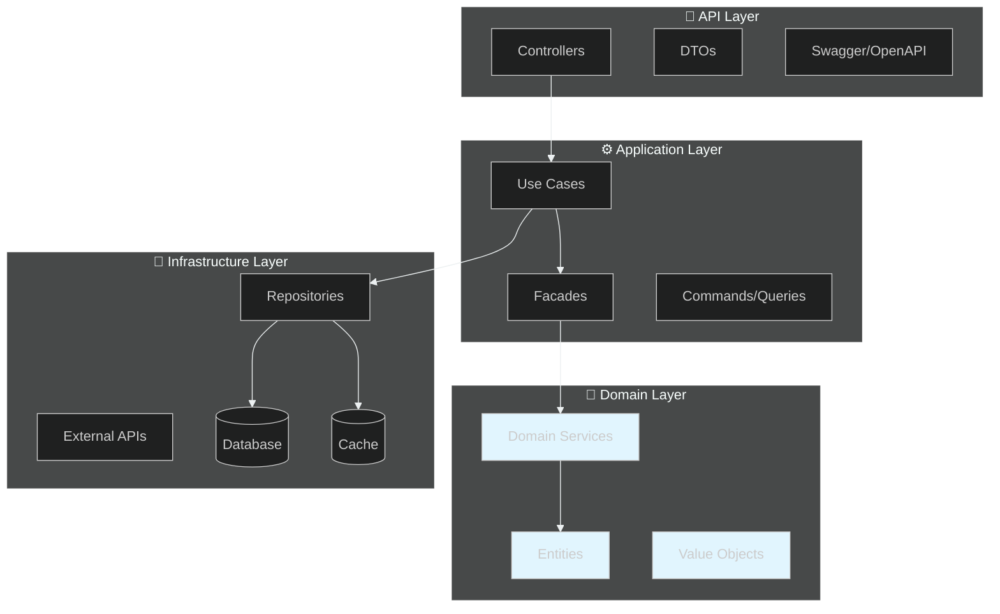

# 🏗️ Integration Platform

## Arquitectura Enterprise

### Implementos

Note:
Bienvenidos a esta presentación sobre nuestro Integration Platform.
Esta es la presentación principal que sirve como índice y punto de entrada al sistema de presentaciones modulares.
Vamos a ver cómo empezar rápidamente, conocer la estructura del sistema, y dónde encontrar información detallada sobre temas específicos.

---

## 📋 Agenda

1. **🚀 Tu Primer Día** - Setup, comandos, testing básico
2. **📁 Conoce el Sistema** - Estructura, módulos, arquitectura
3. **🏛️ Clean Architecture** - Capas y organización
4. **🎓 Guía de Onboarding** - Ruta recomendada de aprendizaje

Note:
Esta presentación cubre lo esencial para empezar a contribuir.
Primero veremos el setup y comandos básicos, luego la estructura del sistema,
y finalmente la ruta recomendada de aprendizaje según tu rol.

---

## 🚀 Tu Primer Día

> Lo esencial para empezar a contribuir HOY

⬇️ _Navega hacia abajo para ver detalles_

Note:
Esta es la parte más importante para ustedes: cómo empezar a contribuir.
Vamos a ver el setup del proyecto, los comandos que usarán todos los días, y cómo escribir tests.
No se preocupen si al principio parece mucho - todos empezamos así.


----

<!-- .slide: data-background="#181818" data-background-transition="fade" -->

### Setup Local

```bash
# Clonar
git clone https://github.com/developer-implementos/core.git

# Instalar dependencias
pnpm install

# Configurar variables de entorno
cp apps/integration-api/.env.example apps/integration-api/.env

# Levantar MongoDB
docker-compose up -d

# Iniciar desarrollo
pnpm nx serve integration-api
```

Note:
Estos son los pasos para configurar el proyecto en su máquina.
Es importante seguirlos en orden - si algo falla, pregunten al equipo.
El comando más importante es pnpm install - instala todas las dependencias.
NUNCA modifiquen el archivo .env directamente - usen el ejemplo.

----

<!-- .slide: data-background="#1c1c1c" data-background-transition="fade" -->

### Comandos Útiles

```bash
# Desarrollo
pnpm nx serve integration-api     # Iniciar API
pnpm nx serve admin        # Iniciar Admin

# Testing
pnpm nx test <proyecto>    # Tests unitarios
pnpm nx e2e admin-e2e      # Tests E2E

# Calidad
pnpm nx lint <proyecto>    # Linting
pnpm nx affected -t test   # Solo tests afectados

# Build
pnpm nx build integration-api     # Build producción
pnpm nx graph            # Grafo dependencias
```

Note:
Estos comandos los van a usar todos los días.
pnpm nx serve integration-api arranca el servidor local.
pnpm nx test <proyecto> corre los tests.
pnpm nx affected -t test es mágico: solo corre tests de lo que cambió.
Memoricen estos - se vuelven segunda naturaleza rápido.

----

<!-- .slide: data-background="#181818" data-background-transition="fade" -->

### Comandos de Testing Esenciales

```bash
# 1. Test de un proyecto específico
pnpm nx test inventory-domain

# 2. Tests afectados (el más común)
pnpm nx affected -t test

# 3. Watch mode (mientras desarrollas)
pnpm nx test inventory-domain --watch

# 4. Con cobertura
pnpm nx test inventory-domain --coverage
```

**💡 Tip**: Usa `--watch` durante desarrollo para ver resultados en tiempo real

Note:
El comando más importante es affected - solo corre tests de lo que cambió.
Watch mode es tu mejor amigo durante desarrollo activo.

----

<!-- .slide: data-background="#181818" data-background-transition="fade" -->

### Patrón AAA: Arrange-Act-Assert

```typescript
it('should reserve stock when available', async () => {
  // Arrange - Preparar datos y mocks
  const input = { sku: 'SKU-001', qty: 10 };
  mockRepo.findBySku.mockResolvedValue({ available: 100 });

  // Act - Ejecutar lo que estás probando
  const result = await service.reserveStock(input);

  // Assert - Verificar el resultado
  expect(result).toBe(expectedValue);
});
```

<div style="display: flex; gap: 30px; justify-content: center; margin-top: 30px;">
<div style="flex: 1; text-align: center; padding: 15px; background: #1a3a2f; border-radius: 10px;">

**🎯 Arrange**

Preparar datos, mocks y estado inicial

</div>
<div style="flex: 1; text-align: center; padding: 15px; background: #2a3a4f; border-radius: 10px;">

**▶️ Act**

Ejecutar el código bajo prueba

</div>
<div style="flex: 1; text-align: center; padding: 15px; background: #3a2a4f; border-radius: 10px;">

**✅ Assert**

Verificar el resultado esperado

</div>
</div>

Note:
El patrón AAA es fundamental para escribir tests claros.
Arrange prepara todo, Act ejecuta UNA cosa, Assert verifica el resultado.

---

## 📁 Conoce el Sistema

> Estructura del monorepo y módulos de negocio

⬇️ _Navega hacia abajo para ver detalles_

Note:
Ahora que ya pueden correr el proyecto, vamos a entender cómo está organizado.

----

<!-- .slide: data-background="#181818" data-background-transition="fade" -->

### ¿Qué es el Integration Platform?

> **Monolito Modular** que centraliza la lógica de negocio crítica de Implementos

Note:
Es como un edificio de departamentos: todos viven en el mismo edificio, pero cada departamento tiene su propia cocina, bano y entrada.
Esta analogia es clave: los modulos son independientes pero comparten infraestructura.

----

### Estructura del Monorepo

``` [2-9|10-15|16-29|31|32]
core/
├── apps/
│   ├── admin/             # Panel administrativo
│   ├── admin-e2e/           # Tests E2E con Playwright
│   ├── integration-api/     # API principal
│   ├── notification-worker/ # Procesador async
│   ├── report-worker/       # Generador de reportes
│   └── sync-worker/         # Sincronización con ERP
│
├── libs/
│   ├── inventory/         # Bounded Context: Stock
│   ├── pricing/           # Bounded Context: Precios
│   ├── catalogue/         # Bounded Context: Productos
│   ├── notifications/     # Bounded Context: Alertas
│   └── shared/            # Infraestructura compartida
│       ├── backend/
│       │   ├── alerting/      # Teams Adaptive Cards
│       │   ├── api-dtos/      # Shared API DTOs
│       │   ├── authorization/ # JWT + Passport
│       │   ├── cache/         # Redis + In-Memory + StampedeGuard
│       │   ├── config/        # Environment config + validation
│       │   ├── database/      # MongoDB + Mongoose + Migrations
│       │   ├── kill-switch/   # Feature flags
│       │   ├── observability/ # Logging, Tracing, Metrics
│       │   ├── pubsub/        # Google Cloud Pub/Sub
│       │   ├── resilience/    # Circuit Breaker, Retry, Bulkhead
│       │   ├── security/      # Encryption, Data Redaction
│       │   └── sre/           # Error Budget, SLOs
│       └── testing/           # TestModuleBuilder, Mocks, Factories
│
├── infra/        # Terraform (GCP) - 4 fases
└── docs/         # 31+ documentos (RFCs, ADRs, Guides)
```

Note:
Esta es la estructura de carpetas real del proyecto.
apps/ contiene las aplicaciones que se despliegan: la API principal, el admin panel, y los workers.
libs/ contiene los bounded contexts y el código compartido.
Cada bounded context (inventory, pricing, catalogue, notifications) tiene su propia estructura de capas.
shared/ tiene toda la infraestructura reutilizable: cache, database, observability, security...
Esta organización hace muy fácil encontrar dónde está cada cosa.

----

<!-- .slide: data-background="#1c1c1c" data-background-transition="fade" -->

### Módulos de Negocio (Bounded Contexts)

<div style="font-size: 0.7em;">

| Módulo | Responsabilidad | Ejemplos de Endpoints |
|--------|----------------|----------------------|
| **Inventory** | Gestión de stock en tiempo real | `/api/inventory/stock/:sku` |
| **Pricing** | Cálculo de precios y descuentos | `/api/pricing/calculate` |
| **Catalogue** | Catálogo maestro de productos | `/api/catalogue/products` |
| **Notifications** | Notificaciones multi-canal async | `/v1/notifications/order-confirmed` |

</div>

**Principio**: Cada módulo es **independiente** y se comunica a través de **facades**

Note:
Cada modulo es dueno de una parte del dominio de negocio.
Los modulos no se llaman directamente - usan facades para mantener bajo acoplamiento.
Si necesitas datos de otro modulo, usa su facade, nunca accedas directamente a su codigo interno.

---

## 🏛️ Clean Architecture

> Capas y organización del código

⬇️ _Navega hacia abajo para ver detalles_

Note:
Clean Architecture es el patron que usamos para organizar el codigo.
Entender esto es fundamental para leer y modificar cualquier modulo.
No te preocupes si parece complejo - se vuelve natural con la practica.

----

### 🏛️ Clean Architecture

## Capas del Sistema

Note:
Este diagrama es tu mapa mental del sistema.
Memoriza las capas: API arriba, Domain en el centro.
Las flechas muestran quien puede llamar a quien.



> **Regla de Dependencia**: Las capas internas NO conocen las externas

Note:
Clean Architecture organiza el código en capas como una cebolla.
En el centro está el Dominio - la lógica de negocio pura.
Luego Aplicación - los casos de uso que orquestan el dominio.
Después Infraestructura - bases de datos, APIs externas, etc.
Y finalmente API - los endpoints que exponen todo al mundo exterior.
La regla de oro: las dependencias siempre van hacia adentro, NUNCA hacia afuera.

----

<!-- .slide: data-background="#181818" data-background-transition="fade" -->

### Estructura de un Módulo

```
libs/inventory/
├── domain/              # 💎 Core Business Logic
│   ├── entities/        # Stock, Movement
│   ├── value-objects/   # SKU, Quantity
│   ├── services/        # Domain logic
│   └── errors/          # Business errors
│
├── application/         # ⚙️ Use Cases
│   ├── use-cases/       # ReserveStockUseCase
│   ├── facades/         # InventoryFacade
│   └── dto/             # Input/Output DTOs
│
├── infrastructure/      # 🔧 Technical Details
│   ├── repositories/    # StockRepository (Mongoose)
│   ├── adapters/        # External APIs
│   └── mappers/         # Entity ↔ Persistence
│
└── api/                 # 🎯 HTTP Layer
    ├── controllers/     # REST endpoints
    ├── dto/             # Request/Response
    └── guards/          # Authorization
```

Note:
Esta es la estructura de CADA módulo.
Domain es el corazón - no depende de nada externo.
Application orquesta use cases.
Infrastructure implementa detalles tecnicos.
API expone todo a traves de HTTP.
Cuando busques donde esta algo, piensa en que capa pertenece.

----

<!-- .slide: data-background="#181818" data-background-transition="fade" -->

### 🚨 Error Handling

> Errores estandarizados con DomainError

```typescript
// Definir error custom
export class InsufficientStockError extends DomainError {
  constructor(sku: string, requested: number, available: number) {
    super({
      code: 'INVENTORY.INSUFFICIENT_STOCK',
      message: 'Stock insuficiente para ' + sku,
      category: ErrorCategory.BUSINESS_RULE,
      details: { sku, requested, available },
    });
  }
}

// Usar en el servicio
async reserveStock(sku: string, quantity: number): Promise<void> {
  const stock = await this.repository.findBySku(sku);

  if (stock.available < quantity) {
    throw new InsufficientStockError(sku, quantity, stock.available);
  }

  await this.repository.reserve(sku, quantity);
}
```

Note:
El manejo de errores está estandarizado.
Definimos errores custom que extienden DomainError.
El código de error incluye contexto útil para debugging.

----

<!-- .slide: data-background="#1c1c1c" data-background-transition="fade" -->

### Resultado Automático en HTTP

> El `GlobalExceptionFilter` convierte DomainError a respuesta HTTP

```json
{
  "success": false,
  "error": {
    "code": "INVENTORY.INSUFFICIENT_STOCK",
    "message": "Stock insuficiente para SKU-001",
    "details": { "sku": "SKU-001", "requested": 100, "available": 50 }
  }
}
```

**Beneficios:**
- Código único para manejar programáticamente
- Mensaje claro para mostrar al usuario
- Detalles para debugging

Note:
El GlobalExceptionFilter convierte DomainError a JSON automáticamente.
No tienes que hacer try/catch en cada controller.
El frontend puede usar el código de error para mostrar mensajes específicos.

---

## 🎓 Guía de Onboarding

> Ruta recomendada de aprendizaje

⬇️ _Navega hacia abajo para ver el plan_

Note:
Esta es la ruta recomendada para nuevos desarrolladores.
No tienes que aprender todo de una vez - sigue el plan semana a semana.
Lo mas importante es poder contribuir codigo, no memorizar arquitectura.

----

<!-- .slide: data-background="#181818" data-background-transition="fade" -->

### 📅 Semana 1: Fundamentos

**Día 1-2: Setup**
- ✅ Setup local completo
- ✅ Ver: "Tu Primer Día" + "Conoce el Sistema"
- ✅ Correr comandos básicos (serve, test, build)

**Día 3-5: Developer Workflow**
- 📺 Ver presentación: **Developer Workflow**
- ✅ Hacer tu primer commit (Conventional Commits)
- ✅ Abrir tu primer PR
- ✅ Escribir tu primer test (patrón AAA)

Note:
La primera semana es práctica y operacional.
Enfóquense en poder contribuir - no en memorizar todo.
Al final de la semana deben poder hacer commits y PRs.

----

<!-- .slide: data-background="#1c1c1c" data-background-transition="fade" -->

### 📅 Semana 2: Arquitectura

**Día 1-2: Contexto**
- 📺 Ver: **Por Qué Monolito Modular**
- 📖 Leer: ADR-0001

**Día 3-5: Clean Architecture**
- ✅ Revisar "Clean Architecture" en esta presentación
- ✅ Explorar código de un módulo (inventory)
- ✅ Identificar las 5 capas en código real
- ✅ Implementar un endpoint end-to-end

Note:
La segunda semana profundiza en arquitectura.
Al final deben poder implementar un endpoint completo.
Usen el código existente como referencia.

----

<!-- .slide: data-background="#181818" data-background-transition="fade" -->

### 📅 Semana 3: Patrones Enterprise

- 📺 Ver presentación: **Enterprise Patterns**
- 📖 Estudiar según tu área:
  - Integraciones → Facade Pattern
  - Async → Transactional Outbox
  - APIs externas → Circuit Breaker
  - Cache → Stampede Guard
- ✅ Implementar feature usando un patrón

Note:
Semana 3 es para patrones avanzados.
Estudia solo los patrones relevantes a tu trabajo actual.

----

<!-- .slide: data-background="#1c1c1c" data-background-transition="fade" -->

### 📅 Semana 4: Caso de Estudio

- 📺 Ver: Caso de Estudio de Notificaciones
- 🔍 Analizar flujo completo en el código
- 📖 Leer RFCs: RFC-0008, RFC-0014
- ✅ Contribuir mejoras al sistema

Note:
Semana 4 es opcional para juniors.
Es material de referencia para cuando trabajen en features complejas.

----

<!-- .slide: data-background="#1c1c1c" data-background-transition="fade" -->

### 🎯 Roles y Prioridades

<table style="font-size: 0.7em; margin: 0 auto;">
  <thead>
    <tr>
      <th>Rol</th>
      <th>Prioridad Alta</th>
      <th>Prioridad Media</th>
    </tr>
  </thead>
  <tbody>
    <tr>
      <td><strong>Junior Dev</strong></td>
      <td>
        • Developer Workflow<br>
        • Tu Primer Día<br>
        • Testing básico
      </td>
      <td>
        • Clean Architecture<br>
        • Por Qué Monolito Modular
      </td>
    </tr>
    <tr>
      <td><strong>Mid-Level Dev</strong></td>
      <td>
        • Developer Workflow<br>
        • Clean Architecture<br>
        • Enterprise Patterns
      </td>
      <td>
        • Por Qué Monolito Modular<br>
        • Caso de Estudio
      </td>
    </tr>
    <tr>
      <td><strong>Senior Dev / Lead</strong></td>
      <td>
        • Enterprise Patterns (completo)<br>
        • Por Qué Monolito Modular<br>
        • Caso de Estudio + Métricas
      </td>
      <td>
        • Developer Workflow<br>
        • Documentación (ADRs/RFCs)
      </td>
    </tr>
    <tr>
      <td><strong>Tech Lead / Architect</strong></td>
      <td>
        • TODAS las presentaciones<br>
        • ADRs y RFCs completos<br>
        • Contribuir a decisiones
      </td>
      <td>
        • Crear nuevas presentaciones<br>
        • Mejorar documentación
      </td>
    </tr>
  </tbody>
</table>

Note:
No todos necesitan ver todo al mismo tiempo.
Juniors: enfóquense en workflow y poder contribuir.
Mid-level: profundicen en arquitectura y patrones.
Seniors: entiendan el "por qué" y contribuyan a decisiones.
Architects: vision completa y evolucion del sistema.
Si eres junior, no te agobies con Enterprise Patterns al principio.

----

<!-- .slide: data-background="#181818" data-background-transition="fade" -->

### 📚 Documentación Interna

- 📁 `docs/architecture/rfcs/` - Request for Comments (35)
- 📁 `docs/architecture/adrs/` - Architecture Decision Records (67)
- 📁 `docs/guides/` - Guías de desarrollo
- 📁 `docs/operations/` - Runbooks operacionales

Note:
Los RFCs explican propuestas y el "por que" de decisiones.
Los ADRs documentan decisiones tomadas y sus trade-offs.
No necesitas leerlos todos - consultalos cuando trabajes en un area especifica.

----

<!-- .slide: data-background="#1c1c1c" data-background-transition="fade" -->

### 🔗 Referencias Externas

- [NestJS Documentation](https://docs.nestjs.com/)
- [Nx Documentation](https://nx.dev/)
- [Clean Architecture](https://blog.cleancoder.com/uncle-bob/2012/08/13/the-clean-architecture.html)
- [Cockatiel (Resilience)](https://github.com/connor4312/cockatiel)

Note:
Estos son los recursos externos más relevantes para el stack.
NestJS y Nx son la base del proyecto.
Clean Architecture es el patrón que seguimos.

---

## 🚀 Próximos Pasos

> Tu camino para empezar a contribuir

⬇️ _Navega hacia abajo para ver detalles_

Note:
Estos son los pasos recomendados según tu situación.
Si eres nuevo, sigue el plan día a día.

----

<!-- .slide: data-background="#1c1c1c" data-background-transition="fade" -->

### Para Nuevos Desarrolladores

<div style="text-align: left; padding: 30px; background: #1e1e1e; border-radius: 10px;">

1. **Completa el setup** (Día 1)
2. **Ve Developer Workflow** (Día 3)
3. **Haz tu primer commit** (Día 4-5)
4. **Explora una feature completa** (Semana 2)

</div>

Note:
El objetivo es que puedan contribuir de forma efectiva.
No te apures - es mejor ir paso a paso.

----

<!-- .slide: data-background="#181818" data-background-transition="fade" -->

### Para Todos

- 📺 Ver presentaciones según tu rol
- 📖 Leer ADRs relacionados a tu trabajo
- 💬 Preguntar al equipo sin miedo
- 🔄 Contribuir mejoras a la documentación

Note:
Las presentaciones están diseñadas para ser material de referencia.
Vuelvan a ellas cuando trabajen en áreas específicas.
Y recuerden: todos empezamos sin saber - pregunten sin miedo.

---

# 🙏 Gracias

Note:
Gracias por su atención.
Bienvenidos al equipo - estamos aquí para ayudarlos a crecer como developers.
