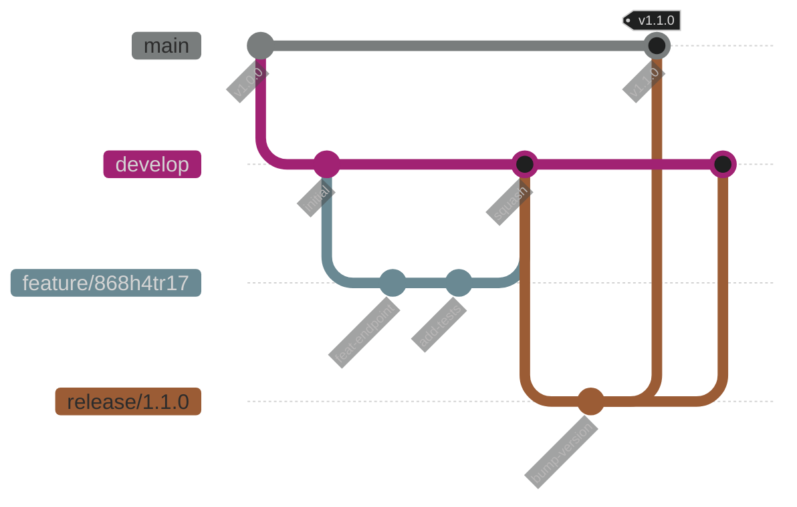
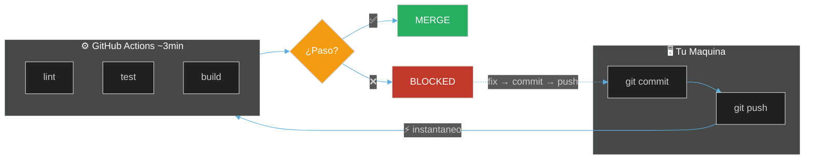

# Developer Workflow

### Tu dia a dia: del codigo al merge

Note:
Bienvenidos! Esta presentacion cubre el flujo de trabajo diario.
No te preocupes si parece mucho al principio - con practica se vuelve automatico.
Todos pasamos por la curva de aprendizaje. Pregunta cuando tengas dudas.

---

## 📋 Agenda

1. **📝 Conventional Commits** - Formato obligatorio
2. **🌿 Branches** - Nomenclatura y flujo
3. **🔀 Pull Requests** - Proceso completo
4. **👀 Code Review** - Como revisar y ser revisado
5. **✅ Validacion de Codigo** - CI valida automaticamente

Note:
Este workflow es OBLIGATORIO - no es opcional ni sugerencia.
El CI rechaza commits que no siguen estas reglas.
Pero no te asustes - las herramientas te ayudan a seguir el formato.
Si algo falla, el error te dice exactamente que corregir.

---

## 🔄 El Ciclo Diario

> Del codigo al deploy: el ciclo completo

⬇️ _Navega hacia abajo para ver detalles_

Note:
Este es el flujo que van a seguir todos los dias.
Cada paso tiene reglas especificas que vamos a ver.
La primera semana puede parecer lento, pero pronto sera natural.
Tip: ten esta presentacion abierta mientras trabajas los primeros dias.

----

<!-- .slide: data-background="#181818" data-background-transition="fade" -->

### Ciclo de Desarrollo

```text
CODE → BRANCH → COMMIT → PUSH → PR → REVIEW → MERGE
```

| Paso | Herramienta | Regla |
|------|-------------|-------|
| Code | VS Code | Format on save |
| Branch | Git | Desde `develop`: feature/#taskId |
| Commit | Git | Conventional commits |
| Push | Git | A tu branch, nunca a main |
| PR | GitHub | Template obligatorio |
| Review | GitHub | CODEOWNERS approval |
| Merge | GitHub | Squash merge |

Note:
Este ciclo se repite cientos de veces al dia en el equipo.
La tabla explica cada paso:
- Code: VS Code formatea automaticamente al guardar (Prettier)
- Branch: Siempre crear una branch desde develop (feature/#taskId)
- Commit: Mensajes con formato conventional commits (feat, fix, etc.)
- Push: Subir tu branch a GitHub, NUNCA hacer push directo a main
- PR: Crear Pull Request usando el template del repo
- Review: Un CODEOWNER debe aprobar antes del merge
- Merge: Usamos squash merge para mantener el historial limpio

---

## 📝 Conventional Commits

> Formato obligatorio para mensajes de commit

⬇️ _Navega hacia abajo para ver detalles_

Note:
Los conventional commits son OBLIGATORIOS.
El CI rechaza commits que no siguen el formato.
Si tu commit es rechazado, revisa el mensaje antes de pedir ayuda.

----

<!-- .slide: data-background="#1c1c1c" data-background-transition="fade" -->

### Estructura del Commit

```bash
<type>(<scope>): <description>
```

**Ejemplos reales:**

```bash
feat(inventory): add bulk import endpoint
fix(pricing): correct decimal precision
docs(api): update pagination examples
refactor(core): extract validation to shared lib
test(catalogue): add unit tests for SKU
chore(deps): update nestjs to v11
```

Note:
type = que tipo de cambio es (feat, fix, docs, etc)
scope = que modulo afecta (inventory, pricing, etc)
description = que hiciste (imperativo, minusculas, en ingles)
Tip: si no sabes que type usar, 90% de las veces es "feat" o "fix".
La descripcion debe completar la frase "This commit will..."

----

<!-- .slide: data-background="#181818" data-background-transition="fade" -->

### Tipos de Commit

| Tipo | Cuando usar | Version |
|------|-------------|---------|
| `feat` | Nueva funcionalidad | Minor ↑ |
| `fix` | Corregir un bug | Patch ↑ |
| `docs` | Solo documentacion | - |
| `refactor` | Cambiar sin agregar feature | - |
| `test` | Agregar o modificar tests | - |
| `chore` | Tareas de mantenimiento | - |
| `perf` | Mejoras de rendimiento | Patch ↑ |

Note:
feat y fix afectan el versionado automatico.
Los otros tipos son importantes para el CHANGELOG pero no afectan version.

----

<!-- .slide: data-background="#1c1c1c" data-background-transition="fade" -->

### Scope

El scope indica el modulo afectado:

```bash
feat(inventory): ...     # Modulo de inventario
fix(pricing): ...        # Modulo de precios
test(catalogue): ...     # Modulo de catalogo
chore(deps): ...         # Dependencias
```

Si afecta varios modulos, omitir scope:

```bash
feat: add global search across modules
```

Note:
El scope ayuda a filtrar commits en el historial.
Usa el nombre de la carpeta en libs/ como scope.

----

<!-- .slide: data-background="#181818" data-background-transition="fade" -->

### Breaking Changes

Si tu cambio rompe compatibilidad:

```bash
# Opcion 1: Agregar "!"
feat!: remove deprecated v1 API endpoints

# Opcion 2: En el body
feat(auth): change token format

BREAKING CHANGE: tokens now use JWT instead of opaque.
```

**Breaking change = version mayor (1.0 → 2.0)**

Note:
Los breaking changes son serios - rompen compatibilidad para otros.
Antes de agregar un "!" SIEMPRE consulta con el equipo.
Como junior, probablemente no necesites hacer breaking changes.
Si crees que necesitas uno, pregunta a un senior primero.

----

<!-- .slide: data-background="#1c1c1c" data-background-transition="fade" -->

### AI-Assisted Commits

GitLens y GitHub Copilot estan configurados para generar commits en español:


**Ya configurado** en `.vscode/settings.json` - solo usa el boton ✨

Note:
La AI genera un borrador - SIEMPRE revisalo antes de aceptar.
A veces el scope esta mal o el mensaje es demasiado generico.
Tip: usar la AI es totalmente aceptable - no es "hacer trampa".
Pero tu eres responsable del mensaje final, asi que revisalo.

---

## 🌿 Branches

> Usamos **Git Flow**: features van a `develop`, releases a `main`

⬇️ _Navega hacia abajo para ver detalles_

Note:
Usamos Git Flow - un modelo de branching con dos branches principales:
- main: codigo en produccion, siempre estable
- develop: integracion de features, aqui va tu trabajo
Cada branch debe tener un proposito claro y un solo objetivo.
PRs pequenos son mas faciles de revisar y aprobar rapidamente.
Regla de oro: una branch = un ticket de ClickUp.

----

<!-- .slide: data-background="#1c1c1c" data-background-transition="fade" -->

### Nomenclatura

```bash
# Patron: <type>/#<clickup-id>-<descripcion-corta>

feature/#868h4tr17-add-bulk-import
fix/#86abcd123-pricing-decimal
refactor/#86xyz789-extract-validation
docs/#86abc456-api-examples
```

**NO hacer:**

```bash
my-branch           # Sin tipo ni ticket
feature/test        # Sin ticket
feature/868h4tr17   # Sin # (no linkea automatico)
```

Note:
IMPORTANTE: El task ID va SOLO en el nombre de la branch, NO en los commits.

Por que? Porque cuando creas un PR desde esta branch, GitHub detecta el #taskId y ClickUp lo vincula automaticamente. Asi:
- La branch tiene el ID: feature/#868h4tr17-add-bulk-import
- Los commits quedan limpios: feat(pricing): add bulk import endpoint
- El PR queda vinculado al task de ClickUp automaticamente

Esto es lo que hacen Google, Meta y otras BigTech: el tracking es via branches y PRs, los commits se mantienen limpios con solo el mensaje descriptivo.

El # antes del ID es OBLIGATORIO para que ClickUp vincule automaticamente.
El ID lo encuentras en la URL del task o con el boton "Copy ID" en ClickUp.

----

<!-- .slide: data-background="#181818" data-background-transition="fade" -->

### Donde Encontrar el Task ID


**Tip**: El boton "Copy ID" copia el ID con el `#` incluido

Note:
El ID esta en la URL del task despues de /t/.
Tambien puedes usar el boton "Copy ID" en el menu del task.

----

<!-- .slide: data-background="#181818" data-background-transition="fade" -->

### Flujo de Branches (Git Flow)

<div style="display: flex; justify-content: center; transform: scale(1.2); margin: 40px 0;">



</div>

**Reglas:**
- Features y fixes: crear desde `develop`
- Releases: de `develop` a `main`
- Hotfixes: desde `main` (emergencias)

Note:
Git Flow tiene dos branches permanentes: main y develop.
Tu trabajo diario va a develop - NUNCA directo a main.
main solo recibe codigo via release branches o hotfixes.
Esto asegura que main siempre tenga codigo estable de produccion.

----

<!-- .slide: data-background="#1c1c1c" data-background-transition="fade" -->

### Mantener tu Branch Actualizada

```bash
# Opcion 1: Rebase (preferido)
git fetch origin
git rebase origin/develop

# Opcion 2: Merge
git fetch origin
git merge origin/develop

# Despues de resolver conflictos
git push --force-with-lease
```

Note:
Rebase mantiene el historial mas limpio, pero puede ser confuso al inicio.
Si tienes conflictos y no sabes resolverlos, pide ayuda antes de hacer force.
force-with-lease es mas seguro que force - evita sobrescribir trabajo de otros.
Tip: si te confundes con rebase, puedes usar merge - ambos funcionan.

---

## 🔀 Pull Requests

> El PR es donde ocurre la magia del code review

⬇️ _Navega hacia abajo para ver detalles_

Note:
El PR es tu oportunidad de explicar tu trabajo al equipo.
Un buen PR hace que el review sea rapido y facil.
No tengas miedo de crear PRs - es la forma normal de trabajar.
Tu primer PR puede tomar varios intentos - es completamente normal.

----

<!-- .slide: data-background="#181818" data-background-transition="fade" -->

### Crear un PR

```bash
# Desde terminal
gh pr create --title "feat(inventory): add bulk import"

# O desde GitHub UI
# 1. Push tu branch
# 2. Click "Compare & pull request"
# 3. Llenar template
```

Note:
gh CLI es mas rapido que la UI web para crear PRs.
Pero si prefieres usar la UI web o VS Code, esta perfectamente bien.
Usa la herramienta con la que te sientas mas comodo al principio.
Con el tiempo, iras descubriendo cual es tu flujo preferido.

----

<!-- .slide: data-background="#1c1c1c" data-background-transition="fade" -->

### Crear PR desde VS Code (Recomendado)

La extension **GitHub Pull Requests** permite crear PRs sin salir del editor:


Note:
Esta es la forma mas comoda de crear PRs sin salir de VS Code.
La extension ya esta en las recomendadas del workspace - solo instalala.
Si no ves el boton "Create Pull Request", asegurate de haber hecho push primero.

----

<!-- .slide: data-background="#181818" data-background-transition="fade" -->

### Crear PR - Formulario


**Tip**: El titulo debe seguir conventional commits: `type(scope): descripcion`

Note:
Este es el formulario que aparece al crear un PR desde VS Code.
El titulo es IMPORTANTE porque al hacer squash merge, se convierte en el commit final en main.
Usa conventional commits: feat, fix, docs, refactor, etc.
La descripcion puede usar el template del repo o escribir libre.

----

<!-- .slide: data-background="#181818" data-background-transition="fade" -->

### Review PRs desde VS Code

Revisar codigo directamente en el editor con syntax highlighting:

```text
┌─────────────────────────────────────────────────────────────┐
│  GitHub Pull Requests (Panel izquierdo)                     │
│  ┌───────────────────────────────────────────────────────┐  │
│  │  ☰ PULL REQUESTS                                      │  │
│  │    ├─ #123 feat(inventory): bulk import   ← Asignado  │  │
│  │    ├─ #124 fix(pricing): decimal error                │  │
│  │    └─ #125 docs: update README                        │  │
│  └───────────────────────────────────────────────────────┘  │
│                                                             │
│  Al hacer click en un PR:                                   │
│  ┌───────────────────────────────────────────────────────┐  │
│  │  - Ver diff con syntax highlighting                   │  │
│  │  - Agregar comentarios inline                         │  │
│  │  - Aprobar / Solicitar cambios                        │  │
│  │  - Merge desde VS Code                                │  │
│  └───────────────────────────────────────────────────────┘  │
└─────────────────────────────────────────────────────────────┘
```

<!-- INSERT_IMAGE: screenshot-review-pr-vscode.png -->

**Extension**: `GitHub Pull Requests and Issues` (ya en recomendadas)

Note:
Revisar PRs en VS Code es mas comodo que en el navegador.
Puedes ver el codigo con syntax highlighting y navegar entre archivos.

----

<!-- .slide: data-background="#1c1c1c" data-background-transition="fade" -->

### Template de PR

```markdown
## Descripcion
Breve descripcion del cambio.

## Tipo de cambio
- [ ] Bug fix
- [ ] Nueva feature
- [ ] Refactor

## ClickUp Task
#868h4tr17

## Checklist
- [ ] Tests agregados/actualizados
- [ ] Lint pasa sin errores
```

**Importante**: El `#taskID` en el PR linkea automaticamente con ClickUp

Note:
El # antes del task ID hace que ClickUp vincule el PR automaticamente.
Puedes ponerlo en el titulo o en la descripcion - ambos funcionan.

----

<!-- .slide: data-background="#181818" data-background-transition="fade" -->

### Status Checks

Antes de merge, tu PR debe pasar:

| Check | Que verifica | Obligatorio |
|-------|--------------|-------------|
| `lint` | ESLint sin errores | ✅ |
| `test` | Tests unitarios | ✅ |
| `build` | Compila sin errores | ✅ |
| `sonar` | Quality gate | ✅ |
| `review` | Aprobacion CODEOWNERS | ✅ |

Note:
Si un check falla, el merge esta bloqueado - pero no entres en panico.
Lee el error del check antes de pedir ayuda - generalmente es claro.
Los errores mas comunes son: lint (formato), test (test roto), build (typo).
Tip: haz click en "Details" en el check fallido para ver el log completo.

----

<!-- .slide: data-background="#1c1c1c" data-background-transition="fade" -->

### PR Aprobado - Listo para Merge

Cuando tu PR tiene todas las aprobaciones y checks verdes:


**El boton "Squash and merge"** combina todos tus commits en uno solo con un mensaje limpio.

Note:
Este es el momento de la verdad - tu PR esta listo para merge!
Verifica que todos los checks esten verdes antes de hacer click.
El squash merge junta todos tus commits en uno - asi el historial de main queda limpio.
Si tienes dudas sobre el mensaje del squash, editalo para que sea descriptivo.

---

## 👀 Code Review

> Aprender y mejorar juntos

⬇️ _Navega hacia abajo para ver detalles_

Note:
El code review no es un examen - es una oportunidad de aprender.
No solo busques errores - busca oportunidades de mejora.
Tambien reconoce el buen trabajo con "praise:".
Como junior, el feedback en tus PRs te ayudara a crecer rapidamente.

----

<!-- .slide: data-background="#1c1c1c" data-background-transition="fade" -->

### Como Reviewer

**Cosas a revisar:**

1. **LOGICA** - El codigo hace lo que dice?
2. **TESTS** - Hay tests para el cambio?
3. **SEGURIDAD** - Input validation? No secrets?
4. **ESTILO** - Sigue los patrones del proyecto?

Note:
El code review no es para criticar - es para mejorar el codigo juntos.
Se especifico y constructivo en tus comentarios.
Si recibes feedback, no lo tomes personal - todos recibimos feedback.
Si no entiendes un comentario, pregunta - es mejor clarificar que asumir.

----

<!-- .slide: data-background="#181818" data-background-transition="fade" -->

### Etiquetas de Comentarios

| Etiqueta | Significado | Bloquea? |
|----------|-------------|----------|
| `blocking:` | Debe corregirse | ✅ Si |
| `suggestion:` | Mejora opcional | ❌ No |
| `question:` | Necesito entender | ⚠️ Depende |
| `nit:` | Nitpicking menor | ❌ No |
| `praise:` | Buen trabajo! | ❌ No |

Note:
Usa las etiquetas para que el autor sepa si es bloqueante o no.
"blocking:" DEBE corregirse antes del merge. "nit:" es solo una sugerencia.
Si recibes un "nit:", puedes ignorarlo si tienes buena razon - no es obligatorio.
Como junior, enfocate primero en los "blocking:" - son los importantes.

----

<!-- .slide: data-background="#1c1c1c" data-background-transition="fade" -->

### Ejemplos de Comentarios

```markdown
blocking: Este query puede causar N+1, usar eager loading

suggestion: Podrias extraer esto a un helper

nit: Prefiero `const` sobre `let` aqui

praise: Excelente manejo del edge case!
```

Note:
No olvides el "praise:" - reconocer buen trabajo motiva al equipo.
Un review solo con criticas es desmoralizante.

----

<!-- .slide: data-background="#181818" data-background-transition="fade" -->

### CODEOWNERS

```bash
# .github/CODEOWNERS

/libs/core/           @team-leads
/libs/inventory/      @inventory-team
/libs/pricing/        @pricing-team
/.github/workflows/   @devops-team
```

Tu PR necesita approval del CODEOWNER del codigo que modificaste.

Note:
CODEOWNERS protege codigo critico de cambios sin supervision.
Si modificas libs/core/ necesitas aprobacion de un tech lead.
Esto no es para frenarte - es para asegurar que alguien con contexto revise.
Como junior, es normal que tus PRs requieran mas aprobaciones - es parte del proceso.

---

## ✅ Validacion de Codigo

> CI valida todo - sin hooks locales (enfoque BigTech)

Note:
No usamos pre-commit hooks porque son lentos y molestos.
CI valida todo despues del push - es mas rapido para el developer.
Esto significa que puedes hacer commits rapidos y el CI te avisa si hay errores.
No te preocupes si CI falla - simplemente corrige y haz push de nuevo.

----

<!-- .slide: data-background="#1c1c1c" data-background-transition="fade" -->

### Flujo de Validacion



**No hay pre-commit hooks** - commits inmediatos, CI valida despues

Note:
Los commits son instantaneos - CI corre en paralelo mientras sigues trabajando.
Si falla, arreglas y vuelves a pushear.

----

<!-- .slide: data-background="#181818" data-background-transition="fade" -->

### VS Code te Ayuda

```json
// .vscode/settings.json (ya configurado)
{
  "editor.formatOnSave": true,
  "editor.defaultFormatter": "esbenp.prettier-vscode",
  "editor.codeActionsOnSave": {
    "source.fixAll.eslint": true
  }
}
```

Al guardar: Prettier formatea + ESLint corrige = menos errores en CI

Note:
Format on save es tu mejor amigo - el codigo se formatea automaticamente.
Si no funciona, verifica que las extensiones esten instaladas.

----

<!-- .slide: data-background="#181818" data-background-transition="fade" -->

### Reglas de ESLint Importantes

> Errores que CI atrapa automaticamente

```typescript
// ❌ @typescript-eslint/no-floating-promises
async function bad() {
  fetchData();  // Promise no awaited - BUG!
}

// ✅ Correcto
async function good() {
  await fetchData();
}

// ❌ @typescript-eslint/no-misused-promises
arr.forEach(async (n) => await process(n)); // BUG!

// ✅ Correcto
await Promise.all(arr.map((n) => process(n)));
```

Note:
Estas son las reglas mas importantes que atrapan bugs reales.
Si ven errores de floating promises, SIEMPRE agregar await.
forEach con async es un error MUY comun - usa Promise.all en su lugar.
Tip: ESLint te marcara estos errores en rojo en VS Code antes de commitear.

----

<!-- .slide: data-background="#1c1c1c" data-background-transition="fade" -->

### Mas Detalles

Para entender el pipeline completo de CI/CD:

📚 **Ver presentacion**: [CI/CD Pipeline](cicd-pipeline.md)

**Contenido**:

- GitHub Actions workflows
- Quality gates y SonarCloud
- Deploy automatico a Cloud Run
- Nx affected y cache distribuido

Note:
Si quieres entender mas sobre CI/CD, ve la presentacion dedicada.
Por ahora solo necesitas saber que CI valida tu codigo.

---

## 📖 Resumen

> Tu dia a dia en 4 pasos

⬇️ _Navega hacia abajo para ver detalles_

Note:
Este resumen es tu guia de referencia rapida para el dia a dia.
Guardalo o imprimelo para tener a mano tu primera semana.
No necesitas memorizar todo - con practica se vuelve automatico.
Y recuerda: siempre puedes preguntar si tienes dudas.

----

<!-- .slide: data-background="#181818" data-background-transition="fade" -->

### Tu Dia a Dia

```bash
# 1. Crear branch desde develop (copia el #taskID de ClickUp)
git checkout develop && git pull
git checkout -b feature/#868h4tr17-mi-feature

# 2. Commits
git commit -m "feat(modulo): descripcion"

# 3. Push y PR
git push -u origin feature/#868h4tr17-mi-feature
gh pr create --title "feat(modulo): descripcion #868h4tr17"

# 4. Responder review y merge
```

Note:
El #taskID en el nombre de branch Y en el PR title asegura el link con ClickUp.
Copia el ID directamente desde ClickUp con "Copy ID".

----

<!-- .slide: data-background="#1c1c1c" data-background-transition="fade" -->

### Comandos Utiles

```bash
git status              # Ver estado
git diff                # Ver diferencias
git log --oneline -10   # Ver historial
git commit --amend      # Enmendar ultimo commit
git rebase origin/develop  # Actualizar branch
```

Note:
git status y git diff son tus mejores amigos para entender que cambio.
Usalos antes de cada commit para no incluir archivos por accidente.
git log te ayuda a ver que han hecho otros - util para aprender patrones.
Tip: VS Code Source Control (Ctrl+Shift+G) muestra todo esto visualmente.

---

# 🙏 Gracias

Note:
Felicitaciones por completar esta presentacion!
Si tienen dudas sobre el workflow, pregunten al equipo - todos fuimos nuevos alguna vez.
Recuerden: equivocarse es parte del aprendizaje - lo importante es preguntar cuando no sabes.
Pueden volver a esta presentacion cuando necesiten refrescar algun concepto.
