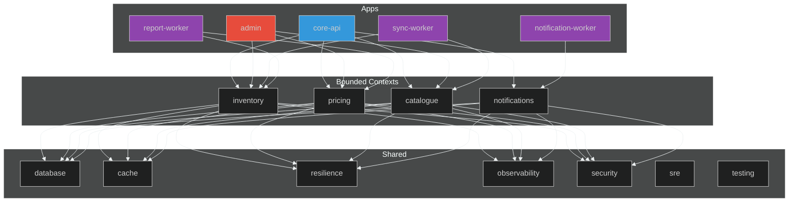

## 📁 Conoce el Sistema

> Estructura del monorepo y módulos de negocio

⬇️ _Navega hacia abajo para ver detalles_

Note:
Ahora que ya pueden correr el proyecto, vamos a entender cómo está organizado.
Es importante conocer la estructura para saber dónde buscar código y dónde agregar cosas nuevas.


## 🎯 Visión General

## ¿Qué es el Integration Monorepo?

> **Monolito Modular** que centraliza la lógica de negocio crítica de Implementos

Note:
Piensen en un "monolito" como tener todo el código en un solo lugar que se despliega junto.
"Modular" significa que aunque está junto, está muy bien organizado en piezas independientes.
Es como un edificio de departamentos: todos viven en el mismo edificio, pero cada departamento tiene su propia cocina, baño y entrada.
La ventaja es que es más simple de manejar que tener casas separadas en diferentes ciudades.

----

<!-- .slide: data-background="#181818" data-background-transition="fade" -->

### Arquitectura

<div style="text-align: center; background: #1e1e1e; padding: 20px; border-radius: 10px;">
<svg width="800" height="600" viewBox="0 0 800 600" xmlns="http://www.w3.org/2000/svg">
  <!-- Definitions -->
  <defs>
    <marker id="arrow-head" markerWidth="10" markerHeight="10" refX="9" refY="3" orient="auto" markerUnits="strokeWidth">
      <path d="M0,0 L0,6 L9,3 z" fill="#555" />
    </marker>
  </defs>

  <!-- Monorepo Boundary -->
  <rect x="10" y="120" width="780" height="200" rx="10" fill="#2c3e50" opacity="0.1" stroke="#fff" stroke-width="2" stroke-dasharray="5,5" />
  <text x="400" y="145" text-anchor="middle" fill="#bdc3c7" font-size="14" font-weight="bold" letter-spacing="2">INTEGRATION MONOREPO</text>

  <!-- Integration API Boundary -->
  <rect x="135" y="160" width="530" height="130" rx="10" fill="none" stroke="#3498db" stroke-width="1" stroke-dasharray="3,3" />
  <text x="400" y="175" text-anchor="middle" fill="#3498db" font-size="12" font-weight="bold">INTEGRATION API</text>

  <!-- API Gateway (External) -->
  <g transform="translate(350, 20)">
    <rect x="0" y="0" width="100" height="50" rx="5" fill="#f1c40f" stroke="#fff" stroke-width="2" />
    <text x="50" y="30" text-anchor="middle" fill="#2c3e50" font-weight="bold" font-size="14">API Gateway</text>
  </g>

  <!-- Connections -->
  <!-- Gateway to Contexts -->
  <path d="M 400 70 L 190 210" stroke="#555" stroke-width="2" marker-end="url(#arrow-head)" opacity="0.5" />
  <path d="M 400 70 L 295 210" stroke="#555" stroke-width="2" marker-end="url(#arrow-head)" opacity="0.5" />
  <path d="M 400 70 L 400 210" stroke="#555" stroke-width="2" marker-end="url(#arrow-head)" opacity="0.5" />
  <path d="M 400 70 L 505 210" stroke="#555" stroke-width="2" marker-end="url(#arrow-head)" opacity="0.5" />
  <path d="M 400 70 L 610 210" stroke="#555" stroke-width="2" marker-end="url(#arrow-head)" opacity="0.3" stroke-dasharray="2,2" />

  <!-- Contexts to DB -->
  <path d="M 190 270 L 310 400" stroke="#555" stroke-width="2" marker-end="url(#arrow-head)" opacity="0.5" />
  <path d="M 295 270 L 310 400" stroke="#555" stroke-width="2" marker-end="url(#arrow-head)" opacity="0.5" />
  <path d="M 400 270 L 310 400" stroke="#555" stroke-width="2" marker-end="url(#arrow-head)" opacity="0.5" />
  <path d="M 505 270 L 310 400" stroke="#555" stroke-width="2" marker-end="url(#arrow-head)" opacity="0.5" />

  <!-- Contexts to Cache -->
  <path d="M 190 270 L 500 400" stroke="#555" stroke-width="2" stroke-dasharray="5,5" marker-end="url(#arrow-head)" opacity="0.3" />
  <path d="M 295 270 L 500 400" stroke="#555" stroke-width="2" stroke-dasharray="5,5" marker-end="url(#arrow-head)" opacity="0.3" />

  <!-- Workers to DB (Implicit) -->
  <path d="M 70 270 L 310 400" stroke="#555" stroke-width="1" stroke-dasharray="2,2" opacity="0.2" />
  <path d="M 730 270 L 310 400" stroke="#555" stroke-width="1" stroke-dasharray="2,2" opacity="0.2" />

  <!-- Workers (Row 1 - Flanking API) -->
  <g transform="translate(15, 180)">
    <rect x="0" y="0" width="110" height="45" rx="5" fill="#8e44ad" opacity="0.9" />
    <text x="55" y="18" text-anchor="middle" fill="#fff" font-weight="bold" font-size="11">Sync</text>
    <text x="55" y="35" text-anchor="middle" fill="#fff" font-size="9">Worker</text>
  </g>

  <g transform="translate(15, 235)">
    <rect x="0" y="0" width="110" height="45" rx="5" fill="#8e44ad" opacity="0.9" />
    <text x="55" y="18" text-anchor="middle" fill="#fff" font-weight="bold" font-size="11">Report</text>
    <text x="55" y="35" text-anchor="middle" fill="#fff" font-size="9">Worker</text>
  </g>

  <g transform="translate(675, 180)">
    <rect x="0" y="0" width="110" height="45" rx="5" fill="#8e44ad" opacity="0.9" />
    <text x="55" y="18" text-anchor="middle" fill="#fff" font-weight="bold" font-size="11">Notification</text>
    <text x="55" y="35" text-anchor="middle" fill="#fff" font-size="9">Worker</text>
  </g>

  <!-- Admin Panel (Angular) -->
  <g transform="translate(675, 235)">
    <rect x="0" y="0" width="110" height="45" rx="5" fill="#e74c3c" opacity="0.9" />
    <text x="55" y="18" text-anchor="middle" fill="#fff" font-weight="bold" font-size="11">Admin</text>
    <text x="55" y="35" text-anchor="middle" fill="#fff" font-size="9">Angular SSR</text>
  </g>

  <!-- Bounded Contexts (Row 1 - Center) -->
  <g transform="translate(145, 210)">
    <!-- Inventory -->
    <rect x="0" y="0" width="90" height="60" rx="5" fill="#3498db" opacity="0.9" />
    <text x="45" y="25" text-anchor="middle" fill="#fff" font-weight="bold" font-size="12">Inventory</text>
    <text x="45" y="45" text-anchor="middle" fill="#fff" font-size="9">Module</text>
  </g>
  
  <g transform="translate(250, 210)">
    <!-- Pricing -->
    <rect x="0" y="0" width="90" height="60" rx="5" fill="#3498db" opacity="0.9" />
    <text x="45" y="25" text-anchor="middle" fill="#fff" font-weight="bold" font-size="12">Pricing</text>
    <text x="45" y="45" text-anchor="middle" fill="#fff" font-size="9">Module</text>
  </g>
  
  <g transform="translate(355, 210)">
    <!-- Catalogue -->
    <rect x="0" y="0" width="90" height="60" rx="5" fill="#3498db" opacity="0.9" />
    <text x="45" y="25" text-anchor="middle" fill="#fff" font-weight="bold" font-size="12">Catalogue</text>
    <text x="45" y="45" text-anchor="middle" fill="#fff" font-size="9">Module</text>
  </g>
  
  <g transform="translate(460, 210)">
    <!-- Notifications -->
    <rect x="0" y="0" width="90" height="60" rx="5" fill="#3498db" opacity="0.9" />
    <text x="45" y="25" text-anchor="middle" fill="#fff" font-weight="bold" font-size="12">Notifications</text>
    <text x="45" y="45" text-anchor="middle" fill="#fff" font-size="9">Module</text>
  </g>

  <g transform="translate(565, 210)">
    <!-- Future Modules -->
    <rect x="0" y="0" width="90" height="60" rx="5" fill="#3498db" opacity="0.9" />
    <text x="45" y="35" text-anchor="middle" fill="#fff" font-weight="bold" font-size="20">...</text>
  </g>

  <!-- Shared Infra Container -->
  <rect x="200" y="340" width="400" height="150" rx="10" fill="none" stroke="#7f8c8d" stroke-width="2" stroke-dasharray="5,5" />
  <text x="400" y="480" text-anchor="middle" fill="#7f8c8d" font-size="12" font-weight="bold" letter-spacing="1">SHARED INFRASTRUCTURE</text>

  <!-- Shared Infra (Row 2) -->
  <g transform="translate(250, 400)">
    <!-- Database -->
    <path d="M0,10 Q60,-10 120,10 L120,50 Q60,70 0,50 Z" fill="#2ecc71" opacity="0.9" />
    <path d="M0,10 Q60,30 120,10" fill="none" stroke="#27ae60" stroke-width="2" />
    <text x="60" y="40" text-anchor="middle" fill="#2c3e50" font-weight="bold" font-size="14">Database</text>
  </g>
  <g transform="translate(450, 400)">
    <!-- Cache -->
    <rect x="0" y="0" width="100" height="60" rx="5" fill="#e67e22" opacity="0.9" />
    <text x="50" y="35" text-anchor="middle" fill="#fff" font-weight="bold" font-size="14">Cache</text>
  </g>

  <!-- Cloud Scheduler (Infra) -->
  <g transform="translate(20, 380)">
    <rect x="0" y="0" width="160" height="80" rx="5" fill="#ecf0f1" stroke="#95a5a6" stroke-width="2" stroke-dasharray="3,3" />
    <text x="80" y="30" text-anchor="middle" fill="#7f8c8d" font-weight="bold" font-size="12">Cloud Scheduler</text>
    <text x="80" y="50" text-anchor="middle" fill="#95a5a6" font-size="10">Cron Jobs</text>
  </g>

  <!-- Observability (Infra) -->
  <g transform="translate(620, 380)">
    <rect x="0" y="0" width="160" height="80" rx="5" fill="#ecf0f1" stroke="#95a5a6" stroke-width="2" stroke-dasharray="3,3" />
    <text x="80" y="25" text-anchor="middle" fill="#7f8c8d" font-weight="bold" font-size="12">Observability</text>
    <text x="80" y="45" text-anchor="middle" fill="#e67e22" font-weight="bold" font-size="11">Grafana Cloud</text>
    <text x="80" y="65" text-anchor="middle" fill="#95a5a6" font-size="9">OpenTelemetry / Logs</text>
  </g>

  <!-- Connections for New Infra -->
  <path d="M 100 380 L 70 270" stroke="#95a5a6" stroke-width="2" stroke-dasharray="3,3" marker-end="url(#arrow-head)" opacity="0.6" />
  <path d="M 700 380 L 730 270" stroke="#95a5a6" stroke-width="2" stroke-dasharray="3,3" opacity="0.4" />
  <path d="M 620 420 L 600 420" stroke="#95a5a6" stroke-width="2" stroke-dasharray="3,3" opacity="0.4" />

  <!-- Animations (Cycle: 6s) -->
  
  <!-- 1. Gateway Broadcast (0s - 2s) -->
  <circle r="5" fill="#fff" opacity="0">
    <animateMotion path="M 400 70 L 190 210" begin="0s" dur="6s" repeatCount="indefinite" keyPoints="0;1;1" keyTimes="0;0.333;1" calcMode="linear" />
    <animate attributeName="opacity" values="0;1;1;0;0" keyTimes="0;0.05;0.3;0.333;1" dur="6s" repeatCount="indefinite" />
  </circle>
  <circle r="5" fill="#fff" opacity="0">
    <animateMotion path="M 400 70 L 295 210" begin="0s" dur="6s" repeatCount="indefinite" keyPoints="0;1;1" keyTimes="0;0.333;1" calcMode="linear" />
    <animate attributeName="opacity" values="0;1;1;0;0" keyTimes="0;0.05;0.3;0.333;1" dur="6s" repeatCount="indefinite" />
  </circle>
  <circle r="5" fill="#fff" opacity="0">
    <animateMotion path="M 400 70 L 400 210" begin="0s" dur="6s" repeatCount="indefinite" keyPoints="0;1;1" keyTimes="0;0.333;1" calcMode="linear" />
    <animate attributeName="opacity" values="0;1;1;0;0" keyTimes="0;0.05;0.3;0.333;1" dur="6s" repeatCount="indefinite" />
  </circle>
  <circle r="5" fill="#fff" opacity="0">
    <animateMotion path="M 400 70 L 505 210" begin="0s" dur="6s" repeatCount="indefinite" keyPoints="0;1;1" keyTimes="0;0.333;1" calcMode="linear" />
    <animate attributeName="opacity" values="0;1;1;0;0" keyTimes="0;0.05;0.3;0.333;1" dur="6s" repeatCount="indefinite" />
  </circle>

  <!-- 2. DB Writes (2s - 4s) -->
  <circle r="5" fill="#2ecc71" opacity="0">
    <animateMotion path="M 190 270 L 310 400" begin="0s" dur="6s" repeatCount="indefinite" keyPoints="0;0;1;1" keyTimes="0;0.333;0.666;1" calcMode="linear" />
    <animate attributeName="opacity" values="0;0;1;1;0;0" keyTimes="0;0.333;0.383;0.633;0.666;1" dur="6s" repeatCount="indefinite" />
  </circle>
  <circle r="5" fill="#2ecc71" opacity="0">
    <animateMotion path="M 295 270 L 310 400" begin="0s" dur="6s" repeatCount="indefinite" keyPoints="0;0;1;1" keyTimes="0;0.333;0.666;1" calcMode="linear" />
    <animate attributeName="opacity" values="0;0;1;1;0;0" keyTimes="0;0.333;0.383;0.633;0.666;1" dur="6s" repeatCount="indefinite" />
  </circle>
  <circle r="5" fill="#2ecc71" opacity="0">
    <animateMotion path="M 400 270 L 310 400" begin="0s" dur="6s" repeatCount="indefinite" keyPoints="0;0;1;1" keyTimes="0;0.333;0.666;1" calcMode="linear" />
    <animate attributeName="opacity" values="0;0;1;1;0;0" keyTimes="0;0.333;0.383;0.633;0.666;1" dur="6s" repeatCount="indefinite" />
  </circle>
  <circle r="5" fill="#2ecc71" opacity="0">
    <animateMotion path="M 505 270 L 310 400" begin="0s" dur="6s" repeatCount="indefinite" keyPoints="0;0;1;1" keyTimes="0;0.333;0.666;1" calcMode="linear" />
    <animate attributeName="opacity" values="0;0;1;1;0;0" keyTimes="0;0.333;0.383;0.633;0.666;1" dur="6s" repeatCount="indefinite" />
  </circle>

  <!-- 3. Cache Hits (4s - 6s) -->
  <circle r="5" fill="#e67e22" opacity="0">
    <animateMotion path="M 190 270 L 500 400" begin="0s" dur="6s" repeatCount="indefinite" keyPoints="0;0;1;1" keyTimes="0;0.666;1;1" calcMode="linear" />
    <animate attributeName="opacity" values="0;0;1;1;0" keyTimes="0;0.666;0.716;0.966;1" dur="6s" repeatCount="indefinite" />
  </circle>
  <circle r="5" fill="#e67e22" opacity="0">
    <animateMotion path="M 295 270 L 500 400" begin="0s" dur="6s" repeatCount="indefinite" keyPoints="0;0;1;1" keyTimes="0;0.666;1;1" calcMode="linear" />
    <animate attributeName="opacity" values="0;0;1;1;0" keyTimes="0;0.666;0.716;0.966;1" dur="6s" repeatCount="indefinite" />
  </circle>

  <!-- Explanatory Text -->
  <text x="400" y="550" text-anchor="middle" fill="#fff" font-size="18" font-family="monospace">
    <animate attributeName="opacity" values="1;1;0;0" keyTimes="0;0.33;0.34;1" dur="6s" repeatCount="indefinite" />
    1. API Gateway Routing
  </text>
  <text x="400" y="550" text-anchor="middle" fill="#2ecc71" font-size="18" font-family="monospace" opacity="0">
    <animate attributeName="opacity" values="0;0;1;1;0;0" keyTimes="0;0.33;0.34;0.66;0.67;1" dur="6s" repeatCount="indefinite" />
    2. Persistence (MongoDB)
  </text>
  <text x="400" y="550" text-anchor="middle" fill="#e67e22" font-size="18" font-family="monospace" opacity="0">
    <animate attributeName="opacity" values="0;0;1;1;0" keyTimes="0;0.66;0.67;0.99;1" dur="6s" repeatCount="indefinite" />
    3. Caching (Redis)
  </text>

</svg>
</div>

Note:
Este diagrama muestra la vista de alto nivel.
Arriba está el API Gateway - es la puerta de entrada, como un recepcionista que dirige las peticiones.
Los módulos azules (Inventory, Pricing, Catalogue, Notifications) son nuestros "bounded contexts" - cada uno maneja una parte del negocio.
Los workers morados procesan tareas en segundo plano - como enviar emails o sincronizar con el ERP.
Abajo está la infraestructura compartida: la base de datos y el cache.
La animación muestra cómo fluyen los datos: del gateway a los módulos, luego a la DB y cache.

----

### Estructura del Monorepo

Note:
Esta es la estructura de carpetas real del proyecto.
apps/ contiene las aplicaciones que se despliegan: la API principal, el admin panel, y los workers.
libs/ contiene los bounded contexts y el código compartido.
Cada bounded context (inventory, pricing, catalogue, notifications) tiene su propia estructura de capas.
shared/ tiene toda la infraestructura reutilizable: cache, database, observability, security...
Esta organización hace muy fácil encontrar dónde está cada cosa.
Si buscan código de inventario, van a libs/inventory. Simple.

``` [2-9|10-15|16-29|31|32]
core/
├── apps/
│   ├── admin/             # Panel administrativo
│   ├── admin-e2e/           # Tests E2E con Playwright
│   ├── core-api/            # API principal
│   ├── notification-worker/ # Procesador async
│   ├── report-worker/       # Generador de reportes
│   └── sync-worker/         # Sincronización con ERP
│
├── libs/
│   ├── inventory/         # Bounded Context: Stock
│   ├── pricing/           # Bounded Context: Precios
│   ├── catalogue/         # Bounded Context: Productos
│   ├── notifications/     # Bounded Context: Alertas
│   └── shared/            # Infraestructura compartida
│       ├── backend/
│       │   ├── alerting/      # Teams Adaptive Cards
│       │   ├── api-dtos/      # Shared API DTOs
│       │   ├── authorization/ # JWT + Passport
│       │   ├── cache/         # Redis + In-Memory + StampedeGuard
│       │   ├── config/        # Environment config + validation
│       │   ├── database/      # MongoDB + Mongoose + Migrations
│       │   ├── kill-switch/   # Feature flags
│       │   ├── observability/ # Logging, Tracing, Metrics
│       │   ├── pubsub/        # Google Cloud Pub/Sub
│       │   ├── resilience/    # Circuit Breaker, Retry, Bulkhead
│       │   ├── security/      # Encryption, Data Redaction
│       │   └── sre/           # Error Budget, SLOs
│       └── testing/           # TestModuleBuilder, Mocks, Factories
│
├── infra/        # Terraform (GCP) - 4 fases
└── docs/         # 31+ documentos (RFCs, ADRs, Guides)
```

----

<!-- .slide: data-background="#1c1c1c" data-background-transition="fade" -->

### Grafo de Dependencias (Nx)

Note:
Nx es nuestra herramienta para manejar el monorepo.
Una de sus características más poderosas es que entiende las dependencias entre proyectos.
Este diagrama muestra cómo se relacionan las apps con los módulos.
core-api depende de inventory, pricing, catalogue y notifications.
Cada bounded context depende de shared (database, cache, etc.).
Lo importante: Nx puede detectar qué se modificó y SOLO correr tests/builds de lo afectado.
Si solo tocas pricing, no se ejecutan los tests de inventory. Ahorra mucho tiempo en CI.



> Ejecuta `pnpm nx graph` para ver el grafo interactivo

----

### 📦 Módulos de Negocio

> Bounded Contexts del dominio

⬇️ _Navega hacia abajo para ver cada módulo_

Note:
Ahora vamos a ver cada módulo de negocio en detalle.
Estos son los "bounded contexts" de DDD - cada uno es dueño de una parte del dominio.
Inventory maneja stock, Pricing maneja precios, Catalogue maneja productos, Notifications maneja alertas.
La idea es que cada módulo puede evolucionar independientemente.
Si el equipo de precios quiere cambiar su lógica, no afecta a inventario.

----

<!-- .slide: data-background="#181818" data-background-transition="fade" -->

### Inventory Module

Note:
El módulo de Inventory gestiona todo lo relacionado con stock.
Los endpoints que ven son los que expone la API.
Las features incluyen stock por ubicación (pueden tener stock diferente en cada bodega).
También maneja reservas temporales - cuando alguien pone algo en el carrito, se reserva stock.
Y tiene alertas de stock bajo que pueden disparar reposición automática.

**Responsabilidad**: Gestión de inventario en tiempo real

<table style="font-size: 0.7em; margin: 0 auto; text-align: left;">
  <thead>
    <tr><th>Método</th><th>Endpoint</th><th>Descripción</th></tr>
  </thead>
  <tbody>
    <tr><td style="color: #ae81ff;">POST</td><td>/api/inventory/stock</td><td style="color: #a6e22e;">Registrar movimiento</td></tr>
    <tr><td style="color: #66d9ef;">GET</td><td>/api/inventory/stock/:sku</td><td style="color: #a6e22e;">Consultar stock</td></tr>
    <tr><td style="color: #66d9ef;">GET</td><td>/api/inventory/stock/bulk</td><td style="color: #a6e22e;">Consulta masiva</td></tr>
    <tr><td style="color: #e6db74;">PATCH</td><td>/api/inventory/stock/:sku</td><td style="color: #a6e22e;">Ajustar stock</td></tr>
  </tbody>
</table>

**Features**:

- ✅ Stock por SKU y ubicación
- ✅ Movimientos con trazabilidad
- ✅ Alertas de stock bajo
- ✅ Reservas temporales

----

<!-- .slide: data-background="#1c1c1c" data-background-transition="fade" -->

### Pricing Module

Note:
Pricing es donde está la lógica de precios - que en retail es MUY compleja.
No es solo "el producto cuesta X". Hay listas de precios por tipo de cliente, descuentos por volumen, promociones...
Este módulo encapsula toda esa complejidad. Otros módulos solo le preguntan "¿cuánto cuesta esto para este cliente?"
Y Pricing responde con el precio final ya calculado.

**Responsabilidad**: Cálculo de precios con reglas de negocio

<table style="font-size: 0.7em; margin: 0 auto; text-align: left;">
  <thead>
    <tr><th>Método</th><th>Endpoint</th><th>Descripción</th></tr>
  </thead>
  <tbody>
    <tr><td style="color: #66d9ef;">GET</td><td>/api/pricing/:sku</td><td style="color: #a6e22e;">Precio actual</td></tr>
    <tr><td style="color: #ae81ff;">POST</td><td>/api/pricing/calculate</td><td style="color: #a6e22e;">Cálculo con descuentos</td></tr>
    <tr><td style="color: #66d9ef;">GET</td><td>/api/pricing/bulk</td><td style="color: #a6e22e;">Precios masivos</td></tr>
  </tbody>
</table>

**Features**:

- ✅ Listas de precios por cliente
- ✅ Descuentos por volumen
- ✅ Promociones temporales
- ✅ Márgenes dinámicos

----

<!-- .slide: data-background="#181818" data-background-transition="fade" -->

### Catalogue Module

Note:
Catalogue es el "source of truth" de qué productos existen.
Se sincroniza con el ERP para mantener los datos actualizados.
Tiene categorías jerárquicas (Electrónica > Computadores > Laptops) y atributos dinámicos.
La búsqueda full-text permite encontrar productos por nombre, descripción, etc.

**Responsabilidad**: Catálogo maestro de productos

<table style="font-size: 0.55em; margin: 0 auto; text-align: left;">
  <thead>
    <tr><th>Método</th><th>Endpoint</th><th>Descripción</th></tr>
  </thead>
  <tbody>
    <tr><td style="color: #66d9ef;">GET</td><td>/api/catalogue/products</td><td style="color: #a6e22e;">Listar productos</td></tr>
    <tr><td style="color: #66d9ef;">GET</td><td>/api/catalogue/products/:sku</td><td style="color: #a6e22e;">Detalle producto</td></tr>
    <tr><td style="color: #ae81ff;">POST</td><td>/api/catalogue/products</td><td style="color: #a6e22e;">Crear producto</td></tr>
  </tbody>
</table>

**Features**:

- ✅ Sincronización con ERP
- ✅ Categorías jerárquicas
- ✅ Atributos dinámicos
- ✅ Búsqueda full-text

----

<!-- .slide: data-background="#1c1c1c" data-background-transition="fade" -->

### Notifications Module

Note:
Notifications es el módulo más complejo en términos de infraestructura.
Maneja el envío de emails y SMS a través de Salesforce Marketing Cloud.
Usa el patrón Transactional Outbox que veremos en detalle más adelante.
Tiene reintentos automáticos y Dead Letter Queue para mensajes que fallan repetidamente.
Es un buen ejemplo de cómo manejar operaciones asíncronas de forma robusta.

**Responsabilidad**: Notificaciones asíncronas multi-canal

<table style="font-size: 0.7em; margin: 0 auto; text-align: left;">
  <thead>
    <tr><th>Método</th><th>Endpoint</th><th>Descripción</th></tr>
  </thead>
  <tbody>
    <tr><td style="color: #ae81ff;">POST</td><td>/api/notifications/order-confirmed-pickup</td><td style="color: #a6e22e;">Orden confirmada (retiro)</td></tr>
    <tr><td style="color: #ae81ff;">POST</td><td>/api/notifications/order-shipped</td><td style="color: #a6e22e;">Orden despachada</td></tr>
    <tr><td style="color: #66d9ef;">GET</td><td>/api/notifications/:id/status</td><td style="color: #a6e22e;">Estado de notificación</td></tr>
  </tbody>
</table>

**Features**:

- ✅ Email y SMS via Salesforce MC
- ✅ Transactional Outbox Pattern
- ✅ Retry automático (5 reintentos + Pub/Sub DLQ)
- ✅ Dead Letter Queue (DLQ)

<p style="font-size: 0.6em; color: #3498db; margin-top: 15px;">📬 Ver sección dedicada "Notificaciones" para arquitectura detallada</p>
