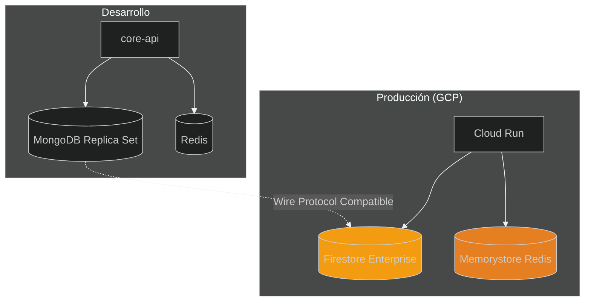

## 🔧 Stack Tecnológico

> Tecnologías que usamos

⬇️ _Navega hacia abajo para ver detalles_

Note:
Ahora veamos las tecnologías que componen nuestro stack.
No necesitan dominar todo esto al principio - es una referencia.


----

### 🔧 Stack Tecnológico

> Tecnologías y herramientas del proyecto

⬇️ _Navega hacia abajo para ver detalles_

Note:
Ahora veamos las tecnologías que usamos.
No se asusten si no conocen todas - irán aprendiendo poco a poco.
Lo importante es entender POR QUÉ elegimos cada herramienta.
Siempre priorizamos: productividad del desarrollador, rendimiento, y soporte de la comunidad.

----

<!-- .slide: data-background="#181818" data-background-transition="fade" -->

### Backend

Note:
NestJS es nuestro framework principal - es como Angular pero para el backend.
Tiene inyección de dependencias, módulos, decoradores... muy organizado.
Fastify es el servidor HTTP - más rápido que Express (el default de NestJS).
MongoDB/Firestore es nuestra base de datos NoSQL - esquemas flexibles, escala horizontalmente.
Redis para cache - respuestas en microsegundos.
Pub/Sub para mensajería asíncrona - los workers lo usan.

- **NestJS** → Framework modular, DI, TypeScript
- **Fastify** → High-performance HTTP adapter
- **MongoDB** → Esquemas flexibles, escalable
- **Firestore Enterprise** → Producción (MongoDB wire protocol)
- **Redis** → Cache sub-ms, pub/sub
- **Mongoose** → ODM con validación
- **Pino** → Structured Logging (JSON)
- **Google Cloud Pub/Sub** → Mensajería asíncrona

----

<!-- .slide: data-background="#1c1c1c" data-background-transition="fade" -->

### Frontend

Note:
Para el frontend admin usamos Angular con las prácticas más modernas.
Signals en vez de RxJS para estado local - más simple y performante.
Tailwind CSS para estilos - clases utilitarias, muy productivo.
PrimeNG para componentes complejos como tablas y formularios.

- **Angular** → Framework SPA con SSR (Universal)
- **Tailwind CSS** → Utility-first CSS
- **PrimeNG** → Componentes UI
- **RxJS** → Reactive Extensions

----

<!-- .slide: data-background="#1c1c1c" data-background-transition="fade" -->

### DevOps & Tooling

Note:
Estas son las herramientas que hacen posible trabajar eficientemente.
Nx maneja el monorepo - detecta qué cambió y solo corre lo necesario.
Vitest es nuestro test runner - 10 veces más rápido que Jest.
Playwright para tests E2E - más estable que Cypress.
GitHub Actions para CI/CD - cada push dispara los checks automáticamente.

- **Node** + **pnpm** → Runtime y Package Manager
- **Nx** → Monorepo, affected builds, cache
- **Vitest** → Testing 10x más rápido que Jest
- **Playwright** → E2E Testing (reemplaza Cypress)
- **k6** → Load & Performance Testing
- **ESLint** → Linting + reglas custom
- **Prettier** → Code Formatting
- **GitHub Actions** → CI/CD pipelines
- **Release Please** → Semantic Versioning auto
- **Terraform** → Infrastructure as Code
- **Docker** → Containerización

----

<!-- .slide: data-background="#181818" data-background-transition="fade" -->

### Security Scanning Stack

Note:
La seguridad es CRÍTICA. Tenemos múltiples capas de protección.
Semgrep busca vulnerabilidades en el código que escribimos (SAST).
Trivy busca vulnerabilidades en las dependencias que usamos (SCA).
SonarCloud analiza calidad y busca "code smells" - código que funciona pero es problemático.
Codecov mide cobertura de tests - cuánto del código está probado.
Todo esto corre automáticamente en cada PR.

| Herramienta | Tipo | Propósito | Free Tier |
|-------------|------|-----------|-----------|
| **Semgrep** | SAST | Vulnerabilidades en código (OWASP Top 10) | Ilimitado |
| **Trivy** | SCA + Container | CVEs en dependencias e imágenes Docker | Ilimitado |
| **SonarCloud** | Quality Gate | Code smells, bugs, security hotspots | 500K LOC/mes |
| **Codecov** | Coverage | Test coverage + patch analysis | Generoso |

> **Defense in Depth**: Múltiples capas de seguridad sin overlap

----

<!-- .slide: data-background="#1c1c1c" data-background-transition="fade" -->

### Cloud Infrastructure (GCP)

Note:
Corremos todo en Google Cloud Platform.
Cloud Run es serverless - solo pagas cuando hay tráfico, escala automáticamente a cero.
Artifact Registry guarda nuestras imágenes Docker.
Firestore es nuestra base de datos principal en producción.
Secret Manager guarda las credenciales de forma segura - NUNCA en código.

- **Cloud Run** → Serverless containers
- **API Gateway** → Gestión de acceso externo
- **Artifact Registry** → Docker Images
- **Cloud Storage** → Buckets para assets/logs
- **Memorystore** → Redis gestionado
- **Firestore** → Base de datos NoSQL (Aux)
- **Secret Manager** → Gestión de secretos seguros

----

<!-- .slide: data-background="#1c1c1c" data-background-transition="fade" -->

### Observability & Monitoring

Note:
Observabilidad es cómo sabemos qué pasa en producción.
Sentry captura errores automáticamente - cuando algo falla, recibimos notificación con stack trace.
OpenTelemetry es el estándar para tracing - podemos ver cómo fluye una request por todo el sistema.
Grafana Cloud centraliza dashboards con métricas de negocio y técnicas.
Si algo anda mal en producción, estas herramientas nos dicen QUÉ y DÓNDE.

- **Sentry** → Error Tracking & Performance Monitoring
- **OpenTelemetry** → Instrumentación estándar (Traces, Metrics)
- **Grafana Cloud** → Dashboards centralizados
- **Cloud Logging** → Logs estructurados (Pino)
- **Cloud Trace** → Distributed Tracing
- **Site 24x7** → Monitoreo sintético externo

----

<!-- .slide: data-background="#181818" data-background-transition="fade" -->

### Sentry: Cómo Ver Errores en Producción

Note:
Sentry es nuestra herramienta para ver errores en producción.
Cada error que ocurre se captura automáticamente con el stack trace completo.
Como junior, van a necesitar investigar errores - aquí les muestro cómo hacerlo paso a paso.
No tengan miedo de explorar Sentry, es una de las herramientas más útiles para entender qué está pasando.

```svg
<svg viewBox="0 0 850 500" xmlns="http://www.w3.org/2000/svg">
  <defs>
    <linearGradient id="sentryGrad" x1="0%" y1="0%" x2="100%" y2="100%">
      <stop offset="0%" style="stop-color:#362d59;stop-opacity:1" />
      <stop offset="100%" style="stop-color:#1a1a2e;stop-opacity:1" />
    </linearGradient>
    <filter id="sentryShadow" x="-20%" y="-20%" width="140%" height="140%">
      <feDropShadow dx="2" dy="2" stdDeviation="3" flood-opacity="0.3"/>
    </filter>
  </defs>

  <!-- Background -->
  <rect width="850" height="500" fill="#1a1a2e"/>

  <!-- Title -->
  <text x="425" y="35" text-anchor="middle" fill="#fff" font-size="18" font-weight="bold">🔍 Investigando Errores en Sentry</text>

  <!-- Step 1: Issue List -->
  <g transform="translate(20, 60)">
    <rect x="0" y="0" width="250" height="180" rx="8" fill="#2c3e50" filter="url(#sentryShadow)"/>
    <rect x="0" y="0" width="250" height="30" rx="8" fill="#362d59"/>
    <text x="125" y="20" text-anchor="middle" fill="#fff" font-size="12" font-weight="bold">1️⃣ Lista de Issues</text>

    <!-- Issue rows -->
    <rect x="10" y="40" width="230" height="35" rx="4" fill="#e74c3c" opacity="0.2"/>
    <circle cx="25" cy="57" r="8" fill="#e74c3c"/>
    <text x="40" y="52" fill="#e74c3c" font-size="9" font-weight="bold">CRITICAL</text>
    <text x="40" y="65" fill="#ecf0f1" font-size="9">NotificationChannel... (15)</text>

    <rect x="10" y="80" width="230" height="35" rx="4" fill="#f39c12" opacity="0.2"/>
    <circle cx="25" cy="97" r="8" fill="#f39c12"/>
    <text x="40" y="92" fill="#f39c12" font-size="9" font-weight="bold">ERROR</text>
    <text x="40" y="105" fill="#ecf0f1" font-size="9">MongoTimeoutError (8)</text>

    <rect x="10" y="120" width="230" height="35" rx="4" fill="#3498db" opacity="0.2"/>
    <circle cx="25" cy="137" r="8" fill="#3498db"/>
    <text x="40" y="132" fill="#3498db" font-size="9" font-weight="bold">WARNING</text>
    <text x="40" y="145" fill="#ecf0f1" font-size="9">RateLimitExceeded (3)</text>

    <text x="125" y="170" text-anchor="middle" fill="#95a5a6" font-size="8">Ordenar por: Last Seen ▼</text>
  </g>

  <!-- Arrow 1 -->
  <path d="M280 150 L310 150" stroke="#3498db" stroke-width="3" fill="none" marker-end="url(#arrowhead)"/>

  <!-- Step 2: Error Details -->
  <g transform="translate(320, 60)">
    <rect x="0" y="0" width="250" height="180" rx="8" fill="#2c3e50" filter="url(#sentryShadow)"/>
    <rect x="0" y="0" width="250" height="30" rx="8" fill="#362d59"/>
    <text x="125" y="20" text-anchor="middle" fill="#fff" font-size="12" font-weight="bold">2️⃣ Detalle del Error</text>

    <!-- Error message -->
    <rect x="10" y="38" width="230" height="40" rx="4" fill="#e74c3c" opacity="0.3"/>
    <text x="20" y="55" fill="#fff" font-size="9" font-weight="bold">NotificationChannelError</text>
    <text x="20" y="70" fill="#ecf0f1" font-size="8">Channel SALESFORCE_MC failed: timeout</text>

    <!-- Tags -->
    <text x="15" y="95" fill="#95a5a6" font-size="9">Tags:</text>
    <rect x="45" y="85" width="55" height="16" rx="8" fill="#27ae60"/>
    <text x="72" y="96" text-anchor="middle" fill="#fff" font-size="8">env:prod</text>
    <rect x="105" y="85" width="60" height="16" rx="8" fill="#3498db"/>
    <text x="135" y="96" text-anchor="middle" fill="#fff" font-size="8">country:CL</text>
    <rect x="170" y="85" width="65" height="16" rx="8" fill="#9b59b6"/>
    <text x="202" y="96" text-anchor="middle" fill="#fff" font-size="8">type:email</text>

    <!-- User info -->
    <text x="15" y="120" fill="#95a5a6" font-size="9">User:</text>
    <text x="50" y="120" fill="#ecf0f1" font-size="9">order-123456 | IP: 10.x.x.x</text>

    <!-- Breadcrumbs -->
    <text x="15" y="145" fill="#95a5a6" font-size="9">Breadcrumbs:</text>
    <text x="15" y="160" fill="#ecf0f1" font-size="7">→ HTTP POST /notifications</text>
    <text x="15" y="172" fill="#ecf0f1" font-size="7">→ NotificationService.send()</text>
  </g>

  <!-- Arrow 2 -->
  <path d="M580 150 L610 150" stroke="#3498db" stroke-width="3" fill="none" marker-end="url(#arrowhead)"/>

  <!-- Step 3: Stack Trace -->
  <g transform="translate(620, 60)">
    <rect x="0" y="0" width="210" height="180" rx="8" fill="#2c3e50" filter="url(#sentryShadow)"/>
    <rect x="0" y="0" width="210" height="30" rx="8" fill="#362d59"/>
    <text x="105" y="20" text-anchor="middle" fill="#fff" font-size="12" font-weight="bold">3️⃣ Stack Trace</text>

    <!-- Stack frames -->
    <rect x="10" y="38" width="190" height="20" rx="3" fill="#27ae60" opacity="0.3"/>
    <text x="15" y="52" fill="#27ae60" font-size="8">▶ salesforce.service.ts:142</text>

    <rect x="10" y="62" width="190" height="20" rx="3" fill="#1a1a2e"/>
    <text x="15" y="76" fill="#95a5a6" font-size="8">  notification-processor.ts:89</text>

    <rect x="10" y="86" width="190" height="20" rx="3" fill="#1a1a2e"/>
    <text x="15" y="100" fill="#95a5a6" font-size="8">  pubsub.controller.ts:45</text>

    <rect x="10" y="110" width="190" height="20" rx="3" fill="#1a1a2e"/>
    <text x="15" y="124" fill="#7f8c8d" font-size="8">  ... 12 more frames</text>

    <!-- Code preview -->
    <rect x="10" y="135" width="190" height="35" rx="3" fill="#1a1a2e"/>
    <text x="15" y="150" fill="#e74c3c" font-size="7" font-family="monospace">142: throw new Error(</text>
    <text x="15" y="162" fill="#e74c3c" font-size="7" font-family="monospace">  `Timeout: ${channel}`</text>
  </g>

  <!-- Bottom Section: Tips -->
  <g transform="translate(20, 260)">
    <rect x="0" y="0" width="810" height="120" rx="8" fill="#2c3e50" filter="url(#sentryShadow)"/>
    <text x="405" y="25" text-anchor="middle" fill="#f1c40f" font-size="14" font-weight="bold">💡 Tips para Investigar</text>

    <!-- Tip boxes -->
    <g transform="translate(20, 40)">
      <rect x="0" y="0" width="180" height="65" rx="6" fill="#27ae60" opacity="0.2"/>
      <text x="90" y="18" text-anchor="middle" fill="#27ae60" font-size="10" font-weight="bold">🔍 Buscar Contexto</text>
      <text x="10" y="35" fill="#ecf0f1" font-size="8">• Ver breadcrumbs (qué pasó antes)</text>
      <text x="10" y="48" fill="#ecf0f1" font-size="8">• Revisar tags (env, country, type)</text>
      <text x="10" y="61" fill="#ecf0f1" font-size="8">• Copiar trace_id para Cloud Trace</text>
    </g>

    <g transform="translate(220, 40)">
      <rect x="0" y="0" width="180" height="65" rx="6" fill="#3498db" opacity="0.2"/>
      <text x="90" y="18" text-anchor="middle" fill="#3498db" font-size="10" font-weight="bold">📊 Ver Tendencias</text>
      <text x="10" y="35" fill="#ecf0f1" font-size="8">• ¿Empezó después de deploy?</text>
      <text x="10" y="48" fill="#ecf0f1" font-size="8">• ¿Afecta solo un país?</text>
      <text x="10" y="61" fill="#ecf0f1" font-size="8">• ¿Hay patrón de horario?</text>
    </g>

    <g transform="translate(420, 40)">
      <rect x="0" y="0" width="180" height="65" rx="6" fill="#9b59b6" opacity="0.2"/>
      <text x="90" y="18" text-anchor="middle" fill="#9b59b6" font-size="10" font-weight="bold">🔗 Linked Issues</text>
      <text x="10" y="35" fill="#ecf0f1" font-size="8">• Buscar errores relacionados</text>
      <text x="10" y="48" fill="#ecf0f1" font-size="8">• Ver si hay root cause común</text>
      <text x="10" y="61" fill="#ecf0f1" font-size="8">• Marcar como duplicado si aplica</text>
    </g>

    <g transform="translate(620, 40)">
      <rect x="0" y="0" width="180" height="65" rx="6" fill="#e74c3c" opacity="0.2"/>
      <text x="90" y="18" text-anchor="middle" fill="#e74c3c" font-size="10" font-weight="bold">⚠️ Escalar Si...</text>
      <text x="10" y="35" fill="#ecf0f1" font-size="8">• Error rate > 5% en 5 min</text>
      <text x="10" y="48" fill="#ecf0f1" font-size="8">• Afecta flujo crítico (pagos)</text>
      <text x="10" y="61" fill="#ecf0f1" font-size="8">• No entiendes la causa</text>
    </g>
  </g>

  <!-- Access URL -->
  <g transform="translate(20, 400)">
    <rect x="0" y="0" width="810" height="85" rx="8" fill="#1a1a2e" stroke="#362d59" stroke-width="2"/>
    <text x="405" y="25" text-anchor="middle" fill="#fff" font-size="12" font-weight="bold">🌐 Acceso a Sentry</text>

    <rect x="20" y="40" width="370" height="35" rx="6" fill="#2c3e50"/>
    <text x="30" y="62" fill="#3498db" font-size="10" font-family="monospace">https://sentry.io/organizations/implementos/</text>

    <rect x="420" y="40" width="370" height="35" rx="6" fill="#2c3e50"/>
    <text x="430" y="55" fill="#95a5a6" font-size="9">Proyectos:</text>
    <text x="500" y="55" fill="#27ae60" font-size="9">core-api</text>
    <text x="560" y="55" fill="#f39c12" font-size="9">notification-worker</text>
    <text x="680" y="55" fill="#e74c3c" font-size="9">admin</text>
    <text x="430" y="70" fill="#7f8c8d" font-size="8">Pide acceso a tu lead si no lo tienes</text>
  </g>

  <!-- Arrow markers -->
  <defs>
    <marker id="arrowhead" markerWidth="10" markerHeight="7" refX="9" refY="3.5" orient="auto">
      <polygon points="0 0, 10 3.5, 0 7" fill="#3498db"/>
    </marker>
  </defs>
</svg>
```

----

<!-- .slide: data-background="#1c1c1c" data-background-transition="fade" -->

### Background Jobs & Cloud Scheduler (RFC-0014)

Note:
No todo puede procesarse sincrónicamente.
Hay tareas que toman tiempo o que queremos desacoplar del request principal.
Para eso usamos Cloud Scheduler que dispara eventos, Pub/Sub que los transporta, y Workers que los procesan.
Es como tener empleados especializados: sync-worker sincroniza con SAP, report-worker genera PDFs, notification-worker envía emails.

```svg
<svg viewBox="0 0 850 480" xmlns="http://www.w3.org/2000/svg">
  <defs>
    <linearGradient id="schedulerGrad" x1="0%" y1="0%" x2="100%" y2="100%">
      <stop offset="0%" style="stop-color:#4285f4;stop-opacity:1" />
      <stop offset="100%" style="stop-color:#1a73e8;stop-opacity:1" />
    </linearGradient>
    <linearGradient id="pubsubGrad" x1="0%" y1="0%" x2="100%" y2="100%">
      <stop offset="0%" style="stop-color:#34a853;stop-opacity:1" />
      <stop offset="100%" style="stop-color:#1e8e3e;stop-opacity:1" />
    </linearGradient>
    <filter id="jobShadow" x="-20%" y="-20%" width="140%" height="140%">
      <feDropShadow dx="2" dy="2" stdDeviation="3" flood-opacity="0.3"/>
    </filter>
  </defs>

  <!-- Background -->
  <rect width="850" height="480" fill="#1a1a2e"/>

  <!-- Title -->
  <text x="425" y="30" text-anchor="middle" fill="#fff" font-size="18" font-weight="bold">⏰ Background Jobs & Cloud Scheduler</text>

  <!-- Cloud Scheduler -->
  <g transform="translate(20, 55)">
    <rect x="0" y="0" width="180" height="160" rx="10" fill="url(#schedulerGrad)" filter="url(#jobShadow)"/>
    <text x="90" y="25" text-anchor="middle" fill="#fff" font-size="13" font-weight="bold">☁️ Cloud Scheduler</text>

    <!-- Cron jobs -->
    <rect x="10" y="40" width="160" height="25" rx="4" fill="rgba(255,255,255,0.2)"/>
    <text x="20" y="57" fill="#fff" font-size="9">📅 sync-erp</text>
    <text x="130" y="57" fill="#e8f0fe" font-size="8">*/4h</text>

    <rect x="10" y="70" width="160" height="25" rx="4" fill="rgba(255,255,255,0.2)"/>
    <text x="20" y="87" fill="#fff" font-size="9">🧹 cleanup-reservations</text>
    <text x="140" y="87" fill="#e8f0fe" font-size="8">*/5m</text>

    <rect x="10" y="100" width="160" height="25" rx="4" fill="rgba(255,255,255,0.2)"/>
    <text x="20" y="117" fill="#fff" font-size="9">📊 daily-reports</text>
    <text x="125" y="117" fill="#e8f0fe" font-size="8">3AM</text>

    <rect x="10" y="130" width="160" height="25" rx="4" fill="rgba(255,255,255,0.2)"/>
    <text x="20" y="147" fill="#fff" font-size="9">🔄 cache-refresh</text>
    <text x="130" y="147" fill="#e8f0fe" font-size="8">*/2h</text>
  </g>

  <!-- Arrow to Pub/Sub -->
  <g>
    <path d="M210 135 L250 135" stroke="#4285f4" stroke-width="3" fill="none"/>
    <polygon points="250,130 260,135 250,140" fill="#4285f4"/>
    <text x="230" y="125" text-anchor="middle" fill="#95a5a6" font-size="8">HTTP POST</text>
  </g>

  <!-- Pub/Sub -->
  <g transform="translate(270, 55)">
    <rect x="0" y="0" width="300" height="160" rx="10" fill="url(#pubsubGrad)" filter="url(#jobShadow)"/>
    <text x="150" y="25" text-anchor="middle" fill="#fff" font-size="13" font-weight="bold">📬 Cloud Pub/Sub</text>

    <!-- Topics -->
    <g transform="translate(15, 40)">
      <rect x="0" y="0" width="80" height="50" rx="6" fill="rgba(255,255,255,0.2)"/>
      <text x="40" y="20" text-anchor="middle" fill="#fff" font-size="9" font-weight="bold">sync-topic</text>
      <text x="40" y="35" text-anchor="middle" fill="#e8f5e9" font-size="8">→ subscription</text>
    </g>

    <g transform="translate(110, 40)">
      <rect x="0" y="0" width="80" height="50" rx="6" fill="rgba(255,255,255,0.2)"/>
      <text x="40" y="20" text-anchor="middle" fill="#fff" font-size="9" font-weight="bold">report-topic</text>
      <text x="40" y="35" text-anchor="middle" fill="#e8f5e9" font-size="8">→ subscription</text>
    </g>

    <g transform="translate(205, 40)">
      <rect x="0" y="0" width="80" height="50" rx="6" fill="rgba(255,255,255,0.2)"/>
      <text x="40" y="20" text-anchor="middle" fill="#fff" font-size="9" font-weight="bold">notif-topic</text>
      <text x="40" y="35" text-anchor="middle" fill="#e8f5e9" font-size="8">→ subscription</text>
    </g>

    <!-- DLQ -->
    <g transform="translate(70, 100)">
      <rect x="0" y="0" width="160" height="45" rx="6" fill="#e74c3c" opacity="0.8"/>
      <text x="80" y="18" text-anchor="middle" fill="#fff" font-size="10" font-weight="bold">💀 dead-letter-topic</text>
      <text x="80" y="35" text-anchor="middle" fill="#fce4ec" font-size="8">Mensajes fallidos → Alerta</text>
    </g>
  </g>

  <!-- Arrows to Workers -->
  <g>
    <path d="M580 90 L620 90" stroke="#34a853" stroke-width="2" fill="none"/>
    <polygon points="620,86 630,90 620,94" fill="#34a853"/>

    <path d="M580 135 L620 135" stroke="#34a853" stroke-width="2" fill="none"/>
    <polygon points="620,131 630,135 620,139" fill="#34a853"/>

    <path d="M580 180 L620 180" stroke="#34a853" stroke-width="2" fill="none"/>
    <polygon points="620,176 630,180 620,184" fill="#34a853"/>
  </g>

  <!-- Workers -->
  <g transform="translate(640, 55)">
    <!-- sync-worker -->
    <rect x="0" y="0" width="190" height="50" rx="8" fill="#2c3e50" filter="url(#jobShadow)"/>
    <rect x="0" y="0" width="50" height="50" rx="8" fill="#3498db"/>
    <text x="25" y="30" text-anchor="middle" fill="#fff" font-size="18">🔄</text>
    <text x="120" y="20" text-anchor="middle" fill="#fff" font-size="11" font-weight="bold">sync-worker</text>
    <text x="120" y="38" text-anchor="middle" fill="#95a5a6" font-size="8">ERP • Stock • Reconcile</text>

    <!-- report-worker -->
    <rect x="0" y="60" width="190" height="50" rx="8" fill="#2c3e50" filter="url(#jobShadow)"/>
    <rect x="0" y="60" width="50" height="50" rx="8" fill="#27ae60"/>
    <text x="25" y="90" text-anchor="middle" fill="#fff" font-size="18">📊</text>
    <text x="120" y="80" text-anchor="middle" fill="#fff" font-size="11" font-weight="bold">report-worker</text>
    <text x="120" y="98" text-anchor="middle" fill="#95a5a6" font-size="8">PDF • Excel • Custom</text>

    <!-- notification-worker -->
    <rect x="0" y="120" width="190" height="50" rx="8" fill="#2c3e50" filter="url(#jobShadow)"/>
    <rect x="0" y="120" width="50" height="50" rx="8" fill="#f39c12"/>
    <text x="25" y="150" text-anchor="middle" fill="#fff" font-size="18">📧</text>
    <text x="120" y="140" text-anchor="middle" fill="#fff" font-size="11" font-weight="bold">notification-worker</text>
    <text x="120" y="158" text-anchor="middle" fill="#95a5a6" font-size="8">Email • SMS • Salesforce</text>
  </g>

  <!-- How it works section -->
  <g transform="translate(20, 235)">
    <rect x="0" y="0" width="810" height="110" rx="8" fill="#2c3e50" filter="url(#jobShadow)"/>
    <text x="405" y="25" text-anchor="middle" fill="#f1c40f" font-size="14" font-weight="bold">🔧 Cómo Funciona un Worker</text>

    <!-- Flow -->
    <g transform="translate(30, 45)">
      <rect x="0" y="0" width="130" height="50" rx="6" fill="#34a853" opacity="0.3"/>
      <text x="65" y="20" text-anchor="middle" fill="#34a853" font-size="10" font-weight="bold">1. Pub/Sub Push</text>
      <text x="65" y="38" text-anchor="middle" fill="#ecf0f1" font-size="8">POST /pubsub/push</text>
    </g>

    <path d="M165 70 L195 70" stroke="#3498db" stroke-width="2" fill="none"/>
    <polygon points="195,66 205,70 195,74" fill="#3498db"/>

    <g transform="translate(210, 45)">
      <rect x="0" y="0" width="130" height="50" rx="6" fill="#3498db" opacity="0.3"/>
      <text x="65" y="20" text-anchor="middle" fill="#3498db" font-size="10" font-weight="bold">2. Controller</text>
      <text x="65" y="38" text-anchor="middle" fill="#ecf0f1" font-size="8">Valida + Decode msg</text>
    </g>

    <path d="M345 70 L375 70" stroke="#3498db" stroke-width="2" fill="none"/>
    <polygon points="375,66 385,70 375,74" fill="#3498db"/>

    <g transform="translate(390, 45)">
      <rect x="0" y="0" width="130" height="50" rx="6" fill="#9b59b6" opacity="0.3"/>
      <text x="65" y="20" text-anchor="middle" fill="#9b59b6" font-size="10" font-weight="bold">3. Processor</text>
      <text x="65" y="38" text-anchor="middle" fill="#ecf0f1" font-size="8">Lógica de negocio</text>
    </g>

    <path d="M525 70 L555 70" stroke="#3498db" stroke-width="2" fill="none"/>
    <polygon points="555,66 565,70 555,74" fill="#3498db"/>

    <g transform="translate(570, 45)">
      <rect x="0" y="0" width="130" height="50" rx="6" fill="#27ae60" opacity="0.3"/>
      <text x="65" y="20" text-anchor="middle" fill="#27ae60" font-size="10" font-weight="bold">4. ACK/NACK</text>
      <text x="65" y="38" text-anchor="middle" fill="#ecf0f1" font-size="8">200 OK = procesado</text>
    </g>

    <g transform="translate(710, 45)">
      <rect x="0" y="0" width="75" height="50" rx="6" fill="#e74c3c" opacity="0.3"/>
      <text x="37" y="20" text-anchor="middle" fill="#e74c3c" font-size="10" font-weight="bold">Retry?</text>
      <text x="37" y="38" text-anchor="middle" fill="#ecf0f1" font-size="8">→ DLQ</text>
    </g>
  </g>

  <!-- Code example -->
  <g transform="translate(20, 360)">
    <rect x="0" y="0" width="400" height="105" rx="8" fill="#1e1e1e" filter="url(#jobShadow)"/>
    <text x="200" y="18" text-anchor="middle" fill="#95a5a6" font-size="10">apps/notification-worker/src/controllers/pubsub.controller.ts</text>

    <text x="15" y="38" fill="#c586c0" font-size="9" font-family="monospace">@Post</text>
    <text x="45" y="38" fill="#dcdcaa" font-size="9" font-family="monospace">('push')</text>

    <text x="15" y="52" fill="#569cd6" font-size="9" font-family="monospace">async</text>
    <text x="50" y="52" fill="#dcdcaa" font-size="9" font-family="monospace">handlePush</text>
    <text x="115" y="52" fill="#d4d4d4" font-size="9" font-family="monospace">(@Body() msg: PubSubMessage) {</text>

    <text x="25" y="66" fill="#569cd6" font-size="9" font-family="monospace">const</text>
    <text x="55" y="66" fill="#9cdcfe" font-size="9" font-family="monospace">data</text>
    <text x="80" y="66" fill="#d4d4d4" font-size="9" font-family="monospace">= this.decode(msg);</text>

    <text x="25" y="80" fill="#569cd6" font-size="9" font-family="monospace">await</text>
    <text x="55" y="80" fill="#d4d4d4" font-size="9" font-family="monospace">this.processor.</text>
    <text x="145" y="80" fill="#dcdcaa" font-size="9" font-family="monospace">process</text>
    <text x="185" y="80" fill="#d4d4d4" font-size="9" font-family="monospace">(data);</text>

    <text x="25" y="94" fill="#569cd6" font-size="9" font-family="monospace">return</text>
    <text x="60" y="94" fill="#d4d4d4" font-size="9" font-family="monospace">{ status: </text>
    <text x="125" y="94" fill="#ce9178" font-size="9" font-family="monospace">'ok'</text>
    <text x="145" y="94" fill="#d4d4d4" font-size="9" font-family="monospace">};</text>
    <text x="170" y="94" fill="#6a9955" font-size="9" font-family="monospace">// ACK</text>
  </g>

  <!-- Key points -->
  <g transform="translate(440, 360)">
    <rect x="0" y="0" width="390" height="105" rx="8" fill="#2c3e50" filter="url(#jobShadow)"/>
    <text x="195" y="20" text-anchor="middle" fill="#f1c40f" font-size="11" font-weight="bold">📋 Para Juniors: Lo Importante</text>

    <text x="15" y="42" fill="#27ae60" font-size="9">✓</text>
    <text x="30" y="42" fill="#ecf0f1" font-size="9">Workers procesan tareas largas en background</text>

    <text x="15" y="58" fill="#27ae60" font-size="9">✓</text>
    <text x="30" y="58" fill="#ecf0f1" font-size="9">Cloud Scheduler dispara jobs programados (como cron)</text>

    <text x="15" y="74" fill="#27ae60" font-size="9">✓</text>
    <text x="30" y="74" fill="#ecf0f1" font-size="9">Si un mensaje falla muchas veces → va al DLQ</text>

    <text x="15" y="90" fill="#27ae60" font-size="9">✓</text>
    <text x="30" y="90" fill="#ecf0f1" font-size="9">Ver logs: Cloud Run → Logs del worker específico</text>
  </g>
</svg>
```

----

<!-- .slide: data-background="#181818" data-background-transition="fade" -->

### Configuration Validation at Bootstrap (RFC-0019)

Note:
Este patrón es muy importante: validamos TODAS las variables de entorno al arrancar la aplicación.
Si falta una variable o tiene formato incorrecto, la app ni siquiera arranca.
Esto previene errores en runtime que son mucho más difíciles de debugear.
Es como revisar que tienes todas las herramientas antes de empezar un trabajo.

```svg
<svg viewBox="0 0 850 450" xmlns="http://www.w3.org/2000/svg">
  <defs>
    <linearGradient id="configGrad" x1="0%" y1="0%" x2="100%" y2="100%">
      <stop offset="0%" style="stop-color:#9b59b6;stop-opacity:1" />
      <stop offset="100%" style="stop-color:#8e44ad;stop-opacity:1" />
    </linearGradient>
    <filter id="configShadow" x="-20%" y="-20%" width="140%" height="140%">
      <feDropShadow dx="2" dy="2" stdDeviation="3" flood-opacity="0.3"/>
    </filter>
  </defs>

  <!-- Background -->
  <rect width="850" height="450" fill="#1a1a2e"/>

  <!-- Title -->
  <text x="425" y="30" text-anchor="middle" fill="#fff" font-size="18" font-weight="bold">⚙️ Validación de Configuración al Iniciar</text>

  <!-- Before/After comparison -->
  <!-- BAD: Without validation -->
  <g transform="translate(30, 55)">
    <rect x="0" y="0" width="380" height="180" rx="10" fill="#2c3e50" filter="url(#configShadow)"/>
    <rect x="0" y="0" width="380" height="35" rx="10" fill="#e74c3c"/>
    <text x="190" y="23" text-anchor="middle" fill="#fff" font-size="12" font-weight="bold">❌ Sin Validación (Malo)</text>

    <!-- Timeline -->
    <g transform="translate(20, 50)">
      <rect x="0" y="0" width="80" height="35" rx="5" fill="#27ae60"/>
      <text x="40" y="22" text-anchor="middle" fill="#fff" font-size="9">App Inicia ✓</text>
    </g>

    <path d="M105 67 L130 67" stroke="#95a5a6" stroke-width="2"/>

    <g transform="translate(135, 50)">
      <rect x="0" y="0" width="80" height="35" rx="5" fill="#27ae60"/>
      <text x="40" y="22" text-anchor="middle" fill="#fff" font-size="9">Deploy ✓</text>
    </g>

    <path d="M220 67 L245 67" stroke="#95a5a6" stroke-width="2"/>

    <g transform="translate(250, 50)">
      <rect x="0" y="0" width="110" height="35" rx="5" fill="#e74c3c"/>
      <text x="55" y="15" text-anchor="middle" fill="#fff" font-size="9">3 hrs después...</text>
      <text x="55" y="28" text-anchor="middle" fill="#fce4ec" font-size="8">💥 REDIS_URL undefined!</text>
    </g>

    <!-- Error description -->
    <rect x="20" y="100" width="340" height="65" rx="5" fill="#e74c3c" opacity="0.2"/>
    <text x="190" y="118" text-anchor="middle" fill="#e74c3c" font-size="10" font-weight="bold">El problema:</text>
    <text x="30" y="135" fill="#ecf0f1" font-size="9">• App arranca sin validar configuración</text>
    <text x="30" y="150" fill="#ecf0f1" font-size="9">• Error aparece horas después en runtime</text>
    <text x="30" y="165" fill="#ecf0f1" font-size="9">• Difícil de debugear - "¿por qué falló?"</text>
  </g>

  <!-- GOOD: With validation -->
  <g transform="translate(440, 55)">
    <rect x="0" y="0" width="380" height="180" rx="10" fill="#2c3e50" filter="url(#configShadow)"/>
    <rect x="0" y="0" width="380" height="35" rx="10" fill="#27ae60"/>
    <text x="190" y="23" text-anchor="middle" fill="#fff" font-size="12" font-weight="bold">✅ Con Validación (RFC-0019)</text>

    <!-- Timeline -->
    <g transform="translate(20, 50)">
      <rect x="0" y="0" width="95" height="35" rx="5" fill="#9b59b6"/>
      <text x="47" y="15" text-anchor="middle" fill="#fff" font-size="9">Bootstrap</text>
      <text x="47" y="28" text-anchor="middle" fill="#e8daef" font-size="8">Valida config</text>
    </g>

    <path d="M120 67 L145 67" stroke="#95a5a6" stroke-width="2"/>

    <g transform="translate(150, 50)">
      <rect x="0" y="0" width="95" height="35" rx="5" fill="#e74c3c"/>
      <text x="47" y="15" text-anchor="middle" fill="#fff" font-size="9">❌ FALLA</text>
      <text x="47" y="28" text-anchor="middle" fill="#fce4ec" font-size="8">REDIS_URL missing</text>
    </g>

    <path d="M250 67 L275 67" stroke="#95a5a6" stroke-width="2"/>

    <g transform="translate(280, 50)">
      <rect x="0" y="0" width="80" height="35" rx="5" fill="#7f8c8d"/>
      <text x="40" y="15" text-anchor="middle" fill="#fff" font-size="9">Deploy</text>
      <text x="40" y="28" text-anchor="middle" fill="#bdc3c7" font-size="8">Cancelado</text>
    </g>

    <!-- Success description -->
    <rect x="20" y="100" width="340" height="65" rx="5" fill="#27ae60" opacity="0.2"/>
    <text x="190" y="118" text-anchor="middle" fill="#27ae60" font-size="10" font-weight="bold">La solución:</text>
    <text x="30" y="135" fill="#ecf0f1" font-size="9">• Falla INMEDIATAMENTE si falta config</text>
    <text x="30" y="150" fill="#ecf0f1" font-size="9">• Error claro: "REDIS_URL is required"</text>
    <text x="30" y="165" fill="#ecf0f1" font-size="9">• Nunca llega a producción con config rota</text>
  </g>

  <!-- Code example -->
  <g transform="translate(30, 250)">
    <rect x="0" y="0" width="480" height="185" rx="8" fill="#1e1e1e" filter="url(#configShadow)"/>
    <text x="240" y="18" text-anchor="middle" fill="#95a5a6" font-size="10">libs/shared/backend/config/src/lib/database.config.ts</text>

    <text x="15" y="38" fill="#c586c0" font-size="9" font-family="monospace">export class</text>
    <text x="90" y="38" fill="#4ec9b0" font-size="9" font-family="monospace">DatabaseConfig</text>
    <text x="180" y="38" fill="#d4d4d4" font-size="9" font-family="monospace">{</text>

    <text x="25" y="55" fill="#c586c0" font-size="9" font-family="monospace">@IsString</text>
    <text x="80" y="55" fill="#d4d4d4" font-size="9" font-family="monospace">()</text>

    <text x="25" y="69" fill="#c586c0" font-size="9" font-family="monospace">@IsNotEmpty</text>
    <text x="100" y="69" fill="#d4d4d4" font-size="9" font-family="monospace">({ message: </text>
    <text x="175" y="69" fill="#ce9178" font-size="9" font-family="monospace">'MONGO_URI is required'</text>
    <text x="335" y="69" fill="#d4d4d4" font-size="9" font-family="monospace">})</text>

    <text x="25" y="83" fill="#9cdcfe" font-size="9" font-family="monospace">MONGO_URI</text>
    <text x="90" y="83" fill="#d4d4d4" font-size="9" font-family="monospace">:</text>
    <text x="95" y="83" fill="#4ec9b0" font-size="9" font-family="monospace">string</text>
    <text x="130" y="83" fill="#d4d4d4" font-size="9" font-family="monospace">;</text>

    <text x="25" y="100" fill="#c586c0" font-size="9" font-family="monospace">@IsInt</text>
    <text x="65" y="100" fill="#d4d4d4" font-size="9" font-family="monospace">()</text>

    <text x="25" y="114" fill="#c586c0" font-size="9" font-family="monospace">@Min</text>
    <text x="50" y="114" fill="#d4d4d4" font-size="9" font-family="monospace">(</text>
    <text x="55" y="114" fill="#b5cea8" font-size="9" font-family="monospace">1</text>
    <text x="65" y="114" fill="#d4d4d4" font-size="9" font-family="monospace">)</text>
    <text x="70" y="114" fill="#c586c0" font-size="9" font-family="monospace"> @Max</text>
    <text x="100" y="114" fill="#d4d4d4" font-size="9" font-family="monospace">(</text>
    <text x="105" y="114" fill="#b5cea8" font-size="9" font-family="monospace">65535</text>
    <text x="140" y="114" fill="#d4d4d4" font-size="9" font-family="monospace">)</text>

    <text x="25" y="128" fill="#c586c0" font-size="9" font-family="monospace">@Transform</text>
    <text x="90" y="128" fill="#d4d4d4" font-size="9" font-family="monospace">(({ value }) =></text>
    <text x="195" y="128" fill="#dcdcaa" font-size="9" font-family="monospace">parseInt</text>
    <text x="250" y="128" fill="#d4d4d4" font-size="9" font-family="monospace">(value,</text>
    <text x="300" y="128" fill="#b5cea8" font-size="9" font-family="monospace">10</text>
    <text x="315" y="128" fill="#d4d4d4" font-size="9" font-family="monospace">))</text>

    <text x="25" y="145" fill="#9cdcfe" font-size="9" font-family="monospace">REDIS_PORT</text>
    <text x="100" y="145" fill="#d4d4d4" font-size="9" font-family="monospace">:</text>
    <text x="105" y="145" fill="#4ec9b0" font-size="9" font-family="monospace">number</text>
    <text x="150" y="145" fill="#d4d4d4" font-size="9" font-family="monospace">=</text>
    <text x="158" y="145" fill="#b5cea8" font-size="9" font-family="monospace">6379</text>
    <text x="185" y="145" fill="#d4d4d4" font-size="9" font-family="monospace">;</text>
    <text x="195" y="145" fill="#6a9955" font-size="9" font-family="monospace">// Default value</text>

    <text x="15" y="165" fill="#d4d4d4" font-size="9" font-family="monospace">}</text>

    <text x="15" y="180" fill="#6a9955" font-size="9" font-family="monospace">// Decoradores: @IsString, @IsNotEmpty, @IsInt, @Min, @Max, @Transform</text>
  </g>

  <!-- Validators summary -->
  <g transform="translate(530, 250)">
    <rect x="0" y="0" width="290" height="185" rx="8" fill="#2c3e50" filter="url(#configShadow)"/>
    <text x="145" y="20" text-anchor="middle" fill="#f1c40f" font-size="11" font-weight="bold">📋 Decoradores Comunes</text>

    <!-- Decorators table -->
    <g transform="translate(15, 35)">
      <rect x="0" y="0" width="260" height="22" rx="3" fill="#9b59b6" opacity="0.3"/>
      <text x="10" y="15" fill="#9b59b6" font-size="9" font-weight="bold" font-family="monospace">@IsString()</text>
      <text x="110" y="15" fill="#ecf0f1" font-size="9">Debe ser string</text>
    </g>

    <g transform="translate(15, 60)">
      <rect x="0" y="0" width="260" height="22" rx="3" fill="#e74c3c" opacity="0.3"/>
      <text x="10" y="15" fill="#e74c3c" font-size="9" font-weight="bold" font-family="monospace">@IsNotEmpty()</text>
      <text x="110" y="15" fill="#ecf0f1" font-size="9">No puede ser vacío</text>
    </g>

    <g transform="translate(15, 85)">
      <rect x="0" y="0" width="260" height="22" rx="3" fill="#3498db" opacity="0.3"/>
      <text x="10" y="15" fill="#3498db" font-size="9" font-weight="bold" font-family="monospace">@IsInt()</text>
      <text x="110" y="15" fill="#ecf0f1" font-size="9">Debe ser entero</text>
    </g>

    <g transform="translate(15, 110)">
      <rect x="0" y="0" width="260" height="22" rx="3" fill="#27ae60" opacity="0.3"/>
      <text x="10" y="15" fill="#27ae60" font-size="9" font-weight="bold" font-family="monospace">@IsUrl()</text>
      <text x="110" y="15" fill="#ecf0f1" font-size="9">Debe ser URL válida</text>
    </g>

    <g transform="translate(15, 135)">
      <rect x="0" y="0" width="260" height="22" rx="3" fill="#f39c12" opacity="0.3"/>
      <text x="10" y="15" fill="#f39c12" font-size="9" font-weight="bold" font-family="monospace">@Transform()</text>
      <text x="110" y="15" fill="#ecf0f1" font-size="9">Transforma el valor</text>
    </g>

    <text x="145" y="175" text-anchor="middle" fill="#95a5a6" font-size="8">📖 Docs: class-validator + class-transformer</text>
  </g>
</svg>
```

----

### 🗄️ Base de Datos

> MongoDB + Firestore Enterprise + Migraciones

⬇️ _Navega hacia abajo para ver detalles_

Note:
La base de datos es donde vive toda la información del sistema.
Usamos MongoDB en desarrollo y Firestore Enterprise en producción.
Son compatibles - el mismo código funciona en ambos. Esto es muy conveniente para desarrollo local.

----

<!-- .slide: data-background="#181818" data-background-transition="fade" -->

### Arquitectura de Datos

Note:
En desarrollo usamos MongoDB local en un replica set - esto permite usar transacciones.
En producción usamos Firestore Enterprise de GCP - es MongoDB compatible pero manejado por Google.
Redis es nuestro cache tanto local como en producción (Memorystore).
La flecha punteada muestra que son compatibles a nivel de protocolo.



> **Firestore Enterprise**: Compatible con MongoDB wire protocol

----

<!-- .slide: data-background="#1c1c1c" data-background-transition="fade" -->

### Migraciones (migrate-mongo)

Note:
Las migraciones son cambios a la estructura de la base de datos.
Imaginen que necesitan agregar un nuevo campo o índice - no lo hacen manualmente.
Crean una migración con migrate:create, escriben el cambio, y lo ejecutan con migrate:up.
Si algo sale mal, pueden hacer rollback con migrate:down.
Esto garantiza que todos los ambientes tengan la misma estructura de DB.

```bash
# Crear nueva migración
pnpm migrate:create add-index-sku

# Ejecutar migraciones
pnpm migrate:up

# Rollback
pnpm migrate:down

# Estado actual
pnpm migrate:status
```

**Transacciones ACID**:

```typescript
// TransactionService para operaciones atómicas
await this.transactionService.execute(async (session) => {
  await this.inventoryRepo.reserve(sku, qty, { session });
  await this.orderRepo.create(order, { session });
});
```
