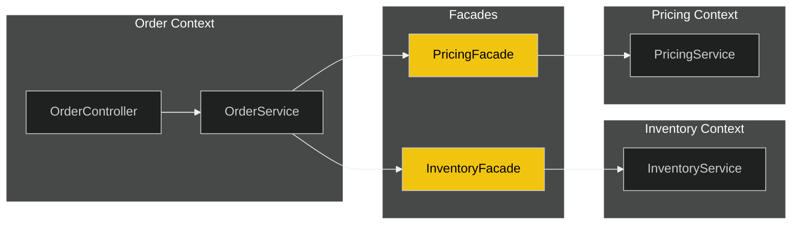
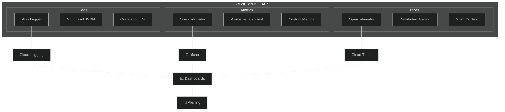
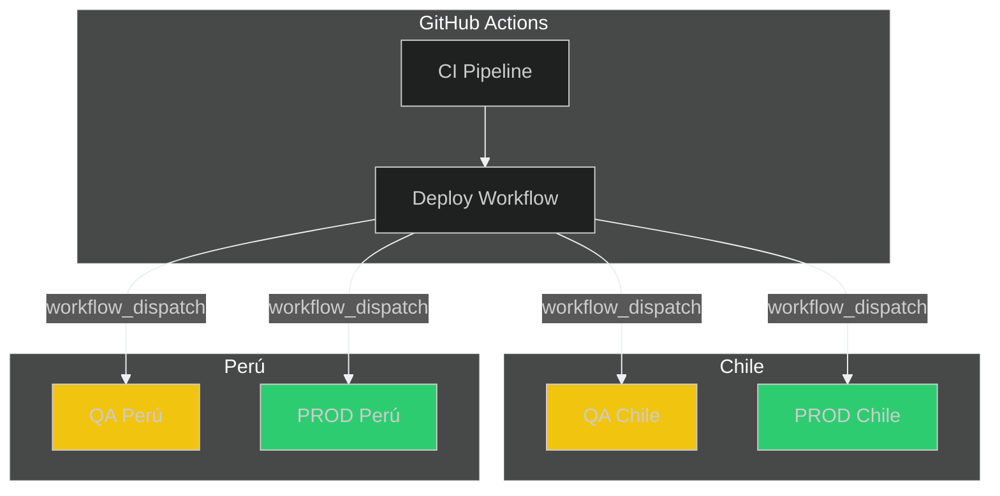
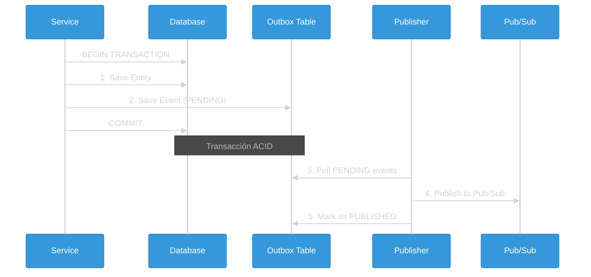

## 🛡️ Patrones Enterprise

> Patrones avanzados de arquitectura

⬇️ _Navega hacia abajo para ver detalles_

Note:
Estos son patrones avanzados que usamos en el proyecto.
No necesitan entenderlos todos ahora - es material de referencia.
Cuando trabajen en features específicas, van a ver estos patrones en acción.


----

### 🛡️ Patrones Enterprise

> Patrones de resiliencia y configuración para sistemas distribuidos

⬇️ _Navega hacia abajo para ver detalles_

Note:
Los patrones enterprise son soluciones probadas a problemas comunes en sistemas grandes.
No los inventamos nosotros - vienen de empresas como Netflix, Google, Amazon.
Vamos a ver los más importantes que usamos en nuestro sistema.

----

<!-- .slide: data-background="#181818" data-background-transition="fade" -->

### Facade Pattern (ADR-0002)

Note:
El Facade Pattern es cómo los módulos se comunican entre sí.
En vez de que Orders llame directamente a InventoryService, llama a InventoryFacade.
¿Por qué? Porque si mañana Inventory se convierte en microservicio, solo cambiamos el Facade.
El código de Orders no cambia. Esto es lo que llamamos "desacoplamiento".
También hace los tests más fáciles - podemos mockear el Facade fácilmente.

> Comunicación entre Bounded Contexts via Facades



**Beneficios**:
- ✅ Desacoplamiento entre módulos
- ✅ Contratos explícitos
- ✅ Fácil de mockear en tests
- ✅ Preparado para microservicios

----

<!-- .slide: data-background="#1c1c1c" data-background-transition="fade" -->

### Facade Pattern: Ejemplo Real

> Cómo Orders usa InventoryFacade en nuestro código

```typescript
// ❌ SIN Facade - Acoplamiento directo (NO hacer esto)
@Injectable()
export class OrderService {
  constructor(
    private inventoryService: InventoryService,  // Dependencia directa
    private pricingService: PricingService,      // Otro módulo
  ) {}

  async createOrder(dto: CreateOrderDto) {
    // Si InventoryService cambia su API, OrderService se rompe
    const stock = await this.inventoryService.checkStock(dto.sku);
  }
}

// ✅ CON Facade - Desacoplado (ASÍ lo hacemos)
@Injectable()
export class OrderService {
  constructor(
    private inventoryFacade: InventoryFacade,  // Solo conoce el Facade
  ) {}

  async createOrder(dto: CreateOrderDto) {
    // El Facade expone un contrato estable
    // Si la implementación interna cambia, OrderService no se entera
    const stock = await this.inventoryFacade.checkAvailability(dto.sku);
  }
}
```

Note:
Este es código REAL de nuestro proyecto.
Fíjense que OrderService solo conoce InventoryFacade.
Si mañana Inventory se convierte en microservicio, solo cambiamos el Facade.
El Facade es como un "contrato" entre módulos.

----

<!-- .slide: data-background="#181818" data-background-transition="fade" -->

### Facade Pattern: Estructura de Archivos

> Dónde encontrar los Facades en el código

```text
libs/
├── inventory/
│   ├── api/
│   │   └── src/lib/
│   │       └── facades/
│   │           └── inventory.facade.ts    ← Facade público
│   ├── application/
│   │   └── src/lib/services/
│   │       └── inventory.service.ts       ← Servicio interno
│   └── domain/
│       └── src/lib/                       ← Entidades y VOs
│
└── orders/
    └── application/
        └── src/lib/services/
            └── order.service.ts           ← Usa InventoryFacade
```

**Regla importante**:

- `application/` y `domain/` son **privados** del módulo
- `api/facades/` es **público** para otros módulos

Note:
Esta estructura es consistente en TODOS nuestros módulos.
Si buscan un Facade, siempre está en `libs/<módulo>/api/src/lib/facades/`.
Los servicios internos están en `application/` - nunca los importen directamente.

----

<!-- .slide: data-background="#1c1c1c" data-background-transition="fade" -->

### Circuit Breaker

Note:
El Circuit Breaker es un patrón de resiliencia MUY importante.
Imaginen un interruptor eléctrico: si hay muchas fallas, se "abre" y corta el circuito.
En software: si Salesforce está fallando, dejamos de llamarlo por un rato.
Esto evita que saturemos un servicio que ya está mal, y le damos tiempo de recuperarse.
Después de un "cooldown", probamos con UNA request (half-open). Si funciona, volvemos a normal.
Netflix popularizó este patrón con su librería Hystrix.

<div style="text-align: center; background: #1e1e1e; padding: 20px; border-radius: 10px;">
<svg width="800" height="320" viewBox="0 0 800 320" xmlns="http://www.w3.org/2000/svg">
<!-- Dashboard -->
<rect x="250" y="20" width="300" height="40" fill="#2c3e50" rx="5" stroke="#34495e" />
<text x="400" y="47" text-anchor="middle" fill="#ecf0f1" font-family="monospace" font-size="18">Threshold: 2 | Failures:</text>
<!-- Counter Numbers -->
<g transform="translate(530, 47)">
<!-- 0: Visible 0-3.5s (0.25) AND 11.0s-14s (0.79) -->
<text text-anchor="middle" fill="#2ecc71" font-family="monospace" font-size="18" font-weight="bold">0
<animate attributeName="opacity" values="1;1;0;0;1;1" keyTimes="0;0.25;0.251;0.79;0.791;1" dur="14s" repeatCount="indefinite" />
</text>
<!-- 1: Visible 3.5s-5.5s (0.25-0.393) -->
<text text-anchor="middle" fill="#e67e22" font-family="monospace" font-size="18" font-weight="bold" opacity="0">1
<animate attributeName="opacity" values="0;0;1;1;0;0" keyTimes="0;0.25;0.251;0.393;0.394;1" dur="14s" repeatCount="indefinite" />
</text>
<!-- 2: Visible 5.5s-11.0s (0.393-0.79) -->
<text text-anchor="middle" fill="#e74c3c" font-family="monospace" font-size="18" font-weight="bold" opacity="0">2
<animate attributeName="opacity" values="0;0;1;1;0;0" keyTimes="0;0.393;0.394;0.79;0.791;1" dur="14s" repeatCount="indefinite" />
</text>
</g>
<!-- Client -->
<rect x="40" y="100" width="120" height="80" fill="#3498db" rx="5" />
<text x="100" y="145" text-anchor="middle" fill="white" font-size="20" font-weight="bold">Client</text>
<!-- Server -->
<rect x="640" y="100" width="120" height="80" fill="#2ecc71" rx="5" />
<text x="700" y="145" text-anchor="middle" fill="white" font-size="20" font-weight="bold">Server</text>
<!-- Circuit Breaker Gate -->
<g transform="translate(400, 140)">
<!-- Barrier -->
<rect x="-10" y="-60" width="20" height="120" fill="#e74c3c" rx="2" opacity="0">
<animate attributeName="opacity" values="0;0;1;1;0.4;0.4;0;0" keyTimes="0;0.393;0.394;0.679;0.68;0.79;0.791;1" dur="14s" repeatCount="indefinite" />
<animate attributeName="fill" values="#e74c3c;#e74c3c;#f1c40f;#f1c40f" keyTimes="0;0.679;0.68;1" dur="14s" repeatCount="indefinite" />
</rect>
<!-- Labels -->
<text x="0" y="85" text-anchor="middle" font-size="18" font-weight="bold" fill="#2ecc71">
CLOSED
<animate attributeName="opacity" values="1;1;0;0;1;1" keyTimes="0;0.393;0.394;0.79;0.791;1" dur="14s" repeatCount="indefinite" />
</text>
<text x="0" y="85" text-anchor="middle" font-size="18" font-weight="bold" fill="#e74c3c" opacity="0">
OPEN
<animate attributeName="opacity" values="0;0;1;1;0;0" keyTimes="0;0.394;0.395;0.679;0.68;1" dur="14s" repeatCount="indefinite" />
</text>
<text x="0" y="85" text-anchor="middle" font-size="18" font-weight="bold" fill="#f1c40f" opacity="0">
HALF-OPEN
<animate attributeName="opacity" values="0;0;1;1;0;0" keyTimes="0;0.68;0.681;0.79;0.791;1" dur="14s" repeatCount="indefinite" />
</text>
</g>
<!-- Cooldown Timer (Visible during OPEN: 5.5s-9.5s) -->
<g transform="translate(350, 270)">
<text x="50" y="-10" text-anchor="middle" fill="#e74c3c" font-size="14" font-family="monospace" opacity="0">
TIMEOUT COOLDOWN
<animate attributeName="opacity" values="0;0;1;1;0;0" keyTimes="0;0.394;0.395;0.679;0.68;1" dur="14s" repeatCount="indefinite" />
</text>
<rect x="0" y="0" width="100" height="6" fill="#333" rx="3" opacity="0">
<animate attributeName="opacity" values="0;0;1;1;0;0" keyTimes="0;0.394;0.395;0.679;0.68;1" dur="14s" repeatCount="indefinite" />
</rect>
<rect x="0" y="0" width="0" height="6" fill="#e74c3c" rx="3" opacity="0">
<animate attributeName="opacity" values="0;0;1;1;0;0" keyTimes="0;0.394;0.395;0.679;0.68;1" dur="14s" repeatCount="indefinite" />
<animate attributeName="width" values="0;0;100;100;0" keyTimes="0;0.395;0.679;0.68;1" dur="14s" repeatCount="indefinite" />
</rect>
</g>
<!-- Packet 1: Success (t=0.5s -> 1.5s) -->
<circle cx="160" cy="140" r="10" fill="#2ecc71" opacity="0">
<animate attributeName="cx" values="160;160;640;640" keyTimes="0;0.035;0.107;1" dur="14s" repeatCount="indefinite" />
<animate attributeName="opacity" values="0;1;1;0;0" keyTimes="0;0.035;0.10;0.107;1" dur="14s" repeatCount="indefinite" />
</circle>
<!-- Packet 2: Fail (t=2.5s -> 3.5s) -->
<circle cx="160" cy="140" r="10" fill="#2ecc71" opacity="0">
<animate attributeName="cx" values="160;160;640;640" keyTimes="0;0.178;0.25;1" dur="14s" repeatCount="indefinite" />
<animate attributeName="opacity" values="0;1;1;0;0" keyTimes="0;0.178;0.24;0.25;1" dur="14s" repeatCount="indefinite" />
<animate attributeName="fill" values="#2ecc71;#2ecc71;#e74c3c;#e74c3c" keyTimes="0;0.24;0.25;1" dur="14s" repeatCount="indefinite" />
</circle>
<text x="640" y="110" text-anchor="middle" font-size="30" opacity="0">💥
<animate attributeName="opacity" values="0;0;1;0;0" keyTimes="0;0.25;0.26;0.29;1" dur="14s" repeatCount="indefinite" />
</text>
<!-- Packet 3: Fail (t=4.5s -> 5.5s) -> Triggers Breaker -->
<circle cx="160" cy="140" r="10" fill="#2ecc71" opacity="0">
<animate attributeName="cx" values="160;160;640;640" keyTimes="0;0.321;0.392;1" dur="14s" repeatCount="indefinite" />
<animate attributeName="opacity" values="0;1;1;0;0" keyTimes="0;0.321;0.38;0.392;1" dur="14s" repeatCount="indefinite" />
<animate attributeName="fill" values="#2ecc71;#2ecc71;#e74c3c;#e74c3c" keyTimes="0;0.38;0.392;1" dur="14s" repeatCount="indefinite" />
</circle>
<text x="640" y="110" text-anchor="middle" font-size="30" opacity="0">💥
<animate attributeName="opacity" values="0;0;1;0;0" keyTimes="0;0.392;0.40;0.43;1" dur="14s" repeatCount="indefinite" />
</text>
<!-- Packet 4: Blocked (t=7.0s -> 7.5s) -->
<circle cx="160" cy="140" r="10" fill="#2ecc71" opacity="0">
<animate attributeName="cx" values="160;160;390;390" keyTimes="0;0.50;0.535;1" dur="14s" repeatCount="indefinite" />
<animate attributeName="opacity" values="0;1;1;0;0" keyTimes="0;0.50;0.53;0.535;1" dur="14s" repeatCount="indefinite" />
<animate attributeName="fill" values="#2ecc71;#2ecc71;#e74c3c;#e74c3c" keyTimes="0;0.53;0.535;1" dur="14s" repeatCount="indefinite" />
</circle>
<text x="390" y="110" text-anchor="middle" font-size="30" opacity="0">🚫
<animate attributeName="opacity" values="0;0;1;0;0" keyTimes="0;0.535;0.545;0.58;1" dur="14s" repeatCount="indefinite" />
</text>
<!-- Packet 5: Probe (t=10.0s -> 11.0s) - Half Open -->
<circle cx="160" cy="140" r="10" fill="#f1c40f" opacity="0">
<animate attributeName="cx" values="160;160;640;640" keyTimes="0;0.714;0.785;1" dur="14s" repeatCount="indefinite" />
<animate attributeName="opacity" values="0;1;1;0;0" keyTimes="0;0.714;0.78;0.785;1" dur="14s" repeatCount="indefinite" />
<animate attributeName="fill" values="#f1c40f;#f1c40f;#2ecc71;#2ecc71" keyTimes="0;0.78;0.785;1" dur="14s" repeatCount="indefinite" />
</circle>
<!-- Test Passed Message -->
<text x="640" y="80" text-anchor="middle" font-size="16" font-weight="bold" fill="#2ecc71" opacity="0">
TEST PASSED
<animate attributeName="opacity" values="0;0;1;1;0;0" keyTimes="0;0.785;0.79;0.85;0.86;1" dur="14s" repeatCount="indefinite" />
</text>
</svg>
</div>

----

<!-- .slide: data-background="#181818" data-background-transition="fade" -->

### Circuit Breaker: Ejemplo Real

> Cómo lo usamos con Salesforce Marketing Cloud

```typescript
// libs/shared/backend/resilience/src/lib/salesforce-circuit-breaker.ts

import { CircuitBreaker, ConsecutiveBreaker } from 'cockatiel';

// Configuración del Circuit Breaker para Salesforce
export const salesforceCircuitBreaker = new CircuitBreaker({
  halfOpenAfter: 30_000,           // 30s en estado OPEN antes de probar
  breaker: new ConsecutiveBreaker(2), // 2 fallos consecutivos = OPEN
});

// Uso en el NotificationProcessor
async sendToSalesforce(notification: Notification): Promise<void> {
  try {
    // El Circuit Breaker envuelve la llamada a Salesforce
    await salesforceCircuitBreaker.execute(async () => {
      await this.salesforceClient.triggerJourney(notification);
    });
  } catch (error) {
    if (error instanceof BrokenCircuitError) {
      // Circuit está OPEN - no intentamos, fallamos rápido
      this.logger.warn('Circuit breaker OPEN, skipping Salesforce call');
      throw new RetryableError('Salesforce temporarily unavailable');
    }
    throw error;
  }
}
```

Note:
Este es código real de nuestro sistema.
Cockatiel es la librería que usamos - es de Microsoft.
ConsecutiveBreaker(2) significa: 2 fallos seguidos = abrir el circuito.
halfOpenAfter: 30s espera antes de probar si Salesforce se recuperó.
Cuando el circuito está OPEN, fallamos RÁPIDO - no perdemos tiempo.

----

<!-- .slide: data-background="#1c1c1c" data-background-transition="fade" -->

### Circuit Breaker: Estados y Escenarios

> ¿Cuándo se abre y cuándo se cierra?

| Estado | Descripción | Qué pasa con las requests |
|--------|-------------|---------------------------|
| **CLOSED** | Operación normal | Pasan a Salesforce |
| **OPEN** | Demasiados fallos | Fallan inmediatamente (no llaman a SF) |
| **HALF-OPEN** | Probando recuperación | 1 request de prueba pasa |

**Escenarios reales:**

```text
Escenario 1: Salesforce en mantenimiento
─────────────────────────────────────────
Request 1 → Timeout (30s) → Fallo #1
Request 2 → Timeout (30s) → Fallo #2 → CIRCUIT OPENS
Request 3-100 → BrokenCircuitError (inmediato, 0ms)
... 30 segundos después ...
Request 101 → HALF-OPEN → Prueba → OK → CIRCUIT CLOSES

Escenario 2: Error de credenciales
─────────────────────────────────────────
Request 1 → 401 Unauthorized → Non-retryable → PERMANENTLY_FAILED
(Circuit NO se abre - es error de config, no de Salesforce)
```

Note:
El Circuit Breaker SOLO se activa con errores de infraestructura.
Errores 4xx (cliente) NO abren el circuito - son errores de datos.
Errores 5xx y timeouts SÍ abren el circuito - son errores temporales.
Esto evita que tratemos problemas de config como problemas de SF.

----

<!-- .slide: data-background="#181818" data-background-transition="fade" -->

### Composición de Políticas

Note:
Los patrones de resiliencia se componen como una cadena.
Bulkhead limita cuántas requests concurrentes puede haber.
Timeout cancela requests que tardan demasiado.
Circuit Breaker corta el circuito si hay muchos fallos.
Retry reintenta si algo falla.
Usamos Cockatiel, una librería de Microsoft, para implementar todo esto.
El orden importa: primero Bulkhead, luego Timeout, luego Circuit Breaker, finalmente Retry.

**Implementación**: Cockatiel (Microsoft)

<div style="text-align: center; background: #1e1e1e; padding: 20px; border-radius: 10px;">
<svg width="800" height="350" viewBox="0 0 800 350" xmlns="http://www.w3.org/2000/svg">
<!-- Connecting Line -->
<line x1="50" y1="150" x2="750" y2="150" stroke="#555" stroke-width="4" stroke-dasharray="10,5" />
<!-- Zones -->
<!-- 1. Bulkhead -->
<g transform="translate(100, 100)">
<rect x="0" y="0" width="100" height="100" rx="10" fill="#1e1e1e" stroke="#9b59b6" stroke-width="3" opacity="0.5">
<animate attributeName="opacity" values="0.5;1;0.5" keyTimes="0;0.2;1" dur="10s" repeatCount="indefinite" />
<animate attributeName="stroke-width" values="3;6;3" keyTimes="0;0.2;1" dur="10s" repeatCount="indefinite" />
</rect>
<text x="50" y="55" text-anchor="middle" fill="#9b59b6" font-size="30">|||</text>
<text x="50" y="130" text-anchor="middle" fill="#9b59b6" font-size="16" font-weight="bold">Bulkhead</text>
</g>
<!-- 2. Timeout -->
<g transform="translate(250, 100)">
<rect x="0" y="0" width="100" height="100" rx="10" fill="#1e1e1e" stroke="#e67e22" stroke-width="3" opacity="0.5">
<animate attributeName="opacity" values="0.5;0.5;1;0.5" keyTimes="0;0.2;0.4;1" dur="10s" repeatCount="indefinite" />
</rect>
<text x="50" y="55" text-anchor="middle" fill="#e67e22" font-size="30">⏱️</text>
<text x="50" y="130" text-anchor="middle" fill="#e67e22" font-size="16" font-weight="bold">Timeout</text>
</g>
<!-- 3. Circuit Breaker -->
<g transform="translate(400, 100)">
<rect x="0" y="0" width="100" height="100" rx="10" fill="#1e1e1e" stroke="#e74c3c" stroke-width="3" opacity="0.5">
<animate attributeName="opacity" values="0.5;0.5;1;0.5" keyTimes="0;0.4;0.6;1" dur="10s" repeatCount="indefinite" />
</rect>
<text x="50" y="55" text-anchor="middle" fill="#e74c3c" font-size="30">⚡</text>
<text x="50" y="130" text-anchor="middle" fill="#e74c3c" font-size="16" font-weight="bold">Circuit Breaker</text>
</g>
<!-- 4. Retry -->
<g transform="translate(550, 100)">
<rect x="0" y="0" width="100" height="100" rx="10" fill="#1e1e1e" stroke="#3498db" stroke-width="3" opacity="0.5">
<animate attributeName="opacity" values="0.5;0.5;1;0.5" keyTimes="0;0.6;0.8;1" dur="10s" repeatCount="indefinite" />
</rect>
<text x="50" y="55" text-anchor="middle" fill="#3498db" font-size="30">🔄</text>
<text x="50" y="130" text-anchor="middle" fill="#3498db" font-size="16" font-weight="bold">Retry</text>
</g>
<!-- 5. Operation -->
<g transform="translate(700, 110)">
<rect x="0" y="0" width="80" height="80" rx="5" fill="#2ecc71" opacity="0.3">
<animate attributeName="opacity" values="0.3;0.3;1;0.3" keyTimes="0;0.8;0.9;1" dur="10s" repeatCount="indefinite" />
</rect>
<text x="40" y="45" text-anchor="middle" fill="#fff" font-size="14" font-weight="bold">Target</text>
</g>
<!-- Request Ball -->
<circle cx="50" cy="150" r="10" fill="#fff">
<animate attributeName="cx" values="50;150;300;450;600;740;740;50" keyTimes="0;0.2;0.4;0.6;0.8;0.9;0.95;1" dur="10s" repeatCount="indefinite" />
<animate attributeName="fill" values="#fff;#9b59b6;#e67e22;#e74c3c;#3498db;#2ecc71;#fff" keyTimes="0;0.2;0.4;0.6;0.8;0.9;1" dur="10s" repeatCount="indefinite" />
</circle>
<!-- Explanatory Text -->
<text x="400" y="280" text-anchor="middle" fill="#fff" font-size="20" font-family="monospace" opacity="0">
<animate attributeName="opacity" values="0;0;1;1;0;0" keyTimes="0;0.1;0.15;0.25;0.3;1" dur="10s" repeatCount="indefinite" />
1. Limit Concurrency
</text>
<text x="400" y="280" text-anchor="middle" fill="#fff" font-size="20" font-family="monospace" opacity="0">
<animate attributeName="opacity" values="0;0;1;1;0;0" keyTimes="0;0.3;0.35;0.45;0.5;1" dur="10s" repeatCount="indefinite" />
2. Start Timer
</text>
<text x="400" y="280" text-anchor="middle" fill="#fff" font-size="20" font-family="monospace" opacity="0">
<animate attributeName="opacity" values="0;0;1;1;0;0" keyTimes="0;0.5;0.55;0.65;0.7;1" dur="10s" repeatCount="indefinite" />
3. Check Health
</text>
<text x="400" y="280" text-anchor="middle" fill="#fff" font-size="20" font-family="monospace" opacity="0">
<animate attributeName="opacity" values="0;0;1;1;0;0" keyTimes="0;0.7;0.75;0.85;0.9;1" dur="10s" repeatCount="indefinite" />
4. Prepare Retry
</text>
<text x="400" y="280" text-anchor="middle" fill="#fff" font-size="20" font-family="monospace" opacity="0">
<animate attributeName="opacity" values="0;0;1;1;0;0" keyTimes="0;0.9;0.92;0.98;1;1" dur="10s" repeatCount="indefinite" />
5. Execute!
</text>
</svg>
</div>

----

<!-- .slide: data-background="#181818" data-background-transition="fade" -->

### Configuración de Resiliencia

```typescript [2-5|6-10|11-13|14-17]
{
  circuitBreaker: {
    threshold: 5,        // Fallos consecutivos para abrir
    resetTimeout: 30000  // Tiempo para probar recuperación
  },
  retry: {
    maxAttempts: 3,
    initialDelay: 100,   // Exponential backoff
    maxDelay: 10000
  },
  timeout: {
    default: 5000        // 5 segundos máximo
  },
  bulkhead: {
    maxConcurrent: 10,   // Máximo llamadas paralelas
    maxQueue: 100
  }
}
```

----

### 📊 Observabilidad

> Los tres pilares para operar sistemas en producción

⬇️ _Navega hacia abajo para ver detalles_

Note:
Observabilidad es la capacidad de entender qué pasa DENTRO del sistema mirando desde AFUERA.
Hay tres pilares: Logs (qué pasó), Métricas (cuánto pasó), y Traces (cómo pasó).
Sin observabilidad, operar en producción es como manejar con los ojos cerrados.

----

<!-- .slide: data-background="#1c1c1c" data-background-transition="fade" -->

### Tres Pilares

Note:
Logs nos dicen qué eventos ocurrieron - errores, warnings, info.
Métricas son números agregados - requests por segundo, latencia promedio, uso de CPU.
Traces muestran el camino de una request a través de todos los componentes.
Todo esto alimenta dashboards y sistemas de alertas.
Cuando algo falla a las 3am, estas herramientas nos dicen qué y dónde.



----

<!-- .slide: data-background="#181818" data-background-transition="fade" -->

### Logging Estructurado

Note:
Los logs estructurados son JSON, no texto plano.
¿Por qué? Porque las máquinas pueden parsear JSON y hacer queries.
El correlationId es clave: si una request pasa por 5 servicios, todos los logs tienen el mismo ID.
Esto permite reconstruir todo el flujo de una request cuando hay problemas.
Usamos Pino porque es el logger más rápido para Node.js.

```typescript
// Cada log incluye contexto automático
{
  "level": "info",
  "message": "Stock updated",
  "context": "InventoryService",
  "correlationId": "abc-123",      // Trazabilidad entre servicios
  "timestamp": "2024-12-04T10:30:00Z",
  "data": {
    "sku": "PROD-001",
    "previousStock": 100,
    "newStock": 95
  }
}
```

----

<!-- .slide: data-background="#1c1c1c" data-background-transition="fade" -->

### Health Checks

Note:
Los health checks son endpoints que responden "estoy vivo" o "estoy listo".
Kubernetes los usa para saber si debe reiniciar un pod o si puede enviarle tráfico.
/health es "¿estás vivo?" - si no responde, Kubernetes reinicia el pod.
/health/ready es "¿puedes recibir tráfico?" - tal vez está vivo pero aún conectándose a la DB.
El error-budget endpoint es más avanzado - muestra cuántos errores podemos tener antes de violar el SLO.

```
GET /health              # Kubernetes liveness
GET /health/ready        # Kubernetes readiness
GET /health/live         # Detalles de componentes
GET /health/error-budget # Estado del Error Budget
```

----

<!-- .slide: data-background="#181818" data-background-transition="fade" -->

### SRE: Error Budget (RFC-0012)

Note:
Error Budget es un concepto de SRE (Site Reliability Engineering) de Google.
La idea: si prometemos 99.9% uptime, tenemos 0.1% de "presupuesto de errores".
Son ~43 minutos al mes que podemos estar caídos sin romper la promesa.
Cuando el budget se agota, paramos features y nos enfocamos en estabilidad.
Cuando hay budget disponible, podemos tomar más riesgos con deploys.
Es una forma de balancear velocidad de desarrollo con estabilidad.

> Gestión proactiva de la disponibilidad

```
┌─────────────────────────────────────────────────────┐
│              ERROR BUDGET DASHBOARD                 │
│                                                     │
│  SLO Target:     99.9% availability                │
│  Current:        99.95% ✅                         │
│                                                     │
│  Budget (30d):   43.2 min downtime allowed         │
│  Used:           12.5 min (29%)                    │
│  Remaining:      30.7 min                          │
│                                                     │
│  ████████░░░░░░░░░░░░░░░░░░░░░░ 29%               │
│                                                     │
│  Status: 🟢 HEALTHY - Safe to deploy              │
└─────────────────────────────────────────────────────┘
```

**Acciones Automáticas**:
- 🟢 **>50% budget** → Deploys normales
- 🟡 **25-50%** → Requiere approval extra
- 🔴 **<25%** → Solo hotfixes críticos

----

### 🔐 Seguridad

> Capas de protección para APIs enterprise

⬇️ _Navega hacia abajo para ver detalles_

Note:
La seguridad no es opcional - es crítica en sistemas que manejan datos de clientes.
Tenemos múltiples capas de protección. Si una falla, las otras siguen protegiendo.
Esto se llama "defense in depth" - defensa en profundidad.

----

<!-- .slide: data-background="#181818" data-background-transition="fade" -->

### Capas de Protección

Note:
Cada capa protege contra diferentes amenazas.
Autenticación: ¿quién eres? (JWT o API Key)
Autorización: ¿qué puedes hacer? (roles y permisos)
Rate Limiting: evita que alguien abuse del sistema con muchas requests.
Input Validation: rechaza datos malformados o maliciosos.
Data Redaction: asegura que datos sensibles no aparezcan en logs.
Si escriben código inseguro, el CI lo detectará con Semgrep.

- 🔑 **Autenticación Dual** → JWT (humanos) + API Keys con Scopes (M2M)
- 👥 **Autorización** → RBAC (Roles) + Scopes (API Keys)
- 🚦 **Rate Limiting** → 3 niveles (Global, IP, API Key)
- ✅ **Input Validation** → class-validator + class-transformer
- 🛡️ **Security Headers** → Helmet.js
- 🌐 **CORS** → Whitelist de orígenes
- 🔒 **Secrets** → GCP Secret Manager
- 🔐 **Data Redaction** → Sanitización automática de logs

**Patrón BigTech**: Usuarios humanos usan login → JWT. Partners externos usan API Keys con scopes granulares (ej: `vtex:catalog:read`).

----

<!-- .slide: data-background="#1c1c1c" data-background-transition="fade" -->

### Data Redaction (RFC-0020)

Note:
Este es un feature de seguridad MUY importante.
Imaginen que loguean un objeto de usuario que tiene contraseña o tarjeta de crédito.
Sin redaction, esos datos aparecerían en los logs - ¡muy peligroso!
Con Data Redaction, automáticamente se enmascaran o eliminan.
Esto pasa de forma transparente - no tienen que hacer nada especial.

> Protección automática de datos sensibles en logs

```typescript
// Campos sensibles redactados automáticamente
{
  "level": "info",
  "message": "User login",
  "data": {
    "email": "j***@example.com",    // Redactado
    "password": "[REDACTED]",        // Eliminado
    "creditCard": "****-****-1234",  // Enmascarado
    "apiKey": "[REDACTED]"           // Eliminado
  }
}
```

**Patrones Soportados**:
- 📧 Emails → Parcialmente ocultos
- 💳 Tarjetas → Últimos 4 dígitos
- 🔑 API Keys/Tokens → Completamente redactados
- 📱 Teléfonos → Parcialmente ocultos

----

<!-- .slide: data-background-transition="fade" -->


### Flujo de autenticación

Note:
**Patrón BigTech de Autenticación Dual:**
- **Partners externos (M2M)**: Usan API Keys con scopes granulares (ej: `vtex:catalog:read`). Pasan por API Gateway que hace rate limiting y valida el scope.
- **Usuarios internos (humanos)**: Usan JWT obtenido via POST /auth/login. Pueden ir directo a la API.
- La API siempre valida permisos: ScopesGuard para API Keys, RBAC para JWT.
La animación muestra ambos flujos: rojo = partner externo con API Key, azul = usuario interno con JWT.

<div style="text-align: center; background: #1e1e1e; padding: 20px; border-radius: 10px;">
<svg width="800" height="400" viewBox="0 0 800 400" xmlns="http://www.w3.org/2000/svg">
  <!-- Definitions -->
  <defs>
    <marker id="arrow" markerWidth="10" markerHeight="10" refX="9" refY="3" orient="auto" markerUnits="strokeWidth">
      <path d="M0,0 L0,6 L9,3 z" fill="#555" />
    </marker>
  </defs>

  <!-- Zones/Nodes -->
  
  <!-- External Client -->
  <g transform="translate(50, 50)">
    <rect x="0" y="0" width="120" height="70" rx="5" fill="#e74c3c" opacity="0.8" />
    <text x="60" y="30" text-anchor="middle" fill="white" font-size="14" font-weight="bold">External</text>
    <text x="60" y="50" text-anchor="middle" fill="white" font-size="10">(Partner/Public)</text>
  </g>

  <!-- Internal System -->
  <g transform="translate(50, 250)">
    <rect x="0" y="0" width="120" height="70" rx="5" fill="#3498db" opacity="0.8" />
    <text x="60" y="30" text-anchor="middle" fill="white" font-size="14" font-weight="bold">Internal</text>
    <text x="60" y="50" text-anchor="middle" fill="white" font-size="10">(Service/Admin)</text>
  </g>

  <!-- API Gateway -->
  <g transform="translate(300, 50)">
    <rect x="0" y="0" width="120" height="70" rx="5" fill="#f1c40f" opacity="0.8">
       <animate attributeName="stroke" values="none;#fff;none" keyTimes="0;0.125;1" dur="16s" repeatCount="indefinite" begin="2s" />
       <animate attributeName="stroke-width" values="0;4;0" keyTimes="0;0.125;1" dur="16s" repeatCount="indefinite" begin="2s" />
    </rect>
    <text x="60" y="30" text-anchor="middle" fill="#2c3e50" font-size="14" font-weight="bold">API Gateway</text>
    <text x="60" y="50" text-anchor="middle" fill="#2c3e50" font-size="10">Rate Limit / Scopes</text>
  </g>

  <!-- Integration API -->
  <g transform="translate(600, 150)">
    <rect x="0" y="0" width="140" height="80" rx="5" fill="#2ecc71" opacity="0.8">
       <animate attributeName="stroke" values="none;#fff;none" keyTimes="0;0.125;1" dur="16s" repeatCount="indefinite" begin="8s" />
       <animate attributeName="stroke-width" values="0;4;0" keyTimes="0;0.125;1" dur="16s" repeatCount="indefinite" begin="8s" />
    </rect>
    <text x="70" y="45" text-anchor="middle" fill="#2c3e50" font-size="16" font-weight="bold">integration-api</text>
    <text x="70" y="65" text-anchor="middle" fill="#2c3e50" font-size="12">ScopesGuard / RBAC</text>
  </g>

  <!-- Paths -->
  <!-- Ext -> Gateway -->
  <line x1="170" y1="85" x2="300" y2="85" stroke="#555" stroke-width="2" marker-end="url(#arrow)" />
  <!-- Gateway -> API -->
  <path d="M 420 85 C 500 85, 500 190, 600 190" fill="none" stroke="#555" stroke-width="2" marker-end="url(#arrow)" />
  <!-- Int -> API -->
  <path d="M 170 285 C 400 285, 400 190, 600 190" fill="none" stroke="#555" stroke-width="2" marker-end="url(#arrow)" />

  <!-- Animations (Total Cycle: 16s) -->
  
  <!-- 1. External Request (0s - 2s) -->
  <circle cx="170" cy="85" r="8" fill="#fff" opacity="0">
    <animate attributeName="cx" values="170;300;300" keyTimes="0;0.125;1" dur="16s" repeatCount="indefinite" />
    <animate attributeName="opacity" values="1;1;0;0" keyTimes="0;0.12;0.125;1" dur="16s" repeatCount="indefinite" />
  </circle>
  
  <!-- 2. Gateway Proxy (2s - 4s) -->
  <circle r="8" fill="#f1c40f" opacity="0">
    <animateMotion path="M 420 85 C 500 85, 500 190, 600 190" keyPoints="0;0;1;1" keyTimes="0;0.125;0.25;1" dur="16s" repeatCount="indefinite" />
    <animate attributeName="opacity" values="0;0;1;1;0;0" keyTimes="0;0.125;0.13;0.24;0.25;1" dur="16s" repeatCount="indefinite" />
  </circle>

  <!-- 3. External Response (API -> Gateway -> Ext) (4s - 8s) -->
  <!-- API -> Gateway (4s - 6s) -->
  <circle r="8" fill="#2ecc71" opacity="0">
    <animateMotion path="M 420 85 C 500 85, 500 190, 600 190" keyPoints="1;1;0;0" keyTimes="0;0.25;0.375;1" dur="16s" repeatCount="indefinite" />
    <animate attributeName="opacity" values="0;0;1;1;0;0" keyTimes="0;0.25;0.26;0.37;0.375;1" dur="16s" repeatCount="indefinite" />
  </circle>
  <!-- Gateway -> Ext (6s - 8s) -->
  <circle cx="300" cy="85" r="8" fill="#2ecc71" opacity="0">
    <animate attributeName="cx" values="300;300;170;170" keyTimes="0;0.375;0.5;1" dur="16s" repeatCount="indefinite" />
    <animate attributeName="opacity" values="0;0;1;1;0;0" keyTimes="0;0.375;0.38;0.49;0.5;1" dur="16s" repeatCount="indefinite" />
  </circle>

  <!-- 4. Internal Request (8s - 10s) -->
  <circle r="8" fill="#3498db" opacity="0">
    <animateMotion path="M 170 285 C 400 285, 400 190, 600 190" keyPoints="0;0;1;1" keyTimes="0;0.5;0.625;1" dur="16s" repeatCount="indefinite" />
    <animate attributeName="opacity" values="0;0;1;1;0;0" keyTimes="0;0.5;0.51;0.62;0.625;1" dur="16s" repeatCount="indefinite" />
  </circle>

  <!-- 5. Internal Response (10s - 12s) -->
  <circle r="8" fill="#2ecc71" opacity="0">
    <animateMotion path="M 170 285 C 400 285, 400 190, 600 190" keyPoints="1;1;0;0" keyTimes="0;0.625;0.75;1" dur="16s" repeatCount="indefinite" />
    <animate attributeName="opacity" values="0;0;1;1;0;0" keyTimes="0;0.625;0.63;0.74;0.75;1" dur="16s" repeatCount="indefinite" />
  </circle>

  <!-- Explanatory Text -->
  <text x="400" y="350" text-anchor="middle" fill="#fff" font-size="20" font-family="monospace">
    <!-- 1. External Request (0-2s) -->
    <animate attributeName="opacity" values="1;1;0;0;1" keyTimes="0;0.125;0.13;1;1" dur="16s" repeatCount="indefinite" />
    1. Partner Request (X-API-Key + Scopes)
  </text>
  <text x="400" y="350" text-anchor="middle" fill="#f1c40f" font-size="20" font-family="monospace" opacity="0">
    <!-- 2. Gateway Proxy (2s-4s) -->
    <animate attributeName="opacity" values="0;0;1;1;0;0" keyTimes="0;0.125;0.13;0.25;0.26;1" dur="16s" repeatCount="indefinite" />
    2. Gateway: Validate Scopes & Rate Limit
  </text>
  <text x="400" y="350" text-anchor="middle" fill="#2ecc71" font-size="20" font-family="monospace" opacity="0">
    <!-- 3. External Response (4s-8s) -->
    <animate attributeName="opacity" values="0;0;1;1;0;0" keyTimes="0;0.25;0.26;0.5;0.51;1" dur="16s" repeatCount="indefinite" />
    3. External Response (200 OK)
  </text>
  <text x="400" y="350" text-anchor="middle" fill="#3498db" font-size="20" font-family="monospace" opacity="0">
    <!-- 4. Internal Request (8s-10s) -->
    <animate attributeName="opacity" values="0;0;1;1;0;0" keyTimes="0;0.5;0.51;0.625;0.63;1" dur="16s" repeatCount="indefinite" />
    4. Internal Request (JWT Bearer)
  </text>
  <text x="400" y="350" text-anchor="middle" fill="#2ecc71" font-size="20" font-family="monospace" opacity="0">
    <!-- 5. Internal Response (10s-12s) -->
    <animate attributeName="opacity" values="0;0;1;1;0" keyTimes="0;0.625;0.63;0.75;1" dur="16s" repeatCount="indefinite" />
    5. Internal Response (200 OK)
  </text>

</svg>
</div>

----

### 🌎 Infraestructura Multi-País

> Deployment independiente por país con aislamiento total

⬇️ _Navega hacia abajo para ver detalles_

Note:
Implementos opera en varios países: Chile, Perú, y más por venir.
Cada país tiene su propia infraestructura completamente aislada.
Esto significa que un problema en Chile no afecta a Perú.
También permite cumplir con regulaciones locales de datos.

----

<!-- .slide: data-background="#181818" data-background-transition="fade" -->

### Arquitectura Multi-País

Note:
Cada país tiene sus propios ambientes: QA para testing, PROD para producción.
Los deploys son manuales (workflow_dispatch) - elegimos cuándo y dónde desplegar.
El código es el mismo, pero la configuración es diferente por país.
Los colores muestran: amarillo para QA, verde para producción.



**Características**:
- Deployments manuales (workflow_dispatch)
- Aislamiento total entre países
- Service Accounts dedicados por país-ambiente

----

<!-- .slide: data-background="#1c1c1c" data-background-transition="fade" -->

### Workload Identity Federation

Note:
Este es un patrón de seguridad moderno para CI/CD.
Tradicionalmente guardábamos credenciales de GCP como secrets en GitHub. Peligroso.
Con Workload Identity Federation, GitHub Actions se autentica directamente con GCP usando OIDC.
No hay secretos estáticos que puedan filtrarse.
Los tokens duran solo lo que dura el job - segundos o minutos.
Es la forma recomendada por Google para CI/CD.

> Zero secrets - Autenticación via OIDC

```
┌─────────────────────────────────────────────────────────────┐
│              WORKLOAD IDENTITY FEDERATION                    │
│                                                              │
│  ┌──────────────┐         ┌──────────────┐                  │
│  │   GitHub     │  OIDC   │    GCP       │                  │
│  │   Actions    │ ──────▶ │   IAM        │                  │
│  │   Runner     │  Token  │   Workload   │                  │
│  └──────────────┘         │   Identity   │                  │
│                           └──────────────┘                  │
│                                  │                          │
│                                  ▼                          │
│                     ┌────────────────────────┐              │
│                     │   Service Account      │              │
│                     │   (sin JSON keys)      │              │
│                     └────────────────────────┘              │
│                                                              │
│  ✅ Sin secretos estáticos                                  │
│  ✅ Tokens de corta duración                                │
│  ✅ Auditoría completa                                      │
│  ✅ Rotación automática                                     │
└─────────────────────────────────────────────────────────────┘
```

----

<!-- .slide: data-background="#181818" data-background-transition="fade" -->

### Service Accounts por País

| Ambiente | Chile | Perú |
|----------|-------|------|
| **Terraform QA** | sa-terraform-qa-chile | sa-terraform-qa-peru |
| **Terraform PROD** | sa-terraform-prod-chile | sa-terraform-prod-peru |
| **Deploy QA** | sa-deploy-qa-chile | sa-deploy-qa-peru |
| **Deploy PROD** | sa-deploy-prod-chile | sa-deploy-prod-peru |

> **Principio**: Zero cross-environment access

----

### 🔄 Transactional Outbox Pattern

> Garantía de entrega de eventos con consistencia

⬇️ _Navega hacia abajo para ver detalles_

Note:
Este patrón resuelve uno de los problemas más difíciles de sistemas distribuidos.
¿Cómo garantizas que cuando guardas algo en la DB, TAMBIÉN publicas un evento?
Si falla uno pero no el otro, tienes inconsistencia.
Este patrón es usado por Stripe, Shopify, y otros sistemas de pagos.

----

<!-- .slide: data-background="#1c1c1c" data-background-transition="fade" -->

### Problema: Dual Write

Note:
Miren el problema: el servicio guarda en la DB exitosamente, pero falla al publicar a Pub/Sub.
Resultado: la DB tiene el dato, pero nadie fue notificado del cambio.
Este tipo de inconsistencia es muy difícil de detectar y arreglar.
Es como enviar un paquete pero olvidar avisar al cliente - el paquete llegó pero nadie lo sabe.

```
❌ SIN OUTBOX (Inconsistencia posible)

┌─────────┐    1. Save    ┌─────────┐
│ Service │ ────────────▶ │   DB    │  ✅ Success
└─────────┘               └─────────┘
     │
     │ 2. Publish
     ▼
┌─────────┐
│ Pub/Sub │  ❌ Fail (red issue)
└─────────┘

Resultado: DB actualizada, evento perdido
```

----

<!-- .slide: data-background="#181818" data-background-transition="fade" -->

### Solución: Outbox Pattern

Note:
La solución es elegante: en vez de publicar directamente, guardamos el evento en una tabla "outbox".
Todo en UNA transacción de DB - si falla, nada se guarda.
Un proceso separado lee la tabla outbox y publica a Pub/Sub.
Si falla al publicar, simplemente reintenta.
El evento eventualmente se publica - garantizado.



**Garantías**:
- ✅ Consistencia entre DB y eventos
- ✅ At-least-once delivery
- ✅ Idempotencia via eventId

----

### 📡 Event-Driven (RFC-0011)

> Comunicación asíncrona entre módulos via Cloud Pub/Sub

⬇️ _Navega hacia abajo para ver detalles_

Note:
Event-Driven Architecture es cómo nuestros módulos se comunican de forma asíncrona.
En lugar de llamarse directamente (acoplamiento), publican eventos que otros pueden consumir.
Usamos Cloud Pub/Sub de GCP en lugar de Redis/BullMQ por escalabilidad y manejo nativo.

----

<!-- .slide: data-background="#181818" data-background-transition="fade" -->

### Arquitectura de Eventos

<div style="text-align: center;">
<svg width="850" height="380" viewBox="0 0 850 380" xmlns="http://www.w3.org/2000/svg">
  <defs>
    <marker id="evt-arr" markerWidth="6" markerHeight="6" refX="5" refY="3" orient="auto">
      <path d="M0,0 L6,3 L0,6 z" fill="#3498db"/>
    </marker>
    <marker id="evt-arr-green" markerWidth="6" markerHeight="6" refX="5" refY="3" orient="auto">
      <path d="M0,0 L6,3 L0,6 z" fill="#2ecc71"/>
    </marker>
  </defs>

  <!-- Título -->
  <text x="425" y="25" text-anchor="middle" fill="#ecf0f1" font-weight="bold" font-size="14">Pub/Sub: Productores → Topics → Consumidores</text>

  <!-- PRODUCTORES -->
  <rect x="30" y="50" width="200" height="120" rx="8" fill="#1a252f" stroke="#9b59b6" stroke-width="2"/>
  <text x="130" y="75" text-anchor="middle" fill="#9b59b6" font-weight="bold" font-size="12">PRODUCTORES</text>

  <rect x="50" y="90" width="70" height="30" rx="4" fill="#3498db"/>
  <text x="85" y="110" text-anchor="middle" fill="#fff" font-size="9">Inventory</text>

  <rect x="130" y="90" width="70" height="30" rx="4" fill="#2ecc71"/>
  <text x="165" y="110" text-anchor="middle" fill="#fff" font-size="9">Pricing</text>

  <rect x="90" y="130" width="70" height="30" rx="4" fill="#e67e22"/>
  <text x="125" y="150" text-anchor="middle" fill="#fff" font-size="9">Catalogue</text>

  <!-- Flecha a Outbox -->
  <path d="M 230 110 L 280 110" stroke="#3498db" stroke-width="2" marker-end="url(#evt-arr)"/>

  <!-- OUTBOX SERVICE -->
  <rect x="290" y="70" width="150" height="80" rx="8" fill="#2c3e50" stroke="#f39c12" stroke-width="2"/>
  <text x="365" y="95" text-anchor="middle" fill="#f39c12" font-weight="bold" font-size="11">OutboxService</text>
  <text x="365" y="115" text-anchor="middle" fill="#95a5a6" font-size="8">1. Guarda evento en DB</text>
  <text x="365" y="130" text-anchor="middle" fill="#95a5a6" font-size="8">2. Publica a Pub/Sub</text>
  <text x="365" y="145" text-anchor="middle" fill="#95a5a6" font-size="8">3. Marca como enviado</text>

  <!-- Flecha a Pub/Sub -->
  <path d="M 440 110 L 490 110" stroke="#f39c12" stroke-width="2" marker-end="url(#evt-arr)"/>

  <!-- CLOUD PUB/SUB -->
  <rect x="500" y="45" width="180" height="130" rx="8" fill="#1a252f" stroke="#4285f4" stroke-width="2"/>
  <text x="590" y="70" text-anchor="middle" fill="#4285f4" font-weight="bold" font-size="12">Cloud Pub/Sub</text>

  <rect x="515" y="85" width="70" height="25" rx="4" fill="#2c3e50"/>
  <text x="550" y="102" text-anchor="middle" fill="#3498db" font-size="8">stock-events</text>

  <rect x="595" y="85" width="70" height="25" rx="4" fill="#2c3e50"/>
  <text x="630" y="102" text-anchor="middle" fill="#2ecc71" font-size="8">price-events</text>

  <rect x="515" y="120" width="70" height="25" rx="4" fill="#2c3e50"/>
  <text x="550" y="137" text-anchor="middle" fill="#e67e22" font-size="8">product-events</text>

  <rect x="595" y="120" width="70" height="25" rx="4" fill="#2c3e50"/>
  <text x="630" y="137" text-anchor="middle" fill="#e74c3c" font-size="8">notif-events</text>

  <text x="590" y="165" text-anchor="middle" fill="#95a5a6" font-size="7">Push subscriptions</text>

  <!-- Flecha a Consumidores -->
  <path d="M 680 110 L 730 110" stroke="#2ecc71" stroke-width="2" marker-end="url(#evt-arr-green)"/>

  <!-- CONSUMIDORES -->
  <rect x="740" y="50" width="90" height="120" rx="8" fill="#1a252f" stroke="#2ecc71" stroke-width="2"/>
  <text x="785" y="75" text-anchor="middle" fill="#2ecc71" font-weight="bold" font-size="10">CONSUMERS</text>

  <rect x="750" y="90" width="70" height="25" rx="4" fill="#2c3e50"/>
  <text x="785" y="107" text-anchor="middle" fill="#ecf0f1" font-size="8">Workers</text>

  <rect x="750" y="125" width="70" height="25" rx="4" fill="#2c3e50"/>
  <text x="785" y="142" text-anchor="middle" fill="#ecf0f1" font-size="8">Functions</text>

  <!-- SERVICIOS CLAVE -->
  <rect x="30" y="200" width="800" height="160" rx="8" fill="#1a252f" stroke="#34495e" stroke-width="1"/>
  <text x="430" y="225" text-anchor="middle" fill="#ecf0f1" font-weight="bold" font-size="12">Servicios Implementados (libs/shared/backend/pubsub/)</text>

  <!-- PubSubService -->
  <rect x="50" y="245" width="170" height="50" rx="6" fill="#2c3e50" stroke="#3498db" stroke-width="1"/>
  <text x="135" y="268" text-anchor="middle" fill="#3498db" font-weight="bold" font-size="10">PubSubService</text>
  <text x="135" y="285" text-anchor="middle" fill="#95a5a6" font-size="8">Publica mensajes a topics</text>

  <!-- OutboxService -->
  <rect x="240" y="245" width="170" height="50" rx="6" fill="#2c3e50" stroke="#f39c12" stroke-width="1"/>
  <text x="325" y="268" text-anchor="middle" fill="#f39c12" font-weight="bold" font-size="10">OutboxService</text>
  <text x="325" y="285" text-anchor="middle" fill="#95a5a6" font-size="8">Transactional Outbox Pattern</text>

  <!-- IdempotentHandler -->
  <rect x="430" y="245" width="170" height="50" rx="6" fill="#2c3e50" stroke="#2ecc71" stroke-width="1"/>
  <text x="515" y="268" text-anchor="middle" fill="#2ecc71" font-weight="bold" font-size="10">IdempotentHandler</text>
  <text x="515" y="285" text-anchor="middle" fill="#95a5a6" font-size="8">Evita procesar duplicados</text>

  <!-- BasePubSubController -->
  <rect x="620" y="245" width="170" height="50" rx="6" fill="#2c3e50" stroke="#9b59b6" stroke-width="1"/>
  <text x="705" y="268" text-anchor="middle" fill="#9b59b6" font-weight="bold" font-size="10">BasePubSubController</text>
  <text x="705" y="285" text-anchor="middle" fill="#95a5a6" font-size="8">Handler base para push</text>

  <!-- Garantías -->
  <rect x="50" y="310" width="250" height="40" rx="4" fill="#2c3e50"/>
  <text x="175" y="335" text-anchor="middle" fill="#2ecc71" font-size="9">✅ At-least-once delivery</text>

  <rect x="310" y="310" width="250" height="40" rx="4" fill="#2c3e50"/>
  <text x="435" y="335" text-anchor="middle" fill="#2ecc71" font-size="9">✅ Idempotencia automática</text>

  <rect x="570" y="310" width="220" height="40" rx="4" fill="#2c3e50"/>
  <text x="680" y="335" text-anchor="middle" fill="#2ecc71" font-size="9">✅ DLQ para fallos</text>
</svg>
</div>

Note:
**Event-Driven Architecture - RFC-0011**

**¿Por qué Cloud Pub/Sub en lugar de BullMQ/Redis?**

| Aspecto | BullMQ | Cloud Pub/Sub |
|---------|--------|---------------|
| Infraestructura | Redis (mantener) | ✅ Fully managed |
| Modelo | Pull-based | ✅ Push subscriptions |
| Integración GCP | Ninguna | ✅ Nativa |
| Escalado | Manual | ✅ Automático |

**Servicios clave:**

1. **PubSubService**: Wrapper para publicar mensajes
2. **OutboxService**: Garantiza consistencia DB + evento
3. **IdempotentHandler**: Verifica si mensaje ya fue procesado
4. **BasePubSubController**: Controller base para handlers push

**Flujo de un evento:**

1. Módulo llama `outboxService.saveAndPublish(event)`
2. OutboxService guarda evento en DB (misma transacción)
3. OutboxService publica a Pub/Sub topic
4. Si falla publish, OutboxProcessor reintenta periódicamente
5. Consumer recibe vía push subscription
6. IdempotentHandler verifica duplicados
7. Si nuevo, procesa; si duplicado, ignora

----

<!-- .slide: data-background="#181818" data-background-transition="fade" -->

### Ejemplo: Publicar un Evento

```typescript [1-8|10-22|24-35]
// 1. Definir el evento (domain/events/)
// libs/inventory/domain/src/lib/events/stock-reserved.event.ts

export class StockReservedEvent {
  static readonly eventType = 'inventory.stock.reserved';

  constructor(
    public readonly sku: string,
    public readonly quantity: number,
    public readonly orderId: string,
  ) {}
}

// 2. Publicar el evento desde el servicio (application/)
// libs/inventory/application/src/lib/services/stock.service.ts

@Injectable()
export class StockService {
  constructor(private outboxService: OutboxService) {}

  async reserveStock(sku: string, qty: number, orderId: string) {
    // Lógica de reserva...
    const reservation = await this.repository.reserve(sku, qty);

    // Publicar evento (transaccional con la operación anterior)
    await this.outboxService.saveAndPublish({
      eventType: StockReservedEvent.eventType,
      payload: new StockReservedEvent(sku, qty, orderId),
      topic: 'stock-events',
    });

    return reservation;
  }
}

// 3. El evento llega a los consumers suscritos automáticamente
// notification-worker recibe el evento y envía confirmación al cliente
```

<p style="font-size: 0.5em; color: #95a5a6; margin-top: 5px;">OutboxService garantiza que si la reserva se guarda, el evento SIEMPRE se publicará</p>

Note:
**Publicar un Evento - Paso a Paso**

**Paso 1: Definir el evento en domain/events/**

- Nombre descriptivo: `StockReservedEvent`
- eventType único: `inventory.stock.reserved`
- Datos necesarios para los consumers

**Paso 2: Usar OutboxService**

```typescript
await this.outboxService.saveAndPublish({
  eventType: 'inventory.stock.reserved',
  payload: { sku, quantity, orderId },
  topic: 'stock-events',
});
```

**¿Por qué OutboxService y no PubSubService directo?**

Con `PubSubService.publish()` directo:
1. Guardas reserva en DB ✅
2. Publicas a Pub/Sub... falla 💥
3. DB tiene reserva pero nadie sabe

Con `OutboxService`:
1. Guarda reserva + evento en outbox (misma transacción)
2. Intenta publicar
3. Si falla, OutboxProcessor reintenta cada 30s
4. Garantía: Si la reserva existe, el evento LLEGARÁ

**Topics disponibles:**

- `stock-events` - Cambios de inventario
- `price-events` - Cambios de precios
- `product-events` - Cambios de catálogo
- `notification-events` - Solicitudes de notificación

----

### ⚡ Advanced Caching Patterns

> Más allá del Cache-Aside básico

⬇️ _Navega hacia abajo para ver detalles_

Note:
El cache es crucial para performance - puede reducir latencia de 100ms a 1ms.
Pero cachear correctamente es difícil. Hay problemas sutiles que pueden causar bugs o inconsistencias.
Vamos a ver 4 patrones avanzados que resuelven problemas comunes.

----

<!-- .slide: data-background="#1c1c1c" data-background-transition="fade" -->

### 4 Patrones Implementados

Note:
Multi-tier: tenemos cache en memoria Y en Redis. El más rápido es memoria, Redis es fallback.
Stampede Protection: cuando el cache expira, evitamos que 1000 requests golpeen la DB simultáneamente.
TTL Refresh: refrescamos el cache ANTES de que expire, así nunca hay "miss".
Cache-Through: escribimos a cache y DB juntos, no hay inconsistencia.

```
┌─────────────────────────────────────────────────────────────┐
│              CACHING PATTERNS (RFC-0015)                     │
│                                                              │
│  1. STAMPEDE PROTECTION                                     │
│     └─▶ Singleflight + Probabilistic Early Refresh          │
│         Evita thundering herd en cache miss                  │
│                                                              │
│  2. WRITE-THROUGH                                           │
│     └─▶ Escritura atómica DB + Cache                        │
│         Invalidación por tags                                │
│                                                              │
│  3. CACHE COHERENCE                                         │
│     └─▶ Sincronización cross-module via Redis Pub/Sub       │
│         Inventory invalida → Pricing se entera              │
│                                                              │
│  4. REFRESH-AHEAD                                           │
│     └─▶ Pre-carga automática de hot keys                    │
│         Renueva antes de expirar                            │
│                                                              │
└─────────────────────────────────────────────────────────────┘
```

----

<!-- .slide: data-background="#181818" data-background-transition="fade" -->

### Stampede Protection

Note:
Stampede (estampida) es cuando muchas requests llegan al mismo tiempo y el cache no tiene el dato.
Sin protección, TODAS van a la DB simultáneamente. Puede tumbar el sistema.
Con Stampede Protection, solo UNA request va a la DB, las demás esperan.
El probabilisticRefresh refresca ANTES de expirar - así nunca hay un "miss" real.
Es como renovar tu licencia ANTES de que expire, no el día que vence.

```typescript
// Sin protección: 1000 requests = 1000 queries DB
// Con protección: 1000 requests = 1 query DB

@Cacheable({
  key: 'product:{sku}',
  ttl: 3600,
  stampedeProtection: {
    enabled: true,
    probabilisticRefresh: 0.1  // 10% refresh early
  }
})
async getProduct(sku: string): Promise<Product> {
  return this.repository.findBySku(sku);
}
```

**Resultado**:
- ❌ Sin protección: DB saturada en cache miss masivo
- ✅ Con protección: Una sola query, resto espera

----

### 🎚️ Kill-Switch & Feature Flags

> Control dinámico de features sin redeploy

⬇️ _Navega hacia abajo para ver detalles_

Note:
Los Kill-Switches son como interruptores de emergencia.
Si algo está fallando en producción, podemos apagarlo SIN hacer un nuevo deploy.
Los Feature Flags permiten activar/desactivar features para ciertos usuarios o porcentajes.
Esto permite lanzar features gradualmente y revertir rápido si hay problemas.

----

<!-- .slide: data-background="#1c1c1c" data-background-transition="fade" -->

### Kill-Switch Pattern

Note:
Miren el código: antes de calcular promociones, verificamos si el kill-switch está activado.
Si las promociones están causando problemas, simplemente las "matamos" desde configuración.
El sistema sigue funcionando con precios base - degradación elegante.
También pueden ver el feature flag para el nuevo algoritmo de pricing v2.
Podemos activarlo para 10% de usuarios, ver que funciona, y luego ir subiendo.

```typescript
// Deshabilitar feature en runtime sin redeploy

@Injectable()
export class PricingService {
  constructor(private killSwitch: KillSwitchService) {}

  async calculatePrice(sku: string): Promise<Price> {
    // Kill-switch para promociones
    if (this.killSwitch.isKilled('promotions')) {
      return this.getBasePrice(sku);
    }

    // Feature flag para nuevo algoritmo
    if (this.killSwitch.isEnabled('new-pricing-v2')) {
      return this.calculatePriceV2(sku);
    }

    return this.calculatePriceV1(sku);
  }
}
```

----

<!-- .slide: data-background="#181818" data-background-transition="fade" -->

### Casos de Uso

| Escenario | Acción | Tiempo |
|-----------|--------|--------|
| Bug crítico en producción | Kill feature | Segundos |
| Promoción Black Friday | Enable/Disable | Inmediato |
| Rollout gradual | % de usuarios | Configurable |
| A/B Testing | Variantes | Por request |
| Mantenimiento DB | Degraded mode | Temporal |

**Sin redeploy, sin downtime**
