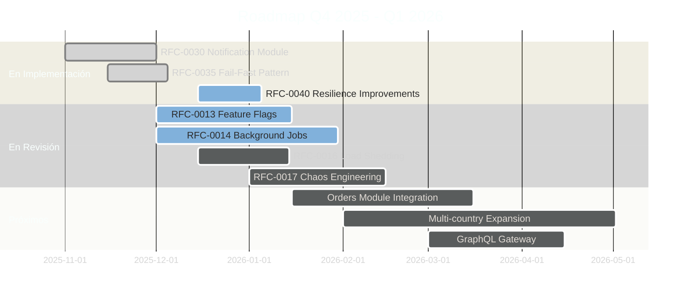

## 📈 Métricas y Roadmap

> Estado actual y planes futuros

⬇️ _Navega hacia abajo para ver detalles_

Note:
Veamos el estado actual del proyecto y hacia dónde vamos.


----

### 📈 Métricas Clave

> Performance y cobertura actual

⬇️ _Navega hacia abajo para ver detalles_

Note:
Las métricas nos dicen qué tan bien está funcionando el sistema.
Sin métricas, no podemos mejorar - no sabemos qué optimizar.
Veamos cómo estamos actualmente.

----

<!-- .slide: data-background="#1c1c1c" data-background-transition="fade" -->

### Performance Actual

Note:
P50 es la latencia del percentil 50 - la mitad de las requests son más rápidas que esto.
P99 es el percentil 99 - el 99% de las requests son más rápidas que esto.
15ms P50 es MUY bueno - significa que típicamente respondemos en 15 milisegundos.
80ms P99 significa que incluso las requests más lentas responden en menos de 100ms.
El uptime 99.9% significa ~43 minutos de downtime permitido al mes.

- ⏱️ **Latencia P50**: ~15ms _(target: <50ms)_
- ⏱️ **Latencia P99**: ~80ms _(target: <200ms)_
- 📊 **Uptime**: 99.9%
- 🏗️ **Build Time**: ~2min
- 🧪 **Test Time**: ~45s

----

<!-- .slide: data-background="#181818" data-background-transition="fade" -->

### Cobertura de Tests

Note:
La cobertura de tests mide qué porcentaje del código está probado.
Nuestro target es 80% para código nuevo.
Pricing está al 80% - el más alto porque es crítico para el negocio.
Shared está al 65% - hay trabajo por hacer ahí.
Como juniors, pueden contribuir escribiendo tests para subir estos números.

- 📦 **Inventory**: ~75%
- 💰 **Pricing**: ~80%
- 📋 **Catalogue**: ~70%
- 🔧 **Shared**: ~65%

----

<!-- .slide: data-background="#181818" data-background-transition="fade" -->

### 🏋️ Load Testing con k6 (RFC-0005)

<div style="display: flex; gap: 20px; justify-content: center;">
<div style="flex: 1; max-width: 450px; background: #1a252f; padding: 15px; border-radius: 10px; border: 2px solid #9b59b6;">

**¿Qué es k6?**

Herramienta de load testing de Grafana Labs.
Escribimos tests en TypeScript que simulan usuarios.

**5 Tipos de Escenarios:**

| Tipo | Propósito |
|------|-----------|
| 🔥 **Smoke** | Verificar que funciona (1 VU) |
| 📈 **Load** | Carga normal (50 VU) |
| 💪 **Stress** | Encontrar límites (200 VU) |
| ⚡ **Spike** | Picos repentinos |
| 🕐 **Soak** | Estabilidad larga duración |

</div>
<div style="flex: 1; max-width: 450px; background: #1a252f; padding: 15px; border-radius: 10px; border: 2px solid #2ecc71;">

**Ejemplo: Test de Stock API**

```typescript
// k6/scenarios/stock-api.ts
import http from 'k6/http';
import { check } from 'k6';

export const options = {
  vus: 50,        // 50 usuarios virtuales
  duration: '2m', // durante 2 minutos
  thresholds: {
    http_req_duration: ['p95<200'], // p95 < 200ms
    http_req_failed: ['rate<0.01'], // <1% errores
  },
};

export default function () {
  const res = http.get(
    'https://api.example.com/v1/stock/SKU-001'
  );
  check(res, {
    'status 200': (r) => r.status === 200,
    'has stock': (r) => r.json('available') > 0,
  });
}
```

</div>
</div>

<p style="font-size: 0.5em; color: #95a5a6; margin-top: 5px;">Comando: pnpm nx run core-api:test:load • Thresholds basados en SLOs</p>

Note:
**Load Testing con k6 - RFC-0005**

**¿Por qué load testing?**

Sin load tests:
- Deploy "con los dedos cruzados"
- Performance bugs llegan a producción
- Sin baseline de capacidad

Con load tests:
- Gate de performance en CI
- Detecta regresiones automáticamente
- Datos concretos: "Soportamos 500 RPS con p95 < 200ms"

**Cómo correr:**

```bash
# Smoke test (rápido, verifica que funciona)
pnpm nx run core-api:test:load:smoke

# Load test (carga normal)
pnpm nx run core-api:test:load

# Stress test (encontrar límites)
pnpm nx run core-api:test:load:stress
```

**Thresholds (umbrales):**

Los tests FALLAN si no cumplen los thresholds:
- `http_req_duration: ['p95<200']` - 95% de requests < 200ms
- `http_req_failed: ['rate<0.01']` - Menos de 1% errores

**Integración CI:**

En PRs que tocan endpoints críticos, CI corre smoke test.
Si latency aumenta > 20%, el PR se bloquea.

----

### 🗺️ Roadmap

> Planificación 2025 - Estado Actual

⬇️ _Navega hacia abajo para ver detalles_

Note:
El roadmap muestra hacia dónde va el proyecto.
Los RFCs son propuestas formales de cambios grandes - requieren revisión antes de implementar.
Como juniors, pueden participar en RFCs - es excelente para aprender y proponer ideas.

----

<!-- .slide: data-background="#1c1c1c" data-background-transition="fade" -->

### Completado en 2025

Note:
Esto es lo que ya está hecho - el fundamento sobre el que trabajan.
Logging enterprise, patrones de resiliencia, caching, autorización...
Todo esto ya funciona. Su trabajo es usarlo y agregar features sobre esta base.

| RFC/Feature | Estado | Descripción |
|-------------|--------|-------------|
| RFC-0001 | ✅ Completado | Enterprise Logging (Pino) |
| RFC-0002 | ✅ Completado | Resilience Patterns |
| RFC-0003 | ✅ Completado | SRE & Error Budget |
| RFC-0010 | ✅ Completado | Fastify Migration |
| RFC-0015 | ✅ Completado | Advanced Caching |
| RFC-0018 | ✅ Completado | RBAC Authorization |
| RFC-0019 | ✅ Completado | Validated Configuration |
| RFC-0020 | ✅ Completado | Data Redaction |
| RFC-0022 | ✅ Completado | Jest → Vitest Migration |
| ADR-0003 | ✅ Completado | Cloud Pub/Sub Messaging |

----

<!-- .slide: data-background="#181818" data-background-transition="fade" -->

### En Desarrollo / Revisión



----

<!-- .slide: data-background="#1c1c1c" data-background-transition="fade" -->

### RFC-0040: Notification Resilience ✅

> Sistema de resiliencia enterprise-grade para notificaciones

**Los 3 problemas que resuelve:**

| Problema | Solución | ¿Por qué importa? |
|----------|----------|-------------------|
| 🔴 **Stuck PROCESSING** | Retry job detecta y recupera | Sin esto, notificaciones se pierden |
| 🔄 **Mensajes duplicados** | Idempotencia con Redis | Sin esto, clientes reciben emails duplicados |
| ⚡ **Race conditions** | Optimistic Locking | Sin esto, datos se corrompen |

Note:
RFC-0040 es un excelente ejemplo de mejora enterprise.
Cada solución sigue patrones de Google, Stripe y AWS.
Como juniors, van a trabajar con este código y es importante entenderlo.

----

<!-- .slide: data-background="#1c1c1c" data-background-transition="fade" -->

### Problema 1: Stuck PROCESSING 🔴

**¿Qué pasa cuando el worker crashea?**

```
┌─────────────────────────────────────────────────────────────────┐
│  SIN RFC-0040 (antes)                                           │
├─────────────────────────────────────────────────────────────────┤
│                                                                 │
│  T1: Worker recibe mensaje de Pub/Sub                          │
│  T2: Worker guarda estado PROCESSING ✓                         │
│  T3: Worker llama a Salesforce...                              │
│  T4: 💥 CRASH (OOM, deploy, timeout)                           │
│  T5: Notificación queda en PROCESSING... PARA SIEMPRE 🔴       │
│                                                                 │
│  ❌ El cliente NUNCA recibe su email                           │
│  ❌ No hay alerta, no hay recovery                              │
│                                                                 │
└─────────────────────────────────────────────────────────────────┘
```

Note:
Esto pasaba en producción. Si el worker crasheaba en el momento exacto, la notificación se perdía silenciosamente.
Es un edge case, pero en sistemas con millones de notificaciones, pasa.

----

<!-- .slide: data-background="#1c1c1c" data-background-transition="fade" -->

### Solución: Stuck Recovery Automático 🟢

```
┌─────────────────────────────────────────────────────────────────┐
│  CON RFC-0040 (ahora)                                           │
├─────────────────────────────────────────────────────────────────┤
│                                                                 │
│  T1: Worker crashea, notificación en PROCESSING                │
│                                                                 │
│  ... 5 minutos después ...                                      │
│                                                                 │
│  T2: Retry Job: "¿Hay notificaciones stuck > 5 min?"           │
│  T3: Retry Job: "Sí, encontré una en PROCESSING desde hace 7 min"│
│  T4: Retry Job: PROCESSING → FAILED (error: PROCESSING_TIMEOUT) │
│  T5: Retry Job: FAILED → RETRY_SCHEDULED                        │
│  T6: Pub/Sub recibe nuevo mensaje → Worker procesa → SENT 🟢   │
│                                                                 │
│  ✅ El cliente recibe su email (con un poco de delay)          │
│  ✅ Métricas alertan que hubo un stuck                          │
│                                                                 │
└─────────────────────────────────────────────────────────────────┘
```

**Archivos clave:**
- `notification-retry.service.ts` → `processStuckProcessing()`
- `notification.entity.ts` → `markAsFailedFromStuckProcessing()`

Note:
El retry job corre cada 2 minutos y busca notificaciones stuck.
5 minutos es el threshold: suficiente para que Salesforce responda, pero no tanto para perder tiempo.

----

<!-- .slide: data-background="#1c1c1c" data-background-transition="fade" -->

### Problema 2: Mensajes Duplicados 🔄

**¿Qué pasa cuando Pub/Sub reintenta?**

```
┌─────────────────────────────────────────────────────────────────┐
│  ESCENARIO: Pub/Sub reintenta porque no recibió ACK a tiempo   │
├─────────────────────────────────────────────────────────────────┤
│                                                                 │
│  T0: Pub/Sub envía mensaje → Worker A empieza a procesar       │
│  T1: Worker A tarda más de 60s (Salesforce lento)              │
│  T2: Pub/Sub: "No recibí ACK, reintento" → Worker B recibe     │
│  T3: Worker B procesa el MISMO mensaje                          │
│  T4: Worker A termina → envía email                             │
│  T5: Worker B termina → envía OTRO email                        │
│                                                                 │
│  ❌ Cliente recibe 2 emails idénticos 😱                       │
│                                                                 │
└─────────────────────────────────────────────────────────────────┘
```

Note:
Pub/Sub garantiza "at-least-once", NO "exactly-once".
Por eso nosotros debemos implementar idempotencia.

----

<!-- .slide: data-background="#1c1c1c" data-background-transition="fade" -->

### Solución: Idempotencia con Redis 🟢

```typescript
// pubsub.controller.ts - Cómo funciona

const idempotencyKey = `notification:process:${notificationId}:${pubsubMessageId}`;
const TTL = 24 * 60 * 60; // 24 horas (igual que Stripe)

const result = await this.idempotentHandler.processOnce(
  idempotencyKey,
  async () => {
    // Procesar notificación
    return await this.processNotification(notification);
  },
  TTL
);

if (result === null) {
  // Ya procesamos este mensaje antes - ignorar
  return { success: true, deduplicated: true };
}
```

**¿Cómo funciona?**

1. Antes de procesar, Redis guarda: `"notif:xyz:msg:123" = "processing"`
2. Si otro worker intenta procesar el mismo mensaje, Redis dice: "Ya existe"
3. El segundo worker responde `deduplicated: true` y no hace nada

Note:
Es el mismo patrón que usa Stripe para sus Idempotency Keys.
El TTL de 24 horas es suficiente para cubrir cualquier reintento de Pub/Sub.

----

<!-- .slide: data-background="#1c1c1c" data-background-transition="fade" -->

### Problema 3: Race Conditions ⚡

**¿Qué pasa cuando dos workers actualizan la misma notificación?**

```
┌─────────────────────────────────────────────────────────────────┐
│  ESCENARIO: Dos workers leen la misma notificación              │
├─────────────────────────────────────────────────────────────────┤
│                                                                 │
│  T0: Worker A lee notificación (version: 1)                     │
│  T1: Worker B lee notificación (version: 1)                     │
│  T2: Worker A: status = SENT, guarda (version: 1 → 2)          │
│  T3: Worker B: status = FAILED, guarda (version: 1 → 2)        │
│                                                                 │
│  ❌ Worker B sobrescribió el SENT de Worker A                  │
│  ❌ La notificación queda en FAILED aunque SÍ se envió         │
│                                                                 │
└─────────────────────────────────────────────────────────────────┘
```

Note:
Esto se llama "lost update" y es un problema clásico de concurrencia.
Es raro, pero con suficiente tráfico, pasa.

----

<!-- .slide: data-background="#1c1c1c" data-background-transition="fade" -->

### Solución: Optimistic Locking 🟢

```typescript
// mongo-notification.repository.ts - Compare-and-Swap

async save(notification: Notification): Promise<void> {
  const currentVersion = notification.version ?? 0;
  const newVersion = currentVersion + 1;

  const result = await this.model.findOneAndUpdate(
    {
      notificationId: notification.id,
      version: currentVersion  // ← Solo actualiza si version coincide
    },
    { $set: { ...data, version: newVersion } },
    { new: true }
  );

  if (!result) {
    // Alguien más actualizó primero
    throw new OptimisticLockError(notification.id, currentVersion);
  }
}
```

**Si hay conflicto:**
1. Se lanza `OptimisticLockError`
2. El worker relee la notificación
3. Intenta guardar de nuevo (máximo 3 intentos)

Note:
Esto se llama "Compare-and-Swap" o CAS.
Es el mismo patrón que usan las bases de datos para transacciones.

----

<!-- .slide: data-background="#1c1c1c" data-background-transition="fade" -->

### Resumen Visual RFC-0040

```
┌─────────────────────────────────────────────────────────────────┐
│                    CAPAS DE PROTECCIÓN                          │
├─────────────────────────────────────────────────────────────────┤
│                                                                 │
│   ┌───────────────┐  ┌───────────────┐  ┌───────────────┐      │
│   │   STUCK       │  │  IDEMPOTENCIA │  │  OPTIMISTIC   │      │
│   │   RECOVERY    │  │  (Redis)      │  │  LOCKING      │      │
│   │               │  │               │  │               │      │
│   │  Detecta en   │  │  Previene     │  │  Previene     │      │
│   │  5 minutos    │  │  duplicados   │  │  lost updates │      │
│   │               │  │               │  │               │      │
│   │  🔄 Retry     │  │  🔑 Key+TTL   │  │  📊 Version   │      │
│   └───────────────┘  └───────────────┘  └───────────────┘      │
│          │                   │                   │              │
│          └───────────────────┴───────────────────┘              │
│                              │                                   │
│                              ▼                                   │
│                 ┌─────────────────────────┐                     │
│                 │  Notificación Resiliente │                     │
│                 │  🛡️ Exactly-Once         │                     │
│                 └─────────────────────────┘                     │
│                                                                 │
└─────────────────────────────────────────────────────────────────┘
```

**Para juniors**: Si trabajan en notificaciones, estas 3 capas los protegen de errores comunes.

Note:
Esto es enterprise-grade. Combina patrones de Google, Stripe y AWS.
No necesitan entender todo al principio, pero sepan que están protegidos.

----

<!-- .slide: data-background="#1c1c1c" data-background-transition="fade" -->

### RFC-0040: Dashboard de Monitoreo

El dashboard de Grafana tiene una sección dedicada a RFC-0040:

| Panel | Qué muestra | Cuándo preocuparse |
|-------|-------------|-------------------|
| 🔄 **Stuck Recuperadas** | Notificaciones que el retry job rescató | Si > 10 en una hora, revisar salud del worker |
| 🔁 **Deduplicados** | Mensajes duplicados detectados | Normal tener algunos, preocuparse si > 50/hora |
| 🔒 **Conflictos de Locking** | Race conditions detectadas | Si > 20, hay mucha concurrencia |
| ✅ **Tasa Resolución** | % de conflictos resueltos | Debe ser ~100%, si < 90% hay problema |

**Runbook**: `docs/runbooks/notification-failures.md`

Note:
Cuando vean estas métricas en Grafana, ahora saben qué significan.
El runbook tiene pasos exactos para cada escenario de fallo.

----

<!-- .slide: data-background="#1c1c1c" data-background-transition="fade" -->

### RFC-0040: Archivos Importantes

Si necesitan debuggear notificaciones, estos son los archivos clave:

```
DOMINIO (Reglas de negocio)
├── notification.entity.ts        → markAsFailedFromStuckProcessing()
├── notification.errors.ts        → OptimisticLockError
└── notification.repository.interface.ts → findStuckInProcessing()

INFRAESTRUCTURA (Base de datos)
└── mongo-notification.repository.ts → Optimistic locking en save()

APLICACIÓN (Casos de uso)
└── notification-retry.service.ts → processStuckProcessing()

WORKER (Controlador HTTP)
├── pubsub.controller.ts          → Idempotencia
├── notification-processor.service.ts → saveWithOptimisticLockRetry()
└── idempotency/idempotency.module.ts → Adapter para Redis
```

Note:
Si algo falla, empiecen buscando en estos archivos.
La mayoría de los errores de resiliencia están en el retry service o el controller.

----

<!-- .slide: data-background="#1c1c1c" data-background-transition="fade" -->

### Estadísticas del Proyecto

```
┌─────────────────────────────────────────────────────┐
│              PROJECT STATISTICS                     │
│                                                     │
│  📁 Archivos TypeScript:     853                   │
│  🧪 Archivos de Test:        305                   │
│  📚 Documentos RFC/ADR:      102 (67 ADRs + 35 RFCs)│
│  📦 Proyectos Nx:            17                    │
│                                                     │
│  🏗️ Apps:                    6                     │
│  📚 Libs:                    17+                   │
│                                                     │
│  ⚡ Build Time:              ~2 min                │
│  🧪 Test Time:               ~45s                  │
│  📊 Coverage Target:         ≥80%                  │
└─────────────────────────────────────────────────────┘
```
